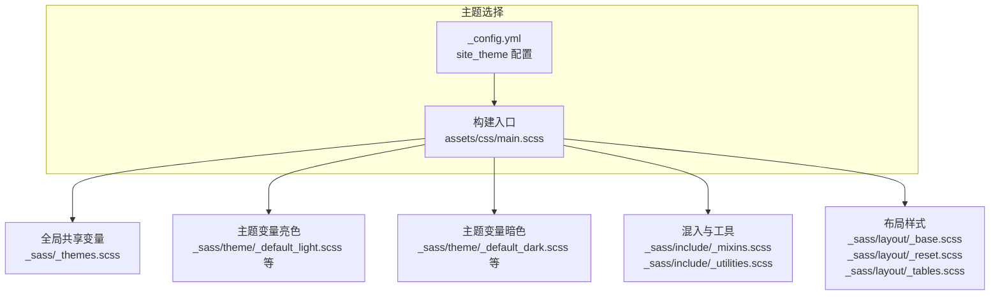
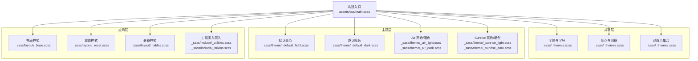
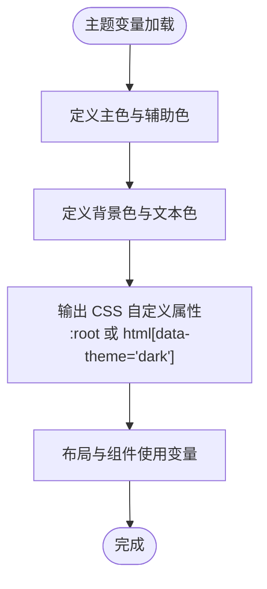
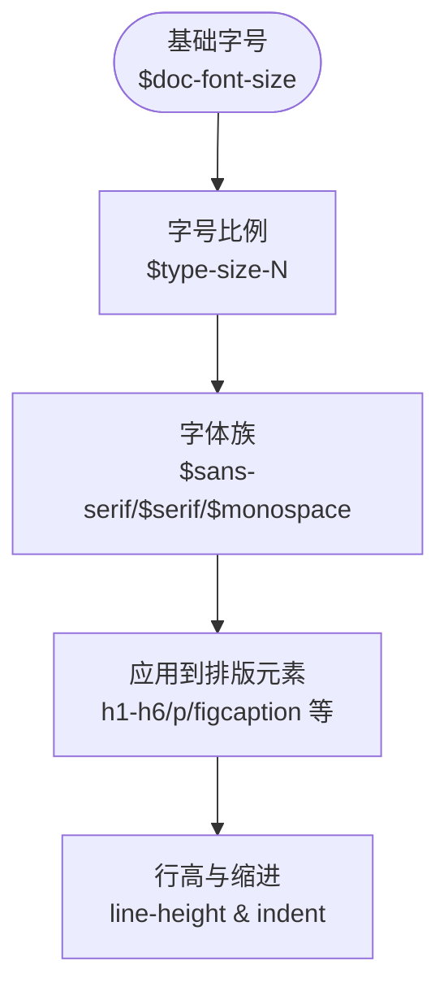
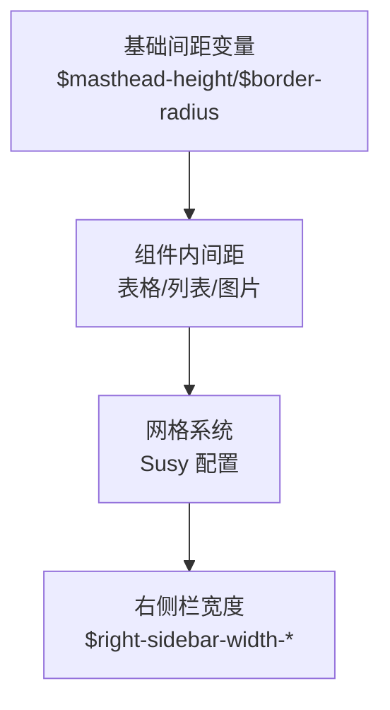
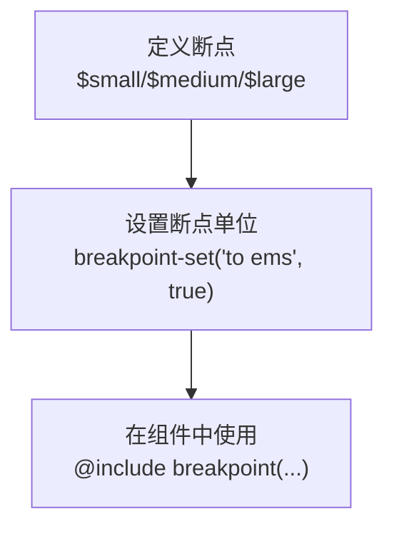
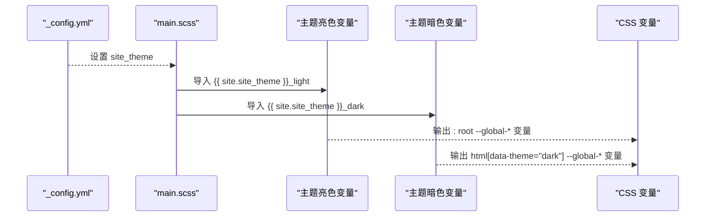
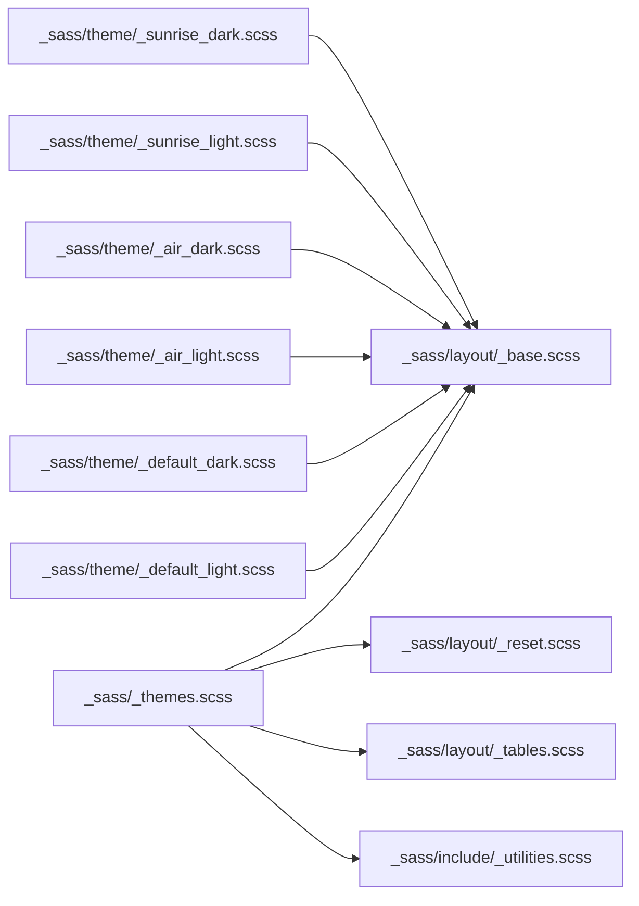

# SCSS 变量系统

<cite>
**本文档引用的文件**
- [_sass/_themes.scss](file://_sass/_themes.scss)
- [_sass/theme/_default_light.scss](file://_sass/theme/_default_light.scss)
- [_sass/theme/_default_dark.scss](file://_sass/theme/_default_dark.scss)
- [_sass/theme/_air_light.scss](file://_sass/theme/_air_light.scss)
- [_sass/theme/_air_dark.scss](file://_sass/theme/_air_dark.scss)
- [_sass/theme/_sunrise_light.scss](file://_sass/theme/_sunrise_light.scss)
- [_sass/theme/_sunrise_dark.scss](file://_sass/theme/_sunrise_dark.scss)
- [_sass/include/_mixins.scss](file://_sass/include/_mixins.scss)
- [_sass/include/_utilities.scss](file://_sass/include/_utilities.scss)
- [_sass/layout/_base.scss](file://_sass/layout/_base.scss)
- [_sass/layout/_reset.scss](file://_sass/layout/_reset.scss)
- [_sass/layout/_tables.scss](file://_sass/layout/_tables.scss)
- [assets/css/main.scss](file://assets/css/main.scss)
- [_config.yml](file://_config.yml)
</cite>

## 目录
1. [简介](#简介)
2. [项目结构](#项目结构)
3. [核心组件](#核心组件)
4. [架构总览](#架构总览)
5. [详细组件分析](#详细组件分析)
6. [依赖关系分析](#依赖关系分析)
7. [性能考量](#性能考量)
8. [故障排查指南](#故障排查指南)
9. [结论](#结论)
10. [附录](#附录)

## 简介
本文件系统性梳理了该 Jekyll 主题中的 SCSS 变量体系，涵盖变量层次结构与命名规范、颜色系统、字体系统、间距与网格、断点系统、主题切换机制以及变量覆盖策略，并提供最佳实践与性能优化建议。目标是帮助开发者在不直接阅读源码的情况下，也能快速理解并正确使用变量系统。

## 项目结构
变量系统主要由以下几类文件构成：
- 全局共享变量：集中定义字体、字号、断点、网格等基础变量
- 主题变量：按主题（如 default、air、sunrise）分别定义主色、背景、文本、链接等
- 布局与工具：通过变量驱动布局、表格、工具类等样式
- 构建入口：统一导入变量与模块，控制编译顺序与作用域

图表来源
- [assets/css/main.scss:11-43](file://assets/css/main.scss#L11-L43)
- [_sass/_themes.scss:1-104](file://_sass/_themes.scss#L1-L104)
- [_sass/theme/_default_light.scss:1-49](file://_sass/theme/_default_light.scss#L1-L49)
- [_sass/theme/_default_dark.scss:1-57](file://_sass/theme/_default_dark.scss#L1-L57)
- [_sass/include/_mixins.scss:1-53](file://_sass/include/_mixins.scss#L1-L53)
- [_sass/include/_utilities.scss:1-501](file://_sass/include/_utilities.scss#L1-L501)
- [_sass/layout/_base.scss:1-365](file://_sass/layout/_base.scss#L1-L365)
- [_sass/layout/_reset.scss:1-179](file://_sass/layout/_reset.scss#L1-L179)
- [_sass/layout/_tables.scss:1-38](file://_sass/layout/_tables.scss#L1-L38)
- [_config.yml:10](file://_config.yml#L10)

章节来源
- [assets/css/main.scss:11-43](file://assets/css/main.scss#L11-L43)
- [_sass/_themes.scss:1-104](file://_sass/_themes.scss#L1-L104)
- [_config.yml:10](file://_config.yml#L10)

## 核心组件
- 全局共享变量层：定义字体族、字号比例、断点、网格参数、品牌色等
- 主题变量层：为每个主题提供主色、背景、文本、链接、阴影、过渡等变量，并输出 CSS 自定义属性以支持主题切换
- 布局与工具层：通过变量驱动排版、表格、导航图标、模态框等组件
- 混入与工具：提供通用函数与混入，如 em 计算、clearfix 等

章节来源
- [_sass/_themes.scss:1-104](file://_sass/_themes.scss#L1-L104)
- [_sass/theme/_default_light.scss:1-49](file://_sass/theme/_default_light.scss#L1-L49)
- [_sass/theme/_default_dark.scss:1-57](file://_sass/theme/_default_dark.scss#L1-L57)
- [_sass/include/_mixins.scss:1-53](file://_sass/include/_mixins.scss#L1-L53)
- [_sass/include/_utilities.scss:1-501](file://_sass/include/_utilities.scss#L1-L501)
- [_sass/layout/_base.scss:1-365](file://_sass/layout/_base.scss#L1-L365)
- [_sass/layout/_reset.scss:1-179](file://_sass/layout/_reset.scss#L1-L179)
- [_sass/layout/_tables.scss:1-38](file://_sass/layout/_tables.scss#L1-L38)

## 架构总览
变量系统采用“共享变量 + 主题变量 + 布局/工具”的分层设计，通过构建入口统一导入，确保变量在编译时被正确解析与覆盖。

图表来源
- [assets/css/main.scss:11-43](file://assets/css/main.scss#L11-L43)
- [_sass/_themes.scss:1-104](file://_sass/_themes.scss#L1-L104)
- [_sass/theme/_default_light.scss:1-49](file://_sass/theme/_default_light.scss#L1-L49)
- [_sass/theme/_default_dark.scss:1-57](file://_sass/theme/_default_dark.scss#L1-L57)
- [_sass/theme/_air_light.scss:1-56](file://_sass/theme/_air_light.scss#L1-L56)
- [_sass/theme/_air_dark.scss:1-57](file://_sass/theme/_air_dark.scss#L1-L57)
- [_sass/theme/_sunrise_light.scss:1-64](file://_sass/theme/_sunrise_light.scss#L1-L64)
- [_sass/theme/_sunrise_dark.scss:1-59](file://_sass/theme/_sunrise_dark.scss#L1-L59)
- [_sass/layout/_base.scss:1-365](file://_sass/layout/_base.scss#L1-L365)
- [_sass/layout/_reset.scss:1-179](file://_sass/layout/_reset.scss#L1-L179)
- [_sass/layout/_tables.scss:1-38](file://_sass/layout/_tables.scss#L1-L38)
- [_sass/include/_utilities.scss:1-501](file://_sass/include/_utilities.scss#L1-L501)
- [_sass/include/_mixins.scss:1-53](file://_sass/include/_mixins.scss#L1-L53)

## 详细组件分析

### 变量层次结构与命名规范
- 层次结构
  - 共享层：全局字体、字号、断点、网格、品牌色等
  - 主题层：各主题的主色、背景、文本、链接、阴影、过渡等
  - 应用层：布局、表格、工具类等基于变量进行样式化
- 命名规范
  - 字体与字号：使用语义化前缀如 $global-font-family、$header-font-family、$type-size-N
  - 断点：$small、$medium、$large、$x-large 等
  - 颜色：$primary-color、$danger-color、$info-color 等；主题内带 $light-*、$dark-* 辅助变体
  - 其他：$border-radius、$box-shadow、$global-transition、$masthead-height 等

章节来源
- [_sass/_themes.scss:16-44](file://_sass/_themes.scss#L16-L44)
- [_sass/_themes.scss:52-56](file://_sass/_themes.scss#L52-L56)
- [_sass/_themes.scss:33-40](file://_sass/_themes.scss#L33-L40)
- [_sass/theme/_default_light.scss:5-27](file://_sass/theme/_default_light.scss#L5-L27)
- [_sass/theme/_default_dark.scss:6-35](file://_sass/theme/_default_dark.scss#L6-L35)

### 颜色变量系统
- 主色调与辅助色
  - 主色调：$primary-color 在各主题中定义，用于强调、链接 hover 等
  - 辅助色：$danger-color、$info-color、$success-color、$warning-color 等用于状态与提示
  - 文本与边框：$text、$link、$link-dark、$link-light、$border-color 等
- 背景色与页脚色
  - $background、$background-light、$background-lighter 等用于页面与容器背景
  - $footer（部分主题）用于页脚区域
- CSS 自定义属性映射
  - 亮色主题通过 :root 输出 --global-* 变量
  - 暗色主题通过 html[data-theme="dark"] 输出 --global-* 变量
- 品牌色集合
  - $behance-color、$bluesky-color、$facebook-color 等用于社交图标着色

图表来源
- [_sass/theme/_default_light.scss:30-47](file://_sass/theme/_default_light.scss#L30-L47)
- [_sass/theme/_default_dark.scss:38-55](file://_sass/theme/_default_dark.scss#L38-L55)
- [_sass/_themes.scss:81-104](file://_sass/_themes.scss#L81-L104)

章节来源
- [_sass/theme/_default_light.scss:5-27](file://_sass/theme/_default_light.scss#L5-L27)
- [_sass/theme/_default_dark.scss:6-35](file://_sass/theme/_default_dark.scss#L6-L35)
- [_sass/_themes.scss:81-104](file://_sass/_themes.scss#L81-L104)

### 字体变量系统
- 字体族
  - $sans-serif、$serif、$monospace 等系统字体族
  - $helvetica、$georgia、$times、$bodoni、$calisto、$garamond 等具体字体族
- 字号与字号比例
  - $doc-font-size 定义基准字号
  - $type-size-1 至 $type-size-8 定义标题与正文的字号比例
- 字体应用
  - $global-font-family、$header-font-family、$caption-font-family 分别用于正文、标题、说明文字
- 行高与缩进
  - body 行高为 1.5；段落缩进开关与缩进宽度由 $paragraph-indent 与 $indent-var 控制

图表来源
- [_sass/_themes.scss:10](file://_sass/_themes.scss#L10)
- [_sass/_themes.scss:33-40](file://_sass/_themes.scss#L33-L40)
- [_sass/_themes.scss:17-30](file://_sass/_themes.scss#L17-L30)
- [_sass/layout/_base.scss:19](file://_sass/layout/_base.scss#L19)
- [_sass/layout/_base.scss:13](file://_sass/layout/_base.scss#L13)

章节来源
- [_sass/_themes.scss:10-44](file://_sass/_themes.scss#L10-L44)
- [_sass/layout/_base.scss:19](file://_sass/layout/_base.scss#L19)

### 间距变量系统
- 间距来源
  - $masthead-height 用于页面顶部留白
  - $border-radius、$box-shadow 用于圆角与阴影
  - $navicon-width、$navicon-height 用于导航图标尺寸
- 组件内间距
  - 表格单元格内边距、列表项间距、图片与视频容器间距等
- 网格与栅格
  - Susy 配置：列数、列宽、 gutter、容器宽度、盒模型等
  - 右侧栏宽度变量（narrow/wide）

图表来源
- [_sass/_themes.scss:20](file://_sass/_themes.scss#L20)
- [_sass/_themes.scss:66-75](file://_sass/_themes.scss#L66-L75)
- [_sass/layout/_tables.scss:24-34](file://_sass/layout/_tables.scss#L24-L34)
- [_sass/layout/_base.scss:16](file://_sass/layout/_base.scss#L16)

章节来源
- [_sass/_themes.scss:20](file://_sass/_themes.scss#L20)
- [_sass/_themes.scss:66-75](file://_sass/_themes.scss#L66-L75)
- [_sass/layout/_tables.scss:24-34](file://_sass/layout/_tables.scss#L24-L34)
- [_sass/layout/_base.scss:16](file://_sass/layout/_base.scss#L16)

### 断点变量系统
- 断点定义
  - $small、$medium、$medium-wide、$large、$x-large
- 断点设置
  - 通过 @include breakpoint-set("to ems", true) 将断点转换为 em
- 使用方式
  - 在布局与工具类中通过 @include breakpoint($small/$large) 等进行响应式控制

图表来源
- [_sass/_themes.scss:50](file://_sass/_themes.scss#L50)
- [_sass/_themes.scss:52-56](file://_sass/_themes.scss#L52-L56)
- [_sass/include/_utilities.scss:140](file://_sass/include/_utilities.scss#L140)
- [_sass/layout/_base.scss:223](file://_sass/layout/_base.scss#L223)

章节来源
- [_sass/_themes.scss:50-56](file://_sass/_themes.scss#L50-L56)
- [_sass/include/_utilities.scss:140-173](file://_sass/include/_utilities.scss#L140-L173)
- [_sass/layout/_base.scss:223-244](file://_sass/layout/_base.scss#L223-L244)

### 变量覆盖与主题切换机制
- 主题选择
  - 通过 _config.yml 的 site_theme 选择主题（默认 default）
  - 构建入口根据 site_theme 动态导入对应主题的亮色与暗色变量文件
- 变量覆盖
  - 后导入的变量会覆盖先前定义的同名变量，从而实现主题覆盖
- 主题切换
  - 亮色主题通过 :root 输出 CSS 变量
  - 暗色主题通过 html[data-theme="dark"] 输出 CSS 变量
  - 运行时切换 data-theme 即可切换主题

图表来源
- [_config.yml:10](file://_config.yml#L10)
- [assets/css/main.scss:14-16](file://assets/css/main.scss#L14-L16)
- [_sass/theme/_default_light.scss:30-47](file://_sass/theme/_default_light.scss#L30-L47)
- [_sass/theme/_default_dark.scss:38-55](file://_sass/theme/_default_dark.scss#L38-L55)

章节来源
- [_config.yml:10](file://_config.yml#L10)
- [assets/css/main.scss:14-16](file://assets/css/main.scss#L14-L16)
- [_sass/theme/_default_light.scss:30-47](file://_sass/theme/_default_light.scss#L30-L47)
- [_sass/theme/_default_dark.scss:38-55](file://_sass/theme/_default_dark.scss#L38-L55)

### 变量使用的最佳实践
- 优先使用共享变量与主题变量，避免硬编码值
- 在组件中统一通过变量引用，保证视觉一致性
- 使用 em 函数进行相对单位换算，提升可访问性
- 利用断点变量与 Susy 网格，保持响应式一致性
- 通过 CSS 变量实现主题切换，减少重复样式

章节来源
- [_sass/include/_mixins.scss:17-19](file://_sass/include/_mixins.scss#L17-L19)
- [_sass/_themes.scss:66-75](file://_sass/_themes.scss#L66-L75)
- [_sass/layout/_base.scss:19](file://_sass/layout/_base.scss#L19)

## 依赖关系分析
变量系统的关键依赖链如下：
- 构建入口 main.scss 依赖全局共享变量与主题变量
- 布局与工具层依赖共享变量与主题变量
- 主题变量依赖共享变量（如 $primary-color、$gray 等）

图表来源
- [assets/css/main.scss:11-43](file://assets/css/main.scss#L11-L43)
- [_sass/_themes.scss:1-104](file://_sass/_themes.scss#L1-L104)
- [_sass/layout/_base.scss:1-365](file://_sass/layout/_base.scss#L1-L365)
- [_sass/layout/_reset.scss:1-179](file://_sass/layout/_reset.scss#L1-L179)
- [_sass/layout/_tables.scss:1-38](file://_sass/layout/_tables.scss#L1-L38)
- [_sass/include/_utilities.scss:1-501](file://_sass/include/_utilities.scss#L1-L501)
- [_sass/theme/_default_light.scss:1-49](file://_sass/theme/_default_light.scss#L1-L49)
- [_sass/theme/_default_dark.scss:1-57](file://_sass/theme/_default_dark.scss#L1-L57)
- [_sass/theme/_air_light.scss:1-56](file://_sass/theme/_air_light.scss#L1-L56)
- [_sass/theme/_air_dark.scss:1-57](file://_sass/theme/_air_dark.scss#L1-L57)
- [_sass/theme/_sunrise_light.scss:1-64](file://_sass/theme/_sunrise_light.scss#L1-L64)
- [_sass/theme/_sunrise_dark.scss:1-59](file://_sass/theme/_sunrise_dark.scss#L1-L59)

章节来源
- [assets/css/main.scss:11-43](file://assets/css/main.scss#L11-L43)
- [_sass/_themes.scss:1-104](file://_sass/_themes.scss#L1-L104)
- [_sass/layout/_base.scss:1-365](file://_sass/layout/_base.scss#L1-L365)
- [_sass/layout/_reset.scss:1-179](file://_sass/layout/_reset.scss#L1-L179)
- [_sass/layout/_tables.scss:1-38](file://_sass/layout/_tables.scss#L1-L38)
- [_sass/include/_utilities.scss:1-501](file://_sass/include/_utilities.scss#L1-L501)
- [_sass/theme/_default_light.scss:1-49](file://_sass/theme/_default_light.scss#L1-L49)
- [_sass/theme/_default_dark.scss:1-57](file://_sass/theme/_default_dark.scss#L1-L57)
- [_sass/theme/_air_light.scss:1-56](file://_sass/theme/_air_light.scss#L1-L56)
- [_sass/theme/_air_dark.scss:1-57](file://_sass/theme/_air_dark.scss#L1-L57)
- [_sass/theme/_sunrise_light.scss:1-64](file://_sass/theme/_sunrise_light.scss#L1-L64)
- [_sass/theme/_sunrise_dark.scss:1-59](file://_sass/theme/_sunrise_dark.scss#L1-L59)

## 性能考量
- 编译体积控制
  - 使用压缩输出样式（sass.style: compressed），减少 CSS 体积
  - 合理拆分变量与模块，避免重复导入
- 运行时性能
  - CSS 变量切换主题成本低，避免频繁重绘
  - 使用 em 单位与相对排版，提升可访问性与跨设备适配能力
- 可维护性
  - 通过变量覆盖与主题分离，降低修改成本
  - 断点与网格统一管理，减少响应式样式碎片化

章节来源
- [_config.yml:296-299](file://_config.yml#L296-L299)

## 故障排查指南
- 主题未生效
  - 检查 _config.yml 中 site_theme 是否正确设置
  - 确认 main.scss 中已导入对应主题变量文件
- 样式错乱或颜色异常
  - 检查变量覆盖顺序，后导入的变量会覆盖先前定义
  - 确认 :root 与 html[data-theme="dark"] 的 CSS 变量是否正确输出
- 响应式失效
  - 检查断点变量与 breakpoint-set 的配置
  - 确认组件中是否正确使用 @include breakpoint($size)

章节来源
- [_config.yml:10](file://_config.yml#L10)
- [assets/css/main.scss:14-16](file://assets/css/main.scss#L14-L16)
- [_sass/_themes.scss:50](file://_sass/_themes.scss#L50)
- [_sass/theme/_default_light.scss:30-47](file://_sass/theme/_default_light.scss#L30-L47)
- [_sass/theme/_default_dark.scss:38-55](file://_sass/theme/_default_dark.scss#L38-L55)

## 结论
该 SCSS 变量系统通过“共享变量 + 主题变量 + 布局/工具”的分层设计，实现了清晰的层次结构与良好的可扩展性。借助 CSS 变量与断点系统，主题切换与响应式布局得以高效实现。遵循变量覆盖与命名规范，可在保证一致性的同时提升开发效率与可维护性。

## 附录
- 变量覆盖顺序示例（概念示意）
  - 共享变量 → 主题变量（亮色） → 主题变量（暗色） → 布局/工具
  - 后导入者覆盖先导入者，确保主题变量优先级最高

[本节为概念性说明，无需代码来源]