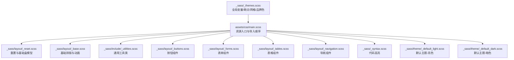
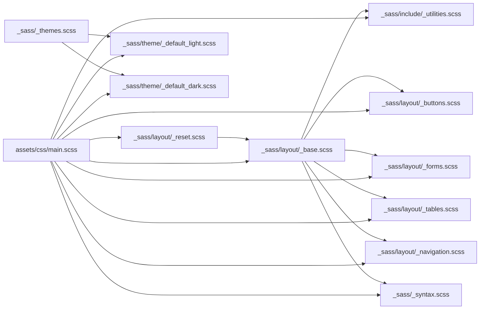
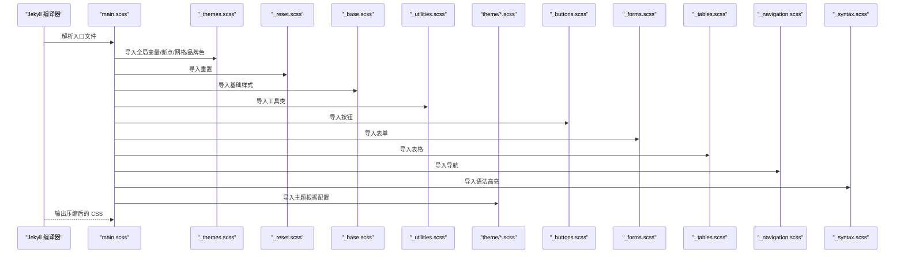
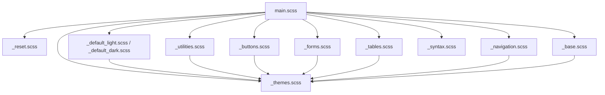

# SCSS 架构详解

<cite>
**本文引用的文件**
- [main.scss](file://assets/css/main.scss)
- [_themes.scss](file://_sass/_themes.scss)
- [_mixins.scss](file://_sass/include/_mixins.scss)
- [_utilities.scss](file://_sass/include/_utilities.scss)
- [_reset.scss](file://_sass/layout/_reset.scss)
- [_base.scss](file://_sass/layout/_base.scss)
- [_buttons.scss](file://_sass/layout/_buttons.scss)
- [_forms.scss](file://_sass/layout/_forms.scss)
- [_tables.scss](file://_sass/layout/_tables.scss)
- [_navigation.scss](file://_sass/layout/_navigation.scss)
- [_default_light.scss](file://_sass/theme/_default_light.scss)
- [_default_dark.scss](file://_sass/theme/_default_dark.scss)
- [_syntax.scss](file://_sass/_syntax.scss)
- [_config.yml](file://_config.yml)
- [package.json](file://package.json)
</cite>

## 目录
1. [引言](#引言)
2. [项目结构](#项目结构)
3. [核心组件](#核心组件)
4. [架构总览](#架构总览)
5. [详细组件分析](#详细组件分析)
6. [依赖分析](#依赖分析)
7. [性能考虑](#性能考虑)
8. [故障排查指南](#故障排查指南)
9. [结论](#结论)
10. [附录](#附录)

## 引言
本文件面向需要深入理解与维护该 Jekyll 主题 SCSS 架构的工程师与设计师，系统性解析样式组织结构、模块化设计原则、变量体系、断点与网格系统、混入与工具类、编译流程与优化策略。重点覆盖以下方面：
- SCSS 目录组织与模块化原则：按“重置/基础 → 布局组件 → 主题 → 工具/混入”的层次展开
- _sass/layout/ 各样式文件的功能边界与职责划分
- _sass/include/ 混入与工具类的使用方式与最佳实践
- main.scss 的编译顺序与依赖关系
- 变量定义体系（颜色、字体、间距、阴影、导航图标等）
- 断点系统与响应式实现机制
- 样式优先级与层叠规则说明
- SCSS 编译配置与优化建议

## 项目结构
该主题采用“分层 + 功能域”相结合的 SCSS 组织方式：
- 资源入口：assets/css/main.scss 控制所有导入顺序与依赖
- 共享变量与断点：_sass/_themes.scss 定义全局变量、断点、网格与品牌色
- 基础与重置：_sass/layout/_reset.scss 与 _sass/layout/_base.scss 提供浏览器一致性与基础排版
- 布局组件：_sass/layout/ 下按功能拆分（按钮、表单、表格、导航、页脚、侧边栏等）
- 主题：_sass/theme/ 下按主题与明暗模式拆分，通过 CSS 自定义属性实现动态切换
- 工具与混入：_sass/include/ 提供混入与通用工具类
- 语法高亮：_sass/_syntax.scss 管理代码块样式

图表来源
- [main.scss:11-42](file://assets/css/main.scss#L11-L42)
- [_themes.scss:1-104](file://_sass/_themes.scss#L1-L104)
- [_reset.scss:1-179](file://_sass/layout/_reset.scss#L1-L179)
- [_base.scss:1-365](file://_sass/layout/_base.scss#L1-L365)
- [_utilities.scss:1-501](file://_sass/include/_utilities.scss#L1-L501)
- [_buttons.scss:1-156](file://_sass/layout/_buttons.scss#L1-L156)
- [_forms.scss:1-391](file://_sass/layout/_forms.scss#L1-L391)
- [_tables.scss:1-38](file://_sass/layout/_tables.scss#L1-L38)
- [_navigation.scss:1-527](file://_sass/layout/_navigation.scss#L1-L527)
- [_default_light.scss:1-49](file://_sass/theme/_default_light.scss#L1-L49)
- [_default_dark.scss:1-57](file://_sass/theme/_default_dark.scss#L1-L57)
- [_syntax.scss:1-125](file://_sass/_syntax.scss#L1-L125)

章节来源
- [main.scss:11-42](file://assets/css/main.scss#L11-L42)
- [_themes.scss:1-104](file://_sass/_themes.scss#L1-L104)

## 核心组件
- 变量与断点系统：集中于 _sass/_themes.scss，定义字体、字号、断点、网格参数与品牌色
- 混入与工具类：_sass/include/_mixins.scss 提供 em 计算与 clearfix；_sass/include/_utilities.scss 提供可见性、对齐、图片、图标、导航图标、粘性容器、模态框、脚注、必填项等
- 基础与重置：_sass/layout/_reset.scss 统一盒模型、选择器、媒体与表单；_sass/layout/_base.scss 提供排版、链接、代码、列表、图片、导航列表与打印样式
- 组件库：按钮、表单、表格、导航、页脚、侧边栏、归档等
- 主题系统：_sass/theme/ 下以 CSS 自定义属性驱动明暗主题切换
- 语法高亮：_sass/_syntax.scss 统一代码块外观与 Solarized 配色

章节来源
- [_mixins.scss:1-53](file://_sass/include/_mixins.scss#L1-L53)
- [_utilities.scss:1-501](file://_sass/include/_utilities.scss#L1-L501)
- [_reset.scss:1-179](file://_sass/layout/_reset.scss#L1-L179)
- [_base.scss:1-365](file://_sass/layout/_base.scss#L1-L365)
- [_buttons.scss:1-156](file://_sass/layout/_buttons.scss#L1-L156)
- [_forms.scss:1-391](file://_sass/layout/_forms.scss#L1-L391)
- [_tables.scss:1-38](file://_sass/layout/_tables.scss#L1-L38)
- [_navigation.scss:1-527](file://_sass/layout/_navigation.scss#L1-L527)
- [_default_light.scss:1-49](file://_sass/theme/_default_light.scss#L1-L49)
- [_default_dark.scss:1-57](file://_sass/theme/_default_dark.scss#L1-L57)
- [_syntax.scss:1-125](file://_sass/_syntax.scss#L1-L125)

## 架构总览
整体遵循“自底向上”的模块化思路：
- 底层：重置与基础（_reset、_base）确保一致的浏览器基线
- 中层：布局组件（buttons、forms、tables、navigation 等）构建页面骨架
- 上层：主题（theme）与工具（include）提供可复用能力与视觉风格
- 入口：main.scss 按依赖顺序导入，形成稳定编译链路

图表来源
- [main.scss:11-42](file://assets/css/main.scss#L11-L42)
- [_themes.scss:1-104](file://_sass/_themes.scss#L1-L104)
- [_reset.scss:1-179](file://_sass/layout/_reset.scss#L1-L179)
- [_base.scss:1-365](file://_sass/layout/_base.scss#L1-L365)
- [_utilities.scss:1-501](file://_sass/include/_utilities.scss#L1-L501)
- [_buttons.scss:1-156](file://_sass/layout/_buttons.scss#L1-L156)
- [_forms.scss:1-391](file://_sass/layout/_forms.scss#L1-L391)
- [_tables.scss:1-38](file://_sass/layout/_tables.scss#L1-L38)
- [_navigation.scss:1-527](file://_sass/layout/_navigation.scss#L1-L527)
- [_syntax.scss:1-125](file://_sass/_syntax.scss#L1-L125)
- [_default_light.scss:1-49](file://_sass/theme/_default_light.scss#L1-L49)
- [_default_dark.scss:1-57](file://_sass/theme/_default_dark.scss#L1-L57)

## 详细组件分析

### 变量与断点系统
- 字体与字号：定义系统字体族、等宽字体、字号刻度与标题层级
- 断点：small、medium、medium-wide、large、x-large，配合 breakpoint-set 使用
- 网格：Susy 配置（列数、列宽、 gutter、math、输出模式、容器宽度等）
- 品牌色：社交平台色板，用于按钮与图标着色
- 主题色：主色、危险/成功/警告/信息色、圆角半径、阴影、过渡时长、导航图标尺寸、页眉高度等

章节来源
- [_themes.scss:1-104](file://_sass/_themes.scss#L1-L104)

### 混入与工具类
- 混入
  - em 函数：基于基准字号计算 rem/em
  - clearfix：清除浮动的标准实现
  - tab-focus：统一键盘焦点样式
- 工具类
  - 可见性与读屏友好：hidden、visually-hidden、screen-reader-text 等
  - 文本与对齐：text-left/right/center/justify、nowrap
  - 容器与换行：wrapper、wordwrap、cf（clearfix）
  - 图片与对齐：align-left/right/center，响应式断点下的浮动布局
  - 图标：icon、icon-pad-right，以及社交图标颜色映射
  - 导航图标：navicon、close 状态下的旋转动画
  - 粘性容器：sticky 在大屏生效
  - 简易模态框：show-modal 与 .modal 结构
  - 脚注：footnote、footnotes、reversefootnote
  - 必填项：required

章节来源
- [_mixins.scss:1-53](file://_sass/include/_mixins.scss#L1-L53)
- [_utilities.scss:1-501](file://_sass/include/_utilities.scss#L1-L501)

### 基础与重置（Reset/Base）
- Reset：统一盒模型、选择器、HTML5 元素显示、图片缩放、表单控件外观、链接焦点状态
- Base：全局文本颜色、背景、字体、行高、标题层级、小号文本、段落缩进、引用、链接、代码块、水平分割线、列表、图片与图注、导航列表、全局过渡动画、打印隐藏元素

章节来源
- [_reset.scss:1-179](file://_sass/layout/_reset.scss#L1-L179)
- [_base.scss:1-365](file://_sass/layout/_base.scss#L1-L365)

### 按钮组件（Buttons）
- 默认按钮：基础样式、悬停混合色、图标间距、块级按钮、反色/描边/信息/警告/成功/危险/禁用变体
- 社交按钮：基于品牌色的网络按钮集合
- 尺寸：x-large/large/default/small

章节来源
- [_buttons.scss:1-156](file://_sass/layout/_buttons.scss#L1-L156)

### 表单组件（Forms）
- 表单容器与字段集：边距、内边距、边框、标题样式
- 输入/选择/文本域：宽度、内边距、圆角、阴影、悬停与聚焦状态
- 单选/多选/文件/图像：特殊处理与尺寸
- 内联/搜索表单：布局与圆角
- 加载态：遮罩与 spinner
- Google 搜索框：兼容与继承按钮样式

章节来源
- [_forms.scss:1-391](file://_sass/layout/_forms.scss#L1-L391)

### 表格组件（Tables）
- 表格基础：宽度、字体、边框、间距
- 表头与单元格：背景、边框、对齐
- 连续表格间距

章节来源
- [_tables.scss:1-38](file://_sass/layout/_tables.scss#L1-L38)

### 导航组件（Navigation）
- 面包屑：容器、断点布局、列表样式、当前项强调
- 分页：上下一页与页码列表、圆角、禁用态
- 优先级导航：响应式折叠菜单、可见/隐藏列表、下拉三角
- 导航列表：标题、子标题、活动态强调
- 目录导航：TOC 样式、子级缩进、小屏隐藏次级链接
- 简单下拉菜单：触发器、菜单定位、活动态

章节来源
- [_navigation.scss:1-527](file://_sass/layout/_navigation.scss#L1-L527)

### 主题系统（Theme）
- 默认主题（亮/暗）：通过 SCSS 变量定义主色与语义色，再以 CSS 自定义属性注入到 :root 或 html[data-theme="dark"]，实现明暗主题切换
- 关键变量：主色、危险/成功/警告/信息色、圆角、阴影、过渡、页眉高度、导航图标尺寸、侧边栏最大宽度与最小宽度等

章节来源
- [_default_light.scss:1-49](file://_sass/theme/_default_light.scss#L1-L49)
- [_default_dark.scss:1-57](file://_sass/theme/_default_dark.scss#L1-L57)

### 语法高亮（Syntax）
- 代码块容器：边框、圆角、阴影、字号、前置标签
- Solarized 配色：按语言要素分类的颜色映射

章节来源
- [_syntax.scss:1-125](file://_sass/_syntax.scss#L1-L125)

### main.scss 编译流程与依赖关系
- 导入顺序严格控制层叠与覆盖关系，先 reset/base，再 include/utilities，然后各组件，最后主题与语法高亮
- 主题导入：根据站点配置选择主题与明暗版本，支持回退至默认主题
- 第三方库：breakpoint、susy、fontawesome

图表来源
- [main.scss:11-42](file://assets/css/main.scss#L11-L42)
- [_themes.scss:1-104](file://_sass/_themes.scss#L1-L104)
- [_reset.scss:1-179](file://_sass/layout/_reset.scss#L1-L179)
- [_base.scss:1-365](file://_sass/layout/_base.scss#L1-L365)
- [_utilities.scss:1-501](file://_sass/include/_utilities.scss#L1-L501)
- [_buttons.scss:1-156](file://_sass/layout/_buttons.scss#L1-L156)
- [_forms.scss:1-391](file://_sass/layout/_forms.scss#L1-L391)
- [_tables.scss:1-38](file://_sass/layout/_tables.scss#L1-L38)
- [_navigation.scss:1-527](file://_sass/layout/_navigation.scss#L1-L527)
- [_syntax.scss:1-125](file://_sass/_syntax.scss#L1-L125)
- [_default_light.scss:1-49](file://_sass/theme/_default_light.scss#L1-L49)
- [_default_dark.scss:1-57](file://_sass/theme/_default_dark.scss#L1-L57)

章节来源
- [main.scss:11-42](file://assets/css/main.scss#L11-L42)

## 依赖分析
- 入口依赖：main.scss 依赖 _themes.scss 提供的变量与断点，再依次导入 reset/base/utilities 与各组件
- 组件间耦合：组件之间低耦合，通过变量与混入间接共享能力
- 外部依赖：breakpoint、susy、fontawesome 由第三方库提供断点与网格、栅格与图标
- 主题依赖：主题通过 CSS 自定义属性与 SCSS 变量解耦，便于扩展新主题

图表来源
- [main.scss:11-42](file://assets/css/main.scss#L11-L42)
- [_themes.scss:1-104](file://_sass/_themes.scss#L1-L104)
- [_reset.scss:1-179](file://_sass/layout/_reset.scss#L1-L179)
- [_base.scss:1-365](file://_sass/layout/_base.scss#L1-L365)
- [_utilities.scss:1-501](file://_sass/include/_utilities.scss#L1-L501)
- [_buttons.scss:1-156](file://_sass/layout/_buttons.scss#L1-L156)
- [_forms.scss:1-391](file://_sass/layout/_forms.scss#L1-L391)
- [_tables.scss:1-38](file://_sass/layout/_tables.scss#L1-L38)
- [_navigation.scss:1-527](file://_sass/layout/_navigation.scss#L1-L527)
- [_syntax.scss:1-125](file://_sass/_syntax.scss#L1-L125)
- [_default_light.scss:1-49](file://_sass/theme/_default_light.scss#L1-L49)
- [_default_dark.scss:1-57](file://_sass/theme/_default_dark.scss#L1-L57)

章节来源
- [main.scss:11-42](file://assets/css/main.scss#L11-L42)

## 性能考虑
- 输出样式：Jekyll 配置中启用压缩输出，减少体积
- 代码分割：按功能域拆分 SCSS，避免重复导入与冗余样式
- 变量复用：通过 _themes.scss 集中管理断点与品牌色，降低维护成本
- 响应式策略：优先使用断点与 Susy 栅格，避免过度使用复杂选择器
- 语法高亮：仅在需要的页面加载，避免全局引入造成体积膨胀

章节来源
- [_config.yml:295-299](file://_config.yml#L295-L299)

## 故障排查指南
- 样式未生效
  - 检查 main.scss 导入顺序是否正确，确保 reset/base 在前
  - 确认主题导入路径与站点配置一致
- 响应式异常
  - 检查断点变量与 breakpoint 使用是否匹配
  - 确认 Susy 配置与容器宽度一致
- 按钮/表单样式错位
  - 对照组件文件确认类名与混入使用
  - 检查工具类是否被后续样式覆盖
- 明暗主题不切换
  - 确认 CSS 自定义属性是否正确注入
  - 检查 html/data-theme 属性或 :root 选择器是否被覆盖

章节来源
- [_themes.scss:46-75](file://_sass/_themes.scss#L46-L75)
- [_default_light.scss:30-47](file://_sass/theme/_default_light.scss#L30-L47)
- [_default_dark.scss:38-55](file://_sass/theme/_default_dark.scss#L38-L55)

## 结论
该 SCSS 架构以清晰的层次与模块化设计为核心，通过集中变量与断点、可复用混入与工具类、组件化的布局样式与主题系统，实现了高可维护性与强扩展性。遵循 main.scss 的导入顺序与 Jekyll 的压缩输出策略，可在保证开发体验的同时获得稳定的生产级样式输出。

## 附录

### 变量定义体系概览
- 字体与字号：系统字体族、等宽字体、字号刻度
- 断点：small、medium、medium-wide、large、x-large
- 网格：Susy 列数、列宽、gutter、math、输出模式、容器宽度、盒模型
- 主题色：主色、危险/成功/警告/信息色、圆角、阴影、过渡、页眉高度、导航图标尺寸、侧边栏约束
- 品牌色：社交平台色板

章节来源
- [_themes.scss:1-104](file://_sass/_themes.scss#L1-L104)

### 断点系统与响应式实现机制
- 断点声明与单位设置：统一以 em 为单位
- 断点使用：在工具类与组件中通过 @include breakpoint(...) 实现响应式行为
- 栅格系统：Susy 提供流式网格与列跨度计算

章节来源
- [_themes.scss:46-75](file://_sass/_themes.scss#L46-L75)
- [_utilities.scss:116-173](file://_sass/include/_utilities.scss#L116-L173)

### 样式优先级与层叠规则
- Reset/Base 优先：统一基础样式，避免浏览器默认差异
- 组件后于基础：组件样式在基础之后导入，确保覆盖
- 主题最后：主题注入的 CSS 自定义属性位于末尾，便于覆盖
- 工具类：作为通用辅助，通常置于组件之前，但需注意具体场景下的覆盖关系

章节来源
- [main.scss:11-42](file://assets/css/main.scss#L11-L42)
- [_reset.scss:1-179](file://_sass/layout/_reset.scss#L1-L179)
- [_base.scss:1-365](file://_sass/layout/_base.scss#L1-L365)

### SCSS 编译配置与优化建议
- 编译配置：Jekyll 在 _config.yml 中指定 sass_dir 与输出样式为压缩
- 优化建议：
  - 保持导入顺序稳定，避免因顺序变化导致的层叠问题
  - 使用变量与混入替代硬编码值，提升一致性
  - 对常用响应式模式抽象为混入，减少重复代码
  - 控制第三方库的引入范围，避免不必要的体积增长

章节来源
- [_config.yml:295-299](file://_config.yml#L295-L299)
- [package.json:32-41](file://package.json#L32-L41)