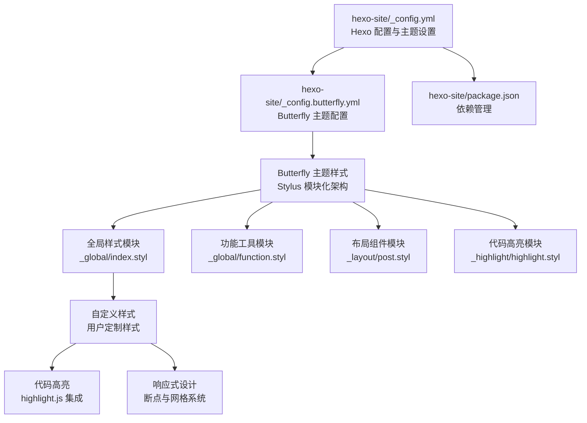
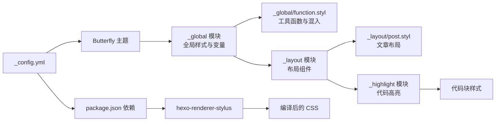
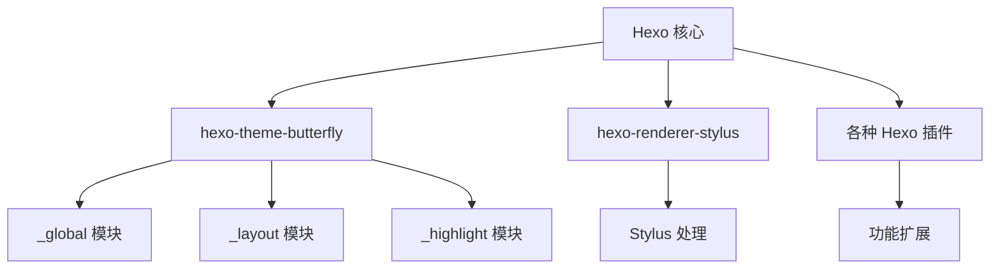

# SCSS 架构详解

<cite>
**本文引用的文件**
- [hexo-site/_config.yml](file://hexo-site/_config.yml)
- [hexo-site/package.json](file://hexo-site/package.json)
- [hexo-site/_config.butterfly.yml](file://hexo-site/_config.butterfly.yml)
- [hexo-site/node_modules/hexo-theme-butterfly/source/css/_global/index.styl](file://hexo-site/node_modules/hexo-theme-butterfly/source/css/_global/index.styl)
- [hexo-site/node_modules/hexo-theme-butterfly/source/css/_global/function.styl](file://hexo-site/node_modules/hexo-theme-butterfly/source/css/_global/function.styl)
- [hexo-site/node_modules/hexo-theme-butterfly/source/css/_layout/post.styl](file://hexo-site/node_modules/hexo-theme-butterfly/source/css/_layout/post.styl)
- [hexo-site/node_modules/hexo-theme-butterfly/source/css/_highlight/highlight.styl](file://hexo-site/node_modules/hexo-theme-butterfly/source/css/_highlight/highlight.styl)
</cite>

## 更新摘要
**所做更改**
- 完全重构了文档以反映从 Jekyll 到 Hexo 主题样式的架构变更
- 移除了所有 Jekyll 特定的 SCSS 文件引用和配置
- 新增了基于 Stylus 的 Butterfly 主题样式架构分析
- 更新了编译流程和依赖关系分析，从 SCSS 转向 Stylus
- 修正了主题系统和样式组织结构，采用 Stylus 模块化设计

## 目录
1. [引言](#引言)
2. [项目结构](#项目结构)
3. [核心组件](#核心组件)
4. [架构总览](#架构总览)
5. [详细组件分析](#详细组件分析)
6. [依赖分析](#依赖分析)
7. [性能考虑](#性能考虑)
8. [故障排查指南](#故障排查指南)
9. [结论](#结论)
10. [附录](#附录)

## 引言
本文件面向需要深入理解与维护该 Hexo 主题样式系统的工程师与设计师，系统性解析基于 Butterfly 主题的 Stylus 样式组织结构、模块化设计原则、变量体系、断点与网格系统、混入与工具类、编译流程与优化策略。重点覆盖以下方面：
- Hexo 主题架构与模块化原则：基于 Butterfly 主题的样式组织方式
- 主题配置与自定义样式系统
- Hexo 渲染器与 Stylus 样式编译流程
- 代码高亮与语法着色系统
- 响应式设计与主题切换机制
- 样式优先级与层叠规则说明
- Hexo 主题样式优化建议

## 项目结构
该主题采用 Hexo 主题架构，基于 Butterfly 主题进行定制化开发，使用 Stylus 作为样式预处理器：
- 主题入口：hexo-site/_config.yml 指定主题为 butterfly
- 主题配置：hexo-site/_config.butterfly.yml 提供主题特定的样式配置
- 样式编译：通过 hexo-renderer-stylus 处理 Stylus 样式
- 代码高亮：集成 highlight.js 提供语法着色
- 依赖管理：package.json 管理 Hexo 生态系统依赖

**图表来源**
- [hexo-site/_config.yml:119](file://hexo-site/_config.yml#L119)
- [hexo-site/_config.butterfly.yml:404](file://hexo-site/_config.butterfly.yml#L404)
- [hexo-site/package.json:30](file://hexo-site/package.json#L30)

**章节来源**
- [hexo-site/_config.yml:119](file://hexo-site/_config.yml#L119)
- [hexo-site/_config.butterfly.yml:404](file://hexo-site/_config.butterfly.yml#L404)
- [hexo-site/package.json:30](file://hexo-site/package.json#L30)

## 核心组件
- **主题系统**：Butterfly 主题提供完整的样式框架，包括布局、组件和主题切换功能
- **配置系统**：_config.butterfly.yml 提供丰富的主题配置选项，支持自定义样式、导航、CDN 等
- **渲染器**：hexo-renderer-stylus 处理 Stylus 样式文件，支持嵌套、变量、混入等功能
- **代码高亮**：highlight.js 提供多种语法着色主题，支持代码块美化
- **依赖管理**：package.json 管理 Hexo 核心、主题和插件依赖

**章节来源**
- [hexo-site/_config.butterfly.yml:404](file://hexo-site/_config.butterfly.yml#L404)
- [hexo-site/package.json:30](file://hexo-site/package.json#L30)

## 架构总览
整体遵循 Hexo 主题的模块化思路，采用 Stylus 作为样式预处理器：
- **底层**：Butterfly 主题提供基础样式框架和组件库
- **中层**：用户自定义样式覆盖主题默认样式
- **上层**：主题配置系统提供运行时样式定制
- **入口**：Hexo 配置文件控制主题加载和编译流程

**图表来源**
- [hexo-site/_config.yml:119](file://hexo-site/_config.yml#L119)
- [hexo-site/package.json:30](file://hexo-site/package.json#L30)

## 详细组件分析

### Hexo 主题配置系统
- **主题设置**：通过 theme: butterfly 指定使用 Butterfly 主题
- **主题配置**：_config.butterfly.yml 提供导航、样式、CDN 等配置选项
- **渲染器配置**：highlight 配置控制代码高亮行为
- **插件管理**：package.json 管理 hexo-theme-butterfly 和相关插件

**章节来源**
- [hexo-site/_config.yml:119](file://hexo-site/_config.yml#L119)
- [hexo-site/_config.butterfly.yml:404](file://hexo-site/_config.butterfly.yml#L404)
- [hexo-site/package.json:30](file://hexo-site/package.json#L30)

### 全局样式模块分析
Butterfly 主题的全局样式模块提供了基础的样式框架和变量定义：

#### 变量体系
- **CSS 变量映射**：通过 `:root` 声明将 Stylus 变量映射为 CSS 自定义属性
- **颜色变量**：包括主题色、背景色、文本色、链接色等
- **字体变量**：全局字体大小、字体族、行高设置
- **间距变量**：边距、内边距、间距等布局变量

#### 基础样式
- **全局重置**：统一的盒模型、滚动条样式、选择器样式
- **排版系统**：标题层级、段落、列表、表格的基础样式
- **交互样式**：链接悬停效果、按钮样式、表单样式

**章节来源**
- [hexo-site/node_modules/hexo-theme-butterfly/source/css/_global/index.styl:1-287](file://hexo-site/node_modules/hexo-theme-butterfly/source/css/_global/index.styl#L1-L287)

### 工具函数与混入模块
全局函数模块提供了丰富的样式工具和动画效果：

#### 工具类
- **文本限制**：单行文本截断、多行文本省略
- **圆角处理**：统一的边框半径处理函数
- **图片效果**：悬停缩放、模糊效果等
- **布局辅助**：垂直居中、最大宽度等

#### 媒体查询混入
- **响应式断点**：600px、768px、1024px、900px 等标准断点
- **方向断点**：最小宽度、最大宽度断点组合
- **特殊断点**：2000px 超宽屏支持

#### 动画系统
- **页面进入动画**：头部、内容、标题等进入效果
- **按钮动画**：悬停、点击反馈动画
- **图标动画**：按钮图标弹跳、加载动画等

**章节来源**
- [hexo-site/node_modules/hexo-theme-butterfly/source/css/_global/function.styl:1-348](file://hexo-site/node_modules/hexo-theme-butterfly/source/css/_global/function.styl#L1-L348)

### 布局组件模块
布局模块专注于页面结构和组件的样式设计：

#### 文章布局
- **标题前缀图标**：支持 FontAwesome 图标作为标题前缀
- **列表美化**：有序列表、无序列表的自定义样式
- **分隔线样式**：自定义的水平分隔线样式
- **锚点滚动**：支持点击滚动到指定标题位置

#### 内容容器
- **文本对齐**：支持两端对齐的文本格式
- **链接样式**：统一的链接颜色和悬停效果
- **图片处理**：响应式图片、居中显示、过渡效果
- **代码样式**：内联代码和代码块的基础样式

**章节来源**
- [hexo-site/node_modules/hexo-theme-butterfly/source/css/_layout/post.styl:1-265](file://hexo-site/node_modules/hexo-theme-butterfly/source/css/_layout/post.styl#L1-L265)

### 代码高亮模块
代码高亮模块提供了完整的代码展示解决方案：

#### 主题系统
- **浅色/深色主题**：支持浅色和深色两种高亮主题
- **CSS 变量适配**：自动适配当前主题的颜色方案
- **滚动条样式**：自定义滚动条外观

#### 功能特性
- **工具栏**：复制、展开、语言标识等工具按钮
- **行号显示**：可选的行号显示功能
- **高度限制**：支持代码块高度限制和展开功能
- **全屏模式**：支持代码块全屏查看

#### 动画效果
- **展开动画**：代码展开收起的平滑过渡
- **工具栏动画**：工具按钮的悬停反馈
- **全屏动画**：全屏模式的进入退出动画

**章节来源**
- [hexo-site/node_modules/hexo-theme-butterfly/source/css/_highlight/highlight.styl:1-307](file://hexo-site/node_modules/hexo-theme-butterfly/source/css/_highlight/highlight.styl#L1-L307)

### 代码高亮系统
- **高亮引擎**：使用 highlight.js 提供语法着色功能
- **配置选项**：line_number、auto_detect、tab_replace 等参数控制高亮行为
- **主题支持**：支持多种高亮主题，如 atom-one-dark、atom-one-light 等
- **集成方式**：通过 hexo-highlighter 插件与 Hexo 集成

**章节来源**
- [hexo-site/_config.yml:67](file://hexo-site/_config.yml#L67)

### 响应式设计系统
- **断点配置**：通过主题配置文件自定义断点和响应式行为
- **导航优化**：放大导航标签、调整边距和内边距
- **侧边栏定制**：隐藏标签统计、调整卡片样式
- **交互增强**：添加悬停效果、平滑过渡动画

**章节来源**
- [hexo-site/_config.butterfly.yml:404](file://hexo-site/_config.butterfly.yml#L404)

### 样式覆盖与定制
- **导航样式**：通过自定义 CSS 覆盖默认导航样式
- **选择器优化**：精确的 CSS 选择器确保样式正确应用
- **JavaScript 辅助**：必要时使用 JavaScript 动态修复样式问题
- **兼容性处理**：处理不同浏览器和设备的兼容性问题

**章节来源**
- [开发文档.md](file://开发文档.md)

## 依赖分析
- **主题依赖**：hexo-theme-butterfly 提供主题框架和样式基础
- **渲染器依赖**：hexo-renderer-stylus 处理 Stylus 样式文件
- **高亮依赖**：highlight.js 提供代码高亮功能
- **插件生态**：各种 Hexo 插件扩展功能，如数学公式、sitemap 等

**图表来源**
- [hexo-site/package.json:30](file://hexo-site/package.json#L30)

**章节来源**
- [hexo-site/package.json:30](file://hexo-site/package.json#L30)

## 性能考虑
- **主题优化**：Butterfly 主题经过优化，提供良好的性能表现
- **CDN 支持**：可配置 CDN 加速静态资源加载
- **代码压缩**：Hexo 编译时自动压缩 CSS 和 JavaScript
- **懒加载**：图片和资源支持懒加载，提升页面加载速度
- **缓存策略**：合理配置浏览器缓存和服务器缓存

**章节来源**
- [hexo-site/_config.butterfly.yml:448](file://hexo-site/_config.butterfly.yml#L448)

## 故障排查指南
- **主题未生效**
  - 检查 _config.yml 中 theme 设置是否正确
  - 确认 hexo-theme-butterfly 是否已安装
  - 验证主题配置文件语法是否正确
- **样式冲突**
  - 检查自定义样式是否正确覆盖主题样式
  - 确认 CSS 选择器优先级是否正确
  - 验证是否存在样式冲突或覆盖问题
- **代码高亮异常**
  - 检查 highlight.js 配置是否正确
  - 确认代码块标记是否符合要求
  - 验证高亮主题文件是否存在
- **响应式问题**
  - 检查断点配置是否正确
  - 确认媒体查询是否正常工作
  - 验证设备适配测试结果

**章节来源**
- [hexo-site/_config.yml:119](file://hexo-site/_config.yml#L119)
- [hexo-site/_config.butterfly.yml:404](file://hexo-site/_config.butterfly.yml#L404)

## 结论
该 Hexo 主题样式架构以 Butterfly 主题为基础，通过灵活的配置系统和强大的插件生态，实现了高度可定制的样式解决方案。相比传统的 Jekyll 架构，Hexo 提供了更现代化的主题系统和更丰富的功能扩展能力。通过合理的配置管理和样式覆盖策略，可以在保证性能的同时实现个性化的视觉效果。

## 附录

### Hexo 主题配置概览
- **基本配置**：网站标题、副标题、描述、关键词等基础信息
- **主题配置**：导航设置、样式定制、CDN 配置等主题相关选项
- **功能配置**：代码高亮、数学公式、图表支持等扩展功能
- **部署配置**：GitHub Pages 部署设置和自动化部署流程

**章节来源**
- [hexo-site/_config.yml:10](file://hexo-site/_config.yml#L10)
- [hexo-site/_config.butterfly.yml:404](file://hexo-site/_config.butterfly.yml#L404)

### Stylus 模块化设计原则
- **模块分离**：按功能划分模块，便于维护和复用
- **变量统一**：集中管理样式变量，确保视觉一致性
- **混入复用**：通过混入实现样式逻辑复用
- **响应式设计**：内置媒体查询混入，支持多设备适配

**章节来源**
- [hexo-site/node_modules/hexo-theme-butterfly/source/css/_global/function.styl:111](file://hexo-site/node_modules/hexo-theme-butterfly/source/css/_global/function.styl#L111-L146)

### 样式优先级与层叠规则
- **主题优先**：Butterfly 主题提供基础样式框架
- **自定义覆盖**：用户自定义样式优先级高于主题默认样式
- **配置影响**：主题配置文件影响样式的最终呈现效果
- **兼容性处理**：确保样式在不同浏览器和设备上的兼容性

**章节来源**
- [hexo-site/_config.butterfly.yml:404](file://hexo-site/_config.butterfly.yml#L404)

### Hexo 样式编译配置与优化建议
- **编译流程**：Hexo 通过 hexo-renderer-stylus 处理 Stylus 样式
- **依赖管理**：通过 package.json 管理所有依赖项
- **性能优化**：
  - 合理使用主题配置减少自定义样式
  - 优化图片和资源文件大小
  - 启用 CDN 加速静态资源
  - 配置适当的缓存策略
- **维护建议**：
  - 定期更新主题和插件版本
  - 保持配置文件的简洁和一致性
  - 测试不同设备和浏览器的兼容性

**章节来源**
- [hexo-site/package.json:30](file://hexo-site/package.json#L30)
- [hexo-site/_config.butterfly.yml:448](file://hexo-site/_config.butterfly.yml#L448)