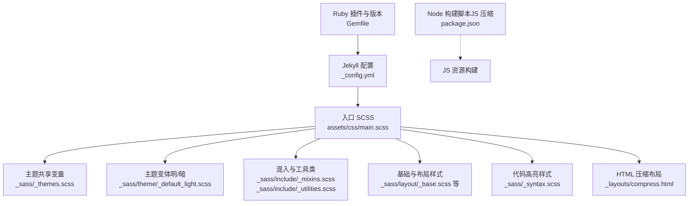
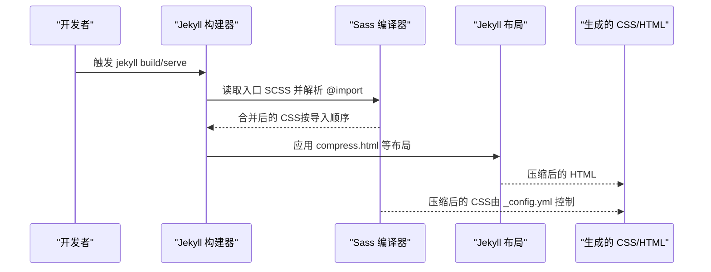
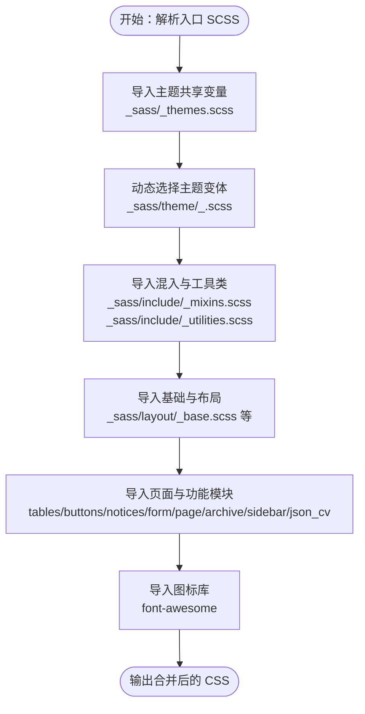
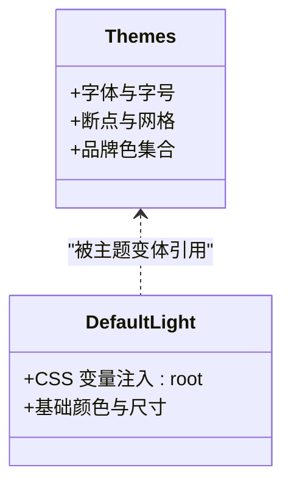
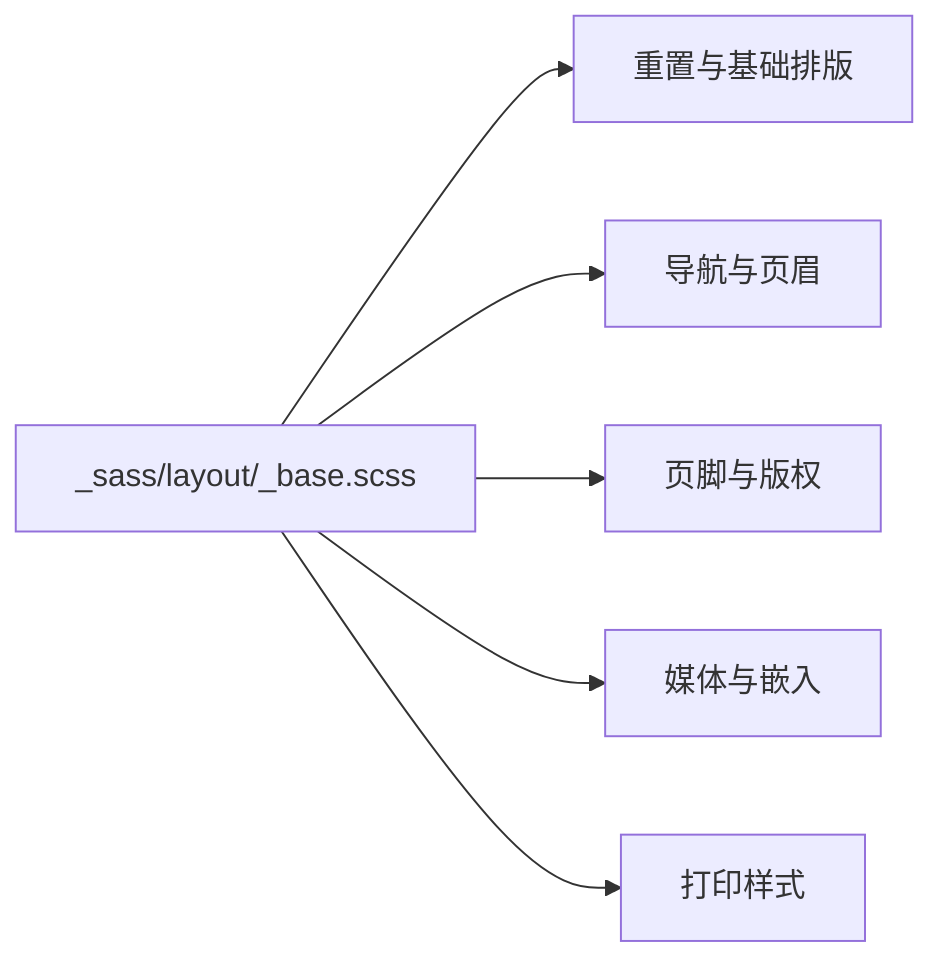
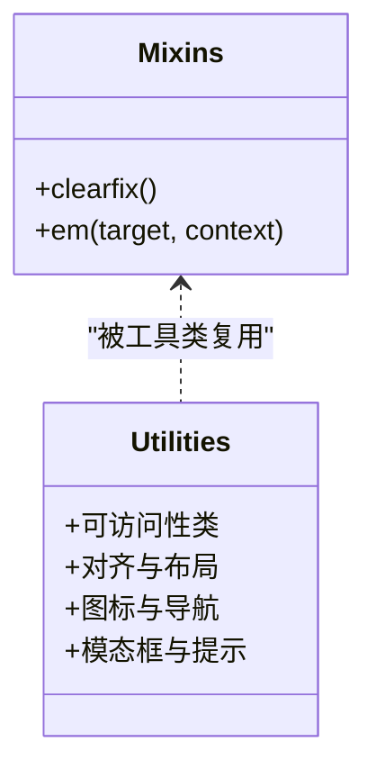
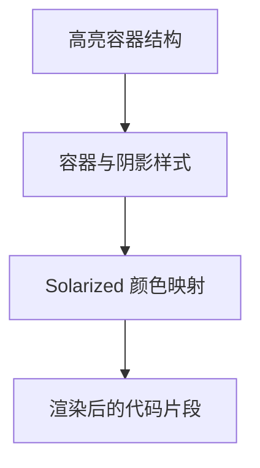
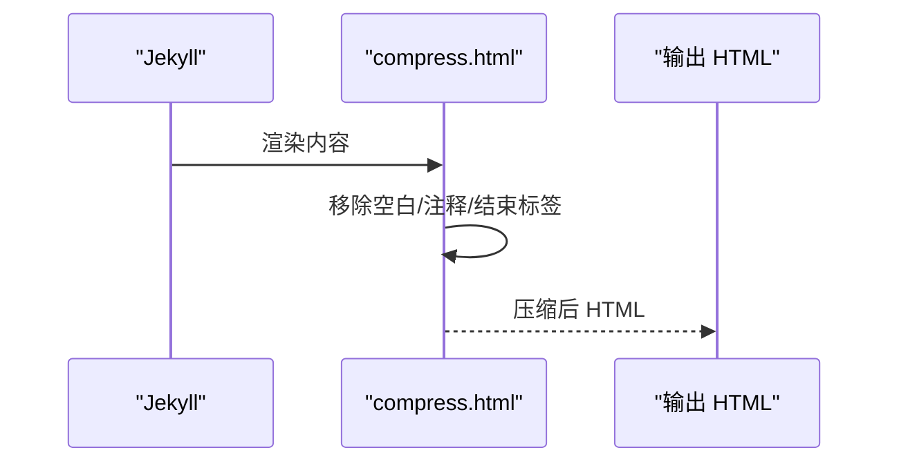
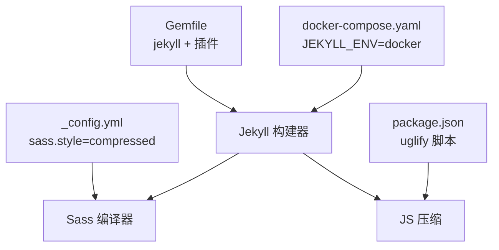

# SCSS 编译流程

<cite>
**本文引用的文件**
- [assets/css/main.scss](file://assets/css/main.scss)
- [_config.yml](file://_config.yml)
- [_sass/_themes.scss](file://_sass/_themes.scss)
- [_sass/theme/_default_light.scss](file://_sass/theme/_default_light.scss)
- [_sass/layout/_base.scss](file://_sass/layout/_base.scss)
- [_sass/include/_mixins.scss](file://_sass/include/_mixins.scss)
- [_sass/include/_utilities.scss](file://_sass/include/_utilities.scss)
- [_sass/_syntax.scss](file://_sass/_syntax.scss)
- [_layouts/compress.html](file://_layouts/compress.html)
- [package.json](file://package.json)
- [Gemfile](file://Gemfile)
- [docker-compose.yaml](file://docker-compose.yaml)
- [README.md](file://README.md)
</cite>

## 目录
1. [引言](#引言)
2. [项目结构](#项目结构)
3. [核心组件](#核心组件)
4. [架构总览](#架构总览)
5. [详细组件分析](#详细组件分析)
6. [依赖关系分析](#依赖关系分析)
7. [性能考量](#性能考量)
8. [故障排查指南](#故障排查指南)
9. [结论](#结论)
10. [附录](#附录)

## 引言
本文件面向使用 Jekyll 主题的开发者与运维人员，系统性阐述 SCSS 编译流程：从入口文件 main.scss 的导入顺序与依赖关系，到编译时的合并、压缩与优化策略；从配置与构建工具设置，到错误诊断与性能优化建议；并覆盖开发与生产环境差异及自定义编译流程的可扩展点。

## 项目结构
Jekyll 主题采用“入口 SCSS 控制导入顺序”的组织方式，核心入口位于 assets/css/main.scss，主题与布局样式分别置于 _sass 下的 theme 与 layout 子目录，通用混入与工具类位于 include 子目录，语法高亮样式位于 _syntax.scss。Jekyll 配置文件 _config.yml 指定 Sass 输出风格为压缩模式，并通过 Gemfile 约束 Ruby 生态插件版本。

图表来源
- [assets/css/main.scss:1-43](file://assets/css/main.scss#L1-L43)
- [_sass/_themes.scss:1-104](file://_sass/_themes.scss#L1-L104)
- [_sass/theme/_default_light.scss:1-49](file://_sass/theme/_default_light.scss#L1-L49)
- [_sass/include/_mixins.scss:1-53](file://_sass/include/_mixins.scss#L1-L53)
- [_sass/include/_utilities.scss:1-501](file://_sass/include/_utilities.scss#L1-L501)
- [_sass/layout/_base.scss:1-365](file://_sass/layout/_base.scss#L1-L365)
- [_sass/_syntax.scss:1-125](file://_sass/_syntax.scss#L1-L125)
- [_layouts/compress.html:1-11](file://_layouts/compress.html#L1-L11)
- [_config.yml:295-299](file://_config.yml#L295-L299)
- [Gemfile:1-14](file://Gemfile#L1-L14)
- [package.json:1-42](file://package.json#L1-L42)

章节来源
- [assets/css/main.scss:1-43](file://assets/css/main.scss#L1-L43)
- [_config.yml:295-299](file://_config.yml#L295-L299)
- [Gemfile:1-14](file://Gemfile#L1-L14)
- [package.json:1-42](file://package.json#L1-L42)

## 核心组件
- 入口 SCSS：控制所有子模块的导入顺序与合并，确保变量、混入先于具体样式生效。
- 主题与变量：共享字体、断点、网格、品牌色等全局变量，供后续样式统一引用。
- 基础与布局：重置、基础排版、导航、页眉、页脚、表格、表单、页面容器、侧边栏、JSON CV 等。
- 混入与工具类：clearfix、em 计算、可访问性辅助类、图标与导航图标、模态框等实用样式。
- 代码高亮：基于 Rouge 的语法高亮容器与配色规则。
- HTML 压缩：在 Jekyll 渲染阶段对输出 HTML 进行压缩，减少体积。
- 构建工具：Jekyll（Ruby）负责 SCSS 编译与站点生成；Node（UglifyJS）负责 JS 压缩；Docker Compose 提供一致的本地运行环境。

章节来源
- [assets/css/main.scss:1-43](file://assets/css/main.scss#L1-L43)
- [_sass/_themes.scss:1-104](file://_sass/_themes.scss#L1-L104)
- [_sass/layout/_base.scss:1-365](file://_sass/layout/_base.scss#L1-L365)
- [_sass/include/_mixins.scss:1-53](file://_sass/include/_mixins.scss#L1-L53)
- [_sass/include/_utilities.scss:1-501](file://_sass/include/_utilities.scss#L1-L501)
- [_sass/_syntax.scss:1-125](file://_sass/_syntax.scss#L1-L125)
- [_layouts/compress.html:1-11](file://_layouts/compress.html#L1-L11)
- [package.json:36-40](file://package.json#L36-L40)

## 架构总览
下图展示从入口 SCSS 到最终 CSS 的编译链路，以及与 Jekyll 配置、布局压缩的关系。

图表来源
- [assets/css/main.scss:1-43](file://assets/css/main.scss#L1-L43)
- [_config.yml:295-299](file://_config.yml#L295-L299)
- [_layouts/compress.html:1-11](file://_layouts/compress.html#L1-L11)

## 详细组件分析

### 入口文件 main.scss 的导入顺序与依赖关系
- 导入顺序决定变量与混入的可用性优先级，先导入主题共享变量与主题变体，再导入混入与布局基础，最后导入页面与功能模块，确保变量与断点在布局中可用。
- 动态主题选择：通过 Liquid 表达式根据 site.site_theme 选择对应主题的明/暗变体，实现主题切换。
- 第三方库：引入 breakpoint、susy、font-awesome 等，作为栅格与图标的基础能力。

图表来源
- [assets/css/main.scss:11-42](file://assets/css/main.scss#L11-L42)
- [_sass/_themes.scss:1-104](file://_sass/_themes.scss#L1-L104)
- [_sass/theme/_default_light.scss:1-49](file://_sass/theme/_default_light.scss#L1-L49)
- [_sass/include/_mixins.scss:1-53](file://_sass/include/_mixins.scss#L1-L53)
- [_sass/include/_utilities.scss:1-501](file://_sass/include/_utilities.scss#L1-L501)
- [_sass/layout/_base.scss:1-365](file://_sass/layout/_base.scss#L1-L365)
- [_sass/_syntax.scss:1-125](file://_sass/_syntax.scss#L1-L125)

章节来源
- [assets/css/main.scss:1-43](file://assets/css/main.scss#L1-L43)

### 主题与变量体系
- 共享变量：字体族、字号比例、断点、网格参数、品牌色等集中定义，供全局复用。
- 主题变体：通过 CSS 自定义属性在 :root 中注入颜色与尺寸，便于在布局与组件中以变量形式引用，实现明/暗主题切换。

图表来源
- [_sass/_themes.scss:1-104](file://_sass/_themes.scss#L1-L104)
- [_sass/theme/_default_light.scss:1-49](file://_sass/theme/_default_light.scss#L1-L49)

章节来源
- [_sass/_themes.scss:1-104](file://_sass/_themes.scss#L1-L104)
- [_sass/theme/_default_light.scss:1-49](file://_sass/theme/_default_light.scss#L1-L49)

### 基础与布局样式
- 基础元素：排版、链接、代码块、列表、图片与视频容器、打印样式等。
- 导航与页头：导航列表、页眉、页脚、侧边栏、Notice 与表格等。
- 动画与过渡：全局过渡时间与动画帧定义，提升交互体验。

图表来源
- [_sass/layout/_base.scss:1-365](file://_sass/layout/_base.scss#L1-L365)

章节来源
- [_sass/layout/_base.scss:1-365](file://_sass/layout/_base.scss#L1-L365)

### 混入与工具类
- 混入：clearfix、em 计算等，用于简化重复样式。
- 工具类：可访问性、文本对齐、图片对齐、图标、导航图标、模态框、脚注等。

图表来源
- [_sass/include/_mixins.scss:1-53](file://_sass/include/_mixins.scss#L1-L53)
- [_sass/include/_utilities.scss:1-501](file://_sass/include/_utilities.scss#L1-L501)

章节来源
- [_sass/include/_mixins.scss:1-53](file://_sass/include/_mixins.scss#L1-L53)
- [_sass/include/_utilities.scss:1-501](file://_sass/include/_utilities.scss#L1-L501)

### 代码高亮样式
- 容器样式与伪元素装饰，配合 Rouge 输出的 HTML 结构进行着色。
- 提供 Solarized 系列配色映射，保证代码片段在不同主题下的可读性。

图表来源
- [_sass/_syntax.scss:1-125](file://_sass/_syntax.scss#L1-L125)

章节来源
- [_sass/_syntax.scss:1-125](file://_sass/_syntax.scss#L1-L125)

### HTML 压缩布局
- 在 Jekyll 渲染阶段对 HTML 进行压缩，移除多余空白、注释与结束标签，降低传输体积。
- 支持按环境忽略压缩（如 development），避免影响调试。

图表来源
- [_layouts/compress.html:1-11](file://_layouts/compress.html#L1-L11)

章节来源
- [_layouts/compress.html:1-11](file://_layouts/compress.html#L1-L11)

## 依赖关系分析
- Jekyll 配置：通过 sass_dir 与 style 控制 Sass 源目录与输出风格（压缩）。
- Ruby 生态：Gemfile 锁定 jekyll 与相关插件版本，确保构建一致性。
- Node 生态：package.json 提供 JS 压缩脚本，独立于 Sass 流程但共同参与前端资源优化。
- 开发环境：docker-compose 提供容器化服务，设置 JEKYLL_ENV=docker，结合多配置文件加载。

图表来源
- [_config.yml:295-299](file://_config.yml#L295-L299)
- [Gemfile:1-14](file://Gemfile#L1-L14)
- [package.json:36-40](file://package.json#L36-L40)
- [docker-compose.yaml:1-9](file://docker-compose.yaml#L1-L9)

章节来源
- [_config.yml:295-299](file://_config.yml#L295-L299)
- [Gemfile:1-14](file://Gemfile#L1-L14)
- [package.json:36-40](file://package.json#L36-L40)
- [docker-compose.yaml:1-9](file://docker-compose.yaml#L1-L9)

## 性能考量
- 输出风格：通过 _config.yml 将 Sass 输出设为压缩模式，显著减小 CSS 体积。
- HTML 压缩：启用 compress_html 插件，按环境策略忽略开发环境，平衡可读性与性能。
- JS 压缩：使用 UglifyJS 对 JS 资源进行压缩，配合 onChange 实现变更监听与增量构建。
- 构建缓存：Jekyll 默认缓存与 Sass 缓存目录需纳入 .gitignore，避免污染仓库。
- 依赖锁定：Gemfile 与 package.json 分别锁定 Ruby 与 Node 依赖，减少版本漂移导致的性能回退。

章节来源
- [_config.yml:295-299](file://_config.yml#L295-L299)
- [_layouts/compress.html:1-11](file://_layouts/compress.html#L1-L11)
- [package.json:32-40](file://package.json#L32-L40)
- [_config.yml:175-176](file://_config.yml#L175-L176)

## 故障排查指南
- 编译失败（变量未定义或断点未生效）
  - 检查入口 SCSS 的导入顺序是否先于变量与混入使用。
  - 确认主题共享变量与主题变体已正确导入。
- 主题切换无效
  - 检查 site.site_theme 配置项与 Liquid 表达式拼接结果。
  - 确认对应主题变体文件存在且命名规范一致。
- HTML 体积异常
  - 检查 compress_html 配置是否在 development 环境被忽略。
  - 确认未误将压缩逻辑应用到不应压缩的区块。
- JS 压缩报错
  - 使用 package.json 中的 uglify 脚本定位依赖路径是否正确。
  - 确保 UglifyJS 版本与输入文件兼容。
- 本地构建不一致
  - 使用 docker-compose 设置 JEKYLL_ENV=docker，避免系统 Ruby/Gem 环境差异。
  - 多配置文件加载（_config.yml,_config_docker.yml）确保容器内行为一致。

章节来源
- [assets/css/main.scss:11-42](file://assets/css/main.scss#L11-L42)
- [_sass/_themes.scss:1-104](file://_sass/_themes.scss#L1-L104)
- [_sass/theme/_default_light.scss:1-49](file://_sass/theme/_default_light.scss#L1-L49)
- [_config.yml:295-299](file://_config.yml#L295-L299)
- [_layouts/compress.html:1-11](file://_layouts/compress.html#L1-L11)
- [package.json:36-40](file://package.json#L36-L40)
- [docker-compose.yaml:1-9](file://docker-compose.yaml#L1-L9)
- [README.md:24-53](file://README.md#L24-L53)

## 结论
本项目的 SCSS 编译流程以入口文件 main.scss 为核心，通过严格的导入顺序与主题变量体系，确保样式具备良好的可维护性与可扩展性。配合 Jekyll 的压缩输出与 HTML 压缩布局，以及 Node 的 JS 压缩脚本，形成端到端的前端资源优化链路。开发与生产环境的差异化配置（如压缩策略与环境变量）进一步提升了构建效率与用户体验。

## 附录
- 自定义编译流程建议
  - 新增第三方库：在入口 SCSS 中添加 @import，确保在需要使用的布局之前导入。
  - 扩展主题：新增主题变体文件，保持命名规范与变量注入一致。
  - 调整输出风格：在 _config.yml 中修改 sass.style 以适配调试或发布需求。
  - 集成其他构建工具：可在 package.json 中增加更多任务（如 PostCSS、Autoprefixer），并与 Jekyll 的 watch/serve 协同工作。
- 与其他构建工具的集成
  - Webpack/Vite：若引入现代前端工程化流程，可通过额外的构建脚本在 Jekyll 生成后进行二次打包，但需注意与 Jekyll 的静态资源路径与哈希策略协调。
  - Docker：使用 docker-compose 提供一致的 Ruby/Node 环境，结合 JEKYLL_ENV 控制构建行为。

章节来源
- [assets/css/main.scss:11-42](file://assets/css/main.scss#L11-L42)
- [_config.yml:295-299](file://_config.yml#L295-L299)
- [package.json:32-40](file://package.json#L32-L40)
- [docker-compose.yaml:1-9](file://docker-compose.yaml#L1-L9)
- [README.md:24-53](file://README.md#L24-L53)