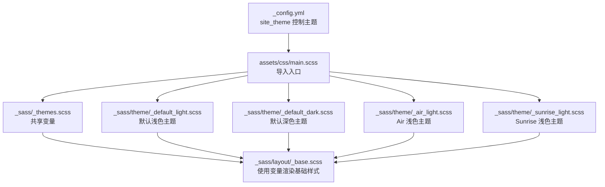
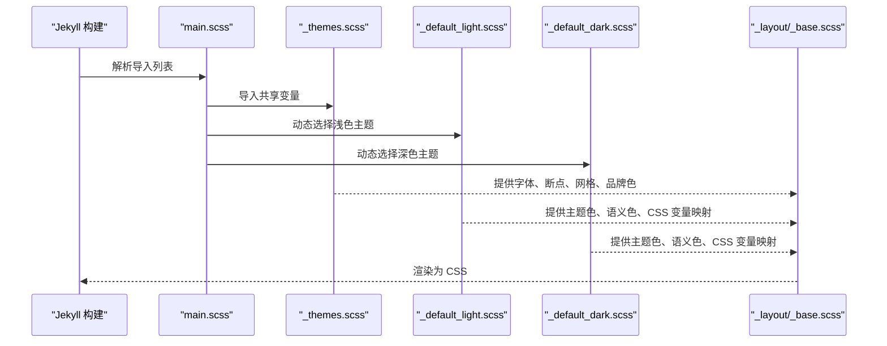
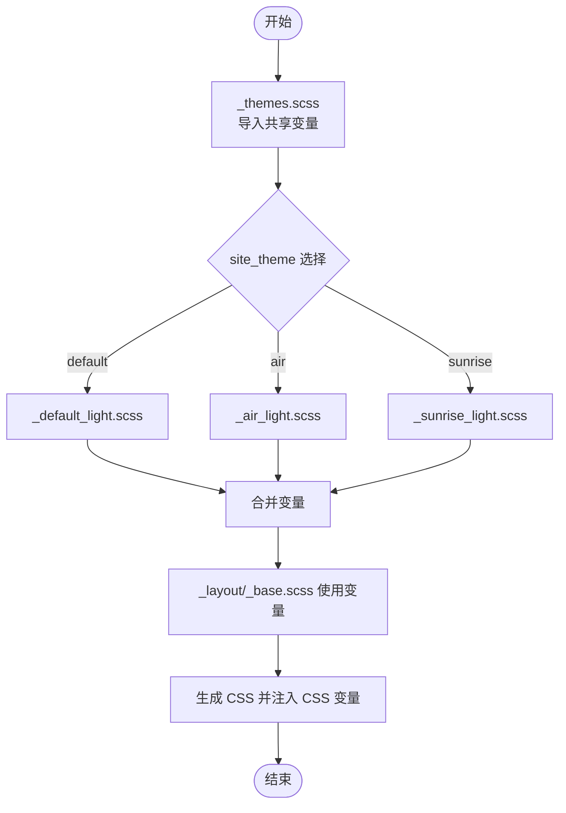
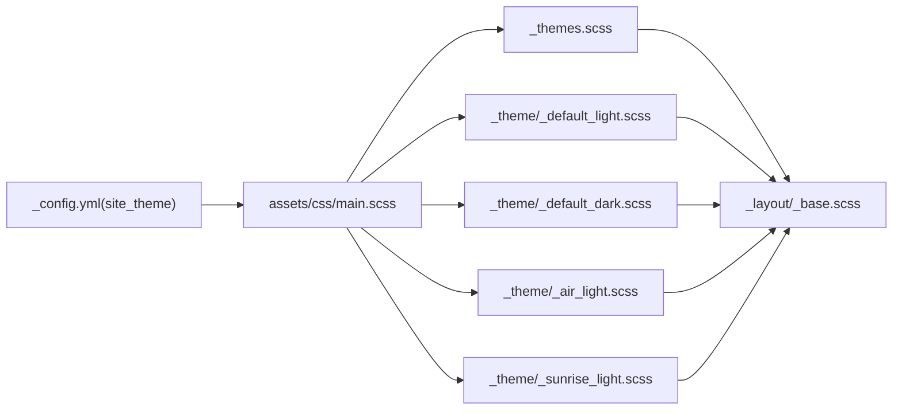

# 主题变量系统

<cite>
**本文引用的文件**
- [_sass/_themes.scss](file://_sass/_themes.scss)
- [assets/css/main.scss](file://assets/css/main.scss)
- [_sass/include/_mixins.scss](file://_sass/include/_mixins.scss)
- [_sass/layout/_base.scss](file://_sass/layout/_base.scss)
- [_sass/theme/_default_light.scss](file://_sass/theme/_default_light.scss)
- [_sass/theme/_default_dark.scss](file://_sass/theme/_default_dark.scss)
- [_sass/theme/_air_light.scss](file://_sass/theme/_air_light.scss)
- [_sass/theme/_sunrise_light.scss](file://_sass/theme/_sunrise_light.scss)
- [_config.yml](file://_config.yml)
</cite>

## 目录
1. [简介](#简介)
2. [项目结构](#项目结构)
3. [核心组件](#核心组件)
4. [架构总览](#架构总览)
5. [详细组件分析](#详细组件分析)
6. [依赖分析](#依赖分析)
7. [性能考虑](#性能考虑)
8. [故障排查指南](#故障排查指南)
9. [结论](#结论)
10. [附录](#附录)

## 简介
本文件系统性解析主题变量体系，聚焦于 _themes.scss 中的共享变量与主题变量，覆盖以下方面：
- 字体变量：字号基准、段落缩进、系统字体族、等宽字体、标题字体族、图注字体族、字号刻度等
- 断点变量：小屏、中屏、宽屏、大屏、超大屏断点
- 网格变量：Susy 配置（列数、列宽、边距比例、数学模型、容器宽度、盒模型策略等）
- 颜色变量系统：品牌色（社交平台色板）与主题色（主色、灰阶、语义色、过渡与圆角等）
- 变量继承与优先级：默认变量、主题变量、CSS 自定义属性映射、Jekyll 模板变量注入
- 最佳实践与注意事项：变量覆盖顺序、命名规范、可维护性建议
- 使用示例与常见错误规避：如何在布局与组件中正确引用变量

## 项目结构
主题变量系统由“共享变量”和“主题变量”两层构成，并通过 SCSS 导入链路在构建期生效；同时，Jekyll 在运行时通过模板变量控制主题选择。

**图表来源**
- [assets/css/main.scss:11-43](file://assets/css/main.scss#L11-L43)
- [_sass/_themes.scss:1-104](file://_sass/_themes.scss#L1-L104)
- [_sass/theme/_default_light.scss:1-49](file://_sass/theme/_default_light.scss#L1-L49)
- [_sass/theme/_default_dark.scss:1-57](file://_sass/theme/_default_dark.scss#L1-L57)
- [_sass/theme/_air_light.scss:1-56](file://_sass/theme/_air_light.scss#L1-L56)
- [_sass/theme/_sunrise_light.scss:1-64](file://_sass/theme/_sunrise_light.scss#L1-L64)
- [_sass/layout/_base.scss:1-365](file://_sass/layout/_base.scss#L1-L365)
- [_config.yml:10](file://_config.yml#L10)

**章节来源**
- [assets/css/main.scss:11-43](file://assets/css/main.scss#L11-L43)
- [_sass/_themes.scss:1-104](file://_sass/_themes.scss#L1-L104)
- [_sass/layout/_base.scss:1-365](file://_sass/layout/_base.scss#L1-L365)
- [_config.yml:10](file://_config.yml#L10)

## 核心组件
- 共享变量层（_themes.scss）
  - 字体与排版：字号基准、段落缩进、系统字体族、等宽字体、标题与图注字体族、字号刻度
  - 断点：小、中、中宽、大、超大断点
  - 网格：Susy 配置（列数、列宽、边距比例、数学模型、输出类型、容器宽度、盒模型策略）
  - 品牌色：社交平台色板（Behance、Bluesky、Dribbble、Facebook、Flickr、Foursquare、Google+、Instagram、Kaggle、Last.fm、LinkedIn、Mastodon、ORCID、Pinterest、RSS、SoundCloud、Stack Overflow、Tumblr、Twitter、Vimeo、Vine、YouTube、Xing）
- 主题变量层（_sass/theme/*.scss）
  - 默认主题（浅色/深色）：主色、灰阶、语义色、过渡、圆角、导航图标尺寸、侧栏最小宽度等
  - Air 主题（浅色）：主色、背景、文本、链接、页脚、边框与语义色等
  - Sunrise 主题（浅色）：主色、背景、文本、链接、页脚、边框、语义色等
- 运行时注入（_config.yml）
  - site_theme 控制当前主题（默认 default），并配合 Jekyll 模板语法动态选择对应主题文件

**章节来源**
- [_sass/_themes.scss:1-104](file://_sass/_themes.scss#L1-L104)
- [_sass/theme/_default_light.scss:1-49](file://_sass/theme/_default_light.scss#L1-L49)
- [_sass/theme/_default_dark.scss:1-57](file://_sass/theme/_default_dark.scss#L1-L57)
- [_sass/theme/_air_light.scss:1-56](file://_sass/theme/_air_light.scss#L1-L56)
- [_sass/theme/_sunrise_light.scss:1-64](file://_sass/theme/_sunrise_light.scss#L1-L64)
- [_config.yml:10](file://_config.yml#L10)

## 架构总览
变量系统采用“共享变量 + 主题变量”的分层设计，构建期通过 SCSS 导入顺序决定最终生效值；运行期通过 Jekyll 的 site_theme 注入变量，实现主题切换。

**图表来源**
- [assets/css/main.scss:11-43](file://assets/css/main.scss#L11-L43)
- [_sass/_themes.scss:1-104](file://_sass/_themes.scss#L1-L104)
- [_sass/theme/_default_light.scss:1-49](file://_sass/theme/_default_light.scss#L1-L49)
- [_sass/theme/_default_dark.scss:1-57](file://_sass/theme/_default_dark.scss#L1-L57)
- [_sass/layout/_base.scss:1-365](file://_sass/layout/_base.scss#L1-L365)

## 详细组件分析

### 字体与排版变量
- 字号基准与缩进
  - 基准字号用于计算相对单位（如 em 计算函数）
  - 段落缩进开关与缩进幅度
- 字体族
  - 衬线、无衬线、等宽字体族
  - 无衬线扩展族（窄版、Helvetica 等）
  - 衬线扩展族（Georgia、Times、Bodoni、Calisto、Garamond）
- 字号刻度
  - 从一级到八级的字号刻度，用于标题层级
- 字体族应用
  - 全局正文、标题、图注分别绑定不同字体族

这些变量在布局文件中被广泛使用，例如标题字号、正文行高、代码块字体等。

**章节来源**
- [_sass/_themes.scss:10-45](file://_sass/_themes.scss#L10-L45)
- [_sass/layout/_base.scss:27-165](file://_sass/layout/_base.scss#L27-L165)

### 断点变量
- 小屏、中屏、中宽屏、大屏、超大屏断点
- 通过断点库设置为“以 em 形式表示”，便于与字号基准协同工作
- 在布局中用于响应式栅格与元素排列

**章节来源**
- [_sass/_themes.scss:50-57](file://_sass/_themes.scss#L50-L57)
- [_sass/layout/_base.scss:223-244](file://_sass/layout/_base.scss#L223-L244)

### 网格变量（Susy）
- 列数、列宽、边距比例
- 数学模型（流式）、输出类型（浮动）、边距位置（右侧）
- 容器宽度、全局盒模型策略（边框盒）
- 右侧边栏宽度（窄/常规/宽）保留为自动，便于按需覆盖

这些变量在布局文件中驱动栅格与响应式图片网格。

**章节来源**
- [_sass/_themes.scss:66-75](file://_sass/_themes.scss#L66-L75)
- [_sass/layout/_base.scss:220-245](file://_sass/layout/_base.scss#L220-L245)

### 颜色变量系统
- 品牌色（社交平台色板）
  - 覆盖主流社交平台的颜色标识，便于在社交链接、徽标等场景统一风格
- 主题色与灰阶
  - 主色、深浅灰阶、更深灰阶
  - 语义色：危险、信息、提示、成功、警告
- 过渡与圆角
  - 统一的过渡时间与圆角半径
- CSS 自定义属性映射
  - 各主题将变量映射为 CSS 变量，供基础样式直接消费
  - 深色主题通过 data-theme 属性选择器生效

**章节来源**
- [_sass/_themes.scss:81-104](file://_sass/_themes.scss#L81-L104)
- [_sass/theme/_default_light.scss:5-47](file://_sass/theme/_default_light.scss#L5-L47)
- [_sass/theme/_default_dark.scss:6-55](file://_sass/theme/_default_dark.scss#L6-L55)
- [_sass/theme/_air_light.scss:6-55](file://_sass/theme/_air_light.scss#L6-L55)
- [_sass/theme/_sunrise_light.scss:5-57](file://_sass/theme/_sunrise_light.scss#L5-L57)
- [_sass/layout/_base.scss:10-25](file://_sass/layout/_base.scss#L10-L25)

### 变量继承与优先级
- 导入顺序决定优先级
  - 共享变量先导入，随后是主题浅色与深色文件
  - 后导入的主题变量会覆盖先前定义的同名变量
- Jekyll 模板注入
  - site_theme 决定动态导入的主题文件（默认 default）
  - 通过 Liquid 模板语法拼接文件名，确保只加载所需主题
- CSS 变量映射
  - 主题文件将 SCSS 变量映射为 CSS 变量，基础样式直接消费
  - 深色主题通过 data-theme 属性选择器生效，避免重复定义

**图表来源**
- [assets/css/main.scss:14-16](file://assets/css/main.scss#L14-L16)
- [_config.yml:10](file://_config.yml#L10)
- [_sass/_themes.scss:1-104](file://_sass/_themes.scss#L1-L104)
- [_sass/theme/_default_light.scss:1-49](file://_sass/theme/_default_light.scss#L1-L49)
- [_sass/theme/_air_light.scss:1-56](file://_sass/theme/_air_light.scss#L1-L56)
- [_sass/theme/_sunrise_light.scss:1-64](file://_sass/theme/_sunrise_light.scss#L1-L64)
- [_sass/layout/_base.scss:1-365](file://_sass/layout/_base.scss#L1-L365)

### 变量使用示例与最佳实践
- 在布局中引用字号刻度与字体族
  - 示例路径：[标题字号与字体族使用:34-57](file://_sass/layout/_base.scss#L34-L57)
- 在断点中控制栅格与图片网格
  - 示例路径：[响应式图片网格断点用法:223-244](file://_sass/layout/_base.scss#L223-L244)
- 在混入中使用字号基准进行相对换算
  - 示例路径：[em 函数实现与用法:17-19](file://_sass/include/_mixins.scss#L17-L19)
- 通过主题文件覆盖品牌色或语义色
  - 示例路径：[默认主题语义色:13-17](file://_sass/theme/_default_light.scss#L13-L17)
- 通过 CSS 变量映射实现深浅主题切换
  - 示例路径：[深色主题 CSS 变量映射:38-55](file://_sass/theme/_default_dark.scss#L38-L55)

最佳实践与注意事项
- 覆盖顺序：先导入共享变量，再导入目标主题，最后在本地样式中覆盖
- 命名规范：保持与现有变量命名一致，避免冲突
- 可维护性：将主题差异集中在主题文件，避免在布局中分散覆盖
- 性能：减少不必要的变量重定义，避免深层嵌套导致的编译膨胀

**章节来源**
- [_sass/layout/_base.scss:34-57](file://_sass/layout/_base.scss#L34-L57)
- [_sass/layout/_base.scss:223-244](file://_sass/layout/_base.scss#L223-L244)
- [_sass/include/_mixins.scss:17-19](file://_sass/include/_mixins.scss#L17-L19)
- [_sass/theme/_default_light.scss:13-17](file://_sass/theme/_default_light.scss#L13-L17)
- [_sass/theme/_default_dark.scss:38-55](file://_sass/theme/_default_dark.scss#L38-L55)

## 依赖分析
变量系统的关键依赖关系如下：

**图表来源**
- [_sass/_themes.scss:1-104](file://_sass/_themes.scss#L1-L104)
- [_sass/layout/_base.scss:1-365](file://_sass/layout/_base.scss#L1-L365)
- [_sass/theme/_default_light.scss:1-49](file://_sass/theme/_default_light.scss#L1-L49)
- [_sass/theme/_default_dark.scss:1-57](file://_sass/theme/_default_dark.scss#L1-L57)
- [_sass/theme/_air_light.scss:1-56](file://_sass/theme/_air_light.scss#L1-L56)
- [_sass/theme/_sunrise_light.scss:1-64](file://_sass/theme/_sunrise_light.scss#L1-L64)
- [_config.yml:10](file://_config.yml#L10)
- [assets/css/main.scss:11-43](file://assets/css/main.scss#L11-L43)

**章节来源**
- [_sass/_themes.scss:1-104](file://_sass/_themes.scss#L1-L104)
- [_sass/layout/_base.scss:1-365](file://_sass/layout/_base.scss#L1-L365)
- [_sass/theme/_default_light.scss:1-49](file://_sass/theme/_default_light.scss#L1-L49)
- [_sass/theme/_default_dark.scss:1-57](file://_sass/theme/_default_dark.scss#L1-L57)
- [_sass/theme/_air_light.scss:1-56](file://_sass/theme/_air_light.scss#L1-L56)
- [_sass/theme/_sunrise_light.scss:1-64](file://_sass/theme/_sunrise_light.scss#L1-L64)
- [_config.yml:10](file://_config.yml#L10)
- [assets/css/main.scss:11-43](file://assets/css/main.scss#L11-L43)

## 性能考虑
- 导入顺序优化：将共享变量置于首位，主题变量紧随其后，减少重复定义
- Susy 配置：合理设置列数与列宽，避免过细的列宽导致渲染压力
- CSS 变量映射：仅在必要主题中启用，避免冗余选择器
- 字号基准：统一使用基准字号进行换算，减少复杂计算

## 故障排查指南
- 变量未生效
  - 检查导入顺序是否正确，确保主题变量在共享变量之后导入
  - 确认 site_theme 设置与实际主题文件名一致
- 断点不生效
  - 检查断点库是否正确初始化，确认断点单位与字号基准匹配
- 栅格异常
  - 检查 Susy 配置项是否与页面容器宽度一致
- 深色主题未切换
  - 确认 data-theme 属性是否正确设置，检查主题文件中的选择器

**章节来源**
- [assets/css/main.scss:14-16](file://assets/css/main.scss#L14-L16)
- [_sass/_themes.scss:50-57](file://_sass/_themes.scss#L50-L57)
- [_sass/_themes.scss:66-75](file://_sass/_themes.scss#L66-L75)
- [_sass/theme/_default_dark.scss:38-55](file://_sass/theme/_default_dark.scss#L38-L55)

## 结论
本主题变量系统通过“共享变量 + 主题变量”的分层设计，在构建期与运行期协同工作，实现了高度可定制的主题体系。遵循正确的导入顺序与命名规范，可在保证可维护性的同时获得良好的性能表现。通过 CSS 变量映射与断点、网格配置，系统支持多主题与响应式布局的灵活组合。

## 附录
- 变量覆盖清单（示例）
  - 字号刻度：在主题文件中覆盖相应级别变量
  - 断点：根据设备特性调整小/中/大断点
  - 网格：根据内容密度调整列数与列宽
  - 品牌色：在主题文件中替换社交平台色板
- 常见错误
  - 在布局中直接硬编码像素值，应使用变量或 em 函数
  - 忘记在深色主题中同步更新 CSS 变量映射
  - 导入顺序错误导致变量被意外覆盖