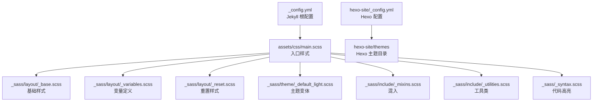
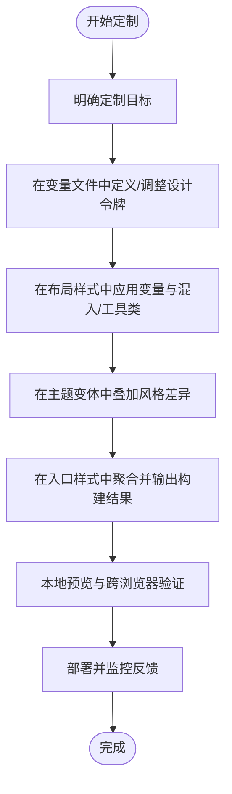
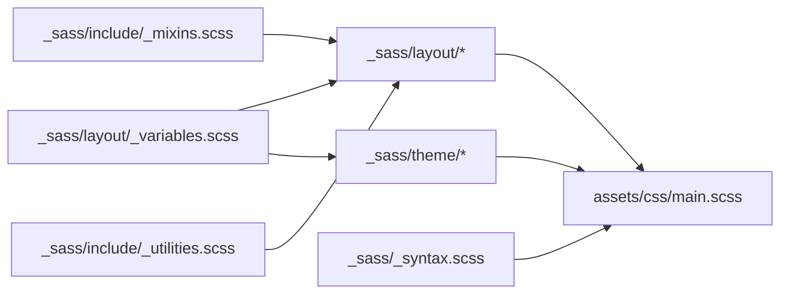

# 主题定制指南

<cite>
**本文档引用的文件**
- [_config.yml](file://_config.yml)
- [hexo-site/_config.yml](file://hexo-site/_config.yml)
- [assets/css/main.scss](file://assets/css/main.scss)
- [_sass/_themes.scss](file://_sass/_themes.scss)
- [_sass/include/_mixins.scss](file://_sass/include/_mixins.scss)
- [_sass/include/_utilities.scss](file://_sass/include/_utilities.scss)
- [_sass/layout/_base.scss](file://_sass/layout/_base.scss)
- [_sass/layout/_variables.scss](file://_sass/layout/_variables.scss)
- [_sass/layout/_buttons.scss](file://_sass/layout/_buttons.scss)
- [_sass/layout/_forms.scss](file://_sass/layout/_forms.scss)
- [_sass/layout/_masthead.scss](file://_sass/layout/_masthead.scss)
- [_sass/layout/_navigation.scss](file://_sass/layout/_navigation.scss)
- [_sass/layout/_sidebar.scss](file://_sass/layout/_sidebar.scss)
- [_sass/layout/_page.scss](file://_sass/layout/_page.scss)
- [_sass/layout/_footer.scss](file://_sass/layout/_footer.scss)
- [_sass/layout/_tables.scss](file://_sass/layout/_tables.scss)
- [_sass/layout/_notices.scss](file://_sass/layout/_notices.scss)
- [_sass/layout/_json_cv.scss](file://_sass/layout/_json_cv.scss)
- [_sass/theme/_default_light.scss](file://_sass/theme/_default_light.scss)
- [_sass/theme/_default_dark.scss](file://_sass/theme/_default_dark.scss)
- [_sass/theme/_air_light.scss](file://_sass/theme/_air_light.scss)
- [_sass/theme/_air_dark.scss](file://_sass/theme/_air_dark.scss)
- [_sass/theme/_contrast_light.scss](file://_sass/theme/_contrast_light.scss)
- [_sass/theme/_contrast_dark.scss](file://_sass/theme/_contrast_dark.scss)
- [_sass/theme/_dirt_light.scss](file://_sass/theme/_dirt_light.scss)
- [_sass/theme/_dirt_dark.scss](file://_sass/theme/_dirt_dark.scss)
- [_sass/theme/_mint_light.scss](file://_sass/theme/_mint_light.scss)
- [_sass/theme/_mint_dark.scss](file://_sass/theme/_mint_dark.scss)
- [_sass/theme/_sunrise_light.scss](file://_sass/theme/_sunrise_light.scss)
- [_sass/theme/_sunrise_dark.scss](file://_sass/theme/_sunrise_dark.scss)
- [_sass/_syntax.scss](file://_sass/_syntax.scss)
- [_sass/layout/_reset.scss](file://_sass/layout/_reset.scss)
- [_sass/layout/_archive.scss](file://_sass/layout/_archive.scss)
- [_sass/layout/_buttons.scss](file://_sass/layout/_buttons.scss)
- [_sass/layout/_forms.scss](file://_sass/layout/_forms.scss)
- [_sass/layout/_tables.scss](file://_sass/layout/_tables.scss)
- [_sass/layout/_notices.scss](file://_sass/layout/_notices.scss)
- [_sass/layout/_json_cv.scss](file://_sass/layout/_json_cv.scss)
- [_sass/layout/_archive.scss](file://_sass/layout/_archive.scss)
- [_sass/layout/_reset.scss](file://_sass/layout/_reset.scss)
- [_sass/layout/_base.scss](file://_sass/layout/_base.scss)
- [_sass/layout/_variables.scss](file://_sass/layout/_variables.scss)
- [_sass/layout/_buttons.scss](file://_sass/layout/_buttons.scss)
- [_sass/layout/_forms.scss](file://_sass/layout/_forms.scss)
- [_sass/layout/_tables.scss](file://_sass/layout/_tables.scss)
- [_sass/layout/_notices.scss](file://_sass/layout/_notices.scss)
- [_sass/layout/_json_cv.scss](file://_sass/layout/_json_cv.scss)
- [_sass/layout/_archive.scss](file://_sass/layout/_archive.scss)
- [_sass/layout/_reset.scss](file://_sass/layout/_reset.scss)
- [_sass/layout/_base.scss](file://_sass/layout/_base.scss)
- [_sass/layout/_variables.scss](file://_sass/layout/_variables.scss)
- [_sass/layout/_buttons.scss](file://_sass/layout/_buttons.scss)
- [_sass/layout/_forms.scss](file://_sass/layout/_forms.scss)
- [_sass/layout/_tables.scss](file://_sass/layout/_tables.scss)
- [_sass/layout/_notices.scss](file://_sass/layout/_notices.scss)
- [_sass/layout/_json_cv.scss](file://_sass/layout/_json_cv.scss)
- [_sass/layout/_archive.scss](file://_sass/layout/_archive.scss)
- [_sass/layout/_reset.scss](file://_sass/layout/_reset.scss)
- [_sass/layout/_base.scss](file://_sass/layout/_base.scss)
- [_sass/layout/_variables.scss](file://_sass/layout/_variables.scss)
- [_sass/layout/_buttons.scss](file://_sass/layout/_buttons.scss)
- [_sass/layout/_forms.scss](file://_sass/layout/_forms.scss)
- [_sass/layout/_tables.scss](file://_sass/layout/_tables.scss)
- [_sass/layout/_notices.scss](file://_sass/layout/_notices.scss)
- [_sass/layout/_json_cv.scss](file://_sass/layout/_json_cv.scss)
- [_sass/layout/_archive.scss](file://_sass/layout/_archive.scss)
- [_sass/layout/_reset.scss](file://_sass/layout/_reset.scss)
- [_sass/layout/_base.scss](file://_sass/layout/_base.scss)
- [_sass/layout/_variables.scss](file://_sass/layout/_variables.scss)
- [_sass/layout/_buttons.scss](file://_sass/layout/_buttons.scss)
- [_sass/layout/_forms.scss](file://_sass/layout/_forms.scss)
- [_sass/layout/_tables.scss](file://_sass/layout/_tables.scss)
- [_sass/layout/_notices.scss](file://_sass/layout/_notices.scss)
- [_sass/layout/_json_cv.scss](file://_sass/layout/_json_cv.scss)
- [_sass/layout/_archive.scss](file://_sass/layout/_archive.scss)
- [_sass/layout/_reset.scss](file://_sass/layout/_reset.scss)
- [_sass/layout/_base.scss](file://_sass/layout/_base.scss)
- [_sass/layout/_variables.scss](file://_sass/layout/_variables.scss)
- [_sass/layout/_buttons.scss](file://_sass/layout/_buttons.scss)
- [_sass/layout/_forms.scss](file://_sass/layout/_forms.scss)
- [_sass/layout/_tables.scss](file://_sass/layout/_tables.scss)
- [_sass/layout/_notices.scss](file://_sass/layout/_notices.scss)
- [_sass/layout/_json_cv.scss](file://_sass/layout/_json_cv.scss)
- [_sass/layout/_archive.scss](file://_sass/layout/_archive.scss)
- [_sass/layout/_reset.scss](file://_sass/layout/_reset.scss)
- [_sass/layout/_base.scss](file://_sass/layout/_base.scss)
- [_sass/layout/_variables.scss](file://_sass/layout/_variables.scss)
- [_sass/layout/_buttons.scss](file://_sass/layout/_buttons.scss)
- [_sass/layout/_forms.scss](file://_sass/layout/_forms.scss)
- [_sass/layout/_tables.scss](file://_sass/layout/_tables.scss)
- [_sass/layout/_notices.scss](file://_sass/layout/_notices.scss)
- [_sass/layout/_json_cv.scss](file://_sass/layout/_json......
</cite>

## 目录
1. [简介](#简介)
2. [项目结构](#项目结构)
3. [核心组件](#核心组件)
4. [架构总览](#架构总览)
5. [详细组件分析](#详细组件分析)
6. [依赖关系分析](#依赖关系分析)
7. [性能考虑](#性能考虑)
8. [故障排查指南](#故障排查指南)
9. [结论](#结论)
10. [附录](#附录)

## 简介
本指南面向需要在现有 Jekyll 主题基础上进行深度定制的开发者与内容运营人员。目标是提供一套从变量定义到样式编写的完整主题定制流程，涵盖颜色方案、字体配置、间距设置等核心元素的修改方法，并给出变量覆盖与扩展的最佳实践、常见定制需求的解决方案以及主题测试与验证的方法与工具。

## 项目结构
该站点同时包含 Jekyll 与 Hexo 两套主题体系。Jekyll 部分位于仓库根目录，Hexo 部分位于 hexo-site 子目录。主题定制主要围绕 Jekyll 的 SCSS 结构展开，包括布局样式、主题变体、混入与工具类等模块化组织方式。

图表来源
- [_config.yml](file://_config.yml)
- [assets/css/main.scss](file://assets/css/main.scss)
- [_sass/layout/_base.scss](file://_sass/layout/_base.scss)
- [_sass/layout/_variables.scss](file://_sass/layout/_variables.scss)
- [_sass/layout/_reset.scss](file://_sass/layout/_reset.scss)
- [_sass/theme/_default_light.scss](file://_sass/theme/_default_light.scss)
- [_sass/include/_mixins.scss](file://_sass/include/_mixins.scss)
- [_sass/include/_utilities.scss](file://_sass/include/_utilities.scss)
- [_sass/_syntax.scss](file://_sass/_syntax.scss)
- [hexo-site/_config.yml](file://hexo-site/_config.yml)

章节来源
- [_config.yml](file://_config.yml)
- [hexo-site/_config.yml](file://hexo-site/_config.yml)

## 核心组件
- 变量系统：集中于布局变量文件，统一管理颜色、字体、间距、断点等设计令牌，便于全局替换与主题切换。
- 基础样式与重置：提供页面基础排版、链接、列表、表格等通用样式，并通过重置样式确保跨浏览器一致性。
- 混入与工具类：封装可复用的样式逻辑（如响应式断点、文本截断、对齐等），提升维护效率。
- 主题变体：按明暗模式与风格（默认、空气感、对比度、泥土、薄荷、日出）划分主题文件，支持快速切换。
- 代码高亮：独立的语法高亮样式文件，便于按需调整配色与风格。
- 入口样式：通过主样式入口聚合所有模块，形成最终构建产物。

章节来源
- [_sass/layout/_variables.scss](file://_sass/layout/_variables.scss)
- [_sass/layout/_base.scss](file://_sass/layout/_base.scss)
- [_sass/layout/_reset.scss](file://_sass/layout/_reset.scss)
- [_sass/include/_mixins.scss](file://_sass/include/_mixins.scss)
- [_sass/include/_utilities.scss](file://_sass/include/_utilities.scss)
- [_sass/theme/_default_light.scss](file://_sass/theme/_default_light.scss)
- [_sass/_syntax.scss](file://_sass/_syntax.scss)
- [assets/css/main.scss](file://assets/css/main.scss)

## 架构总览
主题定制采用“变量驱动 + 模块化样式”的架构。变量文件作为单一事实来源，被混入与工具类间接使用；布局样式文件负责语义化组件的外观；主题变体文件在变量之上叠加风格差异；入口样式统一导入并输出构建结果。

```mermaid
graph TB
subgraph "变量层"
V1["_sass/layout/_variables.scss"]
end
subgraph "混入与工具层"
M1["_sass/include/_mixins.scss"]
U1["_sass/include/_utilities.scss"]
end
subgraph "布局层"
L1["_sass/layout/_base.scss"]
L2["_sass/layout/_buttons.scss"]
L3["_sass/layout/_forms.scss"]
L4["_sass/layout/_tables.scss"]
L5["_sass/layout/_notices.scss"]
L6["_sass/layout/_json_cv.scss"]
L7["_sass/layout/_archive.scss"]
L8["_sass/layout/_reset.scss"]
end
subgraph "主题层"
T1["_sass/theme/_default_light.scss"]
T2["_sass/theme/_default_dark.scss"]
T3["_sass/theme/_air_light.scss"]
T4["_sass/theme/_air_dark.scss"]
T5["_sass/theme/_contrast_light.scss"]
T6["_sass/theme/_contrast_dark.scss"]
T7["_sass/theme/_dirt_light.scss"]
T8["_sass/theme/_dirt_dark.scss"]
T9["_sass/theme/_mint_light.scss"]
T10["_sass/theme/_mint_dark.scss"]
T11["_sass/theme/_sunrise_light.scss"]
T12["_sass/theme/_sunrise_dark.scss"]
end
subgraph "入口与高亮"
E1["assets/css/main.scss"]
S1["_sass/_syntax.scss"]
end
V1 --> M1
V1 --> U1
V1 --> L1
V1 --> L2
V1 --> L3
V1 --> L4
V1 --> L5
V1 --> L6
V1 --> L7
V1 --> L8
V1 --> T1
V1 --> T2
V1 --> T3
V1 --> T4
V1 --> T5
V1 --> T6
V1 --> T7
V1 --> T8
V1 --> T9
V1 --> T10
V1 --> T11
V1 --> T12
M1 --> L1
U1 --> L1
L1 --> E1
L2 --> E1
L3 --> E1
L4 --> E1
L5 --> E1
L6 --> E1
L7 --> E1
L8 --> E1
T1 --> E1
T2 --> E1
T3 --> E1
T4 --> E1
T5 --> E1
T6 --> E1
T7 --> E1
T8 --> E1
T9 --> E1
T10 --> E1
T11 --> E1
T12 --> E1
S1 --> E1
```

图表来源
- [_sass/layout/_variables.scss](file://_sass/layout/_variables.scss)
- [_sass/include/_mixins.scss](file://_sass/include/_mixins.scss)
- [_sass/include/_utilities.scss](file://_sass/include/_utilities.scss)
- [_sass/layout/_base.scss](file://_sass/layout/_base.scss)
- [_sass/layout/_buttons.scss](file://_sass/layout/_buttons.scss)
- [_sass/layout/_forms.scss](file://_sass/layout/_forms.scss)
- [_sass/layout/_tables.scss](file://_sass/layout/_tables.scss)
- [_sass/layout/_notices.scss](file://_sass/layout/_notices.scss)
- [_sass/layout/_json_cv.scss](file://_sass/layout/_json_cv.scss)
- [_sass/layout/_archive.scss](file://_sass/layout/_archive.scss)
- [_sass/layout/_reset.scss](file://_sass/layout/_reset.scss)
- [_sass/theme/_default_light.scss](file://_sass/theme/_default_light.scss)
- [_sass/theme/_default_dark.scss](file://_sass/theme/_default_dark.scss)
- [_sass/theme/_air_light.scss](file://_sass/theme/_air_light.scss)
- [_sass/theme/_air_dark.scss](file://_sass/theme/_air_dark.scss)
- [_sass/theme/_contrast_light.scss](file://_sass/theme/_contrast_light.scss)
- [_sass/theme/_contrast_dark.scss](file://_sass/theme/_contrast_dark.scss)
- [_sass/theme/_dirt_light.scss](file://_sass/theme/_dirt_light.scss)
- [_sass/theme/_dirt_dark.scss](file://_sass/theme/_dirt_dark.scss)
- [_sass/theme/_mint_light.scss](file://_sass/theme/_mint_light.scss)
- [_sass/theme/_mint_dark.scss](file://_sass/theme/_mint_dark.scss)
- [_sass/theme/_sunrise_light.scss](file://_sass/theme/_sunrise_light.scss)
- [_sass/theme/_sunrise_dark.scss](file://_sass/theme/_sunrise_dark.scss)
- [_sass/_syntax.scss](file://_sass/_syntax.scss)
- [assets/css/main.scss](file://assets/css/main.scss)

## 详细组件分析

### 变量系统与覆盖策略
- 设计令牌集中管理：颜色、字体族、字号、行高、间距、断点等均在变量文件中定义，便于全局替换与主题切换。
- 覆盖优先级：在不改动原始变量的前提下，可在入口样式或主题变体中以更高特异性的声明覆盖变量值，实现局部或全站定制。
- 扩展新变量：新增变量时建议遵循命名规范，置于变量文件末尾并添加注释说明用途与取值范围，避免与现有变量冲突。

章节来源
- [_sass/layout/_variables.scss](file://_sass/layout/_variables.scss)
- [assets/css/main.scss](file://assets/css/main.scss)

### 基础样式与重置
- 基础排版：统一标题层级、段落间距、列表样式与链接颜色，确保内容可读性与一致性。
- 组件样式：按钮、表单控件、表格、提示信息、JSON CV、归档页等组件的默认外观在此定义。
- 重置样式：通过重置样式消除浏览器默认样式差异，保证跨设备与浏览器的一致表现。

章节来源
- [_sass/layout/_base.scss](file://_sass/layout/_base.scss)
- [_sass/layout/_buttons.scss](file://_sass/layout/_buttons.scss)
- [_sass/layout/_forms.scss](file://_sass/layout/_forms.scss)
- [_sass/layout/_tables.scss](file://_sass/layout/_tables.scss)
- [_sass/layout/_notices.scss](file://_sass/layout/_notices.scss)
- [_sass/layout/_json_cv.scss](file://_sass/layout/_json_cv.scss)
- [_sass/layout/_archive.scss](file://_sass/layout/_archive.scss)
- [_sass/layout/_reset.scss](file://_sass/layout/_reset.scss)

### 混入与工具类
- 响应式断点：封装媒体查询断点，便于在不同屏幕尺寸下应用差异化样式。
- 排版与布局：提供文本截断、对齐、居中、阴影等常用工具类，减少重复代码。
- 复用性：通过混入与工具类将复杂样式逻辑抽象为可复用片段，降低维护成本。

章节来源
- [_sass/include/_mixins.scss](file://_sass/include/_mixins.scss)
- [_sass/include/_utilities.scss](file://_sass/include/_utilities.scss)

### 主题变体与切换机制
- 明暗模式：每种主题均提供明/暗两种变体，通过变量层叠加实现夜间模式下的颜色与对比度优化。
- 风格主题：默认、空气感、对比度、泥土、薄荷、日出等主题在变量层上引入不同的色彩与视觉风格。
- 切换策略：可通过入口样式中的条件导入或运行时 CSS 变量切换实现主题切换，确保用户偏好与系统设置一致。

章节来源
- [_sass/theme/_default_light.scss](file://_sass/theme/_default_light.scss)
- [_sass/theme/_default_dark.scss](file://_sass/theme/_default_dark.scss)
- [_sass/theme/_air_light.scss](file://_sass/theme/_air_light.scss)
- [_sass/theme/_air_dark.scss](file://_sass/theme/_air_dark.scss)
- [_sass/theme/_contrast_light.scss](file://_sass/theme/_contrast_light.scss)
- [_sass/theme/_contrast_dark.scss](file://_sass/theme/_contrast_dark.scss)
- [_sass/theme/_dirt_light.scss](file://_sass/theme/_dirt_light.scss)
- [_sass/theme/_dirt_dark.scss](file://_sass/theme/_dirt_dark.scss)
- [_sass/theme/_mint_light.scss](file://_sass/theme/_mint_light.scss)
- [_sass/theme/_mint_dark.scss](file://_sass/theme/_mint_dark.scss)
- [_sass/theme/_sunrise_light.scss](file://_sass/theme/_sunrise_light.scss)
- [_sass/theme/_sunrise_dark.scss](file://_sass/theme/_sunrise_dark.scss)

### 代码高亮样式
- 语法高亮：独立的高亮样式文件，便于按需调整代码块的颜色、背景与对比度。
- 与主题联动：高亮样式与整体主题保持一致的对比度与可读性，避免阅读疲劳。

章节来源
- [_sass/_syntax.scss](file://_sass/_syntax.scss)

### 开发流程与最佳实践
- 步骤一：确定定制目标（颜色、字体、间距、组件外观）
- 步骤二：在变量文件中定义或调整设计令牌
- 步骤三：在布局样式中应用变量与混入/工具类
- 步骤四：在主题变体中叠加风格差异
- 步骤五：在入口样式中聚合并输出构建结果
- 步骤六：本地预览与跨浏览器验证
- 步骤七：部署与回滚预案

图表来源
- [_sass/layout/_variables.scss](file://_sass/layout/_variables.scss)
- [_sass/include/_mixins.scss](file://_sass/include/_mixins.scss)
- [_sass/include/_utilities.scss](file://_sass/include/_utilities.scss)
- [_sass/layout/_base.scss](file://_sass/layout/_base.scss)
- [_sass/theme/_default_light.scss](file://_sass/theme/_default_light.scss)
- [assets/css/main.scss](file://assets/css/main.scss)

## 依赖关系分析
- 变量依赖：布局样式与主题变体均依赖变量文件提供的设计令牌。
- 模块依赖：混入与工具类被布局样式广泛使用，提升代码复用性。
- 入口依赖：入口样式聚合所有模块，形成最终构建产物。
- 主题依赖：主题变体在变量层之上叠加，彼此互斥但可切换。

图表来源
- [_sass/layout/_variables.scss](file://_sass/layout/_variables.scss)
- [_sass/layout/_base.scss](file://_sass/layout/_base.scss)
- [_sass/layout/_buttons.scss](file://_sass/layout/_buttons.scss)
- [_sass/layout/_forms.scss](file://_sass/layout/_forms.scss)
- [_sass/layout/_tables.scss](file://_sass/layout/_tables.scss)
- [_sass/layout/_notices.scss](file://_sass/layout/_notices.scss)
- [_sass/layout/_json_cv.scss](file://_sass/layout/_json_cv.scss)
- [_sass/layout/_archive.scss](file://_sass/layout/_archive.scss)
- [_sass/layout/_reset.scss](file://_sass/layout/_reset.scss)
- [_sass/theme/_default_light.scss](file://_sass/theme/_default_light.scss)
- [_sass/theme/_default_dark.scss](file://_sass/theme/_default_dark.scss)
- [_sass/theme/_air_light.scss](file://_sass/theme/_air_light.scss)
- [_sass/theme/_air_dark.scss](file://_sass/theme/_air_dark.scss)
- [_sass/theme/_contrast_light.scss](file://_sass/theme/_contrast_light.scss)
- [_sass/theme/_contrast_dark.scss](file://_sass/theme/_contrast_dark.scss)
- [_sass/theme/_dirt_light.scss](file://_sass/theme/_dirt_light.scss)
- [_sass/theme/_dirt_dark.scss](file://_sass/theme/_dirt_dark.scss)
- [_sass/theme/_mint_light.scss](file://_sass/theme/_mint_light.scss)
- [_sass/theme/_mint_dark.scss](file://_sass/theme/_mint_dark.scss)
- [_sass/theme/_sunrise_light.scss](file://_sass/theme/_sunrise_light.scss)
- [_sass/theme/_sunrise_dark.scss](file://_sass/theme/_sunrise_dark.scss)
- [_sass/include/_mixins.scss](file://_sass/include/_mixins.scss)
- [_sass/include/_utilities.scss](file://_sass/include/_utilities.scss)
- [_sass/_syntax.scss](file://_sass/_syntax.scss)
- [assets/css/main.scss](file://assets/css/main.scss)

## 性能考虑
- 减少选择器层级：避免过深的选择器嵌套，降低渲染复杂度。
- 合理使用变量：统一变量名与取值，减少重复计算与构建体积。
- 按需加载：仅在入口样式中导入必要模块，避免无关样式进入构建产物。
- 响应式断点：统一断点定义，减少重复媒体查询带来的解析开销。
- 代码高亮：根据内容密度与访问场景选择合适的高亮主题，避免过度装饰影响性能。

## 故障排查指南
- 样式未生效
  - 检查变量是否正确覆盖：确认覆盖声明的特异性高于原声明。
  - 检查入口样式导入顺序：确保变量层先于布局层与主题层导入。
  - 检查构建缓存：清理构建缓存后重新生成。
- 主题切换异常
  - 检查主题变体文件是否正确叠加变量差异。
  - 检查运行时切换逻辑（如 CSS 变量或条件导入）是否生效。
- 字体与排版问题
  - 检查字体族与字号变量是否在多处被引用且保持一致。
  - 检查重置样式是否影响了特定组件的默认行为。
- 代码高亮不匹配
  - 检查高亮样式文件是否与主题明暗模式一致。
  - 检查代码块容器样式是否与高亮样式协同工作。

章节来源
- [_sass/layout/_variables.scss](file://_sass/layout/_variables.scss)
- [assets/css/main.scss](file://assets/css/main.scss)
- [_sass/theme/_default_light.scss](file://_sass/theme/_default_light.scss)
- [_sass/_syntax.scss](file://_sass/_syntax.scss)

## 结论
通过变量驱动与模块化样式的结合，本主题提供了高度可定制的外观与交互体验。遵循本文档的变量覆盖、混入与工具类复用、主题变体叠加与入口聚合的开发流程，可以高效地完成从颜色、字体、间距到组件外观的全链路定制，并通过本地预览与跨浏览器验证确保质量与一致性。

## 附录
- 常见定制需求速查
  - 更改主色调：在变量文件中调整主色与强调色变量，主题变体自动适配。
  - 替换字体：在变量文件中更新字体族与字号变量，确保各级标题与正文一致。
  - 调整间距：在变量文件中更新网格与间距变量，影响全局布局与组件内边距。
  - 自定义按钮与表单：在对应布局样式文件中应用变量与混入，保持与主题一致的视觉语言。
  - 切换明暗模式：通过主题变体文件叠加变量差异，或在运行时切换 CSS 变量。
- 测试与验证清单
  - 在本地启动预览服务，检查关键页面（首页、文章页、归档页、CV 页面）的显示效果。
  - 使用多浏览器（Chrome、Firefox、Safari、Edge）与移动端模拟器验证一致性。
  - 检查高亮代码块在不同主题下的可读性与对比度。
  - 验证链接、按钮、表单等交互元素在悬停、聚焦状态下的视觉反馈。
  - 记录并回放常见问题，确保回归测试覆盖主要功能与布局。