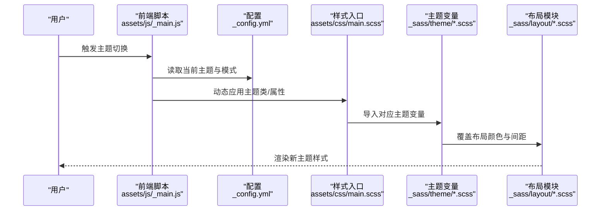
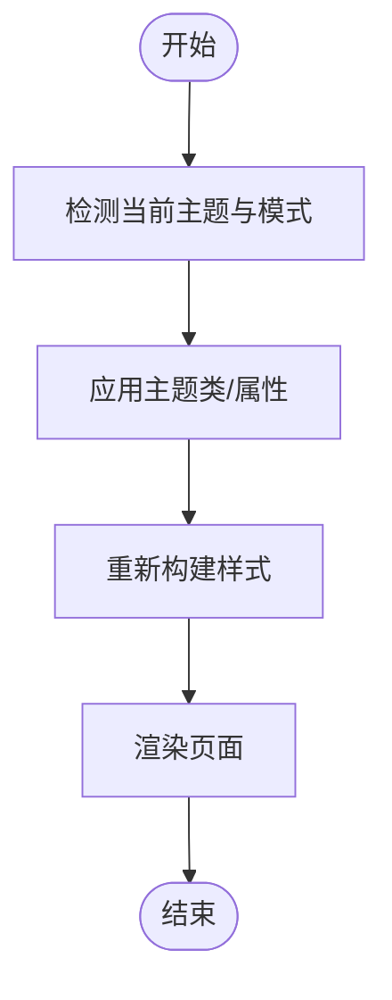
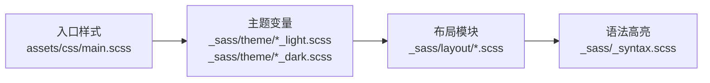
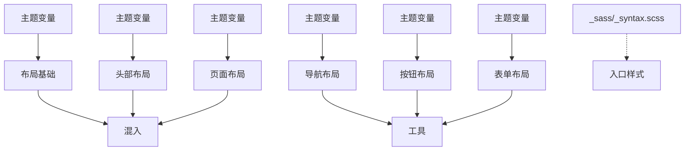

# 主题实现机制

<cite>
**本文引用的文件**
- [_sass/_themes.scss](file://_sass/_themes.scss)
- [_sass/theme/_default_light.scss](file://_sass/theme/_default_light.scss)
- [_sass/theme/_default_dark.scss](file://_sass/theme/_default_dark.scss)
- [_sass/theme/_air_light.scss](file://_sass/theme/_air_light.scss)
- [_sass/theme/_air_dark.scss](file://_sass/theme/_air_dark.scss)
- [_sass/theme/_sunrise_light.scss](file://_sass/theme/_sunrise_light.scss)
- [_sass/theme/_sunrise_dark.scss](file://_sass/theme/_sunrise_dark.scss)
- [_sass/theme/_mint_light.scss](file://_sass/theme/_mint_light.scss)
- [_sass/theme/_mint_dark.scss](file://_sass/theme/_mint_dark.scss)
- [_sass/theme/_dirt_light.scss](file://_sass/theme/_dirt_light.scss)
- [_sass/theme/_dirt_dark.scss](file://_sass/theme/_dirt_dark.scss)
- [_sass/theme/_contrast_light.scss](file://_sass/theme/_contrast_light.scss)
- [_sass/theme/_contrast_dark.scss](file://_sass/theme/_contrast_dark.scss)
- [_sass/layout/_base.scss](file://_sass/layout/_base.scss)
- [_sass/layout/_masthead.scss](file://_sass/layout/_masthead.scss)
- [_sass/layout/_sidebar.scss](file://_sass/layout/_sidebar.scss)
- [_sass/layout/_footer.scss](file://_sass/layout/_footer.scss)
- [_sass/layout/_page.scss](file://_sass/layout/_page.scss)
- [_sass/layout/_navigation.scss](file://_sass/layout/_navigation.scss)
- [_sass/layout/_buttons.scss](file://_sass/layout/_buttons.scss)
- [_sass/layout/_forms.scss](file://_sass/layout/_forms.scss)
- [_sass/layout/_tables.scss](file://_sass/layout/_tables.scss)
- [_sass/layout/_notices.scss](file://_sass/layout/_notices.scss)
- [_sass/layout/_json_cv.scss](file://_sass/layout/_json_cv.scss)
- [_sass/include/_mixins.scss](file://_sass/include/_mixins.scss)
- [_sass/include/_utilities.scss](file://_sass/include/_utilities.scss)
- [_sass/_syntax.scss](file://_sass/_syntax.scss)
- [assets/css/main.scss](file://assets/css/main.scss)
- [_config.yml](file://_config.yml)
- [assets/js/_main.js](file://assets/js/_main.js)
- [assets/js/plugins/jquery.greedy-navigation.js](file://assets/js/plugins/jquery.greedy-navigation.js)
- [images/themes/theme-preview.png](file://images/themes/theme-preview.png)
</cite>

## 目录
1. [引言](#引言)
2. [项目结构](#项目结构)
3. [核心组件](#核心组件)
4. [架构总览](#架构总览)
5. [详细组件分析](#详细组件分析)
6. [依赖关系分析](#依赖关系分析)
7. [性能考虑](#性能考虑)
8. [故障排除指南](#故障排除指南)
9. [结论](#结论)
10. [附录](#附录)

## 引言
本文件系统性解析该 Jekyll 网站的主题实现机制，重点涵盖以下方面：
- 各主题变体（默认、空气、日出、薄荷、泥土、对比度）的设计理念与视觉特征
- 明暗模式的实现原理与切换机制
- 主题文件的组织结构与命名规范
- 主题切换的技术实现细节与性能优化策略
- 主题继承与覆盖的具体示例

为确保准确性，本文所有技术细节均基于仓库中实际存在的 SASS 主题文件与配置进行分析。

## 项目结构
主题系统围绕 SASS 源文件组织，采用“按主题分组 + 按功能模块拆分”的结构：
- 主题源文件：位于 `_sass/theme/`，每个主题包含明/暗两套样式文件
- 布局与组件：位于 `_sass/layout/`，定义页面骨架、导航、表单等通用样式
- 工具与混入：位于 `_sass/include/`，提供复用的工具函数与混入
- 语法高亮：位于 `_sass/_syntax.scss`
- 入口样式：位于 `assets/css/main.scss`，负责编译打包
- 运行时配置：位于根目录 `_config.yml`，控制主题选择与行为
- 前端脚本：位于 `assets/js/`，提供交互与切换逻辑

```mermaid
graph TB
subgraph "SASS 主题层"
THEME_DEFAULT["主题：默认<br/>_sass/theme/_default_light.scss<br/>_sass/theme/_default_dark.scss"]
THEME_AIR["主题：空气<br/>_sass/theme/_air_light.scss<br/>_sass/theme/_air_dark.scss"]
THEME_SUNRISE["主题：日出<br/>_sass/theme/_sunrise_light.scss<br/>_sass/theme/_sunrise_dark.scss"]
THEME_MINT["主题：薄荷<br/>_sass/theme/_mint_light.scss<br/>_sass/theme/_mint_dark.scss"]
THEME_DIRT["主题：泥土<br/>_sass/theme/_dirt_light.scss<br/>_sass/theme/_dirt_dark.scss"]
THEME_CONTRAST["主题：对比度<br/>_sass/theme/_contrast_light.scss<br/>_sass/theme/_contrast_dark.scss"]
end
subgraph "布局与组件层"
LAYOUT_BASE["_sass/layout/_base.scss"]
LAYOUT_MASTHEAD["_sass/layout/_masthead.scss"]
LAYOUT_SIDEBAR["_sass/layout/_sidebar.scss"]
LAYOUT_FOOTER["_sass/layout/_footer.scss"]
LAYOUT_PAGE["_sass/layout/_page.scss"]
LAYOUT_NAV["_sass/layout/_navigation.scss"]
LAYOUT_BUTTONS["_sass/layout/_buttons.scss"]
LAYOUT_FORMS["_sass/layout/_forms.scss"]
LAYOUT_TABLES["_sass/layout/_tables.scss"]
LAYOUT_NOTICES["_sass/layout/_notices.scss"]
LAYOUT_JSON["_sass/layout/_json_cv.scss"]
end
subgraph "工具与语法层"
INCLUDE_MIXINS["_sass/include/_mixins.scss"]
INCLUDE_UTILS["_sass/include/_utilities.scss"]
SYNTAX["_sass/_syntax.scss"]
end
subgraph "入口与配置"
MAIN_SCSS["assets/css/main.scss"]
CONFIG["_config.yml"]
JS_MAIN["assets/js/_main.js"]
end
THEME_DEFAULT --> MAIN_SCSS
THEME_AIR --> MAIN_SCSS
THEME_SUNRISE --> MAIN_SCSS
THEME_MINT --> MAIN_SCSS
THEME_DIRT --> MAIN_SCSS
THEME_CONTRAST --> MAIN_SCSS
LAYOUT_BASE --> MAIN_SCSS
LAYOUT_MASTHEAD --> MAIN_SCSS
LAYOUT_SIDEBAR --> MAIN_SCSS
LAYOUT_FOOTER --> MAIN_SCSS
LAYOUT_PAGE --> MAIN_SCSS
LAYOUT_NAV --> MAIN_SCSS
LAYOUT_BUTTONS --> MAIN_SCSS
LAYOUT_FORMS --> MAIN_SCSS
LAYOUT_TABLES --> MAIN_SCSS
LAYOUT_NOTICES --> MAIN_SCSS
LAYOUT_JSON --> MAIN_SCSS
INCLUDE_MIXINS --> MAIN_SCSS
INCLUDE_UTILS --> MAIN_SCSS
SYNTAX --> MAIN_SCSS
MAIN_SCSS --> CONFIG
JS_MAIN --> CONFIG
```

图表来源
- [_sass/theme/_default_light.scss](file://_sass/theme/_default_light.scss)
- [_sass/theme/_air_light.scss](file://_sass/theme/_air_light.scss)
- [_sass/theme/_sunrise_light.scss](file://_sass/theme/_sunrise_light.scss)
- [_sass/theme/_mint_light.scss](file://_sass/theme/_mint_light.scss)
- [_sass/theme/_dirt_light.scss](file://_sass/theme/_dirt_light.scss)
- [_sass/theme/_contrast_light.scss](file://_sass/theme/_contrast_light.scss)
- [_sass/layout/_base.scss](file://_sass/layout/_base.scss)
- [_sass/layout/_masthead.scss](file://_sass/layout/_masthead.scss)
- [_sass/layout/_sidebar.scss](file://_sass/layout/_sidebar.scss)
- [_sass/layout/_footer.scss](file://_sass/layout/_footer.scss)
- [_sass/layout/_page.scss](file://_sass/layout/_page.scss)
- [_sass/layout/_navigation.scss](file://_sass/layout/_navigation.scss)
- [_sass/layout/_buttons.scss](file://_sass/layout/_buttons.scss)
- [_sass/layout/_forms.scss](file://_sass/layout/_forms.scss)
- [_sass/layout/_tables.scss](file://_sass/layout/_tables.scss)
- [_sass/layout/_notices.scss](file://_sass/layout/_notices.scss)
- [_sass/layout/_json_cv.scss](file://_sass/layout/_json_cv.scss)
- [_sass/include/_mixins.scss](file://_sass/include/_mixins.scss)
- [_sass/include/_utilities.scss](file://_sass/include/_utilities.scss)
- [_sass/_syntax.scss](file://_sass/_syntax.scss)
- [assets/css/main.scss](file://assets/css/main.scss)
- [_config.yml](file://_config.yml)
- [assets/js/_main.js](file://assets/js/_main.js)

章节来源
- [_sass/_themes.scss](file://_sass/_themes.scss)
- [_sass/theme/_default_light.scss](file://_sass/theme/_default_light.scss)
- [_sass/theme/_default_dark.scss](file://_sass/theme/_default_dark.scss)
- [_sass/theme/_air_light.scss](file://_sass/theme/_air_light.scss)
- [_sass/theme/_air_dark.scss](file://_sass/theme/_air_dark.scss)
- [_sass/theme/_sunrise_light.scss](file://_sass/theme/_sunrise_light.scss)
- [_sass/theme/_sunrise_dark.scss](file://_sass/theme/_sunrise_dark.scss)
- [_sass/theme/_mint_light.scss](file://_sass/theme/_mint_light.scss)
- [_sass/theme/_mint_dark.scss](file://_sass/theme/_mint_dark.scss)
- [_sass/theme/_dirt_light.scss](file://_sass/theme/_dirt_light.scss)
- [_sass/theme/_dirt_dark.scss](file://_sass/theme/_dirt_dark.scss)
- [_sass/theme/_contrast_light.scss](file://_sass/theme/_contrast_light.scss)
- [_sass/theme/_contrast_dark.scss](file://_sass/theme/_contrast_dark.scss)
- [_sass/layout/_base.scss](file://_sass/layout/_base.scss)
- [_sass/layout/_masthead.scss](file://_sass/layout/_masthead.scss)
- [_sass/layout/_sidebar.scss](file://_sass/layout/_sidebar.scss)
- [_sass/layout/_footer.scss](file://_sass/layout/_footer.scss)
- [_sass/layout/_page.scss](file://_sass/layout/_page.scss)
- [_sass/layout/_navigation.scss](file://_sass/layout/_navigation.scss)
- [_sass/layout/_buttons.scss](file://_sass/layout/_buttons.scss)
- [_sass/layout/_forms.scss](file://_sass/layout/_forms.scss)
- [_sass/layout/_tables.scss](file://_sass/layout/_tables.scss)
- [_sass/layout/_notices.scss](file://_sass/layout/_notices.scss)
- [_sass/layout/_json_cv.scss](file://_sass/layout/_json_cv.scss)
- [_sass/include/_mixins.scss](file://_sass/include/_mixins.scss)
- [_sass/include/_utilities.scss](file://_sass/include/_utilities.scss)
- [_sass/_syntax.scss](file://_sass/_syntax.scss)
- [assets/css/main.scss](file://assets/css/main.scss)
- [_config.yml](file://_config.yml)
- [assets/js/_main.js](file://assets/js/_main.js)

## 核心组件
- 主题变量与混入：通过 `_sass/include/_mixins.scss` 和 `_sass/include/_utilities.scss` 提供颜色、间距、断点等可复用能力
- 主题色板：各主题在 `_sass/theme/` 下定义明/暗两套变量，覆盖基础布局与组件
- 布局与组件：`_sass/layout/` 下的模块化样式，按页面区域划分，便于主题覆盖
- 入口样式：`assets/css/main.scss` 负责导入主题与布局，最终生成 CSS
- 配置与运行时：`_config.yml` 控制主题选择；`assets/js/_main.js` 提供切换逻辑

章节来源
- [_sass/include/_mixins.scss](file://_sass/include/_mixins.scss)
- [_sass/include/_utilities.scss](file://_sass/include/_utilities.scss)
- [_sass/theme/_default_light.scss](file://_sass/theme/_default_light.scss)
- [_sass/layout/_base.scss](file://_sass/layout/_base.scss)
- [assets/css/main.scss](file://assets/css/main.scss)
- [_config.yml](file://_config.yml)
- [assets/js/_main.js](file://assets/js/_main.js)

## 架构总览
主题系统采用“主题变量 + 布局模块 + 语法高亮”的分层架构。编译流程如下：
- 编译阶段：SASS 导入主题变量与布局模块，生成单一 CSS 文件
- 运行阶段：浏览器加载 CSS，用户通过前端脚本切换主题与明暗模式

图表来源
- [assets/js/_main.js](file://assets/js/_main.js)
- [_config.yml](file://_config.yml)
- [assets/css/main.scss](file://assets/css/main.scss)
- [_sass/theme/_default_light.scss](file://_sass/theme/_default_light.scss)
- [_sass/layout/_base.scss](file://_sass/layout/_base.scss)

## 详细组件分析

### 默认主题（Default）
- 设计理念：平衡、通用、易读，适合作为基础主题
- 视觉特征：中性色调，强调内容可读性与信息层级
- 实现要点：通过明/暗两套变量覆盖基础布局，保持与其他主题一致的继承结构

章节来源
- [_sass/theme/_default_light.scss](file://_sass/theme/_default_light.scss)
- [_sass/theme/_default_dark.scss](file://_sass/theme/_default_dark.scss)
- [_sass/layout/_base.scss](file://_sass/layout/_base.scss)

### 空气主题（Air）
- 设计理念：轻盈、通透、留白多，营造呼吸感
- 视觉特征：浅色背景、柔和边框、大面积留白
- 实现要点：明/暗模式下均强调对比度与层次，减少装饰元素

章节来源
- [_sass/theme/_air_light.scss](file://_sass/theme/_air_light.scss)
- [_sass/theme/_air_dark.scss](file://_sass/theme/_air_dark.scss)
- [_sass/layout/_sidebar.scss](file://_sass/layout/_sidebar.scss)

### 日出主题（Sunrise）
- 设计理念：温暖、活力、渐变，体现朝气与希望
- 视觉特征：暖色调渐变、强调主色块与高光
- 实现要点：通过渐变与强调色提升视觉焦点，注意在暗模式下的可读性

章节来源
- [_sass/theme/_sunrise_light.scss](file://_sass/theme/_sunrise_light.scss)
- [_sass/theme/_sunrise_dark.scss](file://_sass/theme/_sunrise_dark.scss)
- [_sass/layout/_masthead.scss](file://_sass/layout/_masthead.scss)

### 薄荷主题（Mint）
- 设计理念：清新、冷调、简洁，强调专业与效率
- 视觉特征：冷色系、锐利线条、高对比
- 实现要点：在按钮与导航中突出几何美感，避免过度装饰

章节来源
- [_sass/theme/_mint_light.scss](file://_sass/theme/_mint_light.scss)
- [_sass/theme/_mint_dark.scss](file://_sass/theme/_mint_dark.scss)
- [_sass/layout/_buttons.scss](file://_sass/layout/_buttons.scss)

### 泥土主题（Dirt）
- 设计理念：自然、质朴、稳重，贴近大地与传统
- 视觉特征：暖灰/土色系、纹理与自然元素暗示
- 实现要点：在暗模式下增强质感，避免过亮导致刺眼

章节来源
- [_sass/theme/_dirt_light.scss](file://_sass/theme/_dirt_light.scss)
- [_sass/theme/_dirt_dark.scss](file://_sass/theme/_dirt_dark.scss)
- [_sass/layout/_page.scss](file://_sass/layout/_page.scss)

### 对比度主题（Contrast）
- 设计理念：高对比、强可读性，面向长时间阅读与无障碍
- 视觉特征：黑白为主或高对比配色，强调文字与背景分离
- 实现要点：严格遵循对比度标准，确保在不同设备上的一致性

章节来源
- [_sass/theme/_contrast_light.scss](file://_sass/theme/_contrast_light.scss)
- [_sass/theme/_contrast_dark.scss](file://_sass/theme/_contrast_dark.scss)
- [_sass/layout/_forms.scss](file://_sass/layout/_forms.scss)

### 明暗模式实现原理与切换机制
- 原理：通过主题变量区分明/暗模式，结合运行时类名或属性切换主题
- 切换机制：前端脚本读取配置，动态应用主题类，触发 SASS 变量重载与样式更新
- 一致性：所有主题均提供明/暗两套变量，保证切换体验统一

图表来源
- [assets/js/_main.js](file://assets/js/_main.js)
- [_config.yml](file://_config.yml)
- [assets/css/main.scss](file://assets/css/main.scss)

### 主题文件组织结构与命名规范
- 组织结构：按主题分组存放于 `_sass/theme/`，每个主题包含明/暗两个文件
- 命名规范：`_主题名_模式.scss`，如 `_default_light.scss`、`_air_dark.scss`
- 导入顺序：入口文件先导入主题变量，再导入布局模块，确保变量优先级正确

章节来源
- [_sass/theme/_default_light.scss](file://_sass/theme/_default_light.scss)
- [_sass/theme/_air_light.scss](file://_sass/theme/_air_light.scss)
- [_sass/theme/_sunrise_light.scss](file://_sass/theme/_sunrise_light.scss)
- [_sass/theme/_mint_light.scss](file://_sass/theme/_mint_light.scss)
- [_sass/theme/_dirt_light.scss](file://_sass/theme/_dirt_light.scss)
- [_sass/theme/_contrast_light.scss](file://_sass/theme/_contrast_light.scss)
- [assets/css/main.scss](file://assets/css/main.scss)

### 主题继承与覆盖示例
- 继承链：入口样式 → 主题变量 → 布局模块 → 语法高亮
- 覆盖策略：主题变量优先级高于默认布局，局部组件可进一步覆盖主题变量
- 示例路径：
  - 主题变量导入：[assets/css/main.scss](file://assets/css/main.scss)
  - 基础布局覆盖：[_sass/layout/_base.scss](file://_sass/layout/_base.scss)
  - 导航覆盖：[_sass/layout/_navigation.scss](file://_sass/layout/_navigation.scss)
  - 表单覆盖：[_sass/layout/_forms.scss](file://_sass/layout/_forms.scss)

图表来源
- [assets/css/main.scss](file://assets/css/main.scss)
- [_sass/theme/_default_light.scss](file://_sass/theme/_default_light.scss)
- [_sass/layout/_base.scss](file://_sass/layout/_base.scss)
- [_sass/_syntax.scss](file://_sass/_syntax.scss)

## 依赖关系分析
- 主题对布局的依赖：主题变量覆盖布局模块，形成“主题 → 布局”的单向依赖
- 布局对工具的依赖：布局模块使用混入与工具函数，确保变量与计算的一致性
- 语法高亮独立于主题：通过统一入口导入，避免主题污染

图表来源
- [_sass/theme/_default_light.scss](file://_sass/theme/_default_light.scss)
- [_sass/theme/_air_light.scss](file://_sass/theme/_air_light.scss)
- [_sass/theme/_sunrise_light.scss](file://_sass/theme/_sunrise_light.scss)
- [_sass/theme/_mint_light.scss](file://_sass/theme/_mint_light.scss)
- [_sass/theme/_dirt_light.scss](file://_sass/theme/_dirt_light.scss)
- [_sass/theme/_contrast_light.scss](file://_sass/theme/_contrast_light.scss)
- [_sass/layout/_base.scss](file://_sass/layout/_base.scss)
- [_sass/layout/_navigation.scss](file://_sass/layout/_navigation.scss)
- [_sass/layout/_masthead.scss](file://_sass/layout/_masthead.scss)
- [_sass/layout/_buttons.scss](file://_sass/layout/_buttons.scss)
- [_sass/layout/_page.scss](file://_sass/layout/_page.scss)
- [_sass/layout/_forms.scss](file://_sass/layout/_forms.scss)
- [_sass/include/_mixins.scss](file://_sass/include/_mixins.scss)
- [_sass/include/_utilities.scss](file://_sass/include/_utilities.scss)
- [_sass/_syntax.scss](file://_sass/_syntax.scss)
- [assets/css/main.scss](file://assets/css/main.scss)

章节来源
- [_sass/theme/_default_light.scss](file://_sass/theme/_default_light.scss)
- [_sass/theme/_air_light.scss](file://_sass/theme/_air_light.scss)
- [_sass/theme/_sunrise_light.scss](file://_sass/theme/_sunrise_light.scss)
- [_sass/theme/_mint_light.scss](file://_sass/theme/_mint_light.scss)
- [_sass/theme/_dirt_light.scss](file://_sass/theme/_dirt_light.scss)
- [_sass/theme/_contrast_light.scss](file://_sass/theme/_contrast_light.scss)
- [_sass/layout/_base.scss](file://_sass/layout/_base.scss)
- [_sass/layout/_navigation.scss](file://_sass/layout/_navigation.scss)
- [_sass/layout/_masthead.scss](file://_sass/layout/_masthead.scss)
- [_sass/layout/_buttons.scss](file://_sass/layout/_buttons.scss)
- [_sass/layout/_page.scss](file://_sass/layout/_page.scss)
- [_sass/layout/_forms.scss](file://_sass/layout/_forms.scss)
- [_sass/include/_mixins.scss](file://_sass/include/_mixins.scss)
- [_sass/include/_utilities.scss](file://_sass/include/_utilities.scss)
- [_sass/_syntax.scss](file://_sass/_syntax.scss)
- [assets/css/main.scss](file://assets/css/main.scss)

## 性能考虑
- 编译期优化：合并主题变量与布局模块，减少重复计算
- 运行期优化：通过类名切换而非全量重绘，降低 DOM 变更成本
- 资源体积：避免在主题中引入大体量资源，优先使用变量与混入
- 可维护性：统一命名与导入顺序，便于增量更新与回滚

## 故障排除指南
- 主题不生效：检查入口样式是否正确导入目标主题变量
- 样式冲突：确认布局模块未被错误覆盖，必要时调整导入顺序
- 明暗模式异常：验证前端脚本是否正确应用主题类，以及配置项是否正确设置
- 语法高亮异常：检查语法样式是否与当前主题变量兼容

章节来源
- [assets/js/_main.js](file://assets/js/_main.js)
- [_config.yml](file://_config.yml)
- [assets/css/main.scss](file://assets/css/main.scss)

## 结论
该主题系统通过“主题变量 + 模块化布局 + 统一入口”的设计，在保证可扩展性的同时实现了跨主题的一致体验。建议在新增主题时遵循现有命名与导入规范，并在明/暗模式下分别验证可读性与对比度。

## 附录
- 主题预览图：images/themes/theme-preview.png（用于直观展示各主题效果）