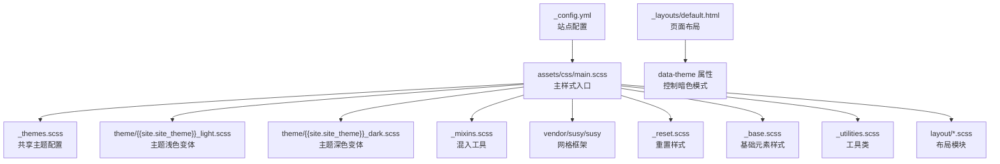
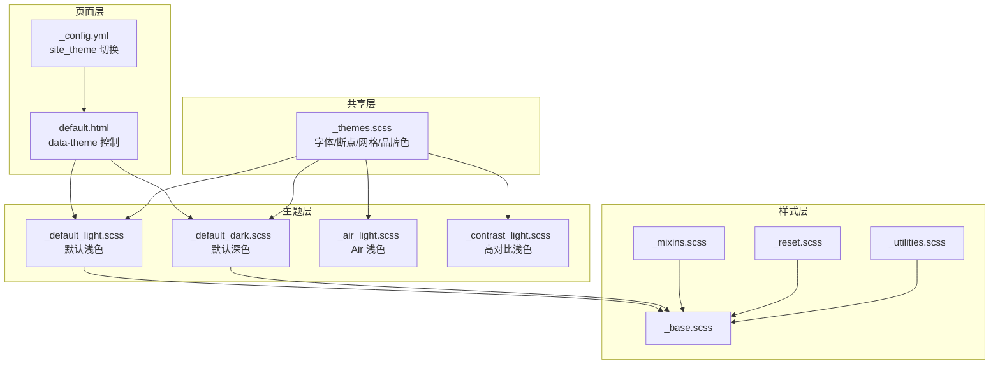
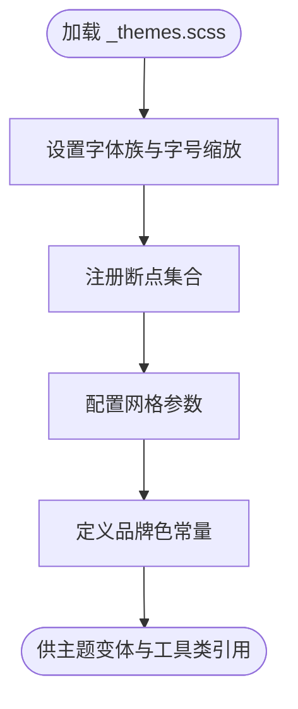
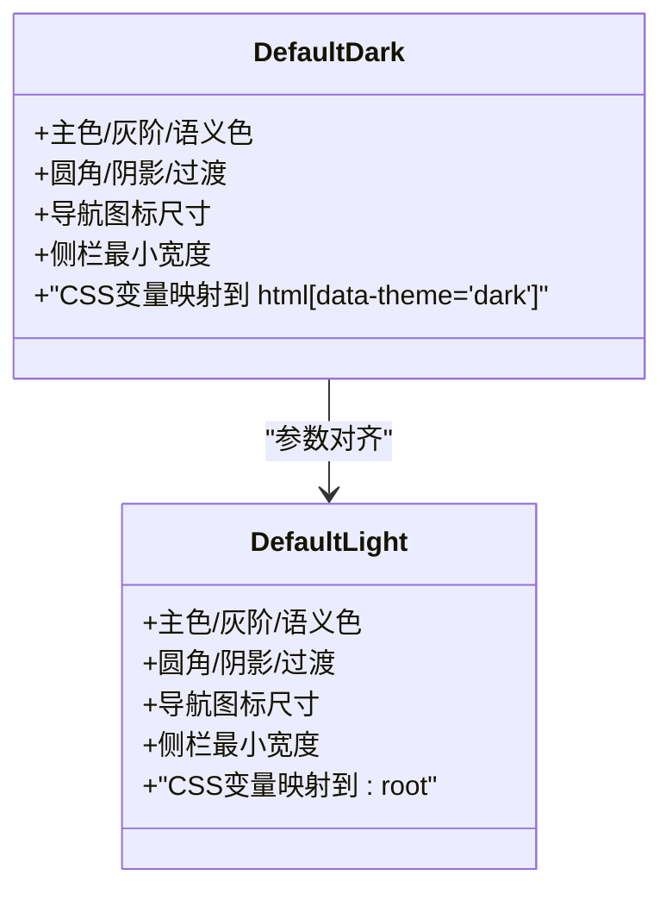
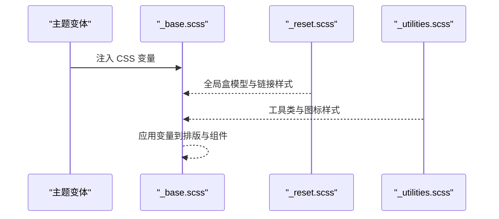
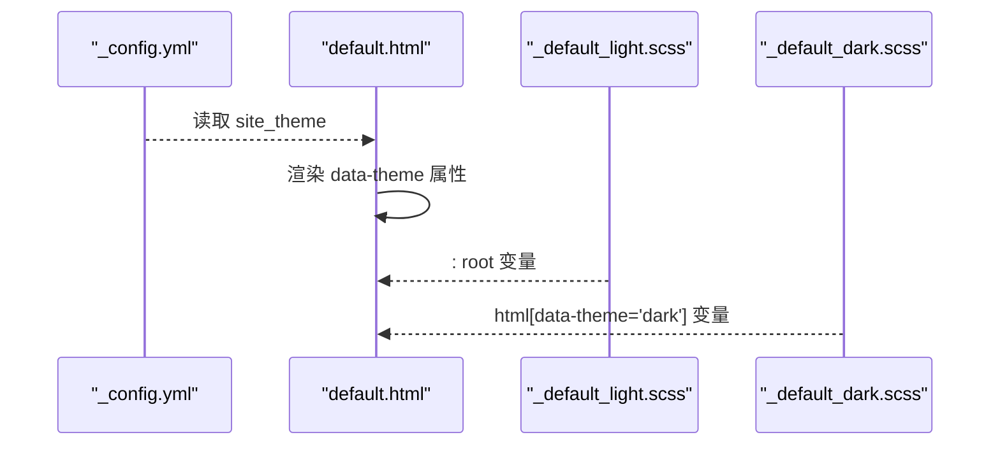
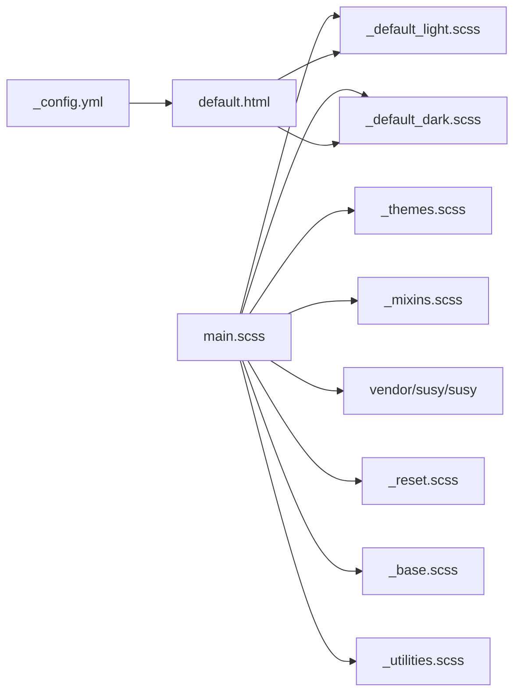

# 主题架构概览

<cite>
**本文档引用的文件**
- [_themes.scss](file://_sass/_themes.scss)
- [main.scss](file://assets/css/main.scss)
- [_config.yml](file://_config.yml)
- [_default_light.scss](file://_sass/theme/_default_light.scss)
- [_default_dark.scss](file://_sass/theme/_default_dark.scss)
- [_air_light.scss](file://_sass/theme/_air_light.scss)
- [_contrast_light.scss](file://_sass/theme/_contrast_light.scss)
- [_mixins.scss](file://_sass/include/_mixins.scss)
- [_base.scss](file://_sass/layout/_base.scss)
- [_reset.scss](file://_sass/layout/_reset.scss)
- [_utilities.scss](file://_sass/include/_utilities.scss)
- [default.html](file://_layouts/default.html)
</cite>

## 目录
1. [简介](#简介)
2. [项目结构](#项目结构)
3. [核心组件](#核心组件)
4. [架构总览](#架构总览)
5. [详细组件分析](#详细组件分析)
6. [依赖关系分析](#依赖关系分析)
7. [性能考量](#性能考量)
8. [故障排查指南](#故障排查指南)
9. [结论](#结论)

## 简介
本文件面向主题系统的整体设计理念与架构原理，聚焦以下目标：
- 解释主题系统的模块化设计与可扩展性
- 深入解析 _themes.scss 的核心配置项（字体系统、断点、网格等）
- 说明主题变量的命名规范与作用域管理
- 提供主题系统与其他组件的集成关系图
- 给出技术决策背景与设计权衡

## 项目结构
主题系统围绕 SCSS 模块组织，通过主入口样式文件统一导入，结合 Jekyll 配置实现主题切换与暗色模式支持。

**图表来源**
- [main.scss:11-43](file://assets/css/main.scss#L11-L43)
- [_themes.scss:1-104](file://_sass/_themes.scss#L1-L104)
- [_config.yml:10-11](file://_config.yml#L10-L11)
- [default.html:8-8](file://_layouts/default.html#L8-L8)

**章节来源**
- [main.scss:11-43](file://assets/css/main.scss#L11-L43)
- [_config.yml:10-11](file://_config.yml#L10-L11)
- [default.html:8-8](file://_layouts/default.html#L8-L8)

## 核心组件
- 共享主题配置：集中定义字体、断点、网格、品牌色等全局参数，供各主题变体复用。
- 主题变体：按“主题名_颜色模式”命名，分别提供浅色与深色两套 CSS 变量映射。
- 布局与工具：Reset/Base/Utilities 等模块化样式，配合混入与断点工具实现响应式与一致性。
- 页面布局：通过 Liquid 注入 data-theme 属性，驱动深色模式切换。

**章节来源**
- [_themes.scss:1-104](file://_sass/_themes.scss#L1-L104)
- [_default_light.scss:1-49](file://_sass/theme/_default_light.scss#L1-L49)
- [_default_dark.scss:1-57](file://_sass/theme/_default_dark.scss#L1-L57)
- [_reset.scss:1-179](file://_sass/layout/_reset.scss#L1-L179)
- [_base.scss:1-365](file://_sass/layout/_base.scss#L1-L365)
- [_utilities.scss:1-501](file://_sass/include/_utilities.scss#L1-L501)
- [_mixins.scss:1-53](file://_sass/include/_mixins.scss#L1-L53)
- [default.html:8-8](file://_layouts/default.html#L8-L8)

## 架构总览
主题系统采用“共享配置 + 多主题变体 + 响应式工具”的分层架构。共享配置提供跨主题一致的排版、断点与网格；主题变体以 CSS 自定义属性形式注入颜色与尺寸；布局模块在基础之上构建页面结构；页面布局负责运行时的明暗模式切换。

**图表来源**
- [_themes.scss:1-104](file://_sass/_themes.scss#L1-L104)
- [_default_light.scss:1-49](file://_sass/theme/_default_light.scss#L1-L49)
- [_default_dark.scss:1-57](file://_sass/theme/_default_dark.scss#L1-L57)
- [_air_light.scss:1-56](file://_sass/theme/_air_light.scss#L1-L56)
- [_contrast_light.scss:1-97](file://_sass/theme/_contrast_light.scss#L1-L97)
- [_reset.scss:1-179](file://_sass/layout/_reset.scss#L1-L179)
- [_base.scss:1-365](file://_sass/layout/_base.scss#L1-L365)
- [_utilities.scss:1-501](file://_sass/include/_utilities.scss#L1-L501)
- [_mixins.scss:1-53](file://_sass/include/_mixins.scss#L1-L53)
- [default.html:8-8](file://_layouts/default.html#L8-L8)
- [_config.yml:10-11](file://_config.yml#L10-L11)

## 详细组件分析

### 共享主题配置（_themes.scss）
- 字体系统
  - 定义正文字体族、标题字体族、引用字体族与等宽字体族
  - 提供多套无衬线与衬线字体备选，确保跨平台可用性
  - 定义字号缩放比例，形成一致的层级体系
- 断点设置
  - 使用断点工具库进行单位转换与断点注册
  - 定义 small/medium/medium-wide/large/x-large 等断点，支撑响应式布局
- 网格系统
  - 基于网格框架配置列数、列宽、间距、容器宽度与盒模型策略
  - 支持流式网格与浮动输出，满足不同布局需求
- 品牌色系
  - 定义社交平台品牌色常量，供工具类与图标使用

**图表来源**
- [_themes.scss:10-104](file://_sass/_themes.scss#L10-L104)

**章节来源**
- [_themes.scss:10-104](file://_sass/_themes.scss#L10-L104)

### 主题变体（以默认主题为例）
- 默认浅色变体
  - 定义主色、灰阶与语义色
  - 通过 CSS 自定义属性映射到根节点，覆盖全局文本、链接、边框、代码背景等
  - 设置过渡动画、导航图标尺寸与侧栏最小宽度等交互细节
- 默认深色变体
  - 在深色模式选择器中重映射上述变量，实现夜间视觉体验
  - 保持与浅色变体一致的交互与布局参数

**图表来源**
- [_default_light.scss:5-49](file://_sass/theme/_default_light.scss#L5-L49)
- [_default_dark.scss:6-57](file://_sass/theme/_default_dark.scss#L6-L57)

**章节来源**
- [_default_light.scss:1-49](file://_sass/theme/_default_light.scss#L1-L49)
- [_default_dark.scss:1-57](file://_sass/theme/_default_dark.scss#L1-L57)

### 响应式与工具（_mixins.scss、_utilities.scss、_base.scss、_reset.scss）
- 混入与函数
  - 提供焦点环样式混入、em 单位换算函数与通用清除浮动混入
- 工具类
  - 提供可见性、对齐、图标、导航图标、模态框、脚注等实用类
  - 社交图标类使用品牌色常量，确保与主题一致
- 基础与重置
  - Reset 负责全局盒模型、字体大小与链接状态
  - Base 将全局颜色、字体族、标题层级、列表与表格等映射至 CSS 变量

**图表来源**
- [_base.scss:10-165](file://_sass/layout/_base.scss#L10-L165)
- [_reset.scss:7-115](file://_sass/layout/_reset.scss#L7-L115)
- [_utilities.scss:198-313](file://_sass/include/_utilities.scss#L198-L313)
- [_mixins.scss:17-19](file://_sass/include/_mixins.scss#L17-L19)

**章节来源**
- [_mixins.scss:1-53](file://_sass/include/_mixins.scss#L1-L53)
- [_utilities.scss:1-501](file://_sass/include/_utilities.scss#L1-L501)
- [_base.scss:1-365](file://_sass/layout/_base.scss#L1-L365)
- [_reset.scss:1-179](file://_sass/layout/_reset.scss#L1-L179)

### 页面布局与运行时切换（default.html、_config.yml）
- 站点配置
  - 通过站点配置项选择当前主题（默认/air/sunrise/mint/dirt/contrast）
- 页面布局
  - 在 HTML 根元素上根据主题配置添加 data-theme 属性
  - 深色变体通过选择器生效，实现明暗模式切换

**图表来源**
- [_config.yml:10-11](file://_config.yml#L10-L11)
- [default.html:8-8](file://_layouts/default.html#L8-L8)
- [_default_light.scss:30-47](file://_sass/theme/_default_light.scss#L30-L47)
- [_default_dark.scss:38-55](file://_sass/theme/_default_dark.scss#L38-L55)

**章节来源**
- [_config.yml:10-11](file://_config.yml#L10-L11)
- [default.html:8-8](file://_layouts/default.html#L8-L8)

## 依赖关系分析
- 主入口依赖
  - 主样式入口按顺序导入共享配置、主题变体、混入与网格框架，再加载布局与工具模块
  - 导入顺序决定变量与样式的优先级，避免重复覆盖
- 主题变体依赖
  - 主题变体依赖共享配置中的断点、网格与品牌色常量
  - 深色变体依赖浅色变体的参数结构，保证视觉一致性
- 运行时依赖
  - 页面布局依赖站点配置与主题变体，实现明暗模式切换

**图表来源**
- [main.scss:11-43](file://assets/css/main.scss#L11-L43)
- [_themes.scss:1-104](file://_sass/_themes.scss#L1-L104)
- [_default_light.scss:1-49](file://_sass/theme/_default_light.scss#L1-L49)
- [_default_dark.scss:1-57](file://_sass/theme/_default_dark.scss#L1-L57)
- [_mixins.scss:1-53](file://_sass/include/_mixins.scss#L1-L53)
- [_reset.scss:1-179](file://_sass/layout/_reset.scss#L1-L179)
- [_base.scss:1-365](file://_sass/layout/_base.scss#L1-L365)
- [_utilities.scss:1-501](file://_sass/include/_utilities.scss#L1-L501)
- [_config.yml:10-11](file://_config.yml#L10-L11)
- [default.html:8-8](file://_layouts/default.html#L8-L8)

**章节来源**
- [main.scss:11-43](file://assets/css/main.scss#L11-L43)
- [_themes.scss:1-104](file://_sass/_themes.scss#L1-L104)
- [_default_light.scss:1-49](file://_sass/theme/_default_light.scss#L1-L49)
- [_default_dark.scss:1-57](file://_sass/theme/_default_dark.scss#L1-L57)
- [_mixins.scss:1-53](file://_sass/include/_mixins.scss#L1-L53)
- [_reset.scss:1-179](file://_sass/layout/_reset.scss#L1-L179)
- [_base.scss:1-365](file://_sass/layout/_base.scss#L1-L365)
- [_utilities.scss:1-501](file://_sass/include/_utilities.scss#L1-L501)
- [_config.yml:10-11](file://_config.yml#L10-L11)
- [default.html:8-8](file://_layouts/default.html#L8-L8)

## 性能考量
- 样式压缩：主入口启用压缩输出，减少传输体积
- 按需导入：仅导入实际使用的布局与工具模块，避免冗余
- CSS 变量：通过变量集中管理颜色与尺寸，降低重复计算与维护成本
- 断点与网格：统一断点与网格配置，减少媒体查询重复与布局抖动

**章节来源**
- [main.scss:296-298](file://assets/css/main.scss#L296-L298)

## 故障排查指南
- 明暗模式不生效
  - 检查页面布局是否正确渲染 data-theme 属性
  - 确认深色变体选择器与根节点选择器匹配
- 字体或字号异常
  - 检查共享配置中的字体族与字号缩放是否被主题变体覆盖
  - 确认基础样式是否正确应用变量
- 响应式布局错乱
  - 检查断点配置与网格参数是否与布局模块一致
  - 确认工具类的断点使用是否正确

**章节来源**
- [default.html:8-8](file://_layouts/default.html#L8-L8)
- [_themes.scss:50-75](file://_sass/_themes.scss#L50-L75)
- [_base.scss:10-25](file://_sass/layout/_base.scss#L10-L25)
- [_utilities.scss:13-17](file://_sass/include/_utilities.scss#L13-L17)

## 结论
该主题系统通过“共享配置 + 多主题变体 + 响应式工具 + 页面布局”的分层设计，实现了高内聚、低耦合的主题体系。共享配置统一了字体、断点与网格，主题变体以 CSS 变量提供明暗双态，布局与工具模块保障一致的视觉与交互体验。此架构便于扩展新主题与维护现有主题，同时兼顾性能与可访问性。