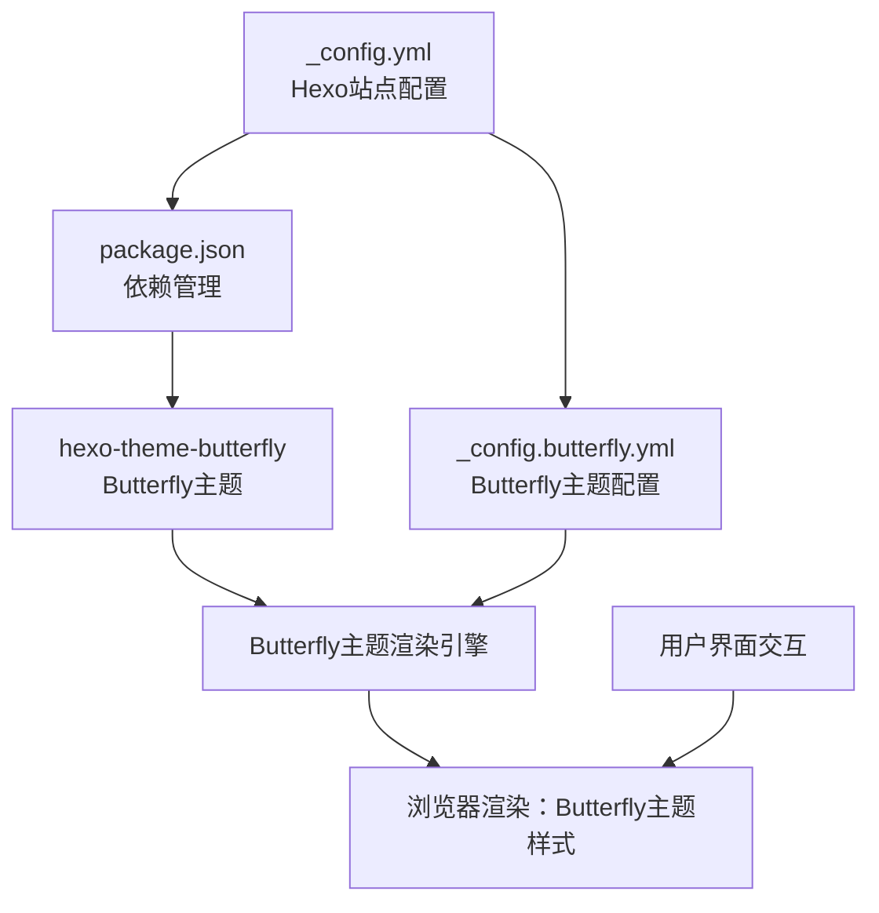
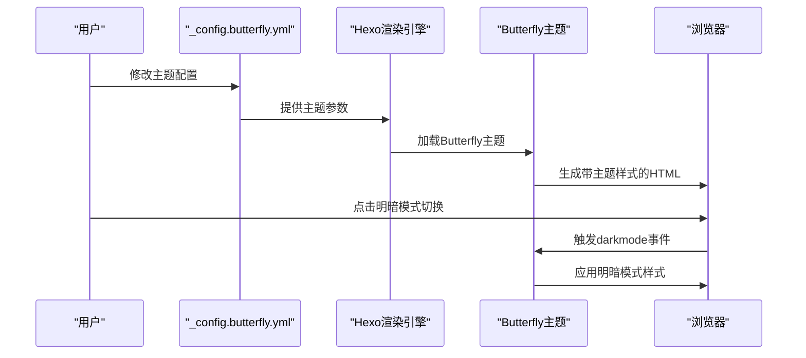
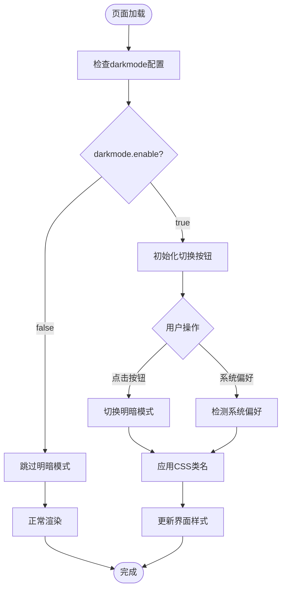

# 主题系统架构

<cite>
**本文引用的文件**
- [_config.yml](file://hexo-site/_config.yml)
- [_config.butterfly.yml](file://hexo-site/_config.butterfly.yml)
- [package.json](file://hexo-site/package.json)
</cite>

## 更新摘要
**所做更改**
- 更新主题系统架构说明，从Jekyll多主题系统迁移至Hexo + Butterfly主题单一主题架构
- 移除Jekyll特定的主题配置和切换机制相关内容
- 新增Hexo配置文件和Butterfly主题配置说明
- 更新项目结构图示，反映Hexo的单一主题架构

## 目录
1. [简介](#简介)
2. [项目结构](#项目结构)
3. [核心组件](#核心组件)
4. [架构总览](#架构总览)
5. [详细组件分析](#详细组件分析)
6. [依赖关系分析](#依赖关系分析)
7. [性能考量](#性能考量)
8. [故障排查指南](#故障排查指南)
9. [结论](#结论)
10. [附录：主题定制与最佳实践](#附录主题定制与最佳实践)

## 简介
本文件系统性解析该 Hexo 网站的主题系统架构与实现原理，重点围绕以下方面展开：
- Hexo + Butterfly 主题的单一主题架构设计
- 主题配置与主题切换机制（基于Butterfly主题的配置系统）
- 明暗模式的实现机制与切换逻辑（Butterfly主题的darkmode配置）
- 主题定制指南（颜色、字体、间距等Butterfly主题参数）
- 性能优化与缓存策略
- 自定义主题开发最佳实践

## 项目结构
主题系统由Hexo配置与Butterfly主题配置协同构成：
- Hexo站点配置：定义基础站点信息和主题选择
- Butterfly主题配置：提供完整的主题定制选项和明暗模式支持
- 依赖管理：通过package.json管理Hexo和Butterfly主题依赖

**图示来源**
- [_config.yml:119](file://hexo-site/_config.yml#L119)
- [package.json:30](file://hexo-site/package.json#L30)
- [_config.butterfly.yml:268](file://hexo-site/_config.butterfly.yml#L268)

**章节来源**
- [_config.yml:119](file://hexo-site/_config.yml#L119)
- [package.json:30](file://hexo-site/package.json#L30)
- [_config.butterfly.yml:268](file://hexo-site/_config.butterfly.yml#L268)

## 核心组件
- Hexo站点配置层：统一管理站点基本信息、URL、部署配置和主题选择
- Butterfly主题配置层：提供导航栏、侧边栏、明暗模式、代码块等完整主题定制选项
- 依赖管理层：通过npm管理Hexo核心和Butterfly主题的版本依赖
- 渲染引擎层：Butterfly主题提供完整的前端渲染和交互功能

**章节来源**
- [_config.yml:1-142](file://hexo-site/_config.yml#L1-L142)
- [_config.butterfly.yml:1-459](file://hexo-site/_config.butterfly.yml#L1-L459)
- [package.json:1-35](file://hexo-site/package.json#L1-L35)

## 架构总览
主题系统采用Hexo静态站点生成器 + Butterfly主题的单一主题架构：
- 配置驱动：通过_yaml配置文件定义主题行为和外观
- 渲染引擎：Butterfly主题提供完整的前端渲染和交互功能
- 明暗模式：内置的darkmode配置支持自动切换和手动切换

**图示来源**
- [_config.butterfly.yml:268](file://hexo-site/_config.butterfly.yml#L268)
- [_config.butterfly.yml:270](file://hexo-site/_config.butterfly.yml#L270)

**章节来源**
- [_config.butterfly.yml:268](file://hexo-site/_config.butterfly.yml#L268)
- [_config.butterfly.yml:270](file://hexo-site/_config.butterfly.yml#L270)

## 详细组件分析

### Hexo站点配置
- 基础信息：站点标题、副标题、描述、关键词、作者等元数据配置
- URL和链接：网站地址、文章链接格式、URL美化设置
- 目录结构：源文件目录、公开目录、归档目录等路径配置
- 主题选择：通过theme字段指定使用butterfly主题
- 部署配置：Git部署设置，支持GitHub Pages自动化部署

**章节来源**
- [_config.yml:1-142](file://hexo-site/_config.yml#L1-L142)

### Butterfly主题配置
- 导航栏配置：Logo设置、菜单项配置、固定导航栏选项
- 社交媒体集成：GitHub、邮箱等社交链接配置
- 主题外观：背景色设置、封面图配置、整体视觉风格
- 侧边栏功能：作者信息卡片、最新文章、分类等模块配置
- 明暗模式：enable开关、按钮显示、自动切换逻辑
- 功能模块：代码块主题、数学公式、Mermaid图表、搜索功能等

**章节来源**
- [_config.butterfly.yml:1-459](file://hexo-site/_config.butterfly.yml#L1-L459)

### 明暗模式实现机制
- 配置开关：通过darkmode.enable控制明暗模式功能
- 用户界面：button选项控制明暗模式切换按钮的显示
- 自动检测：基于浏览器系统偏好和用户行为的智能切换
- 样式应用：通过CSS类名和内联样式的动态切换实现主题切换

**图示来源**
- [_config.butterfly.yml:268](file://hexo-site/_config.butterfly.yml#L268)
- [_config.butterfly.yml:270](file://hexo-site/_config.butterfly.yml#L270)

**章节来源**
- [_config.butterfly.yml:268](file://hexo-site/_config.butterfly.yml#L268)
- [_config.butterfly.yml:270](file://hexo-site/_config.butterfly.yml#L270)

### 依赖关系分析
- 核心依赖：hexo@^7.0.0提供静态站点生成能力
- 主题依赖：hexo-theme-butterfly@^5.5.4提供主题渲染引擎
- 渲染器：hexo-renderer-stylus支持Stylus预处理器
- 插件生态：支持多种Hexo插件扩展功能
- 版本兼容：确保Hexo核心与Butterfly主题的版本兼容性

**章节来源**
- [package.json:14-32](file://hexo-site/package.json#L14-L32)

## 性能考量
- 构建效率：Hexo静态生成在构建时完成所有主题处理，运行时只需加载静态资源
- 资源优化：Butterfly主题提供资源压缩和CDN支持选项
- 缓存策略：浏览器缓存静态资源，Hexo生成的HTML具有良好的缓存友好性
- 渲染性能：Butterfly主题优化了前端渲染性能，支持懒加载和按需加载
- 移动端优化：响应式设计确保在各种设备上的良好性能表现

## 故障排查指南
- 主题未加载
  - 检查_hexo-site/_config.yml中的theme字段是否正确设置为butterfly
  - 确认node_modules中已安装hexo-theme-butterfly包
- 配置不生效
  - 验证_hexo-site/_config.butterfly.yml语法正确性
  - 检查配置项的缩进和格式是否符合YAML规范
- 明暗模式异常
  - 确认darkmode.enable设置为true
  - 检查浏览器控制台是否有JavaScript错误
- 构建失败
  - 运行npm install安装所有依赖
  - 检查Hexo版本与Butterfly主题的兼容性

**章节来源**
- [_config.yml:119](file://hexo-site/_config.yml#L119)
- [_config.butterfly.yml:268](file://hexo-site/_config.butterfly.yml#L268)
- [package.json:30](file://hexo-site/package.json#L30)

## 结论
该主题系统通过Hexo静态站点生成器 + Butterfly主题的单一主题架构，实现了高性能、可维护且功能丰富的个人网站解决方案。相比之前的Jekyll多主题系统，Hexo + Butterfly架构提供了更简洁的配置管理和更强大的主题定制能力。

## 附录：主题定制与最佳实践

### 主题定制步骤
- 基础配置：在_hexo-site/_config.yml中设置站点基本信息和主题选择
- 主题配置：在_hexo-site/_config.butterfly.yml中配置导航栏、侧边栏、明暗模式等功能
- 功能开关：根据需求启用或禁用相应的功能模块
- 样式定制：通过注入自定义CSS或修改主题参数实现外观定制
- 验证测试：使用hexo server启动本地服务器测试配置效果

**章节来源**
- [_config.yml:1-142](file://hexo-site/_config.yml#L1-L142)
- [_config.butterfly.yml:1-459](file://hexo-site/_config.butterfly.yml#L1-L459)

### 自定义主题开发最佳实践
- 配置优先：优先使用配置文件而非直接修改主题源码
- 渐进增强：从基础配置开始，逐步添加高级功能
- 版本管理：关注Hexo和Butterfly主题的版本更新，及时升级
- 性能优化：合理配置资源加载和缓存策略
- 兼容性测试：在不同浏览器和设备上测试主题效果
- 备份策略：定期备份配置文件，防止配置丢失

**章节来源**
- [_config.butterfly.yml:1-459](file://hexo-site/_config.butterfly.yml#L1-L459)
- [package.json:1-35](file://hexo-site/package.json#L1-L35)