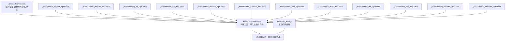
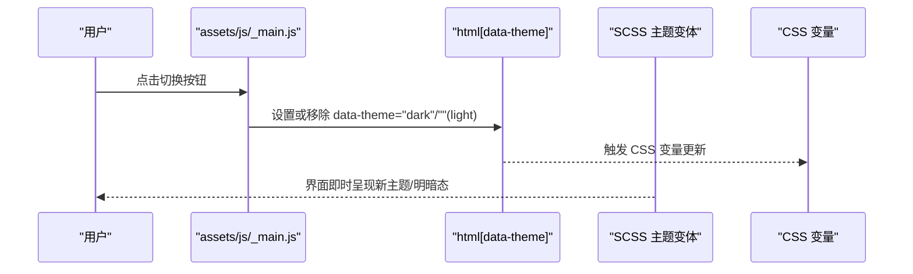
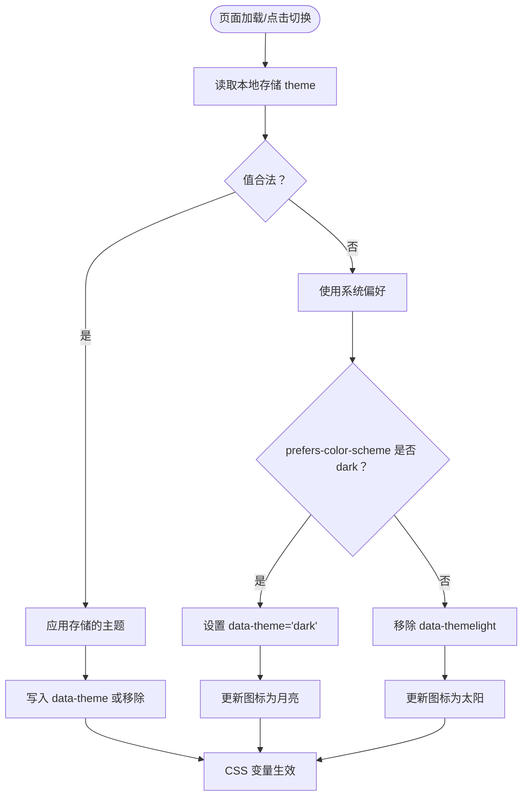
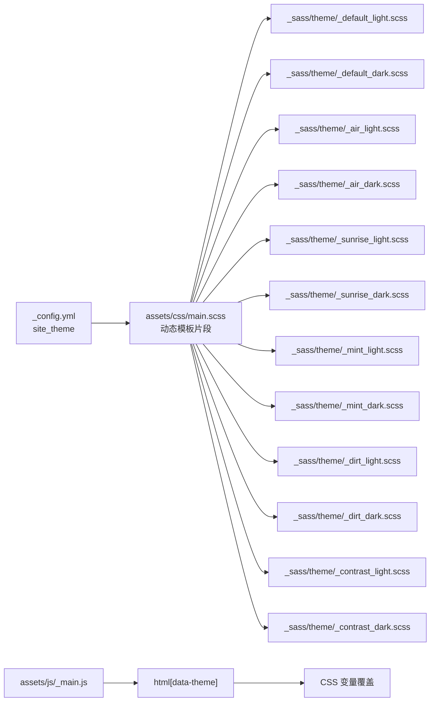

# 主题系统架构

<cite>
**本文引用的文件**
- [_sass/_themes.scss](file://_sass/_themes.scss)
- [_sass/theme/_default_light.scss](file://_sass/theme/_default_light.scss)
- [_sass/theme/_default_dark.scss](file://_sass/theme/_default_dark.scss)
- [_sass/theme/_air_light.scss](file://_sass/theme/_air_light.scss)
- [_sass/theme/_air_dark.scss](file://_sass/theme/_air_dark.scss)
- [_sass/theme/_sunrise_light.scss](file://_sass/theme/_sunrise_light.scss)
- [_sass/theme/_sunrise_dark.scss](file://_sass/theme/_sunrise_dark.scss)
- [_sass/theme/_mint_light.scss](file://_sass/theme/_mint_light.scss)
- [_sass/theme/_mint_dark.scss](file://_sass/theme/_mint_dark.scss)
- [_sass/theme/_dirt_light.scss](file://_sass/theme/_dirt_light.scss)
- [_sass/theme/_dirt_dark.scss](file://_sass/theme/_dirt_dark.scss)
- [_sass/theme/_contrast_light.scss](file://_sass/theme/_contrast_light.scss)
- [_sass/theme/_contrast_dark.scss](file://_sass/theme/_contrast_dark.scss)
- [assets/css/main.scss](file://assets/css/main.scss)
- [assets/js/_main.js](file://assets/js/_main.js)
- [_config.yml](file://_config.yml)
</cite>

## 目录
1. [简介](#简介)
2. [项目结构](#项目结构)
3. [核心组件](#核心组件)
4. [架构总览](#架构总览)
5. [详细组件分析](#详细组件分析)
6. [依赖关系分析](#依赖关系分析)
7. [性能考量](#性能考量)
8. [故障排查指南](#故障排查指南)
9. [结论](#结论)
10. [附录：主题定制与最佳实践](#附录主题定制与最佳实践)

## 简介
本文件系统性解析该 Jekyll 网站的主题系统架构与实现原理，重点围绕以下方面展开：
- 主题配置与主题切换机制（基于 SCSS 变量与 CSS 自定义属性）
- 各主题变体（默认、空气、日出、薄荷、泥土、对比度）的实现细节与视觉特征
- 明暗模式的实现机制与切换逻辑（浏览器偏好、用户设置、DOM 属性）
- 主题变量的继承与覆盖规则
- 主题定制指南（颜色、字体、间距等）
- 性能优化与缓存策略
- 自定义主题开发最佳实践

## 项目结构
主题系统由三部分协同构成：
- 全局共享主题变量与断点、网格等基础配置（SCSS）
- 多主题变体（每主题包含“亮色”与“暗色”两套样式）
- 构建入口与运行时切换逻辑（SCSS 导入顺序、JS 切换）

图示来源
- [_sass/_themes.scss:1-104](file://_sass/_themes.scss#L1-L104)
- [assets/css/main.scss:11-16](file://assets/css/main.scss#L11-L16)
- [_sass/theme/_default_light.scss:1-49](file://_sass/theme/_default_light.scss#L1-L49)
- [_sass/theme/_default_dark.scss:1-57](file://_sass/theme/_default_dark.scss#L1-L57)
- [_sass/theme/_air_light.scss:1-56](file://_sass/theme/_air_light.scss#L1-L56)
- [_sass/theme/_air_dark.scss:1-56](file://_sass/theme/_air_dark.scss#L1-L56)
- [_sass/theme/_sunrise_light.scss:1-64](file://_sass/theme/_sunrise_light.scss#L1-L64)
- [_sass/theme/_sunrise_dark.scss:1-60](file://_sass/theme/_sunrise_dark.scss#L1-L60)
- [_sass/theme/_mint_light.scss:1-65](file://_sass/theme/_mint_light.scss#L1-L65)
- [_sass/theme/_mint_dark.scss:1-62](file://_sass/theme/_mint_dark.scss#L1-L62)
- [_sass/theme/_dirt_light.scss:1-63](file://_sass/theme/_dirt_light.scss#L1-L63)
- [_sass/theme/_dirt_dark.scss:1-64](file://_sass/theme/_dirt_dark.scss#L1-L64)
- [_sass/theme/_contrast_light.scss:1-97](file://_sass/theme/_contrast_light.scss#L1-L97)
- [_sass/theme/_contrast_dark.scss:1-120](file://_sass/theme/_contrast_dark.scss#L1-L120)
- [assets/js/_main.js:5-48](file://assets/js/_main.js#L5-L48)

章节来源
- [assets/css/main.scss:11-16](file://assets/css/main.scss#L11-L16)
- [_sass/_themes.scss:1-104](file://_sass/_themes.scss#L1-L104)

## 核心组件
- 全局主题变量层：统一管理字号、字体族、断点、网格、品牌色等，作为所有主题变体的“基线”
- 主题变体层：每个主题提供一组 SCSS 变量与一组 CSS 自定义属性，分别用于编译期与运行期
- 运行时切换层：通过 JS 写入或移除 html 的 data-theme 属性，配合 CSS 变量实现即时切换
- 构建入口层：main.scss 按顺序导入全局变量与主题变体，确保后加载的变体覆盖前者的同名变量

章节来源
- [_sass/_themes.scss:10-104](file://_sass/_themes.scss#L10-L104)
- [assets/css/main.scss:11-16](file://assets/css/main.scss#L11-L16)
- [assets/js/_main.js:5-48](file://assets/js/_main.js#L5-L48)

## 架构总览
主题系统采用“编译期变量 + 运行期 CSS 变量”的双层设计：
- 编译期：通过 SCSS 变量在构建阶段生成最终 CSS，保证初始渲染性能
- 运行期：通过 CSS 自定义属性与 data-theme 属性，在不重新构建的情况下动态切换明暗与主题

图示来源
- [assets/js/_main.js:25-48](file://assets/js/_main.js#L25-L48)
- [_sass/theme/_default_light.scss:30-47](file://_sass/theme/_default_light.scss#L30-L47)
- [_sass/theme/_default_dark.scss:38-55](file://_sass/theme/_default_dark.scss#L38-L55)

## 详细组件分析

### 全局主题变量与基础配置
- 字体与字号：集中定义正文、标题、等宽字体族与字号缩放比例
- 断点与网格：使用 Susy 布局配置，支持多断点下的栅格行为
- 品牌色：为社交平台图标等提供统一的品牌色彩映射

章节来源
- [_sass/_themes.scss:10-104](file://_sass/_themes.scss#L10-L104)

### 主题变体概览与命名约定
- 默认主题（Default）：以蓝灰为主色调，平衡可读性与现代感
- 空气主题（Air）：强调通透与留白，主色偏青蓝
- 日出主题（Sunrise）：暖色系，背景偏米黄，强调温暖与活力
- 薄荷主题（Mint）：清新的绿松石色调，适合科技与自然风格
- 泥土主题（Dirt）：大地色系，强调稳重与质感
- 对比度主题（Contrast）：高对比度配色，提升可访问性

章节来源
- [_sass/theme/_default_light.scss:1-49](file://_sass/theme/_default_light.scss#L1-L49)
- [_sass/theme/_default_dark.scss:1-57](file://_sass/theme/_default_dark.scss#L1-L57)
- [_sass/theme/_air_light.scss:1-56](file://_sass/theme/_air_light.scss#L1-L56)
- [_sass/theme/_air_dark.scss:1-56](file://_sass/theme/_air_dark.scss#L1-L56)
- [_sass/theme/_sunrise_light.scss:1-64](file://_sass/theme/_sunrise_light.scss#L1-L64)
- [_sass/theme/_sunrise_dark.scss:1-60](file://_sass/theme/_sunrise_dark.scss#L1-L60)
- [_sass/theme/_mint_light.scss:1-65](file://_sass/theme/_mint_light.scss#L1-L65)
- [_sass/theme/_mint_dark.scss:1-62](file://_sass/theme/_mint_dark.scss#L1-L62)
- [_sass/theme/_dirt_light.scss:1-63](file://_sass/theme/_dirt_light.scss#L1-L63)
- [_sass/theme/_dirt_dark.scss:1-64](file://_sass/theme/_dirt_dark.scss#L1-L64)
- [_sass/theme/_contrast_light.scss:1-97](file://_sass/theme/_contrast_light.scss#L1-L97)
- [_sass/theme/_contrast_dark.scss:1-120](file://_sass/theme/_contrast_dark.scss#L1-L120)

### 明暗模式实现机制与切换逻辑
- 数据源优先级：本地存储 > HTML 当前 data-theme 值 > 浏览器系统偏好 > 默认 light
- 切换行为：
  - light：移除 data-theme 属性，使用 :root 变量
  - dark：设置 data-theme="dark"，使用 html[data-theme="dark"] 下的变量
- 图标状态：根据当前主题切换太阳/月亮图标

图示来源
- [assets/js/_main.js:5-48](file://assets/js/_main.js#L5-L48)

章节来源
- [assets/js/_main.js:5-48](file://assets/js/_main.js#L5-L48)

### 主题变量的继承与覆盖规则
- 构建顺序决定覆盖关系：main.scss 中先导入全局变量，再导入所选主题的“亮/暗”变体；后者会覆盖前者中同名变量
- CSS 变量优先级：html[data-theme="dark"] 下的变量优先于 :root 变量
- 继承策略：各主题变体通过 SCSS 变量组合（如混合色）形成派生色，保持视觉一致性

章节来源
- [assets/css/main.scss:11-16](file://assets/css/main.scss#L11-L16)
- [_sass/theme/_default_light.scss:30-47](file://_sass/theme/_default_light.scss#L30-L47)
- [_sass/theme/_default_dark.scss:38-55](file://_sass/theme/_default_dark.scss#L38-L55)

### 各主题变体实现要点

#### 默认主题（Default）
- 亮色：以蓝灰为主，链接与文本对比适中
- 暗色：深灰背景，保持代码区域与边框的层次感

章节来源
- [_sass/theme/_default_light.scss:1-49](file://_sass/theme/_default_light.scss#L1-L49)
- [_sass/theme/_default_dark.scss:1-57](file://_sass/theme/_default_dark.scss#L1-L57)

#### 空气主题（Air）
- 亮色：浅灰背景，强调留白与通透
- 暗色：深蓝灰背景，主色偏青绿

章节来源
- [_sass/theme/_air_light.scss:1-56](file://_sass/theme/_air_light.scss#L1-L56)
- [_sass/theme/_air_dark.scss:1-56](file://_sass/theme/_air_dark.scss#L1-L56)

#### 日出主题（Sunrise）
- 亮色：暖米黄背景，强调暖色系与高可读性
- 暗色：深棕红背景，保留高对比度

章节来源
- [_sass/theme/_sunrise_light.scss:1-64](file://_sass/theme/_sunrise_light.scss#L1-L64)
- [_sass/theme/_sunrise_dark.scss:1-60](file://_sass/theme/_sunrise_dark.scss#L1-L60)

#### 薄荷主题（Mint）
- 亮色：薄荷绿主色，强调清新与科技感
- 暗色：深绿灰背景，链接与边框保持高对比

章节来源
- [_sass/theme/_mint_light.scss:1-65](file://_sass/theme/_mint_light.scss#L1-L65)
- [_sass/theme/_mint_dark.scss:1-62](file://_sass/theme/_mint_dark.scss#L1-L62)

#### 泥土主题（Dirt）
- 亮色：大地色系，强调质感与稳重
- 暗色：深棕背景，文本与边框柔和过渡

章节来源
- [_sass/theme/_dirt_light.scss:1-63](file://_sass/theme/_dirt_light.scss#L1-L63)
- [_sass/theme/_dirt_dark.scss:1-64](file://_sass/theme/_dirt_dark.scss#L1-L64)

#### 对比度主题（Contrast）
- 亮色：高对比度配色，强化选择态与提示信息
- 暗色：黑白主基调，强调可访问性与清晰度

章节来源
- [_sass/theme/_contrast_light.scss:1-97](file://_sass/theme/_contrast_light.scss#L1-L97)
- [_sass/theme/_contrast_dark.scss:1-120](file://_sass/theme/_contrast_dark.scss#L1-L120)

## 依赖关系分析
- 构建依赖：main.scss 严格控制导入顺序，确保变量覆盖链路稳定
- 运行时依赖：JS 仅负责设置 data-theme，样式切换完全由 CSS 变量驱动
- 配置依赖：站点主题通过 _config.yml 的 site_theme 字段选择，默认为 default

图示来源
- [_config.yml](file://_config.yml#L11)
- [assets/css/main.scss:14-16](file://assets/css/main.scss#L14-L16)
- [assets/js/_main.js:25-48](file://assets/js/_main.js#L25-L48)

章节来源
- [_config.yml](file://_config.yml#L11)
- [assets/css/main.scss:14-16](file://assets/css/main.scss#L14-L16)
- [assets/js/_main.js:25-48](file://assets/js/_main.js#L25-L48)

## 性能考量
- 构建期覆盖优于运行期重绘：通过 SCSS 变量在构建阶段完成主题选择，避免运行期计算开销
- CSS 变量切换轻量：仅改变 html 的 data-theme 属性即可触发变量切换，无需重新下载资源
- 缓存策略建议：
  - 使用浏览器缓存与 HTTP 压缩（仓库已启用压缩输出）
  - 将主题变体拆分为独立文件，便于 CDN 缓存与按需加载
  - 本地存储 theme 值减少重复判断与 DOM 查询
- 渲染优化：
  - 避免在切换时触发布局抖动，尽量只变更颜色与透明度
  - 对复杂组件（如图表）在切换时重新计算样式（见 JS 中对图表样式的处理思路）

## 故障排查指南
- 主题未生效
  - 检查 _config.yml 的 site_theme 是否正确
  - 确认 main.scss 的动态模板片段是否被正确渲染
- 切换无效
  - 检查浏览器控制台是否有 JS 错误
  - 确认 data-theme 属性是否被正确设置
- 明暗不一致
  - 确保 html 上的 data-theme 与 CSS 变量作用域匹配
  - 检查是否存在覆盖了主题变量的局部样式

章节来源
- [_config.yml](file://_config.yml#L11)
- [assets/css/main.scss:14-16](file://assets/css/main.scss#L14-L16)
- [assets/js/_main.js:25-48](file://assets/js/_main.js#L25-L48)

## 结论
该主题系统通过“编译期变量 + 运行期 CSS 变量”的双层设计，实现了高性能、可扩展且易维护的主题体系。借助明确的变量覆盖链路与稳定的切换机制，开发者可以轻松扩展新主题或进行深度定制。

## 附录：主题定制与最佳实践

### 主题定制步骤
- 选择目标主题：在 _config.yml 中设置 site_theme
- 调整全局变量：在 _sass/_themes.scss 中修改字号、断点、网格、品牌色等
- 定制主题变量：在对应主题的 _light.scss 与 _dark.scss 中调整主色、文本色、边框色等
- 应用 CSS 变量：确保 :root 与 html[data-theme="dark"] 下的变量覆盖关系正确
- 验证切换：使用 JS 切换逻辑验证明暗模式与图标状态

章节来源
- [_config.yml](file://_config.yml#L11)
- [_sass/_themes.scss:10-104](file://_sass/_themes.scss#L10-L104)
- [_sass/theme/_default_light.scss:30-47](file://_sass/theme/_default_light.scss#L30-L47)
- [_sass/theme/_default_dark.scss:38-55](file://_sass/theme/_default_dark.scss#L38-L55)
- [assets/js/_main.js:25-48](file://assets/js/_main.js#L25-L48)

### 自定义主题开发最佳实践
- 命名规范：主题目录与文件采用下划线前缀与主题名+状态（_light/_dark）的命名
- 变量组织：将主色、辅助色、文本色、边框色、强调色分组管理，便于复用与替换
- 可访问性：优先考虑对比度与色盲友好，必要时参考对比度主题的实现
- 性能优先：尽量减少运行期计算，将复杂逻辑放在构建期或最小化运行期操作
- 版本兼容：在引入新变量时，注意与现有变量的兼容与降级处理