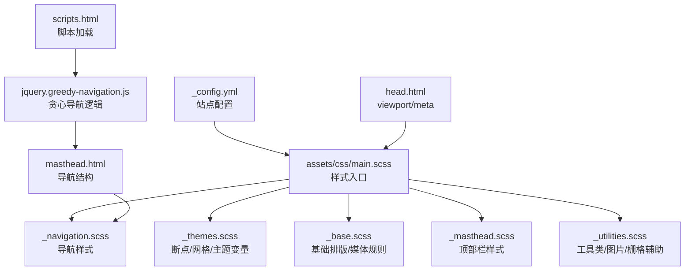
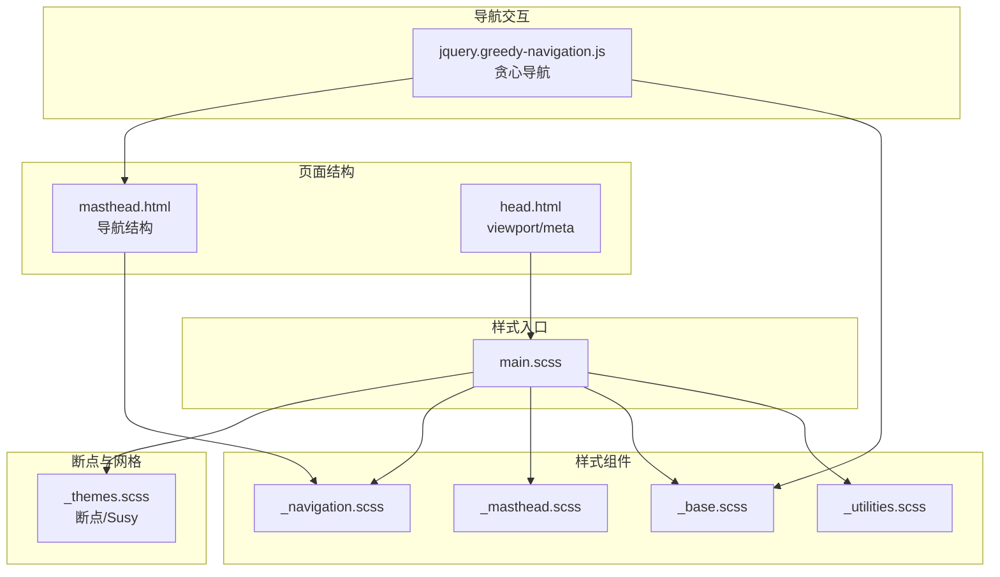
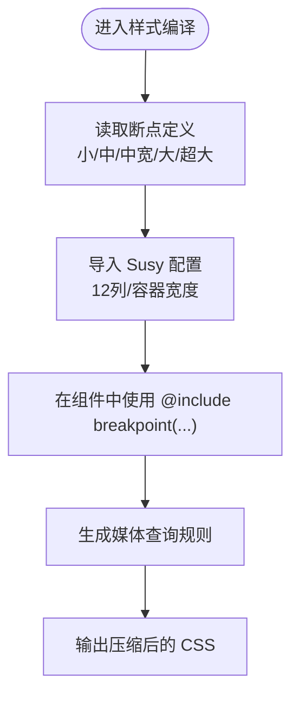
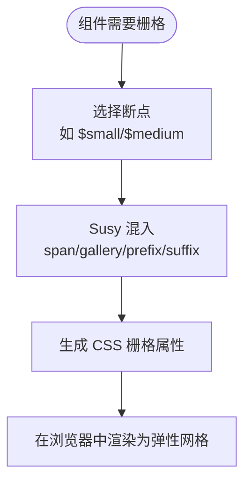
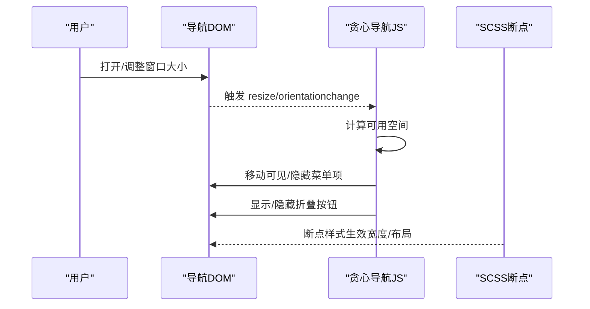
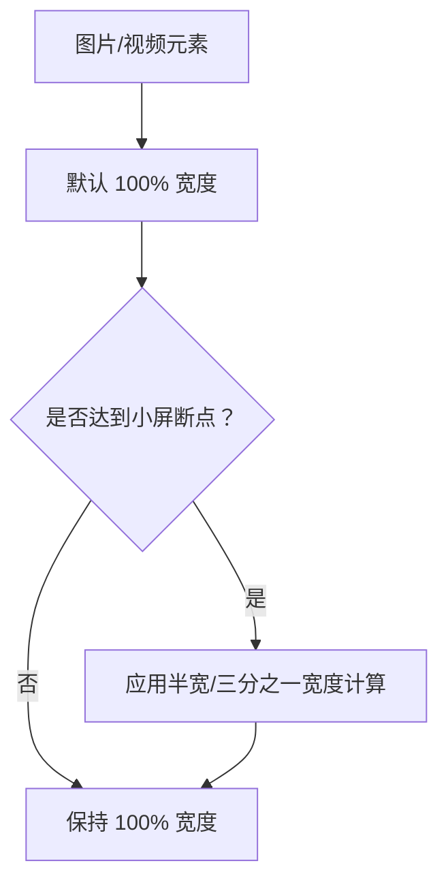
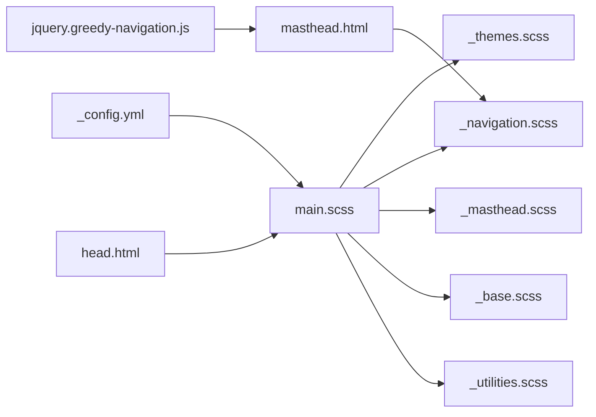

# 响应式设计实现

<cite>
**本文引用的文件**
- [_config.yml](file://_config.yml)
- [main.scss](file://assets/css/main.scss)
- [_themes.scss](file://_sass/_themes.scss)
- [_base.scss](file://_sass/layout/_base.scss)
- [_navigation.scss](file://_sass/layout/_navigation.scss)
- [_masthead.scss](file://_sass/layout/_masthead.scss)
- [_utilities.scss](file://_sass/include/_utilities.scss)
- [head.html](file://_includes/head.html)
- [masthead.html](file://_includes/masthead.html)
- [jquery.greedy-navigation.js](file://assets/js/plugins/jquery.greedy-navigation.js)
- [scripts.html](file://_includes/scripts.html)
</cite>

## 目录
1. [简介](#简介)
2. [项目结构](#项目结构)
3. [核心组件](#核心组件)
4. [架构总览](#架构总览)
5. [详细组件分析](#详细组件分析)
6. [依赖关系分析](#依赖关系分析)
7. [性能考虑](#性能考虑)
8. [故障排除指南](#故障排除指南)
9. [结论](#结论)

## 简介
本文件面向希望理解与扩展该 Jekyll 主题响应式能力的开发者与内容维护者，系统梳理断点系统、媒体查询、弹性布局与网格、导航菜单在不同屏幕尺寸的行为、媒体元素适配、响应式排版与间距、性能优化与跨浏览器兼容性等主题实现要点。文档以仓库现有 SCSS/Jekyll/JS 实现为依据，避免臆测，提供可追溯的“章节来源”与“图表来源”。

## 项目结构
该站点采用 Jekyll + SCSS（Susy + Breakpoint）+ 自定义 JS 的组合：
- 构建入口：主样式文件按顺序导入各模块，启用断点与网格工具。
- 断点与网格：通过断点库与 Susy 网格系统统一管理布局。
- 导航：使用“贪心导航”JS 动态调整可见/隐藏菜单项，配合 SCSS 断点。
- 媒体与排版：图片、视频容器、标题与段落等在不同断点下自适应。

图表来源
- [_config.yml](file://_config.yml)
- [main.scss](file://assets/css/main.scss)
- [_themes.scss](file://_sass/_themes.scss)
- [_base.scss](file://_sass/layout/_base.scss)
- [_navigation.scss](file://_sass/layout/_navigation.scss)
- [_masthead.scss](file://_sass/layout/_masthead.scss)
- [_utilities.scss](file://_sass/include/_utilities.scss)
- [head.html](file://_includes/head.html)
- [masthead.html](file://_includes/masthead.html)
- [jquery.greedy-navigation.js](file://assets/js/plugins/jquery.greedy-navigation.js)
- [scripts.html](file://_includes/scripts.html)

章节来源
- [main.scss:11-43](file://assets/css/main.scss#L11-L43)
- [_themes.scss:46-76](file://_sass/_themes.scss#L46-L76)
- [head.html:9](file://_includes/head.html#L9)

## 核心组件
- 断点系统与网格
  - 断点定义：小、中、中宽、大、超大，用于媒体查询与 Susy 栅格。
  - 网格：Susy 流式 12 列，容器宽度由断点控制。
- 导航与菜单
  - 贪心导航：JS 根据可用空间动态移动菜单项到“隐藏列表”，并在小屏显示折叠按钮。
  - SCSS 断点：在不同断点下调整面包屑、目录等导航元素的布局。
- 基础排版与媒体
  - 图片与视频：默认全宽自适应；在小屏断点下支持半宽/三分之一布局。
  - 表格、表单、页脚等基础元素在断点下进行缩放与换行。
- 工具类与辅助
  - 对齐、居中、粘性定位、图标、模态框等工具类在断点下生效。
- 视口与主题
  - viewport 设置确保移动端缩放正确。
  - 主题变量通过 CSS 变量注入，便于切换明暗主题。

章节来源
- [_themes.scss:52-56](file://_sass/_themes.scss#L52-L56)
- [_themes.scss:66-75](file://_sass/_themes.scss#L66-L75)
- [_navigation.scss:22-42](file://_sass/layout/_navigation.scss#L22-L42)
- [_base.scss:220-244](file://_sass/layout/_base.scss#L220-L244)
- [_utilities.scss:135-165](file://_sass/include/_utilities.scss#L135-L165)
- [head.html:9](file://_includes/head.html#L9)

## 架构总览
下图展示响应式样式从入口到具体组件的组织方式与交互路径。

图表来源
- [main.scss:11-43](file://assets/css/main.scss#L11-L43)
- [_themes.scss](file://_sass/_themes.scss)
- [head.html](file://_includes/head.html)
- [masthead.html](file://_includes/masthead.html)
- [_navigation.scss](file://_sass/layout/_navigation.scss)
- [_masthead.scss](file://_sass/layout/_masthead.scss)
- [_base.scss](file://_sass/layout/_base.scss)
- [_utilities.scss](file://_sass/include/_utilities.scss)
- [jquery.greedy-navigation.js](file://assets/js/plugins/jquery.greedy-navigation.js)

## 详细组件分析

### 断点系统与媒体查询
- 断点定义
  - 小：600px；中：768px；中宽：900px；大：925px；超大：1280px。
  - 使用断点库的命名空间，结合 Susy 的容器宽度与列数，形成一致的栅格体验。
- 媒体查询实践
  - 在导航、归档、特性卡片等组件中广泛使用断点包裹，实现“先移动端后桌面端”的渐进增强。
  - 图片与视频容器在小屏断点下采用百分比宽度与弹性布局，保证流式布局。

图表来源
- [_themes.scss:52-56](file://_sass/_themes.scss#L52-L56)
- [_themes.scss:66-75](file://_sass/_themes.scss#L66-L75)

章节来源
- [_themes.scss:52-56](file://_sass/_themes.scss#L52-L56)
- [_themes.scss:66-75](file://_sass/_themes.scss#L66-L75)
- [_navigation.scss:22-42](file://_sass/layout/_navigation.scss#L22-L42)
- [_base.scss:220-244](file://_sass/layout/_base.scss#L220-L244)

### 弹性布局与网格系统
- Susy 网格
  - 容器宽度随断点变化，列数固定 12，列宽与 gutter 比例可调。
  - 组件中通过 span/gallery/prefix/suffix 等混入实现灵活布局。
- 弹性布局
  - 图片与视频容器使用 Flexbox 包裹，配合断点下的宽度计算，实现流式排列。
  - 归档与特性卡片在小屏断点下使用 gallery/span 实现多列自适应。

图表来源
- [_themes.scss:66-75](file://_sass/_themes.scss#L66-L75)
- [_base.scss:220-244](file://_sass/layout/_base.scss#L220-L244)
- [_utilities.scss:169-173](file://_sass/include/_utilities.scss#L169-L173)

章节来源
- [_themes.scss:66-75](file://_sass/_themes.scss#L66-L75)
- [_base.scss:220-244](file://_sass/layout/_base.scss#L220-L244)
- [_utilities.scss:169-173](file://_sass/include/_utilities.scss#L169-L173)

### 导航菜单在不同屏幕尺寸下的行为
- 结构与交互
  - 导航采用“贪心导航”：JS 计算可见区域宽度，将溢出项移至隐藏列表，并显示折叠按钮。
  - 用户点击按钮时切换隐藏列表显隐，同时更新按钮状态类名。
- 样式适配
  - 在不同断点下调整面包屑、目录等导航元素的宽度与布局。
  - 顶部栏在超大断点下限制最大宽度，保持内容居中。

图表来源
- [masthead.html:5-44](file://_includes/masthead.html#L5-L44)
- [jquery.greedy-navigation.js:16-70](file://assets/js/plugins/jquery.greedy-navigation.js#L16-L70)
- [_navigation.scss:22-42](file://_sass/layout/_navigation.scss#L22-L42)
- [_masthead.scss:33-35](file://_sass/layout/_masthead.scss#L33-L35)

章节来源
- [masthead.html:5-44](file://_includes/masthead.html#L5-L44)
- [jquery.greedy-navigation.js:16-70](file://assets/js/plugins/jquery.greedy-navigation.js#L16-L70)
- [_navigation.scss:22-42](file://_sass/layout/_navigation.scss#L22-L42)
- [_masthead.scss:33-35](file://_sass/layout/_masthead.scss#L33-L35)

### 媒体元素的响应式处理
- 图片与视频
  - 默认图片宽度 100%，圆角与过渡动画提升交互体验。
  - 在小屏断点下，半宽/三分之一布局通过 calc 百分比实现。
- 视频容器
  - 通过类名包裹视频，使其在断点下自适应父容器宽度。

图表来源
- [_base.scss:209-244](file://_sass/layout/_base.scss#L209-L244)
- [_base.scss:220-244](file://_sass/layout/_base.scss#L220-L244)

章节来源
- [_base.scss:209-244](file://_sass/layout/_base.scss#L209-L244)
- [_base.scss:220-244](file://_sass/layout/_base.scss#L220-L244)

### 响应式字体与间距
- 字体比例
  - 使用类型刻度变量，从 1.25em 到 0.625em，形成层级清晰的排版体系。
- 间距与留白
  - 全局过渡时间、边框半径、阴影等变量统一风格。
  - 顶部栏在不同断点下设置最大宽度，确保内容不被无限拉伸。

章节来源
- [_themes.scss:32-44](file://_sass/_themes.scss#L32-L44)
- [_themes.scss:20-27](file://_sass/_themes.scss#L20-L27)
- [_masthead.scss:33-35](file://_sass/layout/_masthead.scss#L33-L35)

### 移动端优先的设计理念与实现
- 视口设置
  - 通过 viewport meta 确保移动端初始缩放与宽度正确。
- 渐进增强
  - 先保证小屏可读与可用，再在中/大屏断点下增加复杂布局与交互。
- 交互降级
  - 贪心导航在小屏下将次要链接收纳至下拉，避免导航拥挤。

章节来源
- [head.html:9](file://_includes/head.html#L9)
- [jquery.greedy-navigation.js:16-70](file://assets/js/plugins/jquery.greedy-navigation.js#L16-L70)

## 依赖关系分析
- 样式入口依赖断点与网格配置，组件样式依赖断点混入与 Susy 混入。
- 导航交互依赖 DOM 结构与视口变化事件，样式依赖断点控制布局。
- 主题变量通过 CSS 变量注入，影响所有组件的颜色与尺寸。

图表来源
- [_config.yml](file://_config.yml)
- [main.scss](file://assets/css/main.scss)
- [_themes.scss](file://_sass/_themes.scss)
- [_navigation.scss](file://_sass/layout/_navigation.scss)
- [_masthead.scss](file://_sass/layout/_masthead.scss)
- [_base.scss](file://_sass/layout/_base.scss)
- [_utilities.scss](file://_sass/include/_utilities.scss)
- [head.html](file://_includes/head.html)
- [masthead.html](file://_includes/masthead.html)
- [jquery.greedy-navigation.js](file://assets/js/plugins/jquery.greedy-navigation.js)

章节来源
- [main.scss:11-43](file://assets/css/main.scss#L11-L43)
- [_themes.scss:46-76](file://_sass/_themes.scss#L46-L76)
- [_navigation.scss:22-42](file://_sass/layout/_navigation.scss#L22-L42)
- [_masthead.scss:33-35](file://_sass/layout/_masthead.scss#L33-L35)
- [_base.scss:220-244](file://_sass/layout/_base.scss#L220-L244)
- [_utilities.scss:135-165](file://_sass/include/_utilities.scss#L135-L165)
- [head.html:9](file://_includes/head.html#L9)
- [masthead.html:5-44](file://_includes/masthead.html#L5-L44)
- [jquery.greedy-navigation.js:16-70](file://assets/js/plugins/jquery.greedy-navigation.js#L16-L70)

## 性能考虑
- 构建与压缩
  - SCSS 输出模式为压缩，减少体积。
  - HTML 压缩插件在生产环境启用，减少传输体积。
- 资源加载
  - 主样式在 head 中引入，避免 FOUC。
  - 脚本以模块方式延迟加载，避免阻塞渲染。
- 交互性能
  - 贪心导航仅在窗口尺寸变化或方向改变时触发重排，避免频繁计算。
  - 过渡动画时间短，保证流畅性。

章节来源
- [_config.yml](file://_config.yml)
- [head.html:16](file://_includes/head.html#L16)
- [scripts.html:1](file://_includes/scripts.html#L1)
- [jquery.greedy-navigation.js:74-79](file://assets/js/plugins/jquery.greedy-navigation.js#L74-L79)

## 故障排除指南
- 导航按钮不显示或无法展开
  - 检查贪心导航 JS 是否正确加载与执行。
  - 确认按钮与可见/隐藏列表的类名匹配。
- 图片/视频在小屏断点下未按预期缩放
  - 确认断点混入是否正确包裹相关样式。
  - 检查父容器宽度是否受断点影响。
- 顶部栏遮挡内容
  - 确认主体内容的上边距是否随顶部栏高度动态调整。
- 视口异常导致移动端显示错位
  - 确认 viewport meta 是否存在且值正确。

章节来源
- [jquery.greedy-navigation.js:16-70](file://assets/js/plugins/jquery.greedy-navigation.js#L16-L70)
- [_base.scss:209-244](file://_sass/layout/_base.scss#L209-L244)
- [_masthead.scss:62-68](file://_sass/layout/_masthead.scss#L62-L68)
- [head.html:9](file://_includes/head.html#L9)

## 结论
该主题以“断点 + 网格 + 渐进增强”的方式实现了完整的响应式体系：断点与网格在主题层统一定义，组件样式通过断点混入与 Susy 混入实现灵活布局；导航采用贪心策略在小屏下自动收敛；媒体元素与排版在多断点下自适应。配合压缩构建与模块化脚本加载，整体具备良好的性能与可维护性。建议在新增组件时遵循“移动端优先、断点包裹、语义结构”的原则，确保一致性与可扩展性。