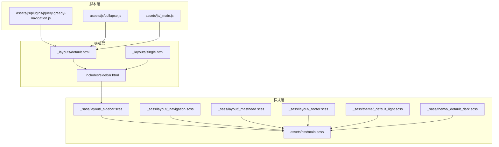
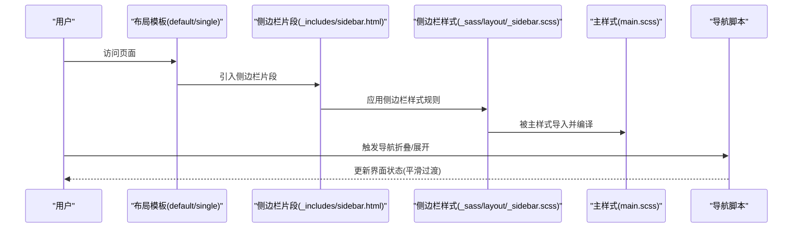
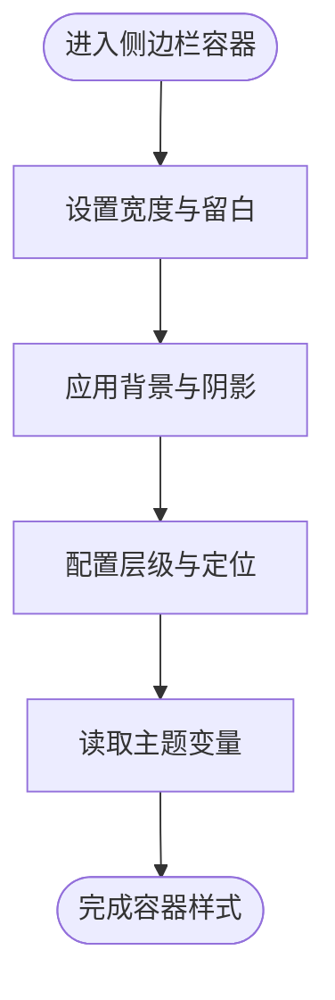
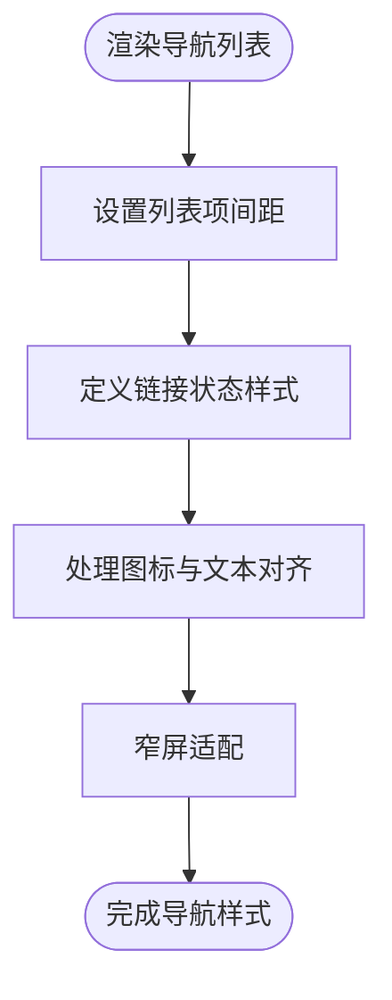
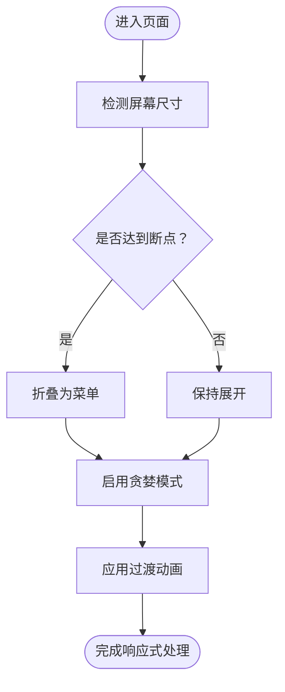
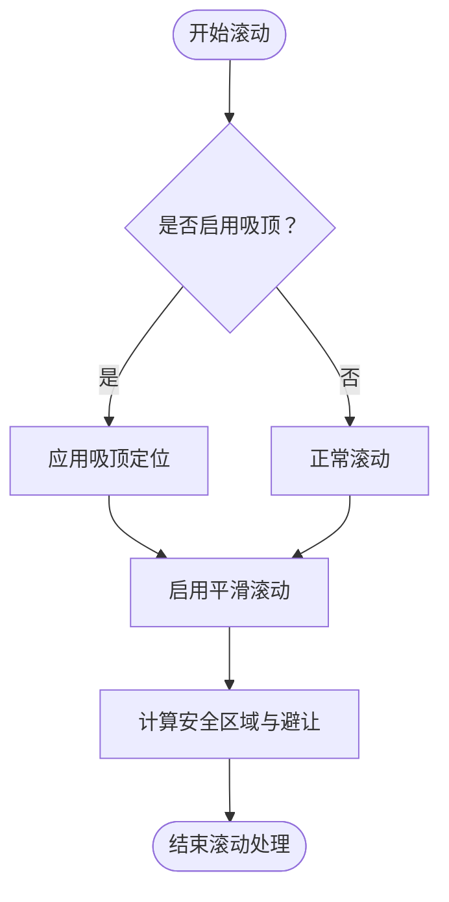
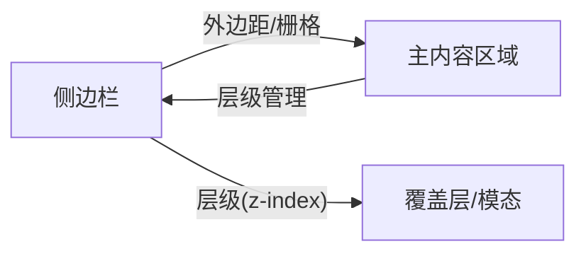
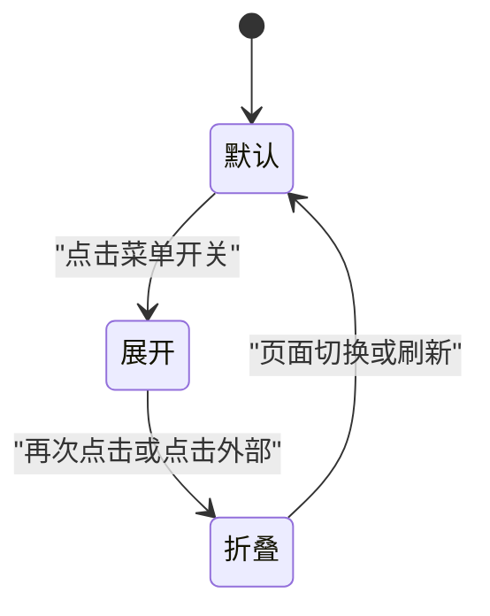
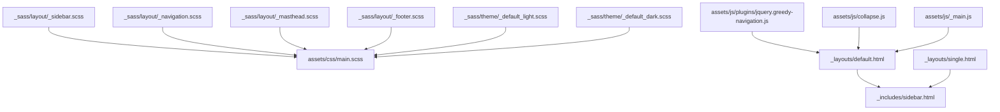

# 侧边栏组件样式

<cite>
**本文引用的文件**
- [_sass/layout/_sidebar.scss](file://_sass/layout/_sidebar.scss)
- [_includes/sidebar.html](file://_includes/sidebar.html)
- [assets/css/main.scss](file://assets/css/main.scss)
- [assets/js/plugins/jquery.greedy-navigation.js](file://assets/js/plugins/jquery.greedy-navigation.js)
- [assets/js/collapse.js](file://assets/js/collapse.js)
- [assets/js/_main.js](file://assets/js/_main.js)
- [_layouts/default.html](file://_layouts/default.html)
- [_layouts/single.html](file://_layouts/single.html)
- [_sass/layout/_navigation.scss](file://_sass/layout/_navigation.scss)
- [_sass/layout/_masthead.scss](file://_sass/layout/_masthead.scss)
- [_sass/layout/_footer.scss](file://_sass/layout/_footer.scss)
- [_sass/theme/_default_light.scss](file://_sass/theme/_default_light.scss)
- [_sass/theme/_default_dark.scss](file://_sass/theme/_default_dark.scss)
</cite>

## 目录
1. [简介](#简介)
2. [项目结构](#项目结构)
3. [核心组件](#核心组件)
4. [架构总览](#架构总览)
5. [详细组件分析](#详细组件分析)
6. [依赖分析](#依赖分析)
7. [性能考虑](#性能考虑)
8. [故障排除指南](#故障排除指南)
9. [结论](#结论)
10. [附录](#附录)

## 简介
本文件聚焦于 Jekyll 主题中的侧边栏组件样式，系统性解析 _sidebar.scss 的布局结构、内容区域样式、交互元素视觉设计、响应式行为、滚动与固定定位等交互样式，并说明侧边栏与主内容区域的空间关系与视觉层次。同时提供定制方法与性能优化建议，帮助开发者在不破坏整体设计的前提下进行扩展与调优。

## 项目结构
该站点采用 Jekyll 结构，侧边栏样式主要位于 SCSS 布局层，模板通过 includes 注入到页面布局中；JavaScript 插件负责导航的“贪婪模式”与折叠行为；主题色板通过主题 SCSS 文件统一管理。

**图表来源**
- [_sass/layout/_sidebar.scss](file://_sass/layout/_sidebar.scss)
- [_sass/layout/_navigation.scss](file://_sass/layout/_navigation.scss)
- [_sass/layout/_masthead.scss](file://_sass/layout/_masthead.scss)
- [_sass/layout/_footer.scss](file://_sass/layout/_footer.scss)
- [_sass/theme/_default_light.scss](file://_sass/theme/_default_light.scss)
- [_sass/theme/_default_dark.scss](file://_sass/theme/_default_dark.scss)
- [assets/css/main.scss](file://assets/css/main.scss)
- [_layouts/default.html](file://_layouts/default.html)
- [_layouts/single.html](file://_layouts/single.html)
- [_includes/sidebar.html](file://_includes/sidebar.html)
- [assets/js/plugins/jquery.greedy-navigation.js](file://assets/js/plugins/jquery.greedy-navigation.js)
- [assets/js/collapse.js](file://assets/js/collapse.js)
- [assets/js/_main.js](file://assets/js/_main.js)

**章节来源**
- [_sass/layout/_sidebar.scss](file://_sass/layout/_sidebar.scss)
- [_sass/layout/_navigation.scss](file://_sass/layout/_navigation.scss)
- [_sass/layout/_masthead.scss](file://_sass/layout/_masthead.scss)
- [_sass/layout/_footer.scss](file://_sass/layout/_footer.scss)
- [_sass/theme/_default_light.scss](file://_sass/theme/_default_light.scss)
- [_sass/theme/_default_dark.scss](file://_sass/theme/_default_dark.scss)
- [assets/css/main.scss](file://assets/css/main.scss)
- [_layouts/default.html](file://_layouts/default.html)
- [_layouts/single.html](file://_layouts/single.html)
- [_includes/sidebar.html](file://_includes/sidebar.html)
- [assets/js/plugins/jquery.greedy-navigation.js](file://assets/js/plugins/jquery.greedy-navigation.js)
- [assets/js/collapse.js](file://assets/js/collapse.js)
- [assets/js/_main.js](file://assets/js/_main.js)

## 核心组件
- 侧边栏容器与基础布局：定义宽度、内边距、背景、阴影、z-index 等基础属性，确保在不同主题下具备一致的视觉基线。
- 导航列表与链接样式：统一列表项的间距、悬停与焦点状态、图标与文本对齐，保证可读性与一致性。
- 响应式断点与显示/隐藏策略：在小屏设备上采用折叠或滑出策略，在大屏设备上保持展开状态。
- 滚动行为与固定定位：在长页面中提供平滑滚动与吸顶效果，避免遮挡主内容。
- 与主内容区域的空间关系：通过外边距与定位策略，确保侧边栏不影响主内容的阅读流。
- 交互元素的视觉设计：按钮、菜单开关、折叠/展开指示器等，使用过渡动画提升交互体验。
- 主题适配：通过主题 SCSS 文件注入颜色与变量，使侧边栏在浅色/深色主题下自动适配。

**章节来源**
- [_sass/layout/_sidebar.scss](file://_sass/layout/_sidebar.scss)
- [_sass/layout/_navigation.scss](file://_sass/layout/_navigation.scss)
- [_sass/theme/_default_light.scss](file://_sass/theme/_default_light.scss)
- [_sass/theme/_default_dark.scss](file://_sass/theme/_default_dark.scss)

## 架构总览
侧边栏样式由 SCSS 布局模块组织，通过主入口样式文件合并输出；模板通过 includes 将侧边栏片段注入到默认与单页布局中；JavaScript 插件负责导航的“贪婪模式”与折叠行为，确保在有限空间内展示尽可能多的导航项。

**图表来源**
- [_layouts/default.html](file://_layouts/default.html)
- [_layouts/single.html](file://_layouts/single.html)
- [_includes/sidebar.html](file://_includes/sidebar.html)
- [_sass/layout/_sidebar.scss](file://_sass/layout/_sidebar.scss)
- [assets/css/main.scss](file://assets/css/main.scss)
- [assets/js/plugins/jquery.greedy-navigation.js](file://assets/js/plugins/jquery.greedy-navigation.js)

## 详细组件分析

### 1) 侧边栏容器与基础布局
- 容器尺寸与留白：设置合理的宽度、内边距与外边距，确保在不同屏幕尺寸下具备舒适的阅读与浏览体验。
- 背景与阴影：为侧边栏添加背景色与阴影，增强与主内容区域的视觉分隔。
- 层级与定位：通过 z-index 与定位策略，确保侧边栏在滚动时不会遮挡关键内容。
- 主题变量：使用主题 SCSS 提供的颜色变量，实现浅色/深色主题的无缝切换。

**图表来源**
- [_sass/layout/_sidebar.scss](file://_sass/layout/_sidebar.scss)
- [_sass/theme/_default_light.scss](file://_sass/theme/_default_light.scss)
- [_sass/theme/_default_dark.scss](file://_sass/theme/_default_dark.scss)

**章节来源**
- [_sass/layout/_sidebar.scss](file://_sass/layout/_sidebar.scss)
- [_sass/theme/_default_light.scss](file://_sass/theme/_default_light.scss)
- [_sass/theme/_default_dark.scss](file://_sass/theme/_default_dark.scss)

### 2) 导航列表与链接样式
- 列表项间距：统一列表项之间的垂直间距，避免拥挤感。
- 链接状态：定义默认、悬停、焦点与激活状态的样式差异，提升可点击性与反馈感。
- 图标与文本：当存在图标时，确保图标与文字对齐与间距一致。
- 响应式调整：在窄屏设备上适当缩小字体与间距，保证可读性。

**图表来源**
- [_sass/layout/_sidebar.scss](file://_sass/layout/_sidebar.scss)
- [_sass/layout/_navigation.scss](file://_sass/layout/_navigation.scss)

**章节来源**
- [_sass/layout/_sidebar.scss](file://_sass/layout/_sidebar.scss)
- [_sass/layout/_navigation.scss](file://_sass/layout/_navigation.scss)

### 3) 响应式行为与显示/隐藏策略
- 断点策略：在不同断点下决定侧边栏是展开、折叠还是滑出，以适配移动设备与桌面设备。
- 折叠/展开控制：通过 JavaScript 插件实现“贪婪模式”，优先展示可见区域内的导航项，超出部分折叠为菜单。
- 动画过渡：在切换状态时使用平滑过渡，避免突兀跳变影响用户体验。
- 可访问性：确保键盘可操作与屏幕阅读器友好。

**图表来源**
- [assets/js/plugins/jquery.greedy-navigation.js](file://assets/js/plugins/jquery.greedy-navigation.js)
- [_sass/layout/_sidebar.scss](file://_sass/layout/_sidebar.scss)

**章节来源**
- [assets/js/plugins/jquery.greedy-navigation.js](file://assets/js/plugins/jquery.greedy-navigation.js)
- [_sass/layout/_sidebar.scss](file://_sass/layout/_sidebar.scss)

### 4) 滚动效果与固定定位
- 吸顶行为：在长页面中，侧边栏可设置为吸顶，跟随滚动但不遮挡主内容。
- 平滑滚动：为锚点链接与滚动容器提供平滑滚动体验。
- 内容避让：通过外边距与定位策略，确保滚动时主内容区域不受遮挡。
- 性能优化：避免频繁重排与重绘，使用 transform 与 will-change 等现代 CSS 技术。

**图表来源**
- [_sass/layout/_sidebar.scss](file://_sass/layout/_sidebar.scss)
- [assets/js/collapse.js](file://assets/js/collapse.js)

**章节来源**
- [_sass/layout/_sidebar.scss](file://_sass/layout/_sidebar.scss)
- [assets/js/collapse.js](file://assets/js/collapse.js)

### 5) 与主内容区域的空间关系与视觉层次
- 外边距与栅格：通过外边距与栅格系统，确保侧边栏与主内容区域之间有清晰的视觉分隔。
- 层级管理：利用 z-index 与定位，避免侧边栏覆盖主内容或被其他元素遮挡。
- 主题一致性：通过主题 SCSS 统一颜色与对比度，保证在不同主题下具备良好的可读性。

**图表来源**
- [_sass/layout/_sidebar.scss](file://_sass/layout/_sidebar.scss)
- [_sass/layout/_footer.scss](file://_sass/layout/_footer.scss)
- [_sass/theme/_default_light.scss](file://_sass/theme/_default_light.scss)
- [_sass/theme/_default_dark.scss](file://_sass/theme/_default_dark.scss)

**章节来源**
- [_sass/layout/_sidebar.scss](file://_sass/layout/_sidebar.scss)
- [_sass/layout/_footer.scss](file://_sass/layout/_footer.scss)
- [_sass/theme/_default_light.scss](file://_sass/theme/_default_light.scss)
- [_sass/theme/_default_dark.scss](file://_sass/theme/_default_dark.scss)

### 6) 交互元素的视觉设计
- 按钮与菜单开关：统一按钮样式与过渡动画，确保在不同状态下的视觉一致性。
- 折叠/展开指示器：使用图标与文本提示当前状态，支持键盘与鼠标操作。
- 焦点管理：为可交互元素提供清晰的焦点样式，提升可访问性。
- 动画与过渡：在状态切换时使用合适的缓动函数与持续时间，避免过度干扰。

**图表来源**
- [_sass/layout/_sidebar.scss](file://_sass/layout/_sidebar.scss)
- [assets/js/plugins/jquery.greedy-navigation.js](file://assets/js/plugins/jquery.greedy-navigation.js)
- [assets/js/collapse.js](file://assets/js/collapse.js)

**章节来源**
- [_sass/layout/_sidebar.scss](file://_sass/layout/_sidebar.scss)
- [assets/js/plugins/jquery.greedy-navigation.js](file://assets/js/plugins/jquery.greedy-navigation.js)
- [assets/js/collapse.js](file://assets/js/collapse.js)

## 依赖分析
侧边栏样式与导航、头部、页脚以及主题 SCSS 存在直接依赖关系；模板通过 includes 注入侧边栏片段；JavaScript 插件负责导航的“贪婪模式”与折叠行为。

**图表来源**
- [_sass/layout/_sidebar.scss](file://_sass/layout/_sidebar.scss)
- [_sass/layout/_navigation.scss](file://_sass/layout/_navigation.scss)
- [_sass/layout/_masthead.scss](file://_sass/layout/_masthead.scss)
- [_sass/layout/_footer.scss](file://_sass/layout/_footer.scss)
- [_sass/theme/_default_light.scss](file://_sass/theme/_default_light.scss)
- [_sass/theme/_default_dark.scss](file://_sass/theme/_default_dark.scss)
- [assets/css/main.scss](file://assets/css/main.scss)
- [_layouts/default.html](file://_layouts/default.html)
- [_layouts/single.html](file://_layouts/single.html)
- [_includes/sidebar.html](file://_includes/sidebar.html)
- [assets/js/plugins/jquery.greedy-navigation.js](file://assets/js/plugins/jquery.greedy-navigation.js)
- [assets/js/collapse.js](file://assets/js/collapse.js)
- [assets/js/_main.js](file://assets/js/_main.js)

**章节来源**
- [_sass/layout/_sidebar.scss](file://_sass/layout/_sidebar.scss)
- [_sass/layout/_navigation.scss](file://_sass/layout/_navigation.scss)
- [_sass/layout/_masthead.scss](file://_sass/layout/_masthead.scss)
- [_sass/layout/_footer.scss](file://_sass/layout/_footer.scss)
- [_sass/theme/_default_light.scss](file://_sass/theme/_default_light.scss)
- [_sass/theme/_default_dark.scss](file://_sass/theme/_default_dark.scss)
- [assets/css/main.scss](file://assets/css/main.scss)
- [_layouts/default.html](file://_layouts/default.html)
- [_layouts/single.html](file://_layouts/single.html)
- [_includes/sidebar.html](file://_includes/sidebar.html)
- [assets/js/plugins/jquery.greedy-navigation.js](file://assets/js/plugins/jquery.greedy-navigation.js)
- [assets/js/collapse.js](file://assets/js/collapse.js)
- [assets/js/_main.js](file://assets/js/_main.js)

## 性能考虑
- 减少重排与重绘：优先使用 transform 与 opacity 进行动画，避免频繁修改布局属性。
- 合理使用 z-index：避免过高的层级导致不必要的合成层，影响渲染性能。
- 响应式断点优化：在移动端尽量减少复杂阴影与渐变，降低 GPU 开销。
- 资源加载顺序：确保主样式在首屏关键路径内加载，避免阻塞渲染。
- JavaScript 最小化：导航与折叠逻辑尽量轻量，避免在滚动事件中执行昂贵操作。

## 故障排除指南
- 侧边栏遮挡内容：检查定位与 z-index 设置，确认主内容区域的外边距足够。
- 折叠菜单无法展开：验证导航脚本是否正确初始化，检查事件绑定与 DOM 结构。
- 主题颜色不一致：确认主题 SCSS 变量是否正确导入，检查颜色覆盖链路。
- 移动端显示异常：核对断点与媒体查询，确保在目标设备上的表现符合预期。
- 滚动卡顿：检查动画属性与合成层使用，必要时禁用复杂阴影或渐变。

**章节来源**
- [_sass/layout/_sidebar.scss](file://_sass/layout/_sidebar.scss)
- [assets/js/plugins/jquery.greedy-navigation.js](file://assets/js/plugins/jquery.greedy-navigation.js)
- [assets/js/collapse.js](file://assets/js/collapse.js)
- [_sass/theme/_default_light.scss](file://_sass/theme/_default_light.scss)
- [_sass/theme/_default_dark.scss](file://_sass/theme/_default_dark.scss)

## 结论
侧边栏组件样式通过 SCSS 布局模块与主题系统实现跨主题的一致性与可定制性；结合 JavaScript 插件，实现了在不同设备上的响应式导航体验。遵循本文的定制方法与性能优化建议，可在不破坏整体设计的前提下，灵活扩展侧边栏的功能与外观。

## 附录
- 定制步骤建议
  - 修改容器尺寸与留白：在侧边栏样式中调整宽度与内边距。
  - 调整主题颜色：通过主题 SCSS 文件修改颜色变量。
  - 自定义导航样式：在导航样式中调整链接状态与图标对齐。
  - 优化响应式断点：根据目标设备调整断点与折叠策略。
  - 改进滚动行为：在侧边栏样式中启用吸顶与平滑滚动。
- 性能优化清单
  - 使用 transform 与 opacity 进行动画。
  - 控制 z-index 层级，避免过度合成。
  - 在移动端简化阴影与渐变。
  - 优化资源加载顺序，确保关键路径样式优先。
  - 轻量化 JavaScript，避免滚动事件中的重操作。