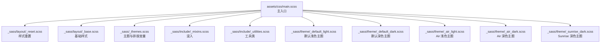
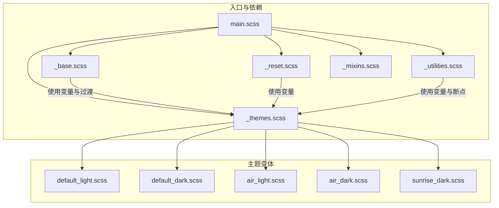
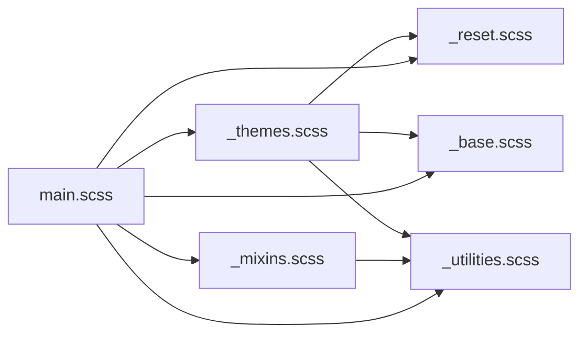

# 基础样式系统

<cite>
**本文档引用的文件**
- [_base.scss](file://_sass/layout/_base.scss)
- [_reset.scss](file://_sass/layout/_reset.scss)
- [_themes.scss](file://_sass/_themes.scss)
- [main.scss](file://assets/css/main.scss)
- [_mixins.scss](file://_sass/include/_mixins.scss)
- [_utilities.scss](file://_sass/include/_utilities.scss)
- [_default_light.scss](file://_sass/theme/_default_light.scss)
- [_default_dark.scss](file://_sass/theme/_default_dark.scss)
- [_air_light.scss](file://_sass/theme/_air_light.scss)
- [_air_dark.scss](file://_sass/theme/_air_dark.scss)
- [_sunrise_dark.scss](file://_sass/theme/_sunrise_dark.scss)
- [_config.yml](file://_config.yml)
</cite>

## 目录
1. [简介](#简介)
2. [项目结构](#项目结构)
3. [核心组件](#核心组件)
4. [架构总览](#架构总览)
5. [详细组件分析](#详细组件分析)
6. [依赖关系分析](#依赖关系分析)
7. [性能考量](#性能考量)
8. [故障排除指南](#故障排除指南)
9. [结论](#结论)
10. [附录](#附录)

## 简介
本文件系统性解析该 Jekyll 主题的基础样式系统，重点围绕 `_sass/layout/_base.scss` 的核心样式定义与实现原理，覆盖以下方面：
- HTML 元素的基础样式重置与初始化：html、body、标题元素（h1–h6）、段落（p）、列表（ul、ol）等
- 字体系统、颜色变量、间距系统的设计理念与使用方式
- 特殊元素样式：代码块、引用块、缩略词等
- 动画过渡效果的全局配置与实现机制
- 样式定制方法与最佳实践

## 项目结构
基础样式系统由 SCSS 模块化组织，通过主入口文件统一导入，形成可扩展的主题体系。关键目录与文件如下：
- 主入口：`assets/css/main.scss`
- 基础样式：`_sass/layout/_base.scss`
- 样式重置：`_sass/layout/_reset.scss`
- 主题变量与排版：`_sass/_themes.scss`
- 工具与混入：`_sass/include/_mixins.scss`、`_sass/include/_utilities.scss`
- 主题变体：`_sass/theme/_default_light.scss`、`_sass/theme/_default_dark.scss`、`_sass/theme/_air_light.scss`、`_sass/theme/_air_dark.scss`、`_sass/theme/_sunrise_dark.scss`

图表来源
- [main.scss:11-43](file://assets/css/main.scss#L11-L43)
- [_reset.scss:1-179](file://_sass/layout/_reset.scss#L1-L179)
- [_base.scss:1-365](file://_sass/layout/_base.scss#L1-L365)
- [_themes.scss:1-104](file://_sass/_themes.scss#L1-L104)
- [_mixins.scss:1-53](file://_sass/include/_mixins.scss#L1-L53)
- [_utilities.scss:1-501](file://_sass/include/_utilities.scss#L1-L501)
- [_default_light.scss:1-49](file://_sass/theme/_default_light.scss#L1-L49)
- [_default_dark.scss:1-57](file://_sass/theme/_default_dark.scss#L1-L57)
- [_air_light.scss:1-56](file://_sass/theme/_air_light.scss#L1-L56)
- [_air_dark.scss:1-56](file://_sass/theme/_air_dark.scss#L1-L56)
- [_sunrise_dark.scss:1-59](file://_sass/theme/_sunrise_dark.scss#L1-L59)

章节来源
- [main.scss:11-43](file://assets/css/main.scss#L11-L43)

## 核心组件
- 样式重置模块：统一盒模型、移除默认边距、处理 HTML5 元素显示、链接焦点态、图片响应式、表单控件一致性等
- 基础样式模块：为 html/body、标题、段落、列表、链接、代码、引用、水平线、媒体与导航列表等提供基础样式，并定义全局动画过渡
- 主题与排版模块：定义字体族、字号比例、断点、网格、品牌色与 CSS 变量映射
- 工具与混入：提供通用混入（如清除浮动）与实用类（可见性、对齐、图标、导航图标、模态框等）
- 主题变体：多套主题（默认、Air、Sunrise）分别提供浅色与深色版本，映射到 CSS 变量

章节来源
- [_reset.scss:1-179](file://_sass/layout/_reset.scss#L1-L179)
- [_base.scss:1-365](file://_sass/layout/_base.scss#L1-L365)
- [_themes.scss:1-104](file://_sass/_themes.scss#L1-L104)
- [_mixins.scss:1-53](file://_sass/include/_mixins.scss#L1-L53)
- [_utilities.scss:1-501](file://_sass/include/_utilities.scss#L1-L501)
- [_default_light.scss:1-49](file://_sass/theme/_default_light.scss#L1-L49)
- [_default_dark.scss:1-57](file://_sass/theme/_default_dark.scss#L1-L57)
- [_air_light.scss:1-56](file://_sass/theme/_air_light.scss#L1-L56)
- [_air_dark.scss:1-56](file://_sass/theme/_air_dark.scss#L1-L56)
- [_sunrise_dark.scss:1-59](file://_sass/theme/_sunrise_dark.scss#L1-L59)

## 架构总览
基础样式系统采用“重置 + 基础样式 + 主题变量 + 工具类”的分层设计，主入口按依赖顺序导入，确保变量与混入在使用前已定义，主题变量在最终阶段生效，从而实现一致且可定制的视觉与交互体验。

图表来源
- [main.scss:11-43](file://assets/css/main.scss#L11-L43)
- [_reset.scss:1-179](file://_sass/layout/_reset.scss#L1-L179)
- [_themes.scss:1-104](file://_sass/_themes.scss#L1-L104)
- [_base.scss:1-365](file://_sass/layout/_base.scss#L1-L365)
- [_utilities.scss:1-501](file://_sass/include/_utilities.scss#L1-L501)
- [_mixins.scss:1-53](file://_sass/include/_mixins.scss#L1-L53)
- [_default_light.scss:1-49](file://_sass/theme/_default_light.scss#L1-L49)
- [_default_dark.scss:1-57](file://_sass/theme/_default_dark.scss#L1-L57)
- [_air_light.scss:1-56](file://_sass/theme/_air_light.scss#L1-L56)
- [_air_dark.scss:1-56](file://_sass/theme/_air_dark.scss#L1-L56)
- [_sunrise_dark.scss:1-59](file://_sass/theme/_sunrise_dark.scss#L1-L59)

## 详细组件分析

### 样式重置模块（_reset.scss）
- 盒模型与根元素：统一使用 border-box，设置 html 字体大小并配合断点调整；应用全局背景色与文本缩放
- 链接与焦点：链接颜色绑定到主题变量，聚焦态复用混入；悬停与激活时移除 outline
- 行内元素与基线：sub/sup 正确定位与行高，避免影响行高
- 图片与地图：响应式图片策略，针对特定容器禁用最大宽度限制
- 表单控件：统一字体大小、垂直对齐、光标样式与外观修正
- HTML5 元素：确保在旧版浏览器中正确显示

章节来源
- [_reset.scss:1-179](file://_sass/layout/_reset.scss#L1-L179)

### 基础样式模块（_base.scss）
- html：相对定位与最小高度，用于支撑粘性页脚布局
- body：绑定主题变量的颜色与背景，设置外边距与内边距（含页眉高度），使用全局字体与行高；支持滚动锁定类
- 标题（h1–h6）：统一上边距与行高，使用头部字体族与粗体字重；h1 顶部无外边距，各层级有独立字号比例
- 小号文本：small/.small 使用更小字号
- 段落：底部外边距统一
- 文本修饰：下划线/插入/删除文本的样式与链接继承
- 打印优化：减少断字与孤儿行数
- 缩略词：带提示的点状下划线
- 引用块：左侧装饰线、斜体、左右内边距与作者引用格式
- 链接：聚焦态复用混入，悬停/激活时移除 outline
- 代码：等宽字体族，预格式化代码块溢出自动滚动；行内代码块具备颜色、背景、边框、圆角与阴影
- 水平线：显示为带分隔线的块级元素
- 列表：子列表内外边距控制
- 媒体与嵌入：图集布局、图片圆角与过渡、半宽/三分之一布局断点
- 导航列表：去除内外边距与项目符号，链接去下划线，嵌套列表间距归零
- 动画：定义入场动画与全局过渡，覆盖大量元素以实现一致的交互反馈
- 打印：隐藏页眉、目录、分享、相关文章、广告与页脚

章节来源
- [_base.scss:1-365](file://_sass/layout/_base.scss#L1-L365)

### 字体系统与排版（_themes.scss）
- 字号基准：文档字号基准用于计算 em 单位
- 字体族：衬线、无衬线与等宽字体族定义，标题与正文、说明文字分别指定字体族
- 字号比例：建立从 1 到 8 的类型比例，标题层级与正文字号一一对应
- 断点：定义小、中、宽屏、大屏、超大屏断点，便于响应式布局
- 网格：Susy 网格配置，列数、列宽、边距比与容器宽度
- 品牌色：社交平台颜色变量集合

章节来源
- [_themes.scss:1-104](file://_sass/_themes.scss#L1-L104)

### 主题变量与 CSS 变量（主题文件）
- 默认主题（浅/深）：定义主色、灰阶、危险/信息/注意/成功/警告色，圆角、阴影、过渡时间、页眉高度、导航图标尺寸等；映射到 :root 或 data-theme="dark" 的 CSS 变量
- Air 主题（浅/深）：与默认主题类似的变量映射，但配色方案不同
- Sunrise 主题（深）：深色主题变量映射，强调对比度与可读性

章节来源
- [_default_light.scss:1-49](file://_sass/theme/_default_light.scss#L1-L49)
- [_default_dark.scss:1-57](file://_sass/theme/_default_dark.scss#L1-L57)
- [_air_light.scss:1-56](file://_sass/theme/_air_light.scss#L1-L56)
- [_air_dark.scss:1-56](file://_sass/theme/_air_dark.scss#L1-L56)
- [_sunrise_dark.scss:1-59](file://_sass/theme/_sunrise_dark.scss#L1-L59)

### 动画与过渡（全局配置）
- 关键帧：定义“入场”动画，从透明到不透明
- 全局过渡：为大量元素（加粗、斜体、引用、段落、标题、输入、链接、表格行与单元格、按钮、高亮、归档缩略图等）添加统一过渡属性，使用主题变量中的过渡时长与缓动函数
- 打印样式：隐藏与打印无关的 UI 组件

章节来源
- [_base.scss:324-365](file://_sass/layout/_base.scss#L324-L365)

### 特殊元素样式实现
- 代码块：等宽字体、溢出滚动、行内代码块的背景、边框、圆角与阴影
- 引用块：左侧装饰线、斜体、引用作者格式
- 缩略词：带提示的点状下划线
- 图集与图片：弹性布局、圆角、过渡、半宽/三分之一断点布局
- 导航列表：去除项目符号、链接去下划线、嵌套列表间距归零

章节来源
- [_base.scss:128-267](file://_sass/layout/_base.scss#L128-L267)

### 工具与混入（_mixins.scss 与 _utilities.scss）
- 混入：提供 tab-focus 混入（聚焦环样式）、clearfix 清除浮动混入、em 计算函数
- 实用类：可见性控制（隐藏、透明、仅屏幕阅读器可见）、跳转链接、文本对齐、图片对齐、容器包装、图标、导航图标动画、粘性定位、提示框、模态框、脚注样式、必填字段样式等

章节来源
- [_mixins.scss:1-53](file://_sass/include/_mixins.scss#L1-L53)
- [_utilities.scss:1-501](file://_sass/include/_utilities.scss#L1-L501)

## 依赖关系分析
- 导入顺序：主入口先导入断点库与主题变量，再导入重置与基础样式，最后导入工具类与其他布局模块
- 变量依赖：基础样式与工具类均依赖主题变量（字体、字号比例、断点、网格、颜色与过渡）
- 主题注入：主题文件将变量映射为 CSS 变量，供全局样式使用
- 可扩展性：通过切换主题文件与修改变量即可实现主题切换与定制

图表来源
- [main.scss:11-43](file://assets/css/main.scss#L11-L43)
- [_themes.scss:1-104](file://_sass/_themes.scss#L1-L104)
- [_reset.scss:1-179](file://_sass/layout/_reset.scss#L1-L179)
- [_base.scss:1-365](file://_sass/layout/_base.scss#L1-L365)
- [_utilities.scss:1-501](file://_sass/include/_utilities.scss#L1-L501)
- [_mixins.scss:1-53](file://_sass/include/_mixins.scss#L1-L53)

章节来源
- [main.scss:11-43](file://assets/css/main.scss#L11-L43)

## 性能考量
- 输出压缩：主入口启用压缩输出样式
- 过渡范围：全局过渡应用于大量元素，建议在自定义样式中谨慎扩展选择器，避免不必要的重绘
- 图片响应式：重置模块对图片设置了响应式策略，有助于移动端性能
- 打印样式：隐藏非必要 UI，减少打印时的渲染开销

章节来源
- [main.scss:296-299](file://assets/css/main.scss#L296-L299)
- [_reset.scss:106-122](file://_sass/layout/_reset.scss#L106-L122)
- [_base.scss:356-365](file://_sass/layout/_base.scss#L356-L365)

## 故障排除指南
- 链接聚焦态异常：确认混入 `%tab-focus` 是否被正确扩展
- 图片在特定容器中溢出：检查是否误用了禁用最大宽度的规则
- 代码块背景或边框不生效：确认主题变量映射到 CSS 变量后，基础样式是否正确引用
- 动画过渡不生效：检查全局过渡选择器是否被局部样式覆盖
- 打印样式问题：确认打印媒体查询中隐藏的元素是否符合预期

章节来源
- [_mixins.scss:5-11](file://_sass/include/_mixins.scss#L5-L11)
- [_reset.scss:118-122](file://_sass/layout/_reset.scss#L118-L122)
- [_base.scss:128-165](file://_sass/layout/_base.scss#L128-L165)
- [_base.scss:342-346](file://_sass/layout/_base.scss#L342-L346)
- [_base.scss:356-365](file://_sass/layout/_base.scss#L356-L365)

## 结论
该基础样式系统通过“重置 + 基础样式 + 主题变量 + 工具类”的模块化设计，实现了跨设备、跨主题的一致视觉与交互体验。其核心优势在于：
- 明确的变量与断点体系，便于主题扩展与定制
- 全局过渡与动画机制，提升交互质感
- 对基础元素的系统化处理，降低页面开发成本
- 可插拔的主题变体，满足不同风格需求

## 附录

### 基础样式的定制方法与最佳实践
- 主题切换：通过配置文件选择主题，或在运行时切换 data-theme 属性，以应用对应的 CSS 变量
- 字体与字号：在主题变量中调整字体族与类型比例，确保标题与正文的层级关系清晰
- 颜色体系：基于主题变量扩展品牌色与语义色，保持对比度与可访问性
- 动画与过渡：在新增组件时遵循全局过渡策略，避免过度动画影响性能
- 响应式断点：结合断点与网格系统，确保内容在不同屏幕下的可读性与布局稳定性
- 可访问性：利用工具类与混入，保证键盘导航与屏幕阅读器友好的交互体验

章节来源
- [_config.yml:10-11](file://_config.yml#L10-L11)
- [_themes.scss:42-75](file://_sass/_themes.scss#L42-L75)
- [_default_light.scss:30-47](file://_sass/theme/_default_light.scss#L30-L47)
- [_default_dark.scss:38-55](file://_sass/theme/_default_dark.scss#L38-L55)
- [_air_light.scss:38-55](file://_sass/theme/_air_light.scss#L38-L55)
- [_air_dark.scss:38-55](file://_sass/theme/_air_dark.scss#L38-L55)
- [_sunrise_dark.scss:42-59](file://_sass/theme/_sunrise_dark.scss#L42-L59)
- [_utilities.scss:28-61](file://_sass/include/_utilities.scss#L28-L61)
- [_mixins.scss:5-11](file://_sass/include/_mixins.scss#L5-L11)