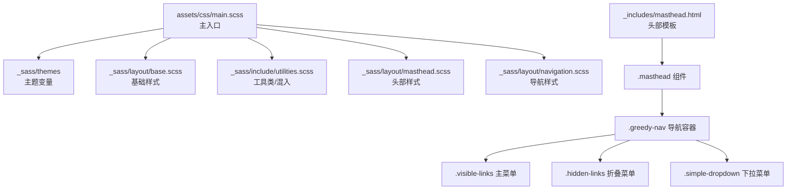
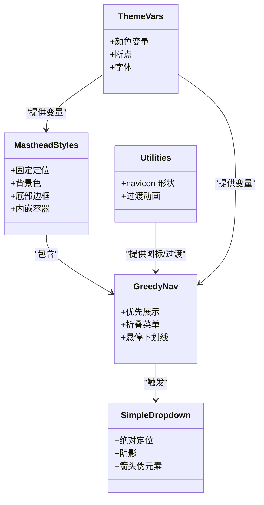
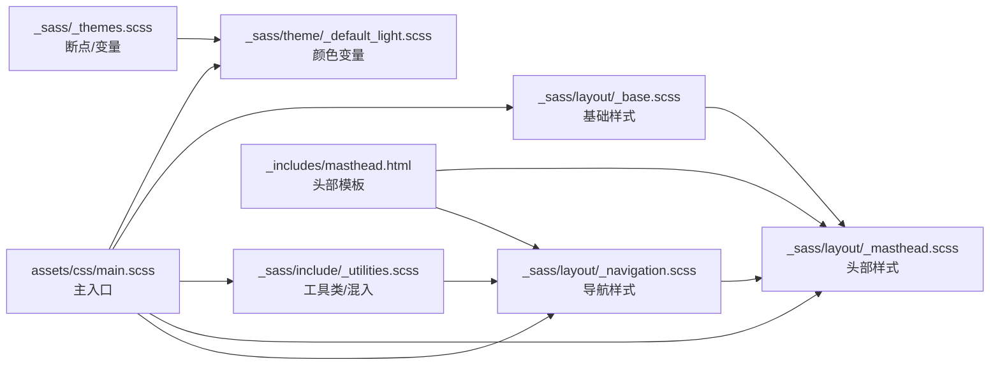

# 头部组件样式

<cite>
**本文引用的文件**
- [_sass/layout/_masthead.scss](file://_sass/layout/_masthead.scss)
- [_includes/masthead.html](file://_includes/masthead.html)
- [_sass/layout/_navigation.scss](file://_sass/layout/_navigation.scss)
- [_sass/layout/_base.scss](file://_sass/layout/_base.scss)
- [_sass/include/_utilities.scss](file://_sass/include/_utilities.scss)
- [_sass/theme/_default_light.scss](file://_sass/theme/_default_light.scss)
- [assets/css/main.scss](file://assets/css/main.scss)
- [_sass/_themes.scss](file://_sass/_themes.scss)
- [BUGFIX_NAVIGATION.md](file://BUGFIX_NAVIGATION.md)
- [_config.yml](file://_config.yml)
</cite>

## 目录
1. [简介](#简介)
2. [项目结构](#项目结构)
3. [核心组件](#核心组件)
4. [架构总览](#架构总览)
5. [详细组件分析](#详细组件分析)
6. [依赖分析](#依赖分析)
7. [性能考虑](#性能考虑)
8. [故障排查指南](#故障排查指南)
9. [结论](#结论)
10. [附录](#附录)

## 简介
本文件聚焦于头部组件（Masthead）的样式实现与交互细节，围绕 _masthead.scss 的布局与视觉规则展开，系统性解析导航栏布局、Logo/标题区样式、下拉菜单交互、响应式策略、以及与全局布局的协调关系，并提供可操作的定制与扩展建议。

## 项目结构
头部样式由 SCSS 模块化组织，通过主入口按顺序导入，确保变量、混入与依赖先行加载；头部模板以 Liquid 渲染，结合 Greedy 导航与简单下拉菜单实现优先级布局与交互。

图示来源
- [assets/css/main.scss:11-43](file://assets/css/main.scss#L11-L43)
- [_sass/layout/_masthead.scss:5-45](file://_sass/layout/_masthead.scss#L5-L45)
- [_sass/layout/_navigation.scss:175-320](file://_sass/layout/_navigation.scss#L175-L320)
- [_includes/masthead.html:2-47](file://_includes/masthead.html#L2-L47)

章节来源
- [assets/css/main.scss:11-43](file://assets/css/main.scss#L11-L43)
- [_sass/layout/_masthead.scss:5-45](file://_sass/layout/_masthead.scss#L5-L45)
- [_sass/layout/_navigation.scss:175-320](file://_sass/layout/_navigation.scss#L175-L320)
- [_includes/masthead.html:2-47](file://_includes/masthead.html#L2-L47)

## 核心组件
- 头部容器与边框：固定定位、背景色、底部边框线，内嵌容器与清除浮动，约束最大宽度。
- 导航容器与链接：Greedy 导航实现优先展示与折叠，主菜单与隐藏菜单分层，悬停下划线动效。
- 菜单项与选中态：选中项带底边框与禁用交互，下拉菜单内的链接需显式恢复点击能力。
- 工具图标：汉堡菜单使用自定义 navicon 形状，支持打开/关闭状态切换。
- 响应式断点：基于预设断点控制布局与显示密度。

章节来源
- [_sass/layout/_masthead.scss:5-81](file://_sass/layout/_masthead.scss#L5-L81)
- [_sass/layout/_navigation.scss:175-320](file://_sass/layout/_navigation.scss#L175-L320)
- [_sass/include/_utilities.scss:320-374](file://_sass/include/_utilities.scss#L320-L374)

## 架构总览
头部样式与布局的协作关系如下：

图示来源
- [_sass/layout/_masthead.scss:5-45](file://_sass/layout/_masthead.scss#L5-L45)
- [_sass/layout/_navigation.scss:175-320](file://_sass/layout/_navigation.scss#L175-L320)
- [_sass/include/_utilities.scss:320-374](file://_sass/include/_utilities.scss#L320-L374)
- [_sass/_themes.scss:48-56](file://_sass/_themes.scss#L48-L56)

## 详细组件分析

### 头部容器与布局
- 定位与层级：固定定位、较高 z-index，避免被内容覆盖。
- 背景与边框：背景继承全局变量，底部使用边框色绘制细线，形成清晰的分割。
- 内容容器：使用容器混入与清除浮动，内边距统一，限制最大宽度以适配大屏。
- 字体族：窄体无衬线字体，强调导航信息的可读性。

章节来源
- [_sass/layout/_masthead.scss:5-45](file://_sass/layout/_masthead.scss#L5-L45)
- [_sass/_themes.scss:48-56](file://_sass/_themes.scss#L48-L56)

### 导航栏布局与交互
- Greedy 导航容器：最小宽度约束，背景与链接颜色来自主题变量；按钮位于右侧，用于触发折叠菜单。
- 主菜单（可见链接）：表格单元格布局，垂直居中，首项加粗突出站点标题；链接悬停时显示横向缩放的下划线。
- 隐藏菜单（折叠菜单）：绝对定位，带边框、圆角与阴影，伪元素形成三角箭头，悬停项高亮。
- 主题切换：最后一个菜单项为主题切换图标，居中对齐，具备点击能力。

章节来源
- [_sass/layout/_navigation.scss:175-320](file://_sass/layout/_navigation.scss#L175-L320)
- [_includes/masthead.html:5-44](file://_includes/masthead.html#L5-L44)

### Logo/标题区样式
- 站点标题作为首个菜单项，加粗处理，去除外边距，确保与汉堡菜单对齐。
- 标题链接采用相对定位，配合伪元素实现下划线动效，保持与导航一致的交互体验。

章节来源
- [_includes/masthead.html:8-10](file://_includes/masthead.html#L8-L10)
- [_sass/layout/_navigation.scss:205-261](file://_sass/layout/_navigation.scss#L205-L261)

### 下拉菜单交互
- 触发器：带向下箭头的链接，悬停时旋转箭头，指示可展开。
- 菜单：绝对定位，带阴影与边框，逐项分隔线，悬停高亮。
- 选中态兼容：当父级为选中态时，显式恢复下拉菜单内链接的点击能力，避免 pointer-events 导致无法点击。

章节来源
- [_sass/layout/_navigation.scss:449-526](file://_sass/layout/_navigation.scss#L449-L526)
- [BUGFIX_NAVIGATION.md:41-98](file://BUGFIX_NAVIGATION.md#L41-L98)

### 响应式设计
- 断点定义：小、中、宽中、大、超大五档断点，用于控制布局密度与显示范围。
- 大屏容器：头部内嵌容器在超大屏下限制最大宽度，保证阅读舒适度。
- 移动端策略：导航按钮触发折叠菜单，隐藏菜单在移动端更易管理长列表；汉堡图标使用自定义 navicon，简洁直观。

章节来源
- [_sass/_themes.scss:48-56](file://_sass/_themes.scss#L48-L56)
- [_sass/layout/_masthead.scss:33-35](file://_sass/layout/_masthead.scss#L33-L35)
- [_sass/layout/_navigation.scss:263-320](file://_sass/layout/_navigation.scss#L263-L320)
- [_sass/include/_utilities.scss:320-374](file://_sass/include/_utilities.scss#L320-L374)

### 视觉效果与主题变量
- 颜色体系：主题变量集中定义基础色、文本色、边框色、链接色等，头部背景与链接色均来自变量。
- 动画与过渡：引入统一的过渡时间与缓动，下划线缩放、汉堡图标变换均体现细腻动效。
- 字体与字号：主题变量统一字体族与字号比例，确保头部与正文风格一致。

章节来源
- [_sass/theme/_default_light.scss:30-47](file://_sass/theme/_default_light.scss#L30-L47)
- [_sass/layout/_base.scss:10-25](file://_sass/layout/_base.scss#L10-L25)
- [_sass/layout/_navigation.scss:240-259](file://_sass/layout/_navigation.scss#L240-L259)

### 与其他布局组件的协调
- 全局滚动与头部间距：body 顶部预留头部高度，避免内容被固定头部遮挡。
- 打印样式：打印时隐藏头部，避免浪费纸张与空间。
- 主题切换：头部内嵌主题切换入口，与导航样式保持一致的图标与交互。

章节来源
- [_sass/layout/_base.scss:16](file://_sass/layout/_base.scss#L16)
- [_sass/layout/_base.scss:357-365](file://_sass/layout/_base.scss#L357-L365)
- [_includes/masthead.html:39-41](file://_includes/masthead.html#L39-L41)

## 依赖分析
头部样式依赖关系如下：

图示来源
- [_sass/_themes.scss:48-56](file://_sass/_themes.scss#L48-L56)
- [_sass/theme/_default_light.scss:30-47](file://_sass/theme/_default_light.scss#L30-L47)
- [_sass/include/_utilities.scss:320-374](file://_sass/include/_utilities.scss#L320-L374)
- [_sass/layout/_navigation.scss:175-320](file://_sass/layout/_navigation.scss#L175-L320)
- [_sass/layout/_masthead.scss:5-45](file://_sass/layout/_masthead.scss#L5-L45)
- [_sass/layout/_base.scss:10-25](file://_sass/layout/_base.scss#L10-L25)
- [_includes/masthead.html:2-47](file://_includes/masthead.html#L2-L47)
- [assets/css/main.scss:11-43](file://assets/css/main.scss#L11-L43)

章节来源
- [assets/css/main.scss:11-43](file://assets/css/main.scss#L11-L43)
- [_sass/layout/_masthead.scss:5-45](file://_sass/layout/_masthead.scss#L5-L45)
- [_sass/layout/_navigation.scss:175-320](file://_sass/layout/_navigation.scss#L175-L320)
- [_sass/layout/_base.scss:10-25](file://_sass/layout/_base.scss#L10-L25)
- [_sass/include/_utilities.scss:320-374](file://_sass/include/_utilities.scss#L320-L374)
- [_sass/_themes.scss:48-56](file://_sass/_themes.scss#L48-L56)

## 性能考虑
- 选择器复杂度：头部选择器层级较浅，避免深层嵌套导致的重绘成本。
- 动画与过渡：统一的过渡属性减少重复声明，同时注意仅对必要元素应用 transform/opacity。
- 响应式断点：合理利用断点，避免在小屏频繁切换导致的布局抖动。
- 图标与阴影：navicon 与下拉阴影均为轻量效果，建议保持默认值以维持流畅体验。

## 故障排查指南
- 下拉菜单无法点击
  - 现象：父级选中态时，下拉菜单内链接不可点击。
  - 原因：父级选中态设置了 pointer-events:none，阻止了子链接交互。
  - 解决：为选中态下的简单下拉菜单显式恢复子链接的 pointer-events 与光标。
  - 参考：[BUGFIX_NAVIGATION.md:41-98](file://BUGFIX_NAVIGATION.md#L41-L98)
- 汉堡菜单图标不变化
  - 现象：点击后未呈现“×”形态。
  - 原因：JS 未正确切换 .close 类或 navicon 样式未生效。
  - 解决：确认 JS 切换逻辑与 navicon 关闭态样式匹配。
  - 参考：[_sass/include/_utilities.scss:352-374](file://_sass/include/_utilities.scss#L352-L374)
- 选中态下划线不显示
  - 现象：选中链接无底边框或下划线。
  - 原因：选择器优先级不足或未正确应用 selected 类。
  - 解决：检查 .masthead__menu-item.selected > a 的选择器与类名绑定。
  - 参考：[_sass/layout/_masthead.scss:69-75](file://_sass/layout/_masthead.scss#L69-L75)

章节来源
- [BUGFIX_NAVIGATION.md:41-98](file://BUGFIX_NAVIGATION.md#L41-L98)
- [_sass/include/_utilities.scss:352-374](file://_sass/include/_utilities.scss#L352-L374)
- [_sass/layout/_masthead.scss:69-75](file://_sass/layout/_masthead.scss#L69-L75)

## 结论
头部组件通过模块化的 SCSS 与模板渲染，实现了稳定、可维护且具备良好交互体验的导航系统。其固定定位、主题化颜色、下拉菜单与响应式布局共同构成了现代网站头部的标准实现。遵循本文的定制与扩展建议，可在不破坏整体风格的前提下进行个性化调整。

## 附录

### 定制与扩展建议
- 背景色与边框
  - 修改头部背景色与边框色变量，确保与主题一致。
  - 参考：[_sass/theme/_default_light.scss:30-47](file://_sass/theme/_default_light.scss#L30-L47)
- 链接与选中态
  - 调整链接悬停颜色与选中态底边框颜色，保持对比度与可访问性。
  - 参考：[_sass/layout/_navigation.scss:180-190](file://_sass/layout/_navigation.scss#L180-L190)，[_sass/layout/_masthead.scss:69-75](file://_sass/layout/_masthead.scss#L69-L75)
- 响应式行为
  - 在不同断点下微调容器最大宽度与菜单折叠阈值，平衡信息密度与可用性。
  - 参考：[_sass/layout/_masthead.scss:33-35](file://_sass/layout/_masthead.scss#L33-L35)，[_sass/_themes.scss:48-56](file://_sass/_themes.scss#L48-L56)
- 下拉菜单样式
  - 自定义阴影、圆角与箭头伪元素，使其与品牌风格契合。
  - 参考：[_sass/layout/_navigation.scss:263-320](file://_sass/layout/_navigation.scss#L263-L320)，[_sass/layout/_navigation.scss:462-526](file://_sass/layout/_navigation.scss#L462-L526)
- 主题切换
  - 保持图标尺寸与对齐方式一致，确保在各断点下表现稳定。
  - 参考：[_sass/layout/_navigation.scss:228-235](file://_sass/layout/_navigation.scss#L228-L235)，[_includes/masthead.html:39-41](file://_includes/masthead.html#L39-L41)