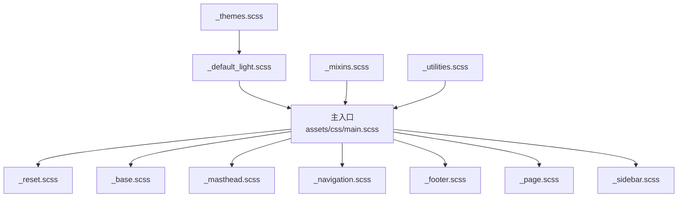
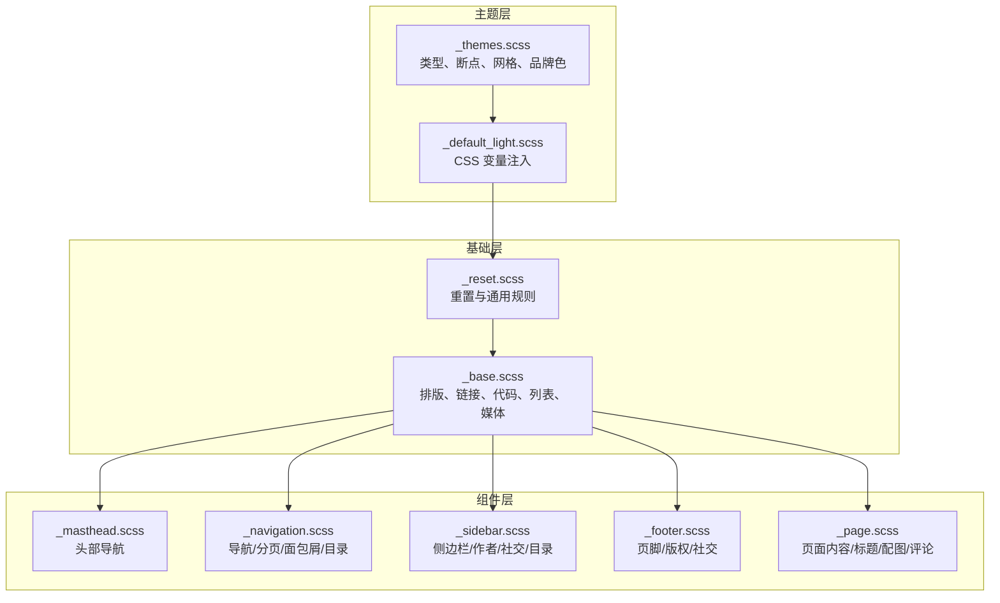
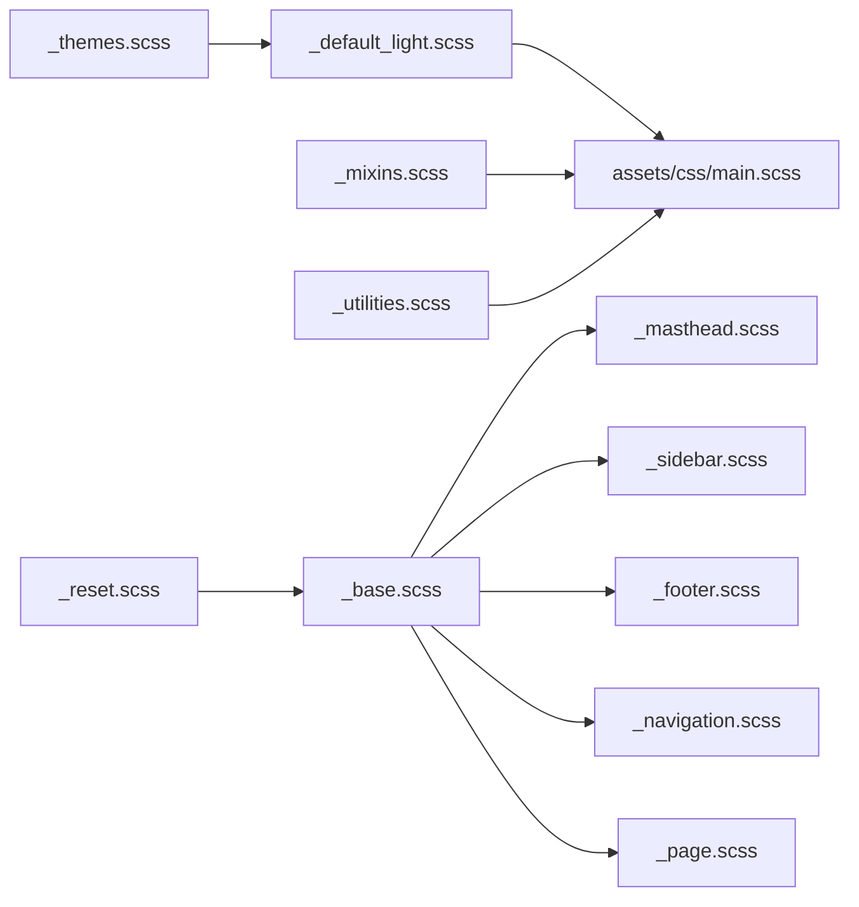

# 布局组件样式

<cite>
**本文引用的文件**
- [_sass/layout/_base.scss](file://_sass/layout/_base.scss)
- [_sass/layout/_reset.scss](file://_sass/layout/_reset.scss)
- [_sass/layout/_masthead.scss](file://_sass/layout/_masthead.scss)
- [_sass/layout/_sidebar.scss](file://_sass/layout/_sidebar.scss)
- [_sass/layout/_footer.scss](file://_sass/layout/_footer.scss)
- [_sass/layout/_page.scss](file://_sass/layout/_page.scss)
- [_sass/layout/_navigation.scss](file://_sass/layout/_navigation.scss)
- [assets/css/main.scss](file://assets/css/main.scss)
- [_sass/_themes.scss](file://_sass/_themes.scss)
- [_sass/theme/_default_light.scss](file://_sass/theme/_default_light.scss)
- [_sass/include/_mixins.scss](file://_sass/include/_mixins.scss)
- [_sass/include/_utilities.scss](file://_sass/include/_utilities.scss)
- [_layouts/default.html](file://_layouts/default.html)
- [_includes/masthead.html](file://_includes/masthead.html)
- [_includes/sidebar.html](file://_includes/sidebar.html)
- [_includes/footer.html](file://_includes/footer.html)
- [_config.yml](file://_config.yml)
</cite>

## 目录
1. [简介](#简介)
2. [项目结构](#项目结构)
3. [核心组件](#核心组件)
4. [架构总览](#架构总览)
5. [组件详解](#组件详解)
6. [依赖关系分析](#依赖关系分析)
7. [性能考量](#性能考量)
8. [故障排查指南](#故障排查指南)
9. [结论](#结论)
10. [附录](#附录)

## 简介
本文件面向布局组件样式的技术文档，系统性解析布局系统的整体架构与组件划分，重点覆盖以下文件：基础样式重置与基础排版（_reset.scss、_base.scss）、头部组件（_masthead.scss）、侧边栏组件（_sidebar.scss）、页脚组件（_footer.scss），以及它们之间的层级关系与样式继承。同时提供可操作的定制方法与扩展技巧，帮助读者在不破坏现有结构的前提下进行主题化与功能增强。

## 项目结构
布局样式采用模块化组织，按功能域拆分为 reset、base、masthead、sidebar、footer、navigation、page 等 SCSS 模块；通过主入口 assets/css/main.scss 统一导入，确保依赖顺序正确。主题变量与断点由 _themes.scss 提供，具体主题色板由 _default_light.scss 注入 CSS 变量。

**图表来源**
- [assets/css/main.scss:11-43](file://assets/css/main.scss#L11-L43)
- [_sass/_themes.scss:1-104](file://_sass/_themes.scss#L1-L104)
- [_sass/theme/_default_light.scss:1-49](file://_sass/theme/_default_light.scss#L1-L49)

**章节来源**
- [assets/css/main.scss:11-43](file://assets/css/main.scss#L11-L43)
- [_sass/_themes.scss:1-104](file://_sass/_themes.scss#L1-L104)
- [_sass/theme/_default_light.scss:1-49](file://_sass/theme/_default_light.scss#L1-L49)

## 核心组件
- 基础重置与排版：统一浏览器差异、字体与排版基线、链接与代码块样式、列表与媒体等。
- 头部组件：固定顶部导航栏、Logo、菜单项、下拉菜单、主题切换等。
- 侧边栏组件：作者信息、社交链接、目录导航、响应式定位与交互。
- 页脚组件：版权与社交信息、粘性底部定位、动画入场效果。
- 导航与面包屑：优先级导航、分页、面包屑、目录树等。
- 页面内容区：文章标题、段落缩进、配图、分享、评论、相关文章等。

**章节来源**
- [_sass/layout/_reset.scss:1-179](file://_sass/layout/_reset.scss#L1-L179)
- [_sass/layout/_base.scss:1-365](file://_sass/layout/_base.scss#L1-L365)
- [_sass/layout/_masthead.scss:1-81](file://_sass/layout/_masthead.scss#L1-L81)
- [_sass/layout/_sidebar.scss:1-325](file://_sass/layout/_sidebar.scss#L1-L325)
- [_sass/layout/_footer.scss:1-97](file://_sass/layout/_footer.scss#L1-L97)
- [_sass/layout/_navigation.scss:1-527](file://_sass/layout/_navigation.scss#L1-L527)
- [_sass/layout/_page.scss:1-402](file://_sass/layout/_page.scss#L1-L402)

## 架构总览
布局系统遵循“主题变量 → 基础重置 → 基础排版 → 组件样式”的层次化结构。主入口按依赖顺序导入，确保变量与混入先于组件使用；主题通过 CSS 变量注入全局颜色与尺寸，组件通过变量实现主题一致性。

**图表来源**
- [assets/css/main.scss:11-43](file://assets/css/main.scss#L11-L43)
- [_sass/_themes.scss:1-104](file://_sass/_themes.scss#L1-L104)
- [_sass/theme/_default_light.scss:29-49](file://_sass/theme/_default_light.scss#L29-L49)
- [_sass/layout/_reset.scss:1-179](file://_sass/layout/_reset.scss#L1-L179)
- [_sass/layout/_base.scss:1-365](file://_sass/layout/_base.scss#L1-L365)
- [_sass/layout/_masthead.scss:1-81](file://_sass/layout/_masthead.scss#L1-L81)
- [_sass/layout/_navigation.scss:1-527](file://_sass/layout/_navigation.scss#L1-L527)
- [_sass/layout/_sidebar.scss:1-325](file://_sass/layout/_sidebar.scss#L1-L325)
- [_sass/layout/_footer.scss:1-97](file://_sass/layout/_footer.scss#L1-L97)
- [_sass/layout/_page.scss:1-402](file://_sass/layout/_page.scss#L1-L402)

## 组件详解

### 基础样式：重置与排版（_reset.scss、_base.scss）
- 重置层（_reset.scss）：统一盒模型、字体大小、选择器外观、HTML5 元素显示、图片与表单控件行为、滚动条与内边距问题等，确保跨浏览器一致。
- 基础层（_base.scss）：设置全局字体族、行高、颜色变量；标题层级、小字、段落间距；链接焦点态与悬停；代码块与预格式文本；水平分割线；列表嵌套；图片与视频容器；导航列表去装饰；打印隐藏元素等。

关键特性
- 使用 CSS 变量承载颜色与背景，便于主题切换。
- 通过混入与断点系统实现响应式布局基线。
- 为后续组件提供一致的排版与交互过渡。

**章节来源**
- [_sass/layout/_reset.scss:1-179](file://_sass/layout/_reset.scss#L1-L179)
- [_sass/layout/_base.scss:1-365](file://_sass/layout/_base.scss#L1-L365)
- [_sass/include/_mixins.scss:1-53](file://_sass/include/_mixins.scss#L1-L53)
- [_sass/_themes.scss:42-57](file://_sass/_themes.scss#L42-L57)

### 头部组件：导航栏与 Logo（_masthead.scss）
- 固定定位与层级：头部固定在视口顶部，带阴影与动画入场。
- 内容容器：内部包裹容器与清除浮动，限制最大宽度。
- 菜单结构：优先级导航（greedy-nav）+ 下拉菜单（simple-dropdown）；菜单项选中态与悬停下划线。
- 主题切换：菜单末尾包含切换按钮，配合图标库实现切换反馈。

页面集成
- 默认布局通过 include 引入 masthead.html，其中渲染站点标题、主导航与下拉子菜单。

**章节来源**
- [_sass/layout/_masthead.scss:1-81](file://_sass/layout/_masthead.scss#L1-L81)
- [_includes/masthead.html:1-48](file://_includes/masthead.html#L1-L48)
- [_layouts/default.html:17](file://_layouts/default.html#L17)

### 侧边栏组件：布局与交互（_sidebar.scss）
- 定位与滚动：在大屏固定侧边栏，支持纵向滚动；移动端与竖屏设备有额外间距。
- 结构与排版：标题、段落、图片的字号与行高；作者头像圆形裁剪与边框；社交链接弹出气泡（含伪元素三角）。
- 交互细节：桌面端显示社交链接面板，移动端以按钮触发；目录树层级缩进；悬停与焦点状态。

页面集成
- 通过 include 渲染侧边栏，支持作者资料、自定义图像与文本、导航列表等。

**章节来源**
- [_sass/layout/_sidebar.scss:1-325](file://_sass/layout/_sidebar.scss#L1-L325)
- [_includes/sidebar.html:1-25](file://_includes/sidebar.html#L1-L25)

### 页脚组件：版权与社交（_footer.scss）
- 粘性底部：通过绝对定位与底部对齐实现粘性底部，避免内容不足时头部或页脚“飞起”。
- 版面与动画：容器内居中与最大宽度控制；动画延迟与边框分隔；社交图标颜色继承。
- 版权信息：版权文案与站点信息，支持本地化文本。

页面集成
- 默认布局在页面底部引入 footer.html，渲染社交与版权信息。

**章节来源**
- [_sass/layout/_footer.scss:1-97](file://_sass/layout/_footer.scss#L1-L97)
- [_includes/footer.html:1-26](file://_includes/footer.html#L1-L26)
- [_layouts/default.html:21-26](file://_layouts/default.html#L21-L26)

### 导航与面包屑（_navigation.scss）
- 面包屑：容器与列表样式、当前项强调、动画入场。
- 分页：上一页/下一页与数字页码按钮，禁用态与圆角处理。
- 优先级导航：右侧按钮折叠多余菜单项，隐藏菜单以气泡形式展示。
- 目录树：TOC 菜单的层级缩进与小屏隐藏策略。

**章节来源**
- [_sass/layout/_navigation.scss:1-527](file://_sass/layout/_navigation.scss#L1-L527)

### 页面内容区（_page.scss）
- 主容器与动画：主内容区域容器、最大宽度、动画延迟。
- 标题与段落：标题下划线、段落缩进与兄弟段落首行缩进；链接悬停放大配图阴影。
- 英文引注：引用后的补充信息位置微调。
- 英雄图：覆盖式背景、文字反差与标题自适应。
- 社交分享：分享区边框与移动端可访问性处理。
- 元数据与分类：元信息颜色与大小、分类标签圆角与悬停效果。
- 评论与相关：评论区边框与头像尺寸、相关文章区边框与布局。

**章节来源**
- [_sass/layout/_page.scss:1-402](file://_sass/layout/_page.scss#L1-L402)

## 依赖关系分析
- 主入口导入顺序决定变量与混入先于组件可用，避免未定义变量报错。
- 主题变量通过 CSS 变量注入，组件样式集中读取，实现“所见即所得”的主题切换。
- 断点与网格系统来自主题配置，组件通过混入与断点实现响应式。

**图表来源**
- [assets/css/main.scss:11-43](file://assets/css/main.scss#L11-L43)
- [_sass/_themes.scss:1-104](file://_sass/_themes.scss#L1-L104)
- [_sass/theme/_default_light.scss:29-49](file://_sass/theme/_default_light.scss#L29-L49)
- [_sass/include/_mixins.scss:1-53](file://_sass/include/_mixins.scss#L1-L53)
- [_sass/include/_utilities.scss:1-501](file://_sass/include/_utilities.scss#L1-L501)

**章节来源**
- [assets/css/main.scss:11-43](file://assets/css/main.scss#L11-L43)
- [_sass/_themes.scss:1-104](file://_sass/_themes.scss#L1-L104)
- [_sass/theme/_default_light.scss:1-49](file://_sass/theme/_default_light.scss#L1-L49)
- [_sass/include/_mixins.scss:1-53](file://_sass/include/_mixins.scss#L1-L53)
- [_sass/include/_utilities.scss:1-501](file://_sass/include/_utilities.scss#L1-L501)

## 性能考量
- 合理使用 CSS 变量：主题切换通过变量实现，避免重复编译多套样式。
- 控制动画数量：过渡时间短、范围有限，减少重绘与回流。
- 响应式断点：基于主题断点与 Susy 网格，避免过度媒体查询导致的样式体积膨胀。
- 图片与图标：使用矢量图标与响应式图片，降低带宽与渲染压力。

## 故障排查指南
- 样式未生效
  - 检查主入口导入顺序是否正确，确保变量与混入在组件之前加载。
  - 确认主题变量已注入 CSS 变量，且命名一致。
- 头部遮挡内容
  - 检查 body 的上边距是否与头部高度一致，避免内容被固定头部遮挡。
- 侧边栏不固定或溢出
  - 确认大屏断点与固定定位条件满足；检查容器高度与滚动属性。
- 页脚“飞起”
  - 确保页脚使用粘性底部定位策略，且内容区最小高度足够。
- 导航折叠异常
  - 检查优先级导航按钮与隐藏菜单的相对定位与 z-index。

**章节来源**
- [assets/css/main.scss:11-43](file://assets/css/main.scss#L11-L43)
- [_sass/layout/_base.scss:10-25](file://_sass/layout/_base.scss#L10-L25)
- [_sass/layout/_masthead.scss:5-45](file://_sass/layout/_masthead.scss#L5-L45)
- [_sass/layout/_sidebar.scss:20-41](file://_sass/layout/_sidebar.scss#L20-L41)
- [_sass/layout/_footer.scss:16-30](file://_sass/layout/_footer.scss#L16-L30)
- [_sass/layout/_navigation.scss:175-320](file://_sass/layout/_navigation.scss#L175-L320)

## 结论
该布局系统以主题变量为核心，通过重置与基础排版奠定一致的视觉基线，再以模块化的组件样式实现头部、侧边栏、页脚与导航的清晰职责分离。主入口的导入顺序与断点体系保证了可维护性与可扩展性。遵循本文档的定制与扩展建议，可在不破坏整体结构的前提下实现主题化与功能增强。

## 附录

### 样式定制与扩展方法
- 更换主题色板
  - 在主题变量中调整品牌色与基础色，或切换主题文件。
  - 修改后确保 CSS 变量键名与组件读取一致。
- 调整头部高度与定位
  - 修改主题中的头部高度变量，影响 body 上边距与侧边栏固定偏移。
- 自定义侧边栏宽度与断点
  - 调整主题中的侧边栏最大宽度与最小屏幕宽度断点。
- 扩展社交图标
  - 在工具类中新增对应图标颜色映射，保持与页脚与侧边栏一致。
- 新增导航项
  - 在导航组件中添加新的菜单项或下拉菜单，注意选中态与动画过渡。

**章节来源**
- [_sass/_themes.scss:23-27](file://_sass/_themes.scss#L23-L27)
- [_sass/theme/_default_light.scss:23-47](file://_sass/theme/_default_light.scss#L23-L47)
- [_sass/include/_utilities.scss:197-313](file://_sass/include/_utilities.scss#L197-L313)
- [_sass/layout/_navigation.scss:449-527](file://_sass/layout/_navigation.scss#L449-L527)