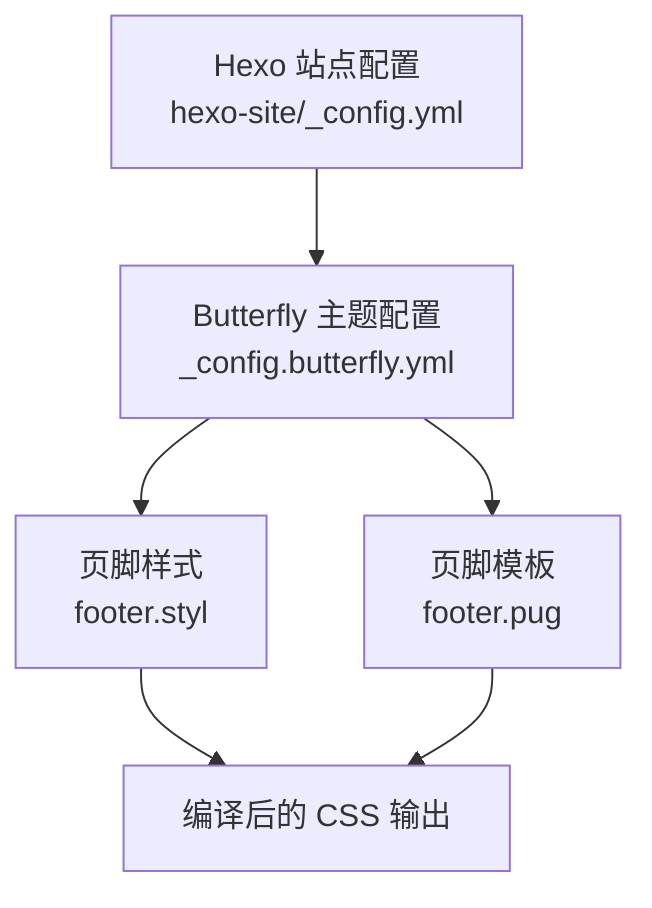
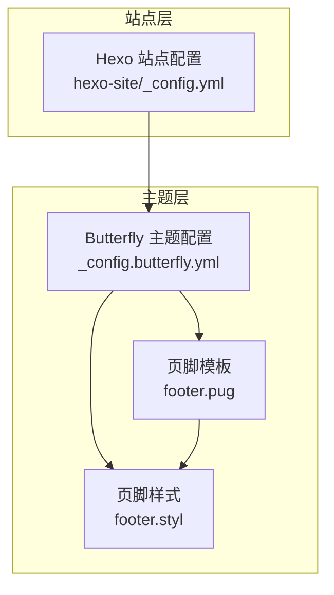
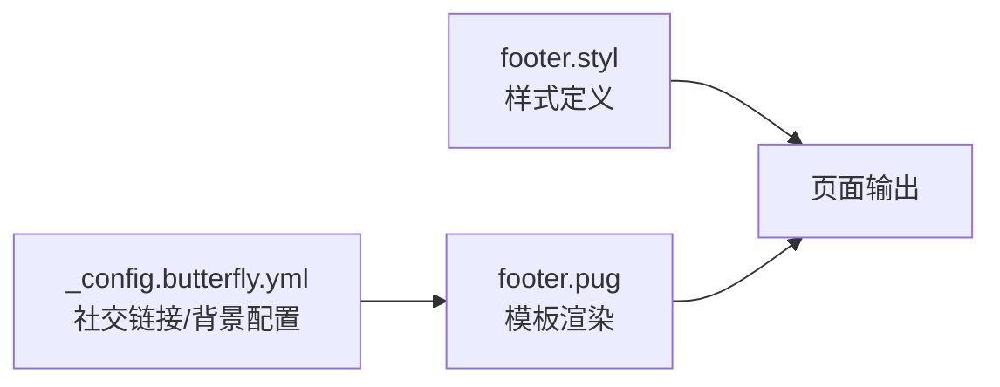

# 页脚组件样式

<cite>
**本文引用的文件**
- [hexo-site/_config.yml](file://hexo-site/_config.yml)
- [_config.butterfly.yml](file://_config.butterfly.yml)
- [footer.styl](file://hexo-site/node_modules/hexo-theme-butterfly/source/css/_layout/footer.styl)
- [footer.pug](file://hexo-site/node_modules/hexo-theme-butterfly/layout/includes/footer.pug)
</cite>

## 目录
1. [简介](#简介)
2. [项目结构](#项目结构)
3. [核心组件](#核心组件)
4. [架构总览](#架构总览)
5. [详细组件分析](#详细组件分析)
6. [依赖关系分析](#依赖关系分析)
7. [性能考量](#性能考量)
8. [故障排查指南](#故障排查指南)
9. [结论](#结论)
10. [附录](#附录)

## 简介
本文件聚焦于站点页脚（Footer）组件的样式实现与定制方法，基于当前项目使用的 Hexo + Butterfly 主题进行分析。文档从页脚布局、版权信息、社交链接的视觉设计入手，结合响应式策略与可访问性建议，帮助开发者在不直接阅读源码的情况下理解并优化页脚样式。

## 项目结构
本项目采用 Hexo + Butterfly 主题方案，页脚样式位于 Butterfly 主题的样式资源中，通过主题配置文件控制页脚相关功能与展示元素。

图表来源
- [hexo-site/_config.yml:1-110](file://hexo-site/_config.yml#L1-L110)
- [_config.butterfly.yml:1-339](file://_config.butterfly.yml#L1-L339)
- [footer.pug](file://hexo-site/node_modules/hexo-theme-butterfly/layout/includes/footer.pug)
- [footer.styl](file://hexo-site/node_modules/hexo-theme-butterfly/source/css/_layout/footer.styl)

章节来源
- [hexo-site/_config.yml:1-110](file://hexo-site/_config.yml#L1-L110)
- [_config.butterfly.yml:1-339](file://_config.butterfly.yml#L1-L339)

## 核心组件
- 页脚模板：负责渲染页脚区域的内容结构，包括版权信息、社交链接等。
- 页脚样式：定义页脚的布局、颜色、边距、响应式断点等视觉表现。
- 主题配置：通过配置项控制页脚元素的启用与展示内容（如社交链接、背景图等）。

章节来源
- [footer.pug](file://hexo-site/node_modules/hexo-theme-butterfly/layout/includes/footer.pug)
- [footer.styl](file://hexo-site/node_modules/hexo-theme-butterfly/source/css/_layout/footer.styl)
- [_config.butterfly.yml:26-30](file://_config.butterfly.yml#L26-L30)

## 架构总览
下图展示了页脚在页面中的位置与依赖关系：主题配置驱动模板渲染，模板调用样式资源，最终输出到页面。

图表来源
- [_config.butterfly.yml:1-339](file://_config.butterfly.yml#L1-L339)
- [footer.pug](file://hexo-site/node_modules/hexo-theme-butterfly/layout/includes/footer.pug)
- [footer.styl](file://hexo-site/node_modules/hexo-theme-butterfly/source/css/_layout/footer.styl)

## 详细组件分析

### 布局设计与响应式策略
- 容器与网格：页脚通常以块级容器呈现，内部可能包含版权信息区与社交链接区。在小屏设备上，社交图标可能改为垂直堆叠或自动换行，确保内容不被截断。
- 对齐与间距：页脚内容常采用居中或两端对齐策略，配合上下内外边距与列间距，保证在不同屏幕宽度下的可读性与平衡感。
- 断点与自适应：通过媒体查询在关键断点（如移动端与平板端）调整字号、行高、图标尺寸与间距，避免拥挤或留白过多。

章节来源
- [footer.styl](file://hexo-site/node_modules/hexo-theme-butterfly/source/css/_layout/footer.styl)

### 版权信息样式规则
- 文本层级：版权文本通常使用较小字号与较浅色阶，强调辅助信息而非主内容。
- 字体与行高：为提升可读性，行高会略大于字号，避免密集感。
- 背景与分隔：版权区可能与社交区有分隔线或背景色区分，增强视觉层次。

章节来源
- [footer.styl](file://hexo-site/node_modules/hexo-theme-butterfly/source/css/_layout/footer.styl)

### 社交链接视觉设计
- 图标系统：使用矢量图标库（如 Font Awesome），统一尺寸与间距，确保在不同分辨率下清晰锐利。
- 颜色与悬停态：默认色与品牌色一致；悬停时改变颜色或添加阴影，提供交互反馈。
- 排版与对齐：社交链接在页脚中通常水平排列，支持居中或左右对齐，具体取决于主题配置与断点策略。

章节来源
- [_config.butterfly.yml:26-30](file://_config.butterfly.yml#L26-L30)
- [footer.styl](file://hexo-site/node_modules/hexo-theme-butterfly/source/css/_layout/footer.styl)

### 响应式布局与设备适配
- 移动优先：在窄屏设备上，社交图标与版权信息可能变为单列或自动换行，避免横向滚动。
- 断点策略：常见断点包括手机（≤768px）、平板（769px–1024px）、桌面（>1024px），在各断点调整字体大小、图标尺寸与间距。
- 视口与缩放：确保 meta 视口设置正确，避免移动端误放大或内容溢出。

章节来源
- [footer.styl](file://hexo-site/node_modules/hexo-theme-butterfly/source/css/_layout/footer.styl)

### 视觉属性配置（背景、边框、内边距）
- 背景：页脚背景色与站点整体风格保持一致，必要时可设置渐变或纹理。
- 边框：顶部边框或分隔线用于与内容区分离，边框宽度与颜色需考虑对比度。
- 内边距：上下内边距决定页脚“呼吸感”，左右内边距与容器最大宽度共同决定内容密度。

章节来源
- [_config.butterfly.yml:49-52](file://_config.butterfly.yml#L49-L52)
- [footer.styl](file://hexo-site/node_modules/hexo-theme-butterfly/source/css/_layout/footer.styl)

### 内容对齐与间距控制
- 对齐方式：居中对齐适合简洁风格，两端对齐适合信息较多的页脚。
- 间距控制：图标与文字间距、行间距、段落间距需成比例，避免视觉不均衡。
- 容器约束：通过最大宽度与左右留白，确保在超宽屏下内容不过度稀疏。

章节来源
- [footer.styl](file://hexo-site/node_modules/hexo-theme-butterfly/source/css/_layout/footer.styl)

### 定制方法
- 修改社交链接：在主题配置中增删社交图标与链接，确保图标类名与颜色正确。
- 调整视觉属性：通过主题配置或自定义 CSS 覆盖页脚背景、边框与内边距。
- 响应式微调：在自定义样式中增加媒体查询，针对特定断点优化布局与排版。

章节来源
- [_config.butterfly.yml:26-30](file://_config.butterfly.yml#L26-L30)
- [_config.butterfly.yml:49-52](file://_config.butterfly.yml#L49-L52)
- [footer.styl](file://hexo-site/node_modules/hexo-theme-butterfly/source/css/_layout/footer.styl)

### 可访问性优化建议
- 语义化结构：确保页脚使用语义标签（如区域、列表）组织内容，便于屏幕阅读器识别。
- 键盘导航：社交链接应支持键盘访问，Tab 顺序合理，焦点可见。
- 对比度：文本与背景的对比度满足 WCAG 基准，保障低视力用户可读。
- 替代文本：图标作为链接时提供可读的标题或 aria-label，避免仅靠颜色或形状传达信息。
- 响应速度：减少重绘与回流，避免在滚动时产生卡顿。

章节来源
- [footer.styl](file://hexo-site/node_modules/hexo-theme-butterfly/source/css/_layout/footer.styl)

## 依赖关系分析
页脚的样式与模板之间存在明确的依赖链：主题配置决定模板渲染内容，模板调用样式资源，最终生成页面输出。

图表来源
- [_config.butterfly.yml:26-30](file://_config.butterfly.yml#L26-L30)
- [footer.pug](file://hexo-site/node_modules/hexo-theme-butterfly/layout/includes/footer.pug)
- [footer.styl](file://hexo-site/node_modules/hexo-theme-butterfly/source/css/_layout/footer.styl)

章节来源
- [_config.butterfly.yml:26-30](file://_config.butterfly.yml#L26-L30)
- [footer.pug](file://hexo-site/node_modules/hexo-theme-butterfly/layout/includes/footer.pug)
- [footer.styl](file://hexo-site/node_modules/hexo-theme-butterfly/source/css/_layout/footer.styl)

## 性能考量
- 样式体积：尽量复用主题提供的样式变量与工具类，避免重复定义相同规则。
- 图标加载：使用矢量图标可降低体积，但需注意网络请求次数与缓存策略。
- 渲染优化：减少复杂选择器与深层嵌套，避免在滚动时触发昂贵的重排。
- 缓存策略：通过 CDN 与浏览器缓存加速样式资源加载。

## 故障排查指南
- 社交链接不显示：检查主题配置中的社交项是否正确填写，确认图标类名与链接地址有效。
- 样式未生效：确认自定义样式是否覆盖了主题默认样式，或是否存在选择器优先级问题。
- 响应式异常：检查媒体查询断点与设备视口设置，确保在目标设备上触发正确的样式规则。
- 可访问性问题：使用屏幕阅读器与键盘导航测试，验证焦点顺序与替代文本的可用性。

章节来源
- [_config.butterfly.yml:26-30](file://_config.butterfly.yml#L26-L30)
- [footer.styl](file://hexo-site/node_modules/hexo-theme-butterfly/source/css/_layout/footer.styl)

## 结论
页脚组件的样式实现围绕“结构清晰、视觉一致、响应友好、可访问性强”展开。通过主题配置与样式资源的协同，可以在不破坏整体风格的前提下灵活定制页脚内容与外观，并在多设备上提供一致的用户体验。

## 附录
- 相关文件路径参考
  - [hexo-site/_config.yml](file://hexo-site/_config.yml)
  - [_config.butterfly.yml](file://_config.butterfly.yml)
  - [footer.styl](file://hexo-site/node_modules/hexo-theme-butterfly/source/css/_layout/footer.styl)
  - [footer.pug](file://hexo-site/node_modules/hexo-theme-butterfly/layout/includes/footer.pug)