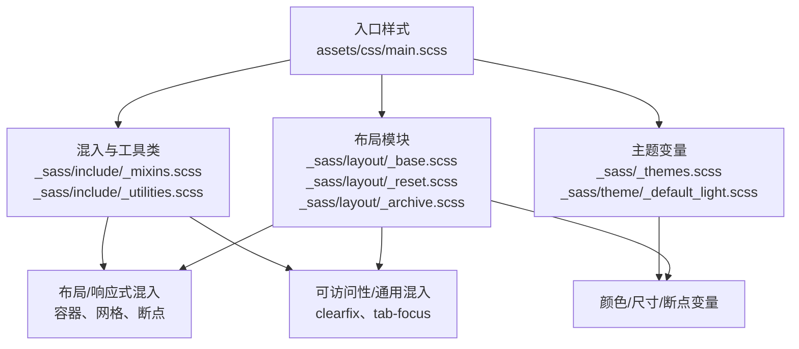
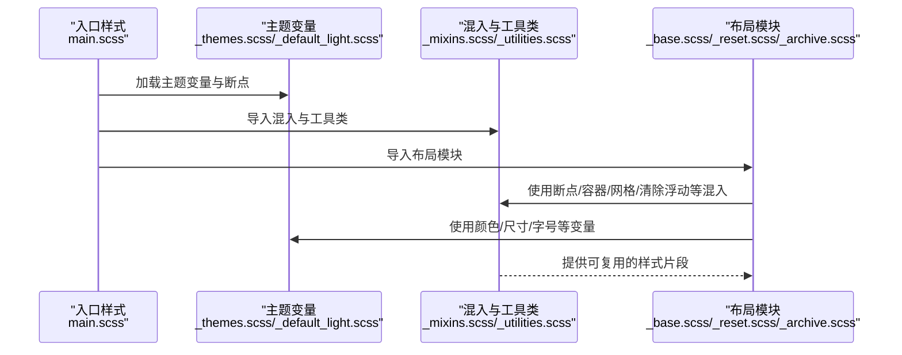
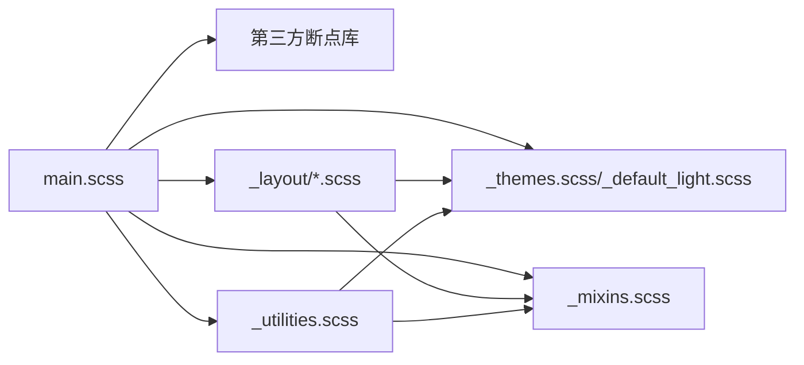

# 混入函数和工具类

<cite>
**本文引用的文件**
- [_mixins.scss](file://_sass/include/_mixins.scss)
- [_utilities.scss](file://_sass/include/_utilities.scss)
- [main.scss](file://assets/css/main.scss)
- [_themes.scss](file://_sass/_themes.scss)
- [_base.scss](file://_sass/layout/_base.scss)
- [_reset.scss](file://_sass/layout/_reset.scss)
- [_archive.scss](file://_sass/layout/_archive.scss)
- [_default_light.scss](file://_sass/theme/_default_light.scss)
- [_config.yml](file://_config.yml)
</cite>

## 目录
1. [引言](#引言)
2. [项目结构](#项目结构)
3. [核心组件](#核心组件)
4. [架构总览](#架构总览)
5. [详细组件分析](#详细组件分析)
6. [依赖关系分析](#依赖关系分析)
7. [性能考量](#性能考量)
8. [故障排查指南](#故障排查指南)
9. [结论](#结论)
10. [附录](#附录)

## 引言
本文件面向前端与样式维护人员，系统化梳理该项目中的 SCSS 混入函数与工具类体系，重点覆盖以下方面：
- 混入函数的设计原则与使用场景：包括布局网格混入、响应式断点混入、可访问性焦点混入、单位换算函数等。
- 工具类的定义与用法：涵盖可见性控制、对齐与排版、图片与图标、导航图标、粘性定位、模态框、脚注与必填项等。
- 参数传递与返回机制：解释混入如何接收参数、如何在不同断点下生成差异化规则。
- 组合使用技巧与最佳实践：如何将混入与工具类协同，提升可维护性与一致性。
- 自定义扩展指南与性能优化建议：如何基于现有混入体系扩展新功能，并避免样式膨胀与重绘开销。

## 项目结构
本项目采用“按功能域分层”的 SCSS 组织方式：
- include 目录：存放混入与通用工具类（_mixins.scss、_utilities.scss）。
- layout 目录：按页面区域划分的样式模块（如 _base.scss、_reset.scss、_archive.scss 等），内部广泛使用混入与工具类。
- theme 目录：主题变量与颜色映射（如 _default_light.scss），为混入与工具类提供语义化变量。
- assets/css/main.scss：全局入口，统一导入第三方断点库、主题、混入、布局与工具类等。

图表来源
- [main.scss:11-43](file://assets/css/main.scss#L11-L43)
- [_mixins.scss:1-53](file://_sass/include/_mixins.scss#L1-L53)
- [_utilities.scss:1-501](file://_sass/include/_utilities.scss#L1-L501)
- [_themes.scss:1-104](file://_sass/_themes.scss#L1-L104)
- [_default_light.scss:1-49](file://_sass/theme/_default_light.scss#L1-L49)
- [_base.scss:1-365](file://_sass/layout/_base.scss#L1-L365)
- [_reset.scss:1-179](file://_sass/layout/_reset.scss#L1-L179)
- [_archive.scss:1-246](file://_sass/layout/_archive.scss#L1-L246)

章节来源
- [main.scss:11-43](file://assets/css/main.scss#L11-L43)

## 核心组件
- 混入与函数
  - 可访问性焦点占位符：用于统一键盘焦点样式，便于复用与集中管理。
  - 单位换算函数：将目标像素值转换为相对单位，支持上下文字体大小。
  - 清除浮动混入：通过伪元素清除浮动，避免额外 HTML 结构。
  - 响应式断点混入：基于第三方断点库，提供便捷的媒体查询封装。
  - 容器/网格混入：基于 Susy 网格系统，提供 span、prefix、suffix、gallery、container 等能力。
- 工具类
  - 可见性与可访问性：隐藏、仅屏幕阅读器可见、跳转链接等。
  - 文本与对齐：左中右对齐、两端对齐、不换行等。
  - 图片与图标：居中/左右对齐、响应式换行、社交图标色板。
  - 导航图标：汉堡菜单动画与关闭态。
  - 粘性定位、模态框、脚注与必填项等实用工具类。

章节来源
- [_mixins.scss:1-53](file://_sass/include/_mixins.scss#L1-L53)
- [_utilities.scss:1-501](file://_sass/include/_utilities.scss#L1-L501)
- [_themes.scss:1-104](file://_sass/_themes.scss#L1-L104)

## 架构总览
混入与工具类在项目中的作用链路如下：
- 全局入口 main.scss 负责引入断点库、主题、混入、布局与工具类。
- 主题变量提供颜色、断点、字号、网格等基础配置。
- 布局模块在各页面区域中调用混入与工具类，形成一致的视觉与交互体验。
- 工具类作为原子化样式，直接在 HTML 上使用，减少重复定义。

图表来源
- [main.scss:11-43](file://assets/css/main.scss#L11-L43)
- [_themes.scss:1-104](file://_sass/_themes.scss#L1-L104)
- [_default_light.scss:1-49](file://_sass/theme/_default_light.scss#L1-L49)
- [_mixins.scss:1-53](file://_sass/include/_mixins.scss#L1-L53)
- [_utilities.scss:1-501](file://_sass/include/_utilities.scss#L1-L501)
- [_base.scss:1-365](file://_sass/layout/_base.scss#L1-L365)
- [_reset.scss:1-179](file://_sass/layout/_reset.scss#L1-L179)
- [_archive.scss:1-246](file://_sass/layout/_archive.scss#L1-L246)

## 详细组件分析

### 混入函数与工具类概览
- 可访问性焦点占位符
  - 作用：统一键盘焦点样式，确保跨浏览器一致的高亮效果。
  - 使用位置：链接聚焦态等场景。
  - 参考路径：[可访问性焦点占位符:5-11](file://_sass/include/_mixins.scss#L5-L11)
- 单位换算函数
  - 作用：将 px 转换为 em，支持上下文字体大小，默认使用站点文档字体大小。
  - 参数：目标值与上下文字体大小。
  - 返回：相对单位值。
  - 参考路径：[em 函数:17-19](file://_sass/include/_mixins.scss#L17-L19)
- 清除浮动混入
  - 作用：通过伪元素清除浮动，避免父容器塌陷。
  - 使用位置：浮动布局或网格容器。
  - 参考路径：[clearfix 混入:45-53](file://_sass/include/_mixins.scss#L45-L53)
- 响应式断点混入
  - 作用：基于第三方断点库，提供便捷的媒体查询封装。
  - 使用位置：多处布局模块中使用断点包裹规则。
  - 参考路径：[断点设置与使用:50-56](file://_sass/_themes.scss#L50-L56), [布局模块断点调用示例:8-15](file://_sass/layout/_archive.scss#L8-L15)
- 容器/网格混入
  - 作用：基于 Susy 网格系统，提供容器、跨度、前缀、后缀、画廊等布局能力。
  - 使用位置：归档页网格与列表视图。
  - 参考路径：[工具类中的容器与断点调用:116-118](file://_sass/include/_utilities.scss#L116-L118), [归档页网格混入:131-151](file://_sass/layout/_archive.scss#L131-L151)

章节来源
- [_mixins.scss:1-53](file://_sass/include/_mixins.scss#L1-L53)
- [_utilities.scss:1-501](file://_sass/include/_utilities.scss#L1-L501)
- [_themes.scss:1-104](file://_sass/_themes.scss#L1-L104)
- [_archive.scss:1-246](file://_sass/layout/_archive.scss#L1-L246)

### 动画混入与过渡
- 关键帧与过渡
  - 作用：定义页面加载动画与全局过渡效果，提升用户体验。
  - 使用位置：基础布局中统一声明过渡属性，部分元素定义专用关键帧。
  - 参考路径：[全局过渡与关键帧:324-346](file://_sass/layout/_base.scss#L324-L346)

章节来源
- [_base.scss:324-346](file://_sass/layout/_base.scss#L324-L346)

### 布局混入与网格系统
- 容器与断点
  - 作用：在不同断点下调整容器宽度与间距，保证内容在桌面端更宽、移动端更紧凑。
  - 参考路径：[工具类中的容器与断点:116-118](file://_sass/include/_utilities.scss#L116-L118), [断点变量:52-56](file://_sass/_themes.scss#L52-L56)
- 网格与画廊
  - 作用：在小屏到大屏之间动态切换列数与间距，实现响应式网格布局。
  - 参考路径：[归档页网格与画廊:131-151](file://_sass/layout/_archive.scss#L131-L151)
- 清除浮动
  - 作用：在网格或浮动布局中稳定父容器高度。
  - 参考路径：[clearfix 混入:45-53](file://_sass/include/_mixins.scss#L45-L53), [归档页使用示例:159-160](file://_sass/layout/_archive.scss#L159-L160)

章节来源
- [_utilities.scss:116-118](file://_sass/include/_utilities.scss#L116-L118)
- [_themes.scss:52-56](file://_sass/_themes.scss#L52-L56)
- [_archive.scss:131-160](file://_sass/layout/_archive.scss#L131-L160)
- [_mixins.scss:45-53](file://_sass/include/_mixins.scss#L45-L53)

### 响应式混入与断点策略
- 断点变量与设置
  - 作用：集中定义断点阈值，并启用以 em 为单位的断点计算。
  - 参考路径：[断点设置与变量:50-56](file://_sass/_themes.scss#L50-L56)
- 在布局中的应用
  - 作用：在不同断点下切换布局策略（如 span、prefix、suffix、gallery）。
  - 参考路径：[归档页断点与网格混入:8-15](file://_sass/layout/_archive.scss#L8-L15), [归档页画廊与 span:131-151](file://_sass/layout/_archive.scss#L131-L151)

章节来源
- [_themes.scss:50-56](file://_sass/_themes.scss#L50-L56)
- [_archive.scss:8-15](file://_sass/layout/_archive.scss#L8-L15)
- [_archive.scss:131-151](file://_sass/layout/_archive.scss#L131-L151)

### 工具类详解
- 可见性与可访问性
  - 隐藏类：同时隐藏元素并移除可见性，适合预加载图片等场景。
  - 屏幕阅读器类：绝对定位+裁剪，仅在聚焦时显示，兼顾可访问性与 UX。
  - 跳转链接：固定定位，方便键盘用户快速跳转至主要内容区。
  - 参考路径：[隐藏/透明/屏幕阅读器/跳转链接:11-61](file://_sass/include/_utilities.scss#L11-L61)
- 文本与对齐
  - 对齐类：左/中/右/两端对齐；不换行列。
  - 参考路径：[文本对齐类:87-105](file://_sass/include/_utilities.scss#L87-L105)
- 图片与图标
  - 图片对齐：居中、左对齐、右对齐；在小屏时浮动，在大屏时保持块级居中。
  - 社交图标：为多种平台提供颜色映射，统一图标配色。
  - 参考路径：[图片对齐与断点:135-165](file://_sass/include/_utilities.scss#L135-L165), [社交图标色板:198-313](file://_sass/include/_utilities.scss#L198-L313)
- 导航图标（汉堡菜单）
  - 作用：三线图标与关闭态的旋转动画，配合状态类实现切换。
  - 参考路径：[导航图标与关闭态:320-374](file://_sass/include/_utilities.scss#L320-L374)
- 粘性定位与模态框
  - 粘性定位：在大屏下固定到顶部，配合清除浮动与块级子元素显示。
  - 模态框：遮罩层与定位、标题/正文/操作区结构化样式。
  - 参考路径：[粘性定位:381-392](file://_sass/include/_utilities.scss#L381-L392), [模态框:414-462](file://_sass/include/_utilities.scss#L414-L462)
- 脚注与必填项
  - 脚注与反向脚注：颜色与悬停行为统一。
  - 必填项：加粗与危险色标示。
  - 参考路径：[脚注与必填项:469-500](file://_sass/include/_utilities.scss#L469-L500)

章节来源
- [_utilities.scss:11-61](file://_sass/include/_utilities.scss#L11-L61)
- [_utilities.scss:87-105](file://_sass/include/_utilities.scss#L87-L105)
- [_utilities.scss:135-165](file://_sass/include/_utilities.scss#L135-L165)
- [_utilities.scss:198-313](file://_sass/include/_utilities.scss#L198-L313)
- [_utilities.scss:320-374](file://_sass/include/_utilities.scss#L320-L374)
- [_utilities.scss:381-392](file://_sass/include/_utilities.scss#L381-L392)
- [_utilities.scss:414-462](file://_sass/include/_utilities.scss#L414-L462)
- [_utilities.scss:469-500](file://_sass/include/_utilities.scss#L469-L500)

### 参数传递与返回机制
- em 函数
  - 输入：目标像素值与上下文字体大小（默认使用站点文档字体大小）。
  - 输出：相对单位值（em），用于响应式排版与间距。
  - 参考路径：[em 函数定义:17-19](file://_sass/include/_mixins.scss#L17-L19), [站点字体大小变量](file://_sass/_themes.scss#L10)
- 断点混入
  - 输入：断点名称（如 small、medium、large 等）。
  - 行为：在对应断点范围内包裹规则，实现响应式布局。
  - 参考路径：[断点变量:52-56](file://_sass/_themes.scss#L52-L56), [布局模块使用示例:8-15](file://_sass/layout/_archive.scss#L8-L15)
- 清除浮动混入
  - 行为：在当前选择器的伪元素上添加表格显示与清除规则，自动清理浮动。
  - 参考路径：[clearfix 混入:45-53](file://_sass/include/_mixins.scss#L45-L53)

章节来源
- [_mixins.scss:17-19](file://_sass/include/_mixins.scss#L17-L19)
- [_themes.scss:10](file://_sass/_themes.scss#L10)
- [_themes.scss:52-56](file://_sass/_themes.scss#L52-L56)
- [_archive.scss:8-15](file://_sass/layout/_archive.scss#L8-L15)
- [_mixins.scss:45-53](file://_sass/include/_mixins.scss#L45-L53)

### 组合使用技巧与最佳实践
- 将断点混入与网格混入组合：先在小屏使用画廊（gallery）布局，再在大屏切换为 span/prefix/suffix 的栅格布局，确保内容密度与可读性的平衡。
  - 参考路径：[归档页画廊与 span 组合:131-151](file://_sass/layout/_archive.scss#L131-L151)
- 使用工具类与混入协同：在 HTML 上直接使用工具类（如粘性定位、模态框），在 SCSS 中通过混入（如 container、clearfix）增强结构稳定性。
  - 参考路径：[工具类容器与断点:116-118](file://_sass/include/_utilities.scss#L116-L118), [clearfix 使用:159-160](file://_sass/layout/_archive.scss#L159-L160)
- 可访问性优先：为交互元素提供统一的键盘焦点样式，避免仅依赖鼠标悬停。
  - 参考路径：[可访问性焦点占位符:5-11](file://_sass/include/_mixins.scss#L5-L11), [基础布局链接聚焦:117-126](file://_sass/layout/_base.scss#L117-L126)

章节来源
- [_archive.scss:131-160](file://_sass/layout/_archive.scss#L131-L160)
- [_utilities.scss:116-118](file://_sass/include/_utilities.scss#L116-L118)
- [_mixins.scss:5-11](file://_sass/include/_mixins.scss#L5-L11)
- [_base.scss:117-126](file://_sass/layout/_base.scss#L117-L126)

### 自定义混入函数开发指南与性能考虑
- 开发指南
  - 明确定义输入参数与默认值，确保在不同上下文中可复用。
  - 优先使用已有的断点与网格混入，避免重复造轮子。
  - 将可访问性考虑内置到混入中（如焦点样式、对比度）。
  - 保持混入无副作用：只注入样式，不改变 DOM 结构。
- 性能考虑
  - 合理使用媒体查询：尽量合并断点条件，减少规则数量。
  - 避免过度嵌套：深层嵌套会增加编译体积与选择器复杂度。
  - 控制动画与过渡范围：仅对必要元素添加过渡，避免全站大范围过渡导致重绘。
  - 利用变量与函数：通过主题变量与 em 函数统一尺寸与间距，降低维护成本。

[本节为通用指导，无需特定文件引用]

## 依赖关系分析
- 入口样式 main.scss 依赖断点库、主题、混入与布局模块。
- 布局模块依赖主题变量与混入，以实现响应式与一致性。
- 工具类直接在 HTML 上使用，减少 SCSS 复杂度。

图表来源
- [main.scss:11-43](file://assets/css/main.scss#L11-L43)
- [_themes.scss:1-104](file://_sass/_themes.scss#L1-L104)
- [_default_light.scss:1-49](file://_sass/theme/_default_light.scss#L1-L49)
- [_mixins.scss:1-53](file://_sass/include/_mixins.scss#L1-L53)
- [_utilities.scss:1-501](file://_sass/include/_utilities.scss#L1-L501)

章节来源
- [main.scss:11-43](file://assets/css/main.scss#L11-L43)

## 性能考量
- 编译体积控制
  - 合并重复的媒体查询与断点条件，避免生成冗余规则。
  - 使用变量与函数统一尺寸与间距，减少重复计算与规则数量。
- 运行时性能
  - 限制全局过渡范围，仅对关键元素添加过渡，避免大面积重绘。
  - 使用 CSS 变量承载主题色，减少 SCSS 变量重定义带来的编译开销。
- 可维护性
  - 将混入与工具类拆分为职责单一的小模块，便于测试与替换。
  - 为常用混入编写注释与使用示例，降低团队协作成本。

[本节为通用指导，无需特定文件引用]

## 故障排查指南
- 焦点样式不一致
  - 症状：键盘用户无法清晰看到当前聚焦元素。
  - 排查：确认是否正确使用可访问性焦点占位符，并检查基础布局中的链接聚焦规则。
  - 参考路径：[可访问性焦点占位符:5-11](file://_sass/include/_mixins.scss#L5-L11), [基础布局链接聚焦:117-126](file://_sass/layout/_base.scss#L117-L126)
- 响应式布局错乱
  - 症状：在某个断点下布局异常。
  - 排查：核对断点变量与断点混入的使用顺序，确保在小屏到大屏的渐进增强。
  - 参考路径：[断点变量:52-56](file://_sass/_themes.scss#L52-L56), [归档页断点使用:8-15](file://_sass/layout/_archive.scss#L8-L15)
- 网格布局未生效
  - 症状：画廊或 span 布局在目标断点下不出现。
  - 排查：确认 Susy 网格配置与断点混入的组合使用是否正确。
  - 参考路径：[Susy 网格配置:66-75](file://_sass/_themes.scss#L66-L75), [归档页网格混入:131-151](file://_sass/layout/_archive.scss#L131-L151)
- 模态框遮罩与定位问题
  - 症状：模态框打开时背景不可点击或定位偏移。
  - 排查：检查模态框工具类与遮罩层的层级与定位逻辑。
  - 参考路径：[模态框工具类:414-462](file://_sass/include/_utilities.scss#L414-L462)

章节来源
- [_mixins.scss:5-11](file://_sass/include/_mixins.scss#L5-L11)
- [_base.scss:117-126](file://_sass/layout/_base.scss#L117-L126)
- [_themes.scss:52-56](file://_sass/_themes.scss#L52-L56)
- [_archive.scss:8-15](file://_sass/layout/_archive.scss#L8-L15)
- [_themes.scss:66-75](file://_sass/_themes.scss#L66-L75)
- [_archive.scss:131-151](file://_sass/layout/_archive.scss#L131-L151)
- [_utilities.scss:414-462](file://_sass/include/_utilities.scss#L414-L462)

## 结论
本项目的 SCSS 混入与工具类体系以“主题变量—断点—混入—工具类—布局模块”为主线，实现了高内聚、低耦合的样式组织方式。通过统一的可访问性焦点、响应式断点与网格系统，以及实用的工具类，显著提升了开发效率与一致性。建议在后续扩展中继续遵循参数化、可复用与性能优先的原则，持续优化混入与工具类的组合使用。

[本节为总结性内容，无需特定文件引用]

## 附录
- 实际使用场景参考
  - 在归档页中，结合断点与网格混入实现从列表到网格的平滑过渡。
    - 参考路径：[归档页网格与画廊:131-151](file://_sass/layout/_archive.scss#L131-L151)
  - 在基础布局中，为链接提供统一的键盘焦点样式，提升可访问性。
    - 参考路径：[基础布局链接聚焦:117-126](file://_sass/layout/_base.scss#L117-L126)
  - 在工具类中，使用粘性定位与模态框实现常见交互模式。
    - 参考路径：[粘性定位:381-392](file://_sass/include/_utilities.scss#L381-L392), [模态框:414-462](file://_sass/include/_utilities.scss#L414-L462)

章节来源
- [_archive.scss:131-151](file://_sass/layout/_archive.scss#L131-L151)
- [_base.scss:117-126](file://_sass/layout/_base.scss#L117-L126)
- [_utilities.scss:381-392](file://_sass/include/_utilities.scss#L381-L392)
- [_utilities.scss:414-462](file://_sass/include/_utilities.scss#L414-L462)