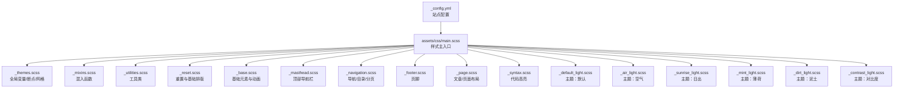
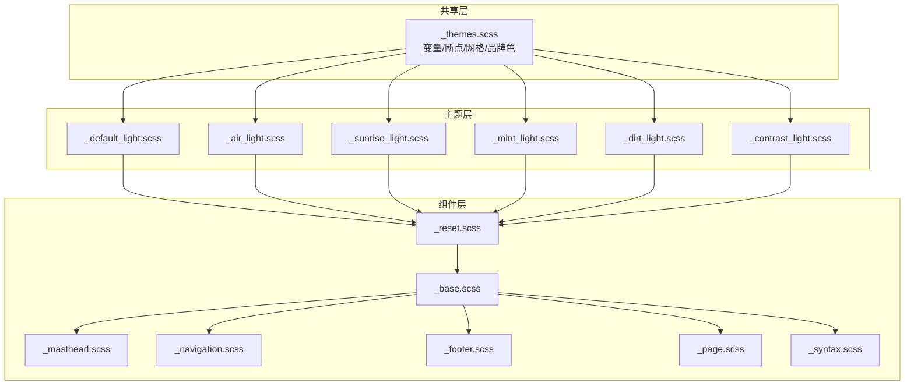
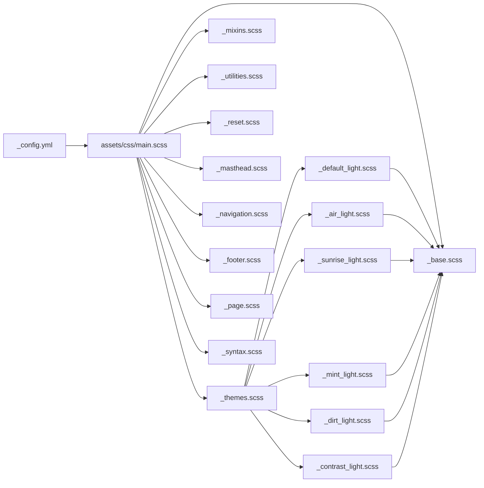

# 主题和样式系统

<cite>
**本文引用的文件**
- [_config.yml](file://_config.yml)
- [main.scss](file://assets/css/main.scss)
- [_themes.scss](file://_sass/_themes.scss)
- [_mixins.scss](file://_sass/include/_mixins.scss)
- [_utilities.scss](file://_sass/include/_utilities.scss)
- [_base.scss](file://_sass/layout/_base.scss)
- [_reset.scss](file://_sass/layout/_reset.scss)
- [_masthead.scss](file://_sass/layout/_masthead.scss)
- [_navigation.scss](file://_sass/layout/_navigation.scss)
- [_footer.scss](file://_sass/layout/_footer.scss)
- [_page.scss](file://_sass/layout/_page.scss)
- [_syntax.scss](file://_sass/_syntax.scss)
- [_default_light.scss](file://_sass/theme/_default_light.scss)
- [_air_light.scss](file://_sass/theme/_air_light.scss)
- [_sunrise_light.scss](file://_sass/theme/_sunrise_light.scss)
- [_mint_light.scss](file://_sass/theme/_mint_light.scss)
- [_dirt_light.scss](file://_sass/theme/_dirt_light.scss)
- [_contrast_light.scss](file://_sass/theme/_contrast_light.scss)
</cite>

## 目录
1. [简介](#简介)
2. [项目结构](#项目结构)
3. [核心组件](#核心组件)
4. [架构总览](#架构总览)
5. [详细组件分析](#详细组件分析)
6. [依赖关系分析](#依赖关系分析)
7. [性能考量](#性能考量)
8. [故障排查指南](#故障排查指南)
9. [结论](#结论)
10. [附录](#附录)

## 简介
本文件面向希望深度理解和定制 Academic Pages 主题与样式的开发者与设计师，系统性阐述主题变体体系、SCSS 架构、变量与混入、响应式断点、组件样式组织方式，以及从入门到进阶的主题定制与性能优化实践。读者可据此完成颜色方案、字体、间距等个性化配置，并掌握自定义主题开发与冲突排查的方法。

## 项目结构
Academic Pages 的样式系统以 Jekyll + SCSS 为核心，通过主入口样式文件按顺序导入主题、混入、重置、布局与语法高亮等模块，形成统一的样式构建流水线。主题变体由一组共享变量与各主题的根 CSS 变量覆盖共同决定，最终在页面中以 CSS 自定义属性的形式生效。

图表来源
- [_config.yml](file://_config.yml)
- [main.scss](file://assets/css/main.scss)
- [_themes.scss](file://_sass/_themes.scss)
- [_mixins.scss](file://_sass/include/_mixins.scss)
- [_utilities.scss](file://_sass/include/_utilities.scss)
- [_reset.scss](file://_sass/layout/_reset.scss)
- [_base.scss](file://_sass/layout/_base.scss)
- [_masthead.scss](file://_sass/layout/_masthead.scss)
- [_navigation.scss](file://_sass/layout/_navigation.scss)
- [_footer.scss](file://_sass/layout/_footer.scss)
- [_page.scss](file://_sass/layout/_page.scss)
- [_syntax.scss](file://_sass/_syntax.scss)
- [_default_light.scss](file://_sass/theme/_default_light.scss)
- [_air_light.scss](file://_sass/theme/_air_light.scss)
- [_sunrise_light.scss](file://_sass/theme/_sunrise_light.scss)
- [_mint_light.scss](file://_sass/theme/_mint_light.scss)
- [_dirt_light.scss](file://_sass/theme/_dirt_light.scss)
- [_contrast_light.scss](file://_sass/theme/_contrast_light.scss)

章节来源
- [_config.yml](file://_config.yml)
- [main.scss](file://assets/css/main.scss)

## 核心组件
- 全局主题配置与变体选择
  - 在站点配置中通过主题键选择主题变体，支持默认、空气、日出、薄荷、泥土、对比度六种。
- SCSS 主入口与导入顺序
  - 主入口负责按依赖顺序导入主题、混入、重置、布局与语法高亮等模块，保证变量先于使用、混入先于组件样式。
- 共享变量与断点
  - 定义字号、字体族、类型比例、断点、网格参数与品牌色等，为所有主题提供一致的基线。
- 混入与工具类
  - 提供通用混入（如清除浮动）、常用工具类（可见性、对齐、图标、模态框、脚注等），提升复用性与一致性。
- 基础与组件样式
  - 重置与基础排版、基础元素、页眉、导航、页脚、页面内容、代码高亮等，均以模块化 SCSS 组织，便于扩展与维护。

章节来源
- [_config.yml](file://_config.yml)
- [main.scss](file://assets/css/main.scss)
- [_themes.scss](file://_sass/_themes.scss)
- [_mixins.scss](file://_sass/include/_mixins.scss)
- [_utilities.scss](file://_sass/include/_utilities.scss)
- [_reset.scss](file://_sass/layout/_reset.scss)
- [_base.scss](file://_sass/layout/_base.scss)
- [_masthead.scss](file://_sass/layout/_masthead.scss)
- [_navigation.scss](file://_sass/layout/_navigation.scss)
- [_footer.scss](file://_sass/layout/_footer.scss)
- [_page.scss](file://_sass/layout/_page.scss)
- [_syntax.scss](file://_sass/_syntax.scss)

## 架构总览
Academic Pages 的样式系统采用“共享变量 + 主题覆盖 + 组件模块”的三层架构：
- 共享层：全局变量、断点、网格、品牌色等，集中于共享文件，确保跨主题一致性。
- 主题层：每种主题定义一组根 CSS 变量覆盖，映射到背景、文字、链接、边框、表格头等关键色彩。
- 组件层：基础元素、布局组件、导航、页脚、页面内容、代码高亮等，通过变量驱动颜色与尺寸，自动适配主题。

图表来源
- [_themes.scss](file://_sass/_themes.scss)
- [_default_light.scss](file://_sass/theme/_default_light.scss)
- [_air_light.scss](file://_sass/theme/_air_light.scss)
- [_sunrise_light.scss](file://_sass/theme/_sunrise_light.scss)
- [_mint_light.scss](file://_sass/theme/_mint_light.scss)
- [_dirt_light.scss](file://_sass/theme/_dirt_light.scss)
- [_contrast_light.scss](file://_sass/theme/_contrast_light.scss)
- [_reset.scss](file://_sass/layout/_reset.scss)
- [_base.scss](file://_sass/layout/_base.scss)
- [_masthead.scss](file://_sass/layout/_masthead.scss)
- [_navigation.scss](file://_sass/layout/_navigation.scss)
- [_footer.scss](file://_sass/layout/_footer.scss)
- [_page.scss](file://_sass/layout/_page.scss)
- [_syntax.scss](file://_sass/_syntax.scss)

## 详细组件分析

### 主题变体与使用方法
- 可用变体
  - 默认(default)、空气(air)、日出(sunrise)、薄荷(mint)、泥土(dirt)、对比度(contrast)。
- 配置入口
  - 在站点配置中设置主题键，即可切换当前主题变体。
- 主题加载机制
  - 主入口样式文件动态拼接当前主题的明暗版本文件名并导入，从而实现按需加载与主题切换。

章节来源
- [_config.yml](file://_config.yml)
- [main.scss](file://assets/css/main.scss)
- [_default_light.scss](file://_sass/theme/_default_light.scss)
- [_air_light.scss](file://_sass/theme/_air_light.scss)
- [_sunrise_light.scss](file://_sass/theme/_sunrise_light.scss)
- [_mint_light.scss](file://_sass/theme/_mint_light.scss)
- [_dirt_light.scss](file://_sass/theme/_dirt_light.scss)
- [_contrast_light.scss](file://_sass/theme/_contrast_light.scss)

### SCSS 架构与变量系统
- 全局变量
  - 字号与类型比例、字体族、段落缩进、断点、网格参数、品牌色等，统一管理，便于跨主题一致性。
- 断点与网格
  - 使用断点库与网格库，定义多级断点与流式网格，配合 Susy 实现灵活布局。
- 根 CSS 变量
  - 各主题通过根 CSS 变量集中声明颜色与尺寸，组件样式直接引用变量，实现主题切换的最小成本。

章节来源
- [_themes.scss](file://_sass/_themes.scss)
- [main.scss](file://assets/css/main.scss)

### 混入与工具类
- 混入
  - 提供通用函数与容器/清除浮动等混入，减少重复代码，提升可维护性。
- 工具类
  - 包含可见性、对齐、图片与图标、导航图标、粘性定位、模态框、脚注、必填项等实用类，覆盖常见 UI 场景。

章节来源
- [_mixins.scss](file://_sass/include/_mixins.scss)
- [_utilities.scss](file://_sass/include/_utilities.scss)

### 基础与组件样式
- 重置与基础排版
  - 统一盒模型、文本大小调整、HTML5 元素显示、链接焦点状态、图片与表单控件一致性等。
- 基础元素
  - 标题、段落、列表、引用、代码、水平分割线、SVG 等，统一风格与过渡动效。
- 页眉与导航
  - 固定顶部导航、面包屑、分页按钮、优先级导航、下拉菜单、目录等，兼顾可用性与美观。
- 页脚
  - 版权信息、社交图标、跟随链接等，适配不同主题的颜色覆盖。
- 页面内容
  - 文章标题、正文段落、块引用、标题下划线、社交分享、元信息、评论区、相关文章等。
- 代码高亮
  - 代码块容器、语言标识、Solarized 风格配色等，提升技术内容可读性。

章节来源
- [_reset.scss](file://_sass/layout/_reset.scss)
- [_base.scss](file://_sass/layout/_base.scss)
- [_masthead.scss](file://_sass/layout/_masthead.scss)
- [_navigation.scss](file://_sass/layout/_navigation.scss)
- [_footer.scss](file://_sass/layout/_footer.scss)
- [_page.scss](file://_sass/layout/_page.scss)
- [_syntax.scss](file://_sass/_syntax.scss)

### 主题定制指南
- 颜色方案调整
  - 在对应主题文件中修改根 CSS 变量，即可一键改变背景、文字、链接、边框、表格头等关键色彩。
- 字体配置
  - 通过全局变量调整正文字体、标题字体、说明文字字体，影响全站排版风格。
- 间距与圆角
  - 调整边距、内边距、圆角半径、阴影等变量，统一页面密度与层次感。
- 响应式断点
  - 修改断点阈值或新增断点，配合组件中的断点混入，实现更精细的移动端适配。
- 动画与过渡
  - 调整全局过渡时长与缓动，影响交互反馈的一致性与流畅度。

章节来源
- [_themes.scss](file://_sass/_themes.scss)
- [_default_light.scss](file://_sass/theme/_default_light.scss)
- [_air_light.scss](file://_sass/theme/_air_light.scss)
- [_sunrise_light.scss](file://_sass/theme/_sunrise_light.scss)
- [_mint_light.scss](file://_sass/theme/_mint_light.scss)
- [_dirt_light.scss](file://_sass/theme/_dirt_light.scss)
- [_contrast_light.scss](file://_sass/theme/_contrast_light.scss)

### CSS 编译流程与样式优化
- 编译流程
  - Jekyll 读取主入口样式文件，按导入顺序编译，输出压缩后的 CSS；同时启用 HTML 压缩插件，进一步减小体积。
- 优化技巧
  - 合理拆分模块，避免重复变量与规则；利用变量与混入减少冗余；在生产环境启用压缩输出；按需引入第三方图标库与断点/网格库，降低初始体积。
- 性能建议
  - 控制主题文件数量与复杂度；避免深层嵌套导致的选择器权重过高；优先使用变量而非硬编码值；在移动端优先考虑关键渲染路径。

章节来源
- [_config.yml](file://_config.yml)
- [main.scss](file://assets/css/main.scss)

### 自定义主题开发教程
- 步骤概览
  - 新建主题文件，定义根 CSS 变量覆盖；在主入口中添加导入；在站点配置中切换主题键；预览并微调细节。
- 进阶实践
  - 结合混入与工具类实现复杂视觉效果；在组件层增加条件样式而不破坏主题变量；测试多断点下的表现；关注无障碍与可访问性。

章节来源
- [main.scss](file://assets/css/main.scss)
- [_themes.scss](file://_sass/_themes.scss)
- [_mixins.scss](file://_sass/include/_mixins.scss)
- [_utilities.scss](file://_sass/include/_utilities.scss)

### 响应式设计最佳实践与移动端适配
- 断点策略
  - 使用共享断点与网格参数，结合组件内的断点混入，确保在不同设备上保持一致的布局节奏。
- 移动端优先
  - 在窄屏下优先保证内容可读性与交互可达性；减少不必要的阴影与渐变；控制图片与视频的最大宽度。
- 交互与可访问性
  - 为焦点状态提供清晰指示；为图标与按钮提供足够的点击区域；在打印样式中隐藏非必要元素。

章节来源
- [_themes.scss](file://_sass/_themes.scss)
- [_base.scss](file://_sass/layout/_base.scss)
- [_masthead.scss](file://_sass/layout/_masthead.scss)
- [_navigation.scss](file://_sass/layout/_navigation.scss)
- [_page.scss](file://_sass/layout/_page.scss)

### 样式冲突排查与解决
- 常见问题
  - 变量未定义或拼写错误导致回退为默认值；断点混入未正确包裹；第三方库样式覆盖组件样式。
- 排查方法
  - 检查变量导入顺序与作用域；确认断点库与网格库已正确引入；使用浏览器开发者工具检查最终计算样式。
- 解决建议
  - 将主题变量集中于共享文件；在组件层使用变量而非字面量；必要时使用更高特异性选择器或 !important（谨慎使用）。

章节来源
- [_themes.scss](file://_sass/_themes.scss)
- [_base.scss](file://_sass/layout/_base.scss)
- [_utilities.scss](file://_sass/include/_utilities.scss)

## 依赖关系分析
主入口样式文件定义了明确的导入顺序，确保变量先于使用、混入先于组件样式、主题覆盖最后生效。主题文件通过根 CSS 变量与共享变量耦合，组件样式依赖这些变量实现主题切换。

图表来源
- [_config.yml](file://_config.yml)
- [main.scss](file://assets/css/main.scss)
- [_themes.scss](file://_sass/_themes.scss)
- [_mixins.scss](file://_sass/include/_mixins.scss)
- [_utilities.scss](file://_sass/include/_utilities.scss)
- [_reset.scss](file://_sass/layout/_reset.scss)
- [_base.scss](file://_sass/layout/_base.scss)
- [_masthead.scss](file://_sass/layout/_masthead.scss)
- [_navigation.scss](file://_sass/layout/_navigation.scss)
- [_footer.scss](file://_sass/layout/_footer.scss)
- [_page.scss](file://_sass/layout/_page.scss)
- [_syntax.scss](file://_sass/_syntax.scss)
- [_default_light.scss](file://_sass/theme/_default_light.scss)
- [_air_light.scss](file://_sass/theme/_air_light.scss)
- [_sunrise_light.scss](file://_sass/theme/_sunrise_light.scss)
- [_mint_light.scss](file://_sass/theme/_mint_light.scss)
- [_dirt_light.scss](file://_sass/theme/_dirt_light.scss)
- [_contrast_light.scss](file://_sass/theme/_contrast_light.scss)

章节来源
- [main.scss](file://assets/css/main.scss)

## 性能考量
- 构建阶段
  - 启用压缩输出与 HTML 压缩插件，减少传输体积。
- 运行阶段
  - 使用变量与混入减少重复规则；避免过度嵌套导致选择器权重过高；在移动端优先保证关键渲染路径。
- 主题层面
  - 控制主题文件数量与复杂度；仅在需要时引入额外图标库；合理使用阴影与渐变，避免在低端设备上造成卡顿。

## 故障排查指南
- 症状：颜色未按主题变化
  - 检查主题文件是否被正确导入；确认根 CSS 变量覆盖是否生效；验证组件样式是否引用变量而非硬编码值。
- 症状：布局在小屏异常
  - 检查断点阈值与混入使用；确认网格参数与容器宽度；在开发者工具中模拟不同屏幕尺寸。
- 症状：第三方样式覆盖组件
  - 使用更高特异性选择器或在组件层增加条件样式；避免全局重置破坏组件结构。

章节来源
- [_themes.scss](file://_sass/_themes.scss)
- [_base.scss](file://_sass/layout/_base.scss)
- [_utilities.scss](file://_sass/include/_utilities.scss)

## 结论
Academic Pages 的样式系统以共享变量与根 CSS 变量为核心，辅以混入与工具类，实现了主题化、模块化与可扩展的样式架构。通过合理的变量管理、断点策略与组件组织，既能满足初学者快速定制的需求，也能支撑高级用户的深度扩展与性能优化。

## 附录
- 快速参考
  - 主题键：在站点配置中设置主题键，切换当前主题变体。
  - 主题文件：在主题目录中新增或修改对应主题文件，即可实现颜色与尺寸的定制。
  - 导入顺序：遵循主入口样式文件的导入顺序，确保变量与混入先于组件样式。
  - 响应式：使用共享断点与网格参数，结合组件断点混入，实现多端一致体验。