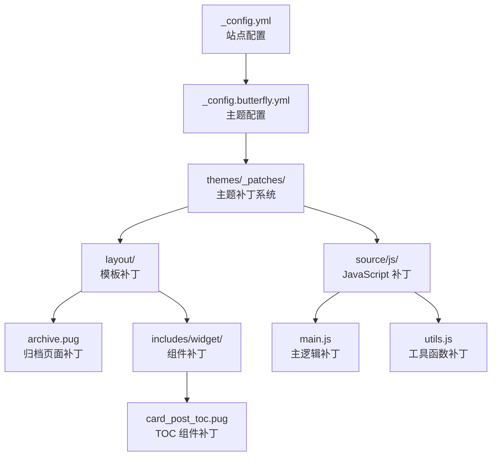
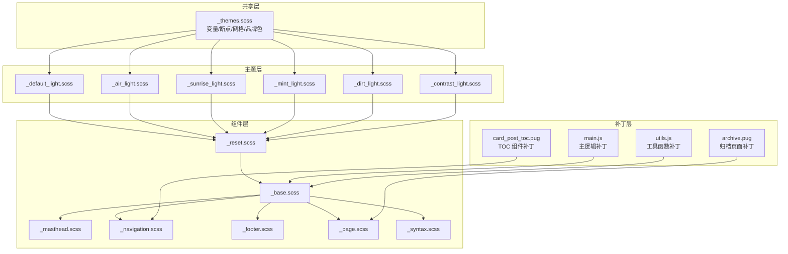
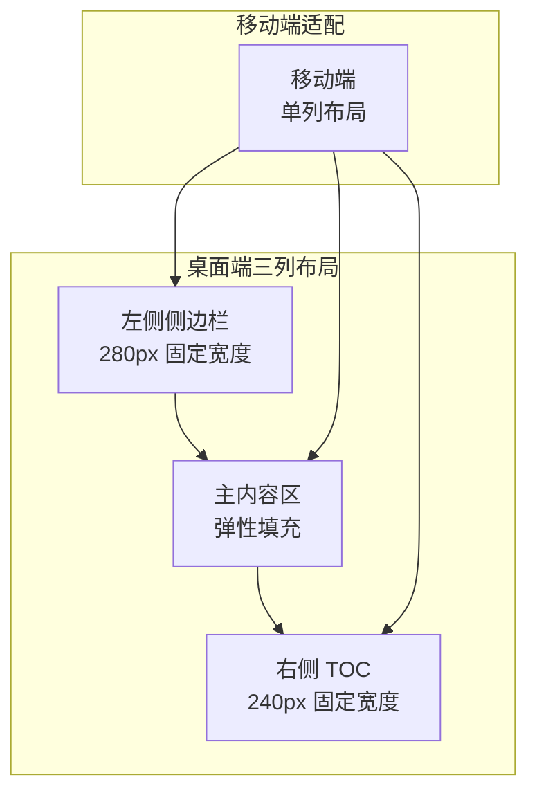
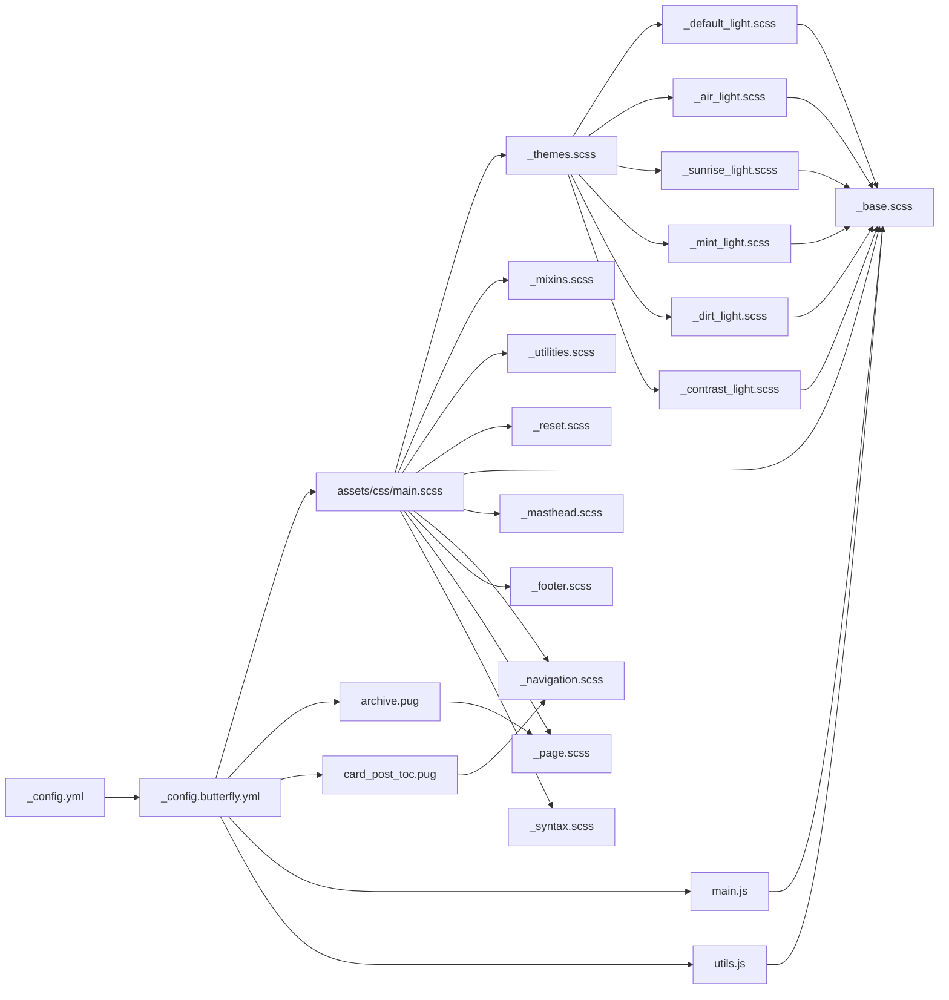

# 主题和样式系统

<cite>
**本文引用的文件**
- [_config.yml](file://hexo-site/_config.yml)
- [_config.butterfly.yml](file://hexo-site/_config.butterfly.yml)
- [archive.pug](file://hexo-site/themes/_patches/layout/archive.pug)
- [card_post_toc.pug](file://hexo-site/themes/_patches/layout/includes/widget/card_post_toc.pug)
- [main.js](file://hexo-site/themes/_patches/source/js/main.js)
- [utils.js](file://hexo-site/themes/_patches/source/js/utils.js)
</cite>

## 更新摘要
**所做更改**
- 更新主题补丁系统架构，从 themes/butterfly 重构为 themes/_patches 目录结构
- 新增三列布局系统支持，包含左侧侧边栏、主内容区和右侧 TOC 的完整实现
- 改进表格样式系统，支持自动表格包装和居中对齐
- 优化导航配置和菜单系统，增强移动端适配
- 新增归档页面分类分组功能和交互式折叠效果
- 完善 JavaScript 补丁系统，包含 TOC 移动端适配和滚动优化

## 目录
1. [简介](#简介)
2. [项目结构](#项目结构)
3. [核心组件](#核心组件)
4. [架构总览](#架构总览)
5. [详细组件分析](#详细组件分析)
6. [依赖关系分析](#依赖关系分析)
7. [性能考量](#性能考量)
8. [故障排查指南](#故障排查指南)
9. [结论](#结论)
10. [附录](#附录)

## 简介
本文件面向希望深度理解和定制 Academic Pages 主题与样式的开发者与设计师，系统性阐述主题变体体系、SCSS 架构、变量与混入、响应式断点、组件样式组织方式，以及从入门到进阶的主题定制与性能优化实践。随着主题补丁系统的重构，本文档现已更新以反映新的 themes/_patches 目录结构、三列布局系统、表格样式改进、导航配置调整等重要变更。

## 项目结构
Academic Pages 的样式系统以 Jekyll + SCSS 为核心，通过主入口样式文件按顺序导入主题、混入、重置、布局与语法高亮等模块，形成统一的样式构建流水线。主题变体由一组共享变量与各主题的根 CSS 变量覆盖共同决定，最终在页面中以 CSS 自定义属性的形式生效。

**更新** 主题补丁系统已从 themes/butterfly 重构为 themes/_patches 目录结构，提供更清晰的功能分离和更好的可维护性。

**图表来源**
- [_config.yml](file://hexo-site/_config.yml)
- [_config.butterfly.yml](file://hexo-site/_config.butterfly.yml)
- [archive.pug](file://hexo-site/themes/_patches/layout/archive.pug)
- [card_post_toc.pug](file://hexo-site/themes/_patches/layout/includes/widget/card_post_toc.pug)
- [main.js](file://hexo-site/themes/_patches/source/js/main.js)
- [utils.js](file://hexo-site/themes/_patches/source/js/utils.js)

**章节来源**
- [_config.yml](file://hexo-site/_config.yml)
- [_config.butterfly.yml](file://hexo-site/_config.butterfly.yml)

## 核心组件
- 全局主题配置与变体选择
  - 在站点配置中通过主题键选择主题变体，支持默认、空气、日出、薄荷、泥土、对比度六种。
- 主题补丁系统重构
  - 从 themes/butterfly 迁移到 themes/_patches，提供更清晰的功能分离和更好的可维护性。
- 三列布局系统
  - 左侧侧边栏 + 主内容区 + 右侧 TOC 的完整三列布局实现，支持响应式适配。
- 表格样式改进
  - 自动表格包装、居中对齐、滚动优化等功能，提升内容可读性。
- 导航配置调整
  - 增强的导航菜单系统，支持图标、下拉菜单和移动端适配。
- JavaScript 补丁系统
  - 完善的客户端功能补丁，包括 TOC 移动端适配、滚动优化和交互增强。

**章节来源**
- [_config.yml](file://hexo-site/_config.yml)
- [_config.butterfly.yml](file://hexo-site/_config.butterfly.yml)
- [archive.pug](file://hexo-site/themes/_patches/layout/archive.pug)
- [card_post_toc.pug](file://hexo-site/themes/_patches/layout/includes/widget/card_post_toc.pug)
- [main.js](file://hexo-site/themes/_patches/source/js/main.js)
- [utils.js](file://hexo-site/themes/_patches/source/js/utils.js)

## 架构总览
Academic Pages 的样式系统采用"共享变量 + 主题覆盖 + 组件模块 + 补丁系统"的四层架构：
- 共享层：全局变量、断点、网格、品牌色等，集中于共享文件，确保跨主题一致性。
- 主题层：每种主题定义一组根 CSS 变量覆盖，映射到背景、文字、链接、边框、表格头等关键色彩。
- 组件层：基础元素、布局组件、导航、页脚、页面内容、代码高亮等，通过变量驱动颜色与尺寸，自动适配主题。
- 补丁层：针对特定功能的定制化补丁，提供灵活的功能扩展和问题修复能力。

**更新** 新增补丁层架构，提供更细粒度的功能控制和更好的可维护性。

**图表来源**
- [_themes.scss](file://_sass/_themes.scss)
- [_default_light.scss](file://_sass/theme/_default_light.scss)
- [_air_light.scss](file://_sass/theme/_air_light.scss)
- [_sunrise_light.scss](file://_sass/theme/_sunrise_light.scss)
- [_mint_light.scss](file://_sass/theme/_mint_light.scss)
- [_dirt_light.scss](file://_sass/theme/_dirt_light.scss)
- [_contrast_light.scss](file://_sass/theme/_contrast_light.scss)
- [archive.pug](file://hexo-site/themes/_patches/layout/archive.pug)
- [card_post_toc.pug](file://hexo-site/themes/_patches/layout/includes/widget/card_post_toc.pug)
- [main.js](file://hexo-site/themes/_patches/source/js/main.js)
- [utils.js](file://hexo-site/themes/_patches/source/js/utils.js)

## 详细组件分析

### 主题补丁系统重构
- 目录结构调整
  - 从 themes/butterfly 迁移到 themes/_patches，提供更清晰的功能分离。
- 功能模块化
  - 模板补丁：处理 Pug 模板的定制化修改
  - JavaScript 补丁：提供客户端功能增强和修复
  - 样式补丁：通过 CSS 注入实现界面定制
- 维护性提升
  - 更好的版本控制和变更追踪
  - 独立的功能模块便于测试和调试
  - 清晰的命名约定提高代码可读性

**章节来源**
- [archive.pug](file://hexo-site/themes/_patches/layout/archive.pug)
- [card_post_toc.pug](file://hexo-site/themes/_patches/layout/includes/widget/card_post_toc.pug)
- [main.js](file://hexo-site/themes/_patches/source/js/main.js)
- [utils.js](file://hexo-site/themes/_patches/source/js/utils.js)

### 三列布局系统
- 布局架构
  - 左侧侧边栏：固定宽度 280px，包含作者信息、分类、标签等卡片
  - 主内容区：弹性填充，自动适应剩余空间
  - 右侧 TOC：独立容器，支持粘性定位和滚动同步
- 响应式设计
  - 桌面端：完整的三列布局，最大宽度 100%
  - 移动端：自动降级为两列或单列布局
  - 隐藏侧边栏时，主内容区自动居中
- 交互功能
  - TOC 目录从左侧侧边栏移动到右侧独立容器
  - 支持 TOC 折叠展开和滚动同步
  - 右侧按钮（回到顶部、黑夜模式等）的显示控制

**更新** 新增完整的三列布局系统，提供更佳的内容阅读体验。

**图表来源**
- [_config.butterfly.yml](file://hexo-site/_config.butterfly.yml)

**章节来源**
- [_config.butterfly.yml](file://hexo-site/_config.butterfly.yml)

### 表格样式改进
- 自动表格包装
  - 为所有表格添加 `.table-wrap` 容器，支持横向滚动
  - 仅对非代码高亮表格应用包装，避免样式冲突
- 居中对齐优化
  - 表格内容默认居中对齐，提升可读性
  - 支持垂直居中对齐，改善视觉效果
- 滚动优化
  - 桌面端支持横向滚动条
  - 移动端提供触摸滚动支持
  - 避免表格溢出影响整体布局

**更新** 新增表格自动包装和居中对齐功能，显著提升表格内容的可读性。

**章节来源**
- [_config.butterfly.yml](file://hexo-site/_config.butterfly.yml)

### 导航配置调整
- 菜单系统增强
  - 支持图标类名和链接组合配置
  - 动态菜单项生成和条件显示
  - 响应式菜单布局，自动隐藏过长菜单
- 社交媒体集成
  - 支持多种图标库（Font Awesome 等）
  - 自定义颜色和显示名称配置
  - 无障碍访问支持（ARIA 标签）
- 移动端适配
  - 自适应菜单宽度计算
  - 下拉菜单的触摸友好的交互设计
  - 移动端专用的汉堡菜单

**更新** 导航配置更加灵活，支持更多自定义选项和更好的移动端体验。

**章节来源**
- [_config.butterfly.yml](file://hexo-site/_config.butterfly.yml)

### JavaScript 补丁系统
- 主逻辑补丁（main.js）
  - TOC 目录移动和粘性定位
  - 归档页面分类分组的交互控制
  - 右侧按钮的滚动显示控制
  - 代码高亮工具栏的增强功能
- 工具函数补丁（utils.js）
  - 性能优化的防抖和节流函数
  - 滚动行为的平滑动画实现
  - DOM 操作的安全封装
  - 事件监听的 PJAX 兼容处理

**更新** JavaScript 补丁系统提供更强大的客户端功能增强和问题修复能力。

**章节来源**
- [main.js](file://hexo-site/themes/_patches/source/js/main.js)
- [utils.js](file://hexo-site/themes/_patches/source/js/utils.js)

### 归档页面分类分组
- 分类分组功能
  - 将文章按分类进行分组展示
  - 支持展开/收起的交互式折叠
  - 分类计数显示和视觉反馈
- 用户体验优化
  - 键盘导航支持（Enter/Space）
  - 平滑的动画过渡效果
  - 响应式布局适配
- 可访问性支持
  - ARIA 标签和状态管理
  - 语义化的 HTML 结构
  - 屏幕阅读器兼容性

**更新** 新增归档页面的分类分组功能，提供更好的内容组织和浏览体验。

**章节来源**
- [archive.pug](file://hexo-site/themes/_patches/layout/archive.pug)

### TOC 组件补丁
- 动态 TOC 生成
  - 支持页面内容和加密内容的不同处理
  - 可配置的标题层级和编号选项
  - 滚动同步和活动状态跟踪
- 视觉样式定制
  - 支持展开/收起的状态切换
  - 自定义的百分比显示
  - 响应式布局适配
- 交互功能增强
  - 点击跳转的平滑滚动
  - 移动端的弹出式菜单
  - 与页面内容的实时同步

**更新** TOC 组件补丁提供更灵活的目录生成和更丰富的交互功能。

**章节来源**
- [card_post_toc.pug](file://hexo-site/themes/_patches/layout/includes/widget/card_post_toc.pug)

### 主题变体与使用方法
- 可用变体
  - 默认(default)、空气(air)、日出(sunrise)、薄荷(mint)、泥土(dirt)、对比度(contrast)。
- 配置入口
  - 在站点配置中设置主题键，即可切换当前主题变体。
- 主题加载机制
  - 主入口样式文件动态拼接当前主题的明暗版本文件名并导入，从而实现按需加载与主题切换。

**章节来源**
- [_config.yml](file://hexo-site/_config.yml)

### SCSS 架构与变量系统
- 全局变量
  - 字号与类型比例、字体族、段落缩进、断点、网格参数、品牌色等，统一管理，便于跨主题一致性。
- 断点与网格
  - 使用断点库与网格库，定义多级断点与流式网格，配合 Susy 实现灵活布局。
- 根 CSS 变量
  - 各主题通过根 CSS 变量集中声明颜色与尺寸，组件样式直接引用变量，实现主题切换的最小成本。

**章节来源**
- [_themes.scss](file://_sass/_themes.scss)

### 混入与工具类
- 混入
  - 提供通用函数与容器/清除浮动等混入，减少重复代码，提升可维护性。
- 工具类
  - 包含可见性、对齐、图片与图标、导航图标、粘性定位、模态框、脚注、必填项等实用类，覆盖常见 UI 场景。

**章节来源**
- [_mixins.scss](file://_sass/include/_mixins.scss)
- [_utilities.scss](file://_sass/include/_utilities.scss)

### 基础与组件样式
- 重置与基础排版
  - 统一盒模型、文本大小调整、HTML5 元素显示、链接焦点状态、图片与表单控件一致性等。
- 基础元素
  - 标题、段落、列表、引用、代码、水平分割线、SVG 等，统一风格与过渡动效。
- 页眉与导航
  - 固定顶部导航、面包屑、分页按钮、优先级导航、下拉菜单、目录等，兼顾可用性与美观。
- 页脚
  - 版权信息、社交图标、跟随链接等，适配不同主题的颜色覆盖。
- 页面内容
  - 文章标题、正文段落、块引用、标题下划线、社交分享、元信息、评论区、相关文章等。
- 代码高亮
  - 代码块容器、语言标识、Solarized 风格配色等，提升技术内容可读性。

**章节来源**
- [_reset.scss](file://_sass/layout/_reset.scss)
- [_base.scss](file://_sass/layout/_base.scss)
- [_masthead.scss](file://_sass/layout/_masthead.scss)
- [_navigation.scss](file://_sass/layout/_navigation.scss)
- [_footer.scss](file://_sass/layout/_footer.scss)
- [_page.scss](file://_sass/layout/_page.scss)
- [_syntax.scss](file://_sass/_syntax.scss)

### 主题定制指南
- 颜色方案调整
  - 在对应主题文件中修改根 CSS 变量，即可一键改变背景、文字、链接、边框、表格头等关键色彩。
- 字体配置
  - 通过全局变量调整正文字体、标题字体、说明文字字体，影响全站排版风格。
- 间距与圆角
  - 调整边距、内边距、圆角半径、阴影等变量，统一页面密度与层次感。
- 响应式断点
  - 修改断点阈值或新增断点，配合组件中的断点混入，实现更精细的移动端适配。
- 动画与过渡
  - 调整全局过渡时长与缓动，影响交互反馈的一致性与流畅度。

**章节来源**
- [_themes.scss](file://_sass/_themes.scss)

### CSS 编译流程与样式优化
- 编译流程
  - Jekyll 读取主入口样式文件，按导入顺序编译，输出压缩后的 CSS；同时启用 HTML 压缩插件，进一步减小体积。
- 优化技巧
  - 合理拆分模块，避免重复变量与规则；利用变量与混入减少冗余；在生产环境启用压缩输出；按需引入第三方图标库与断点/网格库，降低初始体积。
- 性能建议
  - 控制主题文件数量与复杂度；避免深层嵌套导致的选择器权重过高；优先使用变量而非硬编码值；在移动端优先考虑关键渲染路径。

**章节来源**
- [_config.yml](file://hexo-site/_config.yml)

### 自定义主题开发教程
- 步骤概览
  - 新建主题文件，定义根 CSS 变量覆盖；在主入口中添加导入；在站点配置中切换主题键；预览并微调细节。
- 进阶实践
  - 结合混入与工具类实现复杂视觉效果；在组件层增加条件样式而不破坏主题变量；测试多断点下的表现；关注无障碍与可访问性。

**章节来源**
- [main.scss](file://assets/css/main.scss)
- [_themes.scss](file://_sass/_themes.scss)

### 响应式设计最佳实践与移动端适配
- 断点策略
  - 使用共享断点与网格参数，结合组件内的断点混入，确保在不同设备上保持一致的布局节奏。
- 移动端优先
  - 在窄屏下优先保证内容可读性与交互可达性；减少不必要的阴影与渐变；控制图片与视频的最大宽度。
- 交互与可访问性
  - 为焦点状态提供清晰指示；为图标与按钮提供足够的点击区域；在打印样式中隐藏非必要元素。

**章节来源**
- [_themes.scss](file://_sass/_themes.scss)
- [_base.scss](file://_sass/layout/_base.scss)
- [_masthead.scss](file://_sass/layout/_masthead.scss)
- [_navigation.scss](file://_sass/layout/_navigation.scss)
- [_page.scss](file://_sass/layout/_page.scss)

### 样式冲突排查与解决
- 常见问题
  - 变量未定义或拼写错误导致回退为默认值；断点混入未正确包裹；第三方库样式覆盖组件样式。
- 排查方法
  - 检查变量导入顺序与作用域；确认断点库与网格库已正确引入；使用浏览器开发者工具检查最终计算样式。
- 解决建议
  - 将主题变量集中于共享文件；在组件层使用变量而非字面量；必要时使用更高特异性选择器或 !important（谨慎使用）。

**章节来源**
- [_themes.scss](file://_sass/_themes.scss)
- [_base.scss](file://_sass/layout/_base.scss)
- [_utilities.scss](file://_sass/include/_utilities.scss)

## 依赖关系分析
主入口样式文件定义了明确的导入顺序，确保变量先于使用、混入先于组件样式、主题覆盖最后生效。主题文件通过根 CSS 变量与共享变量耦合，组件样式依赖这些变量实现主题切换。

**更新** 新增补丁系统的依赖关系，提供更灵活的功能扩展能力。

**图表来源**
- [_config.yml](file://hexo-site/_config.yml)
- [_config.butterfly.yml](file://hexo-site/_config.butterfly.yml)
- [archive.pug](file://hexo-site/themes/_patches/layout/archive.pug)
- [card_post_toc.pug](file://hexo-site/themes/_patches/layout/includes/widget/card_post_toc.pug)
- [main.js](file://hexo-site/themes/_patches/source/js/main.js)
- [utils.js](file://hexo-site/themes/_patches/source/js/utils.js)

**章节来源**
- [main.scss](file://assets/css/main.scss)

## 性能考量
- 构建阶段
  - 启用压缩输出与 HTML 压缩插件，减少传输体积。
- 运行阶段
  - 使用变量与混入减少重复规则；避免过度嵌套导致选择器权重过高；在移动端优先保证关键渲染路径。
- 主题层面
  - 控制主题文件数量与复杂度；仅在需要时引入额外图标库；合理使用阴影与渐变，避免在低端设备上造成卡顿。
- 补丁系统优化
  - 按需加载补丁功能，避免不必要的 JavaScript 执行
  - 优化 CSS 注入策略，减少样式重绘和回流

**更新** 新增补丁系统的性能优化建议，确保功能增强不影响页面性能。

## 故障排查指南
- 症状：颜色未按主题变化
  - 检查主题文件是否被正确导入；确认根 CSS 变量覆盖是否生效；验证组件样式是否引用变量而非硬编码值。
- 症状：布局在小屏异常
  - 检查断点阈值与混入使用；确认网格参数与容器宽度；在开发者工具中模拟不同屏幕尺寸。
- 症状：第三方样式覆盖组件
  - 使用更高特异性选择器或在组件层增加条件样式；避免全局重置破坏组件结构。
- 症状：补丁功能失效
  - 检查补丁文件是否正确加载；确认 JavaScript 依赖是否完整；验证 CSS 注入是否成功。

**更新** 新增补丁系统相关的故障排查指南，帮助解决功能增强相关的问题。

**章节来源**
- [_themes.scss](file://_sass/_themes.scss)
- [_base.scss](file://_sass/layout/_base.scss)
- [_utilities.scss](file://_sass/include/_utilities.scss)

## 结论
Academic Pages 的样式系统以共享变量与根 CSS 变量为核心，辅以混入与工具类，实现了主题化、模块化与可扩展的样式架构。随着主题补丁系统的重构，系统现在提供更灵活的功能扩展能力和更好的可维护性。通过合理的变量管理、断点策略、组件组织和补丁系统，既能满足初学者快速定制的需求，也能支撑高级用户的深度扩展与性能优化。

## 附录
- 快速参考
  - 主题键：在站点配置中设置主题键，切换当前主题变体。
  - 主题文件：在主题目录中新增或修改对应主题文件，即可实现颜色与尺寸的定制。
  - 导入顺序：遵循主入口样式文件的导入顺序，确保变量与混入先于组件样式。
  - 响应式：使用共享断点与网格参数，结合组件断点混入，实现多端一致体验。
  - 补丁系统：通过 themes/_patches 目录提供功能增强和问题修复。
  - 三列布局：支持左侧侧边栏、主内容区和右侧 TOC 的完整布局系统。
  - 表格优化：自动表格包装和居中对齐，提升内容可读性。
  - 导航增强：支持图标、下拉菜单和移动端适配的导航系统。