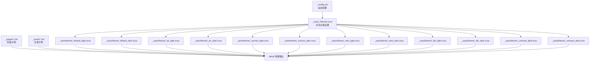
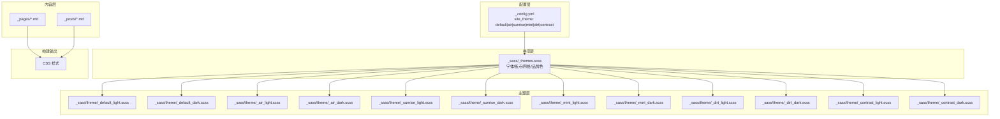
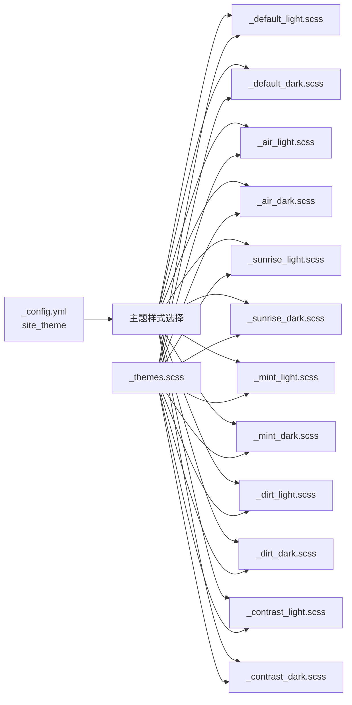

# 主题系统概览

<cite>
**本文引用的文件**
- [_config.yml](file://_config.yml)
- [_sass/_themes.scss](file://_sass/_themes.scss)
- [_sass/theme/_default_light.scss](file://_sass/theme/_default_light.scss)
- [_sass/theme/_default_dark.scss](file://_sass/theme/_default_dark.scss)
- [_sass/theme/_air_light.scss](file://_sass/theme/_air_light.scss)
- [_sass/theme/_air_dark.scss](file://_sass/theme/_air_dark.scss)
- [_sass/theme/_sunrise_light.scss](file://_sass/theme/_sunrise_light.scss)
- [_sass/theme/_sunrise_dark.scss](file://_sass/theme/_sunrise_dark.scss)
- [_sass/theme/_mint_light.scss](file://_sass/theme/_mint_light.scss)
- [_sass/theme/_mint_dark.scss](file://_sass/theme/_mint_dark.scss)
- [_sass/theme/_dirt_light.scss](file://_sass/theme/_dirt_light.scss)
- [_sass/theme/_dirt_dark.scss](file://_sass/theme/_dirt_dark.scss)
- [_sass/theme/_contrast_light.scss](file://_sass/theme/_contrast_light.scss)
- [_sass/theme/_contrast_dark.scss](file://_sass/theme/_contrast_dark.scss)
- [_pages/about.md](file://_pages/about.md)
- [_posts/2025-03-11-my-first-blog.md](file://_posts/2025-03-11-my-first-blog.md)
</cite>

## 目录
1. [简介](#简介)
2. [项目结构](#项目结构)
3. [核心组件](#核心组件)
4. [架构总览](#架构总览)
5. [详细组件分析](#详细组件分析)
6. [依赖关系分析](#依赖关系分析)
7. [性能考量](#性能考量)
8. [故障排查指南](#故障排查指南)
9. [结论](#结论)
10. [附录](#附录)

## 简介
本文件为 Academic Pages 主题系统的概览与使用指南，覆盖以下内容：
- 六种主题变体（默认、空气、日出、薄荷、泥土、对比度）的基本特点与适用场景
- 在 _config.yml 中的主题参数配置方法
- 各主题的视觉特征、颜色搭配与设计风格
- 主题切换的操作步骤与注意事项
- 主题继承机制与共享设置
- 主题预览截图与对比表格
- 主题定制的基础概念与准备工作

## 项目结构
Academic Pages 的主题系统以 SCSS 分层组织，核心主题变量与共享设置位于 _sass 目录，各主题的明暗两套样式分别独立维护，最终通过构建流程注入到站点中。

图示来源
- [_config.yml](file://_config.yml)
- [_sass/_themes.scss](file://_sass/_themes.scss)
- [_sass/theme/_default_light.scss](file://_sass/theme/_default_light.scss)
- [_sass/theme/_default_dark.scss](file://_sass/theme/_default_dark.scss)
- [_sass/theme/_air_light.scss](file://_sass/theme/_air_light.scss)
- [_sass/theme/_air_dark.scss](file://_sass/theme/_air_dark.scss)
- [_sass/theme/_sunrise_light.scss](file://_sass/theme/_sunrise_light.scss)
- [_sass/theme/_sunrise_dark.scss](file://_sass/theme/_sunrise_dark.scss)
- [_sass/theme/_mint_light.scss](file://_sass/theme/_mint_light.scss)
- [_sass/theme/_mint_dark.scss](file://_sass/theme/_mint_dark.scss)
- [_sass/theme/_dirt_light.scss](file://_sass/theme/_dirt_light.scss)
- [_sass/theme/_dirt_dark.scss](file://_sass/theme/_dirt_dark.scss)
- [_sass/theme/_contrast_light.scss](file://_sass/theme/_contrast_light.scss)
- [_sass/theme/_contrast_dark.scss](file://_sass/theme/_contrast_dark.scss)
- [_pages/about.md](file://_pages/about.md)
- [_posts/2025-03-11-my-first-blog.md](file://_posts/2025-03-11-my-first-blog.md)

章节来源
- [_config.yml](file://_config.yml)
- [_sass/_themes.scss](file://_sass/_themes.scss)

## 核心组件
- 主题参数入口：站点配置文件中的主题键位，决定当前使用的主题名称。
- 共享设置：字体、断点、网格、品牌色等全局主题常量。
- 明/暗主题：每个主题均提供 light/dark 两套样式文件，通过 CSS 自定义属性统一管理颜色与交互。
- 页面与文章：示例页面与文章展示了主题在实际内容中的呈现效果。

章节来源
- [_config.yml](file://_config.yml)
- [_sass/_themes.scss](file://_sass/_themes.scss)
- [_pages/about.md](file://_pages/about.md)
- [_posts/2025-03-11-my-first-blog.md](file://_posts/2025-03-11-my-first-blog.md)

## 架构总览
Academic Pages 的主题系统采用“共享设置 + 多主题变体”的分层架构。共享设置集中于 _sass/_themes.scss，各主题的明/暗样式文件各自定义主题专属的颜色与布局细节；Jekyll 构建时按主题参数加载对应样式，最终生成统一的 CSS 输出。

图示来源
- [_config.yml](file://_config.yml)
- [_sass/_themes.scss](file://_sass/_themes.scss)
- [_sass/theme/_default_light.scss](file://_sass/theme/_default_light.scss)
- [_sass/theme/_default_dark.scss](file://_sass/theme/_default_dark.scss)
- [_sass/theme/_air_light.scss](file://_sass/theme/_air_light.scss)
- [_sass/theme/_air_dark.scss](file://_sass/theme/_air_dark.scss)
- [_sass/theme/_sunrise_light.scss](file://_sass/theme/_sunrise_light.scss)
- [_sass/theme/_sunrise_dark.scss](file://_sass/theme/_sunrise_dark.scss)
- [_sass/theme/_mint_light.scss](file://_sass/theme/_mint_light.scss)
- [_sass/theme/_mint_dark.scss](file://_sass/theme/_mint_dark.scss)
- [_sass/theme/_dirt_light.scss](file://_sass/theme/_dirt_light.scss)
- [_sass/theme/_dirt_dark.scss](file://_sass/theme/_dirt_dark.scss)
- [_sass/theme/_contrast_light.scss](file://_sass/theme/_contrast_light.scss)
- [_sass/theme/_contrast_dark.scss](file://_sass/theme/_contrast_dark.scss)
- [_pages/about.md](file://_pages/about.md)
- [_posts/2025-03-11-my-first-blog.md](file://_posts/2025-03-11-my-first-blog.md)

## 详细组件分析

### 主题选择与配置
- 配置位置：站点根目录配置文件中存在主题键位，可直接修改为任一可用主题名称。
- 可用主题：默认、空气、日出、薄荷、泥土、对比度。
- 影响范围：该键值决定构建时加载的样式文件集合，从而影响整体视觉风格与交互细节。

章节来源
- [_config.yml](file://_config.yml)

### 默认主题（Default）
- 视觉特征：以蓝灰为主色调，强调信息与通知类色彩，界面简洁、层次清晰。
- 明/暗模式：明版背景偏白，暗版背景为中性灰，链接与主色在深浅模式下有协调过渡。
- 适用场景：通用学术/技术展示，追求稳定与可读性的内容。

章节来源
- [_sass/theme/_default_light.scss](file://_sass/theme/_default_light.scss)
- [_sass/theme/_default_dark.scss](file://_sass/theme/_default_dark.scss)

### 空气主题（Air）
- 视觉特征：以水蓝色为主，强调通透与轻盈感，边框与页脚采用主色点缀。
- 明/暗模式：明版背景为浅灰，暗版背景为深灰，主色在深浅模式下保持一致的高辨识度。
- 适用场景：希望营造轻松、现代感的个人主页或作品集。

章节来源
- [_sass/theme/_air_light.scss](file://_sass/theme/_air_light.scss)
- [_sass/theme/_air_dark.scss](file://_sass/theme/_air_dark.scss)

### 日出主题（Sunrise）
- 视觉特征：以暖红色为主，背景为米色系，页脚采用明亮橙色，整体温暖而富有活力。
- 明/暗模式：明版强调暖色对比，暗版采用深棕红底与亮色文字，突出层次。
- 适用场景：需要突出个性与活力的展示型页面，适合创意类内容。

章节来源
- [_sass/theme/_sunrise_light.scss](file://_sass/theme/_sunrise_light.scss)
- [_sass/theme/_sunrise_dark.scss](file://_sass/theme/_sunrise_dark.scss)

### 薄荷主题（Mint）
- 视觉特征：以薄荷绿为主，背景柔和，页脚采用亮绿色，整体清新自然。
- 明/暗模式：明版偏浅绿背景，暗版采用深绿底与高对比文字，强调可读性。
- 适用场景：追求自然、清新的科技/学术展示，适合长期阅读的内容。

章节来源
- [_sass/theme/_mint_light.scss](file://_sass/theme/_mint_light.scss)
- [_sass/theme/_mint_dark.scss](file://_sass/theme/_mint_dark.scss)

### 泥土主题（Dirt）
- 视觉特征：以深灰/土黄为主，背景为米白，页脚采用暖色，整体沉稳内敛。
- 明/暗模式：明版强调暖色边框与页脚，暗版采用深棕灰底与暖色点缀，突出质感。
- 适用场景：偏成熟、内敛的学术/作品集展示，强调质感与稳重。

章节来源
- [_sass/theme/_dirt_light.scss](file://_sass/theme/_dirt_light.scss)
- [_sass/theme/_dirt_dark.scss](file://_sass/theme/_dirt_dark.scss)

### 对比度主题（Contrast）
- 视觉特征：高对比设计，强调黑白与强色边界，页脚与边框采用高对比色。
- 明/暗模式：明版强调黑/白/蓝的高对比，暗版采用黑底与高亮色文本，提升可读性。
- 适用场景：对可访问性要求较高或偏好极简高对比风格的用户。

章节来源
- [_sass/theme/_contrast_light.scss](file://_sass/theme/_contrast_light.scss)
- [_sass/theme/_contrast_dark.scss](file://_sass/theme/_contrast_dark.scss)

### 主题继承与共享设置
- 共享设置：字体、断点、网格、品牌色等在共享文件中统一定义，确保各主题在排版与响应式行为上的一致性。
- 继承机制：各主题的明/暗样式文件复用共享设置，仅覆盖自身主题色与局部细节，降低重复与维护成本。

章节来源
- [_sass/_themes.scss](file://_sass/_themes.scss)

### 主题切换操作步骤与注意事项
- 步骤
  1) 打开站点配置文件，定位主题键位。
  2) 将主题值修改为任一可用主题名称（默认/空气/日出/薄荷/泥土/对比度）。
  3) 保存文件并重新构建站点（本地开发或 CI 触发）。
  4) 访问站点验证主题效果，必要时调整相关页面 Front Matter 或局部样式。
- 注意事项
  - 修改主题键位后需完整重建，避免缓存导致的样式未更新。
  - 若自定义了页面样式或覆盖了主题变量，建议在切换前后进行一致性检查。
  - 不同主题的可访问性与对比度差异较大，建议根据目标受众选择合适主题。

章节来源
- [_config.yml](file://_config.yml)

### 主题预览与对比（文字化描述）
- 颜色与风格概览
  - 默认：蓝灰主调，信息/警告/成功/危险色明确，适合通用学术展示。
  - 空气：水蓝通透，边框与页脚主色点缀，适合现代/轻松风格。
  - 日出：暖红米色背景，页脚亮橙，适合活力/创意展示。
  - 薄荷：薄荷绿背景，页脚亮绿，适合清新/自然风格。
  - 泥土：深灰/土黄，沉稳内敛，适合成熟/质感展示。
  - 对比度：高对比黑/白/蓝，强调边界与可读性，适合高可访问性需求。
- 建议
  - 优先选择与内容气质相符的主题，再考虑可访问性与对比度。
  - 可在本地多主题对比后再做最终决策。

### 主题定制基础概念与准备
- 定制方向
  - 局部微调：在不改变主题结构的前提下，通过覆盖变量或添加局部样式实现微调。
  - 主题扩展：在现有主题基础上新增一套明/暗样式，保持与共享设置的兼容。
- 准备工作
  - 熟悉共享设置与主题变量命名规范，避免冲突。
  - 使用浏览器开发者工具观察 CSS 自定义属性生效情况，便于快速定位问题。
  - 保留原主题文件，以便回滚与版本对比。

## 依赖关系分析
主题系统内部依赖关系如下：
- 配置文件决定加载哪一组主题样式。
- 共享设置被所有主题样式复用，形成统一的排版与交互基线。
- 各主题明/暗样式相互独立，互不影响，便于按需启用。

图示来源
- [_config.yml](file://_config.yml)
- [_sass/_themes.scss](file://_sass/_themes.scss)
- [_sass/theme/_default_light.scss](file://_sass/theme/_default_light.scss)
- [_sass/theme/_default_dark.scss](file://_sass/theme/_default_dark.scss)
- [_sass/theme/_air_light.scss](file://_sass/theme/_air_light.scss)
- [_sass/theme/_air_dark.scss](file://_sass/theme/_air_dark.scss)
- [_sass/theme/_sunrise_light.scss](file://_sass/theme/_sunrise_light.scss)
- [_sass/theme/_sunrise_dark.scss](file://_sass/theme/_sunrise_dark.scss)
- [_sass/theme/_mint_light.scss](file://_sass/theme/_mint_light.scss)
- [_sass/theme/_mint_dark.scss](file://_sass/theme/_mint_dark.scss)
- [_sass/theme/_dirt_light.scss](file://_sass/theme/_dirt_light.scss)
- [_sass/theme/_dirt_dark.scss](file://_sass/theme/_dirt_dark.scss)
- [_sass/theme/_contrast_light.scss](file://_sass/theme/_contrast_light.scss)
- [_sass/theme/_contrast_dark.scss](file://_sass/theme/_contrast_dark.scss)

## 性能考量
- 样式体积控制：各主题样式文件相对独立，按需加载可减少冗余。
- 构建优化：开启压缩输出，避免不必要的重复变量与规则。
- 可访问性：高对比度主题在暗色模式下仍保持良好可读性，有助于提升用户体验。

## 故障排查指南
- 症状：切换主题后样式未更新
  - 排查：确认已重新构建站点；检查配置文件键位是否正确；清理浏览器缓存。
- 症状：某些页面颜色异常
  - 排查：检查页面 Front Matter 是否覆盖了主题变量；核对局部样式是否与主题冲突。
- 症状：暗色模式下可读性差
  - 排查：尝试切换至对比度主题；调整浏览器缩放与显示器色温；必要时微调主题变量。

章节来源
- [_config.yml](file://_config.yml)

## 结论
Academic Pages 的主题系统通过“共享设置 + 多主题变体”的架构实现了高度可定制与低维护成本的设计。用户可根据内容气质与可访问性需求选择合适的主题，并通过局部微调与主题扩展进一步完善视觉表达。建议在本地多主题对比后再做最终决策，并在切换前后进行一致性检查以确保最佳体验。

## 附录
- 示例页面与文章展示了主题在实际内容中的呈现效果，可作为主题选择的参考依据。
- 如需进一步定制，建议从共享设置入手，逐步细化到主题级变量与局部样式。

章节来源
- [_pages/about.md](file://_pages/about.md)
- [_posts/2025-03-11-my-first-blog.md](file://_posts/2025-03-11-my-first-blog.md)