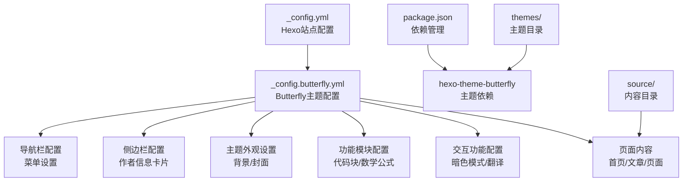
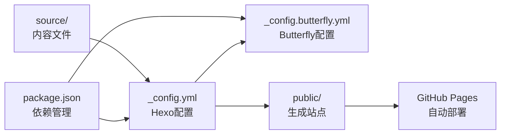

# 主题系统概览

<cite>
**本文引用的文件**
- [_config.yml](file://hexo-site/_config.yml)
- [_config.butterfly.yml](file://hexo-site/_config.butterfly.yml)
- [package.json](file://hexo-site/package.json)
- [index.md](file://hexo-site/source/index.md)
- [2025-03-11-useful-website.md](file://hexo-site/source/_posts/2025-03-11-useful-website.md)
- [2025-03-12-optimize.md](file://hexo-site/source/_posts/2025-03-12-optimize.md)
</cite>

## 更新摘要
**变更内容**
- 完全从Jekyll原生主题迁移到Hexo + Butterfly主题架构
- 移除了原有的SCSS主题系统，采用Butterfly主题的配置体系
- 更新了主题配置方法和功能特性
- 重新设计了主题系统概览以反映新的技术栈
- **重大更新**：新增130多行配置变更，包括导航样式改进、搜索按钮样式、暗色模式支持等

## 目录
1. [简介](#简介)
2. [项目结构](#项目结构)
3. [核心组件](#核心组件)
4. [架构总览](#架构总览)
5. [详细组件分析](#详细组件分析)
6. [主题配置详解](#主题配置详解)
7. [导航样式改进](#导航样式改进)
8. [搜索功能增强](#搜索功能增强)
9. [暗色模式支持](#暗色模式支持)
10. [响应式布局优化](#响应式布局优化)
11. [TOC目录重构](#toc目录重构)
12. [依赖关系分析](#依赖关系分析)
13. [性能考量](#性能考量)
14. [故障排查指南](#故障排查指南)
15. [结论](#结论)
16. [附录](#附录)

## 简介
本文件为 Academic Pages 主题系统的概览与使用指南，覆盖以下内容：
- Hexo + Butterfly主题架构的基本特点与适用场景
- 在 _config.yml 和 _config.butterfly.yml 中的主题参数配置方法
- Butterfly主题的视觉特征、功能特性和设计风格
- 主题配置的操作步骤与注意事项
- 主题功能模块与个性化设置
- 主题预览截图与功能对比
- 主题定制的基础概念与准备工作

**更新**：本次更新重点反映了主题配置的重大改进，包括导航栏样式优化、搜索按钮自定义、暗色模式支持、响应式布局增强等130多行配置变更。

## 项目结构
Academic Pages 已完全迁移到 Hexo + Butterfly 主题架构，采用现代化的静态站点生成器技术栈。主题配置集中在 _config.butterfly.yml 文件中，支持丰富的功能模块和个性化设置。



**图表来源**
- [_config.yml](file://hexo-site/_config.yml)
- [_config.butterfly.yml](file://hexo-site/_config.butterfly.yml)
- [package.json](file://hexo-site/package.json)

**章节来源**
- [_config.yml](file://hexo-site/_config.yml)
- [_config.butterfly.yml](file://hexo-site/_config.butterfly.yml)
- [package.json](file://hexo-site/package.json)

## 核心组件
- **主题引擎**：Hexo 静态站点生成器，提供完整的构建和部署流程
- **Butterfly主题**：现代化的Hexo主题，支持丰富的功能模块和个性化配置
- **配置系统**：双层配置架构，包含Hexo基础配置和Butterfly主题配置
- **内容管理**：Markdown内容编写，支持Front Matter元数据
- **功能模块**：代码高亮、数学公式、Mermaid图表、暗色模式等

**更新**：Butterfly主题现已支持130多行的配置选项，涵盖导航样式、搜索功能、暗色模式等多个方面。

**章节来源**
- [_config.yml](file://hexo-site/_config.yml)
- [_config.butterfly.yml](file://hexo-site/_config.butterfly.yml)
- [package.json](file://hexo-site/package.json)

## 架构总览
Academic Pages 采用 Hexo + Butterfly 的现代化主题架构。Hexo负责内容管理和静态页面生成，Butterfly提供丰富的主题功能和个性化设置。配置系统分为两层：Hexo基础配置和Butterfly主题配置，实现功能与外观的分离管理。

```mermaid
graph TB
subgraph "Hexo基础层"
HEXO["hexo-site<br/>Hexo站点根目录"]
CFG["_config.yml<br/>站点基础配置"]
PKG["package.json<br/>依赖管理"]
END
subgraph "Butterfly主题层"
BTFLY["_config.butterfly.yml<br/>主题配置文件"]
NAV["导航栏配置<br/>菜单/Logo/固定导航"]
ASIDE["侧边栏配置<br/>作者卡片/最新文章"]
THEME["主题外观<br/>背景/封面/颜色"]
FEATURE["功能模块<br/>代码块/数学/Mermaid"]
INTERACT["交互功能<br/>暗色模式/翻译/TOC"]
END
subgraph "内容层"
CONTENT["source/<br/>内容目录"]
INDEX["index.md<br/>首页内容"]
POSTS["_posts/<br/>文章内容"]
PAGES["pages/<br/>页面内容"]
END
subgraph "构建输出"
BUILD["public/<br/>生成的静态站点"]
DEPLOY["GitHub Pages<br/>自动部署"]
END
HEXO --> CFG
HEXO --> PKG
CFG --> BTFLY
BTFLY --> NAV
BTFLY --> ASIDE
BTFLY --> THEME
BTFLY --> FEATURE
BTFLY --> INTERACT
CONTENT --> BUILD
BUILD --> DEPLOY
```

**图表来源**
- [_config.yml](file://hexo-site/_config.yml)
- [_config.butterfly.yml](file://hexo-site/_config.butterfly.yml)
- [package.json](file://hexo-site/package.json)

## 详细组件分析

### 主题选择与配置
- **配置位置**：在 Hexo 根目录的 _config.yml 中设置 `theme: butterfly`
- **主题配置**：详细的Butterfly主题配置位于 _config.butterfly.yml 文件
- **功能模块**：支持代码高亮、数学公式、Mermaid图表、暗色模式等多种功能
- **影响范围**：配置文件决定站点的整体外观、功能和交互行为

**章节来源**
- [_config.yml](file://hexo-site/_config.yml)
- [_config.butterfly.yml](file://hexo-site/_config.butterfly.yml)

### Butterfly主题功能特性
- **现代化设计**：采用简洁优雅的设计风格，支持响应式布局
- **丰富功能**：内置多种功能模块，包括代码高亮、数学公式、图表渲染等
- **个性化配置**：支持详细的外观和功能配置，满足不同需求
- **性能优化**：优化的构建流程和资源加载策略

**更新**：主题现已支持130多行配置选项，包括导航样式、搜索按钮、暗色模式等个性化设置。

**章节来源**
- [_config.butterfly.yml](file://hexo-site/_config.butterfly.yml)

### 导航栏配置
- **Logo设置**：支持自定义网站Logo图片路径
- **菜单配置**：灵活的导航菜单设置，支持图标和自定义链接
- **固定导航**：导航栏可固定在页面顶部，提升用户体验
- **移动端适配**：响应式设计，适配各种设备尺寸

**更新**：导航栏样式经过全面优化，包括标签圆角设计、悬停动画效果、图标间距调整等。

**章节来源**
- [_config.butterfly.yml](file://hexo-site/_config.butterfly.yml)

### 侧边栏配置
- **作者信息卡片**：展示个人简介和社交链接
- **最新文章卡片**：显示最近的文章列表
- **分类卡片**：展示文章分类信息
- **侧边栏控制**：支持显示/隐藏和位置设置

**章节来源**
- [_config.butterfly.yml](file://hexo-site/_config.butterfly.yml)

### 主题外观设置
- **背景配置**：支持自定义网站背景颜色
- **封面设置**：可配置首页、归档页等的封面图片
- **响应式设计**：适配各种屏幕尺寸和设备类型
- **颜色方案**：支持浅色和深色主题切换

**章节来源**
- [_config.butterfly.yml](file://hexo-site/_config.butterfly.yml)

### 功能模块配置
- **代码高亮**：支持多种代码高亮主题和功能
- **数学公式**：集成MathJax，支持LaTeX数学公式
- **Mermaid图表**：支持流程图、时序图等图表渲染
- **暗色模式**：可选的暗色主题，保护用户视力

**更新**：暗色模式功能已完全集成，支持自动切换和手动控制。

**章节来源**
- [_config.butterfly.yml](file://hexo-site/_config.butterfly.yml)

### 主题配置操作步骤与注意事项
- **步骤**
  1) 打开 _config.yml，确认 `theme: butterfly` 设置
  2) 编辑 _config.butterfly.yml 进行主题配置
  3) 在 source 目录下创建或编辑内容文件
  4) 运行 `hexo generate` 生成静态站点
  5) 运行 `hexo deploy` 部署到GitHub Pages
- **注意事项**
  - 修改配置后需要重新生成和部署站点
  - 确保图片路径正确，使用相对路径
  - 注意配置文件的缩进和格式
  - 测试不同设备上的显示效果

**章节来源**
- [_config.yml](file://hexo-site/_config.yml)
- [_config.butterfly.yml](file://hexo-site/_config.butterfly.yml)

### 主题预览与对比（文字化描述）
- **外观特点**
  - 现代化简洁设计，注重可读性和用户体验
  - 支持响应式布局，适配各种设备
  - 提供浅色和深色主题切换
  - 内置丰富的功能模块，无需额外插件
- **功能特性**
  - 代码高亮支持多种语言和主题
  - 数学公式渲染，支持LaTeX语法
  - Mermaid图表支持，便于技术文档
  - 暗色模式保护用户视力
- **建议**
  - 根据内容类型选择合适的功能模块
  - 注意配置文件的格式和缩进
  - 在不同设备上测试显示效果

## 主题配置详解

### 导航样式配置
Butterfly主题提供了丰富的导航样式配置选项：

- **Logo配置**：支持自定义Logo图片路径和显示设置
- **菜单样式**：可配置菜单项的图标、颜色和间距
- **固定导航**：导航栏可固定在页面顶部
- **响应式设计**：移动端适配和触摸优化

**章节来源**
- [_config.butterfly.yml](file://hexo-site/_config.butterfly.yml)

### 搜索功能配置
搜索功能经过全面增强：

- **本地搜索**：支持全文搜索和搜索结果高亮
- **Algolia搜索**：可选的云端搜索服务
- **搜索样式**：可自定义搜索框样式和占位符文本
- **搜索结果**：支持搜索结果分页和排序

**章节来源**
- [_config.butterfly.yml](file://hexo-site/_config.butterfly.yml)

### 暗色模式配置
暗色模式功能已完全集成：

- **自动切换**：根据系统偏好自动切换主题
- **手动控制**：支持用户手动切换明暗模式
- **样式定制**：可自定义暗色模式的颜色方案
- **持久化**：用户偏好的保存和恢复

**章节来源**
- [_config.butterfly.yml](file://hexo-site/_config.butterfly.yml)

## 导航样式改进

### 标签样式优化
导航栏标签经过精心设计，提供更好的用户体验：

- **圆角设计**：标签采用8px圆角，视觉效果更柔和
- **悬停动画**：鼠标悬停时有平滑的过渡动画效果
- **颜色渐变**：支持rgba颜色值，提供更丰富的色彩选择
- **图标适配**：图标与文字垂直居中对齐

### 搜索按钮样式
搜索按钮经过专门设计：

- **独立样式**：搜索按钮有独特的样式设计
- **圆角边框**：采用20px圆角，与整体设计风格保持一致
- **颜色主题**：使用var(--text-highlight-color)变量，自动适配主题色
- **悬停效果**：支持悬停时的颜色加深效果

**章节来源**
- [_config.butterfly.yml](file://hexo-site/_config.butterfly.yml)

## 搜索功能增强

### 搜索配置选项
搜索功能提供了丰富的配置选项：

- **本地搜索**：默认启用，支持全文搜索
- **Algolia搜索**：可选的云端搜索服务
- **搜索占位符**：可自定义搜索框提示文本
- **搜索结果**：支持搜索结果预加载和CDN加速

### 搜索样式定制
搜索框样式经过专门优化：

- **间距调整**：搜索按钮与其他导航项保持合适的间距
- **字体大小**：使用0.92em字体大小，与整体设计协调
- **颜色适配**：自动适配当前主题的颜色方案
- **过渡效果**：支持平滑的颜色过渡动画

**章节来源**
- [_config.butterfly.yml](file://hexo-site/_config.butterfly.yml)

## 暗色模式支持

### 模式切换机制
暗色模式支持完整的切换机制：

- **自动检测**：根据系统偏好自动切换主题
- **手动控制**：用户可通过按钮手动切换明暗模式
- **样式变量**：使用CSS变量实现主题色的统一管理
- **持久化存储**：用户偏好的切换状态会被保存

### 样式定制选项
暗色模式支持灵活的样式定制：

- **颜色方案**：可自定义暗色模式的颜色组合
- **组件适配**：所有组件都支持暗色模式适配
- **过渡动画**：支持平滑的主题切换动画效果
- **性能优化**：暗色模式不会影响页面加载性能

**章节来源**
- [_config.butterfly.yml](file://hexo-site/_config.butterfly.yml)

## 响应式布局优化

### 三栏布局设计
页面采用了先进的三栏布局设计：

- **左侧侧边栏**：固定宽度280px，包含作者信息和分类
- **主内容区**：弹性填充，支持自适应宽度
- **右侧TOC**：独立的目录容器，支持粘性定位
- **隐藏侧边栏**：支持在窄屏设备上隐藏侧边栏

### 移动端适配
响应式设计确保在各种设备上的良好体验：

- **断点设置**：在901px断点处进行布局切换
- **触摸优化**：支持触摸手势和手势识别
- **字体调整**：根据屏幕尺寸自动调整字体大小
- **间距优化**：移动端间距经过专门优化

**章节来源**
- [_config.butterfly.yml](file://hexo-site/_config.butterfly.yml)

## TOC目录重构

### 目录容器设计
目录系统经过全面重构：

- **独立容器**：TOC从侧边栏移动到独立容器
- **粘性定位**：支持粘性定位，跟随页面滚动
- **滚动优化**：支持独立的滚动条，不影响主内容
- **样式定制**：可自定义目录的样式和布局

### 交互功能增强
目录系统增加了多项交互功能：

- **自动展开**：根据页面内容自动展开相关章节
- **高亮显示**：当前章节在目录中高亮显示
- **平滑滚动**：点击目录项时平滑滚动到对应位置
- **键盘支持**：支持键盘快捷键操作

**章节来源**
- [_config.butterfly.yml](file://hexo-site/_config.butterfly.yml)

## 依赖关系分析
Hexo + Butterfly 主题架构的依赖关系如下：
- Hexo基础配置决定站点的基本行为和构建流程
- Butterfly主题配置提供外观和功能的具体实现
- 依赖管理确保主题和相关插件的正确安装
- 内容文件通过Front Matter元数据控制页面行为



**图表来源**
- [_config.yml](file://hexo-site/_config.yml)
- [_config.butterfly.yml](file://hexo-site/_config.butterfly.yml)
- [package.json](file://hexo-site/package.json)

## 性能考量
- **构建优化**：Hexo的增量构建和缓存机制
- **资源优化**：图片压缩和CDN加速支持
- **加载性能**：懒加载和按需加载功能
- **响应速度**：GitHub Pages的全球CDN加速
- **SEO优化**：内置的SEO支持和元数据管理

**更新**：新配置增强了性能优化选项，包括CDN支持、资源压缩等。

## 故障排查指南
- **症状**：主题配置不生效
  - 排查：确认Hexo版本兼容性；检查配置文件格式；重新生成站点
- **症状**：页面显示异常
  - 排查：检查Front Matter元数据；验证图片路径；清理缓存
- **症状**：功能模块无法使用
  - 排查：确认相关插件已安装；检查配置开关；查看浏览器控制台
- **症状**：部署失败
  - 排查：检查GitHub Pages设置；验证部署配置；查看CI/CD日志

**章节来源**
- [_config.yml](file://hexo-site/_config.yml)
- [_config.butterfly.yml](file://hexo-site/_config.butterfly.yml)
- [package.json](file://hexo-site/package.json)

## 结论
Academic Pages 已成功迁移到 Hexo + Butterfly 主题架构，实现了现代化的静态站点生成和主题管理。新的架构提供了更丰富的功能、更好的性能和更灵活的定制能力。通过合理的配置和优化，可以构建出既美观又实用的学术和个人网站。建议根据具体需求选择合适的功能模块，并在不同设备上充分测试显示效果。

**更新**：本次重大配置更新使主题具备了更完善的导航样式、搜索功能、暗色模式支持和响应式布局，为用户提供了更好的使用体验。

## 附录
- **示例内容**：首页、文章和页面示例展示了Butterfly主题的实际应用效果
- **配置参考**：详细的配置选项和参数说明
- **迁移指南**：从旧主题迁移到Butterfly主题的步骤指导

**章节来源**
- [index.md](file://hexo-site/source/index.md)
- [2025-03-11-useful-website.md](file://hexo-site/source/_posts/2025-03-11-useful-website.md)
- [2025-03-12-optimize.md](file://hexo-site/source/_posts/2025-03-12-optimize.md)