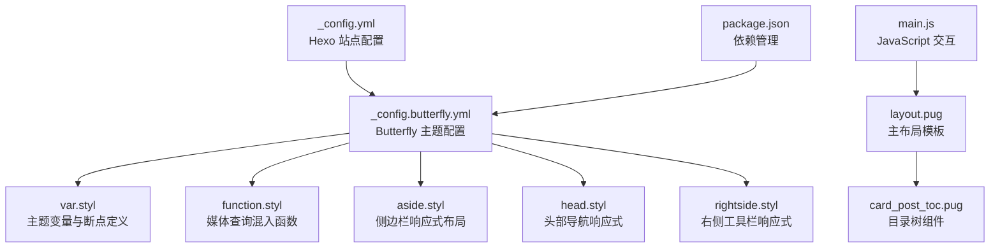
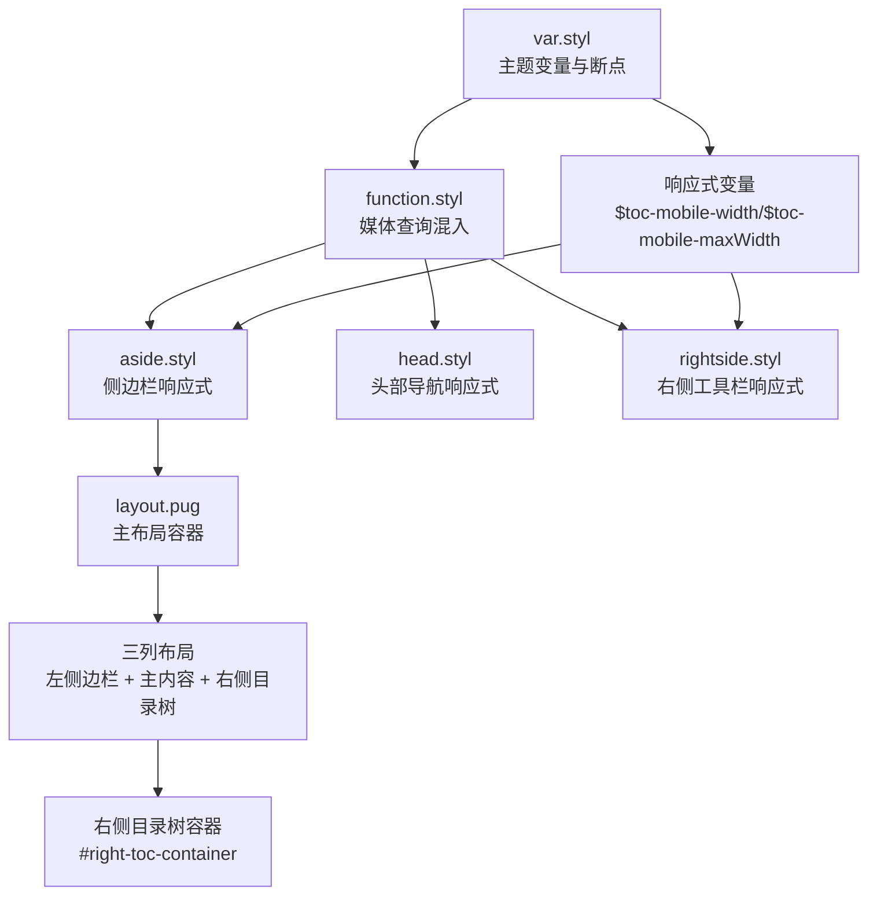
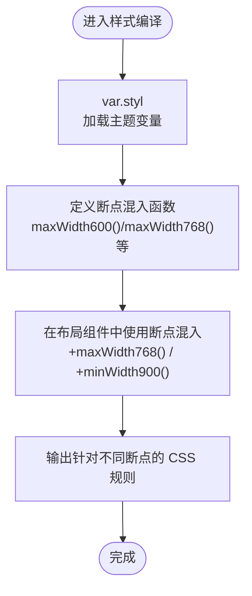
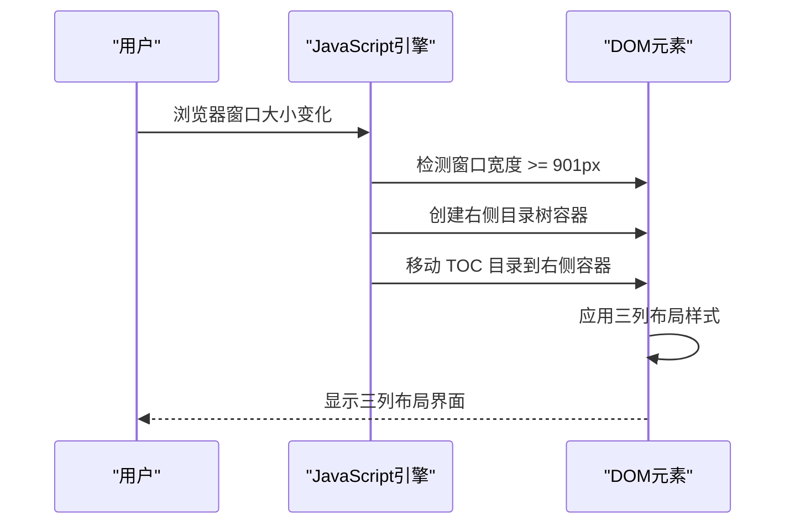
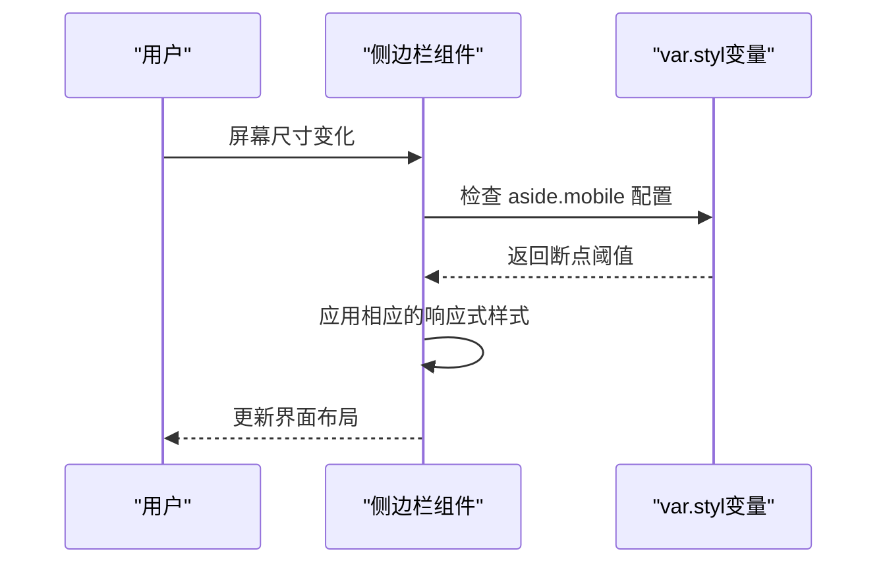
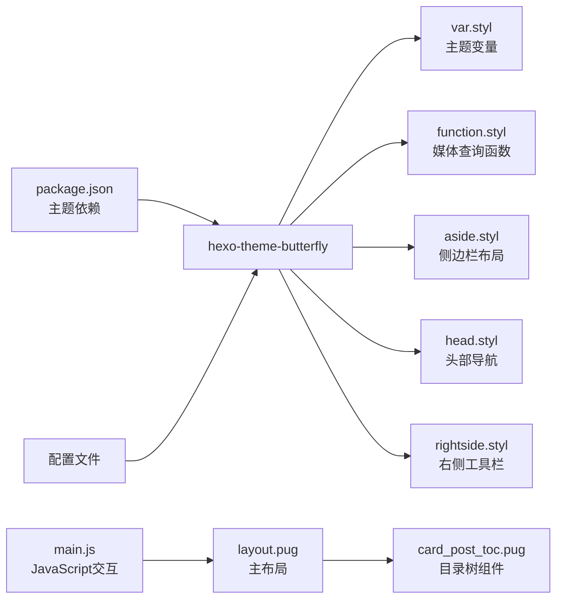

# 响应式设计实现

<cite>
**本文档引用的文件**
- [_config.butterfly.yml](file://hexo-site/_config.butterfly.yml)
- [_config.yml](file://hexo-site/_config.yml)
- [package.json](file://hexo-site/package.json)
- [var.styl](file://hexo-site/node_modules/hexo-theme-butterfly/source/css/var.styl)
- [function.styl](file://hexo-site/node_modules/hexo-theme-butterfly/source/css/_global/function.styl)
- [aside.styl](file://hexo-site/node_modules/hexo-theme-butterfly/source/css/_layout/aside.styl)
- [head.styl](file://hexo-site/node_modules/hexo-theme-butterfly/source/css/_layout/head.styl)
- [rightside.styl](file://hexo-site/node_modules/hexo-theme-butterfly/source/css/_layout/rightside.styl)
- [layout.pug](file://hexo-site/node_modules/hexo-theme-butterfly/layout/includes/layout.pug)
- [card_post_toc.pug](file://hexo-site/themes/_patches/layout/includes/widget/card_post_toc.pug)
- [main.js](file://hexo-site/themes\_patches/source/js/main.js)
</cite>

## 更新摘要
**所做更改**
- 新增桌面端三列布局系统（左侧边栏、主内容区、右侧目录树）
- 改进表格样式和导航行为
- 更新响应式断点系统为 901px 作为桌面端分界线
- 新增右侧目录树的独立容器和粘性布局
- 改进移动端和桌面端的 TOC 目录显示策略

## 目录
1. [简介](#简介)
2. [项目结构](#项目结构)
3. [核心组件](#核心组件)
4. [架构总览](#架构总览)
5. [详细组件分析](#详细组件分析)
6. [依赖关系分析](#依赖关系分析)
7. [性能考虑](#性能考虑)
8. [故障排除指南](#故障排除指南)
9. [结论](#结论)
10. [附录](#附录)

## 简介
本文件面向前端与全栈开发者，系统化梳理该项目基于 Butterfly 主题的响应式设计实现。项目已从 Jekyll 的复杂响应式系统迁移至 Butterfly 主题，重点覆盖以下方面：
- Butterfly 主题内置断点系统：600px、768px、900px、1024px、2000px 等断点的定义与使用
- **新增** 桌面端三列布局系统：左侧边栏、主内容区、右侧目录树的完整实现
- 响应式布局：基于 Stylus 的媒体查询和条件编译
- 侧边栏在不同屏幕尺寸下的行为变化
- 移动端适配最佳实践与常见问题
- 触摸设备交互优化
- 响应式图片与媒体处理
- 跨设备测试工具与技巧
- 性能优化在响应式设计中的重要性

## 项目结构
该项目基于 Hexo + Butterfly 主题构建，采用 Stylus 编写样式，通过主题配置文件统一管理响应式断点和布局行为。样式文件位于 Butterfly 主题的源码目录中，通过配置文件控制响应式行为。

**图表来源**
- [_config.yml](file://hexo-site/_config.yml)
- [_config.butterfly.yml](file://hexo-site/_config.butterfly.yml)
- [var.styl](file://hexo-site/node_modules/hexo-theme-butterfly/source/css/var.styl)
- [function.styl](file://hexo-site/node_modules/hexo-theme-butterfly/source/css/_global/function.styl)
- [aside.styl](file://hexo-site/node_modules/hexo-theme-butterfly/source/css/_layout/aside.styl)
- [head.styl](file://hexo-site/node_modules/hexo-theme-butterfly/source/css/_layout/head.styl)
- [rightside.styl](file://hexo-site/node_modules/hexo-theme-butterfly/source/css/_layout/rightside.styl)
- [layout.pug](file://hexo-site/node_modules/hexo-theme-butterfly/layout/includes/layout.pug)
- [card_post_toc.pug](file://hexo-site/themes/_patches/layout/includes/widget/card_post_toc.pug)
- [main.js](file://hexo-site/themes\_patches/source/js/main.js)
- [package.json](file://hexo-site/package.json)

**章节来源**
- [_config.yml](file://hexo-site/_config.yml)
- [_config.butterfly.yml](file://hexo-site/_config.butterfly.yml)
- [package.json](file://hexo-site/package.json)

## 核心组件
- **断点系统**：基于 Butterfly 主题的媒体查询混入函数，提供 maxWidth 和 minWidth 组合断点
- **三列布局系统**：桌面端专用的左侧边栏 + 主内容 + 右侧目录树布局
- **布局模块**：按功能拆分，分别处理侧边栏、头部导航、右侧工具栏等响应式组件
- **主题变量**：集中管理断点阈值、颜色变量、布局尺寸等主题配置
- **响应式组件**：侧边栏卡片、TOC 目录、移动端菜单等组件的响应式行为

**章节来源**
- [var.styl](file://hexo-site/node_modules/hexo-theme-butterfly/source/css/var.styl)
- [function.styl](file://hexo-site/node_modules/hexo-theme-butterfly/source/css/_global/function.styl)
- [aside.styl](file://hexo-site/node_modules/hexo-theme-butterfly/source/css/_layout/aside.styl)

## 架构总览
下图展示 Butterfly 主题响应式断点与布局组件的关系，特别是新增的三列布局系统：

**图表来源**
- [var.styl](file://hexo-site/node_modules/hexo-theme-butterfly/source/css/var.styl)
- [function.styl](file://hexo-site/node_modules/hexo-theme-butterfly/source/css/_global/function.styl)
- [aside.styl](file://hexo-site/node_modules/hexo-theme-butterfly/source/css/_layout/aside.styl)
- [head.styl](file://hexo-site/node_modules/hexo-theme-butterfly/source/css/_layout/head.styl)
- [rightside.styl](file://hexo-site/node_modules/hexo-theme-butterfly/source/css/_layout/rightside.styl)
- [layout.pug](file://hexo-site/node_modules/hexo-theme-butterfly/layout/includes/layout.pug)

## 详细组件分析

### 响应式断点系统
Butterfly 主题提供了完整的媒体查询断点系统，通过 Stylus 混入函数实现：

- **断点定义**：maxWidth600()、maxWidth768()、minWidth768()、maxWidth1024()、minWidth1024()、maxWidth900()、minWidth900()、minWidth901()、minWidth2000()
- **断点单位**：使用像素值作为断点阈值，便于精确控制
- **使用方式**：通过 +maxWidth()/+minWidth() 语法调用，确保在目标宽度范围内生效

**图表来源**
- [var.styl](file://hexo-site/node_modules/hexo-theme-butterfly/source/css/var.styl)
- [function.styl](file://hexo-site/node_modules/hexo-theme-butterfly/source/css/_global/function.styl)

**章节来源**
- [function.styl](file://hexo-site/node_modules/hexo-theme-butterfly/source/css/_global/function.styl)
- [var.styl](file://hexo-site/node_modules/hexo-theme-butterfly/source/css/var.styl)

### 桌面端三列布局系统
**新增功能** 项目实现了完整的桌面端三列布局系统，提供最佳的内容阅读体验：

- **布局结构**：左侧固定宽度边栏（280px）+ 弹性主内容区（自动填充）+ 右侧固定宽度目录树（240px）
- **响应式断点**：仅在 901px 及以上分辨率启用三列布局
- **隐藏侧边栏**：当侧边栏被隐藏时，主内容区自动居中并限制最大宽度（1000px）
- **粘性布局**：右侧目录树使用 sticky 定位，支持顶部偏移和过渡动画
- **动态移动**：JavaScript 自动将 TOC 目录从左侧边栏移动到右侧独立容器

**图表来源**
- [_config.butterfly.yml](file://hexo-site/_config.butterfly.yml)
- [main.js](file://hexo-site/themes\_patches/source/js/main.js)

**章节来源**
- [_config.butterfly.yml](file://hexo-site/_config.butterfly.yml)
- [main.js](file://hexo-site/themes\_patches/source/js/main.js)

### 侧边栏响应式行为
Butterfly 主题的侧边栏在不同屏幕尺寸下具有智能的响应式行为：

- **移动端隐藏**：当 aside.mobile 设置为 false 且屏幕宽度小于 768px 时，非 TOC 卡片隐藏
- **平板模式**：768px-900px 区间内，侧边栏宽度调整为 100%
- **桌面模式**：900px 以上时，侧边栏固定宽度 330px，支持粘性定位
- **TOC 目录**：移动端使用固定定位的目录面板，支持缩放动画效果

**图表来源**
- [aside.styl](file://hexo-site/node_modules/hexo-theme-butterfly/source/css/_layout/aside.styl)
- [var.styl](file://hexo-site/node_modules/hexo-theme-butterfly/source/css/var.styl)

**章节来源**
- [aside.styl](file://hexo-site/node_modules/hexo-theme-butterfly/source/css/_layout/aside.styl)
- [_config.butterfly.yml](file://hexo-site/_config.butterfly.yml)

### 头部导航响应式设计
头部导航在不同断点下具有不同的显示行为：

- **移动端**：社交图标在 768px 以下显示，导航菜单采用汉堡菜单
- **桌面端**：导航菜单完整显示，支持下拉菜单和粘性定位
- **固定导航**：超过 768px 时支持固定定位和阴影效果
- **标题适配**：网站标题在不同断点下调整字体大小

**章节来源**
- [head.styl](file://hexo-site/node_modules/hexo-theme-butterfly/source/css/_layout/head.styl)

### 右侧工具栏响应式交互
右侧工具栏包含多个响应式交互组件：

- **移动端 TOC 按钮**：900px 以下显示，点击弹出目录面板
- **隐藏侧边栏按钮**：900px 以下隐藏，避免遮挡内容
- **滚动百分比**：支持滚动进度显示和动画效果
- **按钮组**：响应式排列，支持悬停动画效果

**章节来源**
- [rightside.styl](file://hexo-site/node_modules/hexo-theme-butterfly/source/css/_layout/rightside.styl)

### 响应式图片与媒体处理
Butterfly 主题提供了完善的响应式媒体处理机制：

- **图片处理**：支持 object-fit: cover，悬停缩放效果
- **头像旋转**：可选的头像旋转动画效果
- **封面图片**：支持响应式封面图片和背景适配
- **视频适配**：通过 CSS 实现响应式视频容器

**章节来源**
- [function.styl](file://hexo-site/node_modules/hexo-theme-butterfly/source/css/_global/function.styl)
- [head.styl](file://hexo-site/node_modules/hexo-theme-butterfly/source/css/_layout/head.styl)

### 改进的表格样式
**新增功能** 项目对表格样式进行了全面改进：

- **文本居中**：表格内容在桌面端自动居中显示
- **垂直对齐**：单元格内容支持垂直居中对齐
- **字体优化**：正文字体增大，行高和间距优化
- **列表样式**：有序列表和无序列表间距调整

**章节来源**
- [_config.butterfly.yml](file://hexo-site/_config.butterfly.yml)

## 依赖关系分析
Butterfly 主题的响应式设计依赖关系如下：

**图表来源**
- [package.json](file://hexo-site/package.json)
- [var.styl](file://hexo-site/node_modules/hexo-theme-butterfly/source/css/var.styl)
- [function.styl](file://hexo-site/node_modules/hexo-theme-butterfly/source/css/_global/function.styl)
- [aside.styl](file://hexo-site/node_modules/hexo-theme-butterfly/source/css/_layout/aside.styl)
- [head.styl](file://hexo-site/node_modules/hexo-theme-butterfly/source/css/_layout/head.styl)
- [rightside.styl](file://hexo-site/node_modules/hexo-theme-butterfly/source/css/_layout/rightside.styl)
- [layout.pug](file://hexo-site/node_modules/hexo-theme-butterfly/layout/includes/layout.pug)
- [card_post_toc.pug](file://hexo-site/themes/_patches/layout/includes/widget/card_post_toc.pug)
- [main.js](file://hexo-site/themes\_patches/source/js/main.js)

**章节来源**
- [package.json](file://hexo-site/package.json)
- [_config.butterfly.yml](file://hexo-site/_config.butterfly.yml)

## 性能考虑
Butterfly 主题在响应式设计方面的性能优化：

- **条件编译**：使用 Stylus 条件编译减少 CSS 输出体积
- **媒体查询优化**：合理使用断点混入，避免重复的媒体查询规则
- **动画性能**：使用 transform 和 opacity 动画，利用硬件加速
- **懒加载支持**：配置中提供懒加载选项，可按需启用
- **主题变量缓存**：通过主题变量统一管理断点和颜色，提高维护效率
- **JavaScript 优化**：三列布局的 JavaScript 仅在桌面端执行，避免移动端性能开销

**章节来源**
- [var.styl](file://hexo-site/node_modules/hexo-theme-butterfly/source/css/var.styl)
- [function.styl](file://hexo-site/node_modules/hexo-theme-butterfly/source/css/_global/function.styl)
- [_config.butterfly.yml](file://hexo-site/_config.butterfly.yml)

## 故障排除指南
Butterfly 主题响应式设计常见问题解决：

- **断点不生效**
  - 检查 +maxWidth()/+minWidth() 语法是否正确
  - 确认断点混入函数定义位置：[function.styl](file://hexo-site/node_modules/hexo-theme-butterfly/source/css/_global/function.styl)
  - 验证配置文件中的断点设置

- **三列布局不显示**
  - 检查浏览器窗口宽度是否达到 901px 断点
  - 确认 JavaScript 中的移动 TOC 逻辑
  - 验证 #right-toc-container 容器是否正确创建

- **侧边栏显示异常**
  - 检查 aside.mobile 配置是否正确
  - 确认 aside.position 设置（left/right）
  - 参考侧边栏配置：[_config.butterfly.yml](file://hexo-site/_config.butterfly.yml)

- **移动端菜单不显示**
  - 检查 #toggle-menu 元素的显示状态
  - 确认 .hide-menu 类的切换逻辑
  - 验证导航菜单的响应式样式

- **TOC 目录不显示**
  - 检查 #card-toc 元素的断点样式
  - 确认移动端 TOC 按钮的显示逻辑
  - 验证目录面板的动画效果

**章节来源**
- [aside.styl](file://hexo-site/node_modules/hexo-theme-butterfly/source/css/_layout/aside.styl)
- [head.styl](file://hexo-site/node_modules/hexo-theme-butterfly/source/css/_layout/head.styl)
- [rightside.styl](file://hexo-site/node_modules/hexo-theme-butterfly/source/css/_layout/rightside.styl)
- [_config.butterfly.yml](file://hexo-site/_config.butterfly.yml)
- [main.js](file://hexo-site/themes\_patches/source/js/main.js)

## 结论
本项目通过 Butterfly 主题的响应式设计系统，实现了从移动端到桌面端的完整响应式体验。**新增的桌面端三列布局系统**显著提升了内容阅读体验，左侧边栏、主内容区和右侧目录树的分离设计让用户能够更高效地浏览和导航内容。相比之前的 Jekyll 系统，Butterfly 主题提供了更简洁、更统一的响应式解决方案。建议在后续迭代中重点关注断点配置的统一性、媒体资源的优化以及跨设备测试流程的标准化，以进一步提升性能与可用性。

## 附录

### 断点系统速查
- **600px 断点**：maxWidth600() - 超小屏设备适配
- **768px 断点**：maxWidth768()/minWidth768() - 移动端到平板的分界线
- **900px 断点**：maxWidth900()/minWidth901()/minWidth900() - 平板到桌面的重要分界
- **1024px 断点**：maxWidth1024()/minWidth1024() - 桌面端布局调整
- **2000px 断点**：minWidth2000() - 大屏设备优化

### 响应式组件配置
- **侧边栏**：aside.enable、aside.hide、aside.mobile、aside.position
- **TOC 目录**：toc.enable、toc.depth、toc.list_number
- **右侧工具栏**：rightside_item_order、readmode、darkmode
- **导航菜单**：nav.fixed、nav.display_title、nav.display_post_title
- **三列布局**：桌面端专用的布局配置，仅在 901px 及以上生效

### 三列布局配置详解
- **左侧边栏宽度**：280px 固定宽度
- **主内容区**：flex: 1 自动填充剩余空间
- **右侧目录树**：240px 固定宽度，粘性定位
- **隐藏侧边栏**：主内容区最大宽度 1000px 居中显示
- **移动 TOC**：JavaScript 自动将 TOC 从左侧移动到右侧容器

**章节来源**
- [function.styl](file://hexo-site/node_modules/hexo-theme-butterfly/source/css/_global/function.styl)
- [var.styl](file://hexo-site/node_modules/hexo-theme-butterfly/source/css/var.styl)
- [_config.butterfly.yml](file://hexo-site/_config.butterfly.yml)
- [layout.pug](file://hexo-site/node_modules/hexo-theme-butterfly/layout/includes/layout.pug)
- [card_post_toc.pug](file://hexo-site/themes/_patches/layout/includes/widget/card_post_toc.pug)