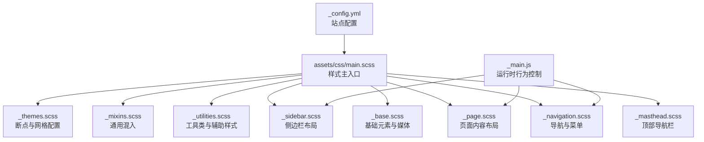
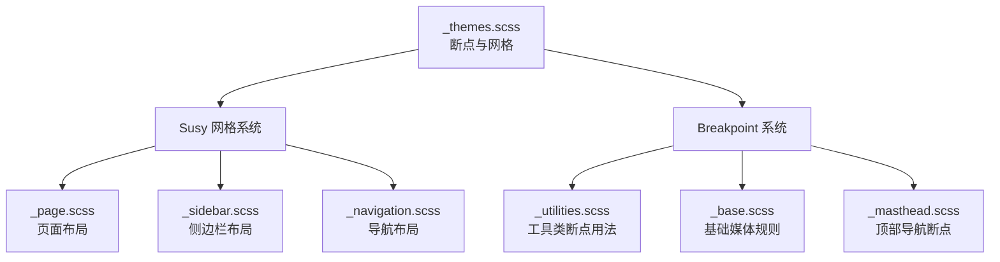
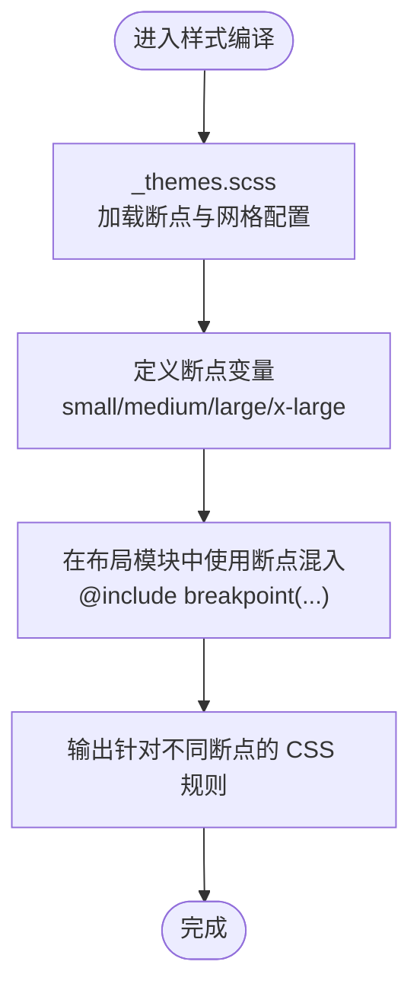
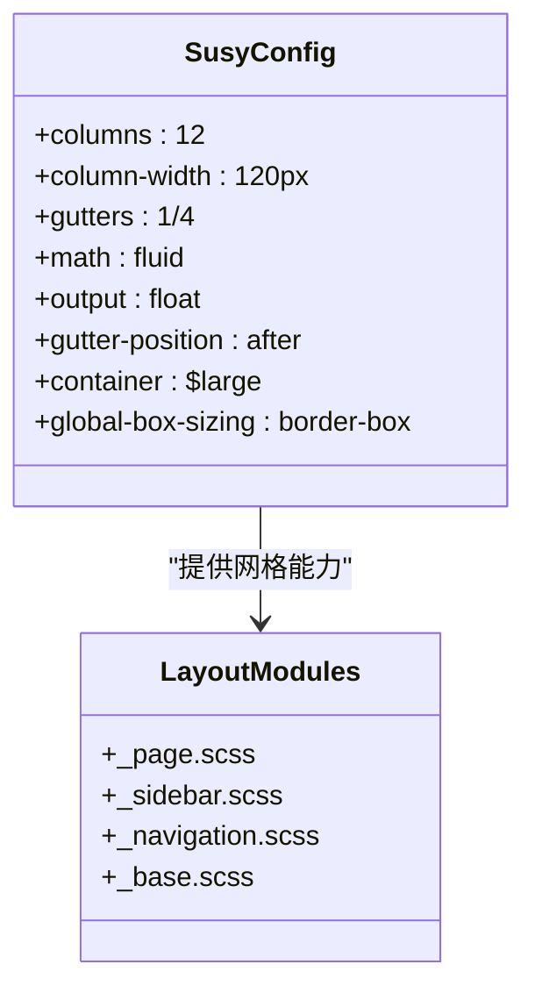
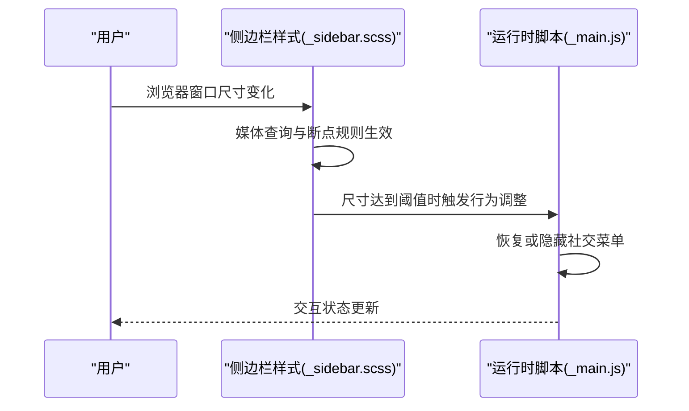
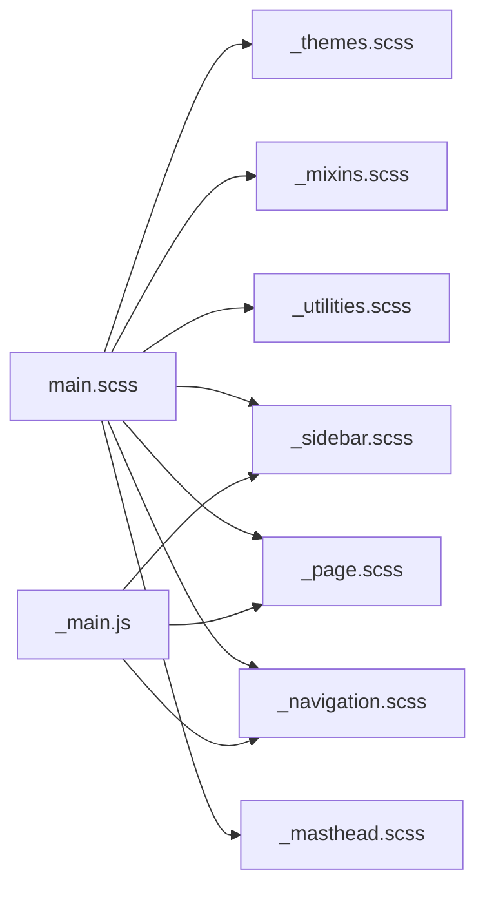

# 响应式设计实现

<cite>
**本文档引用的文件**
- [_config.yml](file://_config.yml)
- [main.scss](file://assets/css/main.scss)
- [_themes.scss](file://_sass/_themes.scss)
- [_mixins.scss](file://_sass/include/_mixins.scss)
- [_utilities.scss](file://_sass/include/_utilities.scss)
- [_sidebar.scss](file://_sass/layout/_sidebar.scss)
- [_base.scss](file://_sass/layout/_base.scss)
- [_page.scss](file://_sass/layout/_page.scss)
- [_navigation.scss](file://_sass/layout/_navigation.scss)
- [_masthead.scss](file://_sass/layout/_masthead.scss)
- [_main.js](file://assets/js/_main.js)
</cite>

## 目录
1. [简介](#简介)
2. [项目结构](#项目结构)
3. [核心组件](#核心组件)
4. [架构总览](#架构总览)
5. [详细组件分析](#详细组件分析)
6. [依赖关系分析](#依赖关系分析)
7. [性能考虑](#性能考虑)
8. [故障排除指南](#故障排除指南)
9. [结论](#结论)
10. [附录](#附录)

## 简介
本文件面向前端与全栈开发者，系统化梳理该项目的响应式设计实现，重点覆盖以下方面：
- 响应式断点系统：small、medium、large、x-large 的定义与使用
- 网格系统：Susy 框架的配置与布局实践
- 侧边栏在不同屏幕尺寸下的行为变化
- 移动端适配最佳实践与常见问题
- 触摸设备交互优化
- 响应式图片与媒体处理
- 跨设备测试工具与技巧
- 性能优化在响应式设计中的重要性

## 项目结构
该项目基于 Jekyll 构建，采用 SCSS 分层组织样式，通过主入口文件统一导入断点、主题、混入、布局与网格等模块，并在 JavaScript 中进行运行时行为控制（如主题切换、导航优先级、滚动行为等）。

**图表来源**
- [_config.yml](file://_config.yml)
- [main.scss](file://assets/css/main.scss)
- [_themes.scss](file://_sass/_themes.scss)
- [_mixins.scss](file://_sass/include/_mixins.scss)
- [_utilities.scss](file://_sass/include/_utilities.scss)
- [_sidebar.scss](file://_sass/layout/_sidebar.scss)
- [_base.scss](file://_sass/layout/_base.scss)
- [_page.scss](file://_sass/layout/_page.scss)
- [_navigation.scss](file://_sass/layout/_navigation.scss)
- [_masthead.scss](file://_sass/layout/_masthead.scss)
- [_main.js](file://assets/js/_main.js)

**章节来源**
- [_config.yml](file://_config.yml)
- [main.scss](file://assets/css/main.scss)

## 核心组件
- 断点与网格配置：集中于主题配置文件，定义断点变量与 Susy 网格参数
- 布局模块：按功能拆分，分别处理基础元素、页面内容、侧边栏、导航、页眉等
- 工具类：提供通用的可见性、对齐、图标、粘性定位等实用样式
- 运行时脚本：负责主题切换、导航优先级、平滑滚动、视频自适应等交互

**章节来源**
- [_themes.scss](file://_sass/_themes.scss)
- [_utilities.scss](file://_sass/include/_utilities.scss)
- [_main.js](file://assets/js/_main.js)

## 架构总览
下图展示响应式断点与网格在样式体系中的位置及相互关系：

**图表来源**
- [_themes.scss](file://_sass/_themes.scss)
- [_page.scss](file://_sass/layout/_page.scss)
- [_sidebar.scss](file://_sass/layout/_sidebar.scss)
- [_navigation.scss](file://_sass/layout/_navigation.scss)
- [_utilities.scss](file://_sass/include/_utilities.scss)
- [_base.scss](file://_sass/layout/_base.scss)
- [_masthead.scss](file://_sass/layout/_masthead.scss)

## 详细组件分析

### 响应式断点系统
- 断点定义：small、medium、medium-wide、large、x-large 在主题配置中集中声明
- 断点单位：通过断点工具初始化为以 em 为单位，便于缩放一致性
- 使用方式：在各布局模块中通过断点混入包裹特定规则，确保在目标宽度范围内生效

**图表来源**
- [_themes.scss](file://_sass/_themes.scss)
- [_page.scss](file://_sass/layout/_page.scss)
- [_sidebar.scss](file://_sass/layout/_sidebar.scss)
- [_navigation.scss](file://_sass/layout/_navigation.scss)

**章节来源**
- [_themes.scss](file://_sass/_themes.scss)

### 网格系统与 Susy 配置
- Susy 参数：列数、列宽、 gutter 比例、数学模型（流式）、容器宽度、盒模型策略等
- 容器宽度：以 large 断点作为网格容器宽度，确保在大屏上保持合理的最大宽度
- 布局应用：页面主体、面包屑、导航等模块广泛使用 Susy 的 span/prefix/suffix/full 等混入

**图表来源**
- [_themes.scss](file://_sass/_themes.scss)
- [_page.scss](file://_sass/layout/_page.scss)
- [_sidebar.scss](file://_sass/layout/_sidebar.scss)
- [_navigation.scss](file://_sass/layout/_navigation.scss)

**章节来源**
- [_themes.scss](file://_sass/_themes.scss)

### 侧边栏在不同屏幕尺寸下的行为
- 小屏到中屏：侧边栏固定在视口高度内，支持纵向滚动，避免内容遮挡
- 大屏及以上：侧边栏采用 Susy 栅格定位，悬浮显示，悬停透明度过渡
- 导航链接最大宽度：在更大屏幕上限制侧边栏链接宽度，提升可读性
- 移动端交互：作者信息区域在小屏下隐藏社交按钮，在大屏下显示为静态列表

**图表来源**
- [_sidebar.scss](file://_sass/layout/_sidebar.scss)
- [_main.js](file://assets/js/_main.js)

**章节来源**
- [_sidebar.scss](file://_sass/layout/_sidebar.scss)
- [_main.js](file://assets/js/_main.js)

### 页面内容与网格布局
- 主容器：使用容器混入与最大宽度约束，确保内容在大屏上不过宽
- 内容区：在大屏及以上使用 Susy 的 span/prefix/suffix 实现左右留白与主体宽度
- 图片与视频：图片自适应容器宽度，视频通过自适应库实现响应式播放器

**章节来源**
- [_page.scss](file://_sass/layout/_page.scss)
- [_base.scss](file://_sass/layout/_base.scss)

### 导航与菜单的响应式行为
- 优先级导航：当空间不足时，部分导航项被收纳至下拉菜单，保证主导航清晰
- 下拉菜单：在小屏下隐藏，大屏及以上显示为悬浮菜单
- TOC（目录）：在小屏下隐藏子层级链接，中屏及以上逐步展开

**章节来源**
- [_navigation.scss](file://_sass/layout/_navigation.scss)

### 顶部导航栏与粘性行为
- 固定定位：顶部导航栏固定在视口顶部，避免滚动时遮挡内容
- 粘性定位：部分内容在大屏下使用粘性定位，随滚动贴靠顶部

**章节来源**
- [_masthead.scss](file://_sass/layout/_masthead.scss)
- [_utilities.scss](file://_sass/include/_utilities.scss)

### 基础媒体与图片处理
- 图片：默认宽度 100%，圆角与过渡动画增强视觉体验
- 媒体：视频容器自适应，确保在不同设备上正确显示
- 打印样式：隐藏不必要元素，优化打印体验

**章节来源**
- [_base.scss](file://_sass/layout/_base.scss)

## 依赖关系分析
- 样式依赖：主入口统一导入断点、主题、混入、布局与网格；布局模块之间通过断点与网格参数耦合
- 运行时依赖：JavaScript 与 SCSS 中的断点阈值保持一致，避免运行时行为与样式不匹配

**图表来源**
- [main.scss](file://assets/css/main.scss)
- [_themes.scss](file://_sass/_themes.scss)
- [_mixins.scss](file://_sass/include/_mixins.scss)
- [_utilities.scss](file://_sass/include/_utilities.scss)
- [_sidebar.scss](file://_sass/layout/_sidebar.scss)
- [_page.scss](file://_sass/layout/_page.scss)
- [_navigation.scss](file://_sass/layout/_navigation.scss)
- [_masthead.scss](file://_sass/layout/_masthead.scss)
- [_main.js](file://assets/js/_main.js)

**章节来源**
- [main.scss](file://assets/css/main.scss)
- [_main.js](file://assets/js/_main.js)

## 性能考虑
- 样式压缩：构建配置启用压缩输出，减少传输体积
- 渐进动画：全局过渡属性统一管理，避免过度动画影响性能
- 响应式图片：图片宽度自适应容器，减少不必要的重绘
- 运行时优化：平滑滚动与粘性定位仅在大屏启用，降低小屏计算负担

**章节来源**
- [_config.yml](file://_config.yml)
- [_base.scss](file://_sass/layout/_base.scss)
- [_utilities.scss](file://_sass/include/_utilities.scss)

## 故障排除指南
- 断点不生效
  - 检查断点混入是否正确包裹规则
  - 确认断点单位设置与期望一致
  - 参考断点定义位置：[_themes.scss](file://_sass/_themes.scss)
- 网格布局错位
  - 核对 Susy 容器宽度与断点设置是否一致
  - 确认使用了正确的 span/prefix/suffix 混入
  - 参考网格配置：[_themes.scss](file://_sass/_themes.scss)
- 侧边栏交互异常
  - 确认运行时脚本中的断点阈值与 SCSS 一致
  - 检查社交菜单在不同断点下的显示逻辑
  - 参考侧边栏与脚本：[_sidebar.scss](file://_sass/layout/_sidebar.scss)，[_main.js](file://assets/js/_main.js)
- 导航溢出
  - 优先级导航会自动将溢出项移入下拉菜单
  - 检查可见/隐藏列表的结构与样式
  - 参考导航样式：[_navigation.scss](file://_sass/layout/_navigation.scss)
- 图片或视频显示异常
  - 确保容器宽度正确，媒体元素宽度设为 100%
  - 参考媒体规则：[_base.scss](file://_sass/layout/_base.scss)

**章节来源**
- [_themes.scss](file://_sass/_themes.scss)
- [_sidebar.scss](file://_sass/layout/_sidebar.scss)
- [_navigation.scss](file://_sass/layout/_navigation.scss)
- [_base.scss](file://_sass/layout/_base.scss)
- [_main.js](file://assets/js/_main.js)

## 结论
本项目通过明确的断点体系与 Susy 网格系统，结合布局模块化的组织方式与运行时脚本的协同，实现了从桌面到移动的流畅响应式体验。建议在后续迭代中持续关注断点阈值的一致性、媒体资源的优化与跨设备测试流程的标准化，以进一步提升性能与可用性。

## 附录

### 断点与网格速查
- 断点定义：small、medium、medium-wide、large、x-large
- Susy 配置要点：列数、列宽、gutter、容器宽度、盒模型策略
- 布局混入：container、clearfix、span、prefix、suffix、full

**章节来源**
- [_themes.scss](file://_sass/_themes.scss)