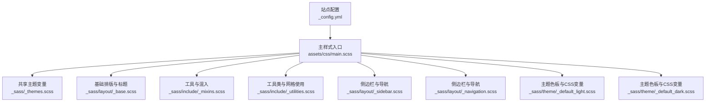
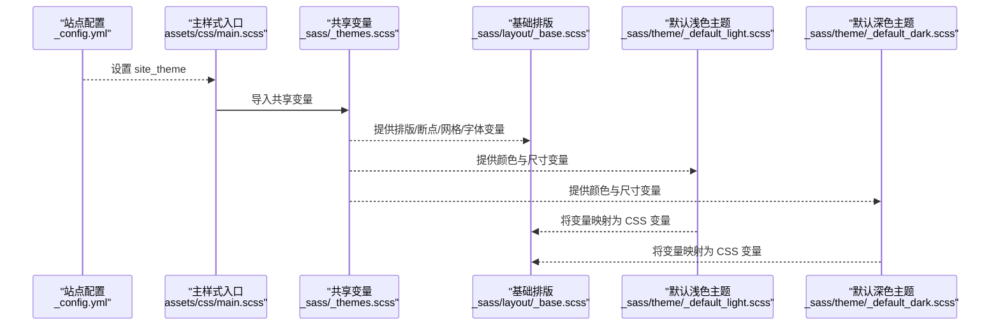
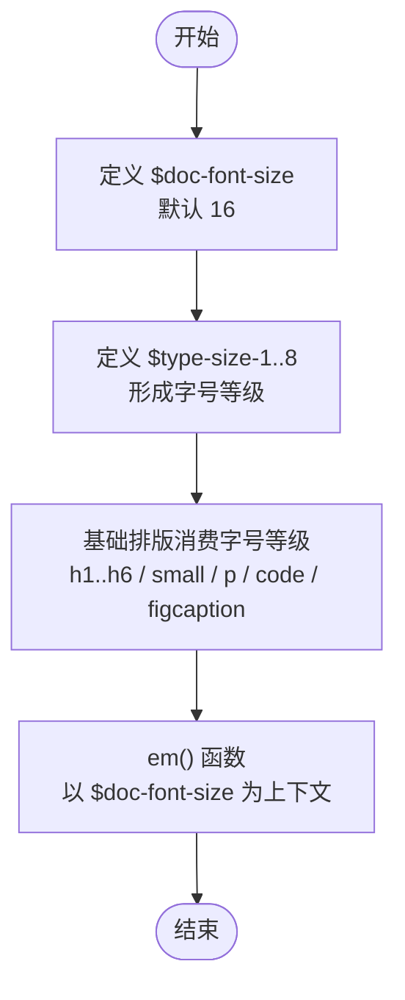
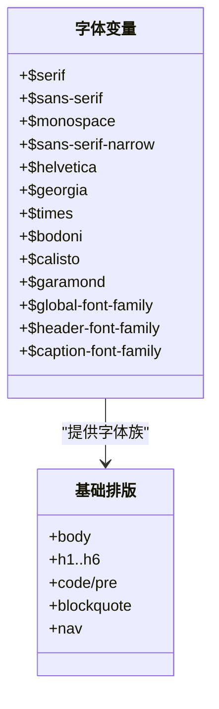
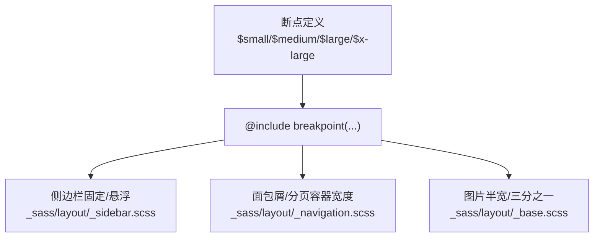
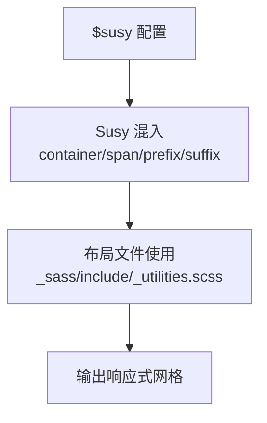
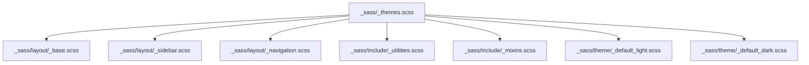

# 主题变量配置

<cite>
**本文引用的文件**
- [_sass/_themes.scss](file://_sass/_themes.scss)
- [assets/css/main.scss](file://assets/css/main.scss)
- [_sass/layout/_base.scss](file://_sass/layout/_base.scss)
- [_sass/include/_mixins.scss](file://_sass/include/_mixins.scss)
- [_sass/include/_utilities.scss](file://_sass/include/_utilities.scss)
- [_sass/layout/_sidebar.scss](file://_sass/layout/_sidebar.scss)
- [_sass/layout/_navigation.scss](file://_sass/layout/_navigation.scss)
- [_sass/theme/_default_light.scss](file://_sass/theme/_default_light.scss)
- [_sass/theme/_default_dark.scss](file://_sass/theme/_default_dark.scss)
- [_config.yml](file://_config.yml)
</cite>

## 目录
1. [简介](#简介)
2. [项目结构](#项目结构)
3. [核心组件](#核心组件)
4. [架构总览](#架构总览)
5. [详细组件分析](#详细组件分析)
6. [依赖分析](#依赖分析)
7. [性能考虑](#性能考虑)
8. [故障排查指南](#故障排查指南)
9. [结论](#结论)
10. [附录](#附录)

## 简介
本指南聚焦于如何通过 SCSS 变量系统控制主题外观与行为，涵盖以下方面：
- 排版变量：文档基础字号与字号等级体系（$doc-font-size、$type-size-*）
- 字体系统：衬线、无衬线、等宽字体族的选择与应用
- 响应式断点：$small、$medium、$large 等断点的作用与自定义
- 网格系统：Susy 配置项与调整技巧
- 变量覆盖与最佳实践：如何安全地扩展与覆盖默认变量

本指南以仓库中实际存在的变量与使用位置为依据，避免臆测，帮助你在不破坏现有样式的前提下进行主题定制。

## 项目结构
主题变量主要集中在共享样式入口与主题文件中，并由主构建入口统一导入。关键路径如下：
- 共享主题变量与断点、网格配置：[_sass/_themes.scss](file://_sass/_themes.scss)
- 主样式入口，负责按顺序导入各模块：[assets/css/main.scss](file://assets/css/main.scss)
- 基础排版与标题体系：[_sass/layout/_base.scss](file://_sass/layout/_base.scss)
- 断点与网格工具函数：[_sass/include/_mixins.scss](file://_sass/include/_mixins.scss)
- 工具类与网格使用：[_sass/include/_utilities.scss](file://_sass/include/_utilities.scss)
- 侧边栏与导航中的断点与网格用法：[_sass/layout/_sidebar.scss](file://_sass/layout/_sidebar.scss)、[_sass/layout/_navigation.scss](file://_sass/layout/_navigation.scss)
- 主题色板与 CSS 自定义属性映射：[_sass/theme/_default_light.scss](file://_sass/theme/_default_light.scss)、[_sass/theme/_default_dark.scss](file://_sass/theme/_default_dark.scss)
- 站点主题选择：[_config.yml](file://_config.yml)

**图表来源**
- [assets/css/main.scss:11-43](file://assets/css/main.scss#L11-L43)
- [_sass/_themes.scss:10-104](file://_sass/_themes.scss#L10-L104)
- [_sass/layout/_base.scss:1-365](file://_sass/layout/_base.scss#L1-L365)
- [_sass/include/_mixins.scss:17-19](file://_sass/include/_mixins.scss#L17-L19)
- [_sass/include/_utilities.scss:116-118](file://_sass/include/_utilities.scss#L116-L118)
- [_sass/layout/_sidebar.scss:20-41](file://_sass/layout/_sidebar.scss#L20-L41)
- [_sass/layout/_navigation.scss:22-43](file://_sass/layout/_navigation.scss#L22-L43)
- [_sass/theme/_default_light.scss:30-47](file://_sass/theme/_default_light.scss#L30-L47)
- [_sass/theme/_default_dark.scss:38-55](file://_sass/theme/_default_dark.scss#L38-L55)
- [_config.yml:10-11](file://_config.yml#L10-L11)

**章节来源**
- [assets/css/main.scss:11-43](file://assets/css/main.scss#L11-L43)
- [_sass/_themes.scss:10-104](file://_sass/_themes.scss#L10-L104)
- [_config.yml:10-11](file://_config.yml#L10-L11)

## 核心组件
- 共享主题设置（排版、字体、断点、网格、品牌色）
  - 文档基础字号与段落缩进：$doc-font-size、$paragraph-indent、$indent-var
  - 字体族：$serif、$sans-serif、$monospace、$sans-serif-narrow、$helvetica、$georgia、$times、$bodoni、$calisto、$garamond
  - 字号等级：$type-size-1 至 $type-size-8
  - 全局与标题字体：$global-font-family、$header-font-family、$caption-font-family
  - 断点：$small、$medium、$medium-wide、$large、$x-large
  - 网格：$susy 配置（列数、列宽、 gutter 比例、容器宽度、盒模型等）
  - 品牌色：多种社交平台颜色变量
- 主题色板与 CSS 变量映射
  - 默认浅色主题：$primary-color、$gray 系列、$border-radius、$box-shadow、$masthead-height、$navicon-*、$sidebar-* 等
  - 默认深色主题：同上，但值偏向暗色系
- 基础排版与标题体系
  - body、h1-h6、small、p、code、pre、blockquote、table、nav 等元素均使用上述变量
- 断点与网格工具
  - @include breakpoint(...) 与 Susy 的 container/span/prefix/suffix 等混入
  - em() 函数用于相对单位换算

**章节来源**
- [_sass/_themes.scss:10-104](file://_sass/_themes.scss#L10-L104)
- [_sass/theme/_default_light.scss:5-27](file://_sass/theme/_default_light.scss#L5-L27)
- [_sass/theme/_default_dark.scss:6-35](file://_sass/theme/_default_dark.scss#L6-L35)
- [_sass/layout/_base.scss:10-165](file://_sass/layout/_base.scss#L10-L165)
- [_sass/include/_mixins.scss:17-19](file://_sass/include/_mixins.scss#L17-L19)
- [_sass/include/_utilities.scss:116-118](file://_sass/include/_utilities.scss#L116-L118)
- [_sass/layout/_sidebar.scss:20-41](file://_sass/layout/_sidebar.scss#L20-L41)
- [_sass/layout/_navigation.scss:22-43](file://_sass/layout/_navigation.scss#L22-L43)

## 架构总览
主题变量的生效链路：
- 在主入口中按顺序导入共享变量与布局模块
- 共享变量定义全局排版、断点、网格与字体族
- 布局模块通过变量直接消费，形成一致的视觉与交互体验
- 主题文件将 SCSS 变量映射为 CSS 自定义属性，实现明暗主题切换

**图表来源**
- [_config.yml:10-11](file://_config.yml#L10-L11)
- [assets/css/main.scss:14-16](file://assets/css/main.scss#L14-L16)
- [_sass/_themes.scss:10-104](file://_sass/_themes.scss#L10-L104)
- [_sass/layout/_base.scss:10-25](file://_sass/layout/_base.scss#L10-L25)
- [_sass/theme/_default_light.scss:30-47](file://_sass/theme/_default_light.scss#L30-L47)
- [_sass/theme/_default_dark.scss:38-55](file://_sass/theme/_default_dark.scss#L38-L55)

## 详细组件分析

### 排版变量：$doc-font-size 与 $type-size-* 系列
- $doc-font-size：文档基础字号，默认 16。作为 em() 函数的上下文基准，影响相对单位换算与字号等级的视觉比例。
- $type-size-*：从 $type-size-1（最大标题）到 $type-size-8（最小辅助信息），形成稳定的字号等级体系。
- 使用位置：
  - 基础排版：h1-h6、small、p、code、figcaption 等元素直接使用字号等级变量
  - 工具函数：em() 函数以 $doc-font-size 为默认上下文，用于生成相对单位

**图表来源**
- [_sass/_themes.scss:10](file://_sass/_themes.scss#L10)
- [_sass/_themes.scss:33-40](file://_sass/_themes.scss#L33-L40)
- [_sass/layout/_base.scss:34-61](file://_sass/layout/_base.scss#L34-L61)
- [_sass/include/_mixins.scss:17-19](file://_sass/include/_mixins.scss#L17-L19)

**章节来源**
- [_sass/_themes.scss:10](file://_sass/_themes.scss#L10)
- [_sass/_themes.scss:33-40](file://_sass/_themes.scss#L33-L40)
- [_sass/layout/_base.scss:34-61](file://_sass/layout/_base.scss#L34-L61)
- [_sass/include/_mixins.scss:17-19](file://_sass/include/_mixins.scss#L17-L19)

### 字体系统变量：$serif、$sans-serif、$monospace 等
- 字体族：
  - $serif：默认为 Georgia、Times、serif
  - $sans-serif：默认为系统无衬线字体栈，兼顾多平台可用性
  - $monospace：默认为等宽字体栈
  - 扩展字体族：$sans-serif-narrow（默认等于 $sans-serif）、$helvetica、$georgia、$times、$bodoni、$calisto、$garamond
- 全局与标题字体：
  - $global-font-family、$header-font-family、$caption-font-family 分别用于正文、标题、说明文字
- 影响范围：
  - 基础排版：body、h1-h6、code、pre、blockquote、nav 等
  - 侧边栏与导航：标题字体、正文字体、TOC 字体等

**图表来源**
- [_sass/_themes.scss:16-44](file://_sass/_themes.scss#L16-L44)
- [_sass/layout/_base.scss:18-132](file://_sass/layout/_base.scss#L18-L132)
- [_sass/layout/_sidebar.scss:43-56](file://_sass/layout/_sidebar.scss#L43-L56)
- [_sass/layout/_navigation.scss:16-365](file://_sass/layout/_navigation.scss#L16-L365)

**章节来源**
- [_sass/_themes.scss:16-44](file://_sass/_themes.scss#L16-L44)
- [_sass/layout/_base.scss:18-132](file://_sass/layout/_base.scss#L18-L132)
- [_sass/layout/_sidebar.scss:43-56](file://_sass/layout/_sidebar.scss#L43-L56)
- [_sass/layout/_navigation.scss:16-365](file://_sass/layout/_navigation.scss#L16-L365)

### 断点变量：$small、$medium、$large 等
- 定义位置：$small、$medium、$medium-wide、$large、$x-large
- 作用：
  - 通过 @include breakpoint(...) 在不同屏幕宽度下切换布局
  - 与 Susy 的 span/prefix/suffix 等混入配合，实现响应式网格
- 使用示例：
  - 侧边栏固定与悬浮：在大屏时启用固定定位与列跨度
  - 导航面包屑与分页：在不同断点下调整容器宽度与列跨度
  - 图片半宽/三分之一：在小屏时堆叠，在中大屏时并排

**图表来源**
- [_sass/_themes.scss:52-56](file://_sass/_themes.scss#L52-L56)
- [_sass/layout/_sidebar.scss:20-41](file://_sass/layout/_sidebar.scss#L20-L41)
- [_sass/layout/_navigation.scss:22-43](file://_sass/layout/_navigation.scss#L22-L43)
- [_sass/layout/_base.scss:223-244](file://_sass/layout/_base.scss#L223-L244)

**章节来源**
- [_sass/_themes.scss:52-56](file://_sass/_themes.scss#L52-L56)
- [_sass/layout/_sidebar.scss:20-41](file://_sass/layout/_sidebar.scss#L20-L41)
- [_sass/layout/_navigation.scss:22-43](file://_sass/layout/_navigation.scss#L22-L43)
- [_sass/layout/_base.scss:223-244](file://_sass/layout/_base.scss#L223-L244)

### 网格系统变量：$susy 配置
- 关键配置项：
  - columns：列数（默认 12）
  - column-width：列宽（默认 120px）
  - gutters：gutter 比例（默认 1/4）
  - math：数学模型（默认 fluid）
  - output：输出类型（默认 float）
  - gutter-position：gutter 位置（默认 after）
  - container：容器宽度（默认 $large）
  - global-box-sizing：全局盒模型（默认 border-box）
- 使用方式：
  - 在工具类与布局中通过 container/span/prefix/suffix 等混入使用 Susy
  - 例如：.wrapper 使用 container；.full 在大屏时使用 span(2.5 of 12) 调整内容区宽度

**图表来源**
- [_sass/_themes.scss:66-75](file://_sass/_themes.scss#L66-L75)
- [_sass/include/_utilities.scss:116-118](file://_sass/include/_utilities.scss#L116-L118)
- [_sass/include/_utilities.scss:169-173](file://_sass/include/_utilities.scss#L169-L173)

**章节来源**
- [_sass/_themes.scss:66-75](file://_sass/_themes.scss#L66-L75)
- [_sass/include/_utilities.scss:116-118](file://_sass/include/_utilities.scss#L116-L118)
- [_sass/include/_utilities.scss:169-173](file://_sass/include/_utilities.scss#L169-L173)

### 变量覆盖与最佳实践
- 覆盖原则
  - 在主入口导入共享变量之后再导入自定义覆盖文件，确保后导入的变量覆盖先导入的默认变量
  - 对于主题色板变量，建议同时覆盖浅色与深色主题文件，保持一致性
- 推荐覆盖顺序
  - 共享变量：$doc-font-size、$type-size-*、$sans-serif、$serif、$monospace、$small/$medium/$large 等
  - 网格：$susy 的 columns、column-width、container 等
  - 主题色板：$primary-color、$gray 系列、$border-radius、$box-shadow、$masthead-height、$navicon-*、$sidebar-* 等
- 注意事项
  - 修改 $doc-font-size 后，$type-size-* 与 em() 计算会整体缩放，需同步评估标题层级与行高
  - 断点与网格联动：修改断点或容器宽度时，需检查 Susy 的 span/prefix/suffix 是否仍符合预期
  - 主题切换：若自定义了主题色板变量，请同时更新浅色与深色主题文件，确保明暗模式一致

**章节来源**
- [assets/css/main.scss:11-43](file://assets/css/main.scss#L11-L43)
- [_sass/_themes.scss:10-104](file://_sass/_themes.scss#L10-L104)
- [_sass/theme/_default_light.scss:5-27](file://_sass/theme/_default_light.scss#L5-L27)
- [_sass/theme/_default_dark.scss:6-35](file://_sass/theme/_default_dark.scss#L6-L35)

## 依赖分析
- 主入口依赖关系
  - assets/css/main.scss 依赖 _sass/_themes.scss 提供的共享变量
  - 基础排版与布局模块依赖共享变量中的字体、字号、断点与网格配置
  - 主题文件依赖共享变量中的颜色与尺寸变量，并将其映射为 CSS 变量
- 断点与网格耦合
  - 断点变量与 Susy 配置共同决定响应式网格的行为
  - 任一端的变更都可能影响另一端的布局表现

**图表来源**
- [_sass/_themes.scss:10-104](file://_sass/_themes.scss#L10-L104)
- [_sass/layout/_base.scss:10-165](file://_sass/layout/_base.scss#L10-L165)
- [_sass/layout/_sidebar.scss:20-41](file://_sass/layout/_sidebar.scss#L20-L41)
- [_sass/layout/_navigation.scss:22-43](file://_sass/layout/_navigation.scss#L22-L43)
- [_sass/include/_utilities.scss:116-118](file://_sass/include/_utilities.scss#L116-L118)
- [_sass/include/_mixins.scss:17-19](file://_sass/include/_mixins.scss#L17-L19)
- [_sass/theme/_default_light.scss:30-47](file://_sass/theme/_default_light.scss#L30-L47)
- [_sass/theme/_default_dark.scss:38-55](file://_sass/theme/_default_dark.scss#L38-L55)

**章节来源**
- [_sass/_themes.scss:10-104](file://_sass/_themes.scss#L10-L104)
- [_sass/layout/_base.scss:10-165](file://_sass/layout/_base.scss#L10-L165)
- [_sass/layout/_sidebar.scss:20-41](file://_sass/layout/_sidebar.scss#L20-L41)
- [_sass/layout/_navigation.scss:22-43](file://_sass/layout/_navigation.scss#L22-L43)
- [_sass/include/_utilities.scss:116-118](file://_sass/include/_utilities.scss#L116-L118)
- [_sass/include/_mixins.scss:17-19](file://_sass/include/_mixins.scss#L17-L19)
- [_sass/theme/_default_light.scss:30-47](file://_sass/theme/_default_light.scss#L30-L47)
- [_sass/theme/_default_dark.scss:38-55](file://_sass/theme/_default_dark.scss#L38-L55)

## 性能考虑
- 变量计算成本极低：SCSS 变量在编译期解析，不会引入运行时开销
- 统一变量集中管理：减少重复定义，降低维护成本
- 响应式断点与网格：合理设置断点与容器宽度，避免过度碎片化导致的复杂计算

## 故障排查指南
- 症状：字号比例异常或标题层级错乱
  - 检查 $doc-font-size 与 $type-size-* 的整体缩放是否符合预期
  - 参考：[_sass/_themes.scss:10](file://_sass/_themes.scss#L10)、[_sass/_themes.scss:33-40](file://_sass/_themes.scss#L33-L40)
- 症状：断点切换不生效或网格错位
  - 检查断点变量与 Susy 配置是否匹配，确认 @include breakpoint 与 Susy 混入的使用位置
  - 参考：[_sass/_themes.scss:52-56](file://_sass/_themes.scss#L52-L56)、[_sass/_themes.scss:66-75](file://_sass/_themes.scss#L66-L75)
- 症状：明暗主题颜色不一致
  - 确认浅色与深色主题文件中的颜色变量已同步覆盖
  - 参考：[_sass/theme/_default_light.scss:5-27](file://_sass/theme/_default_light.scss#L5-L27)、[_sass/theme/_default_dark.scss:6-35](file://_sass/theme/_default_dark.scss#L6-L35)

**章节来源**
- [_sass/_themes.scss:10](file://_sass/_themes.scss#L10)
- [_sass/_themes.scss:33-40](file://_sass/_themes.scss#L33-L40)
- [_sass/_themes.scss:52-56](file://_sass/_themes.scss#L52-L56)
- [_sass/_themes.scss:66-75](file://_sass/_themes.scss#L66-L75)
- [_sass/theme/_default_light.scss:5-27](file://_sass/theme/_default_light.scss#L5-L27)
- [_sass/theme/_default_dark.scss:6-35](file://_sass/theme/_default_dark.scss#L6-L35)

## 结论
通过集中管理共享变量、明确断点与网格配置、以及在主题文件中映射为 CSS 变量，可以实现稳定且可维护的主题外观控制。遵循“先导入默认变量，再导入覆盖”的顺序，结合字号、字体、断点与网格的整体考量，即可在不破坏现有样式的前提下完成高质量的主题定制。

## 附录
- 站点主题选择：通过配置项 site_theme 控制主题名称，主入口会据此导入对应主题文件
  - 参考：[_config.yml:10-11](file://_config.yml#L10-L11)、[assets/css/main.scss:14-16](file://assets/css/main.scss#L14-L16)

**章节来源**
- [_config.yml:10-11](file://_config.yml#L10-L11)
- [assets/css/main.scss:14-16](file://assets/css/main.scss#L14-L16)