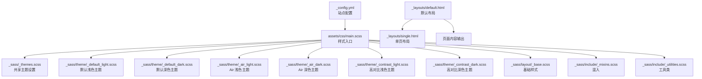
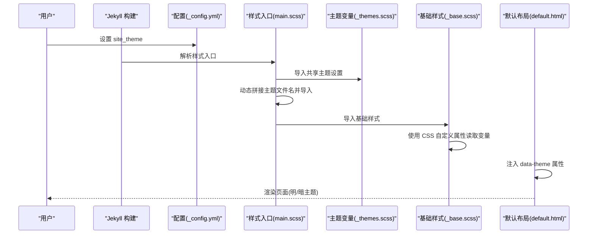
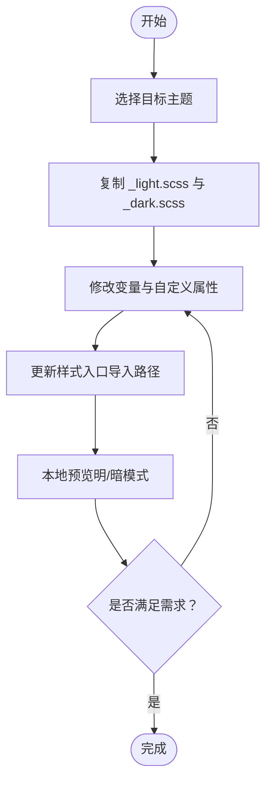
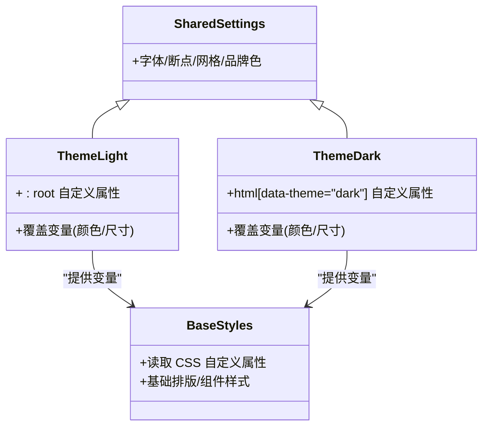
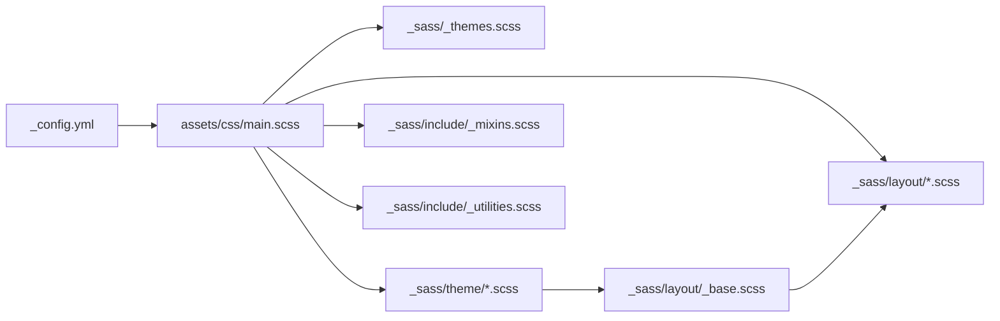

# 创建新主题

<cite>
**本文引用的文件**
- [_config.yml](file://_config.yml)
- [assets/css/main.scss](file://assets/css/main.scss)
- [_sass/_themes.scss](file://_sass/_themes.scss)
- [_sass/theme/_default_light.scss](file://_sass/theme/_default_light.scss)
- [_sass/theme/_default_dark.scss](file://_sass/theme/_default_dark.scss)
- [_sass/theme/_air_light.scss](file://_sass/theme/_air_light.scss)
- [_sass/theme/_air_dark.scss](file://_sass/theme/_air_dark.scss)
- [_sass/theme/_contrast_light.scss](file://_sass/theme/_contrast_light.scss)
- [_sass/theme/_contrast_dark.scss](file://_sass/theme/_contrast_dark.scss)
- [_sass/layout/_base.scss](file://_sass/layout/_base.scss)
- [_sass/include/_mixins.scss](file://_sass/include/_mixins.scss)
- [_sass/include/_utilities.scss](file://_sass/include/_utilities.scss)
- [_layouts/default.html](file://_layouts/default.html)
- [_layouts/single.html](file://_layouts/single.html)
- [README.md](file://README.md)
</cite>

## 目录
1. [简介](#简介)
2. [项目结构](#项目结构)
3. [核心组件](#核心组件)
4. [架构总览](#架构总览)
5. [详细组件分析](#详细组件分析)
6. [依赖关系分析](#依赖关系分析)
7. [性能考量](#性能考量)
8. [故障排查指南](#故障排查指南)
9. [结论](#结论)
10. [附录](#附录)

## 简介
本教程面向希望在现有 Jekyll 主题基础上创建“新主题”的开发者，目标是帮助你：
- 理解主题文件结构与命名规范
- 基于现有主题进行复制、修改与扩展
- 掌握主题继承与变量覆盖的实现原理
- 定义主题特有样式与组件样式
- 进行主题测试与验证
- 完成从简单颜色修改到复杂视觉效果的开发示例
- 了解主题打包与分发最佳实践

## 项目结构
该站点采用 Jekyll + SCSS 的静态站点生成方式，主题系统通过配置项选择主题，并由主样式入口统一导入主题与布局样式。

**图表来源**
- [_config.yml](file://_config.yml)
- [assets/css/main.scss](file://assets/css/main.scss)
- [_sass/_themes.scss](file://_sass/_themes.scss)
- [_sass/theme/_default_light.scss](file://_sass/theme/_default_light.scss)
- [_sass/theme/_default_dark.scss](file://_sass/theme/_default_dark.scss)
- [_sass/theme/_air_light.scss](file://_sass/theme/_air_light.scss)
- [_sass/theme/_air_dark.scss](file://_sass/theme/_air_dark.scss)
- [_sass/theme/_contrast_light.scss](file://_sass/theme/_contrast_light.scss)
- [_sass/theme/_contrast_dark.scss](file://_sass/theme/_contrast_dark.scss)
- [_sass/layout/_base.scss](file://_sass/layout/_base.scss)
- [_sass/include/_mixins.scss](file://_sass/include/_mixins.scss)
- [_sass/include/_utilities.scss](file://_sass/include/_utilities.scss)
- [_layouts/default.html](file://_layouts/default.html)
- [_layouts/single.html](file://_layouts/single.html)

**章节来源**
- [_config.yml](file://_config.yml)
- [assets/css/main.scss](file://assets/css/main.scss)
- [_layouts/default.html](file://_layouts/default.html)
- [_layouts/single.html](file://_layouts/single.html)

## 核心组件
- 主题选择与注入
  - 站点配置通过选项控制当前主题（如默认、Air、高对比等），并在样式入口中动态拼接主题文件名，实现按需加载。
- 主题文件组织
  - 共享主题设置集中于共享 SCSS 文件，主题变体以“主题名_明暗”命名，便于覆盖与继承。
- 布局与样式入口
  - 默认布局负责注入主题数据属性与头部资源；样式入口负责按顺序导入混入、网格、基础与布局样式，确保变量与样式链路正确。

**章节来源**
- [_config.yml](file://_config.yml)
- [assets/css/main.scss](file://assets/css/main.scss)
- [_sass/_themes.scss](file://_sass/_themes.scss)
- [_layouts/default.html](file://_layouts/default.html)

## 架构总览
主题系统采用“配置驱动 + SCSS 变量覆盖 + CSS 自定义属性”的组合模式：
- 配置层：站点配置决定主题名称与明暗模式
- 变量层：共享设置与主题变量共同定义设计令牌
- 样式层：基础样式与布局样式通过自定义属性读取变量，实现明暗主题切换
- 布局层：模板布局负责注入主题上下文

**图表来源**
- [_config.yml](file://_config.yml)
- [assets/css/main.scss](file://assets/css/main.scss)
- [_sass/_themes.scss](file://_sass/_themes.scss)
- [_sass/layout/_base.scss](file://_sass/layout/_base.scss)
- [_layouts/default.html](file://_layouts/default.html)

## 详细组件分析

### 主题文件结构与命名规范
- 共享设置：集中于共享 SCSS 文件，定义字体、断点、网格、品牌色等全局设计令牌。
- 主题变体：以“主题名_明/暗”命名，例如“_default_light.scss”、“_air_dark.scss”，便于按主题与明暗模式分别覆盖变量。
- 样式入口：通过动态拼接主题名与明暗后缀，实现按配置自动导入对应主题文件。

命名建议
- 主题目录：theme/
- 文件命名：主题名使用小写与下划线，避免空格；明暗区分用“_light”、“_dark”后缀
- 变量命名：使用语义化前缀（如$global-、$brand-）与可读性强的描述词
- 自定义属性：与变量一一对应，保持命名一致性，便于运行时切换

**章节来源**
- [_sass/_themes.scss](file://_sass/_themes.scss)
- [_sass/theme/_default_light.scss](file://_sass/theme/_default_light.scss)
- [_sass/theme/_default_dark.scss](file://_sass/theme/_default_dark.scss)
- [_sass/theme/_air_light.scss](file://_sass/theme/_air_light.scss)
- [_sass/theme/_air_dark.scss](file://_sass/theme/_air_dark.scss)
- [_sass/theme/_contrast_light.scss](file://_sass/theme/_contrast_light.scss)
- [_sass/theme/_contrast_dark.scss](file://_sass/theme/_contrast_dark.scss)
- [assets/css/main.scss](file://assets/css/main.scss)

### 从现有主题复制与修改步骤
- 步骤一：确定目标主题
  - 在站点配置中选择目标主题（如默认、Air、高对比）
- 步骤二：复制主题文件
  - 将目标主题的“_light.scss”和“_dark.scss”复制到同一目录，重命名为你的新主题名
- 步骤三：修改变量与自定义属性
  - 调整颜色、字号、圆角、阴影等变量，确保与新主题风格一致
  - 更新自定义属性映射，保证基础样式能读取到新值
- 步骤四：更新样式入口
  - 在样式入口中替换主题名占位符为你的新主题名，确保按顺序导入
- 步骤五：验证与迭代
  - 在本地预览明暗模式差异，修正不一致的组件样式

**图表来源**
- [_config.yml](file://_config.yml)
- [assets/css/main.scss](file://assets/css/main.scss)
- [_sass/_themes.scss](file://_sass/_themes.scss)
- [_sass/layout/_base.scss](file://_sass/layout/_base.scss)

**章节来源**
- [_config.yml](file://_config.yml)
- [assets/css/main.scss](file://assets/css/main.scss)

### 主题继承与变量覆盖原理
- 变量优先级
  - 共享设置提供默认值；主题变体覆盖共享设置中的变量；基础样式通过自定义属性读取最终值
- 明暗模式切换
  - 布局注入 data-theme 属性；主题变体针对不同模式使用不同的选择器块，实现切换
- 样式链路
  - 样式入口按顺序导入，先变量后样式，确保变量在使用前已定义

**图表来源**
- [_sass/_themes.scss](file://_sass/_themes.scss)
- [_sass/theme/_default_light.scss](file://_sass/theme/_default_light.scss)
- [_sass/theme/_default_dark.scss](file://_sass/theme/_default_dark.scss)
- [_sass/layout/_base.scss](file://_sass/layout/_base.scss)

**章节来源**
- [_sass/_themes.scss](file://_sass/_themes.scss)
- [_sass/theme/_default_light.scss](file://_sass/theme/_default_light.scss)
- [_sass/theme/_default_dark.scss](file://_sass/theme/_default_dark.scss)
- [_sass/layout/_base.scss](file://_sass/layout/_base.scss)
- [_layouts/default.html](file://_layouts/default.html)

### 定义主题特有样式与组件样式
- 组件样式组织
  - 将通用组件样式拆分为独立 SCSS 文件（如按钮、表格、导航、侧边栏等），在样式入口中按需导入
  - 利用混入与工具类提升复用性与一致性
- 主题特有规则
  - 在主题变体中新增或覆盖组件样式，确保与整体设计一致
  - 使用断点与网格系统适配多端显示
- 示例路径
  - 按钮样式：参考“按钮”布局文件
  - 表格样式：参考“表格”布局文件
  - 导航与侧边栏：参考“导航”“侧边栏”布局文件

**章节来源**
- [assets/css/main.scss](file://assets/css/main.scss)
- [_sass/layout/_buttons.scss](file://_sass/layout/_buttons.scss)
- [_sass/layout/_tables.scss](file://_sass/layout/_tables.scss)
- [_sass/layout/_navigation.scss](file://_sass/layout/_navigation.scss)
- [_sass/layout/_sidebar.scss](file://_sass/layout/_sidebar.scss)
- [_sass/include/_mixins.scss](file://_sass/include/_mixins.scss)
- [_sass/include/_utilities.scss](file://_sass/include/_utilities.scss)

### 主题测试与验证
- 本地预览
  - 使用 Jekyll 提供的本地服务命令启动站点，实时查看主题效果与明暗切换
- 多设备与浏览器验证
  - 在不同屏幕尺寸与浏览器中检查断点、排版与交互
- 可访问性检查
  - 使用工具检查颜色对比度、键盘导航与屏幕阅读器支持
- 性能与压缩
  - 合理组织导入顺序，避免重复样式；启用压缩输出以减小体积

**章节来源**
- [README.md](file://README.md)
- [_sass/layout/_base.scss](file://_sass/layout/_base.scss)

### 开发示例：从简单到复杂
- 示例一：仅修改颜色
  - 修改共享设置中的品牌色与主题变量，观察基础样式与组件联动变化
- 示例二：调整排版与间距
  - 调整字体大小、行高、段落缩进等变量，验证标题层级与正文排版
- 示例三：引入新组件样式
  - 新增组件 SCSS 文件并在样式入口导入，编写主题特有样式并测试响应式表现
- 示例四：复杂视觉效果
  - 结合混入与动画，实现过渡、阴影、图标等效果；注意在明暗模式下的对比度与可读性

**章节来源**
- [_sass/_themes.scss](file://_sass/_themes.scss)
- [_sass/include/_mixins.scss](file://_sass/include/_mixins.scss)
- [assets/css/main.scss](file://assets/css/main.scss)

### 打包与分发最佳实践
- 包含必要文件
  - 主题 SCSS 文件、样式入口、布局模板、配置说明与最小示例页面
- 版本与兼容
  - 明确依赖版本（如 Jekyll、SCSS 编译器），提供升级指引
- 文档与示例
  - 提供主题配置说明、变量对照表与常见问题解答
- 分发渠道
  - 发布至包管理平台或提供源码下载链接，便于他人集成与二次开发

[本节为通用指导，无需具体文件引用]

## 依赖关系分析
主题系统的关键依赖链如下：
- 站点配置 → 样式入口 → 主题变量 → 基础样式 → 布局模板
- 样式入口负责导入顺序与动态主题拼接
- 基础样式依赖自定义属性，自定义属性由主题变量提供

**图表来源**
- [_config.yml](file://_config.yml)
- [assets/css/main.scss](file://assets/css/main.scss)
- [_sass/_themes.scss](file://_sass/_themes.scss)
- [_sass/layout/_base.scss](file://_sass/layout/_base.scss)
- [_sass/include/_mixins.scss](file://_sass/include/_mixins.scss)
- [_sass/include/_utilities.scss](file://_sass/include/_utilities.scss)

**章节来源**
- [_config.yml](file://_config.yml)
- [assets/css/main.scss](file://assets/css/main.scss)
- [_sass/layout/_base.scss](file://_sass/layout/_base.scss)

## 性能考量
- 导入顺序优化：将高频使用的混入与工具类前置，减少重复计算
- 变量复用：通过共享设置集中管理设计令牌，降低维护成本
- 输出压缩：启用样式压缩，减少传输体积
- 图片与图标：使用矢量图标与响应式图片，提升加载速度

[本节为通用指导，无需具体文件引用]

## 故障排查指南
- 主题未生效
  - 检查站点配置中的主题选项是否正确
  - 确认样式入口中主题文件名拼接逻辑与实际文件名一致
- 明暗模式切换异常
  - 检查布局是否正确注入 data-theme 属性
  - 确认主题变体中针对明/暗模式的选择器块是否完整
- 样式冲突
  - 按导入顺序逐项排查，确认变量在使用前已定义
  - 使用浏览器开发者工具检查最终渲染的 CSS 自定义属性值

**章节来源**
- [_config.yml](file://_config.yml)
- [_layouts/default.html](file://_layouts/default.html)
- [_sass/layout/_base.scss](file://_sass/layout/_base.scss)

## 结论
通过理解配置驱动、变量覆盖与自定义属性联动机制，你可以高效地创建与维护主题。遵循命名规范、合理组织文件结构、按顺序导入样式，并结合本地预览与多端验证，能够快速实现从简单到复杂的视觉效果。最后，完善的文档与示例有助于主题的长期维护与分发。

[本节为总结性内容，无需具体文件引用]

## 附录
- 快速检查清单
  - 确认主题文件命名与导入路径一致
  - 检查共享设置与主题变量的覆盖关系
  - 验证明/暗模式下的关键组件样式
  - 使用本地服务进行端到端验证

[本节为通用指导，无需具体文件引用]