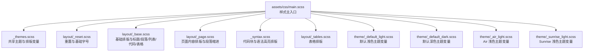
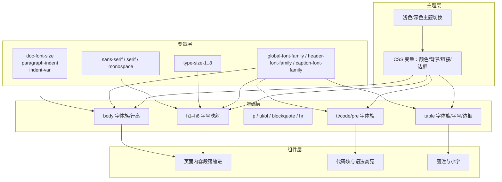
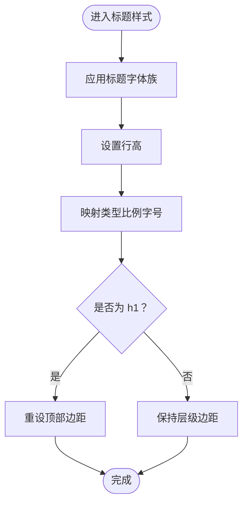
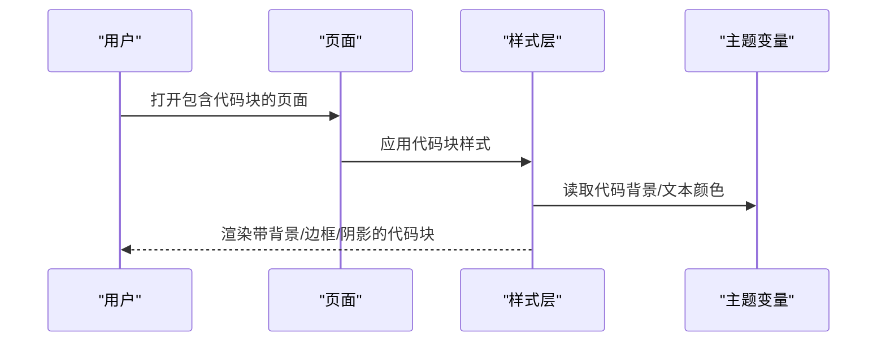
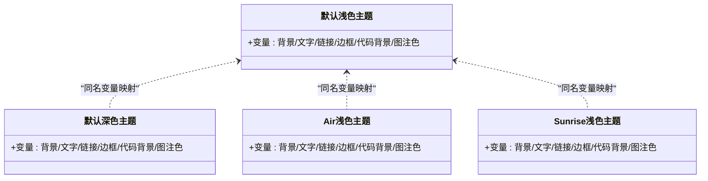
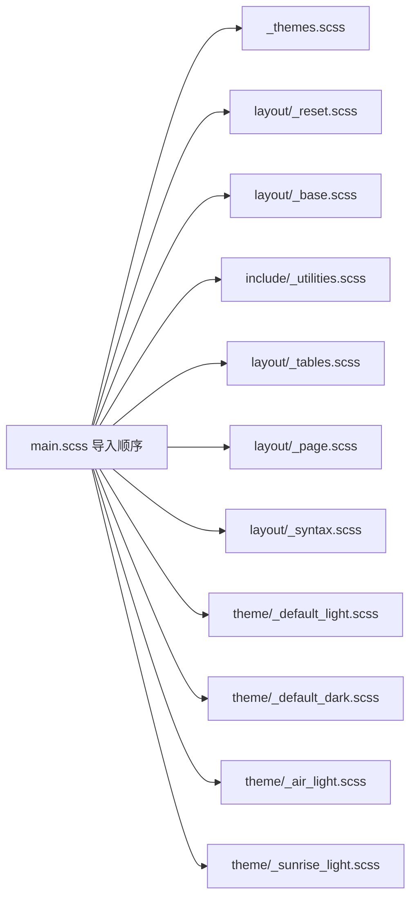

# 字体样式定制

<cite>
**本文引用的文件**
- [_themes.scss](file://_sass/_themes.scss)
- [main.scss](file://assets/css/main.scss)
- [base.scss](file://_sass/layout/_base.scss)
- [page.scss](file://_sass/layout/_page.scss)
- [tables.scss](file://_sass/layout/_tables.scss)
- [_syntax.scss](file://_sass/_syntax.scss)
- [_reset.scss](file://_sass/layout/_reset.scss)
- [_mixins.scss](file://_sass/include/_mixins.scss)
- [_config.yml](file://_config.yml)
- [default_light.scss](file://_sass/theme/_default_light.scss)
- [default_dark.scss](file://_sass/theme/_default_dark.scss)
- [air_light.scss](file://_sass/theme/_air_light.scss)
- [sunrise_light.scss](file://_sass/theme/_sunrise_light.scss)
</cite>

## 目录
1. [简介](#简介)
2. [项目结构](#项目结构)
3. [核心组件](#核心组件)
4. [架构总览](#架构总览)
5. [详细组件分析](#详细组件分析)
6. [依赖关系分析](#依赖关系分析)
7. [性能考量](#性能考量)
8. [故障排查指南](#故障排查指南)
9. [结论](#结论)
10. [附录](#附录)

## 简介
本指南聚焦于字体样式定制，涵盖字体族选择原则、跨平台兼容性、标题层级（h1–h6）样式、段落与列表、代码块与表格等文本元素的字体配置；同时阐述类型比例系统（type scale）的设计原理与使用方法，并给出字体粗细、行高、字间距等排版参数的调整技巧，以及中英文混排的处理建议与最佳实践。

## 项目结构
本项目基于 Jekyll + SCSS/Sass 的静态站点生成体系，字体与排版由共享主题设置、基础样式、页面样式、语法高亮与主题变量共同构成。核心入口为样式主文件，按依赖顺序导入各模块。

**图表来源**
- [main.scss:11-42](file://assets/css/main.scss#L11-L42)
- [_themes.scss:10-44](file://_sass/_themes.scss#L10-L44)
- [_reset.scss:11-19](file://_sass/layout/_reset.scss#L11-L19)
- [base.scss:18-61](file://_sass/layout/_base.scss#L18-L61)
- [page.scss:47-108](file://_sass/layout/_page.scss#L47-L108)
- [_syntax.scss:5-35](file://_sass/_syntax.scss#L5-L35)
- [tables.scss:5-16](file://_sass/layout/_tables.scss#L5-L16)
- [default_light.scss:30-47](file://_sass/theme/_default_light.scss#L30-L47)
- [default_dark.scss:38-55](file://_sass/theme/_default_dark.scss#L38-L55)
- [air_light.scss:38-55](file://_sass/theme/_air_light.scss#L38-L55)
- [sunrise_light.scss:40-57](file://_sass/theme/_sunrise_light.scss#L40-L57)

**章节来源**
- [main.scss:11-42](file://assets/css/main.scss#L11-L42)

## 核心组件
- 共享排版与字体族变量：定义文档基准字号、段落缩进、系统字体族、标题类型比例等。
- 基础排版样式：统一 body、标题、段落、列表、代码、表格等元素的字体族与字号。
- 页面内容排版：控制段落缩进、标题下划线、元信息与引用等排版细节。
- 代码与语法高亮：统一代码块字体、字号、行高与背景色。
- 主题变量：通过 CSS 变量在浅色/深色主题间切换时保持一致的排版风格。

**章节来源**
- [_themes.scss:10-44](file://_sass/_themes.scss#L10-L44)
- [base.scss:18-61](file://_sass/layout/_base.scss#L18-L61)
- [page.scss:47-108](file://_sass/layout/_page.scss#L47-L108)
- [_syntax.scss:5-35](file://_sass/_syntax.scss#L5-L35)

## 架构总览
字体与排版的实现遵循“变量层 → 基础层 → 组件层 → 主题层”的分层设计。变量层集中管理字体族、类型比例与断点；基础层统一全局排版；组件层细化到标题、段落、列表、代码块与表格；主题层通过 CSS 变量在不同主题间切换。

**图表来源**
- [_themes.scss:10-44](file://_sass/_themes.scss#L10-L44)
- [base.scss:18-61](file://_sass/layout/_base.scss#L18-L61)
- [page.scss:47-108](file://_sass/layout/_page.scss#L47-L108)
- [_syntax.scss:5-35](file://_sass/_syntax.scss#L5-L35)
- [tables.scss:5-16](file://_sass/layout/_tables.scss#L5-L16)
- [default_light.scss:30-47](file://_sass/theme/_default_light.scss#L30-L47)
- [default_dark.scss:38-55](file://_sass/theme/_default_dark.scss#L38-L55)

## 详细组件分析

### 字体族与跨平台兼容性
- 系统字体族优先：通过系统字体族变量提供跨平台一致的体验，避免网络字体加载失败导致的 FOUC 或回退闪烁。
- 字体族链：提供无衬线、衬线与等宽字体族链，确保在不同操作系统与浏览器上都有合适的后备字体。
- 字体族应用范围：
  - 全局正文与标题：使用全局字体族与标题字体族变量。
  - 代码块：统一使用等宽字体族。
  - 图注与小字：使用图注字体族变量。

最佳实践
- 将中文字体置于西文字体之前，以优先匹配中文字形。
- 在深色主题下适当提高对比度，保证可读性。
- 避免在同一页面内频繁切换字体族，保持一致性。

**章节来源**
- [_themes.scss:16-44](file://_sass/_themes.scss#L16-L44)
- [base.scss:18-61](file://_sass/layout/_base.scss#L18-L61)
- [_syntax.scss:31-34](file://_sass/_syntax.scss#L31-L34)
- [tables.scss:8-9](file://_sass/layout/_tables.scss#L8-L9)

### 类型比例系统（Type Scale）
- 定义了从 $type-size-1 到 $type-size-8 的比例序列，用于标题层级与小字的字号映射。
- 基准字号：文档基准字号用于 em 计算与缩放。
- 使用方式：标题 h1–h6 与小字 small、代码片段、图注等均直接引用类型比例变量，确保视觉层级一致。

设计原理
- 采用接近黄金比例的递减序列，使层级清晰且和谐。
- 通过统一的基准字号与 em 单位，实现响应式缩放与无障碍访问友好。

**章节来源**
- [_themes.scss:32-40](file://_sass/_themes.scss#L32-L40)
- [_themes.scss:10-10](file://_sass/_themes.scss#L10-L10)
- [base.scss:34-61](file://_sass/layout/_base.scss#L34-L61)
- [page.scss:47-49](file://_sass/layout/_page.scss#L47-L49)
- [_syntax.scss:13-13](file://_sass/_syntax.scss#L13-L13)

### 标题层级（h1–h6）样式定制
- h1–h6 统一设置字体族、行高与粗细，突出层级感。
- 各级标题对应不同的类型比例变量，形成清晰的视觉层级。
- h1 特殊处理：顶部边距归零，强调首屏标题权重。

定制要点
- 如需调整各级标题的相对大小，优先修改类型比例变量或在布局层覆盖具体字号。
- 行高与字重应与正文保持协调，避免视觉拥挤。

**图表来源**
- [base.scss:27-57](file://_sass/layout/_base.scss#L27-L57)

**章节来源**
- [base.scss:27-57](file://_sass/layout/_base.scss#L27-L57)

### 段落、列表与引用
- 段落默认行高与底部间距已设定，适合中文长文本阅读。
- 支持段落缩进：通过开关与缩进变量控制相邻段落的首行缩进，提升层次感。
- 列表项间距统一，嵌套列表有明确的上下间距。
- 引用块具有斜体、左侧装饰线与引用格式化。

定制建议
- 中文排版建议适当增大行高与字间距，提升可读性。
- 缩进策略仅在需要强调段落层次时启用，避免过度使用造成阅读负担。

**章节来源**
- [base.scss:63-85](file://_sass/layout/_base.scss#L63-L85)
- [page.scss:63-73](file://_sass/layout/_page.scss#L63-L73)
- [base.scss:96-113](file://_sass/layout/_base.scss#L96-L113)

### 代码块与内联代码
- 内联代码与代码块统一使用等宽字体族，确保代码可读性。
- 代码块具备背景色、边框、圆角与阴影，提升视觉层次。
- 语法高亮容器统一字号与行高，便于阅读多行代码。
- 链接内的代码与图注中的代码样式一致，保持品牌一致性。

定制建议
- 在深色主题下，适当调整代码背景与文本颜色对比度。
- 代码块字号不宜过小，避免在移动端阅读困难。

**图表来源**
- [base.scss:129-164](file://_sass/layout/_base.scss#L129-L164)
- [_syntax.scss:5-35](file://_sass/_syntax.scss#L5-L35)

**章节来源**
- [base.scss:129-164](file://_sass/layout/_base.scss#L129-L164)
- [_syntax.scss:5-35](file://_sass/_syntax.scss#L5-L35)

### 表格文本
- 表格统一使用全局字体族与较小字号，保证数据密度与可读性。
- 表头与单元格统一边框与内边距，配合主题边框色使用。

定制建议
- 对于中文表格，可适当增大字号与行高，避免字符拥挤。
- 颜色搭配需与主题一致，确保在浅/深色模式下均清晰可见。

**章节来源**
- [tables.scss:5-38](file://_sass/layout/_tables.scss#L5-L38)

### 图注与小字
- 图注与小字使用图注字体族与类型比例变量，确保与正文风格一致。
- 图注链接具备悬停态颜色与下划线变化，增强交互反馈。

**章节来源**
- [base.scss:249-267](file://_sass/layout/_base.scss#L249-L267)
- [page.scss:169-192](file://_sass/layout/_page.scss#L169-L192)

### 主题与 CSS 变量
- 主题通过 CSS 变量集中管理全局颜色与排版相关颜色，浅色/深色主题分别定义。
- 浅色/深色主题文件分别声明变量值，确保在不同主题下字体颜色与背景色协调。

**图表来源**
- [default_light.scss:30-47](file://_sass/theme/_default_light.scss#L30-L47)
- [default_dark.scss:38-55](file://_sass/theme/_default_dark.scss#L38-L55)
- [air_light.scss:38-55](file://_sass/theme/_air_light.scss#L38-L55)
- [sunrise_light.scss:40-57](file://_sass/theme/_sunrise_light.scss#L40-L57)

**章节来源**
- [default_light.scss:30-47](file://_sass/theme/_default_light.scss#L30-L47)
- [default_dark.scss:38-55](file://_sass/theme/_default_dark.scss#L38-L55)
- [air_light.scss:38-55](file://_sass/theme/_air_light.scss#L38-L55)
- [sunrise_light.scss:40-57](file://_sass/theme/_sunrise_light.scss#L40-L57)

## 依赖关系分析
样式主入口按顺序导入模块，确保变量先定义、再使用；主题变量在浅/深色主题文件中定义，最终被基础与组件样式引用。

**图表来源**
- [main.scss:11-42](file://assets/css/main.scss#L11-L42)

**章节来源**
- [main.scss:11-42](file://assets/css/main.scss#L11-L42)

## 性能考量
- 使用 em 与 rem 进行相对单位缩放，减少媒体查询数量，提升响应速度。
- 通过 CSS 变量集中管理颜色与排版相关颜色，降低重复计算与渲染成本。
- 代码块与语法高亮采用统一字号与行高，避免复杂布局抖动。

[本节为通用指导，无需特定文件引用]

## 故障排查指南
- 字体未生效或显示为方块
  - 检查字体族链顺序与可用性，确认系统字体存在。
  - 若使用自定义字体，检查路径与加载状态。
- 文字大小异常
  - 检查基准字号与类型比例变量是否被覆盖。
  - 确认断点下的字号变化逻辑。
- 深浅色主题切换后文字颜色不一致
  - 检查主题变量是否正确注入 CSS 变量。
  - 确认页面是否正确引入对应主题文件。
- 代码块颜色对比度不足
  - 在深色主题下调低代码背景色亮度或提高文本色亮度。
  - 保持与主题边框色的对比度满足可读性要求。

**章节来源**
- [_themes.scss:10-44](file://_sass/_themes.scss#L10-L44)
- [default_dark.scss:38-55](file://_sass/theme/_default_dark.scss#L38-L55)
- [default_light.scss:30-47](file://_sass/theme/_default_light.scss#L30-L47)
- [_syntax.scss:5-35](file://_sass/_syntax.scss#L5-L35)

## 结论
本项目通过变量层、基础层、组件层与主题层的协同，实现了稳定、可扩展且跨平台一致的字体与排版体系。借助类型比例系统与 CSS 变量，可在不破坏整体风格的前提下灵活调整各级标题与文本元素的视觉权重，并在深浅主题间保持一致的阅读体验。建议在实际项目中结合内容特性与目标语言（尤其是中英文混排场景）进一步微调行高、字间距与颜色对比度，以获得更佳的可读性与品牌一致性。

## 附录

### 字体参数与变量速查
- 基准字号：用于 em 计算与缩放
- 段落缩进：开关与缩进幅度
- 字体族：全局正文、标题、图注、等宽
- 类型比例：h1–h6、小字、代码块、语法高亮、表格等

**章节来源**
- [_themes.scss:10-44](file://_sass/_themes.scss#L10-L44)
- [base.scss:18-61](file://_sass/layout/_base.scss#L18-L61)
- [page.scss:47-108](file://_sass/layout/_page.scss#L47-L108)
- [_syntax.scss:5-35](file://_sass/_syntax.scss#L5-L35)
- [tables.scss:5-16](file://_sass/layout/_tables.scss#L5-L16)

### 中英文混排最佳实践
- 字体链优先：将中文字体置于西文字体前，确保中文字形优先匹配。
- 行高与字间距：中文建议适当增大行高与字间距，避免拥挤。
- 代码与数学公式：统一使用等宽字体，保证对齐与可读性。
- 主题一致性：在深浅主题下保持颜色对比度与可读性。

**章节来源**
- [_themes.scss:16-44](file://_sass/_themes.scss#L16-L44)
- [base.scss:129-164](file://_sass/layout/_base.scss#L129-L164)
- [_syntax.scss:31-34](file://_sass/_syntax.scss#L31-L34)