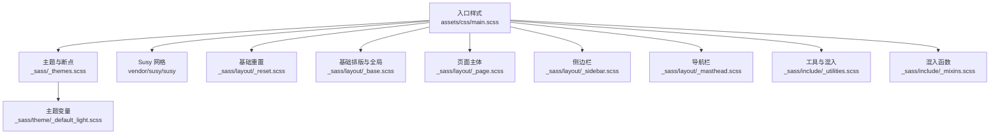
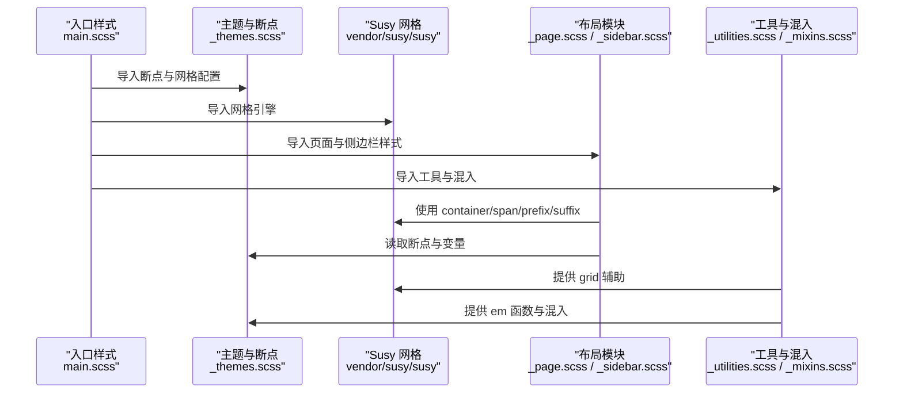
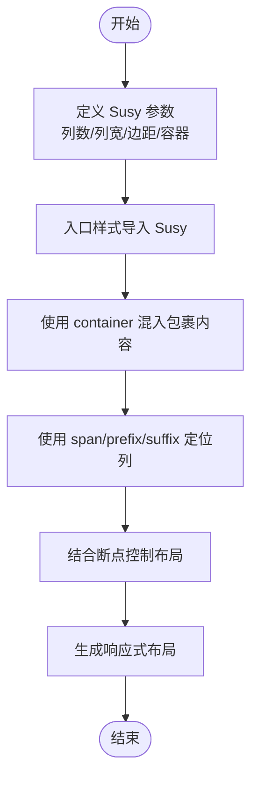
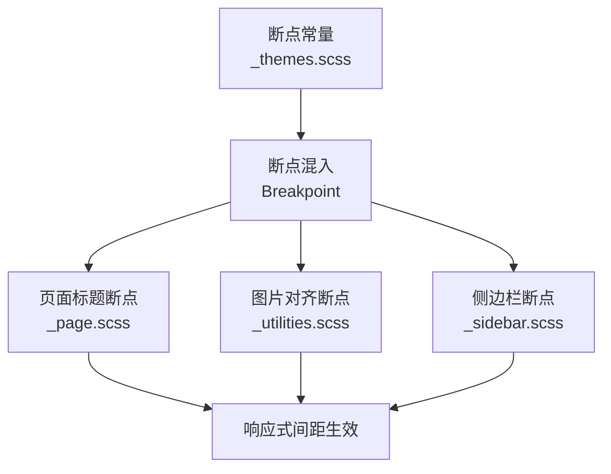
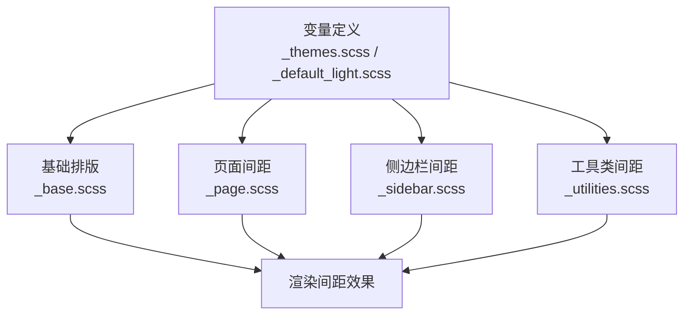
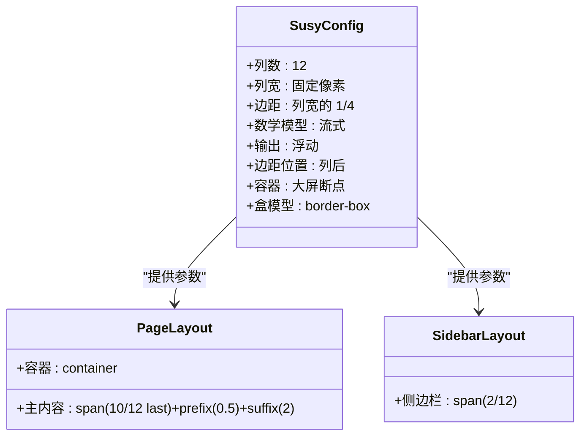
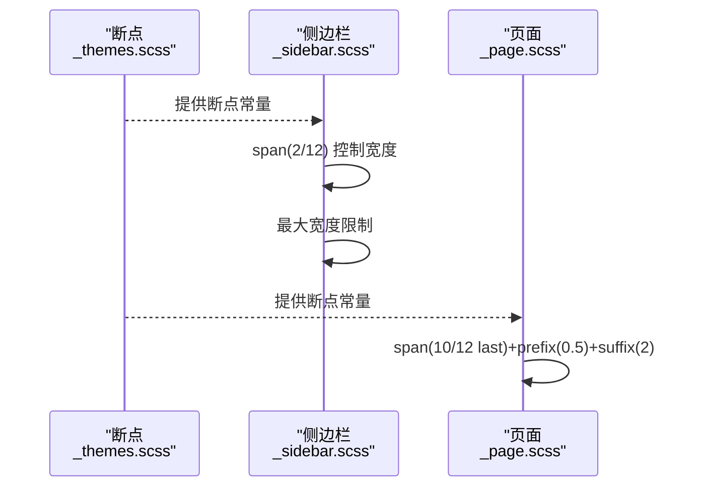
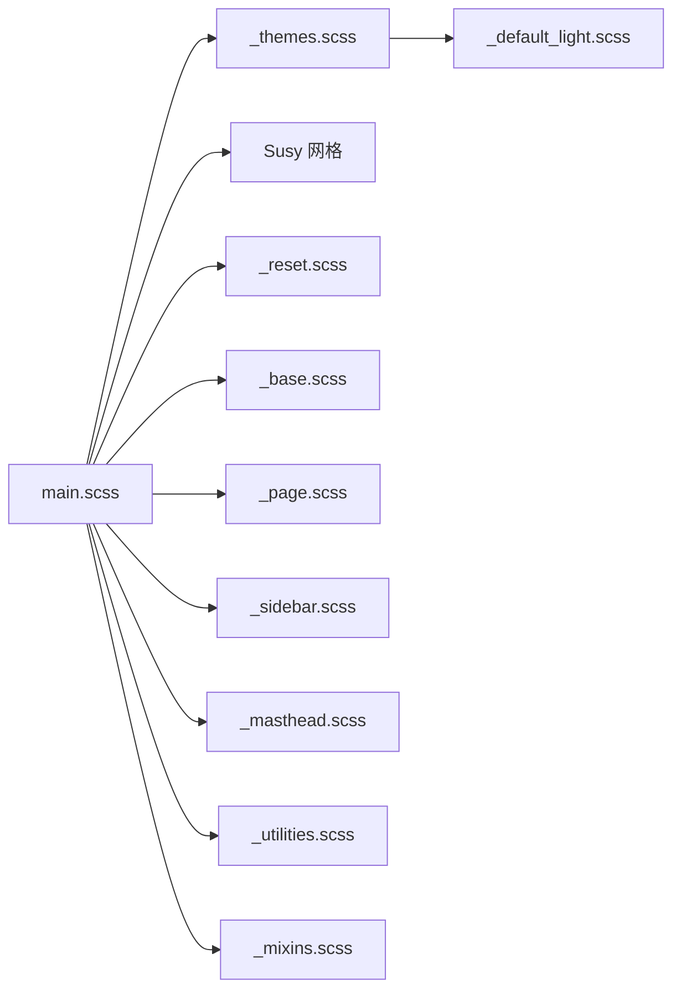

# 布局间距系统

<cite>
**本文引用的文件**
- [_config.yml](file://_config.yml)
- [main.scss](file://assets/css/main.scss)
- [_themes.scss](file://_sass/_themes.scss)
- [_mixins.scss](file://_sass/include/_mixins.scss)
- [_utilities.scss](file://_sass/include/_utilities.scss)
- [_base.scss](file://_sass/layout/_base.scss)
- [_sidebar.scss](file://_sass/layout/_sidebar.scss)
- [_page.scss](file://_sass/layout/_page.scss)
- [_masthead.scss](file://_sass/layout/_masthead.scss)
- [_reset.scss](file://_sass/layout/_reset.scss)
- [_default_light.scss](file://_sass/theme/_default_light.scss)
</cite>

## 目录
1. [简介](#简介)
2. [项目结构](#项目结构)
3. [核心组件](#核心组件)
4. [架构总览](#架构总览)
5. [详细组件分析](#详细组件分析)
6. [依赖关系分析](#依赖关系分析)
7. [性能考量](#性能考量)
8. [故障排查指南](#故障排查指南)
9. [结论](#结论)
10. [附录](#附录)

## 简介
本指南聚焦于该 Jekyll 主题的布局与间距系统，系统性讲解以下内容：
- Susy 网格系统的配置与使用方法
- 边距、内边距、间距变量的定义与命名规范
- 响应式间距调整的实现与断点设置
- 容器宽度、列数、边距等布局参数的配置
- 侧边栏宽度与主内容区布局的定制
- 完整的布局系统示例与调试技巧

## 项目结构
该站点采用 SCSS 分层组织，通过入口样式文件统一导入各模块，Susy 作为网格引擎，Breakpoint 作为媒体查询断点工具，配合主题变量与工具类实现一致的间距体系。

图表来源
- [main.scss:11-43](file://assets/css/main.scss#L11-L43)
- [_themes.scss:66-75](file://_sass/_themes.scss#L66-L75)
- [_default_light.scss:30-47](file://_sass/theme/_default_light.scss#L30-L47)

章节来源
- [main.scss:11-43](file://assets/css/main.scss#L11-L43)
- [_themes.scss:46-75](file://_sass/_themes.scss#L46-L75)

## 核心组件
- 断点与网格配置：在主题文件中集中定义断点与 Susy 网格参数，确保全局一致性。
- 主题变量：通过 CSS 自定义属性与 SCSS 变量统一管理颜色、尺寸、间距等视觉变量。
- 工具类与混入：提供容器、栅格定位、响应式辅助等通用能力。
- 页面与侧边栏布局：基于 Susy 的 span/prefix/suffix/container 混入实现主内容与侧边栏的栅格布局。

章节来源
- [_themes.scss:46-75](file://_sass/_themes.scss#L46-L75)
- [_default_light.scss:30-47](file://_sass/theme/_default_light.scss#L30-L47)
- [_utilities.scss:116](file://_sass/include/_utilities.scss#L116)
- [_page.scss:5-35](file://_sass/layout/_page.scss#L5-L35)
- [_sidebar.scss:9-77](file://_sass/layout/_sidebar.scss#L9-L77)

## 架构总览
下图展示从入口到布局的关键流程：入口样式导入主题与网格，主题定义断点与网格参数，页面与侧边栏通过混入应用网格与容器，最终渲染为响应式布局。

图表来源
- [main.scss:11-43](file://assets/css/main.scss#L11-L43)
- [_themes.scss:46-75](file://_sass/_themes.scss#L46-L75)
- [_page.scss:5-35](file://_sass/layout/_page.scss#L5-L35)
- [_sidebar.scss:9-77](file://_sass/layout/_sidebar.scss#L9-L77)
- [_utilities.scss:116](file://_sass/include/_utilities.scss#L116)
- [_mixins.scss:17-19](file://_sass/include/_mixins.scss#L17-L19)

## 详细组件分析

### Susy 网格系统配置与使用
- 网格参数
  - 列数：12 列
  - 列宽：固定像素值
  - 边距比例：列宽的 1/4
  - 数学模型：流式（fluid）
  - 输出方式：浮动（float）
  - 边距位置：列后（after）
  - 容器宽度：由断点常量决定
  - 全局盒模型：border-box
- 在页面与侧边栏中通过混入应用网格：
  - 容器：用于包裹内容区域
  - 列定位：span、prefix、suffix 实现列跨度与前后留白
  - 侧边栏在大屏断点下使用 span(2 of 12) 控制宽度
  - 主内容在大屏断点下使用 span(10 of 12 last) 与前/后留白组合

图表来源
- [_themes.scss:66-75](file://_sass/_themes.scss#L66-L75)
- [main.scss:19](file://assets/css/main.scss#L19)
- [_page.scss:5-35](file://_sass/layout/_page.scss#L5-L35)
- [_sidebar.scss:27-41](file://_sass/layout/_sidebar.scss#L27-L41)

章节来源
- [_themes.scss:66-75](file://_sass/_themes.scss#L66-L75)
- [_page.scss:5-35](file://_sass/layout/_page.scss#L5-L35)
- [_sidebar.scss:27-41](file://_sass/layout/_sidebar.scss#L27-L41)

### 断点与响应式间距
- 断点常量
  - 小屏：600px
  - 中屏：768px
  - 中宽屏：900px
  - 大屏：925px
  - 超大屏：1280px
- 断点工具
  - 以 em 为单位的断点设置
  - 在页面标题、图片对齐、侧边栏固定等场景使用断点控制行为
- 间距变量
  - 字体大小、段落缩进、边距等通过变量统一管理
  - 通过主题变量与 CSS 自定义属性实现明暗主题的一致间距体验

图表来源
- [_themes.scss:50-56](file://_sass/_themes.scss#L50-L56)
- [_page.scss:156-159](file://_sass/layout/_page.scss#L156-L159)
- [_utilities.scss:140-157](file://_sass/include/_utilities.scss#L140-L157)
- [_sidebar.scss:20-41](file://_sass/layout/_sidebar.scss#L20-L41)

章节来源
- [_themes.scss:50-56](file://_sass/_themes.scss#L50-L56)
- [_page.scss:156-159](file://_sass/layout/_page.scss#L156-L159)
- [_utilities.scss:140-157](file://_sass/include/_utilities.scss#L140-L157)
- [_sidebar.scss:20-41](file://_sass/layout/_sidebar.scss#L20-L41)

### 边距、内边距与间距变量规范
- 边距与内边距
  - 页面主体容器使用 container 混入包裹，并在两侧添加内边距
  - 侧边栏在大屏断点下使用 span 与 margin-left 控制左右留白
  - 图片对齐在小屏断点下使用 margin 控制间距
- 间距变量
  - 字号缩放、段落缩进、边框圆角、阴影等通过变量统一管理
  - 主题变量与 CSS 自定义属性协同，保证不同主题下的间距一致性

图表来源
- [_themes.scss:33-44](file://_sass/_themes.scss#L33-L44)
- [_default_light.scss:20-27](file://_sass/theme/_default_light.scss#L20-L27)
- [_base.scss:15-25](file://_sass/layout/_base.scss#L15-L25)
- [_page.scss:9-11](file://_sass/layout/_page.scss#L9-L11)
- [_sidebar.scss:13-18](file://_sass/layout/_sidebar.scss#L13-L18)
- [_utilities.scss:140-157](file://_sass/include/_utilities.scss#L140-L157)

章节来源
- [_themes.scss:33-44](file://_sass/_themes.scss#L33-L44)
- [_default_light.scss:20-27](file://_sass/theme/_default_light.scss#L20-L27)
- [_base.scss:15-25](file://_sass/layout/_base.scss#L15-L25)
- [_page.scss:9-11](file://_sass/layout/_page.scss#L9-L11)
- [_sidebar.scss:13-18](file://_sass/layout/_sidebar.scss#L13-L18)
- [_utilities.scss:140-157](file://_sass/include/_utilities.scss#L140-L157)

### 容器宽度、列数与边距配置
- 容器宽度
  - 由断点常量与网格容器共同决定，超大屏下限制最大宽度
- 列数与边距
  - 12 列网格，边距为列宽的 1/4，支持流式布局与浮动输出
- 应用示例
  - 侧边栏：span(2 of 12)
  - 主内容：span(10 of 12 last)，前缀 0.5 列，后缀 2 列

图表来源
- [_themes.scss:66-75](file://_sass/_themes.scss#L66-L75)
- [_page.scss:20-24](file://_sass/layout/_page.scss#L20-L24)
- [_sidebar.scss:27-36](file://_sass/layout/_sidebar.scss#L27-L36)

章节来源
- [_themes.scss:66-75](file://_sass/_themes.scss#L66-L75)
- [_page.scss:20-24](file://_sass/layout/_page.scss#L20-L24)
- [_sidebar.scss:27-36](file://_sass/layout/_sidebar.scss#L27-L36)

### 侧边栏宽度与主内容区布局定制
- 侧边栏宽度
  - 在大屏断点下使用 span(2 of 12) 固定宽度
  - 在更大断点下限制最大宽度
- 主内容区布局
  - 使用 span(10 of 12 last) 配合前/后留白，形成主内容区
- 侧边栏固定与滚动
  - 在特定断点以上启用固定定位与溢出滚动，提升阅读体验

图表来源
- [_themes.scss:50-56](file://_sass/_themes.scss#L50-L56)
- [_sidebar.scss:27-41](file://_sass/layout/_sidebar.scss#L27-L41)
- [_page.scss:20-24](file://_sass/layout/_page.scss#L20-L24)

章节来源
- [_themes.scss:50-56](file://_sass/_themes.scss#L50-L56)
- [_sidebar.scss:27-41](file://_sass/layout/_sidebar.scss#L27-L41)
- [_page.scss:20-24](file://_sass/layout/_page.scss#L20-L24)

### 布局系统示例与调试技巧
- 示例路径
  - 页面主体容器与内容区：[_page.scss:5-35](file://_sass/layout/_page.scss#L5-L35)
  - 侧边栏与目录：[_sidebar.scss:9-137](file://_sass/layout/_sidebar.scss#L9-L137)
  - 基础排版与全局边距：[_base.scss:15-25](file://_sass/layout/_base.scss#L15-L25)
  - 工具类与断点使用：[_utilities.scss:116-173](file://_sass/include/_utilities.scss#L116-L173)
- 调试技巧
  - 使用浏览器开发者工具检查元素的盒模型与断点触发
  - 通过切换断点观察 span/prefix/suffix 的布局变化
  - 利用工具类快速验证间距与对齐效果

章节来源
- [_page.scss:5-35](file://_sass/layout/_page.scss#L5-L35)
- [_sidebar.scss:9-137](file://_sass/layout/_sidebar.scss#L9-L137)
- [_base.scss:15-25](file://_sass/layout/_base.scss#L15-L25)
- [_utilities.scss:116-173](file://_sass/include/_utilities.scss#L116-L173)

## 依赖关系分析
- 入口样式依赖主题与网格引擎，再驱动布局模块与工具类
- 断点与网格参数集中于主题文件，确保全局一致性
- 页面与侧边栏通过混入直接消费断点与网格参数

图表来源
- [main.scss:11-43](file://assets/css/main.scss#L11-L43)
- [_themes.scss:66-75](file://_sass/_themes.scss#L66-L75)
- [_default_light.scss:30-47](file://_sass/theme/_default_light.scss#L30-L47)

章节来源
- [main.scss:11-43](file://assets/css/main.scss#L11-L43)
- [_themes.scss:66-75](file://_sass/_themes.scss#L66-L75)
- [_default_light.scss:30-47](file://_sass/theme/_default_light.scss#L30-L47)

## 性能考量
- 样式压缩：构建时启用压缩输出，减少传输体积
- 断点与网格参数集中管理，避免重复计算与冗余规则
- 合理使用工具类与混入，避免过度嵌套导致选择器复杂度上升

## 故障排查指南
- 断点不生效
  - 检查断点混入是否正确引入与设置
  - 确认断点常量与媒体查询条件匹配
- 网格错位
  - 核对 span/prefix/suffix 的列数与顺序
  - 确保容器混入包裹了内容区域
- 侧边栏未固定或滚动异常
  - 检查断点阈值与固定定位条件
  - 确认顶部偏移与导航高度一致

章节来源
- [_themes.scss:50-56](file://_sass/_themes.scss#L50-L56)
- [_page.scss:5-35](file://_sass/layout/_page.scss#L5-L35)
- [_sidebar.scss:20-41](file://_sass/layout/_sidebar.scss#L20-L41)

## 结论
该布局间距系统通过 Susy 网格与 Breakpoint 断点工具，结合主题变量与工具类，实现了可维护、可扩展且响应式的布局方案。建议在定制时遵循统一的变量命名与断点策略，确保跨设备与主题的一致体验。

## 附录
- 入口样式与导入顺序参考：[main.scss:11-43](file://assets/css/main.scss#L11-L43)
- 网格与断点配置参考：[_themes.scss:46-75](file://_sass/_themes.scss#L46-L75)
- 主题变量与 CSS 自定义属性参考：[_default_light.scss:30-47](file://_sass/theme/_default_light.scss#L30-L47)
- 页面与侧边栏布局参考：[_page.scss:5-35](file://_sass/layout/_page.scss#L5-L35)、[_sidebar.scss:9-77](file://_sass/layout/_sidebar.scss#L9-L77)
- 基础排版与全局边距参考：[_base.scss:15-25](file://_sass/layout/_base.scss#L15-L25)
- 工具类与断点使用参考：[_utilities.scss:116-173](file://_sass/include/_utilities.scss#L116-L173)