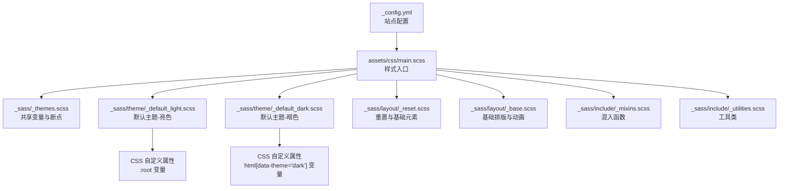
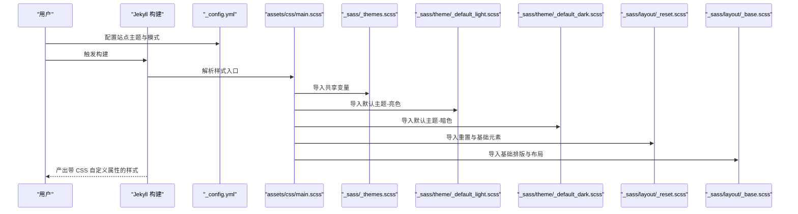
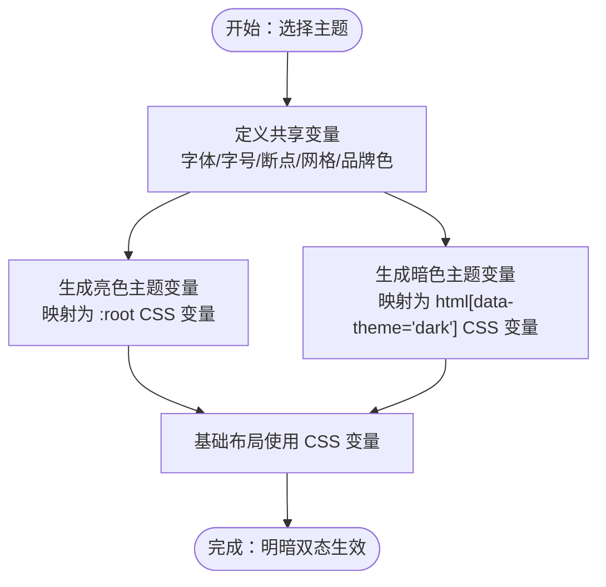
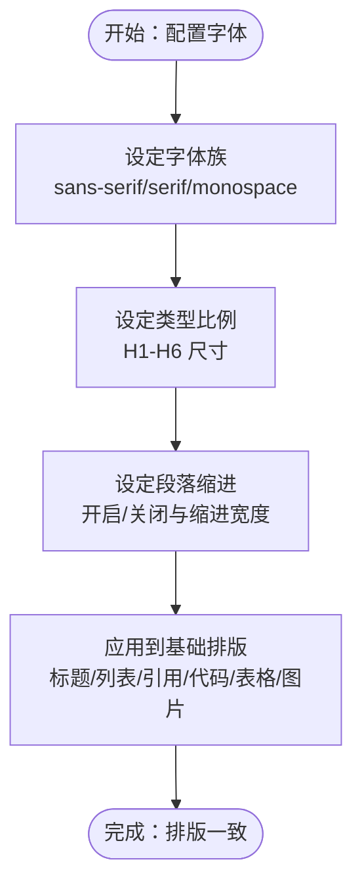
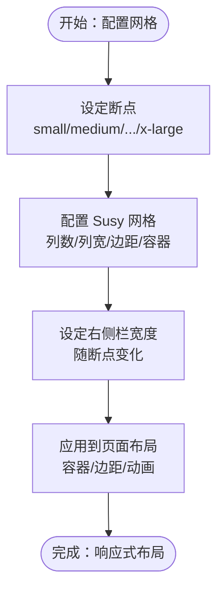
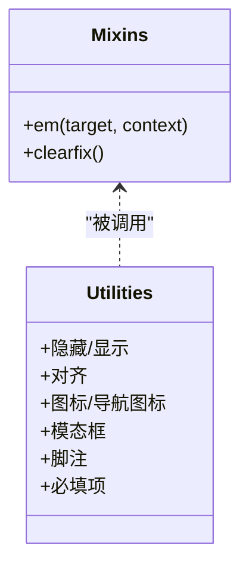
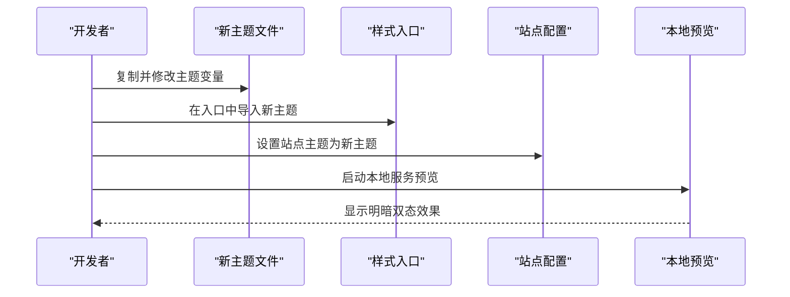
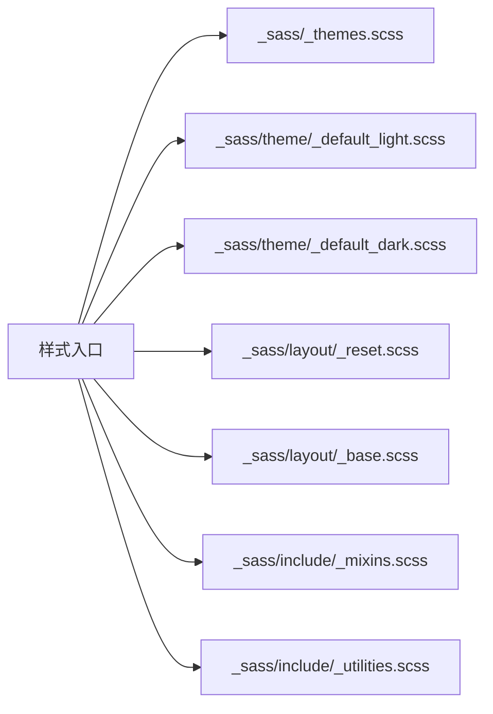

# 自定义主题开发

<cite>
**本文引用的文件**
- [_config.yml](file://_config.yml)
- [assets/css/main.scss](file://assets/css/main.scss)
- [_sass/_themes.scss](file://_sass/_themes.scss)
- [_sass/layout/_base.scss](file://_sass/layout/_base.scss)
- [_sass/layout/_reset.scss](file://_sass/layout/_reset.scss)
- [_sass/include/_mixins.scss](file://_sass/include/_mixins.scss)
- [_sass/include/_utilities.scss](file://_sass/include/_utilities.scss)
- [_sass/theme/_default_light.scss](file://_sass/theme/_default_light.scss)
- [_sass/theme/_default_dark.scss](file://_sass/theme/_default_dark.scss)
- [_sass/theme/_air_light.scss](file://_sass/theme/_air_light.scss)
- [_sass/theme/_contrast_light.scss](file://_sass/theme/_contrast_light.scss)
- [README.md](file://README.md)
- [package.json](file://package.json)
</cite>

## 目录
1. [简介](#简介)
2. [项目结构](#项目结构)
3. [核心组件](#核心组件)
4. [架构总览](#架构总览)
5. [详细组件分析](#详细组件分析)
6. [依赖关系分析](#依赖关系分析)
7. [性能考量](#性能考量)
8. [故障排查指南](#故障排查指南)
9. [结论](#结论)
10. [附录](#附录)

## 简介
本指南面向希望在 Academic Pages 主题基础上创建或定制自定义主题的开发者。内容涵盖从零开始的主题搭建、文件结构规划、变量与样式组织、颜色与字体体系、间距与布局系统、主题测试与调试，以及兼容性与浏览器支持建议。读者无需深入的前端背景，也能循序渐进地完成从简单颜色修改到复杂视觉效果的定制。

## 项目结构
Academic Pages 使用 Jekyll + SCSS 构建，主题系统通过 SCSS 变量与 CSS 自定义属性实现“明暗双态”。核心结构要点如下：
- 全局配置：站点主题选择、输出风格、插件等由站点配置控制
- 样式入口：通过样式入口文件按顺序导入主题与布局模块
- 主题变量：统一在共享变量文件中定义类型、断点、网格、品牌色等
- 明暗主题：每个主题提供“亮色”和“暗色”两套变量与 CSS 自定义属性
- 布局与工具：基础重置、基础排版、工具类、混入等模块化组织

图表来源
- [_config.yml:10](file://_config.yml#L10)
- [assets/css/main.scss:11-43](file://assets/css/main.scss#L11-L43)
- [_sass/_themes.scss:10-104](file://_sass/_themes.scss#L10-L104)
- [_sass/theme/_default_light.scss:30-49](file://_sass/theme/_default_light.scss#L30-L49)
- [_sass/theme/_default_dark.scss:38-57](file://_sass/theme/_default_dark.scss#L38-L57)
- [_sass/layout/_reset.scss:1-179](file://_sass/layout/_reset.scss#L1-L179)
- [_sass/layout/_base.scss:1-365](file://_sass/layout/_base.scss#L1-L365)
- [_sass/include/_mixins.scss:1-53](file://_sass/include/_mixins.scss#L1-L53)
- [_sass/include/_utilities.scss:1-501](file://_sass/include/_utilities.scss#L1-L501)

章节来源
- [_config.yml:10](file://_config.yml#L10)
- [assets/css/main.scss:11-43](file://assets/css/main.scss#L11-L43)
- [_sass/_themes.scss:10-104](file://_sass/_themes.scss#L10-L104)

## 核心组件
- 站点配置与主题选择
  - 在站点配置中选择主题（如 default/air/sunrise/mint/dirt/contrast），并可切换明暗模式
- 样式入口与导入顺序
  - 样式入口文件负责按依赖顺序导入混入、网格、主题、布局与语法高亮等模块
- 共享变量与断点
  - 定义字号、类型比例、字体族、断点、网格参数与品牌色
- 明暗主题变量
  - 每个主题提供亮色与暗色两套变量，并映射为 CSS 自定义属性，供全局使用
- 基础与布局样式
  - 重置与基础元素、基础排版、动画过渡、打印样式等
- 工具类与混入
  - 提供可见性、对齐、图标、导航图标、模态框、脚注等通用样式与混入函数

章节来源
- [_config.yml:10](file://_config.yml#L10)
- [assets/css/main.scss:11-43](file://assets/css/main.scss#L11-L43)
- [_sass/_themes.scss:10-104](file://_sass/_themes.scss#L10-L104)
- [_sass/layout/_reset.scss:1-179](file://_sass/layout/_reset.scss#L1-L179)
- [_sass/layout/_base.scss:1-365](file://_sass/layout/_base.scss#L1-L365)
- [_sass/include/_mixins.scss:1-53](file://_sass/include/_mixins.scss#L1-L53)
- [_sass/include/_utilities.scss:1-501](file://_sass/include/_utilities.scss#L1-L501)

## 架构总览
下图展示了主题系统在构建时的加载与生效流程：站点配置决定主题与模式，样式入口按顺序导入模块，最终生成带变量与自定义属性的 CSS。

图表来源
- [_config.yml:10](file://_config.yml#L10)
- [assets/css/main.scss:11-43](file://assets/css/main.scss#L11-L43)
- [_sass/_themes.scss:10-104](file://_sass/_themes.scss#L10-L104)
- [_sass/theme/_default_light.scss:30-49](file://_sass/theme/_default_light.scss#L30-L49)
- [_sass/theme/_default_dark.scss:38-57](file://_sass/theme/_default_dark.scss#L38-L57)
- [_sass/layout/_reset.scss:1-179](file://_sass/layout/_reset.scss#L1-L179)
- [_sass/layout/_base.scss:1-365](file://_sass/layout/_base.scss#L1-L365)

## 详细组件分析

### 组件一：主题变量与颜色体系
- 共享变量
  - 字体与字号：文档字号、段落缩进、系统字体族、类型比例等
  - 断点与网格：移动端断点、Susy 网格参数、右侧栏宽度等
  - 品牌色：社交平台色板，用于图标着色
- 明暗主题映射
  - 亮色主题：以 :root 变量形式暴露全局颜色
  - 暗色主题：以 html[data-theme="dark"] 作用域内的变量覆盖
- 颜色分类
  - 主色调与辅助色：主色、危险/成功/警告/信息色
  - 背景色与边框色：背景、页脚、边框、表格头等
  - 文本与链接色：正文、弱文本、链接、悬停、已访问等

图表来源
- [_sass/_themes.scss:10-104](file://_sass/_themes.scss#L10-L104)
- [_sass/theme/_default_light.scss:30-49](file://_sass/theme/_default_light.scss#L30-L49)
- [_sass/theme/_default_dark.scss:38-57](file://_sass/theme/_default_dark.scss#L38-L57)
- [_sass/layout/_base.scss:10-25](file://_sass/layout/_base.scss#L10-L25)

章节来源
- [_sass/_themes.scss:10-104](file://_sass/_themes.scss#L10-L104)
- [_sass/theme/_default_light.scss:5-49](file://_sass/theme/_default_light.scss#L5-L49)
- [_sass/theme/_default_dark.scss:6-57](file://_sass/theme/_default_dark.scss#L6-L57)

### 组件二：字体与排版系统
- 字体族
  - 无衬线、衬线、等宽字体族；标题与正文分别使用不同字体族
- 类型比例
  - 从 H1 到 H6 的字号比例，配合行高与字重
- 段落与缩进
  - 支持段落缩进开关与缩进宽度
- 基础排版
  - 标题间距、列表样式、引用块、代码块、表格、图片与图注等

图表来源
- [_sass/_themes.scss:16-45](file://_sass/_themes.scss#L16-L45)
- [_sass/layout/_base.scss:27-165](file://_sass/layout/_base.scss#L27-L165)

章节来源
- [_sass/_themes.scss:16-45](file://_sass/_themes.scss#L16-L45)
- [_sass/layout/_base.scss:27-165](file://_sass/layout/_base.scss#L27-L165)

### 组件三：间距与布局系统
- 断点与网格
  - 多级断点（small/medium/medium-wide/large/x-large）
  - Susy 流式网格：列数、列宽、边距、容器宽度、盒模型
- 页面容器与侧边栏
  - 右侧栏宽度随断点变化，容器宽度受断点控制
- 基础布局
  - body 上下边距、滚动与粘性页脚、动画过渡、打印样式

图表来源
- [_sass/_themes.scss:50-76](file://_sass/_themes.scss#L50-L76)
- [_sass/layout/_base.scss:10-25](file://_sass/layout/_base.scss#L10-L25)

章节来源
- [_sass/_themes.scss:50-76](file://_sass/_themes.scss#L50-L76)
- [_sass/layout/_base.scss:10-25](file://_sass/layout/_base.scss#L10-L25)

### 组件四：工具类与混入
- 工具类
  - 可见性、对齐、图标、导航图标、模态框、脚注、必填项等
- 混入
  - 清除浮动、em 计算函数、焦点样式等

图表来源
- [_sass/include/_mixins.scss:17-53](file://_sass/include/_mixins.scss#L17-L53)
- [_sass/include/_utilities.scss:1-501](file://_sass/include/_utilities.scss#L1-L501)

章节来源
- [_sass/include/_mixins.scss:17-53](file://_sass/include/_mixins.scss#L17-L53)
- [_sass/include/_utilities.scss:1-501](file://_sass/include/_utilities.scss#L1-L501)

### 组件五：从零开始创建新主题（实践步骤）
- 步骤一：复制现有主题
  - 在主题目录中复制一份现有主题文件（例如复制默认主题的亮/暗色文件），改名为你的新主题名
- 步骤二：修改主题变量
  - 在新主题文件中调整主色、辅助色、背景色、文本色、链接色等
  - 同步更新 CSS 自定义属性映射，确保 :root 与 html[data-theme="dark"] 均有对应变量
- 步骤三：调整共享变量
  - 如需变更断点、网格、字号比例或字体族，可在共享变量文件中统一修改
- 步骤四：在样式入口中引入新主题
  - 在样式入口文件中添加新主题的导入路径，注意导入顺序（先主题，再布局）
- 步骤五：在站点配置中启用新主题
  - 在站点配置中将主题设置为你新建的主题名称
- 步骤六：本地预览与调试
  - 使用本地服务启动预览，观察明暗模式下的颜色与布局是否符合预期

图表来源
- [assets/css/main.scss:14-16](file://assets/css/main.scss#L14-L16)
- [_config.yml:10](file://_config.yml#L10)

章节来源
- [assets/css/main.scss:14-16](file://assets/css/main.scss#L14-L16)
- [_config.yml:10](file://_config.yml#L10)

### 组件六：颜色方案定制（主色/辅色/背景）
- 主色调
  - 修改主题文件中的主色变量，影响链接、按钮、强调元素等
- 辅助色
  - 危险/成功/警告/信息色用于状态提示与交互反馈
- 背景与边框
  - 背景、页脚、边框、表格头等颜色应与主色协调
- 文本与链接
  - 正文、弱文本、链接、悬停、已访问等颜色需保证对比度与可读性
- 明暗模式一致性
  - 亮/暗两套变量均需更新，确保在不同模式下视觉一致

章节来源
- [_sass/theme/_air_light.scss:5-56](file://_sass/theme/_air_light.scss#L5-L56)
- [_sass/theme/_contrast_light.scss:4-97](file://_sass/theme/_contrast_light.scss#L4-L97)
- [_sass/layout/_base.scss:117-165](file://_sass/layout/_base.scss#L117-L165)

### 组件七：字体配置（族/字号/字重）
- 字体族选择
  - 根据中英文混排与可读性选择合适的 sans-serif/serif/monospace
- 字号与比例
  - 使用类型比例变量统一标题层级，避免跳跃式字号
- 字重与行高
  - 标题使用较粗字重，正文保持适中行高，提升阅读体验
- 代码与引用
  - 代码块与引用块使用等宽或衬线字体，增强语义区分

章节来源
- [_sass/_themes.scss:16-45](file://_sass/_themes.scss#L16-L45)
- [_sass/layout/_base.scss:27-165](file://_sass/layout/_base.scss#L27-L165)

### 组件八：间距与布局定制
- 断点策略
  - 结合目标设备与内容密度，合理设置断点，避免频繁跳变
- 网格与留白
  - 使用 Susy 网格控制列宽与边距，确保内容在不同屏幕下的平衡
- 侧边栏与主内容区
  - 控制右侧栏最大宽度与最小可视宽度，保证信息密度与可读性
- 动画与过渡
  - 合理使用过渡时间与缓动函数，提升交互质感

章节来源
- [_sass/_themes.scss:50-76](file://_sass/_themes.scss#L50-L76)
- [_sass/layout/_base.scss:342-346](file://_sass/layout/_base.scss#L342-L346)

### 组件九：主题测试与调试
- 本地预览
  - 使用本地服务实时查看明暗模式切换与响应式效果
- 浏览器检查
  - 通过开发者工具检查 CSS 变量是否正确生效，定位样式冲突
- 打印样式
  - 检查打印样式是否隐藏不必要的元素，保留关键内容
- 性能优化
  - 关注样式体积与重绘，避免过度嵌套与重复变量

章节来源
- [README.md:52](file://README.md#L52)
- [_sass/layout/_base.scss:356-365](file://_sass/layout/_base.scss#L356-L365)

### 组件十：兼容性与浏览器支持
- CSS 变量
  - 使用 CSS 自定义属性实现明暗切换，需关注旧版浏览器支持情况
- 响应式与网格
  - Susy 与断点在现代浏览器中表现稳定，注意对旧版 IE 的降级处理
- 字体与图标
  - 字体回退与图标库版本需与目标环境匹配
- 构建与打包
  - JS 依赖通过 npm 管理，确保构建脚本在 CI/CD 中可用

章节来源
- [_sass/theme/_default_light.scss:30-49](file://_sass/theme/_default_light.scss#L30-L49)
- [_sass/theme/_default_dark.scss:38-57](file://_sass/theme/_default_dark.scss#L38-L57)
- [package.json:26-41](file://package.json#L26-L41)

## 依赖关系分析
- 样式入口依赖于共享变量与主题文件，再依次导入布局与工具模块
- 明暗主题通过 CSS 自定义属性在运行时切换，不依赖额外 JS
- 布局与工具模块相互独立，便于按需扩展

图表来源
- [assets/css/main.scss:11-43](file://assets/css/main.scss#L11-L43)
- [_sass/_themes.scss:10-104](file://_sass/_themes.scss#L10-L104)
- [_sass/layout/_reset.scss:1-179](file://_sass/layout/_reset.scss#L1-L179)
- [_sass/layout/_base.scss:1-365](file://_sass/layout/_base.scss#L1-L365)
- [_sass/include/_mixins.scss:1-53](file://_sass/include/_mixins.scss#L1-L53)
- [_sass/include/_utilities.scss:1-501](file://_sass/include/_utilities.scss#L1-L501)

章节来源
- [assets/css/main.scss:11-43](file://assets/css/main.scss#L11-L43)

## 性能考量
- 样式压缩与合并
  - 使用压缩输出风格减少体积，避免在开发环境启用压缩
- 导入顺序与模块化
  - 合理拆分模块，避免重复导入与无效计算
- CSS 变量与重绘
  - 使用变量集中管理颜色，减少重绘与回流
- 图标与字体
  - 优先使用矢量图标与系统字体，降低网络请求与渲染成本

## 故障排查指南
- 主题未生效
  - 检查站点配置中的主题设置是否正确
  - 确认样式入口中已导入新主题文件
- 明暗模式异常
  - 检查 :root 与 html[data-theme="dark"] 的变量映射是否完整
  - 使用浏览器开发者工具验证 CSS 变量值
- 响应式布局错乱
  - 校验断点与网格参数，确认容器与侧边栏宽度
- 字体显示问题
  - 检查字体回退链与系统字体可用性
- 构建失败
  - 查看构建日志，确认依赖安装与权限问题

章节来源
- [_config.yml:10](file://_config.yml#L10)
- [assets/css/main.scss:14-16](file://assets/css/main.scss#L14-L16)
- [_sass/_themes.scss:50-76](file://_sass/_themes.scss#L50-L76)
- [README.md:52](file://README.md#L52)

## 结论
通过统一的变量体系与明暗双态机制，Academic Pages 提供了灵活而强大的主题定制能力。遵循本文档的步骤与最佳实践，您可以快速创建符合自身品牌与设计需求的主题，并在多端与多模式下保持一致的用户体验。

## 附录
- 快速参考
  - 主题选择：在站点配置中设置主题名称
  - 新主题创建：复制现有主题文件并修改变量
  - 样式入口：确保新主题在入口文件中正确导入
  - 本地预览：使用本地服务实时调试
  - 兼容性：关注 CSS 变量与旧版浏览器支持