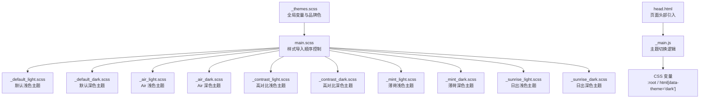
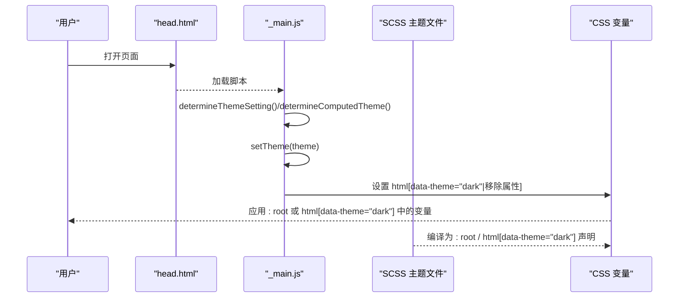
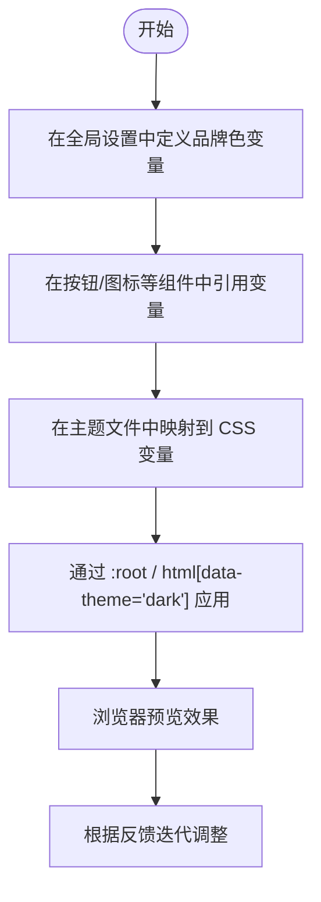
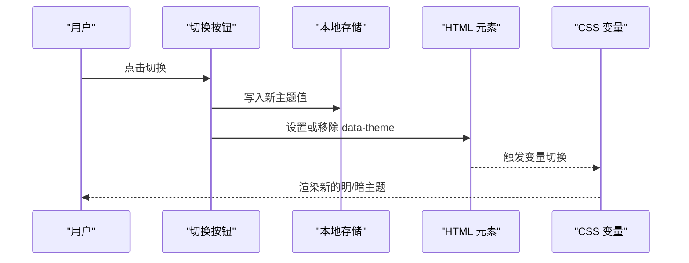
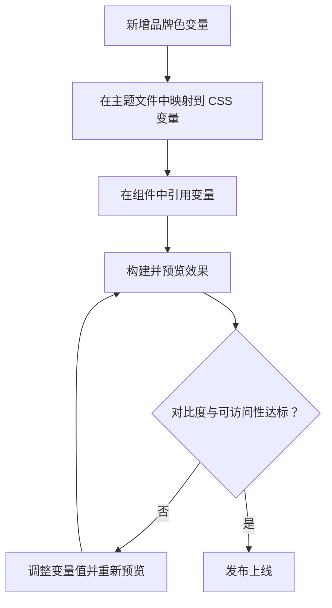
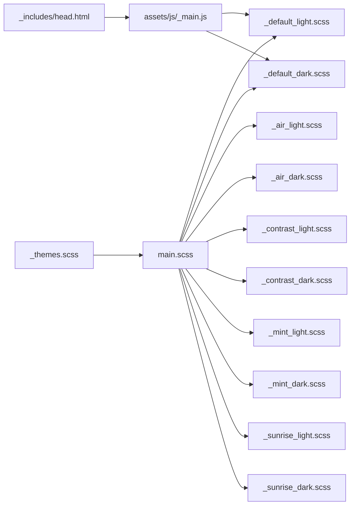

# 色彩方案定制

<cite>
**本文档引用的文件**
- [_themes.scss](file://_sass/_themes.scss)
- [_default_light.scss](file://_sass/theme/_default_light.scss)
- [_default_dark.scss](file://_sass/theme/_default_dark.scss)
- [_air_light.scss](file://_sass/theme/_air_light.scss)
- [_air_dark.scss](file://_sass/theme/_air_dark.scss)
- [_contrast_light.scss](file://_sass/theme/_contrast_light.scss)
- [_contrast_dark.scss](file://_sass/theme/_contrast_dark.scss)
- [_mint_light.scss](file://_sass/theme/_mint_light.scss)
- [_mint_dark.scss](file://_sass/theme/_mint_dark.scss)
- [_sunrise_light.scss](file://_sass/theme/_sunrise_light.scss)
- [_sunrise_dark.scss](file://_sass/theme/_sunrise_dark.scss)
- [main.scss](file://assets/css/main.scss)
- [head.html](file://_includes/head.html)
- [_main.js](file://assets/js/_main.js)
- [_buttons.scss](file://_sass/layout/_buttons.scss)
- [_utilities.scss](file://_sass/include/_utilities.scss)
</cite>

## 目录
1. [简介](#简介)
2. [项目结构](#项目结构)
3. [核心组件](#核心组件)
4. [架构总览](#架构总览)
5. [详细组件分析](#详细组件分析)
6. [依赖关系分析](#依赖关系分析)
7. [性能考量](#性能考量)
8. [故障排除指南](#故障排除指南)
9. [结论](#结论)
10. [附录](#附录)

## 简介
本指南面向需要在该 Jekyll 主题中进行色彩方案定制的用户与开发者。内容涵盖品牌色彩变量的定义与使用、主色调/辅助色/背景色/文字色的配置方法与搭配原则、明暗主题切换的实现原理与代码示例、CSS 自定义属性在主题中的应用、色彩对比度与可访问性考虑，以及完整的色彩定制示例与预览效果说明。

## 项目结构
该主题通过 SCSS 变量与 CSS 自定义属性实现多主题支持，并结合 JavaScript 实现明暗主题的动态切换。关键文件分布如下：
- 全局主题设置：_sass/_themes.scss
- 各主题配色：_sass/theme/_*_light.scss 与 _*_dark.scss
- 样式入口：assets/css/main.scss
- 页面头部与主题切换脚本：_includes/head.html 与 assets/js/_main.js
- 品牌社交图标颜色：_sass/include/_utilities.scss
- 按钮与状态色：_sass/layout/_buttons.scss



**图表来源**
- [_themes.scss:77-104](file://_sass/_themes.scss#L77-L104)
- [main.scss:11-16](file://assets/css/main.scss#L11-L16)
- [_default_light.scss:30-47](file://_sass/theme/_default_light.scss#L30-L47)
- [_default_dark.scss:38-55](file://_sass/theme/_default_dark.scss#L38-L55)
- [_air_light.scss:38-55](file://_sass/theme/_air_light.scss#L38-L55)
- [_air_dark.scss:38-55](file://_sass/theme/_air_dark.scss#L38-L55)
- [_contrast_light.scss:42-62](file://_sass/theme/_contrast_light.scss#L42-L62)
- [_contrast_dark.scss:38-58](file://_sass/theme/_contrast_dark.scss#L38-L58)
- [_mint_light.scss:40-58](file://_sass/theme/_mint_light.scss#L40-L58)
- [_mint_dark.scss:36-54](file://_sass/theme/_mint_dark.scss#L36-L54)
- [_sunrise_light.scss:40-57](file://_sass/theme/_sunrise_light.scss#L40-L57)
- [_sunrise_dark.scss:42-59](file://_sass/theme/_sunrise_dark.scss#L42-L59)
- [head.html:11-16](file://_includes/head.html#L11-L16)
- [_main.js:26-48](file://assets/js/_main.js#L26-L48)

**章节来源**
- [_themes.scss:77-104](file://_sass/_themes.scss#L77-L104)
- [main.scss:11-16](file://assets/css/main.scss#L11-L16)

## 核心组件
- 品牌色彩变量：集中定义于全局主题设置文件，便于统一管理与复用。
- 主题配色文件：每个主题包含浅色与深色两套变量映射到 CSS 自定义属性。
- 样式入口：通过 Jekyll 的 Liquid 模板动态选择当前主题的浅色/深色文件。
- 明暗主题切换：基于 data-theme 属性与 CSS 变量实现即时切换。
- 品牌图标颜色：通过 SCSS 变量映射到 Font Awesome 图标颜色。

**章节来源**
- [_themes.scss:77-104](file://_sass/_themes.scss#L77-L104)
- [_default_light.scss:30-47](file://_sass/theme/_default_light.scss#L30-L47)
- [_default_dark.scss:38-55](file://_sass/theme/_default_dark.scss#L38-L55)
- [main.scss:14-16](file://assets/css/main.scss#L14-L16)
- [_main.js:26-48](file://assets/js/_main.js#L26-L48)
- [_utilities.scss:264-313](file://_sass/include/_utilities.scss#L264-L313)

## 架构总览
下图展示了从样式入口到主题变量再到 CSS 变量的整体流程：



**图表来源**
- [head.html:11-16](file://_includes/head.html#L11-L16)
- [_main.js:7-48](file://assets/js/_main.js#L7-L48)
- [_default_light.scss:30-47](file://_sass/theme/_default_light.scss#L30-L47)
- [_default_dark.scss:38-55](file://_sass/theme/_default_dark.scss#L38-L55)

## 详细组件分析

### 品牌色彩变量定义与使用
- 定义位置：全局主题设置文件集中声明各类品牌色变量，便于统一维护。
- 使用方式：在按钮、社交图标等组件中通过变量引用，确保品牌色一致性。
- 配置建议：
  - 主色调：用于主导航、强调按钮、链接等关键元素。
  - 辅助色：用于状态类按钮（信息/警告/成功/危险）。
  - 文字色：区分主文字、次级文字、链接等层级。
  - 背景色：页面背景、卡片背景、表格表头等。



**图表来源**
- [_themes.scss:77-104](file://_sass/_themes.scss#L77-L104)
- [_buttons.scss:120-127](file://_sass/layout/_buttons.scss#L120-L127)
- [_utilities.scss:264-313](file://_sass/include/_utilities.scss#L264-L313)

**章节来源**
- [_themes.scss:77-104](file://_sass/_themes.scss#L77-L104)
- [_buttons.scss:120-127](file://_sass/layout/_buttons.scss#L120-L127)
- [_utilities.scss:264-313](file://_sass/include/_utilities.scss#L264-L313)

### 主题配色文件结构与变量映射
- 浅色主题：以 :root 选择器声明 CSS 变量，覆盖基础色、背景色、边框色、文字色、链接色等。
- 深色主题：以 html[data-theme="dark"] 选择器声明对应变量，实现夜间模式下的颜色替换。
- 变量命名规范：统一使用 --global-* 前缀，便于在组件中直接引用。

```mermaid
classDiagram
class 默认浅色主题 {
"+$primary-color"
"+$danger-color/$info-color/$notice-color/$success-color/$warning-color"
" : root 中的 CSS 变量"
}
class 默认深色主题 {
"+$primary-color"
"+$background/$text/$link"
"html[data-theme='dark'] 中的 CSS 变量"
}
默认浅色主题 --> CSS变量 : "映射到 : root"
默认深色主题 --> CSS变量 : "映射到 html[data-theme='dark']"
```

**图表来源**
- [_default_light.scss:30-47](file://_sass/theme/_default_light.scss#L30-L47)
- [_default_dark.scss:38-55](file://_sass/theme/_default_dark.scss#L38-L55)

**章节来源**
- [_default_light.scss:30-47](file://_sass/theme/_default_light.scss#L30-L47)
- [_default_dark.scss:38-55](file://_sass/theme/_default_dark.scss#L38-L55)

### 明暗主题切换实现原理
- 初始状态判断：优先读取本地存储，其次读取 HTML 上的 data-theme，再回退到系统偏好。
- 切换逻辑：点击切换按钮时写入本地存储并更新 data-theme 属性；监听系统主题变化以自动跟随。
- 样式应用：CSS 通过 :root 与 html[data-theme="dark"] 两种路径响应变量变化。



**图表来源**
- [_main.js:43-48](file://assets/js/_main.js#L43-L48)
- [_main.js:26-40](file://assets/js/_main.js#L26-L40)

**章节来源**
- [_main.js:7-48](file://assets/js/_main.js#L7-L48)

### CSS 自定义属性在主题中的应用
- 统一变量名：所有主题均使用 --global-* 命名空间，避免冲突。
- 组件引用：按钮、导航、图标等组件通过 var(--global-*) 引用变量，实现跨主题一致表现。
- 动态切换：无需重编译样式，仅通过 data-theme 属性即可即时切换。

**章节来源**
- [_default_light.scss:30-47](file://_sass/theme/_default_light.scss#L30-L47)
- [_default_dark.scss:38-55](file://_sass/theme/_default_dark.scss#L38-L55)
- [_buttons.scss:54-58](file://_sass/layout/_buttons.scss#L54-L58)
- [_utilities.scss:320-339](file://_sass/include/_utilities.scss#L320-L339)

### 色彩对比度与可访问性考虑
- 高对比主题：专门提供高对比度主题，提升弱视与低视力用户的可读性。
- 文字与背景：确保文本与背景的对比度满足 WCAG 建议，避免使用过近似的颜色组合。
- 链接状态：区分正常、悬停、已访问状态，保证足够的视觉差异。
- 通知与状态：使用高对比的颜色标识不同状态，必要时增加边框或背景强调。

**章节来源**
- [_contrast_light.scss:24-30](file://_sass/theme/_contrast_light.scss#L24-L30)
- [_contrast_dark.scss:20-26](file://_sass/theme/_contrast_dark.scss#L20-L26)
- [_contrast_light.scss:76-86](file://_sass/theme/_contrast_light.scss#L76-L86)
- [_contrast_dark.scss:71-114](file://_sass/theme/_contrast_dark.scss#L71-L114)

### 完整色彩定制示例与预览效果
- 定义品牌色：在全局设置中添加或修改品牌色变量，如 $brand-primary、$brand-secondary 等。
- 配置主题：在浅色/深色主题文件中将变量映射到 --global-* CSS 变量。
- 组件适配：在按钮、图标、导航等组件中引用变量，确保风格统一。
- 预览与验证：在浏览器中切换明/暗主题，观察对比度与可读性，必要时微调变量值。



**图表来源**
- [_themes.scss:77-104](file://_sass/_themes.scss#L77-L104)
- [_default_light.scss:30-47](file://_sass/theme/_default_light.scss#L30-L47)
- [_default_dark.scss:38-55](file://_sass/theme/_default_dark.scss#L38-L55)
- [_buttons.scss:120-127](file://_sass/layout/_buttons.scss#L120-L127)

## 依赖关系分析
- 样式入口依赖：main.scss 通过 Liquid 模板动态选择当前主题的浅色/深色文件。
- 主题文件依赖：各主题文件依赖全局变量与工具类，最终输出到 CSS 变量。
- 运行时依赖：_main.js 依赖 DOM 属性 data-theme 与 CSS 变量实现切换。



**图表来源**
- [main.scss:14-16](file://assets/css/main.scss#L14-L16)
- [_themes.scss:77-104](file://_sass/_themes.scss#L77-L104)
- [_default_light.scss:30-47](file://_sass/theme/_default_light.scss#L30-L47)
- [_default_dark.scss:38-55](file://_sass/theme/_default_dark.scss#L38-L55)
- [_air_light.scss:38-55](file://_sass/theme/_air_light.scss#L38-L55)
- [_air_dark.scss:38-55](file://_sass/theme/_air_dark.scss#L38-L55)
- [_contrast_light.scss:42-62](file://_sass/theme/_contrast_light.scss#L42-L62)
- [_contrast_dark.scss:38-58](file://_sass/theme/_contrast_dark.scss#L38-L58)
- [_mint_light.scss:40-58](file://_sass/theme/_mint_light.scss#L40-L58)
- [_mint_dark.scss:36-54](file://_sass/theme/_mint_dark.scss#L36-L54)
- [_sunrise_light.scss:40-57](file://_sass/theme/_sunrise_light.scss#L40-L57)
- [_sunrise_dark.scss:42-59](file://_sass/theme/_sunrise_dark.scss#L42-L59)
- [head.html:11-16](file://_includes/head.html#L11-L16)
- [_main.js:26-48](file://assets/js/_main.js#L26-L48)

**章节来源**
- [main.scss:14-16](file://assets/css/main.scss#L14-L16)
- [_main.js:26-48](file://assets/js/_main.js#L26-L48)

## 性能考量
- 减少重绘：CSS 变量切换仅影响计算值，避免大规模样式重排。
- 体积控制：按需引入主题文件，避免不必要的样式加载。
- 运行时效率：主题切换逻辑轻量，尽量减少 DOM 操作次数。

## 故障排除指南
- 主题未生效：确认 HTML 是否正确设置了 data-theme 属性，检查 CSS 变量是否被覆盖。
- 切换无效：检查本地存储键值与切换函数逻辑，确保事件绑定正确。
- 对比度不足：调整主色与背景色的明暗度，参考高对比主题的配色策略。

**章节来源**
- [_main.js:26-48](file://assets/js/_main.js#L26-L48)
- [_contrast_light.scss:76-86](file://_sass/theme/_contrast_light.scss#L76-L86)
- [_contrast_dark.scss:71-114](file://_sass/theme/_contrast_dark.scss#L71-L114)

## 结论
通过全局变量与 CSS 自定义属性的结合，该主题实现了灵活且高性能的主题定制能力。品牌色彩的统一管理与明暗主题的无缝切换，为用户提供一致而可访问的视觉体验。建议在定制过程中遵循对比度与可访问性原则，并通过实际预览不断优化配色方案。

## 附录
- 快速开始步骤
  1) 在全局设置中定义品牌色变量。
  2) 在目标主题的浅色/深色文件中映射到 CSS 变量。
  3) 在组件中引用变量并构建预览。
  4) 使用高对比主题验证可访问性。
  5) 发布前进行跨浏览器测试。