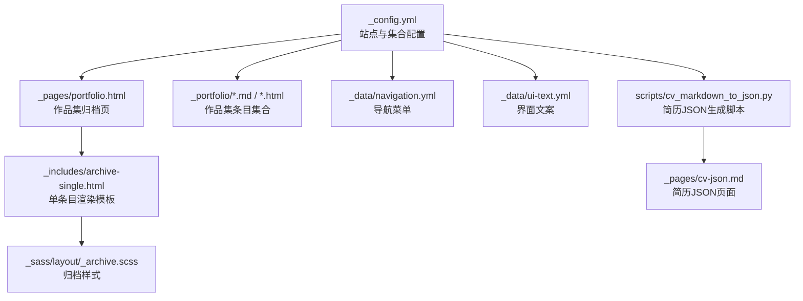
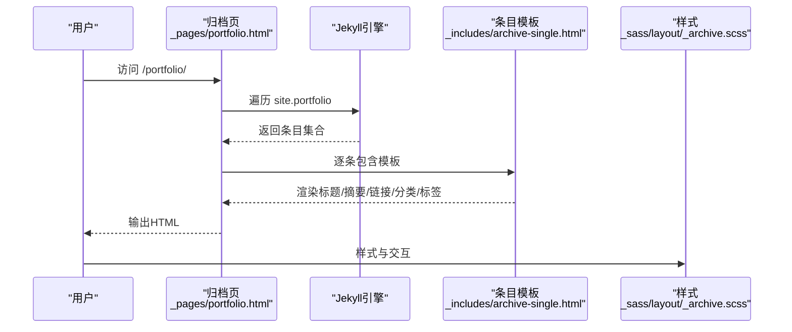
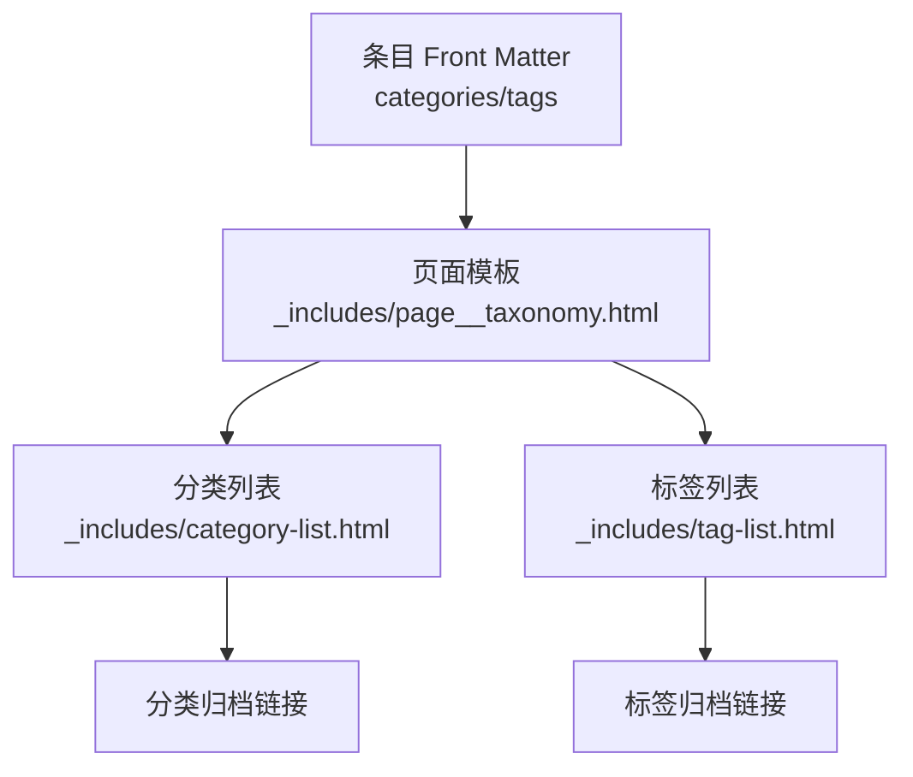
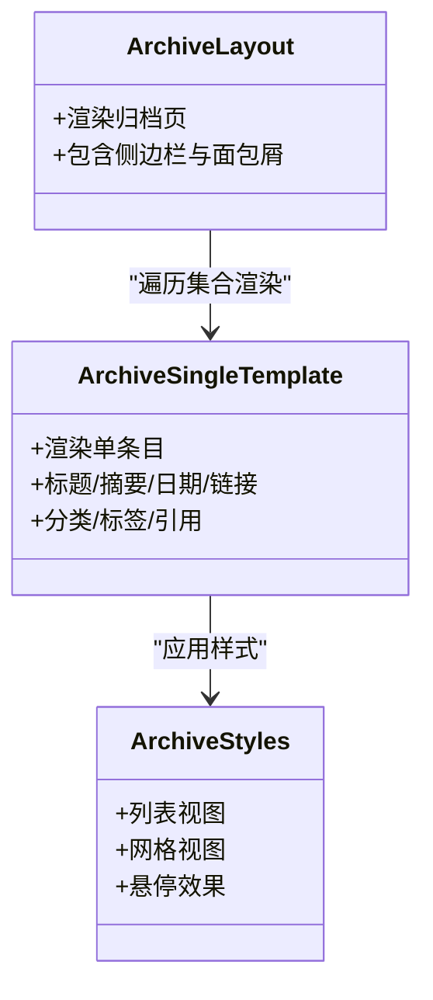
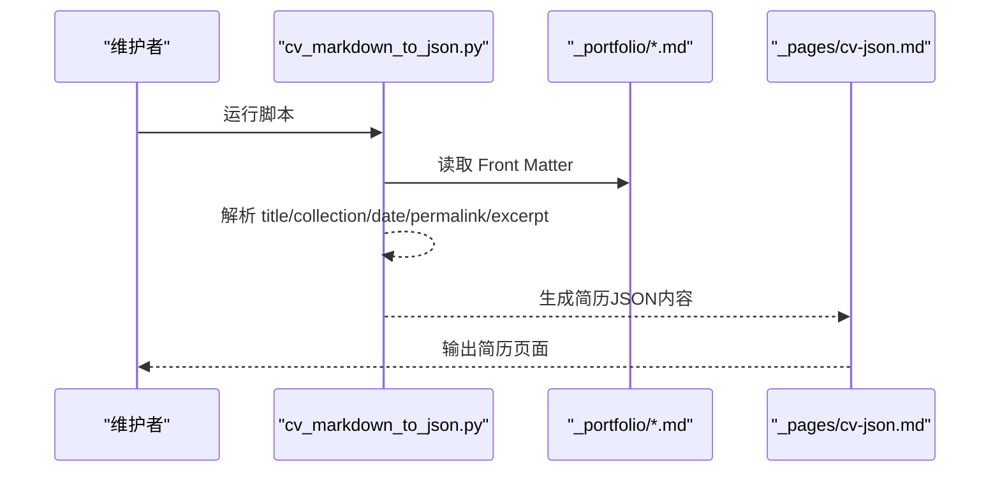
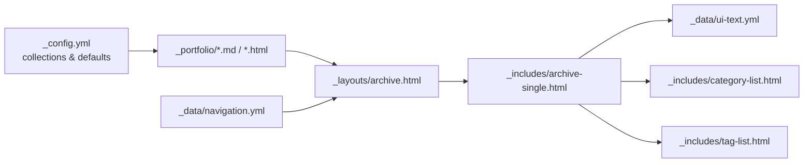

# 作品集项目管理

<cite>
**本文引用的文件**
- [_config.yml](file://_config.yml)
- [_pages/portfolio.html](file://_pages/portfolio.html)
- [_portfolio/portfolio-1.md](file://_portfolio/portfolio-1.md)
- [_portfolio/portfolio-2.html](file://_portfolio/portfolio-2.html)
- [_includes/archive-single.html](file://_includes/archive-single.html)
- [_layouts/archive.html](file://_layouts/archive.html)
- [_sass/layout/_archive.scss](file://_sass/layout/_archive.scss)
- [_data/navigation.yml](file://_data/navigation.yml)
- [_data/ui-text.yml](file://_data/ui-text.yml)
- [_includes/category-list.html](file://_includes/category-list.html)
- [_includes/tag-list.html](file://_includes/tag-list.html)
- [scripts/cv_markdown_to_json.py](file://scripts/cv_markdown_to_json.py)
- [_pages/cv-json.md](file://_pages/cv-json.md)
</cite>

## 目录
1. [引言](#引言)
2. [项目结构](#项目结构)
3. [核心组件](#核心组件)
4. [架构总览](#架构总览)
5. [详细组件分析](#详细组件分析)
6. [依赖分析](#依赖分析)
7. [性能考虑](#性能考虑)
8. [故障排查指南](#故障排查指南)
9. [结论](#结论)
10. [附录](#附录)

## 引言
本文件面向开发者与内容维护者，系统性阐述该作品集项目的管理方式与最佳实践，覆盖以下主题：
- 作品集条目命名规范与 Front Matter 字段配置（title、excerpt、image、url、collection 等）
- 作品集分类系统与标签体系（web、mobile、design、research 等）
- 项目描述编写规范与多媒体内容集成
- 项目链接配置（演示链接、源码链接、文档链接等）
- 项目图片与截图的管理（尺寸、格式、占位图）
- 项目状态标记与展示策略
- 技术栈标注与技能关联
- 作品集页面布局与展示效果
- 作品集与简历系统的集成关系
- 数据维护与更新流程

## 项目结构
该站点采用 Jekyll 静态站点生成器，作品集以集合（collection）形式组织，入口页面负责遍历集合并渲染归档列表。

**图表来源**
- [_config.yml:223-293](file://_config.yml#L223-L293)
- [_pages/portfolio.html:1-15](file://_pages/portfolio.html#L1-L15)
- [_includes/archive-single.html:1-85](file://_includes/archive-single.html#L1-L85)
- [_sass/layout/_archive.scss:1-246](file://_sass/layout/_archive.scss#L1-L246)
- [_portfolio/portfolio-1.md:1-8](file://_portfolio/portfolio-1.md#L1-L8)
- [_portfolio/portfolio-2.html:1-8](file://_portfolio/portfolio-2.html#L1-L8)
- [_data/navigation.yml:10-40](file://_data/navigation.yml#L10-L40)
- [_data/ui-text.yml:269-355](file://_data/ui-text.yml#L269-L355)
- [scripts/cv_markdown_to_json.py:339-366](file://scripts/cv_markdown_to_json.py#L339-L366)
- [_pages/cv-json.md:1-18](file://_pages/cv-json.md#L1-L18)

**章节来源**
- [_config.yml:223-293](file://_config.yml#L223-L293)
- [_pages/portfolio.html:1-15](file://_pages/portfolio.html#L1-L15)

## 核心组件
- 集合配置与默认值
  - 通过集合配置启用 portfolio 集合，并设置默认布局、作者资料、分享与评论等行为。
- 归档页与条目模板
  - 归档页遍历集合并调用条目模板；条目模板负责标题、摘要、日期、链接、分类/标签等渲染。
- 样式与响应式网格
  - SCSS 提供列表与网格视图、悬停效果、断点适配等。
- 导航与文案
  - 导航菜单包含“作品集”入口；界面文案提供多语言标签与提示文本。
- 简历集成
  - 通过脚本解析 portfolio 条目并写入简历 JSON 页面，实现作品集与简历的数据互通。

**章节来源**
- [_config.yml:276-293](file://_config.yml#L276-L293)
- [_includes/archive-single.html:1-85](file://_includes/archive-single.html#L1-L85)
- [_sass/layout/_archive.scss:114-152](file://_sass/layout/_archive.scss#L114-L152)
- [_data/navigation.yml:20-21](file://_data/navigation.yml#L20-L21)
- [_data/ui-text.yml:17-18](file://_data/ui-text.yml#L17-L18)
- [scripts/cv_markdown_to_json.py:339-366](file://scripts/cv_markdown_to_json.py#L339-L366)
- [_pages/cv-json.md:1-18](file://_pages/cv-json.md#L1-L18)

## 架构总览
作品集数据流从集合条目到归档页，再到条目模板与样式层，最终在简历页面通过脚本聚合输出。

**图表来源**
- [_pages/portfolio.html:11-13](file://_pages/portfolio.html#L11-L13)
- [_includes/archive-single.html:1-85](file://_includes/archive-single.html#L1-L85)
- [_sass/layout/_archive.scss:114-152](file://_sass/layout/_archive.scss#L114-L152)

## 详细组件分析

### 作品集条目命名规范与 Front Matter 字段
- 文件命名建议
  - 使用语义化名称，如 portfolio-项目名.md 或 portfolio-年份-项目名.md，便于排序与识别。
- Front Matter 字段建议
  - title：条目标题（用于页面标题与列表标题）
  - excerpt：简短描述，支持内嵌图片或富文本片段
  - collection：固定为 portfolio（集合标识）
  - date：发布/更新时间（用于排序与时间轴）
  - url：自定义永久链接（若需覆盖默认规则）
  - image/header.teaser：缩略图或封面图路径（相对站点根或 images 目录）
  - link：外部演示链接（可选）
  - categories/tags：分类与标签（用于筛选与归档）
  - read_time/author_profile/share/comments 等：按需启用
- 示例参考
  - Markdown 条目示例：[_portfolio/portfolio-1.md:1-8](file://_portfolio/portfolio-1.md#L1-L8)
  - HTML 条目示例：[_portfolio/portfolio-2.html:1-8](file://_portfolio/portfolio-2.html#L1-L8)

**章节来源**
- [_portfolio/portfolio-1.md:1-8](file://_portfolio/portfolio-1.md#L1-L8)
- [_portfolio/portfolio-2.html:1-8](file://_portfolio/portfolio-2.html#L1-L8)
- [_config.yml:276-293](file://_config.yml#L276-L293)

### 作品集分类系统与标签体系
- 分类（categories）
  - 可在条目 Front Matter 中设置 categories，页面模板会渲染分类链接。
- 标签（tags）
  - 可在条目 Front Matter 中设置 tags，页面模板会渲染标签链接。
- 导航与页面
  - 导航菜单包含“作品集”入口，指向 /portfolio/。
  - 归档页遍历集合并渲染列表。

**图表来源**
- [_includes/page__taxonomy.html:1-9](file://_includes/page__taxonomy.html#L1-L9)
- [_includes/category-list.html:1-30](file://_includes/category-list.html#L1-L30)
- [_includes/tag-list.html:1-28](file://_includes/tag-list.html#L1-L28)
- [_data/navigation.yml:20-21](file://_data/navigation.yml#L20-L21)

**章节来源**
- [_includes/page__taxonomy.html:1-9](file://_includes/page__taxonomy.html#L1-L9)
- [_includes/category-list.html:1-30](file://_includes/category-list.html#L1-L30)
- [_includes/tag-list.html:1-28](file://_includes/tag-list.html#L1-L28)
- [_data/navigation.yml:20-21](file://_data/navigation.yml#L20-L21)

### 项目描述编写规范与多媒体内容集成
- 描述规范
  - 使用简洁明了的语言概述项目目标、角色与成果；必要时提供技术要点与亮点。
  - 在 excerpt 中可内嵌图片或富文本片段，以增强视觉吸引力。
- 多媒体集成
  - 支持在 excerpt 或正文插入图片；建议使用相对路径或绝对路径结合 base_path。
  - 若使用占位图，建议统一尺寸与格式，便于排版一致。

**章节来源**
- [_portfolio/portfolio-1.md:2-3](file://_portfolio/portfolio-1.md#L2-L3)
- [_portfolio/portfolio-2.html:2-3](file://_portfolio/portfolio-2.html#L2-L3)
- [_includes/archive-single.html:49-53](file://_includes/archive-single.html#L49-L53)

### 项目链接配置
- 外部链接
  - link：指向演示链接（如在线预览）
  - url：可覆盖默认永久链接
- 内部链接
  - 归档页通过 base_path 与 post.url 生成内部详情页链接
- 文档与源码
  - 可在正文补充文档链接与源码仓库链接，便于访问

**章节来源**
- [_includes/archive-single.html:29-35](file://_includes/archive-single.html#L29-L35)
- [_pages/portfolio.html:11-13](file://_pages/portfolio.html#L11-L13)

### 图片与截图管理
- 尺寸与格式
  - 建议统一缩略图尺寸（如 500x300），保证网格与列表视图的一致性
  - 常用格式：PNG、JPG、WebP（按需）
- 存放位置
  - 建议放置于 /images/ 下，配合模板中的 prepend 逻辑
- 占位图
  - 可使用占位图作为 teaser，提升加载体验

**章节来源**
- [_portfolio/portfolio-1.md](file://_portfolio/portfolio-1.md#L3)
- [_portfolio/portfolio-2.html](file://_portfolio/portfolio-2.html#L3)
- [_includes/archive-single.html:17-26](file://_includes/archive-single.html#L17-L26)

### 项目状态标记与展示
- 时间线展示
  - 模板根据 date 字段渲染发布/更新时间，便于构建时间轴
- 状态字段
  - 可通过 categories/tags 表达“进行中/已完成/开源/私有”等状态
  - 也可在 excerpt 或正文中显式说明项目状态

**章节来源**
- [_includes/archive-single.html:45-47](file://_includes/archive-single.html#L45-L47)

### 技术栈标注与技能关联
- 方案一：在 excerpt/正文明确列出技术栈
- 方案二：通过 tags 与 categories 建立技能标签（如 “Unity”、“React”、“UI/UX”）
- 方案三：简历 JSON 脚本可抽取 portfolio 条目信息，统一汇总到简历页面

**章节来源**
- [scripts/cv_markdown_to_json.py:339-366](file://scripts/cv_markdown_to_json.py#L339-L366)
- [_pages/cv-json.md:1-18](file://_pages/cv-json.md#L1-L18)

### 作品集页面布局与展示效果
- 视图模式
  - 列表视图与网格视图：SCSS 提供断点与网格布局，适配不同屏幕尺寸
  - 悬停效果：标题下划线、缩略图阴影
- 样式细节
  - teaser 容器高度、断点下的最大高度、字体大小等均有对应样式控制

**图表来源**
- [_layouts/archive.html:1-25](file://_layouts/archive.html#L1-L25)
- [_includes/archive-single.html:1-85](file://_includes/archive-single.html#L1-L85)
- [_sass/layout/_archive.scss:114-152](file://_sass/layout/_archive.scss#L114-L152)

**章节来源**
- [_layouts/archive.html:1-25](file://_layouts/archive.html#L1-L25)
- [_sass/layout/_archive.scss:114-152](file://_sass/layout/_archive.scss#L114-L152)

### 作品集与简历系统的集成
- 数据抽取
  - 脚本解析 _portfolio 目录下的 Markdown 条目，提取 Front Matter 并生成简历 JSON 结构
- 展示页面
  - 简历 JSON 页面提供 PDF 下载与 Markdown CV 链接

**图表来源**
- [scripts/cv_markdown_to_json.py:339-366](file://scripts/cv_markdown_to_json.py#L339-L366)
- [_pages/cv-json.md:1-18](file://_pages/cv-json.md#L1-L18)

**章节来源**
- [scripts/cv_markdown_to_json.py:339-366](file://scripts/cv_markdown_to_json.py#L339-L366)
- [_pages/cv-json.md:1-18](file://_pages/cv-json.md#L1-L18)

## 依赖分析
- 集合与默认值
  - portfolio 集合启用并设置默认布局与分享/评论开关
- 模板依赖
  - 归档页依赖 archive-single 模板；archive-single 模板依赖分类/标签与 UI 文案
- 样式依赖
  - 归档样式依赖断点与网格工具，影响列表/网格视图
- 导航依赖
  - 导航菜单包含“作品集”入口，指向 /portfolio/

**图表来源**
- [_config.yml:223-293](file://_config.yml#L223-L293)
- [_pages/portfolio.html:1-15](file://_pages/portfolio.html#L1-L15)
- [_includes/archive-single.html:1-85](file://_includes/archive-single.html#L1-L85)
- [_data/ui-text.yml:269-355](file://_data/ui-text.yml#L269-L355)
- [_includes/category-list.html:1-30](file://_includes/category-list.html#L1-L30)
- [_includes/tag-list.html:1-28](file://_includes/tag-list.html#L1-L28)
- [_data/navigation.yml:10-40](file://_data/navigation.yml#L10-L40)

**章节来源**
- [_config.yml:223-293](file://_config.yml#L223-L293)
- [_includes/archive-single.html:1-85](file://_includes/archive-single.html#L1-L85)

## 性能考虑
- 图片优化
  - 使用合适尺寸与格式，避免超大图片导致加载缓慢
- 样式与脚本
  - 合理使用断点与网格，减少不必要的 DOM 与重绘
- 构建与缓存
  - 利用 Jekyll 的压缩与缓存机制，减少传输体积

## 故障排查指南
- 作品集页面无内容
  - 检查集合是否启用且 Front Matter 中 collection 为 portfolio
  - 确认归档页是否正确遍历 site.portfolio
- 链接无法打开
  - 检查 post.link 与 post.url 的组合是否正确
  - 确认 base_path 是否与部署路径一致
- 分类/标签不显示
  - 检查条目 Front Matter 中 categories/tags 是否存在
  - 确认页面模板是否包含分类/标签渲染片段
- 文案语言不匹配
  - 检查 ui-text 的 locale 设置与页面使用的语言键

**章节来源**
- [_pages/portfolio.html:11-13](file://_pages/portfolio.html#L11-L13)
- [_includes/archive-single.html:29-35](file://_includes/archive-single.html#L29-L35)
- [_includes/category-list.html:1-30](file://_includes/category-list.html#L1-L30)
- [_includes/tag-list.html:1-28](file://_includes/tag-list.html#L1-L28)
- [_data/ui-text.yml:269-355](file://_data/ui-text.yml#L269-L355)

## 结论
通过规范的命名与 Front Matter 字段、清晰的分类与标签体系、合理的链接与多媒体集成、以及与简历系统的自动化对接，可以高效地维护与展示个人作品集。建议在新增条目时严格遵循本文规范，并结合样式与脚本能力，持续优化用户体验与可维护性。

## 附录
- 常用字段速查
  - title、excerpt、collection、date、url、link、image/header.teaser、categories、tags、read_time、author_profile、share、comments
- 建议工作流
  - 新增条目 → 编写 Front Matter 与正文 → 预览与校验 → 提交与发布 → 更新简历 JSON（如有需要）