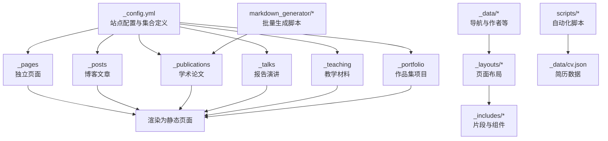
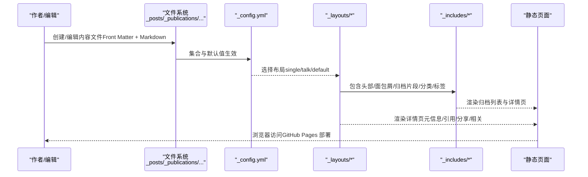
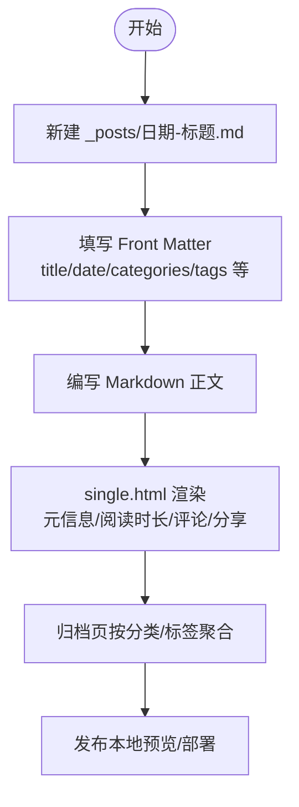
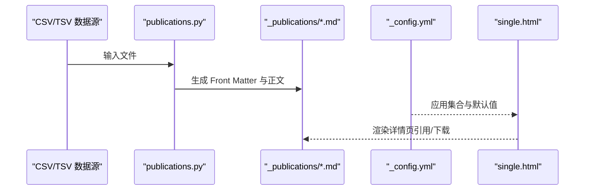
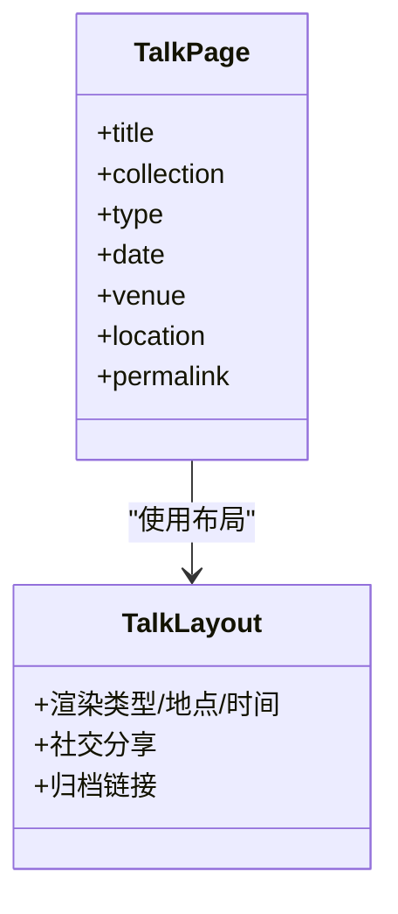
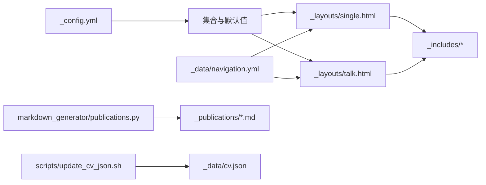

# 内容管理系统

<cite>
**本文引用的文件**
- [_config.yml](file://_config.yml)
- [README.md](file://README.md)
- [_data/authors.yml](file://_data/authors.yml)
- [_data/navigation.yml](file://_data/navigation.yml)
- [_layouts/default.html](file://_layouts/default.html)
- [_layouts/single.html](file://_layouts/single.html)
- [_layouts/talk.html](file://_layouts/talk.html)
- [_includes/archive-single.html](file://_includes/archive-single.html)
- [_includes/page__taxonomy.html](file://_includes/page__taxonomy.html)
- [_posts/2025-03-11-my-first-blog.md](file://_posts/2025-03-11-my-first-blog.md)
- [_publications/2024-02-17-paper-title-number-4.md](file://_publications/2024-02-17-paper-title-number-4.md)
- [_talks/2013-03-01-tutorial-1.md](file://_talks/2013-03-01-tutorial-1.md)
- [_teaching/2014-spring-teaching-1.md](file://_teaching/2014-spring-teaching-1.md)
- [_portfolio/portfolio-1.md](file://_portfolio/portfolio-1.md)
- [_pages/about.md](file://_pages/about.md)
- [markdown_generator/publications.py](file://markdown_generator/publications.py)
- [scripts/update_cv_json.sh](file://scripts/update_cv_json.sh)
</cite>

## 目录
1. [简介](#简介)
2. [项目结构](#项目结构)
3. [核心组件](#核心组件)
4. [架构总览](#架构总览)
5. [详细组件分析](#详细组件分析)
6. [依赖关系分析](#依赖关系分析)
7. [性能考虑](#性能考虑)
8. [故障排查指南](#故障排查指南)
9. [结论](#结论)
10. [附录](#附录)

## 简介
本文件为内容管理系统的综合文档，面向不同技术水平的用户，系统性介绍如何创建与管理各类内容类型：博客文章（_posts）、学术论文（_publications）、报告演讲（_talks）、教学材料（_teaching）、作品集项目（_portfolio）以及独立页面（_pages）。文档涵盖 Front Matter 字段说明、内容格式要求、分类与标签系统、归档与链接规则、搜索机制、批量内容生成与自动化脚本、内容同步与版本控制建议，以及备份策略等。

## 项目结构
该站点采用 Jekyll 静态站点生成器，内容以 Markdown 文件组织在各集合目录中，配合配置文件与布局模板渲染为静态页面。关键目录与文件如下：
- 根配置：_config.yml 控制站点主题、集合、默认布局、归档路径、插件等
- 内容集合：_posts、_publications、_talks、_teaching、_portfolio
- 页面集合：_pages（独立页面）
- 布局与包含：_layouts、_includes（页面结构、面包屑、归档条目、分类/标签展示等）
- 数据与导航：_data（作者、导航菜单、UI 文本等）
- 自动化：markdown_generator（批量生成论文/演讲 Markdown）、scripts（简历 JSON 更新脚本）

图示来源
- [_config.yml](file://_config.yml)
- [_layouts/default.html](file://_layouts/default.html)
- [_layouts/single.html](file://_layouts/single.html)
- [_layouts/talk.html](file://_layouts/talk.html)
- [_includes/archive-single.html](file://_includes/archive-single.html)
- [_includes/page__taxonomy.html](file://_includes/page__taxonomy.html)
- [_data/navigation.yml](file://_data/navigation.yml)

章节来源
- [_config.yml](file://_config.yml)
- [_data/navigation.yml](file://_data/navigation.yml)

## 核心组件
- 站点配置与集合
  - 在配置文件中声明集合（teaching、publications、portfolio、talks），并设置每类内容的输出与永久链接规则
  - 默认 Front Matter 行为：针对 posts、pages、teaching、publications、portfolio、talks 设置统一布局与功能开关（如作者资料、阅读时长、分享、评论、相关推荐）
- 布局系统
  - default.html 提供基础骨架与包含头尾、脚本
  - single.html 适用于大多数内容页，负责元信息、内容区、引用信息、社交分享、相关文章等
  - talk.html 专用于报告演讲，展示时间地点与类型等
- 归档与分类/标签
  - archive-single.html 统一渲染归档列表项，按集合类型显示不同元信息
  - page__taxonomy.html 条件性渲染标签与分类（除 publications 外）
- 导航与页面
  - navigation.yml 定义顶部导航顺序与子菜单
  - _pages/about.md 展示首页与快速导航

章节来源
- [_config.yml](file://_config.yml)
- [_layouts/default.html](file://_layouts/default.html)
- [_layouts/single.html](file://_layouts/single.html)
- [_layouts/talk.html](file://_layouts/talk.html)
- [_includes/archive-single.html](file://_includes/archive-single.html)
- [_includes/page__taxonomy.html](file://_includes/page__taxonomy.html)
- [_data/navigation.yml](file://_data/navigation.yml)
- [_pages/about.md](file://_pages/about.md)

## 架构总览
下图展示了从内容文件到最终页面的生成与渲染路径，包括集合、布局、归档与导航之间的关系。

图示来源
- [_config.yml](file://_config.yml)
- [_layouts/default.html](file://_layouts/default.html)
- [_layouts/single.html](file://_layouts/single.html)
- [_layouts/talk.html](file://_layouts/talk.html)
- [_includes/archive-single.html](file://_includes/archive-single.html)
- [_includes/page__taxonomy.html](file://_includes/page__taxonomy.html)

## 详细组件分析

### 博客文章（_posts）
- 文件命名与日期
  - 建议使用 YYYY-MM-DD-标题.md 的命名规范；日期需与文件名一致或更精确
- Front Matter 字段
  - 必填：title、date
  - 常用：excerpt、layout、author_profile、read_time、comments、share、related、categories、tags
- 内容格式
  - 支持 Markdown，可包含标题、列表、代码块、图片等
- 布局与展示
  - 默认使用 single.html，支持阅读时长、评论、社交分享、相关文章
- 分类与标签
  - 通过 categories 与 tags 实现；归档页按标签/分类展示
- 示例参考
  - [博客示例](file://_posts/2025-03-11-my-first-blog.md)

图示来源
- [_posts/2025-03-11-my-first-blog.md](file://_posts/2025-03-11-my-first-blog.md)
- [_layouts/single.html](file://_layouts/single.html)
- [_includes/page__taxonomy.html](file://_includes/page__taxonomy.html)

章节来源
- [_posts/2025-03-11-my-first-blog.md](file://_posts/2025-03-11-my-first-blog.md)
- [_layouts/single.html](file://_layouts/single.html)
- [_includes/page__taxonomy.html](file://_includes/page__taxonomy.html)

### 学术论文（_publications）
- 文件命名与日期
  - 使用 YYYY-MM-DD-描述性标题.md；日期与文件名一致
- Front Matter 字段
  - 必填：title、collection、category、date
  - 常用：excerpt、permalink、venue、paperurl、citation
- 内容格式
  - 正文可包含更多细节，页面底部会根据字段组合显示引用与下载链接
- 布局与展示
  - 使用 single.html，按集合类型显示“发表于”等信息
- 分类与归档
  - 通过 category（如 conferences、manuscripts、books）进行分组；permalink 控制详情页 URL
- 批量生成
  - 使用 markdown_generator/publications.py 从 CSV/TSV 自动生成多篇论文 Markdown
- 示例参考
  - [论文示例](file://_publications/2024-02-17-paper-title-number-4.md)

图示来源
- [_publications/2024-02-17-paper-title-number-4.md](file://_publications/2024-02-17-paper-title-number-4.md)
- [_layouts/single.html](file://_layouts/single.html)
- [markdown_generator/publications.py](file://markdown_generator/publications.py)

章节来源
- [_publications/2024-02-17-paper-title-number-4.md](file://_publications/2024-02-17-paper-title-number-4.md)
- [markdown_generator/publications.py](file://markdown_generator/publications.py)

### 报告演讲（_talks）
- 文件命名与日期
  - 使用 YYYY-MM-DD-描述性标题.md；日期与文件名一致
- Front Matter 字段
  - 必填：title、collection、type、date
  - 常用：permalink、venue、location
- 内容格式
  - 支持 Markdown，可包含链接与描述
- 布局与展示
  - 使用 talk.html，展示类型、地点与时间等信息
- 示例参考
  - [报告示例](file://_talks/2013-03-01-tutorial-1.md)

图示来源
- [_talks/2013-03-01-tutorial-1.md](file://_talks/2013-03-01-tutorial-1.md)
- [_layouts/talk.html](file://_layouts/talk.html)

章节来源
- [_talks/2013-03-01-tutorial-1.md](file://_talks/2013-03-01-tutorial-1.md)
- [_layouts/talk.html](file://_layouts/talk.html)

### 教学材料（_teaching）
- 文件命名与日期
  - 使用 YYYY-学期-描述性标题.md；日期通常为学年开始年份
- Front Matter 字段
  - 必填：title、collection、type、date
  - 常用：venue、location
- 内容格式
  - 支持 Markdown，可包含课程大纲、讲义链接等
- 布局与展示
  - 使用 single.html，按集合类型显示“课程类型、地点、年份”
- 示例参考
  - [教学示例](file://_teaching/2014-spring-teaching-1.md)

章节来源
- [_teaching/2014-spring-teaching-1.md](file://_teaching/2014-spring-teaching-1.md)
- [_layouts/single.html](file://_layouts/single.html)

### 作品集项目（_portfolio）
- 文件命名
  - portfolio-序号.md 或 portfolio-序号.html（可混合）
- Front Matter 字段
  - 必填：title、collection
  - 常用：excerpt（可包含简短描述与缩略图）
- 内容格式
  - 支持 Markdown 或 HTML；适合图文混排
- 布局与展示
  - 使用 single.html，excerpt 用于列表摘要
- 示例参考
  - [作品集示例](file://_portfolio/portfolio-1.md)

章节来源
- [_portfolio/portfolio-1.md](file://_portfolio/portfolio-1.md)
- [_layouts/single.html](file://_layouts/single.html)

### 独立页面（_pages）
- 文件命名与链接
  - 如 about.md 可通过 permalink 指定首页路径
- Front Matter 字段
  - 常用：permalink、title、author_profile、redirect_from
- 内容格式
  - 支持 Markdown，适合撰写简介、导航、隐私政策等
- 示例参考
  - [首页示例](file://_pages/about.md)

章节来源
- [_pages/about.md](file://_pages/about.md)

## 依赖关系分析
- 配置驱动集合与默认行为
  - _config.yml 中 collections 与 defaults 决定各集合的输出、永久链接与默认 Front Matter
- 布局与包含的耦合
  - single.html 与 talk.html 共同依赖 _includes 下的通用片段（面包屑、分类/标签、社交分享等）
- 归档与导航的联动
  - navigation.yml 定义导航顺序，archive-single.html 与 page__taxonomy.html 负责归档页与详情页的分类/标签展示
- 自动化脚本与数据流
  - markdown_generator/publications.py 将外部数据转换为论文 Markdown；scripts/update_cv_json.sh 将 Markdown CV 转换为 JSON 供页面渲染

图示来源
- [_config.yml](file://_config.yml)
- [_layouts/single.html](file://_layouts/single.html)
- [_layouts/talk.html](file://_layouts/talk.html)
- [_includes/archive-single.html](file://_includes/archive-single.html)
- [_includes/page__taxonomy.html](file://_includes/page__taxonomy.html)
- [_data/navigation.yml](file://_data/navigation.yml)
- [markdown_generator/publications.py](file://markdown_generator/publications.py)
- [scripts/update_cv_json.sh](file://scripts/update_cv_json.sh)

章节来源
- [_config.yml](file://_config.yml)
- [_layouts/single.html](file://_layouts/single.html)
- [_layouts/talk.html](file://_layouts/talk.html)
- [_includes/archive-single.html](file://_includes/archive-single.html)
- [_includes/page__taxonomy.html](file://_includes/page__taxonomy.html)
- [_data/navigation.yml](file://_data/navigation.yml)
- [markdown_generator/publications.py](file://markdown_generator/publications.py)
- [scripts/update_cv_json.sh](file://scripts/update_cv_json.sh)

## 性能考虑
- 构建优化
  - 启用压缩与 HTML 压缩插件，减少页面体积
  - 合理使用图片与资源，避免过大媒体影响加载
- 内容组织
  - 分类与标签尽量精简，避免过多层级导致查询复杂度上升
- 预览与构建
  - 本地使用 Jekyll 服务进行增量构建与热重载，提高迭代效率

## 故障排查指南
- 本地运行失败
  - 检查 Ruby、Bundler、Node.js 版本与安装路径；必要时使用本地 Gem 安装路径
  - 使用 bundle exec jekyll serve 确保依赖一致
- 页面未更新
  - 确认 Front Matter 字段完整且命名规范；检查集合与默认值是否匹配
- 归档/分类不显示
  - 确认已启用相应归档类型与路径；检查分类/标签字段是否存在
- 论文/演讲批量生成异常
  - 确认输入文件列头与格式；检查日期格式与 URL slug 规范
- 简历 JSON 未更新
  - 确认脚本路径与 Python 环境；检查 cv.md 是否存在且格式正确

章节来源
- [README.md](file://README.md)
- [_config.yml](file://_config.yml)
- [markdown_generator/publications.py](file://markdown_generator/publications.py)
- [scripts/update_cv_json.sh](file://scripts/update_cv_json.sh)

## 结论
本系统通过 Jekyll 的集合与 Front Matter 机制，实现了对博客、论文、报告、教学、作品集与独立页面的统一管理。借助布局与包含模板，内容创建流程清晰、可扩展性强。结合批量生成脚本与自动化工具，可显著提升内容维护效率。建议在团队协作中明确命名规范与字段约定，并定期进行版本控制与备份，确保内容安全与一致性。

## 附录

### Front Matter 字段速查（按集合）
- 通用字段
  - title：标题
  - date：发布时间（与文件名日期一致）
  - layout：布局（single、talk 等）
  - author_profile：显示作者资料
  - read_time：显示阅读时长
  - comments：开启评论
  - share：显示分享按钮
  - related：显示相关文章
  - excerpt：列表摘要
  - categories：分类（仅非 publications）
  - tags：标签
- 集合特有字段
  - _publications：collection、category、permalink、venue、paperurl、citation
  - _talks：collection、type、permalink、venue、location
  - _teaching：collection、type、venue、location
  - _portfolio：collection、excerpt
  - _pages：permalink、redirect_from

章节来源
- [_config.yml](file://_config.yml)
- [_posts/2025-03-11-my-first-blog.md](file://_posts/2025-03-11-my-first-blog.md)
- [_publications/2024-02-17-paper-title-number-4.md](file://_publications/2024-02-17-paper-title-number-4.md)
- [_talks/2013-03-01-tutorial-1.md](file://_talks/2013-03-01-tutorial-1.md)
- [_teaching/2014-spring-teaching-1.md](file://_teaching/2014-spring-teaching-1.md)
- [_portfolio/portfolio-1.md](file://_portfolio/portfolio-1.md)
- [_pages/about.md](file://_pages/about.md)

### 归档与搜索机制
- 归档
  - 通过配置中的分类/标签归档类型与路径，实现按分类/标签的归档页
- 搜索
  - 本模板未内置全文搜索；可通过第三方服务（如 Google Custom Search）集成

章节来源
- [_config.yml](file://_config.yml)
- [_includes/page__taxonomy.html](file://_includes/page__taxonomy.html)

### 批量内容管理与自动化
- 论文批量生成
  - 使用 publications.py 从 CSV/TSV 生成论文 Markdown，自动填充 Front Matter 与正文
- 简历 JSON 更新
  - 使用 update_cv_json.sh 将 Markdown CV 转换为 JSON，便于前端渲染

章节来源
- [markdown_generator/publications.py](file://markdown_generator/publications.py)
- [scripts/update_cv_json.sh](file://scripts/update_cv_json.sh)

### 内容同步、版本控制与备份建议
- 版本控制
  - 使用 Git 进行版本管理；建议分支策略（如 main 发布、dev 开发）
- 同步与协作
  - 通过 GitHub Pages 自动构建；多人协作时遵循统一命名与字段规范
- 备份
  - 定期导出数据（如论文 CSV/TSV、简历 Markdown）并保存至安全位置
- 本地开发
  - 使用 Docker 或 Dev Container 提供一致的开发环境

章节来源
- [README.md](file://README.md)
- [scripts/update_cv_json.sh](file://scripts/update_cv_json.sh)