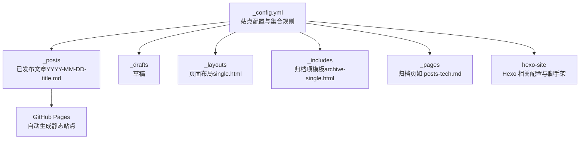
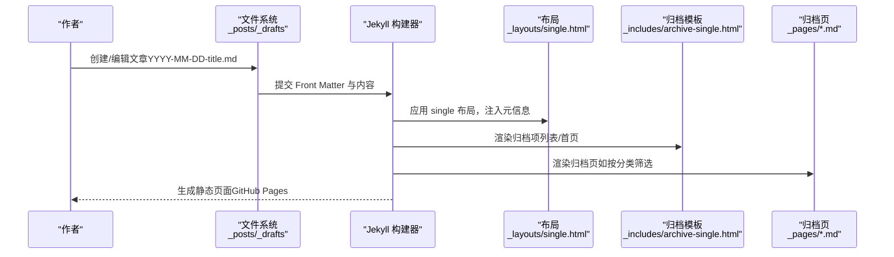
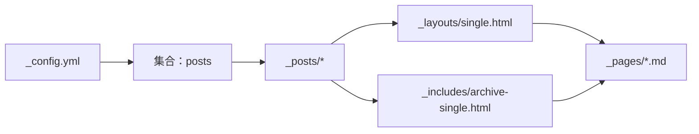

# 博客文章管理

<cite>
**本文引用的文件**
- [_config.yml](file://_config.yml)
- [README.md](file://README.md)
- [_posts/2025-03-11-my-first-blog.md](file://_posts/2025-03-11-my-first-blog.md)
- [_posts/2025-03-11-python-basics.md](file://_posts/2025-03-11-python-basics.md)
- [_posts/2025-03-11-daily-thoughts.md](file://_posts/2025-03-11-daily-thoughts.md)
- [_posts/2025-02-12-optimize.md](file://_posts/2025-02-12-optimize.md)
- [_posts/2025-03-11-spring-feeling.md](file://_posts/2025-03-11-spring-feeling.md)
- [_drafts/post-draft.md](file://_drafts/post-draft.md)
- [_layouts/single.html](file://_layouts/single.html)
- [_includes/archive-single.html](file://_includes/archive-single.html)
- [_pages/posts-tech.md](file://_pages/posts-tech.md)
- [hexo-site/scaffolds/post.md](file://hexo-site/scaffolds/post.md)
- [hexo-site/_config.yml](file://hexo-site/_config.yml)
- [_pages/markdown.md](file://_pages/markdown.md)
</cite>

## 目录
1. [简介](#简介)
2. [项目结构](#项目结构)
3. [核心组件](#核心组件)
4. [架构概览](#架构概览)
5. [详细组件分析](#详细组件分析)
6. [依赖分析](#依赖分析)
7. [性能考虑](#性能考虑)
8. [故障排查指南](#故障排查指南)
9. [结论](#结论)
10. [附录](#附录)

## 简介
本文件面向不同技术水平的博客作者，系统讲解博客文章的命名规范、Front Matter 字段配置、内容格式要求、分类与标签体系、发布流程与草稿管理、预览与测试方法、批量创建与管理技巧，以及常见问题与排错建议。内容结合当前仓库中的实际配置与示例文件，帮助你高效、稳定地维护博客内容。

## 项目结构
本博客基于 Jekyll（GitHub Pages）主题构建，文章内容位于 _posts 目录，采用“YYYY-MM-DD-title.md”的命名规范；草稿位于 _drafts；页面归档与展示逻辑由布局与 includes 控制；站点配置集中在根目录的 _config.yml。

图表来源
- [_config.yml](file://_config.yml)
- [_posts/2025-03-11-my-first-blog.md](file://_posts/2025-03-11-my-first-blog.md)
- [_layouts/single.html](file://_layouts/single.html)
- [_includes/archive-single.html](file://_includes/archive-single.html)
- [_pages/posts-tech.md](file://_pages/posts-tech.md)
- [hexo-site/_config.yml](file://hexo-site/_config.yml)

章节来源
- [_config.yml](file://_config.yml)
- [_posts/2025-03-11-my-first-blog.md](file://_posts/2025-03-11-my-first-blog.md)
- [_posts/2025-03-11-python-basics.md](file://_posts/2025-03-11-python-basics.md)
- [_posts/2025-03-11-daily-thoughts.md](file://_posts/2025-03-11-daily-thoughts.md)
- [_posts/2025-02-12-optimize.md](file://_posts/2025-02-12-optimize.md)
- [_posts/2025-03-11-spring-feeling.md](file://_posts/2025-03-11-spring-feeling.md)
- [_drafts/post-draft.md](file://_drafts/post-draft.md)
- [_layouts/single.html](file://_layouts/single.html)
- [_includes/archive-single.html](file://_includes/archive-single.html)
- [_pages/posts-tech.md](file://_pages/posts-tech.md)
- [hexo-site/scaffolds/post.md](file://hexo-site/scaffolds/post.md)
- [hexo-site/_config.yml](file://hexo-site/_config.yml)

## 核心组件
- 文章集合与命名规范
  - 文章统一存放于 _posts，文件名必须遵循“YYYY-MM-DD-title.md”，且 Front Matter 中的 date 字段需与文件名日期一致或更精确。
  - 示例参考：[2025-03-11-my-first-blog.md](file://_posts/2025-03-11-my-first-blog.md)，[2025-03-11-python-basics.md](file://_posts/2025-03-11-python-basics.md)，[2025-03-11-daily-thoughts.md](file://_posts/2025-03-11-daily-thoughts.md)，[2025-02-12-optimize.md](file://_posts/2025-02-12-optimize.md)，[2025-03-11-spring-feeling.md](file://_posts/2025-03-11-spring-feeling.md)。
- Front Matter 字段
  - 必填/常用字段：title、date、layout、author_profile、read_time、comments、share、related、categories、tags、excerpt。
  - 示例参考：[2025-03-11-my-first-blog.md](file://_posts/2025-03-11-my-first-blog.md)，[2025-03-11-python-basics.md](file://_posts/2025-03-11-python-basics.md)，[2025-03-11-daily-thoughts.md](file://_posts/2025-03-11-daily-thoughts.md)。
- 布局与归档
  - 文章默认布局 single，由 [_layouts/single.html](file://_layouts/single.html) 控制页面结构与元信息输出。
  - 归档项模板由 [_includes/archive-single.html](file://_includes/archive-single.html) 提供，控制列表页/归档页的文章摘要、时间、标签等展示。
  - 自定义归档页示例：[_pages/posts-tech.md](file://_pages/posts-tech.md) 通过 Liquid 过滤器筛选指定分类下的文章。
- 草稿管理
  - 草稿位于 _drafts，示例：[_drafts/post-draft.md](file://_drafts/post-draft.md)。Jekyll 默认不会构建草稿，发布前请移至 _posts 并修正命名与 Front Matter。
- 预览与本地服务
  - 本地预览命令与环境要求详见 [README.md](file://README.md)。
- Hexo 脚手架（可选）
  - 若使用 Hexo 生成器，可在 hexo-site 目录下使用脚手架模板生成新文章，参考 [hexo-site/scaffolds/post.md](file://hexo-site/scaffolds/post.md)。

章节来源
- [_config.yml](file://_config.yml)
- [_posts/2025-03-11-my-first-blog.md](file://_posts/2025-03-11-my-first-blog.md)
- [_posts/2025-03-11-python-basics.md](file://_posts/2025-03-11-python-basics.md)
- [_posts/2025-03-11-daily-thoughts.md](file://_posts/2025-03-11-daily-thoughts.md)
- [_layouts/single.html](file://_layouts/single.html)
- [_includes/archive-single.html](file://_includes/archive-single.html)
- [_pages/posts-tech.md](file://_pages/posts-tech.md)
- [_drafts/post-draft.md](file://_drafts/post-draft.md)
- [README.md](file://README.md)
- [hexo-site/scaffolds/post.md](file://hexo-site/scaffolds/post.md)

## 架构概览
下图展示了从文章文件到页面渲染的关键路径，包括 Front Matter 解析、布局装配、归档模板与页面生成。

图表来源
- [_config.yml](file://_config.yml)
- [_posts/2025-03-11-my-first-blog.md](file://_posts/2025-03-11-my-first-blog.md)
- [_layouts/single.html](file://_layouts/single.html)
- [_includes/archive-single.html](file://_includes/archive-single.html)
- [_pages/posts-tech.md](file://_pages/posts-tech.md)

## 详细组件分析

### 命名规范与 Front Matter 字段详解
- 命名规范
  - 文件名格式：YYYY-MM-DD-title.md
  - date 字段需与文件名日期一致或更精确（如含时区与时间）
  - 示例参考：[2025-03-11-my-first-blog.md](file://_posts/2025-03-11-my-first-blog.md)，[2025-03-11-python-basics.md](file://_posts/2025-03-11-python-basics.md)
- Front Matter 字段
  - title：文章标题
  - excerpt：列表页摘要（可选）
  - date：发布时间（与文件名一致或更精确）
  - layout：页面布局（推荐 single）
  - author_profile、read_time、comments、share、related：页面行为开关
  - categories：分类（数组，可选）
  - tags：标签（数组，可选）
  - 示例参考：[2025-03-11-my-first-blog.md](file://_posts/2025-03-11-my-first-blog.md)，[2025-03-11-python-basics.md](file://_posts/2025-03-11-python-basics.md)，[2025-03-11-daily-thoughts.md](file://_posts/2025-03-11-daily-thoughts.md)

章节来源
- [_posts/2025-03-11-my-first-blog.md](file://_posts/2025-03-11-my-first-blog.md)
- [_posts/2025-03-11-python-basics.md](file://_posts/2025-03-11-python-basics.md)
- [_posts/2025-03-11-daily-thoughts.md](file://_posts/2025-03-11-daily-thoughts.md)

### 内容格式与 Markdown 语法
- Markdown 语法与示例
  - 支持标题、列表、代码块、引用、链接等基础语法
  - 代码块支持语法高亮（kramdown + rouge）
  - 示例参考：[2025-03-11-my-first-blog.md](file://_posts/2025-03-11-my-first-blog.md)，[2025-03-11-python-basics.md](file://_posts/2025-03-11-python-basics.md)，[2025-02-12-optimize.md](file://_posts/2025-02-12-optimize.md)
- 页面内 Markdown 说明
  - 站点提供了 Markdown 语法示例页面，可作为参考：[_pages/markdown.md](file://_pages/markdown.md)

章节来源
- [_posts/2025-03-11-my-first-blog.md](file://_posts/2025-03-11-my-first-blog.md)
- [_posts/2025-03-11-python-basics.md](file://_posts/2025-03-11-python-basics.md)
- [_posts/2025-02-12-optimize.md](file://_posts/2025-02-12-optimize.md)
- [_pages/markdown.md](file://_pages/markdown.md)

### 分类系统（categories）与标签系统（tags）
- 分类与标签的作用
  - categories：用于文章的大类划分（如技术教程、碎碎念、随笔）
  - tags：用于细粒度标记（如 Python、性能优化）
- 使用方式
  - Front Matter 中以数组形式声明 categories 与 tags
  - 归档页可通过 Liquid 过滤器筛选指定分类下的文章，示例：[_pages/posts-tech.md](file://_pages/posts-tech.md)
- 展示逻辑
  - 布局与归档模板共同决定列表页摘要、时间、标签等呈现，参考：[_layouts/single.html](file://_layouts/single.html)，[_includes/archive-single.html](file://_includes/archive-single.html)

章节来源
- [_posts/2025-03-11-python-basics.md](file://_posts/2025-03-11-python-basics.md)
- [_posts/2025-03-11-daily-thoughts.md](file://_posts/2025-03-11-daily-thoughts.md)
- [_pages/posts-tech.md](file://_pages/posts-tech.md)
- [_layouts/single.html](file://_layouts/single.html)
- [_includes/archive-single.html](file://_includes/archive-single.html)

### 文章发布流程、草稿管理、预览与测试
- 发布流程
  - 草稿阶段：在 _drafts 中撰写，完成后移至 _posts，修正文件名为“YYYY-MM-DD-title.md”
  - 校验 Front Matter：确保 title、date、layout、categories/tags 等字段完整
  - 预览：使用本地服务命令启动 Jekyll 预览，参考 [README.md](file://README.md)
  - 推送：提交到远程仓库，等待 GitHub Pages 自动构建
- 草稿管理
  - 草稿示例：[_drafts/post-draft.md](file://_drafts/post-draft.md)
  - 注意：Jekyll 默认不构建草稿，发布前务必移至 _posts
- 预览与测试
  - 本地预览命令与依赖安装详见 [README.md](file://README.md)
  - Docker/DevContainer 可作为替代方案，详见 [README.md](file://README.md)

章节来源
- [_drafts/post-draft.md](file://_drafts/post-draft.md)
- [README.md](file://README.md)

### 批量创建与管理技巧
- 使用 Hexo 脚手架（可选）
  - 可在 hexo-site 目录下使用脚手架模板快速生成新文章，参考 [hexo-site/scaffolds/post.md](file://hexo-site/scaffolds/post.md)
  - Hexo 配置（如 permalink、highlight 等）参考 [hexo-site/_config.yml](file://hexo-site/_config.yml)
- 批量筛选与归档
  - 通过归档页的 Liquid 过滤器按分类筛选文章，示例：[_pages/posts-tech.md](file://_pages/posts-tech.md)
- 命名一致性检查
  - 建议在提交前统一校验文件名与 Front Matter 的日期字段是否一致

章节来源
- [hexo-site/scaffolds/post.md](file://hexo-site/scaffolds/post.md)
- [hexo-site/_config.yml](file://hexo-site/_config.yml)
- [_pages/posts-tech.md](file://_pages/posts-tech.md)

### 常见写作问题与排错
- Front Matter 未闭合或格式错误
  - 确保使用 YAML 语法，键值对缩进正确，数组项以“-”开头
- 日期不一致
  - 文件名中的日期需与 Front Matter 的 date 字段一致或更精确
- 布局与展示异常
  - 检查 layout 是否为 single，确认 _layouts/single.html 与 _includes/archive-single.html 未被误删
- 本地预览失败
  - 按 [README.md](file://README.md) 安装依赖并执行本地服务命令；必要时使用 Docker/DevContainer
- 归档页未显示预期内容
  - 检查归档页的 Liquid 过滤器与分类名称是否匹配，参考 [_pages/posts-tech.md](file://_pages/posts-tech.md)

章节来源
- [_posts/2025-03-11-my-first-blog.md](file://_posts/2025-03-11-my-first-blog.md)
- [_layouts/single.html](file://_layouts/single.html)
- [_includes/archive-single.html](file://_includes/archive-single.html)
- [_pages/posts-tech.md](file://_pages/posts-tech.md)
- [README.md](file://README.md)

## 依赖分析
- 配置与集合
  - 站点配置集中于 [_config.yml](file://_config.yml)，定义了 Markdown 处理器、高亮、permalink、collections 等
- 文章与布局
  - 文章文件通过 Front Matter 与布局单页装配，最终由 GitHub Pages 生成静态页面
- 归档与筛选
  - 归档页通过 Liquid 过滤器筛选指定分类的文章，模板来自 [_includes/archive-single.html](file://_includes/archive-single.html)

图表来源
- [_config.yml](file://_config.yml)
- [_posts/2025-03-11-my-first-blog.md](file://_posts/2025-03-11-my-first-blog.md)
- [_layouts/single.html](file://_layouts/single.html)
- [_includes/archive-single.html](file://_includes/archive-single.html)
- [_pages/posts-tech.md](file://_pages/posts-tech.md)

章节来源
- [_config.yml](file://_config.yml)
- [_posts/2025-03-11-my-first-blog.md](file://_posts/2025-03-11-my-first-blog.md)
- [_layouts/single.html](file://_layouts/single.html)
- [_includes/archive-single.html](file://_includes/archive-single.html)
- [_pages/posts-tech.md](file://_pages/posts-tech.md)

## 性能考虑
- 构建性能
  - 合理使用代码块与图片，避免过大资源导致构建时间增长
  - 使用合适的高亮与压缩策略（站点已启用压缩与高亮）
- 展示性能
  - 列表页摘要与“阅读时长”等功能由布局与模板控制，保持 Front Matter 简洁有助于提升渲染效率

章节来源
- [_config.yml](file://_config.yml)
- [_layouts/single.html](file://_layouts/single.html)
- [_includes/archive-single.html](file://_includes/archive-single.html)

## 故障排查指南
- 本地预览失败
  - 检查 Ruby、Bundler、Node.js 安装与版本，参考 [README.md](file://README.md)
  - 若权限不足，按说明使用本地安装路径配置
- 页面未更新
  - 修改 Markdown 内容后，Jekyll 会自动重建；修改 _config.yml 需重启服务
- 归档页为空
  - 检查分类名称与 Front Matter 中的 categories 是否一致
- 草稿无法预览
  - Jekyll 默认不构建草稿，请移至 _posts 目录后再预览

章节来源
- [README.md](file://README.md)
- [_pages/posts-tech.md](file://_pages/posts-tech.md)
- [_drafts/post-draft.md](file://_drafts/post-draft.md)

## 结论
通过统一的命名规范、标准化的 Front Matter 字段、清晰的分类与标签体系，以及完善的本地预览与归档机制，本博客能够稳定、高效地管理各类文章内容。建议在写作流程中严格执行草稿—预览—发布的步骤，并利用归档页与筛选机制提升内容组织与检索效率。

## 附录
- 博客文章模板（Front Matter 字段清单）
  - 必填：title、date、layout
  - 常用：author_profile、read_time、comments、share、related
  - 分类与标签：categories（数组）、tags（数组）
  - 摘要：excerpt（可选）
  - 示例参考：[2025-03-11-my-first-blog.md](file://_posts/2025-03-11-my-first-blog.md)，[2025-03-11-python-basics.md](file://_posts/2025-03-11-python-basics.md)，[2025-03-11-daily-thoughts.md](file://_posts/2025-03-11-daily-thoughts.md)
- 实际示例
  - 技术教程：[2025-03-11-python-basics.md](file://_posts/2025-03-11-python-basics.md)
  - 生活随笔：[2025-03-11-daily-thoughts.md](file://_posts/2025-03-11-daily-thoughts.md)
  - 性能优化：[2025-02-12-optimize.md](file://_posts/2025-02-12-optimize.md)
  - 春日随笔：[2025-03-11-spring-feeling.md](file://_posts/2025-03-11-spring-feeling.md)
- 草稿示例
  - [_drafts/post-draft.md](file://_drafts/post-draft.md)
- 归档与筛选
  - 自定义归档页：[_pages/posts-tech.md](file://_pages/posts-tech.md)
  - 归档项模板：[_includes/archive-single.html](file://_includes/archive-single.html)
  - 布局装配：[_layouts/single.html](file://_layouts/single.html)
- 本地预览
  - 参考 [README.md](file://README.md)