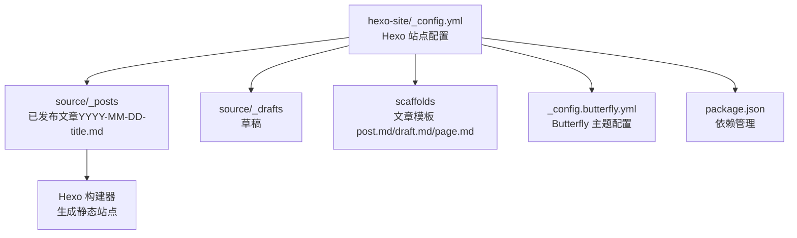
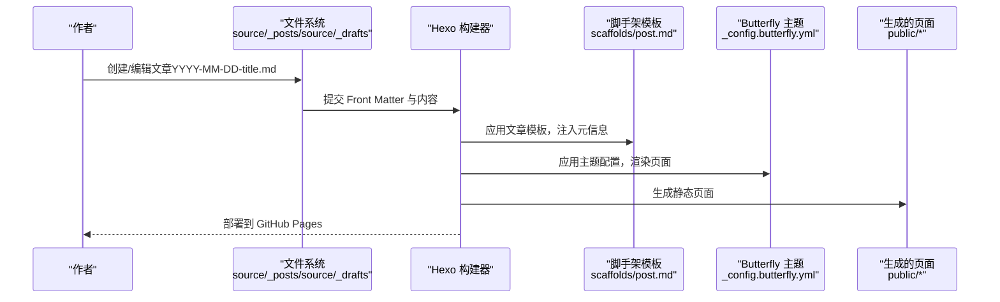
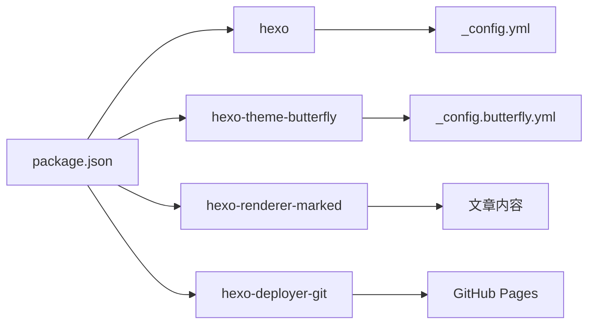

# 博客文章管理

<cite>
**本文引用的文件**
- [hexo-site/_config.yml](file://hexo-site/_config.yml)
- [hexo-site/package.json](file://hexo-site/package.json)
- [hexo-site/scaffolds/post.md](file://hexo-site/scaffolds/post.md)
- [hexo-site/scaffolds/draft.md](file://hexo-site/scaffolds/draft.md)
- [hexo-site/scaffolds/page.md](file://hexo-site/scaffolds/page.md)
- [hexo-site/source/_posts/2025-03-11-useful-website.md](file://hexo-site/source/_posts/2025-03-11-useful-website.md)
- [hexo-site/source/_posts/2025-03-12-optimize.md](file://hexo-site/source/_posts/2025-03-12-optimize.md)
- [hexo-site/_config.butterfly.yml](file://hexo-site/_config.butterfly.yml)
- [README.md](file://README.md)
</cite>

## 更新摘要
**变更内容**
- 更新了从 Jekyll 到 Hexo 的架构转换说明
- 新增了 Hexo 的 Markdown + Front-matter 结构详解
- 更新了文章模板和配置选项
- 添加了 Hexo 脚手架模板的详细说明
- 更新了部署和构建流程

## 目录
1. [简介](#简介)
2. [项目结构](#项目结构)
3. [核心组件](#核心组件)
4. [架构概览](#架构概览)
5. [详细组件分析](#详细组件分析)
6. [依赖分析](#依赖分析)
7. [性能考虑](#性能考虑)
8. [故障排查指南](#故障排查指南)
9. [结论](#结论)
10. [附录](#附录)

## 简介
本文件面向不同技术水平的博客作者，系统讲解基于 Hexo 的博客文章管理，包括 Markdown + Front-matter 结构、文章模板配置、内容格式要求、分类与标签体系、发布流程与草稿管理、预览与测试方法、批量创建与管理技巧，以及常见问题与排错建议。内容结合当前仓库中的实际配置与示例文件，帮助你高效、稳定地维护博客内容。

## 项目结构
本博客基于 Hexo 静态网站生成器构建，采用 Markdown + Front-matter 结构，文章内容位于 hexo-site/source/_posts 目录，采用"YYYY-MM-DD-title.md"的命名规范；草稿位于 hexo-site/source/_drafts；主题配置集中在 hexo-site/_config.butterfly.yml；站点配置集中在 hexo-site/_config.yml。

**图表来源**
- [hexo-site/_config.yml](file://hexo-site/_config.yml)
- [hexo-site/source/_posts/2025-03-11-useful-website.md](file://hexo-site/source/_posts/2025-03-11-useful-website.md)
- [hexo-site/scaffolds/post.md](file://hexo-site/scaffolds/post.md)
- [hexo-site/_config.butterfly.yml](file://hexo-site/_config.butterfly.yml)
- [hexo-site/package.json](file://hexo-site/package.json)

**章节来源**
- [hexo-site/_config.yml](file://hexo-site/_config.yml)
- [hexo-site/source/_posts/2025-03-11-useful-website.md](file://hexo-site/source/_posts/2025-03-11-useful-website.md)
- [hexo-site/source/_posts/2025-03-12-optimize.md](file://hexo-site/source/_posts/2025-03-12-optimize.md)
- [hexo-site/scaffolds/post.md](file://hexo-site/scaffolds/post.md)
- [hexo-site/scaffolds/draft.md](file://hexo-site/scaffolds/draft.md)
- [hexo-site/scaffolds/page.md](file://hexo-site/scaffolds/page.md)
- [hexo-site/_config.butterfly.yml](file://hexo-site/_config.butterfly.yml)
- [hexo-site/package.json](file://hexo-site/package.json)

## 核心组件
- **文章集合与命名规范**
  - 文章统一存放于 hexo-site/source/_posts，文件名必须遵循"YYYY-MM-DD-title.md"格式
  - Front Matter 中的 date 字段需与文件名日期一致或更精确
  - 示例参考：[2025-03-11-useful-website.md](file://hexo-site/source/_posts/2025-03-11-useful-website.md)，[2025-03-12-optimize.md](file://hexo-site/source/_posts/2025-03-12-optimize.md)
- **Front Matter 字段配置**
  - 必填字段：title、date、updated
  - 常用字段：excerpt、categories、tags、toc、abbrlink
  - 示例参考：[2025-03-11-useful-website.md](file://hexo-site/source/_posts/2025-03-11-useful-website.md)，[2025-03-12-optimize.md](file://hexo-site/source/_posts/2025-03-12-optimize.md)
- **Hexo 配置系统**
  - 站点配置：hexo-site/_config.yml，包含 URL、链接格式、分页、高亮等设置
  - 主题配置：hexo-site/_config.butterfly.yml，控制外观和功能
  - 依赖管理：hexo-site/package.json，包含 Hexo 核心和插件
- **草稿管理**
  - 草稿位于 hexo-site/source/_drafts，示例：[draft.md](file://hexo-site/scaffolds/draft.md)
  - Hexo 默认不会构建草稿，发布前请移至 _posts 并修正命名与 Front Matter
- **文章模板**
  - 标准文章模板：[post.md](file://hexo-site/scaffolds/post.md)
  - 草稿模板：[draft.md](file://hexo-site/scaffolds/draft.md)
  - 页面模板：[page.md](file://hexo-site/scaffolds/page.md)

**章节来源**
- [hexo-site/_config.yml](file://hexo-site/_config.yml)
- [hexo-site/source/_posts/2025-03-11-useful-website.md](file://hexo-site/source/_posts/2025-03-11-useful-website.md)
- [hexo-site/source/_posts/2025-03-12-optimize.md](file://hexo-site/source/_posts/2025-03-12-optimize.md)
- [hexo-site/scaffolds/post.md](file://hexo-site/scaffolds/post.md)
- [hexo-site/scaffolds/draft.md](file://hexo-site/scaffolds/draft.md)
- [hexo-site/scaffolds/page.md](file://hexo-site/scaffolds/page.md)
- [hexo-site/_config.butterfly.yml](file://hexo-site/_config.butterfly.yml)
- [hexo-site/package.json](file://hexo-site/package.json)

## 架构概览
下图展示了从 Hexo 文章文件到页面渲染的关键路径，包括 Front Matter 解析、模板渲染、主题装配与静态页面生成。

**图表来源**
- [hexo-site/_config.yml](file://hexo-site/_config.yml)
- [hexo-site/source/_posts/2025-03-11-useful-website.md](file://hexo-site/source/_posts/2025-03-11-useful-website.md)
- [hexo-site/scaffolds/post.md](file://hexo-site/scaffolds/post.md)
- [hexo-site/_config.butterfly.yml](file://hexo-site/_config.butterfly.yml)

## 详细组件分析

### 命名规范与 Front Matter 字段详解
- **命名规范**
  - 文件名格式：YYYY-MM-DD-title.md
  - date 字段需与文件名日期一致或更精确（支持时区与时间）
  - 示例参考：[2025-03-11-useful-website.md](file://hexo-site/source/_posts/2025-03-11-useful-website.md)，[2025-03-12-optimize.md](file://hexo-site/source/_posts/2025-03-12-optimize.md)
- **Front Matter 字段配置**
  - 必填字段：title（文章标题）、date（发布日期）、updated（更新日期）
  - 摘要字段：excerpt（列表页摘要）
  - 分类标签：categories（数组，分类）、tags（数组，标签）
  - 功能字段：toc（目录开关）、abbrlink（文章链接标识）
  - 示例参考：[2025-03-11-useful-website.md](file://hexo-site/source/_posts/2025-03-11-useful-website.md)，[2025-03-12-optimize.md](file://hexo-site/source/_posts/2025-03-12-optimize.md)

**章节来源**
- [hexo-site/source/_posts/2025-03-11-useful-website.md](file://hexo-site/source/_posts/2025-03-11-useful-website.md)
- [hexo-site/source/_posts/2025-03-12-optimize.md](file://hexo-site/source/_posts/2025-03-12-optimize.md)

### 内容格式与 Markdown 语法
- **Markdown 语法支持**
  - 支持标题、列表、代码块、引用、链接等基础语法
  - 代码块支持语法高亮（highlight.js + 行号显示）
  - 支持数学公式（MathJax）、Mermaid 图表等扩展功能
  - 示例参考：[2025-03-12-optimize.md](file://hexo-site/source/_posts/2025-03-12-optimize.md)
- **Hexo 渲染器配置**
  - 使用 hexo-renderer-marked 处理 Markdown
  - 使用 hexo-renderer-stylus 处理样式
  - 支持 EJS 模板引擎

**章节来源**
- [hexo-site/source/_posts/2025-03-12-optimize.md](file://hexo-site/source/_posts/2025-03-12-optimize.md)
- [hexo-site/_config.yml](file://hexo-site/_config.yml)
- [hexo-site/package.json](file://hexo-site/package.json)

### 分类系统（categories）与标签系统（tags）
- **分类与标签的作用**
  - categories：用于文章的大类划分（如技术文档、学习笔记）
  - tags：用于细粒度标记（如性能优化、Python、游戏开发）
- **使用方式**
  - Front Matter 中以数组形式声明 categories 与 tags
  - Hexo 自动生成分类和标签页面
  - 支持分类映射和标签映射配置
- **展示逻辑**
  - 通过 Butterfly 主题配置控制侧边栏显示
  - 支持最新文章、分类统计等功能

**章节来源**
- [hexo-site/source/_posts/2025-03-11-useful-website.md](file://hexo-site/source/_posts/2025-03-11-useful-website.md)
- [hexo-site/source/_posts/2025-03-12-optimize.md](file://hexo-site/source/_posts/2025-03-12-optimize.md)
- [hexo-site/_config.butterfly.yml](file://hexo-site/_config.butterfly.yml)

### 文章发布流程、草稿管理、预览与测试
- **发布流程**
  - 草稿阶段：在 hexo-site/source/_drafts 中撰写
  - 完成后移至 hexo-site/source/_posts，修正文件名为"YYYY-MM-DD-title.md"
  - 校验 Front Matter：确保 title、date、updated、categories/tags 等字段完整
  - 预览：使用 `npm run server` 启动本地服务
  - 构建：使用 `npm run build` 生成静态文件
  - 部署：使用 `npm run deploy` 部署到 GitHub Pages
- **草稿管理**
  - 草稿模板：[draft.md](file://hexo-site/scaffolds/draft.md)
  - Hexo 默认不会构建草稿，发布前务必移至 _posts
- **预览与测试**
  - 本地预览：`npm run server`
  - 构建验证：`npm run build`
  - 部署验证：`npm run deploy`

**章节来源**
- [hexo-site/scaffolds/draft.md](file://hexo-site/scaffolds/draft.md)
- [hexo-site/package.json](file://hexo-site/package.json)

### 批量创建与管理技巧
- **使用 Hexo 脚手架**
  - 标准文章模板：[post.md](file://hexo-site/scaffolds/post.md)
  - 页面模板：[page.md](file://hexo-site/scaffolds/page.md)
  - 通过 Hexo CLI 快速生成新文章
- **Hexo 配置优化**
  - permalink 设置：`:year/:month/:day/:title/`
  - 分页配置：每页显示 10 篇文章
  - 高亮配置：开启行号显示，支持多种编程语言
- **主题定制**
  - Butterfly 主题配置：[hexo-site/_config.butterfly.yml](file://hexo-site/_config.butterfly.yml)
  - 支持深色模式、目录导航、侧边栏等功能

**章节来源**
- [hexo-site/scaffolds/post.md](file://hexo-site/scaffolds/post.md)
- [hexo-site/scaffolds/page.md](file://hexo-site/scaffolds/page.md)
- [hexo-site/_config.yml](file://hexo-site/_config.yml)
- [hexo-site/_config.butterfly.yml](file://hexo-site/_config.butterfly.yml)

### 常见写作问题与排错
- **Front Matter 格式错误**
  - 确保使用 YAML 语法，键值对缩进正确
  - 数组项需以"-"开头，正确缩进
- **日期格式不匹配**
  - 文件名中的日期需与 Front Matter 的 date 字段一致
  - 支持多种日期格式，建议使用标准格式
- **模板变量未替换**
  - 确保使用 Hexo CLI 生成文章，而非手动复制模板
  - 检查 scaffolds 目录中的模板文件
- **本地预览失败**
  - 按 [README.md](file://README.md) 安装 Node.js 和依赖
  - 使用 `npm install` 安装所有依赖
  - 检查端口占用，使用 `npm run server` 启动服务
- **部署失败**
  - 检查 GitHub 仓库权限和 SSH 密钥
  - 确认部署配置中的仓库地址和分支设置

**章节来源**
- [hexo-site/source/_posts/2025-03-11-useful-website.md](file://hexo-site/source/_posts/2025-03-11-useful-website.md)
- [hexo-site/_config.yml](file://hexo-site/_config.yml)
- [hexo-site/_config.butterfly.yml](file://hexo-site/_config.butterfly.yml)
- [README.md](file://README.md)

## 依赖分析
- **Hexo 核心依赖**
  - hexo：静态网站生成器核心
  - hexo-deployer-git：Git 部署插件
  - hexo-renderer-marked：Markdown 渲染器
  - hexo-theme-butterfly：Butterfly 主题
- **功能扩展**
  - hexo-abbrlink：文章链接缩短
  - hexo-feed：RSS 订阅生成
  - hexo-generator-*：各种页面生成器
  - hexo-math：数学公式支持
  - hexo-wordcount：字数统计
- **配置与集合**
  - 站点配置：hexo-site/_config.yml
  - 主题配置：hexo-site/_config.butterfly.yml
  - 脚手架模板：hexo-site/scaffolds/

**图表来源**
- [hexo-site/package.json](file://hexo-site/package.json)
- [hexo-site/_config.yml](file://hexo-site/_config.yml)
- [hexo-site/_config.butterfly.yml](file://hexo-site/_config.butterfly.yml)

**章节来源**
- [hexo-site/package.json](file://hexo-site/package.json)
- [hexo-site/_config.yml](file://hexo-site/_config.yml)
- [hexo-site/_config.butterfly.yml](file://hexo-site/_config.butterfly.yml)

## 性能考虑
- **构建性能**
  - 合理使用代码块与图片，避免过大资源导致构建时间增长
  - 使用合适的高亮与压缩策略（已启用 highlight.js 行号显示）
  - 分页配置优化：每页 10 篇文章，平衡加载速度与浏览体验
- **展示性能**
  - Butterfly 主题优化：支持深色模式、懒加载等特性
  - 目录导航：toc 功能提升大文章的可读性
  - 侧边栏功能：最新文章、分类统计等功能的性能考量

**章节来源**
- [hexo-site/_config.yml](file://hexo-site/_config.yml)
- [hexo-site/_config.butterfly.yml](file://hexo-site/_config.butterfly.yml)

## 故障排查指南
- **本地预览失败**
  - 检查 Node.js 版本兼容性
  - 使用 `npm install` 安装所有依赖
  - 检查端口占用情况，确保 4000 端口可用
  - 清理缓存：`npm run clean` 后重新构建
- **文章无法显示**
  - 检查文件命名是否符合 YYYY-MM-DD-title.md 格式
  - 验证 Front Matter 语法是否正确
  - 确认文章位于正确的 source/_posts 目录
- **部署失败**
  - 检查 GitHub 仓库权限和 SSH 密钥配置
  - 验证部署配置中的仓库地址和分支设置
  - 确认 GitHub Actions 已正确配置
- **主题显示异常**
  - 检查 Butterfly 主题配置文件
  - 验证主题版本兼容性
  - 清理主题缓存后重新安装

**章节来源**
- [hexo-site/package.json](file://hexo-site/package.json)
- [hexo-site/_config.yml](file://hexo-site/_config.yml)
- [hexo-site/_config.butterfly.yml](file://hexo-site/_config.butterfly.yml)
- [README.md](file://README.md)

## 结论
通过 Hexo 的 Markdown + Front-matter 结构、标准化的脚手架模板、清晰的分类与标签体系，以及完善的本地预览与部署机制，本博客能够稳定、高效地管理各类文章内容。建议在写作流程中严格执行草稿—预览—构建—部署的步骤，并利用 Hexo 的模板系统和 Butterfly 主题提升内容组织与展示效果。

## 附录
- **博客文章模板（Front Matter 字段清单）**
  - 必填：title、date、updated
  - 常用：excerpt、categories、tags、toc、abbrlink
  - 示例参考：[2025-03-11-useful-website.md](file://hexo-site/source/_posts/2025-03-11-useful-website.md)，[2025-03-12-optimize.md](file://hexo-site/source/_posts/2025-03-12-optimize.md)
- **Hexo 脚手架模板**
  - 标准文章模板：[post.md](file://hexo-site/scaffolds/post.md)
  - 草稿模板：[draft.md](file://hexo-site/scaffolds/draft.md)
  - 页面模板：[page.md](file://hexo-site/scaffolds/page.md)
- **实际示例**
  - 技术文档：[2025-03-11-useful-website.md](file://hexo-site/source/_posts/2025-03-11-useful-website.md)
  - 性能优化：[2025-03-12-optimize.md](file://hexo-site/source/_posts/2025-03-12-optimize.md)
- **配置文件**
  - 站点配置：[hexo-site/_config.yml](file://hexo-site/_config.yml)
  - 主题配置：[hexo-site/_config.butterfly.yml](file://hexo-site/_config.butterfly.yml)
  - 依赖管理：[hexo-site/package.json](file://hexo-site/package.json)
- **本地开发**
  - 预览命令：`npm run server`
  - 构建命令：`npm run build`
  - 部署命令：`npm run deploy`