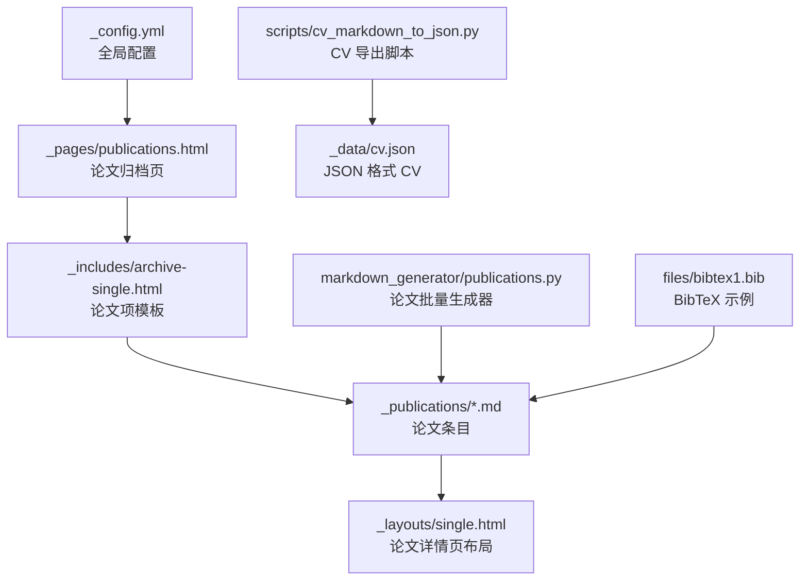
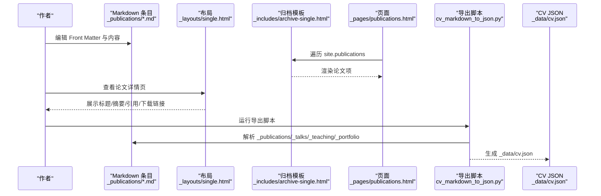
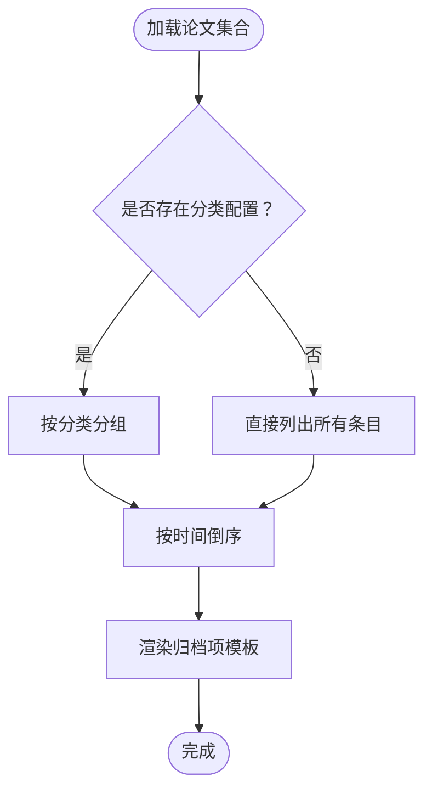
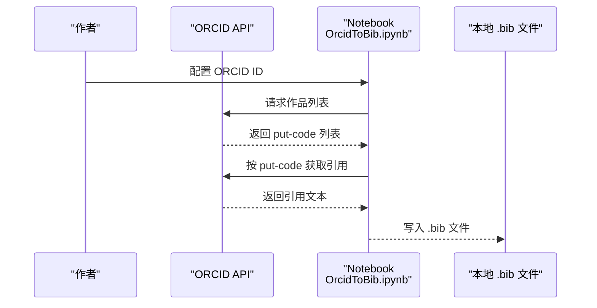
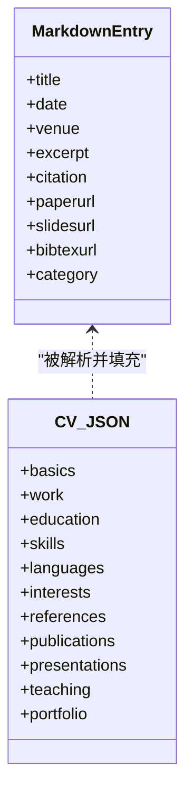
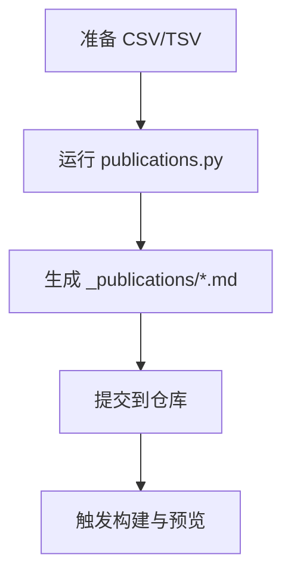
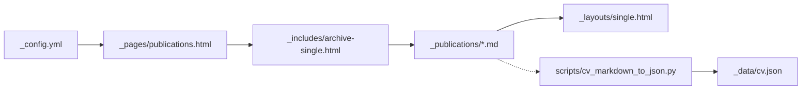

# 学术论文管理

<cite>
**本文档引用的文件**
- [_config.yml](file://_config.yml)
- [_publications/2009-10-01-paper-title-number-1.md](file://_publications/2009-10-01-paper-title-number-1.md)
- [_publications/2010-10-01-paper-title-number-2.md](file://_publications/2010-10-01-paper-title-number-2.md)
- [_publications/2015-10-01-paper-title-number-3.md](file://_publications/2015-10-01-paper-title-number-3.md)
- [_publications/2024-02-17-paper-title-number-4.md](file://_publications/2024-02-17-paper-title-number-4.md)
- [_publications/2025-06-08-paper-title-number-5.md](file://_publications/2025-06-08-paper-title-number-5.md)
- [_pages/publications.html](file://_pages/publications.html)
- [_includes/archive-single.html](file://_includes/archive-single.html)
- [_layouts/single.html](file://_layouts/single.html)
- [_data/authors.yml](file://_data/authors.yml)
- [_data/cv.json](file://_data/cv.json)
- [scripts/cv_markdown_to_json.py](file://scripts/cv_markdown_to_json.py)
- [markdown_generator/publications.py](file://markdown_generator/publications.py)
- [files/bibtex1.bib](file://files/bibtex1.bib)
- [markdown_generator/OrcidToBib.ipynb](file://markdown_generator/OrcidToBib.ipynb)
</cite>

## 目录
1. [简介](#简介)
2. [项目结构](#项目结构)
3. [核心组件](#核心组件)
4. [架构总览](#架构总览)
5. [详细组件分析](#详细组件分析)
6. [依赖分析](#依赖分析)
7. [性能考虑](#性能考虑)
8. [故障排查指南](#故障排查指南)
9. [结论](#结论)
10. [附录](#附录)

## 简介
本文件面向学术作者，提供一套完整的“学术论文管理”方案，涵盖论文条目命名规范、Front Matter 字段配置、论文数据模型、分类与排序机制、引用格式与 BibTeX 集成、论文图片与附件管理、论文与 CV 系统的集成、批量导入与更新流程、以及数据同步与版本管理建议。目标是帮助您高效维护论文档案，提升展示与检索体验。

## 项目结构
该站点基于 Jekyll 构建，论文内容以集合形式组织在独立目录中，页面通过 Liquid 模板渲染。核心结构如下：
- 论文集合：_publications
- 页面模板：_layouts、_includes
- 页面入口：_pages
- 全局配置：_config.yml
- 数据与导出：_data、scripts、markdown_generator、files

**图表来源**
- [_config.yml](file://_config.yml)
- [_pages/publications.html](file://_pages/publications.html)
- [_includes/archive-single.html](file://_includes/archive-single.html)
- [_layouts/single.html](file://_layouts/single.html)
- [_publications/2009-10-01-paper-title-number-1.md](file://_publications/2009-10-01-paper-title-number-1.md)
- [scripts/cv_markdown_to_json.py](file://scripts/cv_markdown_to_json.py)
- [_data/cv.json](file://_data/cv.json)
- [markdown_generator/publications.py](file://markdown_generator/publications.py)
- [files/bibtex1.bib](file://files/bibtex1.bib)

**章节来源**
- [_config.yml](file://_config.yml)
- [_pages/publications.html](file://_pages/publications.html)

## 核心组件
- 论文集合与命名规范
  - 使用集合名称 publications，文件名采用“YYYY-MM-DD-url_slug.md”的命名模式，自动形成固定前缀的永久链接。
  - 建议：统一使用英文小写、短横线分隔的 url_slug；避免特殊字符与空格。
- Front Matter 字段配置
  - 必填字段：title、collection、date、venue、citation
  - 常用字段：permalink、excerpt、paperurl、slidesurl、bibtexurl、category
  - 可选字段：link、teaser（用于封面图）
- 论文页面与归档页
  - 归档页根据分类配置进行分组展示；单篇论文页根据 Front Matter 渲染标题、摘要、引用与下载链接。
- CV 集成
  - 通过脚本从 _publications、_talks、_teaching、_portfolio 等目录抽取元数据，生成 _data/cv.json，供 CV 页面使用。

**章节来源**
- [_publications/2009-10-01-paper-title-number-1.md](file://_publications/2009-10-01-paper-title-number-1.md)
- [_publications/2010-10-01-paper-title-number-2.md](file://_publications/2010-10-01-paper-title-number-2.md)
- [_publications/2015-10-01-paper-title-number-3.md](file://_publications/2015-10-01-paper-title-number-3.md)
- [_publications/2024-02-17-paper-title-number-4.md](file://_publications/2024-02-17-paper-title-number-4.md)
- [_publications/2025-06-08-paper-title-number-5.md](file://_publications/2025-06-08-paper-title-number-5.md)
- [_pages/publications.html](file://_pages/publications.html)
- [_includes/archive-single.html](file://_includes/archive-single.html)
- [_layouts/single.html](file://_layouts/single.html)
- [scripts/cv_markdown_to_json.py](file://scripts/cv_markdown_to_json.py)
- [_data/cv.json](file://_data/cv.json)

## 架构总览
下图展示了论文数据从 Markdown 条目到页面渲染、再到 CV 导出的整体流程。

**图表来源**
- [_pages/publications.html](file://_pages/publications.html)
- [_includes/archive-single.html](file://_includes/archive-single.html)
- [_layouts/single.html](file://_layouts/single.html)
- [scripts/cv_markdown_to_json.py](file://scripts/cv_markdown_to_json.py)
- [_data/cv.json](file://_data/cv.json)

## 详细组件分析

### 论文条目命名规范与 Front Matter 字段
- 命名规范
  - 文件名：YYYY-MM-DD-url_slug.md
  - url_slug 建议使用英文、短横线连接，避免空格与特殊字符
- Front Matter 字段
  - 必填：title、collection、date、venue、citation
  - 常用：permalink、excerpt、paperurl、slidesurl、bibtexurl、category
  - 可选：link、teaser
- 示例参考
  - [论文条目示例 1](file://_publications/2009-10-01-paper-title-number-1.md)
  - [论文条目示例 2](file://_publications/2010-10-01-paper-title-number-2.md)
  - [论文条目示例 3](file://_publications/2015-10-01-paper-title-number-3.md)
  - [论文条目示例 4](file://_publications/2024-02-17-paper-title-number-4.md)
  - [论文条目示例 5（含数学公式）](file://_publications/2025-06-08-paper-title-number-5.md)

**章节来源**
- [_publications/2009-10-01-paper-title-number-1.md](file://_publications/2009-10-01-paper-title-number-1.md)
- [_publications/2010-10-01-paper-title-number-2.md](file://_publications/2010-10-01-paper-title-number-2.md)
- [_publications/2015-10-01-paper-title-number-3.md](file://_publications/2015-10-01-paper-title-number-3.md)
- [_publications/2024-02-17-paper-title-number-4.md](file://_publications/2024-02-17-paper-title-number-4.md)
- [_publications/2025-06-08-paper-title-number-5.md](file://_publications/2025-06-08-paper-title-number-5.md)

### 论文数据模型
- 字段清单
  - 标题：title
  - 发表日期：date（YYYY-MM-DD）
  - 刊物/会议：venue
  - 摘要：excerpt
  - 引用格式：citation
  - 永久链接：permalink
  - 论文 PDF：paperurl
  - 演示文稿：slidesurl
  - BibTeX：bibtexurl
  - 分类：category（如 manuscripts、conferences、books）
  - 外链：link
  - 封面图：teaser
- 字段复杂度与性能
  - Front Matter 解析为 YAML，读取成本低；页面渲染时仅访问必要字段，整体开销可控。
- 数据一致性建议
  - 统一日期格式与分类键值；确保 paperurl、slidesurl、bibtexurl 的有效性与可访问性。

**章节来源**
- [_publications/2009-10-01-paper-title-number-1.md](file://_publications/2009-10-01-paper-title-number-1.md)
- [_publications/2010-10-01-paper-title-number-2.md](file://_publications/2010-10-01-paper-title-number-2.md)
- [_publications/2015-10-01-paper-title-number-3.md](file://_publications/2015-10-01-paper-title-number-3.md)
- [_publications/2024-02-17-paper-title-number-4.md](file://_publications/2024-02-17-paper-title-number-4.md)
- [_publications/2025-06-08-paper-title-number-5.md](file://_publications/2025-06-08-paper-title-number-5.md)

### 分类与排序机制
- 分类
  - 通过 category 字段区分 manuscripts（期刊文章）、conferences（会议论文）、books（书籍）等
  - 在页面中按分类分组显示，未匹配的条目将被忽略或归入默认分组
- 排序
  - 默认按时间倒序排列（最新在前）
  - 可在页面模板中调整排序逻辑（例如按年份、类型、引用次数等）
- 参考实现
  - [论文归档页](file://_pages/publications.html)
  - [归档项模板](file://_includes/archive-single.html)

**图表来源**
- [_pages/publications.html](file://_pages/publications.html)
- [_includes/archive-single.html](file://_includes/archive-single.html)

**章节来源**
- [_pages/publications.html](file://_pages/publications.html)
- [_includes/archive-single.html](file://_includes/archive-single.html)

### 引用格式与 BibTeX 集成
- 引用格式
  - 建议在 Front Matter 中提供 citation 字段，用于页面展示与复制粘贴
- BibTeX 集成
  - 提供 bibtexurl 字段指向 .bib 文件
  - 示例：[bibtex1.bib](file://files/bibtex1.bib)
  - 可通过 ORCID API 自动抓取引用并生成 .bib 文件（Notebook 示例：[OrcidToBib.ipynb](file://markdown_generator/OrcidToBib.ipynb)）

**图表来源**
- [markdown_generator/OrcidToBib.ipynb](file://markdown_generator/OrcidToBib.ipynb)
- [files/bibtex1.bib](file://files/bibtex1.bib)

**章节来源**
- [_publications/2009-10-01-paper-title-number-1.md](file://_publications/2009-10-01-paper-title-number-1.md)
- [files/bibtex1.bib](file://files/bibtex1.bib)
- [markdown_generator/OrcidToBib.ipynb](file://markdown_generator/OrcidToBib.ipynb)

### 图片与附件管理
- 封面图（teaser）
  - 支持相对路径与绝对路径；若为相对路径会自动拼接 base_path
- 附件
  - paperurl、slidesurl、bibtexurl 指向外部资源；页面会根据字段存在性动态显示下载链接
- 数学公式
  - 支持 MathJax；注意默认定界符为双美元与方括号，需与常规单美元区分

**章节来源**
- [_includes/archive-single.html](file://_includes/archive-single.html)
- [_layouts/single.html](file://_layouts/single.html)
- [_publications/2025-06-08-paper-title-number-5.md](file://_publications/2025-06-08-paper-title-number-5.md)

### 论文与 CV 系统的集成
- 数据来源
  - 脚本从 _publications、_talks、_teaching、_portfolio 等目录解析 Front Matter
- 输出格式
  - 生成 _data/cv.json，包含 basics、work、education、skills、languages、interests、references、publications、presentations、teaching、portfolio 等字段
- 关联页面
  - 可在页面中读取 _data/cv.json 并渲染

**图表来源**
- [scripts/cv_markdown_to_json.py](file://scripts/cv_markdown_to_json.py)
- [_data/cv.json](file://_data/cv.json)

**章节来源**
- [scripts/cv_markdown_to_json.py](file://scripts/cv_markdown_to_json.py)
- [_data/cv.json](file://_data/cv.json)

### 批量导入与更新论文信息
- 批量生成器
  - 输入：CSV/TSV（列名需满足要求）
  - 输出：_publications 下的 Markdown 条目
  - 功能：自动生成 Front Matter、文件名与永久链接
- 使用步骤
  - 准备 CSV/TSV（包含 pub_date、title、venue、excerpt、citation、url_slug、paper_url、slides_url，可选 category）
  - 运行脚本 publications.py
  - 提交生成的 Markdown 文件至仓库

**图表来源**
- [markdown_generator/publications.py](file://markdown_generator/publications.py)

**章节来源**
- [markdown_generator/publications.py](file://markdown_generator/publications.py)

## 依赖分析
- 配置依赖
  - _config.yml 定义集合 publications 的输出与永久链接规则
- 模板依赖
  - _pages/publications.html 依赖 site.publications 与分类配置
  - _includes/archive-single.html 依赖 post.front_matter 字段
  - _layouts/single.html 依赖 page.front_matter 字段
- 数据依赖
  - _data/cv.json 由 scripts/cv_markdown_to_json.py 生成，依赖各集合目录的 Front Matter

**图表来源**
- [_config.yml](file://_config.yml)
- [_pages/publications.html](file://_pages/publications.html)
- [_includes/archive-single.html](file://_includes/archive-single.html)
- [_layouts/single.html](file://_layouts/single.html)
- [scripts/cv_markdown_to_json.py](file://scripts/cv_markdown_to_json.py)
- [_data/cv.json](file://_data/cv.json)

**章节来源**
- [_config.yml](file://_config.yml)
- [_pages/publications.html](file://_pages/publications.html)
- [_includes/archive-single.html](file://_includes/archive-single.html)
- [_layouts/single.html](file://_layouts/single.html)
- [scripts/cv_markdown_to_json.py](file://scripts/cv_markdown_to_json.py)
- [_data/cv.json](file://_data/cv.json)

## 性能考虑
- 页面渲染
  - Front Matter 解析与 Liquid 渲染成本较低；避免在模板中做复杂计算
- 资源加载
  - 将大文件（PDF、演示文稿）放在外部 CDN 或静态托管服务，缩短页面加载时间
- 构建优化
  - 合理拆分集合，减少单次渲染的数据量
  - 使用压缩与缓存策略（如主题提供的压缩选项）

## 故障排查指南
- Front Matter 缺失或格式错误
  - 现象：页面不显示或报错
  - 处理：检查必填字段是否齐全、日期格式是否正确、分类键值是否匹配
- 永久链接冲突
  - 现象：同名 url_slug 导致链接重复
  - 处理：修改 url_slug，确保唯一性
- BibTeX 链接无效
  - 现象：下载链接无法打开
  - 处理：确认 bibtexurl 指向有效地址；或使用本地 .bib 文件
- CV 导出缺失数据
  - 现象：cv.json 中缺少论文/演讲/教学等条目
  - 处理：确认对应集合目录存在且 Front Matter 正确；重新运行导出脚本

**章节来源**
- [_publications/2009-10-01-paper-title-number-1.md](file://_publications/2009-10-01-paper-title-number-1.md)
- [scripts/cv_markdown_to_json.py](file://scripts/cv_markdown_to_json.py)

## 结论
本方案通过标准化的命名与 Front Matter 字段、清晰的分类与排序机制、完善的引用与 BibTeX 集成、以及 CV 导出脚本，实现了论文档案的高效管理与展示。配合批量生成器与自动化导出流程，可显著降低维护成本，提升学术作者的工作效率。

## 附录
- Front Matter 字段速查
  - 必填：title、collection、date、venue、citation
  - 常用：permalink、excerpt、paperurl、slidesurl、bibtexurl、category
  - 可选：link、teaser
- 命名与链接约定
  - 文件名：YYYY-MM-DD-url_slug.md
  - 永久链接：/publication/url_slug（由集合与文件名共同决定）
- 推荐工作流
  - 使用 CSV/TSV + publications.py 生成条目
  - 在 Front Matter 中填写 citation、paperurl、bibtexurl
  - 定期运行 cv_markdown_to_json.py 更新 _data/cv.json
  - 提交变更并预览效果