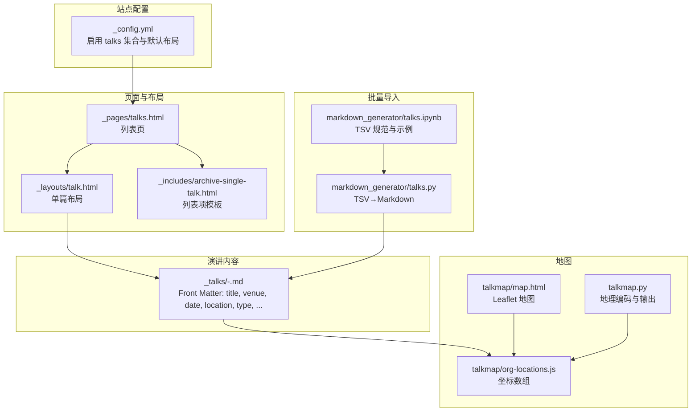
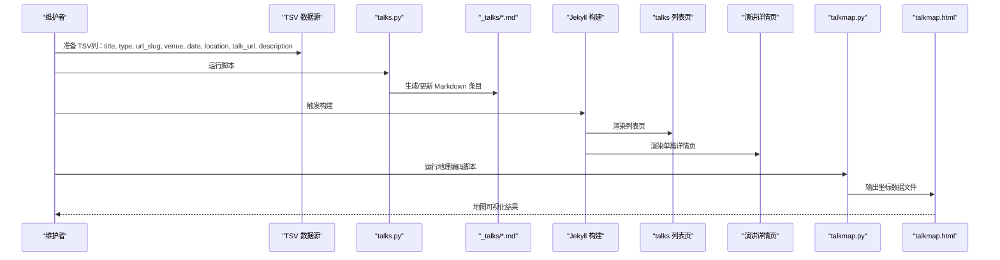
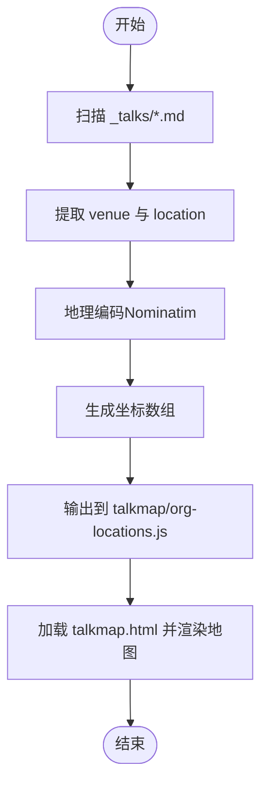
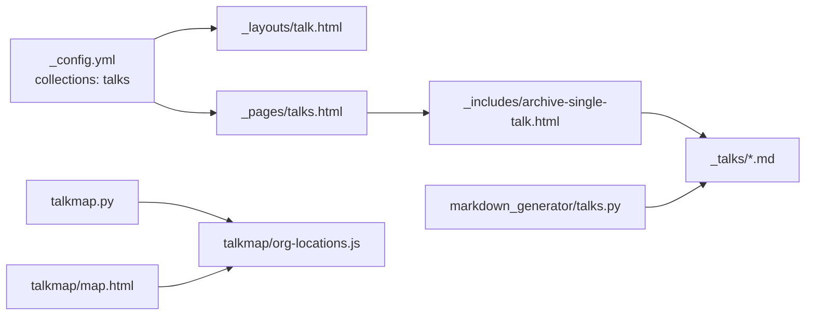

# 报告演讲管理

<cite>
**本文引用的文件**
- [_config.yml](file://_config.yml)
- [_talks/2012-03-01-talk-1.md](file://_talks/2012-03-01-talk-1.md)
- [_talks/2013-03-01-tutorial-1.md](file://_talks/2013-03-01-tutorial-1.md)
- [_talks/2014-02-01-talk-2.md](file://_talks/2014-02-01-talk-2.md)
- [_talks/2014-03-01-talk-3.md](file://_talks/2014-03-01-talk-3.md)
- [_layouts/talk.html](file://_layouts/talk.html)
- [_includes/archive-single-talk.html](file://_includes/archive-single-talk.html)
- [_pages/talks.html](file://_pages/talks.html)
- [talkmap/map.html](file://talkmap/map.html)
- [talkmap/org-locations.js](file://talkmap/org-locations.js)
- [markdown_generator/talks.py](file://markdown_generator/talks.py)
- [markdown_generator/talks.ipynb](file://markdown_generator/talks.ipynb)
- [talkmap.py](file://talkmap.py)
</cite>

## 目录
1. [简介](#简介)
2. [项目结构](#项目结构)
3. [核心组件](#核心组件)
4. [架构总览](#架构总览)
5. [详细组件分析](#详细组件分析)
6. [依赖分析](#依赖分析)
7. [性能考虑](#性能考虑)
8. [故障排查指南](#故障排查指南)
9. [结论](#结论)
10. [附录](#附录)

## 简介
本文件面向学术活动组织者与内容维护者，系统性阐述该网站中“报告演讲”的管理方式与最佳实践。内容覆盖：
- 演讲条目的命名规范与 Front Matter 字段配置
- 演讲类型分类与语义说明
- 地点信息管理与地图集成
- 摘要、幻灯片链接、视频链接等扩展信息的配置
- 时间线与历史归档管理
- 与会议日程的关联机制
- 内容版本控制与更新流程
- 批量管理与导入方法
- 数据一致性与准确性保障策略

## 项目结构
围绕“演讲”主题的关键目录与文件如下：
- 配置与集合：站点配置启用 talks 集合，并为 talks 指定默认布局
- 演讲条目：位于 _talks 目录，采用标准 Jekyll Front Matter 格式
- 页面与布局：talks 列表页与单篇演讲页面布局
- 地图可视化：独立的 Leaflet 地图页面与坐标数据
- 批量生成器：Python 脚本与 Jupyter Notebook 将 TSV 导入生成 Markdown 条目
- 地图地理编码：从演讲条目抽取地点并生成地图数据

图表来源
- [_config.yml:233-293](file://_config.yml#L233-L293)
- [_pages/talks.html:1-17](file://_pages/talks.html#L1-L17)
- [_layouts/talk.html:1-79](file://_layouts/talk.html#L1-L79)
- [_includes/archive-single-talk.html:1-43](file://_includes/archive-single-talk.html#L1-L43)
- [talkmap/map.html:1-47](file://talkmap/map.html#L1-L47)
- [talkmap/org-locations.js:1-22](file://talkmap/org-locations.js#L1-L22)
- [talkmap.py:1-57](file://talkmap.py#L1-L57)
- [markdown_generator/talks.py:1-112](file://markdown_generator/talks.py#L1-L112)
- [markdown_generator/talks.ipynb:1-381](file://markdown_generator/talks.ipynb#L1-L381)

章节来源
- [_config.yml:233-293](file://_config.yml#L233-L293)
- [_pages/talks.html:1-17](file://_pages/talks.html#L1-L17)

## 核心组件
- 演讲集合与默认布局
  - 在站点配置中启用 talks 集合，并将 talks 的默认布局设为 talk 布局，确保每篇演讲以统一样式渲染。
- 演讲条目（Markdown）
  - 使用标准 Front Matter 定义标题、日期、地点、类型等元数据；正文支持 Markdown。
- 列表页与列表项模板
  - 列表页按时间倒序展示所有演讲；列表项模板负责在列表中显示类型、地点、摘要等信息。
- 单篇演讲布局
  - 展示演讲标题、日期、类型、地点、正文与外部链接等。
- 地图可视化
  - 通过独立 HTML 页面加载 Leaflet 地图，使用坐标数组渲染标记；可由地理编码脚本自动生成坐标数据。
- 批量导入工具
  - Python 脚本与 Jupyter Notebook 提供 TSV→Markdown 的转换流程，便于批量导入。

章节来源
- [_config.yml:233-293](file://_config.yml#L233-L293)
- [_layouts/talk.html:1-79](file://_layouts/talk.html#L1-L79)
- [_includes/archive-single-talk.html:1-43](file://_includes/archive-single-talk.html#L1-L43)
- [_pages/talks.html:1-17](file://_pages/talks.html#L1-L17)
- [talkmap/map.html:1-47](file://talkmap/map.html#L1-L47)
- [talkmap/org-locations.js:1-22](file://talkmap/org-locations.js#L1-L22)
- [markdown_generator/talks.py:1-112](file://markdown_generator/talks.py#L1-L112)
- [markdown_generator/talks.ipynb:1-381](file://markdown_generator/talks.ipynb#L1-L381)
- [talkmap.py:1-57](file://talkmap.py#L1-L57)

## 架构总览
下图展示了“演讲”从数据输入到页面呈现与地图可视化的端到端流程。

图表来源
- [markdown_generator/talks.py:67-107](file://markdown_generator/talks.py#L67-L107)
- [_pages/talks.html:14-16](file://_pages/talks.html#L14-L16)
- [_layouts/talk.html:38-45](file://_layouts/talk.html#L38-L45)
- [talkmap.py:27-56](file://talkmap.py#L27-L56)
- [talkmap/map.html:24-44](file://talkmap/map.html#L24-L44)

## 详细组件分析

### 命名规范与 Front Matter 字段
- 文件命名
  - 格式：YYYY-MM-DD-url_slug.md
  - 示例：2012-03-01-talk-1.md、2013-03-01-tutorial-1.md
- 必填字段
  - title、date、url_slug（用于生成文件名与永久链接）
- 常用字段
  - collection（固定为 talks）、type（演讲类型）、permalink（永久链接）、venue（举办单位/会场）、date（演讲日期）、location（城市/国家）
- 可选字段
  - talk_url（更多信息链接）、description（正文内容）

章节来源
- [markdown_generator/talks.py:18-25](file://markdown_generator/talks.py#L18-L25)
- [markdown_generator/talks.ipynb:35-46](file://markdown_generator/talks.ipynb#L35-L46)
- [_talks/2012-03-01-talk-1.md:1-12](file://_talks/2012-03-01-talk-1.md#L1-L12)
- [_talks/2013-03-01-tutorial-1.md:1-14](file://_talks/2013-03-01-tutorial-1.md#L1-L14)
- [_talks/2014-02-01-talk-2.md:1-14](file://_talks/2014-02-01-talk-2.md#L1-L14)
- [_talks/2014-03-01-talk-3.md:1-12](file://_talks/2014-03-01-talk-3.md#L1-L12)

### 演讲类型分类说明
- 类型字段 type 支持任意字符串，常见示例如下：
  - Talk：常规口头报告
  - Tutorial：教程/工作坊
  - Conference proceedings talk：会议论文集口头报告
- 若未显式设置，脚本会回退为默认值“Talk”。

章节来源
- [_talks/2012-03-01-talk-1.md](file://_talks/2012-03-01-talk-1.md#L4)
- [_talks/2013-03-01-tutorial-1.md](file://_talks/2013-03-01-tutorial-1.md#L4)
- [_talks/2014-03-01-talk-3.md](file://_talks/2014-03-01-talk-3.md#L4)
- [markdown_generator/talks.py:76-79](file://markdown_generator/talks.py#L76-L79)

### 地点信息管理与地图集成
- 地点字段
  - venue：举办单位或会场名称
  - location：城市、国家等地理描述
- 地图数据生成
  - 地理编码脚本从 _talks 下的 Markdown 条目提取 location，调用地理编码服务生成坐标，并输出到 org-locations.js
  - 地图页面通过 Leaflet 加载坐标数组，实现标记聚合与弹窗提示
- 地图页面与数据
  - 地图 HTML 页面引入 Leaflet 与 MarkerCluster，并加载 org-locations.js
  - 坐标数组格式包含标题、纬度、经度

图表来源
- [talkmap.py:17-56](file://talkmap.py#L17-L56)
- [talkmap/map.html:14-44](file://talkmap/map.html#L14-L44)
- [talkmap/org-locations.js:1-22](file://talkmap/org-locations.js#L1-L22)

章节来源
- [_talks/2012-03-01-talk-1.md:6-8](file://_talks/2012-03-01-talk-1.md#L6-L8)
- [_talks/2013-03-01-tutorial-1.md:6-8](file://_talks/2013-03-01-tutorial-1.md#L6-L8)
- [_talks/2014-02-01-talk-2.md:6-8](file://_talks/2014-02-01-talk-2.md#L6-L8)
- [_talks/2014-03-01-talk-3.md:6-8](file://_talks/2014-03-01-talk-3.md#L6-L8)
- [talkmap.py:27-56](file://talkmap.py#L27-L56)
- [talkmap/map.html:14-44](file://talkmap/map.html#L14-L44)
- [talkmap/org-locations.js:1-22](file://talkmap/org-locations.js#L1-L22)

### 摘要、幻灯片链接、视频链接配置
- 摘要与正文
  - 正文区域支持 Markdown，可用于撰写摘要、要点与补充说明
- 外部链接
  - 可通过 Markdown 链接语法在正文添加“更多信息”链接
  - 脚本支持将 talk_url 字段自动转为正文中的链接
- 视频链接
  - 当前模板未内置视频字段；可通过正文插入视频嵌入或在 talk_url 中指向视频页面

章节来源
- [_talks/2013-03-01-tutorial-1.md:10-13](file://_talks/2013-03-01-tutorial-1.md#L10-L13)
- [markdown_generator/talks.py:95-96](file://markdown_generator/talks.py#L95-L96)

### 时间线与历史记录管理
- 列表页
  - 按时间倒序展示所有演讲条目，天然形成时间线
- 详情页
  - 展示演讲日期、类型、地点与正文，便于查阅历史记录
- 更新策略
  - 修改 Front Matter 或正文即可更新页面；构建后生效

章节来源
- [_pages/talks.html:14-16](file://_pages/talks.html#L14-L16)
- [_layouts/talk.html:33-45](file://_layouts/talk.html#L33-L45)
- [_includes/archive-single-talk.html:38-40](file://_includes/archive-single-talk.html#L38-L40)

### 与会议日程的关联机制
- 关联方式
  - 通过 venue 字段标注会议名称或日程归属单位
  - 通过 date 字段精确到日，便于与会议日程对齐
- 建议
  - 统一 venue 命名风格，避免同会议多拼写变体
  - 在正文补充会议官网或日程链接，提升可追溯性

章节来源
- [_talks/2012-03-01-talk-1.md](file://_talks/2012-03-01-talk-1.md#L6)
- [_talks/2013-03-01-tutorial-1.md](file://_talks/2013-03-01-tutorial-1.md#L6)
- [_talks/2014-03-01-talk-3.md](file://_talks/2014-03-01-talk-3.md#L6)

### 内容版本控制与更新流程
- 版本控制
  - 使用 Git 管理 Markdown 文件变更，保留提交历史
- 更新流程
  - 修改 Front Matter 或正文 → 提交 → 触发构建 → 预览 → 合并上线
- 最佳实践
  - 为重要更新添加清晰的提交信息
  - 对批量修改先在分支验证

（本节为通用建议，不直接分析具体文件）

### 批量管理与导入
- TSV 规范
  - 列定义：title、type、url_slug、venue、date、location、talk_url、description
  - 必填：title、url_slug、date
  - 日期格式：YYYY-MM-DD
- 导入流程
  - 准备 TSV → 运行 talks.py 或打开 talks.ipynb → 自动生成 _talks 下的 Markdown 文件
- 注意事项
  - url_slug 与 date 组合需唯一
  - talk_url 与 description 将被自动注入到 Markdown 正文中

章节来源
- [markdown_generator/talks.py:16-25](file://markdown_generator/talks.py#L16-L25)
- [markdown_generator/talks.ipynb:35-46](file://markdown_generator/talks.ipynb#L35-L46)
- [markdown_generator/talks.py:67-107](file://markdown_generator/talks.py#L67-L107)

### 数据一致性与准确性保障
- 统一字段与格式
  - 强制必填字段与日期格式，避免解析错误
- 地点标准化
  - 建议使用一致的城市/国家表达，减少地理编码失败
- 自动化校验
  - 在 CI 中运行构建检查，发现 Front Matter 缺失或格式错误
- 人工复核
  - 对批量导入后的条目进行抽样核对

章节来源
- [markdown_generator/talks.py:18-25](file://markdown_generator/talks.py#L18-L25)
- [talkmap.py:44-52](file://talkmap.py#L44-L52)

## 依赖分析
- 集合与布局
  - talks 集合启用，单篇布局 talk.html 负责渲染详情页
- 页面与模板
  - talks 列表页遍历 talks 集合，使用 archive-single-talk.html 渲染列表项
- 地图与地理编码
  - talkmap.py 从 _talks 读取条目，地理编码后输出 org-locations.js
  - talkmap.html 加载 Leaflet 与 MarkerCluster，渲染地图
- 批量导入
  - talks.py 读取 TSV，生成 Markdown 文件

图表来源
- [_config.yml:233-293](file://_config.yml#L233-L293)
- [_pages/talks.html:14-16](file://_pages/talks.html#L14-L16)
- [_includes/archive-single-talk.html:38-40](file://_includes/archive-single-talk.html#L38-L40)
- [_layouts/talk.html:38-45](file://_layouts/talk.html#L38-L45)
- [talkmap.py:17-56](file://talkmap.py#L17-L56)
- [talkmap/map.html:14-44](file://talkmap/map.html#L14-L44)
- [markdown_generator/talks.py:67-107](file://markdown_generator/talks.py#L67-L107)

章节来源
- [_config.yml:233-293](file://_config.yml#L233-L293)
- [_pages/talks.html:14-16](file://_pages/talks.html#L14-L16)
- [_includes/archive-single-talk.html:38-40](file://_includes/archive-single-talk.html#L38-L40)
- [_layouts/talk.html:38-45](file://_layouts/talk.html#L38-L45)
- [talkmap.py:17-56](file://talkmap.py#L17-L56)
- [talkmap/map.html:14-44](file://talkmap/map.html#L14-L44)
- [markdown_generator/talks.py:67-107](file://markdown_generator/talks.py#L67-L107)

## 性能考虑
- 地图渲染
  - 使用 MarkerCluster 聚合标记，减少大规模点位渲染开销
  - 合理设置聚合半径与缩放层级，平衡可读性与性能
- 构建时间
  - 批量导入时一次性生成多个 Markdown 文件，建议在 CI 中缓存依赖
- 资源加载
  - 地图资源通过 CDN 加载，注意网络稳定性与离线可用性

（本节提供通用指导，不直接分析具体文件）

## 故障排查指南
- 地理编码失败
  - 现象：控制台打印地理编码异常或超时
  - 排查：检查 location 字段是否为空或拼写错误；适当增加超时或重试
- 地图不显示
  - 现象：地图空白或报错
  - 排查：确认 org-locations.js 是否存在且格式正确；浏览器控制台查看资源加载状态
- 列表页未显示最新条目
  - 现象：新增条目未出现在列表页
  - 排查：确认 Front Matter 完整；重新触发构建；检查集合与布局配置

章节来源
- [talkmap.py:44-52](file://talkmap.py#L44-L52)
- [talkmap/map.html:14-44](file://talkmap/map.html#L14-L44)
- [_pages/talks.html:14-16](file://_pages/talks.html#L14-L16)

## 结论
该演讲管理系统以 Jekyll 集合为核心，结合统一的命名规范与 Front Matter 字段，实现了从批量导入、页面渲染到地图可视化的完整闭环。通过标准化地点与类型字段、自动化地理编码与地图生成，组织者可以高效维护演讲档案，并为学术活动提供良好的展示与检索体验。

## 附录
- 常用字段速查
  - 必填：title、url_slug、date
  - 常用：venue、location、type、permalink
  - 可选：talk_url、description
- 建议工作流
  - 使用 TSV 规范化数据 → 运行导入脚本 → 校验生成文件 → 提交并构建 → 验证列表与地图 → 发布