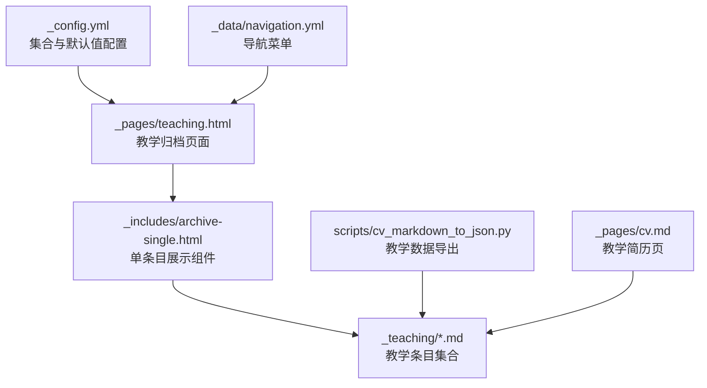
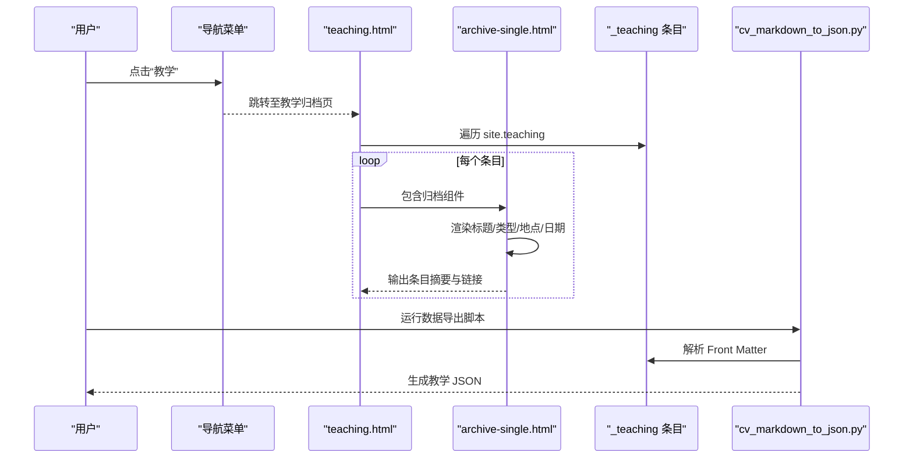
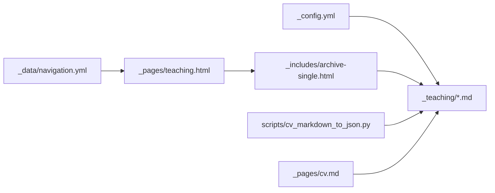

# 教学材料管理

<cite>
**本文引用的文件**
- [_config.yml](file://_config.yml)
- [_data/navigation.yml](file://_data/navigation.yml)
- [_pages/teaching.html](file://_pages/teaching.html)
- [_teaching/2014-spring-teaching-1.md](file://_teaching/2014-spring-teaching-1.md)
- [_teaching/2015-spring-teaching-2.md](file://_teaching/2015-spring-teaching-2.md)
- [_includes/archive-single.html](file://_includes/archive-single.html)
- [_layouts/archive.html](file://_layouts/archive.html)
- [scripts/cv_markdown_to_json.py](file://scripts/cv_markdown_to_json.py)
- [_pages/cv.md](file://_pages/cv.md)
- [_posts/2025-03-11-python-basics.md](file://_posts/2025-03-11-python-basics.md)
- [README.md](file://README.md)
</cite>

## 目录
1. [引言](#引言)
2. [项目结构](#项目结构)
3. [核心组件](#核心组件)
4. [架构总览](#架构总览)
5. [详细组件分析](#详细组件分析)
6. [依赖关系分析](#依赖关系分析)
7. [性能考虑](#性能考虑)
8. [故障排查指南](#故障排查指南)
9. [结论](#结论)
10. [附录](#附录)

## 引言
本文件面向教育工作者，系统化说明如何在基于 Jekyll 的静态站点中管理“教学材料”。内容涵盖教学条目的命名规范、Front Matter 字段配置、课程信息管理、教学材料分类与组织、课程链接与外部资源集成、教学经验记录与展示、课程评价与反馈机制、版本控制与更新流程、与课程网站/学习管理系统集成以及教学数据的准确性与时效性保障策略。目标是帮助教师高效地维护教学资源，提升教学材料的可发现性与可维护性。

## 项目结构
本项目采用 Jekyll 标准目录结构，教学材料位于独立集合中，通过 Front Matter 驱动渲染与归档展示。关键路径如下：
- 教学集合：_teaching
- 页面入口：_pages/teaching.html
- 导航菜单：_data/navigation.yml
- 全局配置：_config.yml
- 展示模板：_includes/archive-single.html、_layouts/archive.html
- 数据导出脚本：scripts/cv_markdown_to_json.py
- 教学简历页：_pages/cv.md
- 示例文章：_posts/2025-03-11-python-basics.md（用于对比 Front Matter 结构）

图表来源
- [_config.yml:223-293](file://_config.yml#L223-L293)
- [_pages/teaching.html:1-13](file://_pages/teaching.html#L1-L13)
- [_includes/archive-single.html:1-85](file://_includes/archive-single.html#L1-L85)
- [_data/navigation.yml:10-19](file://_data/navigation.yml#L10-L19)
- [scripts/cv_markdown_to_json.py:309-336](file://scripts/cv_markdown_to_json.py#L309-L336)
- [_pages/cv.md:56-60](file://_pages/cv.md#L56-L60)

章节来源
- [_config.yml:223-293](file://_config.yml#L223-L293)
- [_pages/teaching.html:1-13](file://_pages/teaching.html#L1-L13)
- [_data/navigation.yml:10-19](file://_data/navigation.yml#L10-L19)
- [_includes/archive-single.html:1-85](file://_includes/archive-single.html#L1-L85)
- [scripts/cv_markdown_to_json.py:309-336](file://scripts/cv_markdown_to_json.py#L309-L336)
- [_pages/cv.md:56-60](file://_pages/cv.md#L56-L60)

## 核心组件
- 教学集合与默认布局
  - 在全局配置中定义了教学集合及其永久链接规则与默认 Front Matter 值，确保教学条目统一渲染风格与元信息。
- 教学归档页面
  - 教学页面通过循环遍历教学集合，使用归档组件进行逐条展示。
- 归档组件
  - 组件根据集合类型输出不同字段摘要（如教学类型、地点、年份），并支持链接、阅读时长、引用与下载等扩展字段。
- 导航菜单
  - 导航中包含“教学”入口，指向教学归档页面，便于用户访问。
- 数据导出脚本
  - 脚本解析教学条目的 Front Matter 并生成结构化 JSON，便于简历或外部系统消费。
- 教学简历页
  - 简历页中包含“教学”区块，直接复用教学集合进行展示。

章节来源
- [_config.yml:223-293](file://_config.yml#L223-L293)
- [_pages/teaching.html:10-12](file://_pages/teaching.html#L10-L12)
- [_includes/archive-single.html:41-47](file://_includes/archive-single.html#L41-L47)
- [_data/navigation.yml:17-18](file://_data/navigation.yml#L17-L18)
- [scripts/cv_markdown_to_json.py:309-336](file://scripts/cv_markdown_to_json.py#L309-L336)
- [_pages/cv.md:56-60](file://_pages/cv.md#L56-L60)

## 架构总览
下图展示了从“教学条目”到“页面展示”的端到端流程，包括集合配置、页面渲染、组件展示与数据导出。

图表来源
- [_pages/teaching.html:10-12](file://_pages/teaching.html#L10-L12)
- [_includes/archive-single.html:41-47](file://_includes/archive-single.html#L41-L47)
- [scripts/cv_markdown_to_json.py:309-336](file://scripts/cv_markdown_to_json.py#L309-L336)

## 详细组件分析

### 教学条目命名规范
- 文件命名建议遵循“年份-学期-课程标识”模式，例如：YYYY-season-course-id.md。该规范有助于排序与检索。
- 文件名中的语义信息（如年份、学期）可辅助筛选与归档；若需进一步区分课程，可在 Front Matter 中补充课程编号或课程名称字段。

章节来源
- [_teaching/2014-spring-teaching-1.md:1](file://_teaching/2014-spring-teaching-1.md#L1)
- [_teaching/2015-spring-teaching-2.md:1](file://_teaching/2015-spring-teaching-2.md#L1)

### Front Matter 字段配置
- 必填字段
  - title：条目标题（显示于页面与简历）
  - collection：集合标识，固定为 teaching
  - permalink：自定义永久链接
- 常用字段
  - type：教学类型（如“本科生课程”“研讨会”等）
  - venue：授课单位与院系
  - date：授课日期（用于排序与展示）
  - location：授课地点
- 扩展字段（用于展示与导出）
  - excerpt：摘要（简历页会读取该字段）
  - citation、paperurl、slidesurl、bibtexurl：推荐引用与下载链接（归档组件会按条件组合输出）

章节来源
- [_teaching/2014-spring-teaching-1.md:1-9](file://_teaching/2014-spring-teaching-1.md#L1-L9)
- [_teaching/2015-spring-teaching-2.md:1-9](file://_teaching/2015-spring-teaching-2.md#L1-L9)
- [_includes/archive-single.html:55-81](file://_includes/archive-single.html#L55-L81)
- [_pages/cv.md:56-60](file://_pages/cv.md#L56-L60)

### 课程信息管理
- 课程名称：由 title 字段承载，建议与课程大纲一致
- 学期标识：可通过文件名或 date 字段体现；若需要更明确的学期标识，可在 Front Matter 新增 semester 字段
- 学校信息：由 venue 字段承载，建议格式为“学校全称, 院系/部门”
- 地点：location 字段用于标注授课地点
- 课程链接：通过 permalink 字段控制访问路径；如需外部课程链接，可使用 post.link 或在正文添加外链

章节来源
- [_teaching/2014-spring-teaching-1.md:4-8](file://_teaching/2014-spring-teaching-1.md#L4-L8)
- [_teaching/2015-spring-teaching-2.md:4-8](file://_teaching/2015-spring-teaching-2.md#L4-L8)
- [_includes/archive-single.html:41-47](file://_includes/archive-single.html#L41-L47)

### 教学材料的分类与组织
- 分类维度
  - 类型：type 字段（如“本科生课程”“研究生课程”“工作坊”“讲座”等）
  - 时间：date 字段（支持按年份/月份排序）
  - 地点：location 字段（支持按城市/国家筛选）
  - 集合：collection 固定为 teaching
- 组织方式
  - 使用独立集合管理教学条目，便于统一渲染与导出
  - 通过归档组件按类型输出摘要，满足“课程列表”“教学履历”等场景

章节来源
- [_config.yml:223-235](file://_config.yml#L223-L235)
- [_includes/archive-single.html:41-47](file://_includes/archive-single.html#L41-L47)

### 课程链接与外部资源集成
- 内部链接
  - 使用 permalink 控制条目 URL；页面通过 site.teaching 遍历渲染
- 外部资源
  - 推荐引用与下载：citation、paperurl、slidesurl、bibtexurl
  - 归档组件会根据可用字段组合输出下载链接，便于学生获取资料

章节来源
- [_pages/teaching.html:10-12](file://_pages/teaching.html#L10-L12)
- [_includes/archive-single.html:55-81](file://_includes/archive-single.html#L55-L81)

### 教学经验的记录与展示
- 记录方式
  - 在 _teaching 下新增 Markdown 文件，填写 Front Matter 与正文
- 展示方式
  - 教学归档页与简历页均通过 site.teaching 遍历展示
  - 归档组件按集合类型输出摘要，简历页可选择以列表形式呈现

章节来源
- [_pages/teaching.html:10-12](file://_pages/teaching.html#L10-L12)
- [_pages/cv.md:56-60](file://_pages/cv.md#L56-L60)
- [_includes/archive-single.html:41-47](file://_includes/archive-single.html#L41-L47)

### 课程评价与反馈的管理机制
- 当前实现
  - 未见专门的“评价/反馈”集合或字段
- 建议方案
  - 新增“评价”集合（如 _reviews），在 Front Matter 中包含课程标识、评分、时间、简评等字段
  - 在教学条目中增加“评价链接”字段，或在归档组件中按课程标识关联评价
  - 若需评论系统，可参考全局配置中的评论提供商设置

章节来源
- [_config.yml:101-127](file://_config.yml#L101-L127)

### 版本控制与更新流程
- 版本控制
  - 使用 Git 管理教学条目与站点变更；建议每次更新后提交并推送
- 更新流程
  - 新增/修改教学条目 → 提交到 _teaching → 预览本地构建（可选） → 推送至远程仓库 → GitHub Pages 自动发布
- 数据导出
  - 使用脚本导出教学数据为 JSON，便于简历或外部系统消费

章节来源
- [README.md:18-76](file://README.md#L18-L76)
- [scripts/cv_markdown_to_json.py:309-336](file://scripts/cv_markdown_to_json.py#L309-L336)

### 与课程网站和学习管理系统的集成
- 静态站点集成
  - 将教学条目作为静态内容发布，通过 permalink 提供稳定链接
- 外部系统对接
  - 使用 citation、paperurl、slidesurl、bibtexurl 等字段，向 LMS 或课程网站提供资源链接
  - 若需嵌入外部页面，可在正文添加 iframe 或外链

章节来源
- [_includes/archive-single.html:55-81](file://_includes/archive-single.html#L55-L81)

### 教学数据的准确性和时效性
- 准确性
  - 统一使用 Front Matter 字段（如 title、venue、date、type）保证信息一致性
  - 在简历页与归档页保持字段映射一致，避免歧义
- 时效性
  - 使用 date 字段控制排序；定期清理过期条目
  - 对于临时活动，可在 Front Matter 中增加状态字段（如 status: active/archived），并在模板中过滤

章节来源
- [_includes/archive-single.html:41-47](file://_includes/archive-single.html#L41-L47)
- [_pages/cv.md:56-60](file://_pages/cv.md#L56-L60)

## 依赖关系分析
- 配置依赖
  - _config.yml 定义教学集合与默认 Front Matter，直接影响条目渲染与归档行为
- 页面依赖
  - teaching.html 依赖教学集合与归档组件
- 组件依赖
  - archive-single.html 依赖条目 Front Matter 字段，按集合类型输出摘要
- 数据导出依赖
  - cv_markdown_to_json.py 依赖 _teaching 下的 Front Matter 结构

图表来源
- [_config.yml:223-293](file://_config.yml#L223-L293)
- [_data/navigation.yml:17-18](file://_data/navigation.yml#L17-L18)
- [_pages/teaching.html:10-12](file://_pages/teaching.html#L10-L12)
- [_includes/archive-single.html:41-47](file://_includes/archive-single.html#L41-L47)
- [scripts/cv_markdown_to_json.py:309-336](file://scripts/cv_markdown_to_json.py#L309-L336)
- [_pages/cv.md:56-60](file://_pages/cv.md#L56-L60)

章节来源
- [_config.yml:223-293](file://_config.yml#L223-L293)
- [_data/navigation.yml:17-18](file://_data/navigation.yml#L17-L18)
- [_pages/teaching.html:10-12](file://_pages/teaching.html#L10-L12)
- [_includes/archive-single.html:41-47](file://_includes/archive-single.html#L41-L47)
- [scripts/cv_markdown_to_json.py:309-336](file://scripts/cv_markdown_to_json.py#L309-L336)
- [_pages/cv.md:56-60](file://_pages/cv.md#L56-L60)

## 性能考虑
- 构建优化
  - 使用压缩 HTML 插件减少体积（已在配置中启用）
  - 合理组织集合与组件，避免不必要的循环与重复渲染
- 资源加载
  - 将大文件上传至 files/ 目录并通过永久链接访问，减轻站点体积
- 本地预览
  - 通过本地 Jekyll 服务快速验证更改，减少线上错误

章节来源
- [_config.yml:358-362](file://_config.yml#L358-L362)
- [README.md:52-53](file://README.md#L52-L53)

## 故障排查指南
- 教学条目未显示
  - 检查 collection 是否为 teaching
  - 确认 Front Matter 语法正确且无拼写错误
  - 确认 _config.yml 中教学集合已启用
- 归档摘要不完整
  - 检查 type、venue、date、location 等字段是否填写
  - 如需摘要显示，确认 excerpt 字段存在
- 导出数据为空
  - 确认 _teaching 目录存在且包含 .md 文件
  - 检查 Front Matter 是否被正确解析（前后三段分隔符与 YAML 语法）

章节来源
- [_config.yml:223-235](file://_config.yml#L223-L235)
- [_includes/archive-single.html:41-47](file://_includes/archive-single.html#L41-L47)
- [scripts/cv_markdown_to_json.py:313-314](file://scripts/cv_markdown_to_json.py#L313-L314)

## 结论
本项目通过 Jekyll 集合与 Front Matter 实现了教学材料的结构化管理与多端展示。依托统一的命名规范、清晰的字段约定与可扩展的归档组件，教师可以高效维护课程信息、组织教学资源，并通过数据导出实现与外部系统的对接。建议在现有基础上补充“评价/反馈”机制与“学期标识”字段，以进一步提升数据的完整性与时效性。

## 附录
- 示例条目对比
  - 教学条目示例：[2014-spring-teaching-1.md:1-9](file://_teaching/2014-spring-teaching-1.md#L1-L9)
  - 教学条目示例：[2015-spring-teaching-2.md:1-9](file://_teaching/2015-spring-teaching-2.md#L1-L9)
  - 文章条目示例（Front Matter 对比）：[2025-03-11-python-basics.md:1-16](file://_posts/2025-03-11-python-basics.md#L1-L16)
- 数据导出脚本
  - 教学解析函数：[parse_teaching:309-336](file://scripts/cv_markdown_to_json.py#L309-L336)