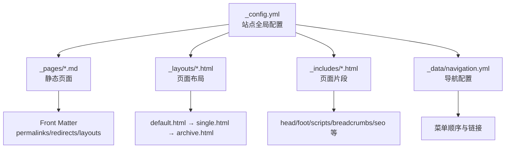
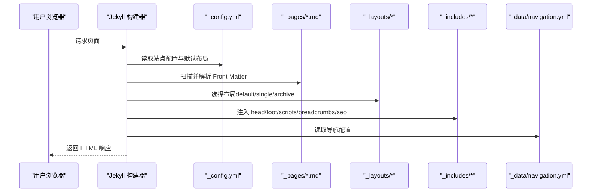
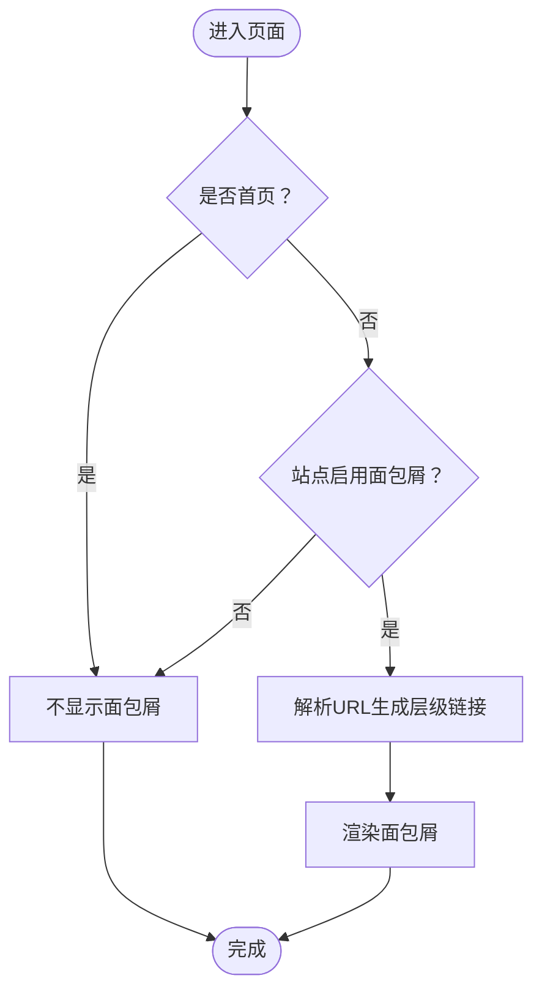
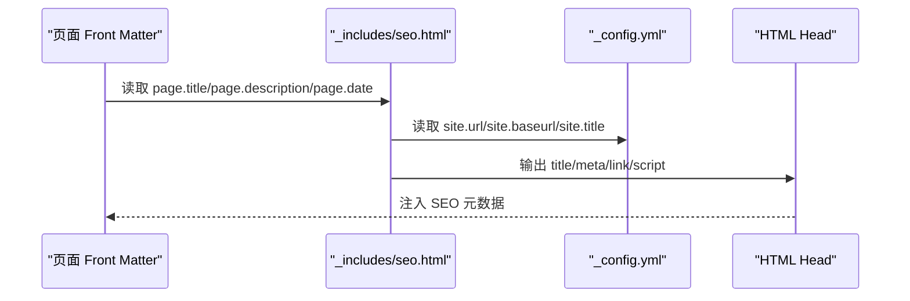
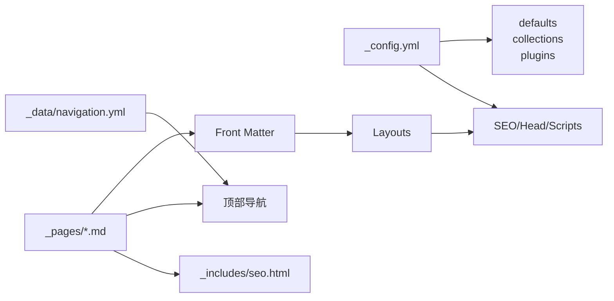

# 静态页面管理

<cite>
**本文引用的文件**
- [_config.yml](file://_config.yml)
- [README.md](file://README.md)
- [_pages/about.md](file://_pages/about.md)
- [_pages/cv.md](file://_pages/cv.md)
- [_pages/archive-layout-with-content.md](file://_pages/archive-layout-with-content.md)
- [_pages/category-archive.html](file://_pages/category-archive.html)
- [_pages/tag-archive.html](file://_pages/tag-archive.html)
- [_pages/non-menu-page.md](file://_pages/non-menu-page.md)
- [_pages/markdown.md](file://_pages/markdown.md)
- [_layouts/default.html](file://_layouts/default.html)
- [_layouts/single.html](file://_layouts/single.html)
- [_layouts/archive.html](file://_layouts/archive.html)
- [_includes/breadcrumbs.html](file://_includes/breadcrumbs.html)
- [_includes/seo.html](file://_includes/seo.html)
- [_data/navigation.yml](file://_data/navigation.yml)
</cite>

## 目录
1. [简介](#简介)
2. [项目结构](#项目结构)
3. [核心组件](#核心组件)
4. [架构总览](#架构总览)
5. [详细组件分析](#详细组件分析)
6. [依赖关系分析](#依赖关系分析)
7. [性能考虑](#性能考虑)
8. [故障排查指南](#故障排查指南)
9. [结论](#结论)
10. [附录](#附录)

## 简介
本文件面向网站管理员与内容作者，系统性讲解如何在基于 Jekyll 的 Academic Pages 模板中创建与管理“静态页面”。内容涵盖：
- 页面创建与 Front Matter 配置
- 页面布局选择与页面类型使用指南（关于、简历、归档、分类、标签等）
- 导航集成与面包屑配置
- 内容组织方式与布局选项
- 访问控制与隐私设置思路
- 页面与内容集合的关联机制
- SEO 优化配置
- 页面模板的自定义与扩展
- 缓存与性能优化策略
- 维护与更新最佳实践

## 项目结构
本项目采用 Jekyll 的标准目录组织方式，静态页面集中存放于 _pages 目录，页面布局位于 _layouts，页面片段（Includes）位于 _includes，站点导航配置位于 _data。

图表来源
- [_config.yml](file://_config.yml)
- [_pages/about.md](file://_pages/about.md)
- [_layouts/default.html](file://_layouts/default.html)
- [_layouts/single.html](file://_layouts/single.html)
- [_layouts/archive.html](file://_layouts/archive.html)
- [_includes/breadcrumbs.html](file://_includes/breadcrumbs.html)
- [_includes/seo.html](file://_includes/seo.html)
- [_data/navigation.yml](file://_data/navigation.yml)

章节来源
- [_config.yml](file://_config.yml)
- [_pages/about.md](file://_pages/about.md)
- [_layouts/default.html](file://_layouts/default.html)
- [_layouts/single.html](file://_layouts/single.html)
- [_layouts/archive.html](file://_layouts/archive.html)
- [_includes/breadcrumbs.html](file://_includes/breadcrumbs.html)
- [_includes/seo.html](file://_includes/seo.html)
- [_data/navigation.yml](file://_data/navigation.yml)

## 核心组件
- 静态页面（_pages）：存放独立页面，如 about、cv、archive、category/tag 等。
- 布局系统（_layouts）：default（基础骨架）、single（单页内容）、archive（归档列表）。
- 页面片段（_includes）：head/foot/scripts/breadcrumbs/seo 等可复用片段。
- 导航配置（_data/navigation.yml）：控制顶部导航栏的顺序与链接。
- 全局配置（_config.yml）：站点信息、默认布局、集合输出、归档类型、压缩等。

章节来源
- [_config.yml](file://_config.yml)
- [_pages/about.md](file://_pages/about.md)
- [_pages/cv.md](file://_pages/cv.md)
- [_pages/category-archive.html](file://_pages/category-archive.html)
- [_pages/tag-archive.html](file://_pages/tag-archive.html)
- [_layouts/single.html](file://_layouts/single.html)
- [_layouts/archive.html](file://_layouts/archive.html)
- [_includes/breadcrumbs.html](file://_includes/breadcrumbs.html)
- [_includes/seo.html](file://_includes/seo.html)
- [_data/navigation.yml](file://_data/navigation.yml)

## 架构总览
Jekyll 在构建阶段读取 _config.yml，识别集合与默认布局；随后扫描 _pages 目录，依据每个页面的 Front Matter 选择布局并渲染 HTML。导航与面包屑由 _data 与 _includes 提供，SEO 由 _includes/seo.html 注入。

图表来源
- [_config.yml](file://_config.yml)
- [_pages/about.md](file://_pages/about.md)
- [_layouts/default.html](file://_layouts/default.html)
- [_layouts/single.html](file://_layouts/single.html)
- [_layouts/archive.html](file://_layouts/archive.html)
- [_includes/breadcrumbs.html](file://_includes/breadcrumbs.html)
- [_includes/seo.html](file://_includes/seo.html)
- [_data/navigation.yml](file://_data/navigation.yml)

## 详细组件分析

### 页面创建与 Front Matter 配置
- 基本字段
  - title：页面标题
  - permalink：固定链接
  - redirect_from：重定向路径数组
  - layout：布局选择（如 single、archive）
  - author_profile：是否显示作者资料侧边栏
- 示例参考
  - 首页（about）：设置首页 permalink、重定向、作者资料
  - 简历（cv）：指定 archive 布局、固定链接、作者资料、重定向
  - 归档示例（archive-layout-with-content）：指定 archive 布局与内容
  - 分类/标签归档：指定 archive 布局与 permalink
  - 非菜单页（non-menu-page）：普通页面，不加入导航
  - 使用指南（markdown）：包含导航与内容组织说明

章节来源
- [_pages/about.md](file://_pages/about.md)
- [_pages/cv.md](file://_pages/cv.md)
- [_pages/archive-layout-with-content.md](file://_pages/archive-layout-with-content.md)
- [_pages/category-archive.html](file://_pages/category-archive.html)
- [_pages/tag-archive.html](file://_pages/tag-archive.html)
- [_pages/non-menu-page.md](file://_pages/non-menu-page.md)
- [_pages/markdown.md](file://_pages/markdown.md)

### 页面布局选择与页面类型使用指南
- 布局选择
  - default：基础骨架，包含 head/脚本/页眉/页脚
  - single：单页内容布局，适合 about、非归档类页面
  - archive：归档布局，适合分类/标签/聚合页面
- 页面类型
  - 关于页面（about）：首页入口，展示站点概览与快速导航
  - 简历页面（cv）：教育、工作、技能、发表论文、报告、教学等
  - 归档页面（archive-layout-with-content）：演示多种排版与内容组织
  - 分类页面（category-archive）：按分类展示文章
  - 标签页面（tag-archive）：按标签展示文章
  - 非菜单页（non-menu-page）：不参与导航的独立页面
  - 使用指南（markdown）：站点使用说明与功能介绍

章节来源
- [_layouts/default.html](file://_layouts/default.html)
- [_layouts/single.html](file://_layouts/single.html)
- [_layouts/archive.html](file://_layouts/archive.html)
- [_pages/about.md](file://_pages/about.md)
- [_pages/cv.md](file://_pages/cv.md)
- [_pages/archive-layout-with-content.md](file://_pages/archive-layout-with-content.md)
- [_pages/category-archive.html](file://_pages/category-archive.html)
- [_pages/tag-archive.html](file://_pages/tag-archive.html)
- [_pages/non-menu-page.md](file://_pages/non-menu-page.md)
- [_pages/markdown.md](file://_pages/markdown.md)

### 导航集成与面包屑配置
- 导航集成
  - 顶部导航由 _data/navigation.yml 控制，包含主菜单与子菜单
  - 通过 url 字段指向各页面 permalink
- 面包屑
  - 当启用 breadcrumbs 且页面非首页时，自动渲染面包屑
  - 面包屑根据页面 URL 动态生成层级链接

图表来源
- [_includes/breadcrumbs.html](file://_includes/breadcrumbs.html)
- [_config.yml](file://_config.yml)
- [_data/navigation.yml](file://_data/navigation.yml)

章节来源
- [_data/navigation.yml](file://_data/navigation.yml)
- [_includes/breadcrumbs.html](file://_includes/breadcrumbs.html)
- [_config.yml](file://_config.yml)

### 页面内容组织方式与布局选项
- 内容组织
  - Markdown/HTML 混合：.md 自动渲染为 HTML，.html 直接渲染
  - 使用 include 片段组合复杂内容（如 archive-single、author-profile、social-share 等）
- 布局选项
  - single：适合正文型页面（about、非归档类）
  - archive：适合列表型页面（分类/标签/归档聚合）

章节来源
- [_pages/about.md](file://_pages/about.md)
- [_pages/cv.md](file://_pages/cv.md)
- [_pages/archive-layout-with-content.md](file://_pages/archive-layout-with-content.md)
- [_layouts/single.html](file://_layouts/single.html)
- [_layouts/archive.html](file://_layouts/archive.html)

### 访问权限与隐私设置
- 本模板未内置访问控制或密码保护机制
- 建议
  - 使用 GitHub Pages 默认公开发布
  - 如需私有化，可考虑企业版或自托管方案（不在本模板范围内）

章节来源
- [_config.yml](file://_config.yml)

### 页面与内容集合的关联机制
- 默认布局绑定
  - _config.yml 中通过 defaults 为 posts、pages、teaching、publications、portfolio、talks 等集合设置默认布局
- 页面与集合的关系
  - 页面（pages）与集合（如 posts/publications/portfolio/talks/teaching）在 Jekyll 中分别处理
  - 页面可通过 include 片段引用集合数据（如 cv 页面中引用 site.publications/site.talks/site.teaching）

章节来源
- [_config.yml](file://_config.yml)
- [_pages/cv.md](file://_pages/cv.md)

### 页面 SEO 优化配置
- SEO 片段
  - _includes/seo.html 自动生成标题、描述、canonical、Open Graph、Twitter Card、结构化数据等
- 关键配置
  - 站点 URL、baseurl、locale、title_separator、description
  - 社交账号（twitter/facebook）、站点验证（google/bing/alexa/yandex）
  - OG 图片与描述（site.og_image、site.og_description）

图表来源
- [_includes/seo.html](file://_includes/seo.html)
- [_config.yml](file://_config.yml)

章节来源
- [_includes/seo.html](file://_includes/seo.html)
- [_config.yml](file://_config.yml)

### 页面模板的自定义与扩展
- 自定义布局
  - 在 _layouts 新增自定义布局，页面通过 layout 指定
- 自定义片段
  - 在 _includes 新增片段（如 head/custom.html、footer/custom.html），在 default.html 中引入
- 导航扩展
  - 在 _data/navigation.yml 添加新菜单项，控制顶部导航

章节来源
- [_layouts/default.html](file://_layouts/default.html)
- [_data/navigation.yml](file://_data/navigation.yml)

### 页面缓存与性能优化策略
- HTML 压缩
  - _config.yml 开启 compress_html 插件，忽略开发环境
- 资源压缩
  - SCSS 压缩（style: compressed），减少 CSS 体积
- 构建与预览
  - 使用 jekyll serve -l -H localhost 本地预览，修改 *.md/*.html 自动重建

章节来源
- [_config.yml](file://_config.yml)
- [README.md](file://README.md)

### 维护与更新最佳实践
- 文件命名与目录
  - 静态页面统一放入 _pages，内容集合按领域分目录（如 _posts/_publications/_portfolio 等）
- Front Matter 规范
  - 明确设置 title/permalink/redirect_from/layout/author_profile
- 导航一致性
  - 在 _data/navigation.yml 统一维护菜单顺序与链接
- SEO 一致性
  - 在 _includes/seo.html 与 _config.yml 中保持站点信息一致
- 发布前检查
  - 本地 jekyll serve 预览，确认面包屑、导航、归档、SEO 正常

章节来源
- [_pages/about.md](file://_pages/about.md)
- [_pages/cv.md](file://_pages/cv.md)
- [_pages/category-archive.html](file://_pages/category-archive.html)
- [_pages/tag-archive.html](file://_pages/tag-archive.html)
- [_data/navigation.yml](file://_data/navigation.yml)
- [_includes/breadcrumbs.html](file://_includes/breadcrumbs.html)
- [_includes/seo.html](file://_includes/seo.html)
- [_config.yml](file://_config.yml)
- [README.md](file://README.md)

## 依赖关系分析
- 配置驱动
  - _config.yml 决定默认布局、集合输出、归档类型、压缩策略、插件等
- 页面依赖布局与片段
  - 页面通过 Front Matter 指定布局，布局再 include 头尾与脚本
- 导航与面包屑
  - _data/navigation.yml 提供菜单，_includes/breadcrumbs.html 生成面包屑
- SEO 依赖配置与页面元信息
  - _includes/seo.html 读取 _config.yml 与页面 Front Matter

图表来源
- [_config.yml](file://_config.yml)
- [_pages/about.md](file://_pages/about.md)
- [_layouts/single.html](file://_layouts/single.html)
- [_layouts/archive.html](file://_layouts/archive.html)
- [_includes/breadcrumbs.html](file://_includes/breadcrumbs.html)
- [_includes/seo.html](file://_includes/seo.html)
- [_data/navigation.yml](file://_data/navigation.yml)

章节来源
- [_config.yml](file://_config.yml)
- [_pages/about.md](file://_pages/about.md)
- [_layouts/single.html](file://_layouts/single.html)
- [_layouts/archive.html](file://_layouts/archive.html)
- [_includes/breadcrumbs.html](file://_includes/breadcrumbs.html)
- [_includes/seo.html](file://_includes/seo.html)
- [_data/navigation.yml](file://_data/navigation.yml)

## 性能考虑
- 启用 HTML 压缩（compress_html），避免在开发环境生效
- 使用压缩的 SCSS 输出（style: compressed）
- 减少不必要的 include 片段数量与复杂度
- 合理使用 include 片段（如 archive-single）以避免重复渲染

章节来源
- [_config.yml](file://_config.yml)

## 故障排查指南
- 页面未出现在导航
  - 检查 _data/navigation.yml 是否包含对应 url
- 面包屑不显示
  - 检查 _config.yml 中 breadcrumbs 是否开启，页面是否为首页
- SEO 元信息缺失
  - 检查 _includes/seo.html 是否被布局 include，_config.yml 中站点 URL/描述是否配置
- 本地预览不生效
  - 使用 jekyll serve -l -H localhost 或 bundle exec jekyll serve -l -H localhost
- 构建失败
  - 检查 Gemfile 与 bundle 安装，必要时删除 Gemfile.lock 重新安装

章节来源
- [_data/navigation.yml](file://_data/navigation.yml)
- [_includes/breadcrumbs.html](file://_includes/breadcrumbs.html)
- [_includes/seo.html](file://_includes/seo.html)
- [_config.yml](file://_config.yml)
- [README.md](file://README.md)

## 结论
通过规范的 Front Matter、合理的布局选择与 include 片段组合，以及完善的导航与 SEO 配置，网站管理员可以高效地创建与维护各类静态页面。结合默认布局与集合的数据联动，可实现从“关于”“简历”到“分类/标签/归档”的全场景覆盖，并通过压缩与本地预览提升开发体验与性能表现。

## 附录
- 常用页面类型与 Front Matter 关键字段
  - 关于页面（about）：title、permalink、redirect_from、author_profile
  - 简历页面（cv）：layout: archive、title、permalink、author_profile、redirect_from
  - 归档页面（category/tag）：layout: archive、title、permalink、author_profile
  - 非菜单页（non-menu-page）：title、permalink、redirect_from
  - 使用指南（markdown）：title、permalink、redirect_from
- 布局选择建议
  - single：正文型页面（about、非归档类）
  - archive：列表型页面（分类/标签/归档聚合）

章节来源
- [_pages/about.md](file://_pages/about.md)
- [_pages/cv.md](file://_pages/cv.md)
- [_pages/category-archive.html](file://_pages/category-archive.html)
- [_pages/tag-archive.html](file://_pages/tag-archive.html)
- [_pages/non-menu-page.md](file://_pages/non-menu-page.md)
- [_pages/markdown.md](file://_pages/markdown.md)
- [_layouts/single.html](file://_layouts/single.html)
- [_layouts/archive.html](file://_layouts/archive.html)