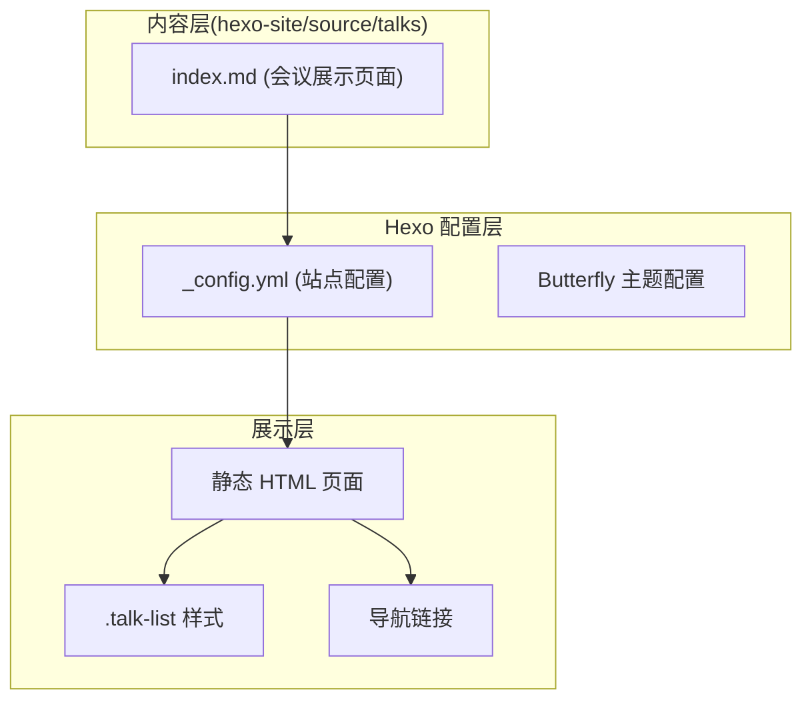
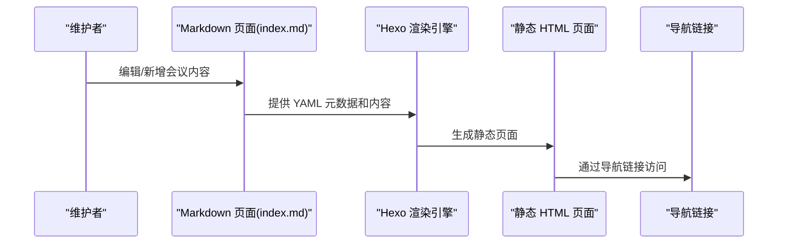
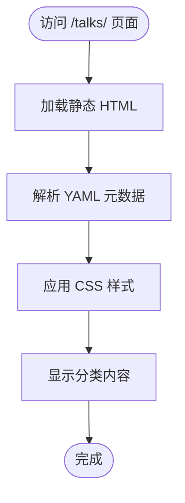
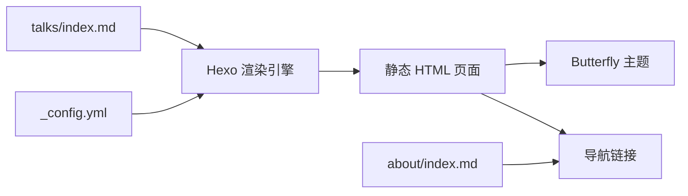

# 会议展示功能

<cite>
**本文引用的文件**
- [talks/index.md](file://hexo-site/source/talks/index.md)
- [_config.yml](file://hexo-site/_config.yml)
- [about/index.md](file://hexo-site/source/about/index.md)
- [publications/index.md](file://hexo-site/source/publications/index.md)
- [portfolio/index.md](file://hexo-site/source/portfolio/index.md)
- [teaching/index.md](file://hexo-site/source/teaching/index.md)
</cite>

## 更新摘要
**所做更改**
- 项目架构从 Jekyll + Python 地图系统完全迁移到 Hexo + 纯静态页面
- 移除了复杂的地图可视化组件和自动化脚本
- 简化为纯 HTML + CSS 的静态展示页面
- 更新了导航结构和页面组织方式

## 目录
1. [简介](#简介)
2. [项目结构](#项目结构)
3. [核心组件](#核心组件)
4. [架构总览](#架构总览)
5. [详细组件分析](#详细组件分析)
6. [依赖关系分析](#依赖关系分析)
7. [性能考虑](#性能考虑)
8. [故障排除指南](#故障排除指南)
9. [结论](#结论)
10. [附录](#附录)

## 简介
本文件面向"会议展示功能"的技术文档，围绕以下目标展开：  
- 静态页面的 Markdown 数据结构、时间线组织与内容格式规范  
- 会议展示页面的实现原理：纯 HTML 渲染、分类筛选与时间排序  
- Hexo 静态站点生成器的集成与配置  
- 简单导航结构与页面组织方式  
- 实际会议数据示例与最佳实践建议  

**更新** 项目已从复杂的 Jekyll + Python 地图系统迁移到简化的 Hexo + 纯静态页面架构，移除了所有地图可视化和自动化脚本组件。

## 项目结构
该站点采用 Hexo 静态站点生成器，会议展示功能现为纯静态页面，由"Markdown 内容 + Hexo 配置 + 静态页面模板"组成：  
- 内容层：位于 hexo-site/source/talks/index.md 的 Markdown 页面，包含标题、类型、布局等元数据  
- 展示层：通过 Hexo 渲染生成静态 HTML，使用 CSS 样式美化展示  
- 导航层：通过 about 页面的快速导航链接访问会议展示页面  

**图表来源**
- [talks/index.md:1-57](file://hexo-site/source/talks/index.md#L1-L57)
- [_config.yml:1-142](file://hexo-site/_config.yml#L1-L142)
- [about/index.md:47-55](file://hexo-site/source/about/index.md#L47-L55)

**章节来源**
- [talks/index.md:1-57](file://hexo-site/source/talks/index.md#L1-L57)
- [_config.yml:119-142](file://hexo-site/_config.yml#L119-L142)
- [about/index.md:47-55](file://hexo-site/source/about/index.md#L47-L55)

## 核心组件
- **静态 Markdown 页面**：位于 hexo-site/source/talks/index.md，采用 YAML 头部元数据，字段包括标题、类型、布局、评论等  
- **Hexo 配置系统**：通过 _config.yml 配置站点基本信息、主题、部署等参数  
- **纯 HTML 渲染**：页面内容通过 Hexo 渲染为静态 HTML，无需 JavaScript 交互  
- **分类展示**：使用 HTML div 容器和 CSS 样式实现会议类型分类展示  
- **时间线组织**：通过年份标题和日期标记实现时间线排序  
- **导航集成**：通过 about 页面的快速导航链接访问会议展示页面  

**章节来源**
- [talks/index.md:1-8](file://hexo-site/source/talks/index.md#L1-L8)
- [talks/index.md:14-38](file://hexo-site/source/talks/index.md#L14-L38)
- [_config.yml:119-142](file://hexo-site/_config.yml#L119-L142)
- [about/index.md:47-55](file://hexo-site/source/about/index.md#L47-L55)

## 架构总览
整体流程分为"内容编写—Hexo 渲染—静态页面生成—导航访问"四个阶段：

**图表来源**
- [talks/index.md:1-57](file://hexo-site/source/talks/index.md#L1-L57)
- [_config.yml:119-142](file://hexo-site/_config.yml#L119-L142)
- [about/index.md:47-55](file://hexo-site/source/about/index.md#L47-L55)

## 详细组件分析

### Markdown 数据结构与内容格式规范
- **文件位置**：hexo-site/source/talks/index.md  
- **YAML 头部字段**：title、date、updated、type、layout、comments 等  
- **页面类型**：type: "talks" 用于标识页面类型  
- **布局设置**：layout: "page" 使用 Hexo 页面布局  
- **内容组织**：使用 HTML 标签和 CSS 类进行内容结构化  
- **样式定义**：内联 CSS 定义 .talk-list、.talk-item 等样式类  
- **分类展示**：使用 h2 标题区分不同会议类型（Conference Talks、Tutorials）  
- **时间线排序**：通过年份标题和日期标记实现自然的时间排序  

**章节来源**
- [talks/index.md:1-8](file://hexo-site/source/talks/index.md#L1-L8)
- [talks/index.md:14-38](file://hexo-site/source/talks/index.md#L14-L38)
- [talks/index.md:40-56](file://hexo-site/source/talks/index.md#L40-L56)

### 会议展示页面实现原理
- **静态渲染**：页面内容通过 Hexo 静态渲染，无需 JavaScript 交互  
- **分类展示**：使用 HTML div 容器和 CSS 样式实现会议类型分类  
- **时间排序**：通过年份标题和日期标记实现自然的时间线排序  
- **样式美化**：内联 CSS 定义字体、颜色、间距等视觉样式  
- **响应式设计**：使用 CSS 类实现基本的响应式布局  
- **内容结构**：使用语义化 HTML 标签组织内容结构  

**图表来源**
- [talks/index.md:1-57](file://hexo-site/source/talks/index.md#L1-L57)
- [talks/index.md:40-56](file://hexo-site/source/talks/index.md#L40-L56)

**章节来源**
- [talks/index.md:1-57](file://hexo-site/source/talks/index.md#L1-L57)
- [talks/index.md:40-56](file://hexo-site/source/talks/index.md#L40-L56)

### Hexo 配置系统
- **主题配置**：使用 Butterfly 主题，配置 live2d 等主题特性  
- **部署配置**：配置 GitHub Pages 部署，支持自动部署流程  
- **站点信息**：配置网站标题、副标题、描述、关键词等 SEO 信息  
- **URL 设置**：配置网站基础 URL 和链接格式  
- **国际化**：设置语言为 zh-CN，支持中文内容展示  

**章节来源**
- [_config.yml:119-142](file://hexo-site/_config.yml#L119-L142)
- [_config.yml:1-142](file://hexo-site/_config.yml#L1-L142)

### 导航集成与页面组织
- **快速导航**：通过 about 页面的快速导航链接访问各功能页面  
- **统一入口**：所有功能页面都通过统一的导航结构组织  
- **页面类型**：支持多种页面类型（about、publications、portfolio、teaching、talks）  
- **链接格式**：使用相对路径格式，如 "/talks/"、"/publications/" 等  

**章节来源**
- [about/index.md:47-55](file://hexo-site/source/about/index.md#L47-L55)
- [publications/index.md:1-58](file://hexo-site/source/publications/index.md#L1-L58)
- [portfolio/index.md:1-51](file://hexo-site/source/portfolio/index.md#L1-L51)
- [teaching/index.md:1-53](file://hexo-site/source/teaching/index.md#L1-L53)

## 依赖关系分析
- **Hexo 渲染引擎**：负责将 Markdown 内容渲染为静态 HTML  
- **Butterfly 主题**：提供页面布局和样式支持  
- **配置系统**：通过 _config.yml 控制站点行为和部署设置  
- **导航系统**：通过 about 页面的链接组织页面访问  

**图表来源**
- [talks/index.md:1-57](file://hexo-site/source/talks/index.md#L1-L57)
- [_config.yml:119-142](file://hexo-site/_config.yml#L119-L142)
- [about/index.md:47-55](file://hexo-site/source/about/index.md#L47-L55)

**章节来源**
- [talks/index.md:1-57](file://hexo-site/source/talks/index.md#L1-L57)
- [_config.yml:119-142](file://hexo-site/_config.yml#L119-L142)
- [about/index.md:47-55](file://hexo-site/source/about/index.md#L47-L55)

## 性能考虑
- **静态渲染**：无需服务器端处理，页面加载速度快  
- **资源优化**：内联 CSS 减少 HTTP 请求，提升页面加载性能  
- **主题优化**：Butterfly 主题经过性能优化，支持响应式设计  
- **部署效率**：GitHub Pages 自动部署，减少手动操作成本  
- **内存占用**：纯静态页面内存占用低，适合长期维护  

## 故障排除指南
- **页面无法访问**：检查 URL 路径是否正确，确认部署状态正常  
- **样式显示异常**：检查 CSS 代码是否正确，确认主题配置无误  
- **导航链接失效**：检查 about 页面的导航链接配置  
- **内容未更新**：确认 Hexo 重新渲染并部署成功  
- **主题显示问题**：检查 Butterfly 主题配置和版本兼容性  

**章节来源**
- [_config.yml:137-142](file://hexo-site/_config.yml#L137-L142)
- [about/index.md:47-55](file://hexo-site/source/about/index.md#L47-L55)

## 结论
该会议展示功能通过"Hexo + 纯静态页面"的简化架构，实现了从复杂地图系统到简洁展示页面的迁移。其优势在于：  
- **架构简化**：移除复杂的地图可视化和自动化脚本，降低维护成本  
- **性能提升**：静态页面加载速度快，用户体验更好  
- **部署简便**：基于 GitHub Pages 的自动部署流程  
- **维护成本低**：纯静态页面易于维护和更新  
- **主题丰富**：Butterfly 主题提供良好的视觉效果和响应式设计  

## 附录
- **实际数据示例**：  
  - Markdown 页面示例见 [talks/index.md:1-57](file://hexo-site/source/talks/index.md#L1-L57)  
  - Hexo 配置示例见 [_config.yml:1-142](file://hexo-site/_config.yml#L1-L142)  
  - 导航链接示例见 [about/index.md:47-55](file://hexo-site/source/about/index.md#L47-L55)  
- **最佳实践建议**：  
  - 使用简洁的 Markdown 语法，避免过度复杂的格式  
  - 合理组织内容结构，使用清晰的标题层次  
  - 保持 CSS 样式的简洁性，避免复杂的样式依赖  
  - 定期检查部署状态，确保页面正常访问  
  - 利用 Hexo 的主题系统，保持页面风格的一致性