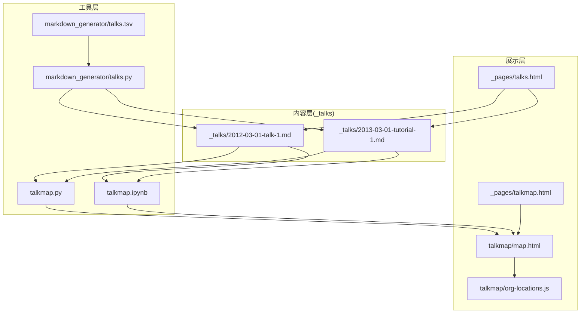
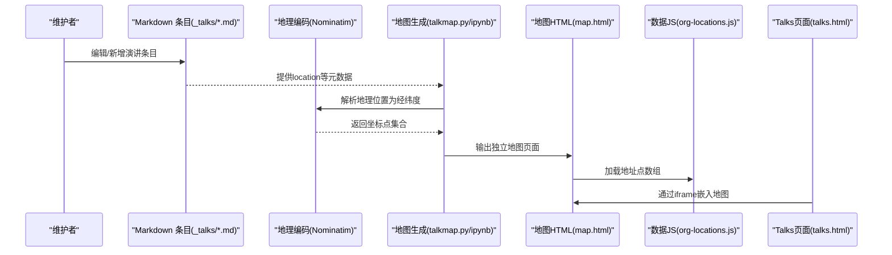
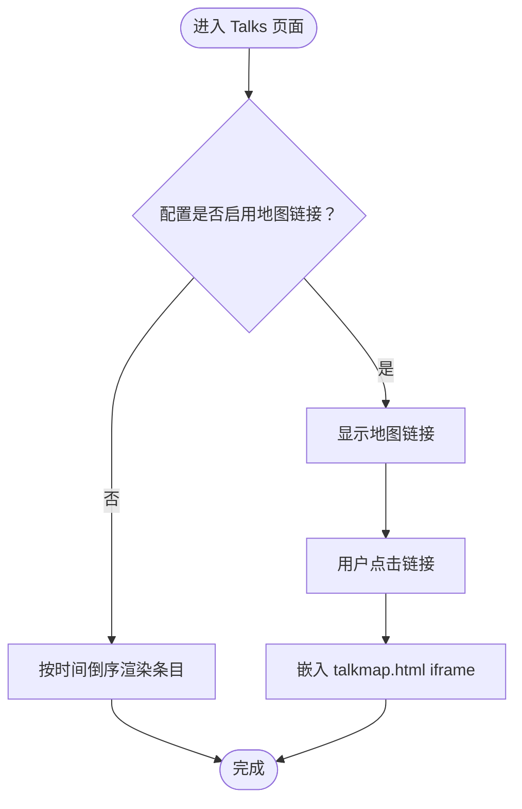
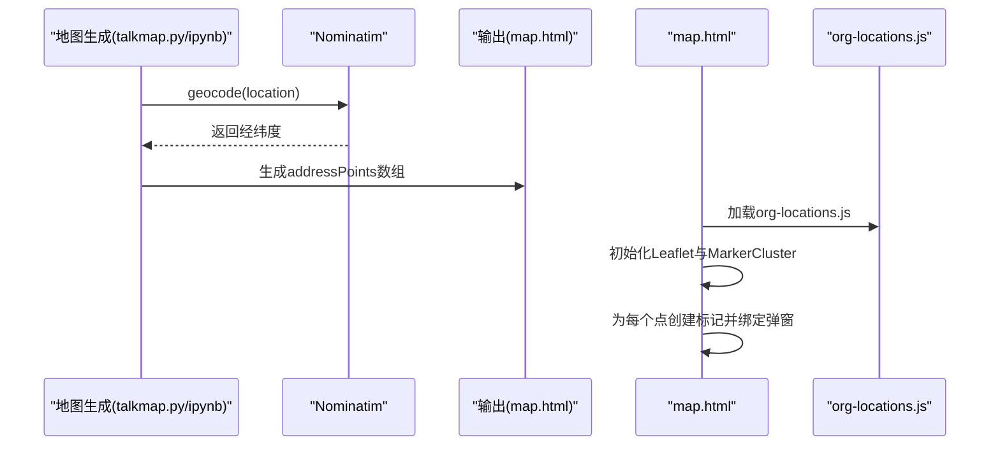
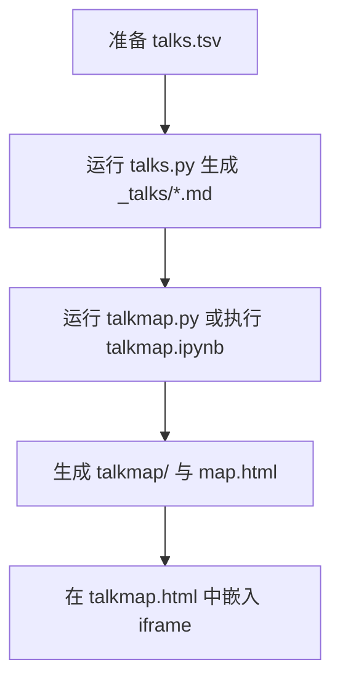
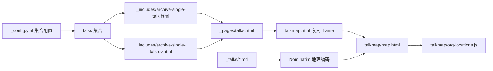

# 会议展示功能

<cite>
**本文引用的文件**
- [talkmap.py](file://talkmap.py)
- [talkmap.ipynb](file://talkmap.ipynb)
- [talks.py](file://markdown_generator/talks.py)
- [talks.tsv](file://markdown_generator/talks.tsv)
- [map.html](file://talkmap/map.html)
- [org-locations.js](file://talkmap/org-locations.js)
- [_talks/2012-03-01-talk-1.md](file://_talks/2012-03-01-talk-1.md)
- [_talks/2013-03-01-tutorial-1.md](file://_talks/2013-03-01-tutorial-1.md)
- [_pages/talkmap.html](file://_pages/talkmap.html)
- [_pages/talks.html](file://_pages/talks.html)
- [_includes/archive-single-talk.html](file://_includes/archive-single-talk.html)
- [_includes/archive-single-talk-cv.html](file://_includes/archive-single-talk-cv.html)
- [_config.yml](file://_config.yml)
</cite>

## 目录
1. [简介](#简介)
2. [项目结构](#项目结构)
3. [核心组件](#核心组件)
4. [架构总览](#架构总览)
5. [详细组件分析](#详细组件分析)
6. [依赖关系分析](#依赖关系分析)
7. [性能考虑](#性能考虑)
8. [故障排除指南](#故障排除指南)
9. [结论](#结论)
10. [附录](#附录)

## 简介
本文件面向“会议展示功能”的技术文档，围绕以下目标展开：  
- 演讲与报告条目的管理方式：Markdown 数据结构、时间线组织与内容格式规范  
- 会议展示页面的实现原理：数据循环渲染、分类筛选与时间排序  
- TalkMap 地图可视化系统：地理坐标数据获取、Leaflet 集成与交互式标记  
- org-locations.js 数据文件结构：机构名称、经纬度坐标与映射关系  
- 地图可视化技术实现：JavaScript 事件处理、标记聚类与响应式设计  
- 会议数据导入流程与自动化工具：CSV/TSV 转换与批量数据处理  
- 实际会议数据示例与最佳实践建议  

## 项目结构
该站点采用 Jekyll 静态站点生成器，会议展示功能由“Markdown 条目 + 自动化脚本 + 地图页面”三部分组成：  
- 内容层：位于 _talks 的 Markdown 条目，包含标题、类型、日期、地点等元数据  
- 工具层：Python/Notebook 脚本负责从 Markdown 提取位置信息并生成地图数据与页面  
- 展示层：Jekyll 页面通过 iframe 嵌入独立的地图 HTML，同时 Talks 页面以列表形式展示条目  

**图表来源**
- [talkmap.py:1-57](file://talkmap.py#L1-L57)
- [talkmap.ipynb:1-163](file://talkmap.ipynb#L1-L163)
- [talks.py:1-112](file://markdown_generator/talks.py#L1-L112)
- [_pages/talks.html:1-17](file://_pages/talks.html#L1-L17)
- [_pages/talkmap.html:1-10](file://_pages/talkmap.html#L1-L10)
- [talkmap/map.html:1-47](file://talkmap/map.html#L1-L47)
- [org-locations.js:1-22](file://talkmap/org-locations.js#L1-L22)

**章节来源**
- [talkmap.py:1-57](file://talkmap.py#L1-L57)
- [talkmap.ipynb:1-163](file://talkmap.ipynb#L1-L163)
- [talks.py:1-112](file://markdown_generator/talks.py#L1-L112)
- [_pages/talks.html:1-17](file://_pages/talks.html#L1-L17)
- [_pages/talkmap.html:1-10](file://_pages/talkmap.html#L1-L10)
- [talkmap/map.html:1-47](file://talkmap/map.html#L1-L47)
- [org-locations.js:1-22](file://talkmap/org-locations.js#L1-L22)

## 核心组件
- Markdown 条目（演讲/报告）：位于 _talks，采用 YAML 头部元数据，字段包括标题、类型、日期、地点、会馆等  
- 自动化脚本：从 Markdown 中提取 location 字段，调用地理编码服务解析经纬度，输出地图数据与 HTML  
- 地图页面：基于 Leaflet 与 MarkerCluster，渲染交互式标记，支持缩放与聚类  
- Talks 列表页：通过 Jekyll 循环渲染条目，支持按时间倒序与分类显示  
- 配置开关：通过配置项控制是否在 Talks 页面显示地图链接  

**章节来源**
- [_talks/2012-03-01-talk-1.md:1-12](file://_talks/2012-03-01-talk-1.md#L1-L12)
- [_talks/2013-03-01-tutorial-1.md:1-14](file://_talks/2013-03-01-tutorial-1.md#L1-L14)
- [talkmap.py:1-57](file://talkmap.py#L1-L57)
- [talkmap.ipynb:1-163](file://talkmap.ipynb#L1-L163)
- [talkmap/map.html:1-47](file://talkmap/map.html#L1-L47)
- [_pages/talks.html:1-17](file://_pages/talks.html#L1-L17)
- [_config.yml:100-100](file://_config.yml#L100-L100)

## 架构总览
整体流程分为“数据准备—地理编码—地图生成—页面展示”四个阶段：

**图表来源**
- [talkmap.py:27-57](file://talkmap.py#L27-L57)
- [talkmap.ipynb:89-128](file://talkmap.ipynb#L89-L128)
- [talkmap/map.html:14-44](file://talkmap/map.html#L14-L44)
- [_pages/talks.html:8-16](file://_pages/talks.html#L8-L16)

## 详细组件分析

### Markdown 数据结构与内容格式规范
- 文件命名：YYYY-MM-DD-url_slug.md，确保唯一性与可读性  
- YAML 头部字段：title、type、date、venue、location、permalink 等  
- 类型字段：type 支持 Talk、Tutorial、Conference 等，用于分类筛选  
- 时间字段：date 必须为 YYYY-MM-DD 格式，用于时间线排序  
- 描述字段：支持 Markdown，可包含外部链接与富文本  
- 示例文件展示了标准字段与描述写法，便于批量生成与一致性维护  

**章节来源**
- [_talks/2012-03-01-talk-1.md:1-12](file://_talks/2012-03-01-talk-1.md#L1-L12)
- [_talks/2013-03-01-tutorial-1.md:1-14](file://_talks/2013-03-01-tutorial-1.md#L1-L14)
- [talks.py:16-25](file://markdown_generator/talks.py#L16-L25)

### 会议展示页面实现原理
- 列表渲染：Talks 页面通过 Jekyll 循环遍历集合，使用模板片段渲染每一条目  
- 时间排序：默认按时间倒序展示，便于查看最新演讲  
- 分类筛选：type 字段用于区分不同类型的条目，前端可扩展为按类型过滤  
- 链接入口：配置开关控制是否显示“查看演讲地图”的链接，点击后嵌入地图页面  

**图表来源**
- [_pages/talks.html:8-16](file://_pages/talks.html#L8-L16)
- [_includes/archive-single-talk.html:14-42](file://_includes/archive-single-talk.html#L14-L42)
- [_config.yml:100-100](file://_config.yml#L100-L100)

**章节来源**
- [_pages/talks.html:1-17](file://_pages/talks.html#L1-L17)
- [_includes/archive-single-talk.html:1-43](file://_includes/archive-single-talk.html#L1-L43)
- [_includes/archive-single-talk-cv.html:1-42](file://_includes/archive-single-talk-cv.html#L1-L42)
- [_config.yml:100-100](file://_config.yml#L100-L100)

### TalkMap 地图可视化系统
- 地理坐标数据获取：从 Markdown 元数据中提取 location，调用 Nominatim 进行地理编码，得到经纬度  
- Leaflet 集成：引入 Leaflet 样式与脚本，初始化底图与标记聚类组  
- 交互式标记：每个条目生成一个标记，鼠标悬停显示弹窗，点击聚簇缩放至覆盖范围  
- 数据文件：org-locations.js 以二维数组形式存储“描述文本 + 经度 + 纬度”，供地图页面直接使用  

**图表来源**
- [talkmap.py:27-57](file://talkmap.py#L27-L57)
- [talkmap.ipynb:89-128](file://talkmap.ipynb#L89-L128)
- [talkmap/map.html:24-44](file://talkmap/map.html#L24-L44)
- [org-locations.js:1-22](file://talkmap/org-locations.js#L1-L22)

**章节来源**
- [talkmap.py:1-57](file://talkmap.py#L1-L57)
- [talkmap.ipynb:1-163](file://talkmap.ipynb#L1-L163)
- [talkmap/map.html:1-47](file://talkmap/map.html#L1-L47)
- [org-locations.js:1-22](file://talkmap/org-locations.js#L1-L22)

### org-locations.js 数据文件结构说明
- 结构：全局数组 addressPoints，每一项为三元组：[描述文本, 纬度, 经度]  
- 描述文本：由标题 + 会馆 + 地点拼接，支持换行符以增强可读性  
- 坐标：纬度在前，经度在后，符合 Leaflet 的 LatLng 参数顺序  
- 用途：被 map.html 动态加载，作为地图标记的数据源  

**章节来源**
- [org-locations.js:1-22](file://talkmap/org-locations.js#L1-L22)
- [talkmap/map.html:35-41](file://talkmap/map.html#L35-L41)

### 地图可视化技术实现
- 事件处理：鼠标悬停显示子区域边界提示；点击聚簇缩放至覆盖范围  
- 标记聚类：启用 MarkerCluster，设置最大聚簇半径与覆盖范围提示  
- 响应式设计：通过 viewport 设置与容器样式适配不同屏幕尺寸  
- 底图选择：使用 ArcGIS 世界街道地图瓦片，提供清晰的城市级视图  

**章节来源**
- [talkmap/map.html:11-17](file://talkmap/map.html#L11-L17)
- [talkmap/map.html:25-44](file://talkmap/map.html#L25-L44)

### 会议数据导入流程与自动化工具
- 批量生成 Markdown：使用 talks.py 将 TSV 转换为多个 Markdown 条目，自动填充元数据与链接  
- 数据格式：TSV 包含标题、类型、日期、地点、会馆、链接与描述等列  
- 地理编码与地图生成：运行 talkmap.py 或执行 talkmap.ipynb，自动扫描 _talks、地理编码并输出地图 HTML 与数据文件  
- 执行步骤：安装依赖 → 在 _talks 目录下运行脚本 → 生成 talkmap 子目录与 map.html → 在页面中嵌入 iframe  

**图表来源**
- [talks.py:36-108](file://markdown_generator/talks.py#L36-L108)
- [talkmap.py:17-57](file://talkmap.py#L17-L57)
- [talkmap.ipynb:51-128](file://talkmap.ipynb#L51-L128)
- [_pages/talkmap.html:8-9](file://_pages/talkmap.html#L8-L9)

**章节来源**
- [talks.py:1-112](file://markdown_generator/talks.py#L1-L112)
- [talks.tsv:1-5](file://markdown_generator/talks.tsv#L1-L5)
- [talkmap.py:1-57](file://talkmap.py#L1-L57)
- [talkmap.ipynb:1-163](file://talkmap.ipynb#L1-L163)
- [_pages/talkmap.html:1-10](file://_pages/talkmap.html#L1-L10)

## 依赖关系分析
- Jekyll 集合 talks：通过配置启用输出与永久链接，模板使用 include 片段渲染  
- 地图页面依赖：talkmap.html 依赖 Leaflet、MarkerCluster 与 org-locations.js  
- 数据来源：Markdown 条目中的 location 字段为地理编码输入  
- 自动化工具：依赖 geopy（Nominatim）、getorg、frontmatter、glob 等库  

**图表来源**
- [_config.yml:233-293](file://_config.yml#L233-L293)
- [_includes/archive-single-talk.html:1-43](file://_includes/archive-single-talk.html#L1-L43)
- [_includes/archive-single-talk-cv.html:1-42](file://_includes/archive-single-talk-cv.html#L1-L42)
- [_pages/talks.html:1-17](file://_pages/talks.html#L1-L17)
- [_pages/talkmap.html:8-9](file://_pages/talkmap.html#L8-L9)
- [talkmap/map.html:14-17](file://talkmap/map.html#L14-L17)
- [org-locations.js:1-22](file://talkmap/org-locations.js#L1-L22)

**章节来源**
- [_config.yml:233-293](file://_config.yml#L233-L293)
- [_pages/talks.html:1-17](file://_pages/talks.html#L1-L17)
- [_pages/talkmap.html:1-10](file://_pages/talkmap.html#L1-L10)
- [talkmap/map.html:1-47](file://talkmap/map.html#L1-L47)

## 性能考虑
- 地理编码限制：Nominatim 有速率与超时限制，建议批量运行并缓存结果，避免重复请求  
- 聚类参数：合理设置最大聚簇半径与覆盖提示，平衡可读性与交互性能  
- 资源加载：优先使用 CDN 引入 Leaflet 与 MarkerCluster，减少本地体积  
- 渲染优化：大量标记时建议分页或按区域拆分地图，降低前端渲染压力  

## 故障排除指南
- 地理编码失败：检查 location 字段是否可被 Nominatim 正确识别，必要时精简为更明确的地址  
- 超时错误：调整超时时间或分批处理，避免一次性请求过多  
- 显示异常：确认 org-locations.js 是否正确生成且被 map.html 加载，检查坐标顺序与数值范围  
- 页面不显示地图：确认 talkmap.html 的 iframe 源路径与 talkmap 子目录存在  

**章节来源**
- [talkmap.py:44-52](file://talkmap.py#L44-L52)
- [talkmap.ipynb:109-115](file://talkmap.ipynb#L109-L115)
- [talkmap/map.html:14-17](file://talkmap/map.html#L14-L17)

## 结论
该会议展示功能通过“Markdown + 自动化脚本 + 地图可视化”的组合，实现了从数据录入到可视化呈现的完整闭环。其优势在于：  
- 内容标准化与可扩展性强，易于维护与批量生成  
- 地图可视化直观易用，具备良好的交互体验  
- 与 Jekyll 生态无缝集成，便于部署与更新  

## 附录
- 实际数据示例：  
  - Markdown 条目示例见 [2012-03-01-talk-1.md:1-12](file://_talks/2012-03-01-talk-1.md#L1-L12)、[2013-03-01-tutorial-1.md:1-14](file://_talks/2013-03-01-tutorial-1.md#L1-L14)  
  - TSV 示例见 [talks.tsv:1-5](file://markdown_generator/talks.tsv#L1-L5)  
  - 地图数据示例见 [org-locations.js:1-22](file://talkmap/org-locations.js#L1-L22)  
- 最佳实践建议：  
  - 统一 location 格式，优先使用“城市、州/省、国家”组合  
  - 为每个条目提供清晰的标题与类型，便于筛选与排序  
  - 定期清理与验证地理编码结果，确保地图准确性  
  - 使用配置开关控制地图链接的可见性，避免页面冗余信息