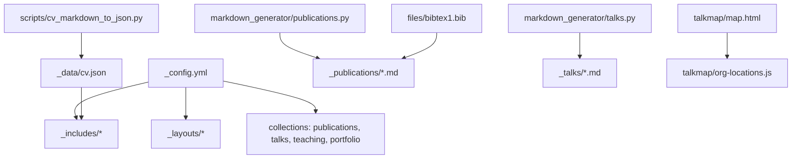
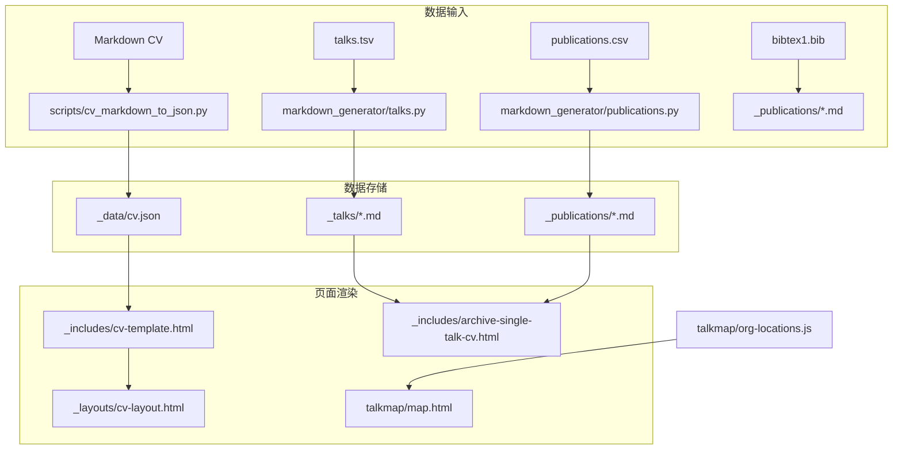
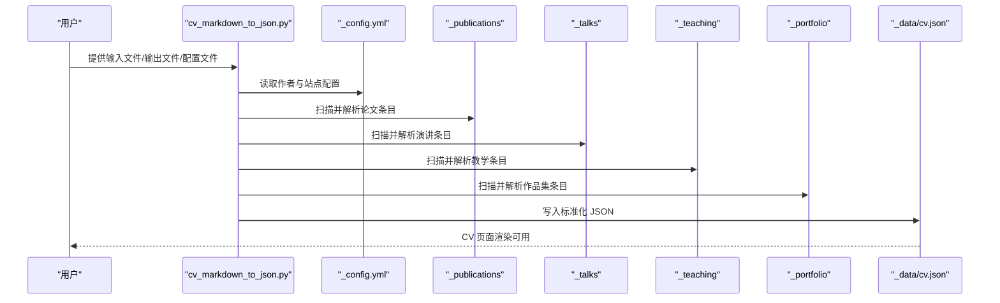
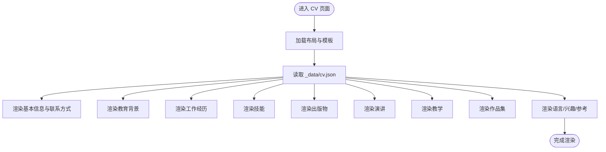
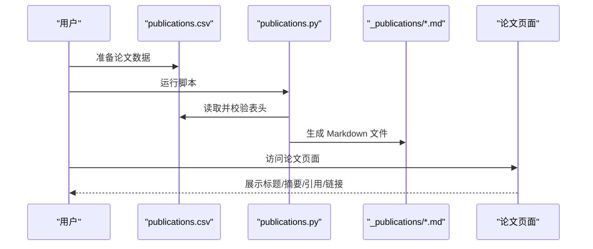
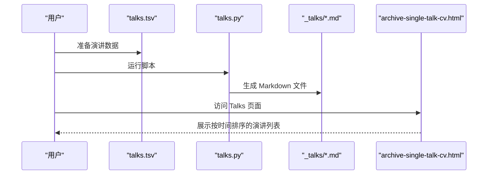
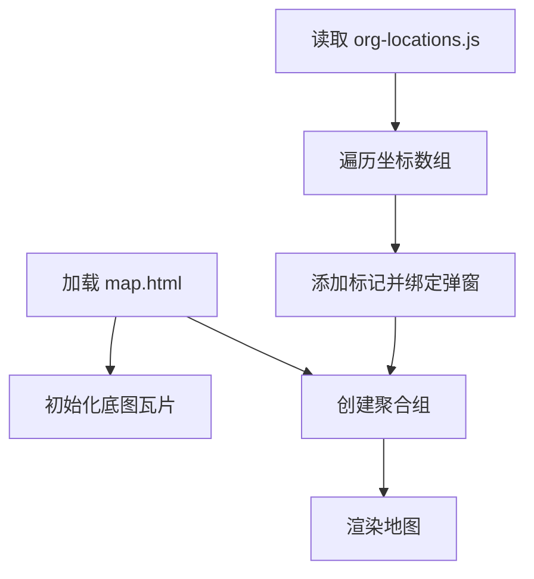
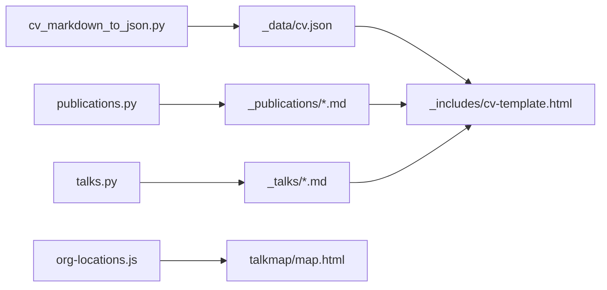

# 学术功能模块

<cite>
**本文档引用的文件**
- [_config.yml](file://_config.yml)
- [_data/cv.json](file://_data/cv.json)
- [scripts/cv_markdown_to_json.py](file://scripts/cv_markdown_to_json.py)
- [_includes/cv-template.html](file://_includes/cv-template.html)
- [_layouts/cv-layout.html](file://_layouts/cv-layout.html)
- [_includes/archive-single-talk-cv.html](file://_includes/archive-single-talk-cv.html)
- [markdown_generator/publications.py](file://markdown_generator/publications.py)
- [markdown_generator/talks.py](file://markdown_generator/talks.py)
- [markdown_generator/publications.csv](file://markdown_generator/publications.csv)
- [markdown_generator/talks.tsv](file://markdown_generator/talks.tsv)
- [_publications/2009-10-01-paper-title-number-1.md](file://_publications/2009-10-01-paper-title-number-1.md)
- [_talks/2012-03-01-talk-1.md](file://_talks/2012-03-01-talk-1.md)
- [talkmap/map.html](file://talkmap/map.html)
- [talkmap/org-locations.js](file://talkmap/org-locations.js)
- [files/bibtex1.bib](file://files/bibtex1.bib)
</cite>

## 目录
1. [简介](#简介)
2. [项目结构](#项目结构)
3. [核心组件](#核心组件)
4. [架构总览](#架构总览)
5. [详细组件分析](#详细组件分析)
6. [依赖分析](#依赖分析)
7. [性能考虑](#性能考虑)
8. [故障排查指南](#故障排查指南)
9. [结论](#结论)
10. [附录](#附录)

## 简介
本技术文档面向学术功能模块，围绕以下目标展开：简历生成（Markdown 与 JSON）、CV 页面渲染与定制、论文引用管理（CSV/TSV 到 Markdown 的生成流程与 BibTeX 集成）、会议展示（Talks 列表与时间线）、TalkMap 地图可视化（地理坐标到地图的集成与交互）、学术社交平台集成（ORCID、Google Scholar 等）以及数据导入导出自动化工具的使用。文档以仓库现有实现为基础，提供可操作的流程说明、最佳实践与可视化图示，帮助维护者与使用者高效构建与维护学术网站。

## 项目结构
学术功能模块由 Jekyll 配置、数据层、模板与布局、Markdown 生成器脚本、TalkMap 可视化页面等组成。下图展示了与学术功能相关的核心文件与目录之间的关系：

图表来源
- [_config.yml](file://_config.yml)
- [_data/cv.json](file://_data/cv.json)
- [scripts/cv_markdown_to_json.py](file://scripts/cv_markdown_to_json.py)
- [markdown_generator/publications.py](file://markdown_generator/publications.py)
- [markdown_generator/talks.py](file://markdown_generator/talks.py)
- [_publications/2009-10-01-paper-title-number-1.md](file://_publications/2009-10-01-paper-title-number-1.md)
- [_talks/2012-03-01-talk-1.md](file://_talks/2012-03-01-talk-1.md)
- [talkmap/map.html](file://talkmap/map.html)
- [talkmap/org-locations.js](file://talkmap/org-locations.js)
- [files/bibtex1.bib](file://files/bibtex1.bib)

章节来源
- [_config.yml](file://_config.yml)
- [_data/cv.json](file://_data/cv.json)

## 核心组件
- 简历数据与渲染
  - JSON 数据源：[_data/cv.json](file://_data/cv.json)
  - 渲染模板：[_includes/cv-template.html](file://_includes/cv-template.html)
  - 布局：[_layouts/cv-layout.html](file://_layouts/cv-layout.html)
  - Markdown 转 JSON 工具：[scripts/cv_markdown_to_json.py](file://scripts/cv_markdown_to_json.py)
- 论文引用管理
  - CSV/TSV 输入：[markdown_generator/publications.csv](file://markdown_generator/publications.csv)、[markdown_generator/publications.py](file://markdown_generator/publications.py)
  - 输出 Markdown：[_publications/2009-10-01-paper-title-number-1.md](file://_publications/2009-10-01-paper-title-number-1.md)
  - BibTeX 集成：[files/bibtex1.bib](file://files/bibtex1.bib)
- 会议展示
  - TSV 输入：[markdown_generator/talks.tsv](file://markdown_generator/talks.tsv)、[markdown_generator/talks.py](file://markdown_generator/talks.py)
  - 输出 Markdown：[_talks/2012-03-01-talk-1.md](file://_talks/2012-03-01-talk-1.md)
  - 列表模板：[_includes/archive-single-talk-cv.html](file://_includes/archive-single-talk-cv.html)
- TalkMap 地图可视化
  - 地图页面：[talkmap/map.html](file://talkmap/map.html)
  - 坐标数据：[talkmap/org-locations.js](file://talkmap/org-locations.js)

章节来源
- [_data/cv.json](file://_data/cv.json)
- [_includes/cv-template.html](file://_includes/cv-template.html)
- [_layouts/cv-layout.html](file://_layouts/cv-layout.html)
- [scripts/cv_markdown_to_json.py](file://scripts/cv_markdown_to_json.py)
- [markdown_generator/publications.py](file://markdown_generator/publications.py)
- [markdown_generator/talks.py](file://markdown_generator/talks.py)
- [_publications/2009-10-01-paper-title-number-1.md](file://_publications/2009-10-01-paper-title-number-1.md)
- [_talks/2012-03-01-talk-1.md](file://_talks/2012-03-01-talk-1.md)
- [talkmap/map.html](file://talkmap/map.html)
- [talkmap/org-locations.js](file://talkmap/org-locations.js)
- [files/bibtex1.bib](file://files/bibtex1.bib)

## 架构总览
下图展示了从数据输入到页面渲染的整体流程，涵盖简历、论文、会议与地图四个子系统：

图表来源
- [scripts/cv_markdown_to_json.py](file://scripts/cv_markdown_to_json.py)
- [markdown_generator/publications.py](file://markdown_generator/publications.py)
- [markdown_generator/talks.py](file://markdown_generator/talks.py)
- [_data/cv.json](file://_data/cv.json)
- [_publications/2009-10-01-paper-title-number-1.md](file://_publications/2009-10-01-paper-title-number-1.md)
- [_talks/2012-03-01-talk-1.md](file://_talks/2012-03-01-talk-1.md)
- [_layouts/cv-layout.html](file://_layouts/cv-layout.html)
- [_includes/cv-template.html](file://_includes/cv-template.html)
- [_includes/archive-single-talk-cv.html](file://_includes/archive-single-talk-cv.html)
- [talkmap/map.html](file://talkmap/map.html)
- [talkmap/org-locations.js](file://talkmap/org-locations.js)
- [files/bibtex1.bib](file://files/bibtex1.bib)

## 详细组件分析

### 简历生成功能（Markdown → JSON）
- 功能概述
  - 将 Markdown 格式的 CV 源文件解析为标准化的 JSON 结构，供 CV 页面模板渲染使用。
  - 自动提取作者信息、教育背景、工作经历、技能、公开出版物、演讲与教学记录、作品集等。
- 关键流程
  - 解析 Markdown 分节与字段
  - 读取 Jekyll 配置文件补充作者与社交链接
  - 从各集合目录（_publications、_talks、_teaching、_portfolio）抽取条目
  - 写入 JSON 文件，日期类型采用 ISO 字符串编码
- 使用步骤
  - 准备 Markdown CV 源文件
  - 运行转换脚本，指定输入、输出与配置路径
  - 在页面中通过数据占位符渲染 CV
- 最佳实践
  - 统一分节标题与字段命名，避免解析歧义
  - 在 _config.yml 中完善作者与社交链接，保证 JSON 中 profiles 完整
  - 发布前运行转换脚本，确保 JSON 与集合内容一致

图表来源
- [scripts/cv_markdown_to_json.py](file://scripts/cv_markdown_to_json.py)
- [_config.yml](file://_config.yml)
- [_publications/2009-10-01-paper-title-number-1.md](file://_publications/2009-10-01-paper-title-number-1.md)
- [_talks/2012-03-01-talk-1.md](file://_talks/2012-03-01-talk-1.md)
- [_data/cv.json](file://_data/cv.json)

章节来源
- [scripts/cv_markdown_to_json.py](file://scripts/cv_markdown_to_json.py)
- [_data/cv.json](file://_data/cv.json)
- [_layouts/cv-layout.html](file://_layouts/cv-layout.html)
- [_includes/cv-template.html](file://_includes/cv-template.html)

### CV 页面渲染与定制
- 渲染机制
  - 布局文件加载头部、脚本与样式，容器内嵌入 CV 模板
  - 模板从数据源读取 JSON 并按区块渲染（基本信息、教育、工作、技能、出版物、演讲、教学、作品集、语言、兴趣、参考）
- 定制选项
  - 通过 _config.yml 控制作者信息、社交链接、站点主题与导航
  - 通过修改 SCSS 主题文件切换外观风格
  - 通过调整模板区块顺序与样式类实现视觉定制
- 注意事项
  - 若某区块为空，模板会自动跳过渲染，保持页面整洁
  - 外链使用新窗口打开，提升用户体验

图表来源
- [_layouts/cv-layout.html](file://_layouts/cv-layout.html)
- [_includes/cv-template.html](file://_includes/cv-template.html)
- [_data/cv.json](file://_data/cv.json)

章节来源
- [_layouts/cv-layout.html](file://_layouts/cv-layout.html)
- [_includes/cv-template.html](file://_includes/cv-template.html)
- [_data/cv.json](file://_data/cv.json)

### 论文引用管理系统（CSV/TSV → Markdown → 页面）
- 数据输入
  - CSV/TSV 文件定义论文元数据（日期、标题、期刊、摘要、引用格式、URL slug、PDF/幻灯片链接、分类）
- 生成流程
  - Python 脚本读取文件，校验表头，逐行生成 Markdown Front Matter 与正文
  - 输出至 _publications 目录，文件名遵循 YYYY-MM-DD-url_slug.md 规范
- 页面展示
  - 论文页面通过默认布局渲染，Front Matter 中的字段用于页面元信息与引用展示
- BibTeX 集成
  - 论文 Markdown 中可包含 bibtexurl 字段，指向本地或远程 BibTeX 文件，便于读者下载引用格式

图表来源
- [markdown_generator/publications.py](file://markdown_generator/publications.py)
- [markdown_generator/publications.csv](file://markdown_generator/publications.csv)
- [_publications/2009-10-01-paper-title-number-1.md](file://_publications/2009-10-01-paper-title-number-1.md)

章节来源
- [markdown_generator/publications.py](file://markdown_generator/publications.py)
- [markdown_generator/publications.csv](file://markdown_generator/publications.csv)
- [_publications/2009-10-01-paper-title-number-1.md](file://_publications/2009-10-01-paper-title-number-1.md)
- [files/bibtex1.bib](file://files/bibtex1.bib)

### 会议展示功能（Talks 列表与时间线）
- 数据输入
  - TSV 文件定义演讲元数据（标题、类型、URL slug、地点、日期、描述等）
- 生成流程
  - Python 脚本读取 TSV，生成 Markdown 文件至 _talks 目录
- 列表展示
  - 使用 archive-single-talk-cv.html 模板渲染列表项，显示标题、日期、地点与简述
- 时间线与筛选
  - 可结合日期排序与分类字段在页面层面进行时间线展示与筛选

图表来源
- [markdown_generator/talks.py](file://markdown_generator/talks.py)
- [markdown_generator/talks.tsv](file://markdown_generator/talks.tsv)
- [_talks/2012-03-01-talk-1.md](file://_talks/2012-03-01-talk-1.md)
- [_includes/archive-single-talk-cv.html](file://_includes/archive-single-talk-cv.html)

章节来源
- [markdown_generator/talks.py](file://markdown_generator/talks.py)
- [markdown_generator/talks.tsv](file://markdown_generator/talks.tsv)
- [_talks/2012-03-01-talk-1.md](file://_talks/2012-03-01-talk-1.md)
- [_includes/archive-single-talk-cv.html](file://_includes/archive-single-talk-cv.html)

### TalkMap 地图可视化系统
- 实现原理
  - 使用 Leaflet 引入底图与标记聚合（MarkerCluster）
  - 通过 org-locations.js 提供地理坐标数组，每个元素包含弹窗标题与经纬度
  - 在 map.html 中初始化地图、瓦片层与聚合组，循环添加标记并绑定弹窗
- 使用方法
  - 在 org-locations.js 中维护地址点数组
  - 在 talkmap 页面访问地图，鼠标悬停查看聚合范围，点击聚合缩放
- 扩展建议
  - 支持动态加载坐标数据（如从 JSON 或 API 获取）
  - 增加图层选择与交互式筛选

图表来源
- [talkmap/map.html](file://talkmap/map.html)
- [talkmap/org-locations.js](file://talkmap/org-locations.js)

章节来源
- [talkmap/map.html](file://talkmap/map.html)
- [talkmap/org-locations.js](file://talkmap/org-locations.js)

### 学术社交平台集成
- 集成方式
  - 在 _config.yml 的 author 段落中配置社交链接（Google Scholar、ORCID、ResearchGate、GitHub、LinkedIn、Twitter 等）
  - 脚本会自动将这些链接写入 JSON 的 profiles 数组，供 CV 模板渲染
- 渲染效果
  - CV 模板根据 profiles 自动生成外链图标与链接，便于访客直达个人主页
- 注意事项
  - 确保链接有效且与个人身份匹配
  - 如需隐藏某项，可在配置中留空对应字段

章节来源
- [_config.yml](file://_config.yml)
- [scripts/cv_markdown_to_json.py](file://scripts/cv_markdown_to_json.py)
- [_includes/cv-template.html](file://_includes/cv-template.html)

### 数据导入导出自动化工具
- 导入
  - 论文：publications.py 读取 CSV/TSV，生成 _publications 下的 Markdown
  - 会议：talks.py 读取 TSV，生成 _talks 下的 Markdown
  - 简历：cv_markdown_to_json.py 读取 Markdown 与 _config.yml，生成 _data/cv.json
- 导出
  - 通过 Git 提交或 GitHub Pages 部署，静态站点自动发布
- 最佳实践
  - 使用统一的数据格式与命名规范，减少解析错误
  - 在 CI/CD 中加入校验步骤（如检查日期格式、必填字段）

章节来源
- [markdown_generator/publications.py](file://markdown_generator/publications.py)
- [markdown_generator/talks.py](file://markdown_generator/talks.py)
- [scripts/cv_markdown_to_json.py](file://scripts/cv_markdown_to_json.py)

## 依赖分析
- 组件耦合
  - CV 渲染依赖 _data/cv.json；JSON 由 cv_markdown_to_json.py 生成
  - 论文与会议页面依赖各自集合目录中的 Markdown 文件
  - TalkMap 依赖 org-locations.js 提供坐标数据
- 外部依赖
  - Leaflet 与 MarkerCluster 用于地图可视化
  - Jekyll 集合与默认布局用于页面渲染
- 循环依赖
  - 未发现循环依赖，数据流单向从输入到输出再到渲染

图表来源
- [scripts/cv_markdown_to_json.py](file://scripts/cv_markdown_to_json.py)
- [_data/cv.json](file://_data/cv.json)
- [markdown_generator/publications.py](file://markdown_generator/publications.py)
- [markdown_generator/talks.py](file://markdown_generator/talks.py)
- [_publications/2009-10-01-paper-title-number-1.md](file://_publications/2009-10-01-paper-title-number-1.md)
- [_talks/2012-03-01-talk-1.md](file://_talks/2012-03-01-talk-1.md)
- [_includes/cv-template.html](file://_includes/cv-template.html)
- [talkmap/map.html](file://talkmap/map.html)
- [talkmap/org-locations.js](file://talkmap/org-locations.js)

章节来源
- [scripts/cv_markdown_to_json.py](file://scripts/cv_markdown_to_json.py)
- [markdown_generator/publications.py](file://markdown_generator/publications.py)
- [markdown_generator/talks.py](file://markdown_generator/talks.py)
- [talkmap/map.html](file://talkmap/map.html)
- [talkmap/org-locations.js](file://talkmap/org-locations.js)

## 性能考虑
- 渲染性能
  - 使用压缩布局与静态生成，避免服务端计算开销
  - 合理拆分模板区块，减少不必要的 DOM 重排
- 数据规模
  - 对于大量论文/演讲，建议在生成阶段进行去重与索引优化
- 地图性能
  - 聚合半径与层级阈值可根据数据密度调优，提升交互流畅度

## 故障排查指南
- 简历不更新
  - 确认已重新运行 cv_markdown_to_json.py 并提交 _data/cv.json
  - 检查 _config.yml 中作者信息是否完整
- 论文/演讲页面空白
  - 检查集合目录下的 Markdown 文件是否生成成功
  - 确认 Front Matter 字段完整（如 title、date、venue 等）
- 地图不显示
  - 检查 org-locations.js 是否正确加载
  - 确认网络可访问 Leaflet 资源与瓦片服务
- 引用格式异常
  - 检查论文 Markdown 中的 citation 字段与 bibtexurl 链接

章节来源
- [scripts/cv_markdown_to_json.py](file://scripts/cv_markdown_to_json.py)
- [_publications/2009-10-01-paper-title-number-1.md](file://_publications/2009-10-01-paper-title-number-1.md)
- [_talks/2012-03-01-talk-1.md](file://_talks/2012-03-01-talk-1.md)
- [talkmap/map.html](file://talkmap/map.html)
- [talkmap/org-locations.js](file://talkmap/org-locations.js)

## 结论
本模块通过“数据输入 → 生成脚本 → 静态文件 → 模板渲染”的闭环，实现了简历、论文、会议与地图的全栈学术功能。借助 Jekyll 的集合与 Front Matter，系统具备良好的扩展性与可维护性。建议持续完善数据规范与自动化流程，结合外部平台（ORCID、Google Scholar、BibTeX）提升学术展示的专业性与完整性。

## 附录
- 实际数据示例
  - 论文示例：[_publications/2009-10-01-paper-title-number-1.md](file://_publications/2009-10-01-paper-title-number-1.md)
  - 会议示例：[_talks/2012-03-01-talk-1.md](file://_talks/2012-03-01-talk-1.md)
  - BibTeX 示例：[files/bibtex1.bib](file://files/bibtex1.bib)
- 工具与脚本
  - 简历转换：[scripts/cv_markdown_to_json.py](file://scripts/cv_markdown_to_json.py)
  - 论文生成：[markdown_generator/publications.py](file://markdown_generator/publications.py)
  - 会议生成：[markdown_generator/talks.py](file://markdown_generator/talks.py)
- 可视化页面
  - 地图页面：[talkmap/map.html](file://talkmap/map.html)
  - 坐标数据：[talkmap/org-locations.js](file://talkmap/org-locations.js)