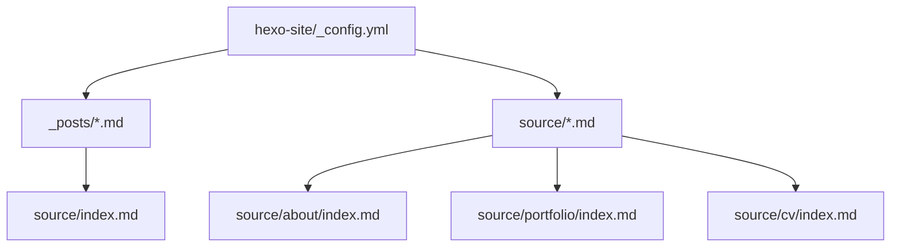
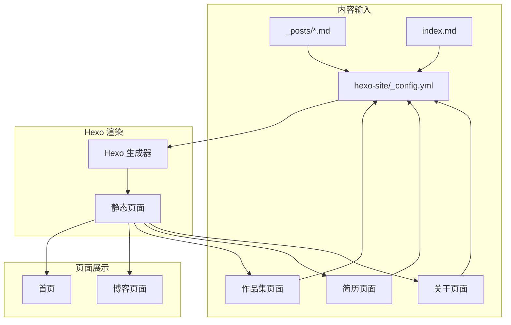
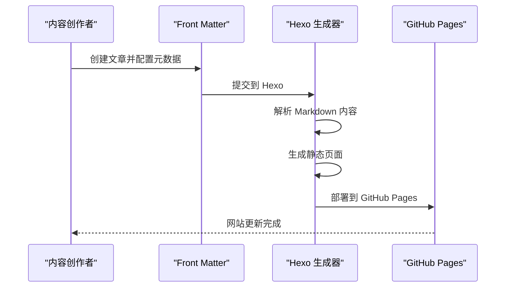
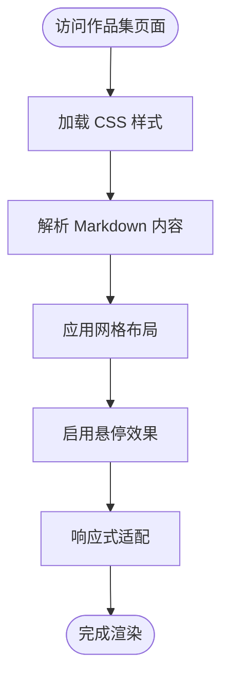
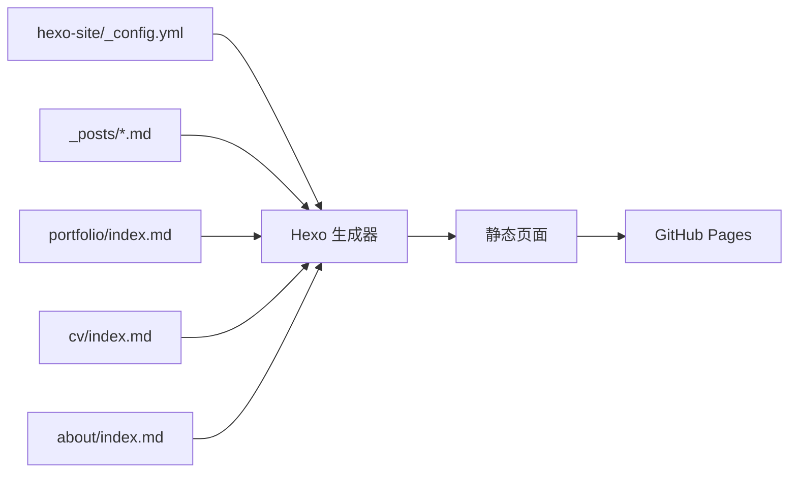

# 学术功能模块

<cite>
**本文档引用的文件**
- [_config.yml](file://hexo-site/_config.yml)
- [source/index.md](file://hexo-site/source/index.md)
- [source/about/index.md](file://hexo-site/source/about/index.md)
- [source/portfolio/index.md](file://hexo-site/source/portfolio/index.md)
- [source/cv/index.md](file://hexo-site/source/cv/index.md)
- [source/_posts/2025-03-11-useful-website.md](file://hexo-site/source/_posts/2025-03-11-useful-website.md)
- [source/_posts/2025-03-12-optimize.md](file://hexo-site/source/_posts/2025-03-12-optimize.md)
</cite>

## 更新摘要
**变更内容**
- 移除了复杂的学术功能模块，包括论文引用管理、会议展示、TalkMap 地图可视化等
- 简化为基本的博客和作品集功能
- 保留了简历页面的基本结构
- 更新了项目结构和组件分析以反映新的简化架构

## 目录
1. [简介](#简介)
2. [项目结构](#项目结构)
3. [核心组件](#核心组件)
4. [架构总览](#架构总览)
5. [详细组件分析](#详细组件分析)
6. [依赖分析](#依赖分析)
7. [性能考虑](#性能考虑)
8. [故障排查指南](#故障排查指南)
9. [结论](#结论)
10. [附录](#附录)

## 简介
本技术文档面向简化的学术功能模块，围绕以下目标展开：基于 Hexo + Butterfly 主题的博客系统、作品集展示、简历页面以及基础的静态页面管理。文档以当前仓库的简化实现为基础，提供可操作的流程说明、最佳实践与可视化图示，帮助维护者与使用者高效构建与维护个人网站。

**更新** 本模块已从复杂的学术功能（论文引用管理、会议展示、地图可视化等）简化为基本的博客和作品集功能，专注于内容创作和作品展示。

## 项目结构
简化的学术功能模块由 Hexo 配置、博客文章、作品集页面、简历页面和基础页面组成。下图展示了与简化功能相关的核心文件与目录之间的关系：

**图表来源**
- [hexo-site/_config.yml](file://hexo-site/_config.yml)
- [hexo-site/source/index.md](file://hexo-site/source/index.md)
- [hexo-site/source/about/index.md](file://hexo-site/source/about/index.md)
- [hexo-site/source/portfolio/index.md](file://hexo-site/source/portfolio/index.md)
- [hexo-site/source/cv/index.md](file://hexo-site/source/cv/index.md)
- [hexo-site/source/_posts/2025-03-11-useful-website.md](file://hexo-site/source/_posts/2025-03-11-useful-website.md)

**章节来源**
- [hexo-site/_config.yml](file://hexo-site/_config.yml)
- [hexo-site/source/index.md](file://hexo-site/source/index.md)

## 核心组件
- **博客系统**
  - 文章配置：[hexo-site/_config.yml](file://hexo-site/_config.yml)
  - 文章内容：[source/_posts/2025-03-11-useful-website.md](file://hexo-site/source/_posts/2025-03-11-useful-website.md)、[source/_posts/2025-03-12-optimize.md](file://hexo-site/source/_posts/2025-03-12-optimize.md)
  - 首页展示：[source/index.md](file://hexo-site/source/index.md)
- **作品集展示**
  - 作品集页面：[source/portfolio/index.md](file://hexo-site/source/portfolio/index.md)
  - 响应式网格布局
- **简历页面**
  - 简历内容：[source/cv/index.md](file://hexo-site/source/cv/index.md)
  - 教育背景、工作经历、技能展示
- **关于页面**
  - 站点介绍：[source/about/index.md](file://hexo-site/source/about/index.md)
  - 快速导航链接

**章节来源**
- [hexo-site/_config.yml](file://hexo-site/_config.yml)
- [hexo-site/source/_posts/2025-03-11-useful-website.md](file://hexo-site/source/_posts/2025-03-11-useful-website.md)
- [hexo-site/source/_posts/2025-03-12-optimize.md](file://hexo-site/source/_posts/2025-03-12-optimize.md)
- [hexo-site/source/portfolio/index.md](file://hexo-site/source/portfolio/index.md)
- [hexo-site/source/cv/index.md](file://hexo-site/source/cv/index.md)
- [hexo-site/source/about/index.md](file://hexo-site/source/about/index.md)

## 架构总览
下图展示了从内容输入到页面渲染的整体流程，涵盖博客、作品集和简历三个核心功能：

**图表来源**
- [hexo-site/_config.yml](file://hexo-site/_config.yml)
- [hexo-site/source/_posts/2025-03-11-useful-website.md](file://hexo-site/source/_posts/2025-03-11-useful-website.md)
- [hexo-site/source/portfolio/index.md](file://hexo-site/source/portfolio/index.md)
- [hexo-site/source/cv/index.md](file://hexo-site/source/cv/index.md)
- [hexo-site/source/about/index.md](file://hexo-site/source/about/index.md)
- [hexo-site/source/index.md](file://hexo-site/source/index.md)

## 详细组件分析

### 博客系统（文章管理与展示）
- **功能概述**
  - 基于 Hexo 的静态博客系统，支持 Markdown 格式的文章编写
  - 自动化文章生成和分类管理
  - 支持标签、目录、摘要等功能
- **关键流程**
  - 文章创建：在 `_posts` 目录下创建 `YYYY-MM-DD-title.md` 格式的文件
  - Front Matter 配置：设置标题、分类、标签、摘要等元数据
  - 自动渲染：Hexo 根据配置自动生成静态页面
- **使用步骤**
  - 在 `_posts` 目录创建新文章
  - 配置文章的 Front Matter 元数据
  - 运行 Hexo 生成命令
  - 部署到 GitHub Pages
- **最佳实践**
  - 使用语义化标题和清晰的分类
  - 合理使用标签便于内容组织
  - 添加文章摘要提升用户体验

**图表来源**
- [hexo-site/_config.yml](file://hexo-site/_config.yml)
- [hexo-site/source/_posts/2025-03-11-useful-website.md](file://hexo-site/source/_posts/2025-03-11-useful-website.md)

**章节来源**
- [hexo-site/_config.yml](file://hexo-site/_config.yml)
- [hexo-site/source/_posts/2025-03-11-useful-website.md](file://hexo-site/source/_posts/2025-03-11-useful-website.md)
- [hexo-site/source/_posts/2025-03-12-optimize.md](file://hexo-site/source/_posts/2025-03-12-optimize.md)

### 作品集展示系统
- **功能概述**
  - 专门展示个人作品的页面系统
  - 响应式网格布局，适配不同设备
  - 支持图片展示和详细描述
- **实现机制**
  - 使用 CSS Grid 实现自适应布局
  - 悬停效果增强用户体验
  - 支持 Markdown 和 HTML 混合内容
- **定制选项**
  - 可调整网格列数和间距
  - 支持自定义样式类
  - 响应式断点可配置
- **注意事项**
  - 图片尺寸建议保持一致
  - 描述内容简洁明了
  - 链接使用相对路径

**图表来源**
- [hexo-site/source/portfolio/index.md](file://hexo-site/source/portfolio/index.md)

**章节来源**
- [hexo-site/source/portfolio/index.md](file://hexo-site/source/portfolio/index.md)

### 简历页面系统
- **功能概述**
  - 展示个人教育背景、工作经历、技能等信息
  - 结构化的内容展示，便于访客快速了解个人信息
- **内容结构**
  - 教育背景：学位、学校、时间
  - 工作经历：职位、公司、职责
  - 技能列表：主技能和子技能
  - 论文和报告：学术成果展示
- **样式特点**
  - 使用语义化标题和边框
  - 统一的字体大小和间距
  - 列表样式便于阅读

**章节来源**
- [hexo-site/source/cv/index.md](file://hexo-site/source/cv/index.md)

### 关于页面系统
- **功能概述**
  - 站点介绍和个人说明页面
  - 提供快速导航和联系方式
- **主要内容**
  - 站点功能介绍（Hexo + Butterfly 主题）
  - 支持的功能列表（数学公式、图表、代码高亮等）
  - 快速导航链接到各个页面
  - 联系方式和致谢信息

**章节来源**
- [hexo-site/source/about/index.md](file://hexo-site/source/about/index.md)

## 依赖分析
- **组件耦合**
  - 所有页面都依赖 Hexo 配置文件
  - 博客文章依赖 Front Matter 元数据
  - 作品集页面依赖 CSS 样式文件
- **外部依赖**
  - Hexo 作为静态站点生成器
  - Butterfly 主题提供页面样式
  - GitHub Pages 用于托管和部署
- **循环依赖**
  - 未发现循环依赖，数据流单向从内容到页面

**图表来源**
- [hexo-site/_config.yml](file://hexo-site/_config.yml)
- [hexo-site/source/_posts/2025-03-11-useful-website.md](file://hexo-site/source/_posts/2025-03-11-useful-website.md)
- [hexo-site/source/portfolio/index.md](file://hexo-site/source/portfolio/index.md)
- [hexo-site/source/cv/index.md](file://hexo-site/source/cv/index.md)
- [hexo-site/source/about/index.md](file://hexo-site/source/about/index.md)

## 性能考虑
- **渲染性能**
  - 使用 Hexo 的静态生成，避免服务器端计算
  - Butterfly 主题优化的 CSS 和 JavaScript
  - 图片懒加载和响应式适配
- **内容规模**
  - 博客文章数量适中，不影响加载速度
  - 作品集图片建议压缩优化
- **部署性能**
  - GitHub Pages CDN 加速全球访问
  - 自动化部署流程减少人工干预

## 故障排查指南
- **文章不显示**
  - 检查文件命名格式是否为 `YYYY-MM-DD-title.md`
  - 确认 Front Matter 元数据完整
  - 验证分类和标签设置正确
- **页面样式异常**
  - 检查 CSS 文件是否正确加载
  - 验证 Butterfly 主题配置
  - 清除浏览器缓存重新加载
- **部署失败**
  - 检查 GitHub Pages 配置
  - 验证域名设置和分支配置
  - 查看 GitHub Actions 日志

**章节来源**
- [hexo-site/_config.yml](file://hexo-site/_config.yml)
- [hexo-site/source/portfolio/index.md](file://hexo-site/source/portfolio/index.md)

## 结论
本模块通过简化的架构实现了基本的博客和作品集功能，基于 Hexo + Butterfly 主题提供了良好的开发体验和用户体验。系统结构清晰，易于维护和扩展。建议继续完善内容质量和页面优化，结合 GitHub Pages 实现自动化部署。

## 附录
- **实际内容示例**
  - 博客文章示例：[source/_posts/2025-03-11-useful-website.md](file://hexo-site/source/_posts/2025-03-11-useful-website.md)
  - 性能优化文章：[source/_posts/2025-03-12-optimize.md](file://hexo-site/source/_posts/2025-03-12-optimize.md)
  - 作品集示例：[source/portfolio/index.md](file://hexo-site/source/portfolio/index.md)
  - 简历示例：[source/cv/index.md](file://hexo-site/source/cv/index.md)
- **配置文件**
  - Hexo 配置：[hexo-site/_config.yml](file://hexo-site/_config.yml)
  - 首页配置：[source/index.md](file://hexo-site/source/index.md)
  - 关于页面：[source/about/index.md](file://hexo-site/source/about/index.md)