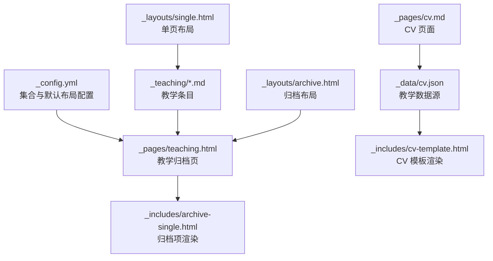
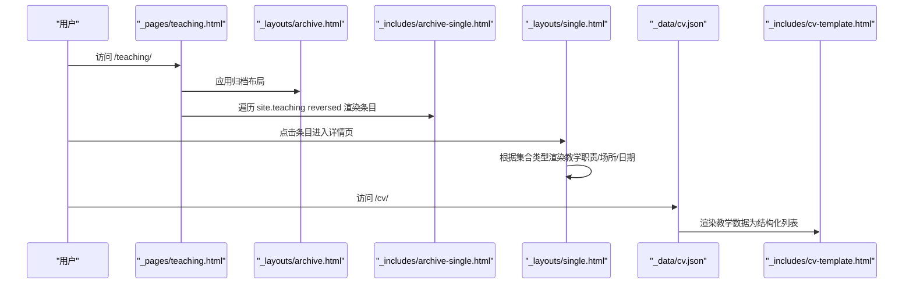
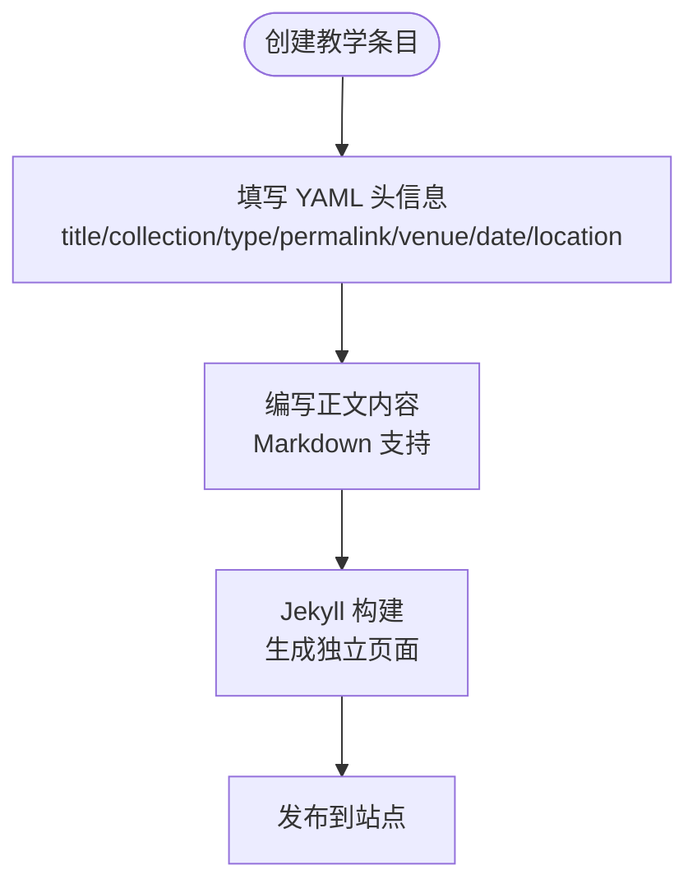
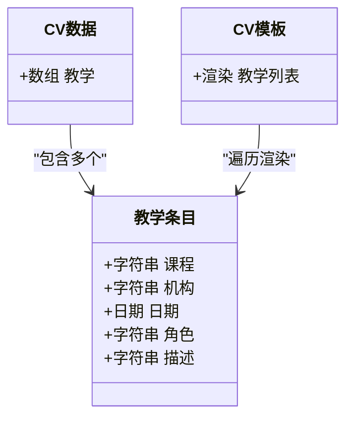
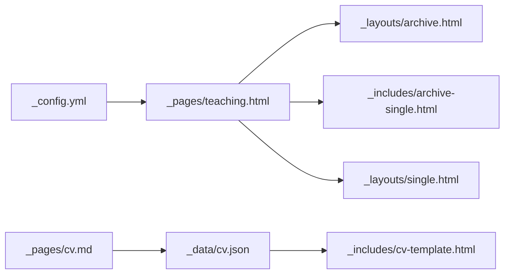

# 教学材料管理

<cite>
**本文引用的文件**
- [teaching.html](file://_pages/teaching.html)
- [2014-spring-teaching-1.md](file://_teaching/2014-spring-teaching-1.md)
- [_config.yml](file://_config.yml)
- [archive-single.html](file://_includes/archive-single.html)
- [archive.html](file://_layouts/archive.html)
- [_data/cv.json](file://_data/cv.json)
- [cv-template.html](file://_includes/cv-template.html)
- [cv.md](file://_pages/cv.md)
- [2015-spring-teaching-2.md](file://_teaching/2015-spring-teaching-2.md)
- [single.html](file://_layouts/single.html)
- [README.md](file://README.md)
</cite>

## 目录
1. [简介](#简介)
2. [项目结构](#项目结构)
3. [核心组件](#核心组件)
4. [架构总览](#架构总览)
5. [详细组件分析](#详细组件分析)
6. [依赖关系分析](#依赖关系分析)
7. [性能考量](#性能考量)
8. [故障排查指南](#故障排查指南)
9. [结论](#结论)
10. [附录](#附录)

## 简介
本技术文档围绕“教学材料管理”主题，系统梳理了基于 Jekyll 的教学条目数据模型、页面展示逻辑与内容组织规范。重点覆盖以下方面：
- 教学条目的数据结构与字段组织（课程名称、学期/时间、教学职责、地点等）
- 教学页面的展示逻辑（时间线排序、课程分类、内容渲染机制）
- 教学材料的 Markdown 规范（标题层级、列表结构、链接格式）
- 教学经验在 CV 页面中的呈现方式（课程列表、教学职责、描述）
- 维护与更新流程（内容审核、版本管理、发布策略）
- 实际教学数据示例与最佳实践建议

## 项目结构
教学相关内容主要分布在以下位置：
- 教学集合：_teaching 目录下的 Markdown 条目
- 教学页面：_pages/teaching.html
- 配置：_config.yml 中定义教学集合与默认布局
- 展示模板：_layouts/archive.html、_includes/archive-single.html、_layouts/single.html
- CV 页面与数据：_pages/cv.md、_data/cv.json、_includes/cv-template.html
- 示例教学条目：_teaching 下的两个示例文件



图表来源
- [_config.yml](file://_config.yml)
- [_pages/teaching.html](file://_pages/teaching.html)
- [_includes/archive-single.html](file://_includes/archive-single.html)
- [_layouts/archive.html](file://_layouts/archive.html)
- [_layouts/single.html](file://_layouts/single.html)
- [_pages/cv.md](file://_pages/cv.md)
- [_data/cv.json](file://_data/cv.json)
- [_includes/cv-template.html](file://_includes/cv-template.html)

章节来源
- [_pages/teaching.html](file://_pages/teaching.html)
- [_config.yml](file://_config.yml)
- [_layouts/archive.html](file://_layouts/archive.html)
- [_layouts/single.html](file://_layouts/single.html)
- [_includes/archive-single.html](file://_includes/archive-single.html)
- [_pages/cv.md](file://_pages/cv.md)
- [_data/cv.json](file://_data/cv.json)
- [_includes/cv-template.html](file://_includes/cv-template.html)

## 核心组件
- 教学集合与默认布局
  - 在配置中声明教学集合并设置输出规则与永久链接格式；为教学集合指定默认布局为 single，并开启作者资料、分享与评论。
- 教学归档页
  - 使用 archive 布局，遍历 site.teaching 并按倒序渲染，每个条目通过 archive-single 模板进行展示。
- 教学条目
  - 采用 YAML 头信息定义标题、集合、类型、永久链接、场所、日期、地点等元数据；正文支持 Markdown 内容。
- 单页布局
  - 在单个教学条目页面中，根据集合类型显示教学职责、场所与年份等信息。
- CV 页面与数据
  - 通过 _data/cv.json 提供教学数据，_includes/cv-template.html 渲染为结构化的 CV 页面。

章节来源
- [_config.yml](file://_config.yml)
- [_pages/teaching.html](file://_pages/teaching.html)
- [_layouts/archive.html](file://_layouts/archive.html)
- [_layouts/single.html](file://_layouts/single.html)
- [_includes/archive-single.html](file://_includes/archive-single.html)
- [_pages/cv.md](file://_pages/cv.md)
- [_data/cv.json](file://_data/cv.json)
- [_includes/cv-template.html](file://_includes/cv-template.html)

## 架构总览
下图展示了从数据到页面的端到端流程：集合配置 → 归档页遍历 → 模板渲染 → 单页详情 → CV 数据驱动渲染。



图表来源
- [_pages/teaching.html](file://_pages/teaching.html)
- [_layouts/archive.html](file://_layouts/archive.html)
- [_includes/archive-single.html](file://_includes/archive-single.html)
- [_layouts/single.html](file://_layouts/single.html)
- [_pages/cv.md](file://_pages/cv.md)
- [_data/cv.json](file://_data/cv.json)
- [_includes/cv-template.html](file://_includes/cv-template.html)

## 详细组件分析

### 教学集合与数据模型
- 集合声明
  - 在配置中启用教学集合，设置输出与永久链接格式，使条目可独立生成页面。
- 元数据字段
  - 标题、集合、类型（如课程或工作坊）、永久链接、场所、日期、地点等。
- 正文内容
  - 支持 Markdown，可用于课程描述、讲义链接、作业说明等。



图表来源
- [_config.yml](file://_config.yml)
- [_teaching/2014-spring-teaching-1.md](file://_teaching/2014-spring-teaching-1.md)
- [_teaching/2015-spring-teaching-2.md](file://_teaching/2015-spring-teaching-2.md)

章节来源
- [_config.yml](file://_config.yml)
- [_teaching/2014-spring-teaching-1.md](file://_teaching/2014-spring-teaching-1.md)
- [_teaching/2015-spring-teaching-2.md](file://_teaching/2015-spring-teaching-2.md)

### 教学页面展示逻辑
- 归档页排序
  - 教学归档页对 site.teaching 进行倒序遍历，确保较新的条目优先显示。
- 归档项渲染
  - archive-single 模板根据集合类型输出教学职责、场所与年份；支持摘要与阅读时长等通用信息。
- 单页详情
  - single 布局在教学条目详情页中，以更丰富的元信息展示教学职责、场所与年份。

```mermaid
sequenceDiagram
participant Page as "teaching.html"
participant Loop as "for post in site.teaching reversed"
participant Item as "archive-single.html"
participant Detail as "single.html"
Page->>Loop : 遍历教学集合
Loop->>Item : 渲染归档项
Item-->>Page : 输出条目摘要/元信息
Note over Page,Detail : 用户点击条目进入详情页
Detail-->>Page : 输出教学职责/场所/年份
```

图表来源
- [_pages/teaching.html](file://_pages/teaching.html)
- [_includes/archive-single.html](file://_includes/archive-single.html)
- [_layouts/single.html](file://_layouts/single.html)

章节来源
- [_pages/teaching.html](file://_pages/teaching.html)
- [_includes/archive-single.html](file://_includes/archive-single.html)
- [_layouts/single.html](file://_layouts/single.html)

### 教学经验在 CV 页面中的呈现
- 数据来源
  - _data/cv.json 中的 teaching 数组包含课程、机构、日期、角色与描述等字段。
- 模板渲染
  - _includes/cv-template.html 遍历 cv.teaching，按课程名与年份分组，输出机构、角色与描述。
- 页面集成
  - _pages/cv.md 中通过循环 site.teaching 调用 archive-single-cv.html 渲染教学条目。



图表来源
- [_data/cv.json](file://_data/cv.json)
- [_includes/cv-template.html](file://_includes/cv-template.html)
- [_pages/cv.md](file://_pages/cv.md)

章节来源
- [_data/cv.json](file://_data/cv.json)
- [_includes/cv-template.html](file://_includes/cv-template.html)
- [_pages/cv.md](file://_pages/cv.md)

### 教学材料的 Markdown 格式规范
- 标题层级
  - 使用 H1-H3 表达主标题、子标题与细项标题，保持层级清晰。
- 列表结构
  - 使用有序/无序列表组织课程要点、教学职责与活动安排。
- 链接格式
  - 使用标准 Markdown 链接语法插入外部资源或讲义下载地址。
- 示例参考
  - 教学条目正文支持 Markdown，可参考示例文件的标题与段落组织方式。

章节来源
- [_teaching/2014-spring-teaching-1.md](file://_teaching/2014-spring-teaching-1.md)
- [_teaching/2015-spring-teaching-2.md](file://_teaching/2015-spring-teaching-2.md)

### 维护与更新流程
- 内容审核
  - 在提交前检查 YAML 头信息完整性与正文内容准确性。
- 版本管理
  - 使用 Git 管理教学条目变更，建议按学期/课程建立分支或标签以便追踪。
- 发布策略
  - 本地预览通过 Jekyll 服务验证页面渲染与链接有效性；通过 GitHub Pages 自动构建发布。
- 参考
  - 项目 README 提供本地运行与 Docker 使用说明，便于在不同环境下验证。

章节来源
- [README.md](file://README.md)
- [_config.yml](file://_config.yml)

## 依赖关系分析
- 配置层
  - _config.yml 定义教学集合、输出与永久链接，以及教学集合的默认布局与功能开关。
- 页面层
  - _pages/teaching.html 依赖归档布局与归档项模板；单页详情依赖 single 布局。
- 数据层
  - CV 页面通过 _data/cv.json 提供结构化数据，_includes/cv-template.html 负责渲染。
- 模板层
  - _includes/archive-single.html 与 _layouts/archive.html、_layouts/single.html 协作完成教学条目的统一渲染。



图表来源
- [_config.yml](file://_config.yml)
- [_pages/teaching.html](file://_pages/teaching.html)
- [_layouts/archive.html](file://_layouts/archive.html)
- [_includes/archive-single.html](file://_includes/archive-single.html)
- [_layouts/single.html](file://_layouts/single.html)
- [_pages/cv.md](file://_pages/cv.md)
- [_data/cv.json](file://_data/cv.json)
- [_includes/cv-template.html](file://_includes/cv-template.html)

章节来源
- [_config.yml](file://_config.yml)
- [_pages/teaching.html](file://_pages/teaching.html)
- [_layouts/archive.html](file://_layouts/archive.html)
- [_includes/archive-single.html](file://_includes/archive-single.html)
- [_layouts/single.html](file://_layouts/single.html)
- [_pages/cv.md](file://_pages/cv.md)
- [_data/cv.json](file://_data/cv.json)
- [_includes/cv-template.html](file://_includes/cv-template.html)

## 性能考量
- 构建优化
  - 合理使用归档页与单页布局，避免重复渲染相同内容。
- 资源加载
  - 将大文件上传至 files/ 目录并通过链接引用，减少页面体积。
- 本地预览
  - 使用本地 Jekyll 服务快速验证页面渲染与链接有效性，降低线上修复成本。

## 故障排查指南
- 页面未显示最新条目
  - 检查教学集合是否正确声明与输出；确认归档页遍历顺序是否为倒序。
- 元信息缺失或显示异常
  - 核对条目 YAML 头信息字段是否齐全；确认 single 布局中针对教学集合的条件渲染逻辑。
- CV 页面不更新
  - 确认 _data/cv.json 中教学数据已同步；检查 _includes/cv-template.html 是否正确遍历数据。
- 本地无法启动
  - 按 README 提示安装依赖并执行本地服务命令；必要时使用 Docker 或 DevContainer。

章节来源
- [_pages/teaching.html](file://_pages/teaching.html)
- [_layouts/single.html](file://_layouts/single.html)
- [_includes/cv-template.html](file://_includes/cv-template.html)
- [README.md](file://README.md)

## 结论
本项目通过 Jekyll 集合与模板体系，实现了教学材料的结构化管理与多场景展示。遵循本文的数据模型与渲染规范，可确保教学条目在归档页、详情页与 CV 页面中一致、清晰地呈现。建议在维护过程中坚持内容审核与版本管理流程，结合本地预览与自动化发布，持续提升内容质量与用户体验。

## 附录
- 实际教学数据示例
  - 参考示例条目文件，了解 YAML 头信息与正文 Markdown 的组织方式。
- 最佳实践建议
  - 字段命名统一、语义明确；标题层级清晰；列表与链接规范；定期备份与版本控制；利用本地服务进行预检。

章节来源
- [_teaching/2014-spring-teaching-1.md](file://_teaching/2014-spring-teaching-1.md)
- [_teaching/2015-spring-teaching-2.md](file://_teaching/2015-spring-teaching-2.md)
- [_pages/cv.md](file://_pages/cv.md)
- [_data/cv.json](file://_data/cv.json)