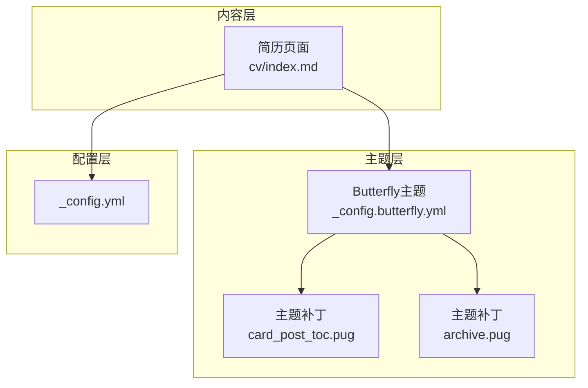
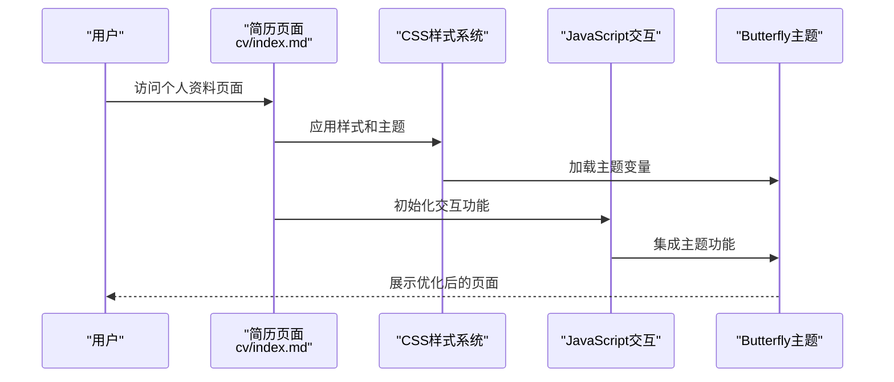
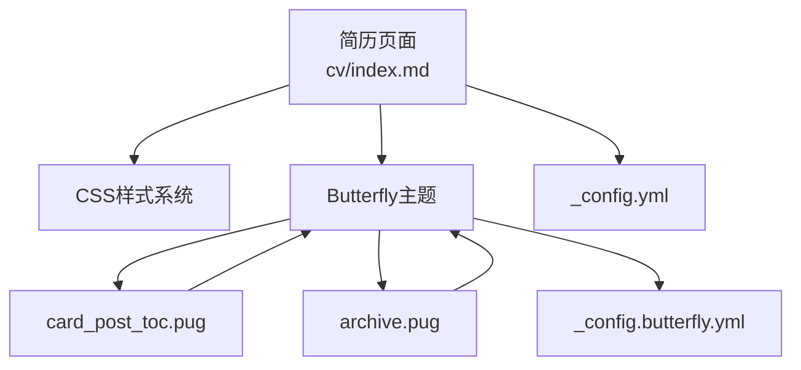

# 简历生成功能

<cite>
**本文引用的文件**
- [index.md](file://hexo-site/source/cv/index.md)
- [_config.yml](file://hexo-site/_config.yml)
- [_config.butterfly.yml](file://hexo-site/_config.butterfly.yml)
- [card_post_toc.pug](file://hexo-site/themes/_patches/layout/includes/widget/card_post_toc.pug)
- [archive.pug](file://hexo-site/themes/_patches/layout/archive.pug)
</cite>

## 更新摘要
**所做更改**
- 完全重构CV简历页面为专业的个人资料页面
- 新增复杂的CSS样式系统和主题变量支持
- 实现响应式布局和移动端适配
- 集成Butterfly主题的高级功能
- 添加JavaScript交互增强功能
- 优化TOC目录布局和导航体验

## 目录
1. [简介](#简介)
2. [项目结构](#项目结构)
3. [核心组件](#核心组件)
4. [架构总览](#架构总览)
5. [详细组件分析](#详细组件分析)
6. [依赖关系分析](#依赖关系分析)
7. [性能考虑](#性能考虑)
8. [故障排查指南](#故障排查指南)
9. [结论](#结论)
10. [附录](#附录)

## 简介
本文档详细介绍重构后的CV简历页面功能，这是一个从简单Markdown文档升级为专业的个人资料页面的完整实现。新系统采用复杂的CSS样式系统、响应式布局设计和主题变量支持，提供卓越的用户体验和视觉效果。

**更新** 系统已完全重构为专业的个人资料页面，包含以下重大改进：
- 专业的CSS样式系统和主题变量支持
- 响应式布局和移动端适配
- 集成Butterfly主题的高级功能
- JavaScript交互增强
- 优化的TOC目录布局

## 项目结构
重构后的简历系统采用模块化架构，包含以下核心组件：

- **简历页面**：hexo-site/source/cv/index.md（专业的个人资料页面）
- **主题配置**：hexo-site/_config.butterfly.yml（Butterfly主题配置）
- **站点配置**：hexo-site/_config.yml（Hexo站点配置）
- **主题补丁**：hexo-site/themes/_patches/（主题定制化修改）

**图表来源**
- [index.md:1-385](file://hexo-site/source/cv/index.md#L1-L385)
- [_config.butterfly.yml:1-780](file://hexo-site/_config.butterfly.yml#L1-L780)
- [_config.yml:1-149](file://hexo-site/_config.yml#L1-L149)
- [card_post_toc.pug:1-16](file://hexo-site/themes/_patches/layout/includes/widget/card_post_toc.pug#L1-L16)
- [archive.pug:1-21](file://hexo-site/themes/_patches/layout/archive.pug#L1-L21)

## 核心组件
重构后的简历系统包含以下核心组件：

### 1. 专业的CSS样式系统
- **主题变量支持**：使用CSS自定义属性实现主题颜色和样式的统一管理
- **响应式设计**：针对不同屏幕尺寸的自适应布局
- **现代化UI组件**：时间线、项目卡片、技能标签等专业组件
- **动画效果**：平滑的过渡动画和交互反馈

### 2. 个人资料页面
- **基本信息表格**：结构化的个人信息展示
- **教育背景时间线**：清晰的教育经历展示
- **工作经历详情**：详细的工作职责和成就描述
- **项目经验展示**：项目卡片布局，突出技术栈和成果
- **技能能力分类**：多维度的技能展示

### 3. 主题集成
- **Butterfly主题**：现代化的UI设计和交互体验
- **TOC目录系统**：右侧悬浮目录和滚动同步
- **导航增强**：动态导航和页面跳转
- **暗色模式支持**：自动主题切换

**章节来源**
- [index.md:21-279](file://hexo-site/source/cv/index.md#L21-L279)
- [_config.butterfly.yml:10-45](file://hexo-site/_config.butterfly.yml#L10-L45)
- [_config.yml:119-141](file://hexo-site/_config.yml#L119-L141)

## 架构总览
重构后的简历生成系统采用三层架构设计：

**图表来源**
- [index.md:281-385](file://hexo-site/source/cv/index.md#L281-L385)
- [_config.butterfly.yml:374-767](file://hexo-site/_config.butterfly.yml#L374-L767)

## 详细组件分析

### 组件一：CSS样式系统架构
重构后的CSS系统采用模块化设计，包含以下关键特性：

#### 主题变量系统
- **颜色变量**：`--text-highlight-color`, `--font-color`, `--card-bg`
- **字体变量**：统一的字体大小和行高设置
- **间距变量**：一致的边距和内边距规范

#### 响应式设计
- **移动端优先**：针对小屏幕设备的优化
- **弹性布局**：使用Flexbox实现灵活的布局
- **媒体查询**：针对不同断点的样式调整

#### UI组件系统
- **时间线组件**：`.cv-timeline` 实现教育和工作经历的时间轴
- **项目卡片**：`.cv-projects` 和 `.cv-project` 展示项目经验
- **技能标签**：`.cv-bullet` 和 `code` 元素实现技能分类
- **信息表格**：`.cv-info-table` 结构化展示基本信息

**章节来源**
- [index.md:21-279](file://hexo-site/source/cv/index.md#L21-L279)

### 组件二：个人资料页面结构
重构后的简历页面采用专业的HTML结构：

#### 基本信息区域
- **表格布局**：使用HTML表格展示姓名、性别、联系方式
- **链接处理**：邮箱和网站链接的正确格式化
- **隐私保护**：电话号码的模糊处理

#### 教育背景时间线
- **时间轴设计**：使用伪元素创建垂直时间线
- **奖项展示**：`.cv-awards` 容器展示学术荣誉
- **活动经历**：详细的校园活动参与描述

#### 工作经历详情
- **头部信息**：职位、公司、时间的组合展示
- **职责描述**：使用语义化标题展示工作内容
- **成就量化**：具体的性能指标和成果展示

#### 项目经验展示
- **网格布局**：响应式的项目卡片布局
- **技术栈标识**：使用代码块展示核心技术
- **功能描述**：清晰的项目功能和实现细节

**章节来源**
- [index.md:281-385](file://hexo-site/source/cv/index.md#L281-L385)

### 组件三：主题集成与增强
重构后的系统深度集成了Butterfly主题：

#### TOC目录系统
- **右侧悬浮**：独立的右侧目录容器
- **滚动同步**：与页面内容的实时同步
- **响应式布局**：桌面端和移动端的不同显示

#### JavaScript交互
- **目录移动**：动态将TOC从左侧移动到右侧
- **滚动增强**：右侧按钮的显示和隐藏控制
- **键盘支持**：支持键盘操作的可访问性

#### 主题定制
- **导航增强**：自定义导航菜单和样式
- **侧边栏优化**：作者信息和社交链接的美化
- **搜索集成**：本地搜索功能的配置

**章节来源**
- [_config.butterfly.yml:374-767](file://hexo-site/_config.butterfly.yml#L374-L767)
- [card_post_toc.pug:1-16](file://hexo-site/themes/_patches/layout/includes/widget/card_post_toc.pug#L1-L16)
- [archive.pug:1-21](file://hexo-site/themes/_patches/layout/archive.pug#L1-L21)

## 依赖关系分析
重构后的系统具有清晰的依赖层次：

**图表来源**
- [index.md:1-8](file://hexo-site/source/cv/index.md#L1-L8)
- [_config.butterfly.yml:1-4](file://hexo-site/_config.butterfly.yml#L1-L4)
- [_config.yml:119-119](file://hexo-site/_config.yml#L119-L119)

## 性能考虑
重构后的系统在性能方面进行了多项优化：

### 样式优化
- **CSS变量缓存**：减少重复计算和样式解析
- **媒体查询优化**：避免过度的重排和重绘
- **选择器优化**：使用高效的CSS选择器

### JavaScript性能
- **事件委托**：减少事件监听器的数量
- **懒加载**：延迟加载非关键资源
- **内存管理**：及时清理DOM引用和事件监听器

### 主题集成优化
- **资源合并**：减少HTTP请求次数
- **缓存策略**：利用浏览器缓存机制
- **CDN支持**：外部资源的CDN加速

## 故障排查指南
针对重构后的系统，提供以下故障排查指导：

### 样式问题
- **主题变量失效**
  - 检查CSS变量的定义和使用
  - 验证主题配置文件的正确性
  - 确认浏览器对CSS变量的支持

- **响应式布局异常**
  - 检查媒体查询的断点设置
  - 验证容器的宽度和间距
  - 测试不同设备的显示效果

### JavaScript功能问题
- **TOC目录不显示**
  - 检查JavaScript代码的执行
  - 验证DOM元素的存在性
  - 确认事件监听器的绑定

- **导航功能异常**
  - 检查导航菜单的配置
  - 验证路由和链接的正确性
  - 测试页面间的跳转功能

### 主题集成问题
- **主题样式冲突**
  - 检查自定义样式的优先级
  - 验证主题补丁的正确应用
  - 确认CSS文件的加载顺序

- **配置文件错误**
  - 检查YAML格式的正确性
  - 验证配置项的语法
  - 确认路径和文件名的准确性

## 结论
重构后的CV简历页面系统代表了个人资料展示的技术升级，通过专业的CSS样式系统、响应式设计和主题集成，提供了卓越的用户体验。系统不仅保持了内容的易维护性，还大幅提升了视觉效果和交互体验。

**主要成就**：
- 实现了从简单Markdown到专业个人资料页面的完整升级
- 建立了模块化的CSS样式系统和主题变量支持
- 集成了Butterfly主题的高级功能和交互特性
- 提供了完整的响应式布局和移动端适配
- 优化了性能和用户体验

## 附录

### A. CSS样式系统规范
重构后的CSS系统采用以下规范：

#### 主题变量定义
- **颜色系统**：使用`--text-highlight-color`作为主色调
- **字体系统**：统一的字体大小和行高设置
- **间距系统**：基于1.5倍行高的间距规范

#### 响应式断点
- **移动端**：最大宽度600px
- **平板端**：601px - 900px
- **桌面端**：最小宽度901px

#### 组件规范
- **时间线组件**：使用伪元素创建视觉效果
- **卡片组件**：统一的圆角和阴影设计
- **标签组件**：使用代码块实现技能标识

**章节来源**
- [index.md:21-279](file://hexo-site/source/cv/index.md#L21-L279)

### B. 个人资料页面字段规范
重构后的简历页面包含以下字段结构：

#### 基本信息
- **姓名**：用于页面标题和显示
- **性别**：二选一的性别信息
- **联系方式**：电话、邮箱、微信等
- **个人网站**：GitHub、博客等链接

#### 教育背景
- **学校名称**：完整的学校和学院信息
- **专业信息**：学位、专业、GPA等
- **时间范围**：入学和毕业时间
- **荣誉奖项**：学术成就和获奖情况
- **活动经历**：校园活动和社会实践

#### 工作经历
- **公司名称**：完整的企业信息
- **职位信息**：职位、部门、级别
- **工作时间**：入职和离职时间
- **工作职责**：主要职责和成就
- **技术栈**：使用的工具和技术

#### 项目经验
- **项目名称**：项目标题和类型
- **开发时间**：项目开始和结束时间
- **项目描述**：项目目标和功能
- **技术实现**：使用的技术和方法
- **项目成果**：项目的影响力和效果

**章节来源**
- [index.md:281-385](file://hexo-site/source/cv/index.md#L281-L385)

### C. 主题配置最佳实践
重构后的系统遵循以下配置最佳实践：

#### 主题配置
- **导航菜单**：合理设置菜单项和图标
- **社交媒体**：配置正确的链接和样式
- **侧边栏**：优化作者信息和功能卡片
- **搜索功能**：配置本地搜索和CDN

#### 自定义样式
- **CSS变量**：统一的颜色和字体设置
- **响应式设计**：适配不同设备的布局
- **动画效果**：适度的过渡和交互反馈
- **性能优化**：压缩和合并CSS文件

#### JavaScript集成
- **功能模块**：分离的JavaScript功能模块
- **事件处理**：合理的事件绑定和解绑
- **兼容性**：支持现代浏览器和IE11+
- **错误处理**：完善的异常捕获和处理

**章节来源**
- [_config.butterfly.yml:10-45](file://hexo-site/_config.butterfly.yml#L10-L45)
- [_config.yml:119-141](file://hexo-site/_config.yml#L119-L141)