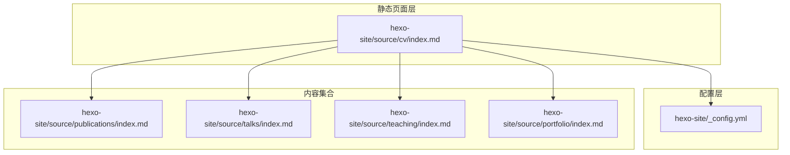
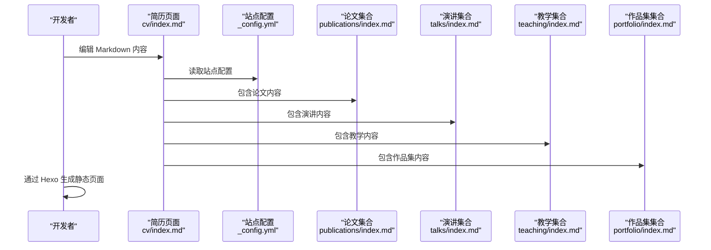
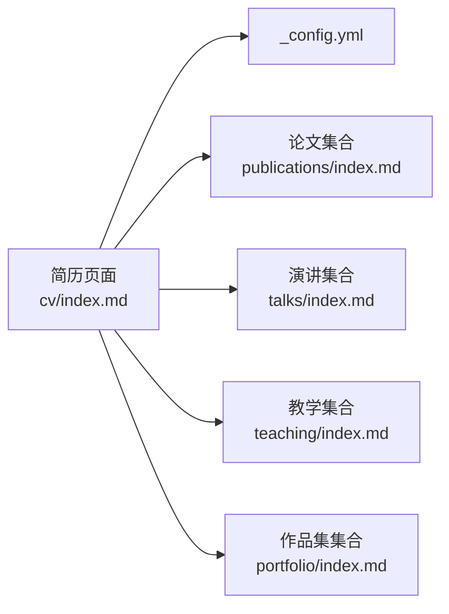

# 简历生成功能

<cite>
**本文引用的文件**
- [index.md](file://hexo-site/source/cv/index.md)
- [_config.yml](file://hexo-site/_config.yml)
- [index.md](file://hexo-site/source/publications/index.md)
- [index.md](file://hexo-site/source/talks/index.md)
- [index.md](file://hexo-site/source/teaching/index.md)
- [index.md](file://hexo-site/source/portfolio/index.md)
</cite>

## 更新摘要
**所做更改**
- 移除了复杂的 Python 脚本转换机制
- 简化为纯静态页面的简历管理系统
- 删除了 cv.json 数据文件和相关转换脚本
- 采用纯 Markdown 维护简历内容
- 移除了 Liquid 模板渲染系统
- 简化了项目结构和依赖关系

## 目录
1. [简介](#简介)
2. [项目结构](#项目结构)
3. [核心组件](#核心组件)
4. [架构总览](#架构总览)
5. [详细组件分析](#详细组件分析)
6. [依赖关系分析](#依赖关系分析)
7. [性能考虑](#性能考虑)
8. [故障排查指南](#故障排查指南)
9. [结论](#结论)
10. [附录](#附录)

## 简介
本文档面向"简历生成功能"的技术实现与使用，重点解释以下内容：
- 简历页面的纯静态页面实现方式
- Markdown 格式的简历内容维护与展示
- 基于 Hexo 的静态站点生成流程
- 简化的项目结构和依赖关系
- 实际数据示例与最佳实践建议

**更新** 本功能已从复杂的 Python 脚本迁移到简单的静态页面实现，移除了所有自动化转换和模板渲染机制。

## 项目结构
简历相关的核心文件分布如下：
- 简历页面：hexo-site/source/cv/index.md（纯 Markdown 简历内容）
- 配置文件：hexo-site/_config.yml（站点配置）
- 内容集合：hexo-site/source/publications/index.md（论文）、hexo-site/source/talks/index.md（演讲）、hexo-site/source/teaching/index.md（教学）、hexo-site/source/portfolio/index.md（作品集）

**图表来源**
- [index.md:1-104](file://hexo-site/source/cv/index.md#L1-L104)
- [_config.yml:1-142](file://hexo-site/_config.yml#L1-L142)
- [index.md:1-58](file://hexo-site/source/publications/index.md#L1-L58)
- [index.md:1-57](file://hexo-site/source/talks/index.md#L1-L57)
- [index.md:1-53](file://hexo-site/source/teaching/index.md#L1-L53)
- [index.md:1-51](file://hexo-site/source/portfolio/index.md#L1-L51)

**章节来源**
- [index.md:1-104](file://hexo-site/source/cv/index.md#L1-L104)
- [_config.yml:1-142](file://hexo-site/_config.yml#L1-L142)

## 核心组件
- 简历页面（hexo-site/source/cv/index.md）：纯 Markdown 格式的简历内容，包含教育背景、工作经历、技能、论文和报告等信息
- 配置文件（hexo-site/_config.yml）：Hexo 站点的基本配置信息
- 内容集合：独立的 Markdown 文件维护论文、演讲、教学和作品集信息

**更新** 移除了所有 Python 脚本、JSON 数据文件和 Liquid 模板系统，采用纯静态页面实现。

**章节来源**
- [index.md:1-104](file://hexo-site/source/cv/index.md#L1-L104)
- [_config.yml:1-142](file://hexo-site/_config.yml#L1-L142)

## 架构总览
简历生成的简化流程如下：

**图表来源**
- [index.md:1-104](file://hexo-site/source/cv/index.md#L1-L104)
- [_config.yml:1-142](file://hexo-site/_config.yml#L1-L142)
- [index.md:1-58](file://hexo-site/source/publications/index.md#L1-L58)
- [index.md:1-57](file://hexo-site/source/talks/index.md#L1-L57)
- [index.md:1-53](file://hexo-site/source/teaching/index.md#L1-L53)
- [index.md:1-51](file://hexo-site/source/portfolio/index.md#L1-L51)

## 详细组件分析

### 组件一：简历页面内容结构
简历页面采用纯 Markdown 格式，包含以下主要部分：
- 个人信息和联系方式
- 教育背景（🎓 Education）
- 工作经历（💼 Work Experience）
- 技能列表（🛠 Skills）
- 论文列表（📚 Publications）
- 演讲列表（🎤 Talks）

页面还包含内联 CSS 样式，用于美化简历的显示效果。

**更新** 移除了所有 JSON 数据结构和模板渲染逻辑，采用纯 Markdown 实现。

**章节来源**
- [index.md:1-104](file://hexo-site/source/cv/index.md#L1-L104)

### 组件二：内容集合管理
各个内容集合采用独立的 Markdown 文件管理：
- 论文集合：按年份和类型组织论文列表
- 演讲集合：按类型和年份组织演讲信息
- 教学集合：按课程和学期组织教学经历
- 作品集集合：网格布局展示作品项目

每个集合都有独立的样式定义和内容组织方式。

**章节来源**
- [index.md:1-58](file://hexo-site/source/publications/index.md#L1-L58)
- [index.md:1-57](file://hexo-site/source/talks/index.md#L1-L57)
- [index.md:1-53](file://hexo-site/source/teaching/index.md#L1-L53)
- [index.md:1-51](file://hexo-site/source/portfolio/index.md#L1-L51)

### 组件三：站点配置
_hexo-site/_config.yml 包含站点的基本配置信息：
- 站点标题、副标题、描述
- 作者信息
- URL 设置和部署配置
- 主题配置（Butterfly）

这些配置影响整个网站的显示效果和功能。

**章节来源**
- [_config.yml:1-142](file://hexo-site/_config.yml#L1-L142)

## 依赖关系分析
- 简历页面依赖站点配置文件
- 简历页面包含多个内容集合的内容
- 内容集合相互独立，无直接依赖关系
- 整个系统依赖 Hexo 静态站点生成器

**图表来源**
- [index.md:1-104](file://hexo-site/source/cv/index.md#L1-L104)
- [_config.yml:1-142](file://hexo-site/_config.yml#L1-L142)
- [index.md:1-58](file://hexo-site/source/publications/index.md#L1-L58)
- [index.md:1-57](file://hexo-site/source/talks/index.md#L1-L57)
- [index.md:1-53](file://hexo-site/source/teaching/index.md#L1-L53)
- [index.md:1-51](file://hexo-site/source/portfolio/index.md#L1-L51)

## 性能考虑
- 纯静态页面无需服务器端处理，加载速度快
- 减少了文件依赖和转换步骤
- 简化了构建流程，提高部署效率
- 内联样式减少了额外的 CSS 文件请求

## 故障排查指南
常见问题与处理建议：
- 页面显示异常
  - 检查 Markdown 语法是否正确
  - 确认标题层级和格式规范
  - 验证内联样式的语法
- 内容不显示
  - 确认文件路径和命名正确
  - 检查 YAML 头部格式
  - 验证 Hexo 配置文件设置
- 样式问题
  - 检查内联 CSS 语法
  - 确认样式类名与内容匹配
  - 验证响应式布局设置

## 结论
本系统通过"纯静态页面 + Hexo 静态生成"的方式，实现了简历内容的简化管理和高效展示。移除了复杂的 Python 脚本和模板渲染机制，采用更直观的 Markdown 维护方式，降低了系统的复杂度和维护成本。

## 附录

### A. 简历页面字段与内容结构
- 基本信息：姓名、联系方式、个人简介
- 教育背景：学位、学校、时间
- 工作经历：职位、公司、时间、职责
- 技能列表：主技能和子技能
- 论文列表：按期刊文章和会议论文分类
- 演讲列表：按会议演讲和教程分类

**更新** 移除了 JSON 数据结构，采用纯 Markdown 格式维护。

### B. 内容集合字段规范
- 论文集合：标题、期刊、年份、摘要、链接
- 演讲集合：标题、会议/机构、日期、地点、类型
- 教学集合：课程名称、机构、时间、描述
- 作品集集合：项目名称、描述、图片、链接

### C. 最佳实践与数据验证建议
- Markdown 格式
  - 使用正确的标题层级（#、##、###）
  - 保持列表格式的一致性
  - 使用合适的符号表示项目（-、•）
- 内容组织
  - 按时间倒序排列工作和教育经历
  - 按重要性排序技能列表
  - 分类整理论文和演讲内容
- 样式维护
  - 保持内联样式的简洁性
  - 确保响应式设计的有效性
  - 测试不同设备上的显示效果