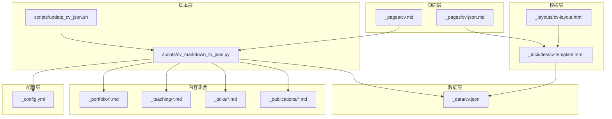
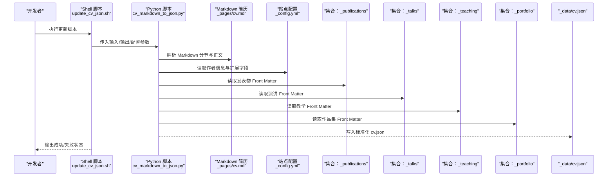
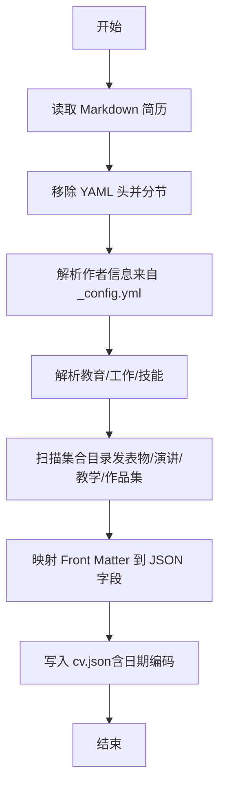
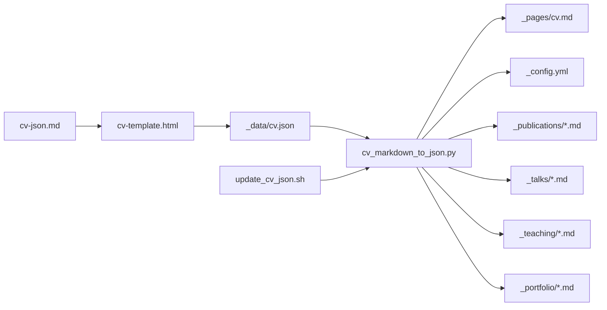

# 简历生成功能

<cite>
**本文引用的文件**
- [cv.json](file://_data/cv.json)
- [cv-template.html](file://_includes/cv-template.html)
- [cv-layout.html](file://_layouts/cv-layout.html)
- [cv.md](file://_pages/cv.md)
- [cv-json.md](file://_pages/cv-json.md)
- [cv_markdown_to_json.py](file://scripts/cv_markdown_to_json.py)
- [update_cv_json.sh](file://scripts/update_cv_json.sh)
- [_config.yml](file://_config.yml)
- [2009-10-01-paper-title-number-1.md](file://_publications/2009-10-01-paper-title-number-1.md)
- [2012-03-01-talk-1.md](file://_talks/2012-03-01-talk-1.md)
- [2014-spring-teaching-1.md](file://_teaching/2014-spring-teaching-1.md)
- [portfolio-1.md](file://_portfolio/portfolio-1.md)
- [_json_cv.scss](file://_sass/layout/_json_cv.scss)
</cite>

## 目录
1. [简介](#简介)
2. [项目结构](#项目结构)
3. [核心组件](#核心组件)
4. [架构总览](#架构总览)
5. [详细组件分析](#详细组件分析)
6. [依赖关系分析](#依赖关系分析)
7. [性能考虑](#性能考虑)
8. [故障排查指南](#故障排查指南)
9. [结论](#结论)
10. [附录](#附录)

## 简介
本文件面向“简历生成功能”的技术实现与使用，重点解释以下内容：
- CV 页面的两种数据来源：Markdown（cv.md）与 JSON（_data/cv.json）
- JSON 数据结构定义、字段映射与格式规范
- 基于 Liquid 模板的简历页面渲染与布局定制
- Python 脚本如何从 Markdown 转换为 JSON，并通过 Shell 脚本驱动自动化更新
- 实际数据示例与最佳实践（含数据验证与错误处理策略）

## 项目结构
简历相关的核心文件分布如下：
- 数据层：_data/cv.json（JSON 格式简历数据）
- 页面层：_pages/cv.md（Markdown 简历页面）、_pages/cv-json.md（JSON 渲染页面）
- 模板层：_includes/cv-template.html（Liquid 模板）、_layouts/cv-layout.html（页面布局）
- 脚本层：scripts/cv_markdown_to_json.py（转换脚本）、scripts/update_cv_json.sh（更新脚本）
- 配置层：_config.yml（站点配置，影响作者信息与集合输出）
- 内容集合：_publications、_talks、_teaching、_portfolio（用于补充 JSON 中的条目）

图表来源
- [cv.md:1-65](file://_pages/cv.md#L1-L65)
- [cv-json.md:1-18](file://_pages/cv-json.md#L1-L18)
- [cv-template.html:1-311](file://_includes/cv-template.html#L1-L311)
- [cv-layout.html:1-40](file://_layouts/cv-layout.html#L1-L40)
- [cv_markdown_to_json.py:1-430](file://scripts/cv_markdown_to_json.py#L1-L430)
- [update_cv_json.sh:1-48](file://scripts/update_cv_json.sh#L1-L48)
- [_config.yml:1-362](file://_config.yml#L1-L362)
- [2009-10-01-paper-title-number-1.md:1-15](file://_publications/2009-10-01-paper-title-number-1.md#L1-L15)
- [2012-03-01-talk-1.md:1-12](file://_talks/2012-03-01-talk-1.md#L1-L12)
- [2014-spring-teaching-1.md:1-20](file://_teaching/2014-spring-teaching-1.md#L1-L20)
- [portfolio-1.md:1-8](file://_portfolio/portfolio-1.md#L1-L8)

章节来源
- [cv.md:1-65](file://_pages/cv.md#L1-L65)
- [cv-json.md:1-18](file://_pages/cv-json.md#L1-L18)
- [cv-markdown-to-json.py:1-430](file://scripts/cv_markdown_to_json.py#L1-L430)
- [update_cv_json.sh:1-48](file://scripts/update_cv_json.sh#L1-L48)

## 核心组件
- Markdown 简历页面（_pages/cv.md）：以传统 Markdown 方式维护教育、工作、技能、发表物、演讲、教学与服务领导力等信息。
- JSON 简历数据（_data/cv.json）：标准化的简历数据结构，供 JSON 渲染页面直接消费。
- JSON 渲染页面（_pages/cv-json.md）：包含 Liquid 模板 cv-template.html，读取 site.data.cv 并渲染。
- Liquid 模板（_includes/cv-template.html）：按 JSON 字段进行循环与条件渲染，支持摘要、教育、工作、技能、发表物、演讲、教学、作品集、语言、兴趣、参考等模块。
- 布局（_layouts/cv-layout.html）：统一的 HTML 结构与样式引入。
- 转换脚本（scripts/cv_markdown_to_json.py）：解析 Markdown 与 Jekyll 配置，抽取作者信息与集合内容，生成 cv.json。
- 更新脚本（scripts/update_cv_json.sh）：定位路径、调用转换脚本、可选构建站点。

章节来源
- [cv.md:1-65](file://_pages/cv.md#L1-L65)
- [cv.json:1-153](file://_data/cv.json#L1-L153)
- [cv-json.md:1-18](file://_pages/cv-json.md#L1-L18)
- [cv-template.html:1-311](file://_includes/cv-template.html#L1-L311)
- [cv-layout.html:1-40](file://_layouts/cv-layout.html#L1-L40)
- [cv_markdown_to_json.py:1-430](file://scripts/cv_markdown_to_json.py#L1-L430)
- [update_cv_json.sh:1-48](file://scripts/update_cv_json.sh#L1-L48)

## 架构总览
简历生成的端到端流程如下：

图表来源
- [update_cv_json.sh:1-48](file://scripts/update_cv_json.sh#L1-L48)
- [cv_markdown_to_json.py:1-430](file://scripts/cv_markdown_to_json.py#L1-L430)
- [cv.md:1-65](file://_pages/cv.md#L1-L65)
- [_config.yml:1-362](file://_config.yml#L1-L362)
- [2009-10-01-paper-title-number-1.md:1-15](file://_publications/2009-10-01-paper-title-number-1.md#L1-L15)
- [2012-03-01-talk-1.md:1-12](file://_talks/2012-03-01-talk-1.md#L1-L12)
- [2014-spring-teaching-1.md:1-20](file://_teaching/2014-spring-teaching-1.md#L1-L20)
- [portfolio-1.md:1-8](file://_portfolio/portfolio-1.md#L1-L8)

## 详细组件分析

### 组件一：cv.json 数据结构与字段映射
cv.json 是简历的标准化数据源，其顶层结构包含 basics、work、education、skills、languages、interests、references、publications、presentations、teaching、portfolio 等键。各字段的含义与典型值如下：
- basics
  - name：字符串，姓名
  - email/phone/website/summary/location/countryCode/region/city/address/postalCode：字符串或对象
  - profiles：数组，元素为 network、username、url
- work：数组，元素包含 company、position、website、startDate、endDate、summary、highlights
- education：数组，元素包含 institution、area、studyType、startDate、endDate、gpa、courses
- skills：数组，元素包含 name、level、keywords
- languages/interests/references：数组，元素字段依用途而定
- publications：数组，元素包含 name、publisher、releaseDate、website、summary
- presentations：数组，元素包含 name、event、date、location、description
- teaching：数组，元素包含 course、institution、date、role、description
- portfolio：数组，元素包含 name、category、date、url、description

字段映射与来源：
- basics.name/email/phone/website/summary/location/countryCode/region/city/address/postalCode/profiles 来源于 _config.yml 的 author 段落与全局配置
- work/education/skills 来源于 _pages/cv.md 的分节解析
- publications/presentations/teaching/portfolio 来源于各自集合的 Front Matter

章节来源
- [cv.json:1-153](file://_data/cv.json#L1-L153)
- [_config.yml:24-84](file://_config.yml#L24-L84)
- [cv.md:1-65](file://_pages/cv.md#L1-L65)

### 组件二：Liquid 模板渲染与页面布局
- cv-template.html 通过 site.data.cv 读取 cv.json，并按模块渲染：
  - 基础信息（姓名、联系方式、位置、社交链接）
  - 摘要（summary）
  - 教育背景（education）
  - 工作经验（work）
  - 技能（skills）
  - 发表物（publications）
  - 演讲（presentations）
  - 教学（teaching）
  - 作品集（portfolio）
  - 语言（languages）
  - 兴趣（interests）
  - 参考（references）
- cv-layout.html 提供统一的 HTML 结构、头部、脚部与样式引入，并加载 cv-template.html 的内容区域。

章节来源
- [cv-template.html:1-311](file://_includes/cv-template.html#L1-L311)
- [cv-layout.html:1-40](file://_layouts/cv-layout.html#L1-L40)

### 组件三：Markdown 到 JSON 的转换流程
转换脚本 cv_markdown_to_json.py 的主要职责：
- 解析 Markdown 简历（去除 YAML 头、识别分节标题、提取正文）
- 解析 Jekyll 配置（_config.yml），提取作者信息与社交资料
- 解析集合内容（_publications、_talks、_teaching、_portfolio）并映射到 JSON 对应字段
- 生成 cv.json（日期序列化、编码器支持）

图表来源
- [cv_markdown_to_json.py:23-53](file://scripts/cv_markdown_to_json.py#L23-L53)
- [cv_markdown_to_json.py:65-159](file://scripts/cv_markdown_to_json.py#L65-L159)
- [cv_markdown_to_json.py:161-250](file://scripts/cv_markdown_to_json.py#L161-L250)
- [cv_markdown_to_json.py:251-366](file://scripts/cv_markdown_to_json.py#L251-L366)
- [cv_markdown_to_json.py:367-413](file://scripts/cv_markdown_to_json.py#L367-L413)

章节来源
- [cv_markdown_to_json.py:1-430](file://scripts/cv_markdown_to_json.py#L1-L430)

### 组件四：自动化更新机制
update_cv_json.sh 的作用：
- 定位仓库根目录
- 校验 Python 脚本与 Markdown 简历存在性
- 调用 cv_markdown_to_json.py 进行转换
- 可选提示是否启动 Jekyll 本地服务预览

章节来源
- [update_cv_json.sh:1-48](file://scripts/update_cv_json.sh#L1-L48)

### 组件五：样式与布局定制
_json_cv.scss 提供 JSON 渲染页面的样式规范，包括：
- 整体容器宽度与字体
- 头部联系信息与社交链接
- 各模块标题与分隔线
- 列表项的标题、副标题、日期、高亮与课程列表
- 技能、语言、兴趣、作品集关键词的网格与标签样式
- 打印样式优化

章节来源
- [_json_cv.scss:1-240](file://_sass/layout/_json_cv.scss#L1-L240)

## 依赖关系分析
- cv-json.md 依赖 cv-template.html 渲染
- cv-template.html 依赖 site.data.cv（即 _data/cv.json）
- cv-markdown-to-json.py 依赖：
  - _pages/cv.md（Markdown 输入）
  - _config.yml（作者与扩展信息）
  - _publications、_talks、_teaching、_portfolio（集合 Front Matter）
- update_cv_json.sh 依赖 cv-markdown-to-json.py 与 _pages/cv.md

图表来源
- [cv-json.md:1-18](file://_pages/cv-json.md#L1-L18)
- [cv-template.html:1-311](file://_includes/cv-template.html#L1-L311)
- [cv.json:1-153](file://_data/cv.json#L1-L153)
- [cv_markdown_to_json.py:1-430](file://scripts/cv_markdown_to_json.py#L1-L430)
- [cv.md:1-65](file://_pages/cv.md#L1-L65)
- [_config.yml:1-362](file://_config.yml#L1-L362)
- [2009-10-01-paper-title-number-1.md:1-15](file://_publications/2009-10-01-paper-title-number-1.md#L1-L15)
- [2012-03-01-talk-1.md:1-12](file://_talks/2012-03-01-talk-1.md#L1-L12)
- [2014-spring-teaching-1.md:1-20](file://_teaching/2014-spring-teaching-1.md#L1-L20)
- [portfolio-1.md:1-8](file://_portfolio/portfolio-1.md#L1-L8)
- [update_cv_json.sh:1-48](file://scripts/update_cv_json.sh#L1-L48)

## 性能考虑
- 转换脚本对集合目录采用顺序扫描与排序，建议控制集合规模或在 CI 中缓存中间产物
- Liquid 渲染时避免在模板中做复杂计算，尽量在生成阶段完成数据聚合
- 样式层面使用 SCSS 编译压缩，减少运行时开销

## 故障排查指南
常见问题与处理建议：
- 转换失败
  - 检查 Markdown 分节标题是否符合预期（如“Education”、“Work experience”、“Skills”）
  - 确认 _config.yml 的 author 字段完整且未被注释覆盖
  - 确保集合文件（_publications、_talks、_teaching、_portfolio）Front Matter 字段齐全
- JSON 未更新
  - 使用 update_cv_json.sh 确认路径与权限正确
  - 查看脚本输出，确认 Python3 可用且依赖已安装
- 渲染异常
  - 检查 cv-template.html 是否正确包含 cv.json 的字段
  - 确认 cv-layout.html 引入了必要的样式与脚本

章节来源
- [cv_markdown_to_json.py:1-430](file://scripts/cv_markdown_to_json.py#L1-L430)
- [update_cv_json.sh:1-48](file://scripts/update_cv_json.sh#L1-L48)
- [cv-template.html:1-311](file://_includes/cv-template.html#L1-L311)

## 结论
本系统通过“Markdown 维护 + Python 转换 + Liquid 渲染”的组合，实现了简历数据的双轨管理与自动化更新。Markdown 适合人类编辑，JSON 适合机器消费与统一渲染；通过 Shell 脚本串联转换流程，可快速产出一致的简历页面。

## 附录

### A. cv.json 字段规范与示例说明
- basics
  - name：必填，字符串
  - email/phone/website/summary/location/countryCode/region/city/address/postalCode：字符串
  - profiles：数组，network（平台名）、username（用户名）、url（链接）
- work
  - company/position/startDate/endDate/summary/website/highlights：字符串或数组
- education
  - institution/area/studyType/startDate/endDate/gpa/courses：字符串或数值
- skills
  - name/level/keywords：字符串与数组
- publications/presentations/teaching/portfolio
  - name/event/course/venue/date/location/description/summary/website/url/excerpt：字符串
- languages/interests/references
  - 字段结构依用途而定，通常包含名称与描述性文本

章节来源
- [cv.json:1-153](file://_data/cv.json#L1-L153)

### B. Markdown 简历字段与集合映射对照
- Education → education[]
- Work experience → work[]
- Skills → skills[]
- Publications → publications[]（由 _publications/*.md 映射）
- Talks → presentations[]（由 _talks/*.md 映射）
- Teaching → teaching[]（由 _teaching/*.md 映射）
- Service and leadership → portfolio[]（由 _portfolio/*.md 映射）

章节来源
- [cv.md:1-65](file://_pages/cv.md#L1-L65)
- [2009-10-01-paper-title-number-1.md:1-15](file://_publications/2009-10-01-paper-title-number-1.md#L1-L15)
- [2012-03-01-talk-1.md:1-12](file://_talks/2012-03-01-talk-1.md#L1-L12)
- [2014-spring-teaching-1.md:1-20](file://_teaching/2014-spring-teaching-1.md#L1-L20)
- [portfolio-1.md:1-8](file://_portfolio/portfolio-1.md#L1-L8)

### C. 最佳实践与数据验证建议
- 数据完整性
  - 必填字段：basics.name、education[].institution/area、work[].company/position、publications[].name/venue/date
- 时间格式
  - 日期字段建议使用 ISO 8601（YYYY-MM-DD），便于排序与显示
- 社交链接
  - profiles[].url 应为完整 URL；profiles[].network 保持与图标库一致（如 GitHub、LinkedIn、ORCID、Google Scholar）
- 集合 Front Matter
  - 发表物：title、venue、date、paperurl、excerpt
  - 演讲：title、venue、date、location、type
  - 教学：title、venue、date、type
  - 作品集：title、excerpt、collection
- 错误处理
  - 脚本中对缺失文件与空集合进行安全判断，避免中断
  - 模板中使用条件渲染（如 ）避免输出空字段

章节来源
- [cv_markdown_to_json.py:251-366](file://scripts/cv_markdown_to_json.py#L251-L366)
- [cv-template.html:1-311](file://_includes/cv-template.html#L1-L311)
- [2009-10-01-paper-title-number-1.md:1-15](file://_publications/2009-10-01-paper-title-number-1.md#L1-L15)
- [2012-03-01-talk-1.md:1-12](file://_talks/2012-03-01-talk-1.md#L1-L12)
- [2014-spring-teaching-1.md:1-20](file://_teaching/2014-spring-teaching-1.md#L1-L20)
- [portfolio-1.md:1-8](file://_portfolio/portfolio-1.md#L1-L8)