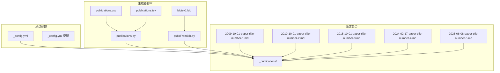
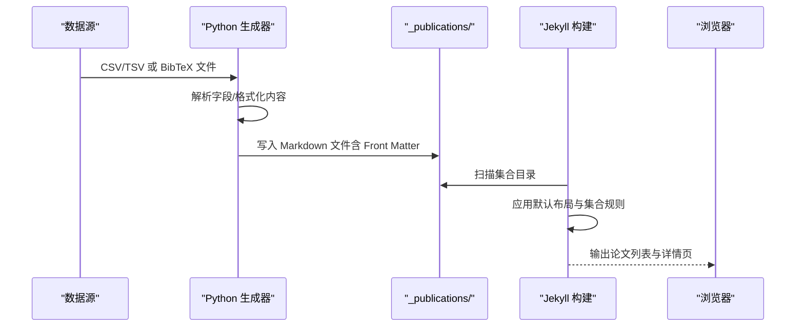
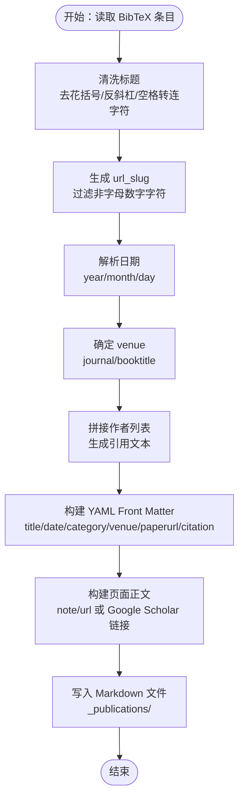
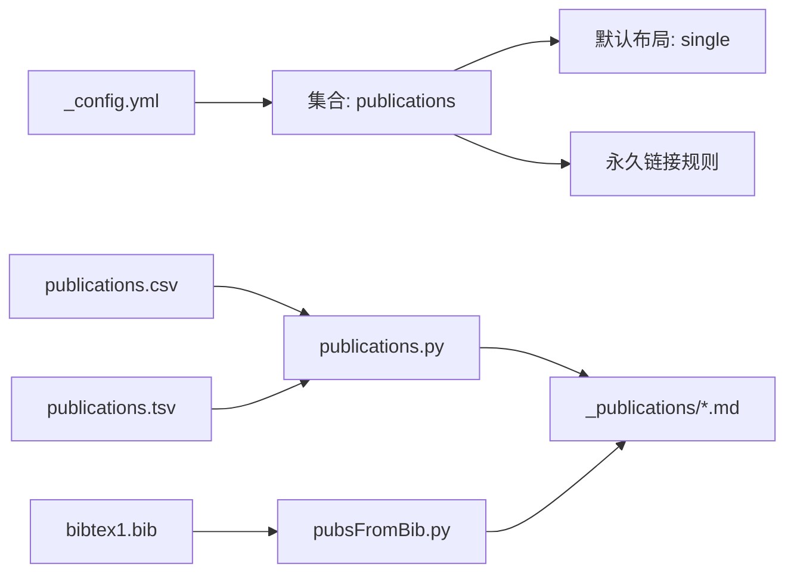

# 论文引用管理系统

<cite>
**本文档引用的文件**
- [_config.yml](file://_config.yml)
- [README.md](file://README.md)
- [2009-10-01-paper-title-number-1.md](file://_publications/2009-10-01-paper-title-number-1.md)
- [2010-10-01-paper-title-number-2.md](file://_publications/2010-10-01-paper-title-number-2.md)
- [2015-10-01-paper-title-number-3.md](file://_publications/2015-10-01-paper-title-number-3.md)
- [2024-02-17-paper-title-number-4.md](file://_publications/2024-02-17-paper-title-number-4.md)
- [2025-06-08-paper-title-number-5.md](file://_publications/2025-06-08-paper-title-number-5.md)
- [publications.py](file://markdown_generator/publications.py)
- [pubsFromBib.py](file://markdown_generator/pubsFromBib.py)
- [publications.csv](file://markdown_generator/publications.csv)
- [publications.tsv](file://markdown_generator/publications.tsv)
- [README.md](file://markdown_generator/README.md)
- [bibtex1.bib](file://files/bibtex1.bib)
</cite>

## 目录
1. [简介](#简介)
2. [项目结构](#项目结构)
3. [核心组件](#核心组件)
4. [架构总览](#架构总览)
5. [详细组件分析](#详细组件分析)
6. [依赖关系分析](#依赖关系分析)
7. [性能考虑](#性能考虑)
8. [故障排除指南](#故障排除指南)
9. [结论](#结论)
10. [附录](#附录)

## 简介
本系统是一个基于 Jekyll 的论文引用管理系统，支持通过 Markdown Front Matter 管理论文条目，使用 Python 脚本从 CSV/TSV 或 BibTeX 自动批量生成论文页面，并在网站上以列表与详情页形式展示。系统通过配置文件定义集合类型、分类与默认布局，Markdown 条目包含标准的 YAML Front Matter 字段，用于控制页面元数据、链接与展示样式。

## 项目结构
系统采用 Jekyll 标准目录组织，论文条目位于集合目录中，生成器脚本位于独立的 markdown_generator 目录，配置文件集中于根目录。



图表来源
- [_config.yml](file://_config.yml)
- [publications.py](file://markdown_generator/publications.py)
- [pubsFromBib.py](file://markdown_generator/pubsFromBib.py)
- [publications.csv](file://markdown_generator/publications.csv)
- [publications.tsv](file://markdown_generator/publications.tsv)
- [bibtex1.bib](file://files/bibtex1.bib)
- [2009-10-01-paper-title-number-1.md](file://_publications/2009-10-01-paper-title-number-1.md)

章节来源
- [_config.yml](file://_config.yml)
- [README.md](file://README.md)

## 核心组件
- 配置与集合：通过配置文件启用论文集合，设置默认布局、永久链接与输出行为，确保论文页面按统一规则渲染。
- 论文条目：每个论文条目为一个 Markdown 文件，包含 YAML Front Matter（标题、日期、分类、摘要、期刊、链接等）与正文内容。
- 生成器脚本：提供两种批量生成方式：
  - CSV/TSV 转 Markdown：读取结构化数据，生成符合模板的 Front Matter 与页面内容。
  - BibTeX 转 Markdown：解析 BibTeX 条目，自动生成 YAML Front Matter 与引用文本，并写入目标目录。

章节来源
- [_config.yml](file://_config.yml)
- [publications.py](file://markdown_generator/publications.py)
- [pubsFromBib.py](file://markdown_generator/pubsFromBib.py)

## 架构总览
系统运行时序从数据源到页面生成与展示：



图表来源
- [_config.yml](file://_config.yml)
- [publications.py](file://markdown_generator/publications.py)
- [pubsFromBib.py](file://markdown_generator/pubsFromBib.py)

## 详细组件分析

### 论文条目与 Front Matter 规范
- 文件命名：YYYY-MM-DD-url_slug.md，其中 url_slug 由标题派生并清理特殊字符。
- Front Matter 字段：
  - 必填：title、date、collection（固定为 publications）、category（manuscripts/conferences 等）。
  - 常用：permalink、excerpt、venue、paperurl、slidesurl、bibtexurl、citation。
- 正文内容：可包含摘要、下载链接、推荐引用等，支持数学公式渲染（MathJax，默认双美元符号）。

示例参考路径
- [2009-10-01-paper-title-number-1.md](file://_publications/2009-10-01-paper-title-number-1.md)
- [2010-10-01-paper-title-number-2.md](file://_publications/2010-10-01-paper-title-number-2.md)
- [2015-10-01-paper-title-number-3.md](file://_publications/2015-10-01-paper-title-number-3.md)
- [2024-02-17-paper-title-number-4.md](file://_publications/2024-02-17-paper-title-number-4.md)
- [2025-06-08-paper-title-number-5.md](file://_publications/2025-06-08-paper-title-number-5.md)

章节来源
- [2009-10-01-paper-title-number-1.md](file://_publications/2009-10-01-paper-title-number-1.md)
- [2010-10-01-paper-title-number-2.md](file://_publications/2010-10-01-paper-title-number-2.md)
- [2015-10-01-paper-title-number-3.md](file://_publications/2015-10-01-paper-title-number-3.md)
- [2024-02-17-paper-title-number-4.md](file://_publications/2024-02-17-paper-title-number-4.md)
- [2025-06-08-paper-title-number-5.md](file://_publications/2025-06-08-paper-title-number-5.md)

### BibTeX 处理流程与字段映射
- 输入：BibTeX 文件（如示例 bibtex1.bib），包含标准字段（title、author、journal、year 等）。
- 解析：使用外部库解析条目，提取字段并进行日期、作者、标题清洗。
- 映射规则：
  - 标题：去除花括号与反斜杠，空格替换为连字符，过滤非字母数字字符。
  - 作者：遍历作者列表，拼接为引用文本。
  - 期刊/会议：根据条目类型选择 journal 或 booktitle 字段作为 venue。
  - 永久链接：基于日期与 url_slug 组合生成。
  - 引用文本：按“作者. 标题. 期刊/会议 年.”格式生成。
- 输出：写入 Markdown 文件至集合目录，包含 Front Matter 与正文链接或 Google Scholar 提示。



图表来源
- [pubsFromBib.py](file://markdown_generator/pubsFromBib.py)
- [bibtex1.bib](file://files/bibtex1.bib)

章节来源
- [pubsFromBib.py](file://markdown_generator/pubsFromBib.py)
- [bibtex1.bib](file://files/bibtex1.bib)

### 论文列表页面实现原理
- 集合与布局：配置文件启用论文集合，设置默认布局与永久链接规则；单个论文页面使用 single 布局。
- 列表渲染：通过集合扫描与默认布局应用，生成论文列表页；排序通常按日期降序排列。
- 显示定制：Front Matter 中的 excerpt、venue、paperurl 等字段决定列表项的摘要、期刊与下载链接展示。

章节来源
- [_config.yml](file://_config.yml)
- [2009-10-01-paper-title-number-1.md](file://_publications/2009-10-01-paper-title-number-1.md)

### Python 生成器脚本功能
- CSV/TSV 生成器：
  - 支持 CSV/TSV 两种输入格式，自动识别分隔符。
  - 支持旧版与新版头部（新增 category 字段），自动兼容。
  - HTML 转义处理，避免 YAML 解析错误。
  - 生成 Markdown 文件并写入集合目录。
- BibTeX 生成器：
  - 支持多来源配置（proceeding/journal），自动选择 venue 字段。
  - 自动清洗标题、生成 url_slug 与日期格式。
  - 自动生成引用文本与页面正文链接或 Google Scholar 提示。

```mermaid
classDiagram
class PublicationsGenerator {
+read(filename) tuple
+create_md(lines, layout) void
+html_escape(text) string
}
class BibTeXGenerator {
+publist dict
+html_escape(text) string
+parse_bibtex(file) void
+build_citation(authors, title, venue, year) string
+write_md(filename, front_matter, body) void
}
PublicationsGenerator --> "_publications/" : "写入"
BibTeXGenerator --> "_publications/" : "写入"
```

图表来源
- [publications.py](file://markdown_generator/publications.py)
- [pubsFromBib.py](file://markdown_generator/pubsFromBib.py)

章节来源
- [publications.py](file://markdown_generator/publications.py)
- [pubsFromBib.py](file://markdown_generator/pubsFromBib.py)
- [README.md](file://markdown_generator/README.md)

### 论文引用展示方式
- 标题链接：permalink 指向论文详情页。
- 作者列表：引用文本中包含作者名，BibTeX 生成器会遍历作者列表。
- 期刊信息：journal 或 booktitle 字段映射为 venue。
- 摘要与正文：excerpt 作为列表摘要，正文可包含下载链接与推荐引用。
- 数学公式：支持 MathJax 渲染，默认使用双美元符号与方括号块级语法。

章节来源
- [2009-10-01-paper-title-number-1.md](file://_publications/2009-10-01-paper-title-number-1.md)
- [2025-06-08-paper-title-number-5.md](file://_publications/2025-06-08-paper-title-number-5.md)
- [pubsFromBib.py](file://markdown_generator/pubsFromBib.py)

### 数据导入导出最佳实践
- 文件命名规范：
  - 论文 Markdown：YYYY-MM-DD-url_slug.md，url_slug 由标题派生并清理特殊字符。
  - 数据文件：CSV/TSV 使用标准列头；BibTeX 文件遵循标准字段。
- 版本管理：
  - 将生成器脚本与数据文件纳入版本控制，记录每次批量更新的提交信息。
  - 对生成的 Markdown 文件进行小步提交，便于回溯与对比。
- 备份策略：
  - 定期备份数据源（CSV/TSV/BibTeX）与已生成的 Markdown 文件。
  - 在部署前先本地预览，确认无误后再推送至远程仓库。

章节来源
- [publications.py](file://markdown_generator/publications.py)
- [pubsFromBib.py](file://markdown_generator/pubsFromBib.py)
- [publications.csv](file://markdown_generator/publications.csv)
- [publications.tsv](file://markdown_generator/publications.tsv)
- [bibtex1.bib](file://files/bibtex1.bib)

## 依赖关系分析
- 配置依赖：集合名称、默认布局、永久链接规则影响页面生成与访问路径。
- 生成器依赖：Python 脚本依赖外部库解析 BibTeX；CSV/TSV 读取依赖标准库。
- 数据依赖：Front Matter 字段完整性决定页面渲染效果；缺失字段可能导致页面异常。



图表来源
- [_config.yml](file://_config.yml)
- [publications.py](file://markdown_generator/publications.py)
- [pubsFromBib.py](file://markdown_generator/pubsFromBib.py)
- [publications.csv](file://markdown_generator/publications.csv)
- [publications.tsv](file://markdown_generator/publications.tsv)
- [bibtex1.bib](file://files/bibtex1.bib)

章节来源
- [_config.yml](file://_config.yml)
- [publications.py](file://markdown_generator/publications.py)
- [pubsFromBib.py](file://markdown_generator/pubsFromBib.py)

## 性能考虑
- 批量生成：优先使用生成器脚本一次性生成大量条目，减少手动维护成本。
- 文件大小：避免 Front Matter 过长与正文冗余，保持 Markdown 简洁。
- 渲染优化：合理使用 MathJax，避免过多复杂公式影响加载速度。

## 故障排除指南
- 生成器报错：
  - 文件格式不匹配：确保 CSV/TSV 使用正确分隔符，BibTeX 文件有效。
  - 缺失必要字段：检查 CSV/TSV 头部与必填字段；BibTeX 缺失 year 等字段会导致日期解析失败。
- 页面显示异常：
  - Front Matter 转义问题：确保包含引号、与符号等特殊字符被正确转义。
  - 永久链接冲突：检查 url_slug 是否唯一，避免重复导致链接冲突。
- 本地预览：
  - 使用 Jekyll 本地服务进行预览，确认列表与详情页渲染正常。

章节来源
- [publications.py](file://markdown_generator/publications.py)
- [pubsFromBib.py](file://markdown_generator/pubsFromBib.py)
- [README.md](file://README.md)

## 结论
本系统通过标准化的 Front Matter 与生成器脚本，实现了论文条目的高效管理与自动化发布。结合配置文件的集合与布局设置，能够稳定地生成论文列表与详情页，并支持多种数据源（CSV/TSV、BibTeX）。遵循本文档的数据规范与最佳实践，可确保数据导入导出的一致性与可维护性。

## 附录
- 示例数据文件：
  - [publications.csv](file://markdown_generator/publications.csv)
  - [publications.tsv](file://markdown_generator/publications.tsv)
  - [bibtex1.bib](file://files/bibtex1.bib)
- 生成器说明：
  - [README.md](file://markdown_generator/README.md)