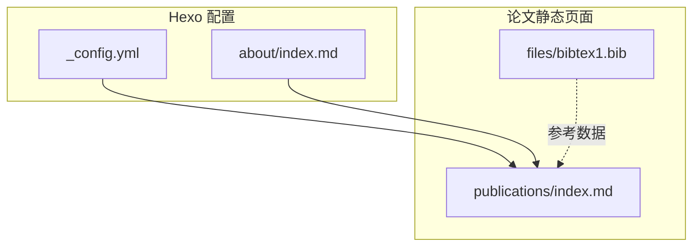
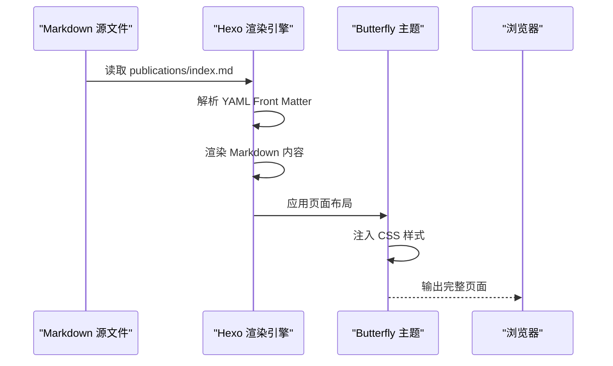
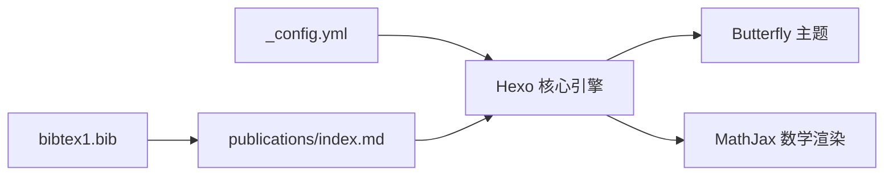

# 论文引用管理系统

<cite>
**本文档引用的文件**
- [_config.yml](file://hexo-site/_config.yml)
- [index.md](file://hexo-site/source/publications/index.md)
- [bibtex1.bib](file://hexo-site/source/files/bibtex1.bib)
- [index.md](file://hexo-site/source/about/index.md)
</cite>

## 目录
1. [简介](#简介)
2. [项目结构](#项目结构)
3. [核心组件](#核心组件)
4. [架构总览](#架构总览)
5. [详细组件分析](#详细组件分析)
6. [依赖关系分析](#依赖关系分析)
7. [性能考虑](#性能考虑)
8. [故障排除指南](#故障排除指南)
9. [结论](#结论)
10. [附录](#附录)

## 简介
本系统是一个基于 Hexo 的论文引用管理系统，现已简化为静态页面管理模式。系统通过纯 Markdown 文件管理论文条目，无需复杂的 BibTeX 处理流程。论文列表页面采用静态 HTML 结构，通过 CSS 样式美化展示，支持数学公式渲染和 PDF 下载链接。系统配置集中在 Hexo 配置文件中，通过主题渲染引擎生成最终页面。

## 项目结构
系统采用 Hexo 标准目录结构，论文条目直接存储在 publications 目录下的 index.md 文件中，通过静态内容管理替代了之前的动态生成器模式。

**图表来源**
- [_config.yml](file://hexo-site/_config.yml)
- [index.md](file://hexo-site/source/publications/index.md)
- [bibtex1.bib](file://hexo-site/source/files/bibtex1.bib)
- [index.md](file://hexo-site/source/about/index.md)

**章节来源**
- [_config.yml](file://hexo-site/_config.yml)
- [index.md](file://hexo-site/source/publications/index.md)
- [index.md](file://hexo-site/source/about/index.md)

## 核心组件
- **静态论文页面**：论文列表页面采用纯 Markdown 格式，包含分类标题、年份分组和论文条目列表。
- **内容组织**：使用 HTML div 容器和自定义 CSS 样式组织论文展示，支持期刊文章和会议论文两类。
- **样式定制**：内置 CSS 样式定义论文列表、标题、期刊信息等元素的显示效果。
- **数学公式支持**：通过 Hexo 配置启用 MathJax，支持 LaTeX 数学公式渲染。

**章节来源**
- [index.md](file://hexo-site/source/publications/index.md)

## 架构总览
系统采用静态内容生成模式，从 Markdown 源文件到最终页面的渲染流程：

**图表来源**
- [_config.yml](file://hexo-site/_config.yml)
- [index.md](file://hexo-site/source/publications/index.md)

## 详细组件分析

### 论文页面结构与内容规范
- **文件位置**：`hexo-site/source/publications/index.md`
- **页面结构**：
  - 标题：学术论文
  - 分类：期刊文章（📚 Journal Articles）和会议论文（📝 Conference Papers）
  - 年份分组：按年份组织论文条目
  - 论文条目格式：标题、期刊信息、PDF 链接、引用格式
- **内容组织**：使用 HTML div 容器和语义化标题组织内容结构

**章节来源**
- [index.md](file://hexo-site/source/publications/index.md)

### 论文条目展示格式
- **标题显示**：使用粗体格式突出论文标题
- **期刊信息**：显示期刊名称和出版年份
- **下载链接**：PDF 文件链接，使用 📄 图标标识
- **引用格式**：按照标准学术格式显示作者和引用信息
- **数学公式**：支持 LaTeX 公式渲染，如 E=mc²

**章节来源**
- [index.md](file://hexo-site/source/publications/index.md)

### 样式设计与视觉效果
- **容器样式**：`.publication-list` 类定义整体布局间距
- **条目样式**：`.publication-item` 类控制条目间距和左侧缩进
- **标题样式**：`.publication-title` 类加粗显示论文标题
- **期刊样式**：`.publication-venue` 类使用斜体和灰色字体显示期刊信息

**章节来源**
- [index.md](file://hexo-site/source/publications/index.md)

### 配置集成与主题支持
- **主题配置**：使用 Butterfly 主题提供现代化的页面渲染
- **数学支持**：通过 Hexo 配置启用 MathJax，支持数学公式渲染
- **导航集成**：论文页面链接集成在关于页面的快速导航中

**章节来源**
- [_config.yml](file://hexo-site/_config.yml)
- [index.md](file://hexo-site/source/about/index.md)

### BibTeX 数据管理
- **数据文件**：`hexo-site/source/files/bibtex1.bib` 包含示例 BibTeX 数据
- **用途**：作为论文引用数据的参考格式，指导静态页面内容编写
- **格式规范**：遵循标准 BibTeX 字段定义（title、author、journal、year 等）

**章节来源**
- [bibtex1.bib](file://hexo-site/source/files/bibtex1.bib)

## 依赖关系分析
- **Hexo 核心**：依赖 Hexo 渲染引擎进行 Markdown 解析和页面生成
- **主题依赖**：使用 Butterfly 主题提供页面布局和样式支持
- **数学渲染**：通过 MathJax 实现 LaTeX 公式渲染功能
- **配置管理**：所有页面行为通过 `_config.yml` 统一配置

**图表来源**
- [_config.yml](file://hexo-site/_config.yml)
- [index.md](file://hexo-site/source/publications/index.md)
- [bibtex1.bib](file://hexo-site/source/files/bibtex1.bib)

**章节来源**
- [_config.yml](file://hexo-site/_config.yml)

## 性能考虑
- **静态渲染**：纯静态页面生成，无需运行时计算开销
- **资源优化**：CSS 样式内联在页面中，减少 HTTP 请求
- **加载速度**：简单的 HTML 结构和少量 CSS 样式，页面加载速度快
- **缓存友好**：静态文件适合 CDN 和浏览器缓存

## 故障排除指南
- **页面显示异常**：
  - 检查 Markdown 语法是否正确，特别是 YAML Front Matter 格式
  - 确认 CSS 样式类名与 HTML 结构匹配
  - 验证 PDF 文件链接的有效性
- **数学公式不显示**：
  - 检查 Hexo 配置中的 MathJax 设置
  - 确认 LaTeX 语法格式正确
- **样式问题**：
  - 检查 CSS 类名是否正确应用
  - 确认样式定义与 HTML 结构一致
- **本地预览**：
  - 使用 Hexo 本地服务器进行预览测试
  - 确认页面在不同设备上的显示效果

**章节来源**
- [index.md](file://hexo-site/source/publications/index.md)
- [_config.yml](file://hexo-site/_config.yml)

## 结论
本系统通过简化的设计理念，将复杂的 BibTeX 处理流程转变为直观的静态页面管理模式。通过纯 Markdown 文件和自定义 CSS 样式，实现了论文列表的高效管理和美观展示。系统配置简洁，维护成本低，同时保持了良好的用户体验和功能完整性。

## 附录
- **示例数据文件**：
  - [bibtex1.bib](file://hexo-site/source/files/bibtex1.bib)
- **配置文件**：
  - [_config.yml](file://hexo-site/_config.yml)
- **页面文件**：
  - [index.md](file://hexo-site/source/publications/index.md)
  - [index.md](file://hexo-site/source/about/index.md)