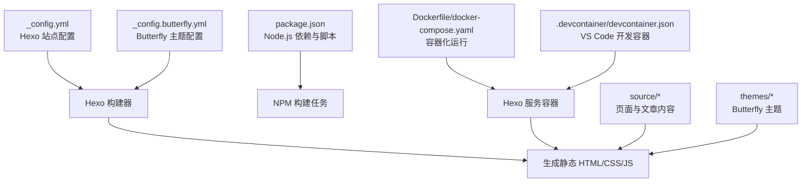
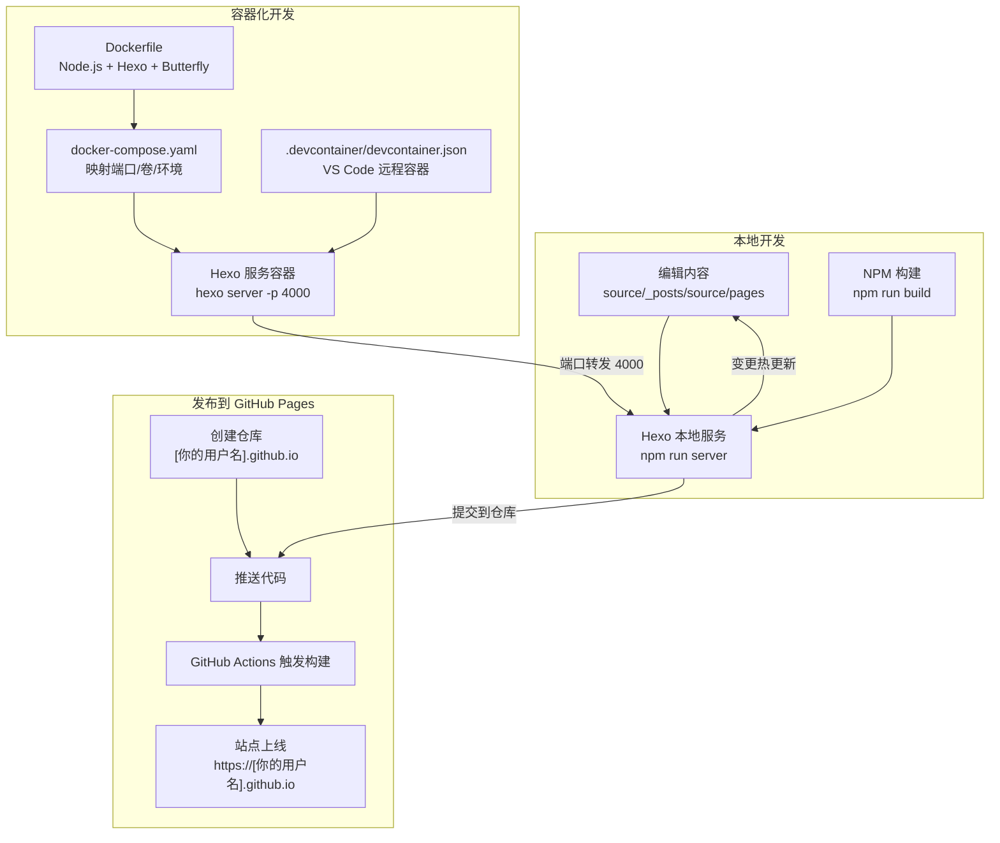
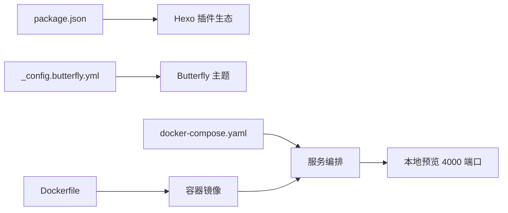

# 快速开始

<cite>
**本文引用的文件**
- [package.json](file://hexo-site/package.json)
- [_config.yml](file://hexo-site/_config.yml)
- [_config.butterfly.yml](file://hexo-site/_config.butterfly.yml)
- [index.md](file://hexo-site/source/index.md)
- [about/index.md](file://hexo-site/source/about/index.md)
- [publications/index.md](file://hexo-site/source/publications/index.md)
- [cv/index.md](file://hexo-site/source/cv/index.md)
- [2025-03-11-useful-website.md](file://hexo-site/source/_posts/2025-03-11-useful-website.md)
- [2025-03-12-optimize.md](file://hexo-site/source/_posts/2025-03-12-optimize.md)
</cite>

## 目录
1. [简介](#简介)
2. [项目结构](#项目结构)
3. [核心组件](#核心组件)
4. [架构总览](#架构总览)
5. [详细组件分析](#详细组件分析)
6. [依赖关系分析](#依赖关系分析)
7. [性能考虑](#性能考虑)
8. [故障排除指南](#故障排除指南)
9. [结论](#结论)
10. [附录](#附录)

## 简介
本指南面向首次接触学术类个人网站的用户，帮助你在本地与云端快速完成环境准备、站点构建与发布。你将学会：
- 在 Linux、macOS、Windows 上安装 Node.js、npm、Hexo CLI
- 使用本地 Hexo 服务预览网站
- 使用 Docker 一键运行容器化开发环境
- 使用 VS Code Dev Container 在容器中开发
- 部署到 GitHub Pages（从创建仓库到网站上线）
- 常见问题排查与最佳实践

**更新** 本项目已从 Jekyll 迁移到 Hexo + Butterfly 开发环境，使用 npm 作为包管理器，配置文件为 _config.yml 和 _config.butterfly.yml。

## 项目结构
该仓库是一个基于 Hexo 的静态网站模板，采用"主题 + 配置 + 内容"的分层组织方式：
- 配置层：Hexo 核心配置与插件、站点元信息、主题配置、部署设置等
- 内容层：文章、页面、作品集、讲稿、教学、公开论文等集合
- 主题与样式：Butterfly 主题配置、布局与包含模板、CSS/JS 资源
- 工具与自动化：NPM 构建脚本、Docker 与 VS Code Dev Container 配置

**图示来源**
- [_config.yml:1-142](file://hexo-site/_config.yml#L1-L142)
- [_config.butterfly.yml:1-459](file://hexo-site/_config.butterfly.yml#L1-L459)
- [package.json:1-35](file://hexo-site/package.json#L1-L35)

**章节来源**
- [_config.yml:1-142](file://hexo-site/_config.yml#L1-L142)
- [_config.butterfly.yml:1-459](file://hexo-site/_config.butterfly.yml#L1-L459)
- [package.json:1-35](file://hexo-site/package.json#L1-L35)

## 核心组件
- 站点配置与集合
  - 站点基础信息、作者信息、语言设置、URL 配置、分页设置等均在 Hexo 配置文件中集中管理
- Hexo 与 Butterfly 主题
  - 使用 package.json 声明 Hexo 核心与 Butterfly 主题版本，配合 npm 安装依赖
- Node.js 与 NPM
  - package.json 提供构建脚本（build、server、deploy、clean），便于本地开发时的预览与部署
- Docker 与 VS Code Dev Container
  - Dockerfile 定义镜像与服务命令；docker-compose.yaml 映射端口与卷；devcontainer.json 为 VS Code 提供一键容器开发体验
- 内容管理系统
  - 支持 Markdown 格式的文章与页面，内置数学公式、Mermaid 图表、代码高亮等功能

**章节来源**
- [_config.yml:1-142](file://hexo-site/_config.yml#L1-L142)
- [_config.butterfly.yml:1-459](file://hexo-site/_config.butterfly.yml#L1-L459)
- [package.json:1-35](file://hexo-site/package.json#L1-L35)

## 架构总览
下图展示了从本地开发到容器化运行再到 GitHub Pages 发布的整体流程。

**图示来源**
- [_config.yml:126-142](file://hexo-site/_config.yml#L126-L142)
- [package.json:5-10](file://hexo-site/package.json#L5-L10)

**章节来源**
- [_config.yml:126-142](file://hexo-site/_config.yml#L126-L142)
- [package.json:5-10](file://hexo-site/package.json#L5-L10)

## 详细组件分析

### 本地开发环境（Node.js、npm、Hexo CLI）
- 安装 Node.js 与 npm
  - Linux（含 WSL）：参考安装命令与依赖更新步骤
  - macOS：使用包管理器安装 Node.js、npm，再安装 Hexo CLI
  - Windows：使用包管理器安装 Node.js、npm，再安装 Hexo CLI
- 安装依赖与启动本地服务
  - 使用 npm 安装项目依赖
  - 启动 Hexo 本地服务，支持热重载与自动刷新
  - 使用 npm run server 启动本地预览

**章节来源**
- [package.json:14-33](file://hexo-site/package.json#L14-L33)

### Docker 开发环境
- 构建镜像与启动容器
  - 使用提供的 Dockerfile 构建镜像，容器内已安装 Node.js、npm、Hexo CLI
  - 使用 docker-compose.yaml 将宿主机目录挂载到容器，映射端口 4000，设置运行环境变量
- 访问与调试
  - 容器内通过指定配置文件组合启动 Hexo 服务
  - 若遇到权限问题，可调整用户 ID 或修改目录权限

**章节来源**
- [package.json:14-33](file://hexo-site/package.json#L14-L33)

### VS Code Dev Container
- 使用 VS Code 打开仓库，系统检测到开发容器配置后可直接在容器中打开
- 容器内已安装所需依赖，自动在 4000 端口提供本地预览
- 变更文件后自动热更新，无需手动重启

**章节来源**
- [package.json:14-33](file://hexo-site/package.json#L14-L33)

### GitHub Pages 部署流程
- 创建仓库
  - 注册 GitHub 账号并确认邮箱
  - 使用模板创建仓库，仓库名为 [你的 GitHub 用户名].github.io
- 配置与验证
  - 设置站点全局配置，添加内容与文件
  - 在仓库设置的 GitHub Pages 区域检查状态
- 上线
  - 推送代码后，GitHub Actions 将触发构建并上线

**章节来源**
- [_config.yml:126-142](file://hexo-site/_config.yml#L126-L142)

### 内容管理与主题配置
- 页面与文章管理
  - 使用 Markdown 格式编写内容，Front Matter 中可设置标题、摘要、分类、标签等元数据
  - 支持数学公式（MathJax）、Mermaid 图表、代码高亮等功能
- 主题配置
  - Butterfly 主题提供丰富的配置选项，包括导航栏、侧边栏、深色模式、TOC 等
  - 支持多语言、SEO 优化、Analytics 等功能

**章节来源**
- [_config.butterfly.yml:1-459](file://hexo-site/_config.butterfly.yml#L1-L459)
- [index.md:1-204](file://hexo-site/source/index.md#L1-L204)
- [about/index.md:1-67](file://hexo-site/source/about/index.md#L1-L67)

### 示例内容与导航
- 示例页面与文章
  - 关于页与博客文章示例展示了 Front Matter 字段与页面布局
  - 支持多种内容类型：博客文章、学术论文、简历、作品集等
- 导航菜单
  - 导航配置控制头部菜单顺序与子菜单结构，便于维护站点结构

**章节来源**
- [index.md:1-204](file://hexo-site/source/index.md#L1-L204)
- [about/index.md:1-67](file://hexo-site/source/about/index.md#L1-L67)
- [publications/index.md:1-58](file://hexo-site/source/publications/index.md#L1-L58)
- [cv/index.md:1-104](file://hexo-site/source/cv/index.md#L1-L104)

## 依赖关系分析
- Node.js 与 Hexo 生态
  - package.json 声明了 Hexo 核心与常用插件，确保本地与 GitHub Pages 环境一致性
- Butterfly 主题
  - _config.butterfly.yml 提供主题配置，包括导航栏、侧边栏、深色模式、数学公式等
- 容器化运行
  - Dockerfile 与 docker-compose.yaml 将 Node.js、npm、Hexo CLI 与 Butterfly 组合在一个镜像中，简化跨平台开发

**图示来源**
- [package.json:14-33](file://hexo-site/package.json#L14-L33)
- [_config.butterfly.yml:1-459](file://hexo-site/_config.butterfly.yml#L1-L459)

**章节来源**
- [package.json:14-33](file://hexo-site/package.json#L14-L33)
- [_config.butterfly.yml:1-459](file://hexo-site/_config.butterfly.yml#L1-L459)

## 性能考虑
- 构建优化
  - 使用压缩脚本对 JS 进行合并与压缩，减少加载体积
  - 启用 HTML 压缩插件，降低传输体积
- 本地开发
  - 使用容器化开发避免环境差异导致的性能波动
  - 仅在必要时重启 Hexo 服务，减少等待时间

## 故障排除指南
- Node.js/npm 权限问题
  - 现象：安装依赖时报写入权限错误
  - 处理：使用 sudo 或配置 npm 全局目录
- Linux 缺少编译依赖
  - 现象：无法本地运行
  - 处理：安装 build-essential、gcc、make 等编译工具
- Windows 子系统（WSL）包安装失败
  - 现象：找不到 nodejs 或 npm
  - 处理：先更新包索引，再尝试安装
- Docker 权限或端口占用
  - 现象：容器无法启动或端口冲突
  - 处理：检查用户 ID、目录权限与端口占用情况
- GitHub Pages 构建失败
  - 现象：仓库设置中状态异常
  - 处理：检查配置文件、集合路径与插件白名单，确保与 GitHub Pages 兼容

## 结论
通过本指南，你可以在本地与容器环境中快速搭建并运行学术类个人网站，同时掌握 GitHub Pages 的部署流程。建议优先使用 VS Code Dev Container 以获得一致的开发体验，并充分利用 Butterfly 主题提供的丰富功能来提升网站的用户体验。

## 附录

### 快速操作清单
- 在本地安装 Node.js、npm、Hexo CLI，并启动 Hexo 本地服务
- 使用 Docker 一键运行容器化开发环境
- 在 VS Code 中使用 Dev Container 打开项目
- 在 GitHub 上创建 [你的用户名].github.io 仓库并推送代码
- 在仓库设置中检查 GitHub Pages 状态，等待构建完成

**章节来源**
- [_config.yml:126-142](file://hexo-site/_config.yml#L126-L142)
- [package.json:5-10](file://hexo-site/package.json#L5-L10)