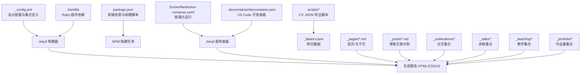
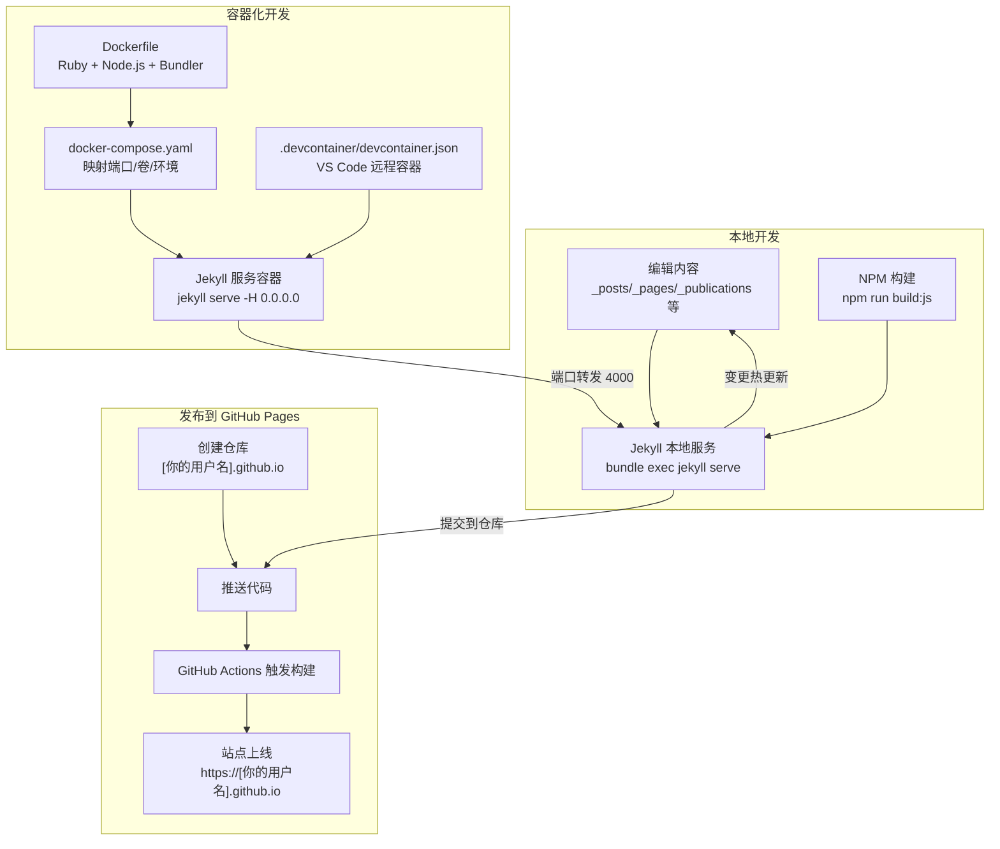
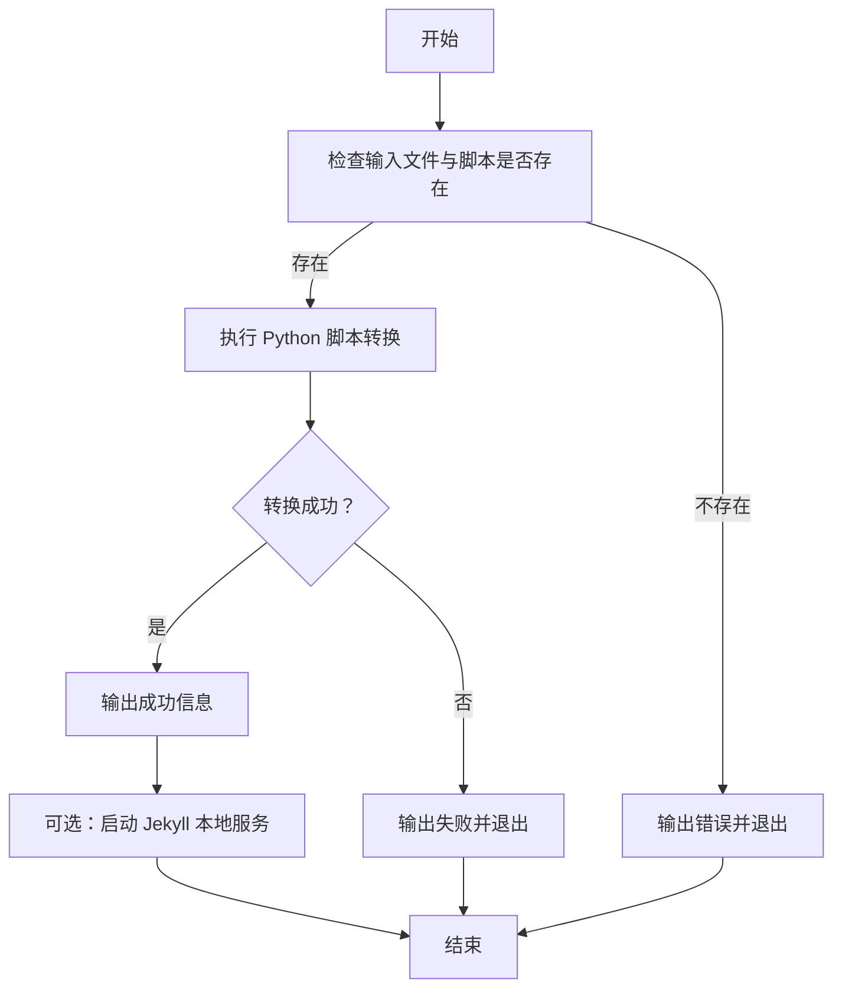
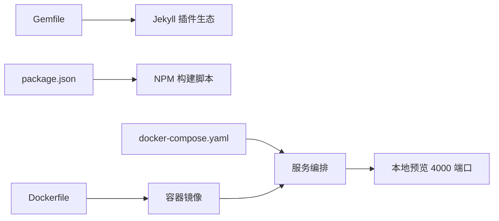

# 快速开始

<cite>
**本文引用的文件**
- [README.md](file://README.md)
- [_config.yml](file://_config.yml)
- [Gemfile](file://Gemfile)
- [package.json](file://package.json)
- [Dockerfile](file://Dockerfile)
- [docker-compose.yaml](file://docker-compose.yaml)
- [.devcontainer/devcontainer.json](file://.devcontainer/devcontainer.json)
- [_config_docker.yml](file://_config_docker.yml)
- [scripts/update_cv_json.sh](file://scripts/update_cv_json.sh)
- [scripts/cv_markdown_to_json.py](file://scripts/cv_markdown_to_json.py)
- [_data/navigation.yml](file://_data/navigation.yml)
- [_pages/about.md](file://_pages/about.md)
- [_posts/2025-03-11-my-first-blog.md](file://_posts/2025-03-11-my-first-blog.md)
</cite>

## 目录
1. [简介](#简介)
2. [项目结构](#项目结构)
3. [核心组件](#核心组件)
4. [架构总览](#架构总览)
5. [详细组件分析](#详细组件分析)
6. [依赖关系分析](#依赖关系分析)
7. [性能考虑](#性能考虑)
8. [故障排除指南](#故障排除指南)
9. [结论](#结论)
10. [附录](#附录)

## 简介
本指南面向首次接触学术类个人网站的用户，帮助你在本地与云端快速完成环境准备、站点构建与发布。你将学会：
- 在 Linux、macOS、Windows 上安装 Ruby、Node.js、Bundler
- 使用本地 Jekyll 服务预览网站
- 使用 Docker 一键运行容器化开发环境
- 使用 VS Code Dev Container 在容器中开发
- 部署到 GitHub Pages（从创建仓库到网站上线）
- 常见问题排查与最佳实践

## 项目结构
该仓库是一个基于 Jekyll 的静态网站模板，采用“主题 + 数据 + 内容”的分层组织方式：
- 配置层：Jekyll 核心配置与插件、站点元信息、集合类型、默认布局等
- 内容层：文章、页面、作品集、讲稿、教学、公开论文等集合
- 主题与样式：Sass 主题变量、布局与包含模板、CSS/JS 资源
- 工具与自动化：CV JSON 导出脚本、NPM 构建脚本、Docker 与 VS Code Dev Container 配置

图示来源
- [_config.yml:223-236](file://_config.yml#L223-L236)
- [Gemfile:3-13](file://Gemfile#L3-L13)
- [package.json:36-40](file://package.json#L36-L40)
- [Dockerfile](file://Dockerfile#L35)
- [docker-compose.yaml:1-10](file://docker-compose.yaml#L1-L10)
- [.devcontainer/devcontainer.json:1-16](file://.devcontainer/devcontainer.json#L1-L16)
- [scripts/cv_markdown_to_json.py:367-413](file://scripts/cv_markdown_to_json.py#L367-L413)

章节来源
- [_config.yml:223-236](file://_config.yml#L223-L236)
- [Gemfile:3-13](file://Gemfile#L3-L13)
- [package.json:36-40](file://package.json#L36-L40)
- [Dockerfile](file://Dockerfile#L35)
- [docker-compose.yaml:1-10](file://docker-compose.yaml#L1-L10)
- [.devcontainer/devcontainer.json:1-16](file://.devcontainer/devcontainer.json#L1-L16)
- [scripts/cv_markdown_to_json.py:367-413](file://scripts/cv_markdown_to_json.py#L367-L413)

## 核心组件
- 站点配置与集合
  - 站点基础信息、作者信息、社交链接、SEO、分析、评论、集合类型与默认布局等均在站点配置文件中集中管理
- Ruby 与 Bundler
  - 使用 Gemfile 声明 Jekyll 与插件版本，配合 Bundler 安装依赖
- Node.js 与 NPM
  - package.json 提供前端资源与压缩构建脚本，便于本地开发时的 JS/CSS 压缩
- Docker 与 VS Code Dev Container
  - Dockerfile 定义镜像与服务命令；docker-compose.yaml 映射端口与卷；devcontainer.json 为 VS Code 提供一键容器开发体验
- CV JSON 自动化
  - Python 脚本解析 Markdown CV 并输出 JSON，配套 Shell 脚本执行转换与可选的 Jekyll 重建

章节来源
- [_config.yml:10-20](file://_config.yml#L10-L20)
- [_config.yml:223-236](file://_config.yml#L223-L236)
- [Gemfile:3-13](file://Gemfile#L3-L13)
- [package.json:23-40](file://package.json#L23-L40)
- [Dockerfile:1-36](file://Dockerfile#L1-L36)
- [docker-compose.yaml:1-10](file://docker-compose.yaml#L1-L10)
- [.devcontainer/devcontainer.json:1-16](file://.devcontainer/devcontainer.json#L1-L16)
- [scripts/update_cv_json.sh:1-48](file://scripts/update_cv_json.sh#L1-L48)
- [scripts/cv_markdown_to_json.py:1-430](file://scripts/cv_markdown_to_json.py#L1-L430)

## 架构总览
下图展示了从本地开发到容器化运行再到 GitHub Pages 发布的整体流程。

图示来源
- [README.md:18-72](file://README.md#L18-L72)
- [Dockerfile](file://Dockerfile#L35)
- [docker-compose.yaml:1-10](file://docker-compose.yaml#L1-L10)
- [.devcontainer/devcontainer.json:1-16](file://.devcontainer/devcontainer.json#L1-L16)
- [README.md:8-16](file://README.md#L8-L16)

章节来源
- [README.md:18-72](file://README.md#L18-L72)
- [Dockerfile](file://Dockerfile#L35)
- [docker-compose.yaml:1-10](file://docker-compose.yaml#L1-L10)
- [.devcontainer/devcontainer.json:1-16](file://.devcontainer/devcontainer.json#L1-L16)
- [README.md:8-16](file://README.md#L8-L16)

## 详细组件分析

### 本地开发环境（Ruby、Node.js、Bundler）
- 安装 Ruby 与 Bundler
  - Linux（含 WSL）：参考安装命令与依赖更新步骤
  - macOS：使用包管理器安装 Ruby、Node.js，再安装 Bundler
  - 权限问题：推荐将 Gems 安装到本地目录，避免系统级权限错误
- 安装依赖与启动本地服务
  - 使用 Bundler 安装 Ruby 依赖
  - 启动 Jekyll 本地服务，支持热重载与自动刷新
  - 如需确保使用本地依赖，可使用 bundle exec 前缀

章节来源
- [README.md:24-56](file://README.md#L24-L56)

### Docker 开发环境
- 构建镜像与启动容器
  - 使用提供的 Dockerfile 构建镜像，容器内已安装 Ruby、Node.js、Bundler
  - 使用 docker-compose.yaml 将宿主机目录挂载到容器，映射端口 4000，设置运行环境变量
- 访问与调试
  - 容器内通过指定配置文件组合启动 Jekyll 服务
  - 若遇到权限问题，可调整用户 ID 或修改目录权限

章节来源
- [Dockerfile:1-36](file://Dockerfile#L1-L36)
- [docker-compose.yaml:1-10](file://docker-compose.yaml#L1-L10)
- [_config_docker.yml](file://_config_docker.yml#L1)

### VS Code Dev Container
- 使用 VS Code 打开仓库，系统检测到开发容器配置后可直接在容器中打开
- 容器内已安装所需依赖，自动在 4000 端口提供本地预览
- 变更文件后自动热更新，无需手动重启

章节来源
- [.devcontainer/devcontainer.json:1-16](file://.devcontainer/devcontainer.json#L1-L16)
- [README.md:70-72](file://README.md#L70-L72)

### GitHub Pages 部署流程
- 创建仓库
  - 注册 GitHub 账号并确认邮箱
  - 使用模板创建仓库，仓库名为 [你的 GitHub 用户名].github.io
- 配置与验证
  - 设置站点全局配置，添加内容与文件
  - 在仓库设置的 GitHub Pages 区域检查状态
- 上线
  - 推送代码后，GitHub Actions 将触发构建并上线

章节来源
- [README.md:8-16](file://README.md#L8-L16)

### CV JSON 自动化（可选）
- 脚本作用
  - 将 Markdown 格式的简历转换为 JSON，供页面渲染使用
- 使用方法
  - 执行 Shell 脚本，调用 Python 脚本进行转换
  - 可选择是否在转换后直接启动本地 Jekyll 服务查看效果

图示来源
- [scripts/update_cv_json.sh:14-45](file://scripts/update_cv_json.sh#L14-L45)
- [scripts/cv_markdown_to_json.py:414-429](file://scripts/cv_markdown_to_json.py#L414-L429)

章节来源
- [scripts/update_cv_json.sh:1-48](file://scripts/update_cv_json.sh#L1-L48)
- [scripts/cv_markdown_to_json.py:1-430](file://scripts/cv_markdown_to_json.py#L1-L430)

### 示例内容与导航
- 示例页面与文章
  - 关于页与博客文章示例展示了 Front Matter 字段与页面布局
- 导航菜单
  - 导航配置控制头部菜单顺序与子菜单结构，便于维护站点结构

章节来源
- [_pages/about.md:1-43](file://_pages/about.md#L1-L43)
- [_posts/2025-03-11-my-first-blog.md:1-41](file://_posts/2025-03-11-my-first-blog.md#L1-L41)
- [_data/navigation.yml:10-40](file://_data/navigation.yml#L10-L40)

## 依赖关系分析
- Ruby 与 Jekyll 插件
  - Gemfile 声明了 Jekyll 核心与常用插件，确保本地与 GitHub Pages 环境一致性
- Node.js 与前端资源
  - package.json 提供 jQuery、FitVids、Smooth Scroll、Plotly 等前端库与压缩脚本
- 容器化运行
  - Dockerfile 与 docker-compose.yaml 将 Ruby、Node.js、Bundler 与 Jekyll 组合在一个镜像中，简化跨平台开发

图示来源
- [Gemfile:3-13](file://Gemfile#L3-L13)
- [package.json:26-40](file://package.json#L26-L40)
- [Dockerfile:1-36](file://Dockerfile#L1-L36)
- [docker-compose.yaml:1-10](file://docker-compose.yaml#L1-L10)

章节来源
- [Gemfile:3-13](file://Gemfile#L3-L13)
- [package.json:26-40](file://package.json#L26-L40)
- [Dockerfile:1-36](file://Dockerfile#L1-L36)
- [docker-compose.yaml:1-10](file://docker-compose.yaml#L1-L10)

## 性能考虑
- 构建优化
  - 使用压缩脚本对 JS 进行合并与压缩，减少加载体积
  - 启用 HTML 压缩插件，降低传输体积
- 本地开发
  - 使用容器化开发避免环境差异导致的性能波动
  - 仅在必要时重启 Jekyll 服务，减少等待时间

## 故障排除指南
- Ruby/Bundler 权限问题
  - 现象：安装 Gems 时报写入权限错误
  - 处理：将 Gems 安装到本地 vendor/bundle 目录
- Linux 缺少编译依赖
  - 现象：无法本地运行
  - 处理：安装 build-essential、gcc、make 等编译工具
- Windows 子系统（WSL）包安装失败
  - 现象：找不到 ruby-bundler 或 nodejs
  - 处理：先更新包索引，再尝试安装
- Docker 权限或端口占用
  - 现象：容器无法启动或端口冲突
  - 处理：检查用户 ID、目录权限与端口占用情况
- GitHub Pages 构建失败
  - 现象：仓库设置中状态异常
  - 处理：检查配置文件、集合路径与插件白名单，确保与 GitHub Pages 兼容

章节来源
- [README.md:27-56](file://README.md#L27-L56)
- [README.md:58-72](file://README.md#L58-L72)

## 结论
通过本指南，你可以在本地与容器环境中快速搭建并运行学术类个人网站，同时掌握 GitHub Pages 的部署流程。建议优先使用 VS Code Dev Container 以获得一致的开发体验，并在需要时启用 CV JSON 自动化以提升简历数据的维护效率。

## 附录

### 快速操作清单
- 在本地安装 Ruby、Node.js、Bundler，并启动 Jekyll 本地服务
- 使用 Docker 一键运行容器化开发环境
- 在 VS Code 中使用 Dev Container 打开项目
- 在 GitHub 上创建 [你的用户名].github.io 仓库并推送代码
- 在仓库设置中检查 GitHub Pages 状态，等待构建完成

章节来源
- [README.md:18-72](file://README.md#L18-L72)
- [README.md:8-16](file://README.md#L8-L16)