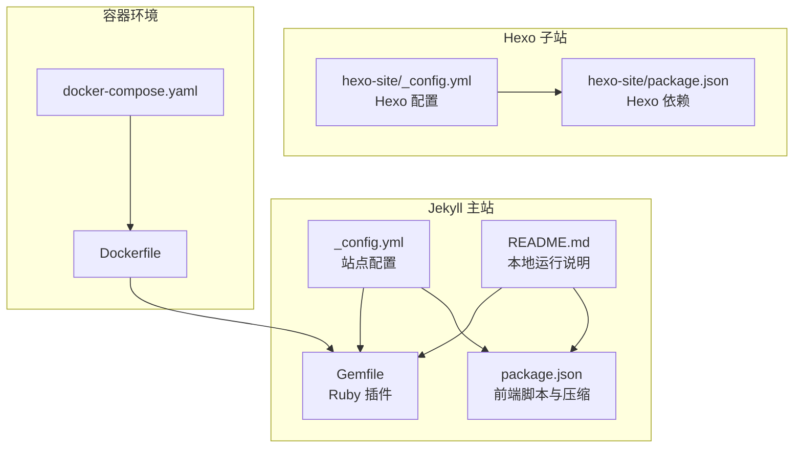
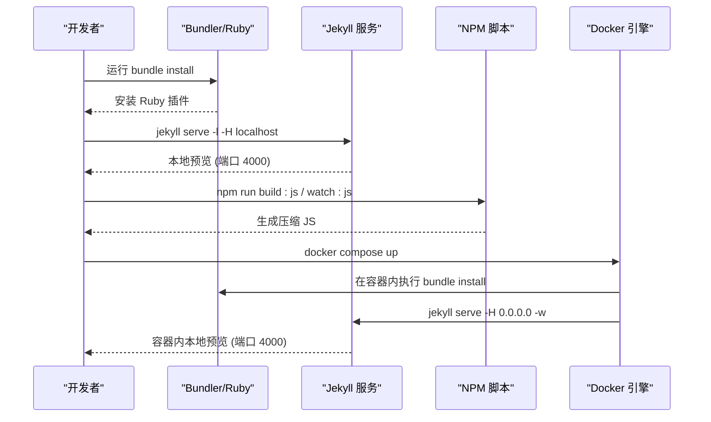
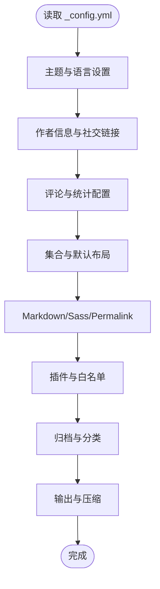
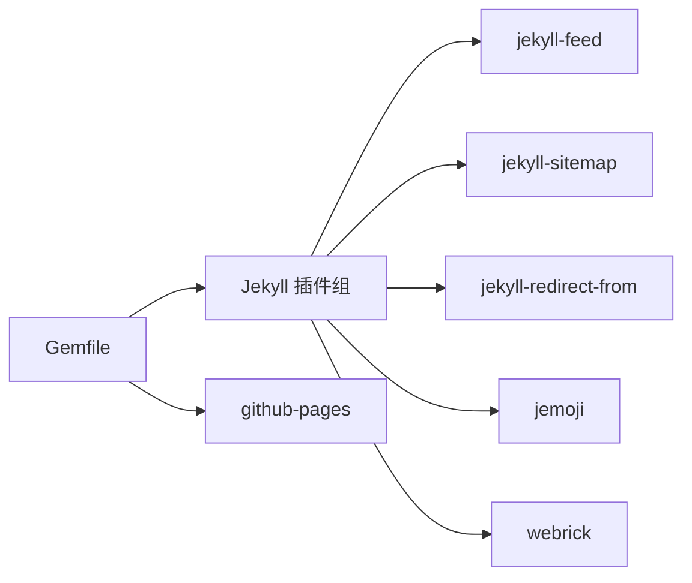
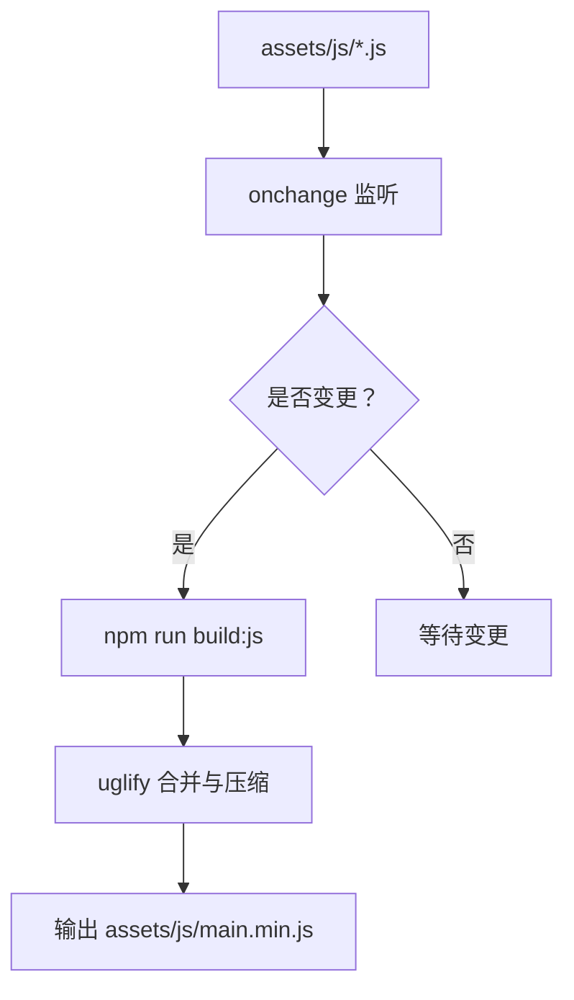
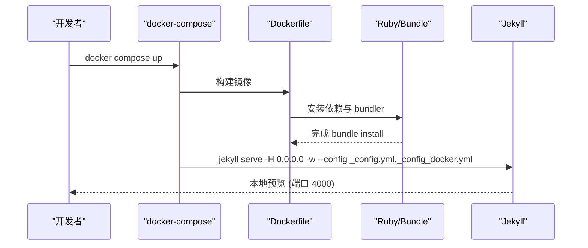
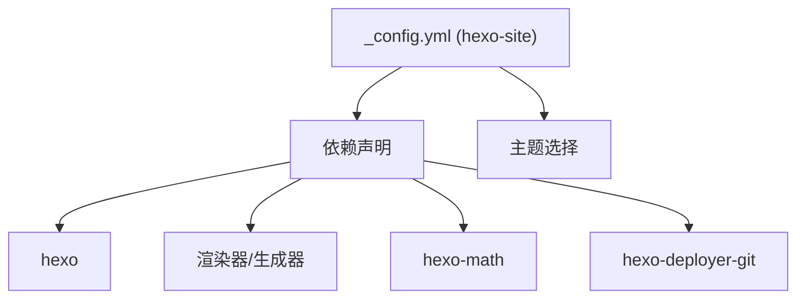
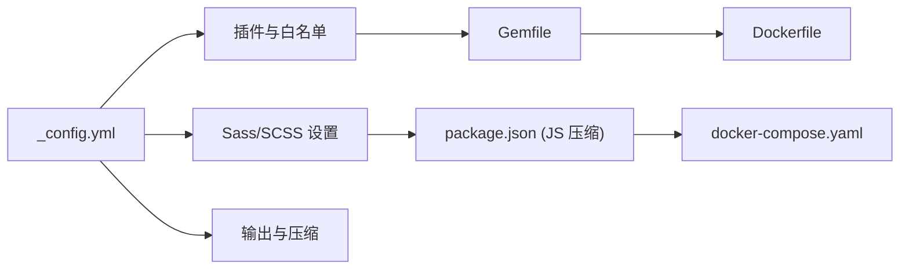

# 故障排除和常见问题

<cite>
**本文引用的文件**
- [根配置 _config.yml](file://_config.yml)
- [包管理 package.json](file://package.json)
- [Ruby 包管理 Gemfile](file://Gemfile)
- [说明文档 README.md](file://README.md)
- [贡献指南 CONTRIBUTING.md](file://CONTRIBUTING.md)
- [Dockerfile](file://Dockerfile)
- [docker-compose.yaml](file://docker-compose.yaml)
- [Hexo 配置 _config.yml（hexo-site）](file://hexo-site/_config.yml)
- [Hexo 包管理 package.json（hexo-site）](file://hexo-site/package.json)
</cite>

## 目录
1. [简介](#简介)
2. [项目结构](#项目结构)
3. [核心组件](#核心组件)
4. [架构总览](#架构总览)
5. [详细组件分析](#详细组件分析)
6. [依赖关系分析](#依赖关系分析)
7. [性能考虑](#性能考虑)
8. [故障排除指南](#故障排除指南)
9. [结论](#结论)
10. [附录](#附录)

## 简介
本文件面向使用本 Jekyll 主题进行个人/学术型网站搭建与维护的用户，提供系统化的故障排除与常见问题解答。内容覆盖构建错误、样式显示异常、内容加载失败、配置错误、性能问题、版本兼容与升级、日志与错误信息解读、社区支持与预防性维护等主题，帮助您快速定位并解决问题。

## 项目结构
该项目采用 Jekyll 模板作为主站点，并包含一个独立的 Hexo 子站目录（hexo-site），用于对比或迁移场景。本地开发可通过 Bundler 安装 Ruby 插件，通过 NPM 管理前端脚本与压缩任务；也可使用 Docker 一键运行。

图表来源
- [_config.yml:1-362](file://_config.yml#L1-L362)
- [Gemfile:1-14](file://Gemfile#L1-L14)
- [package.json:1-42](file://package.json#L1-L42)
- [README.md:1-97](file://README.md#L1-L97)
- [hexo-site/_config.yml:1-110](file://hexo-site/_config.yml#L1-L110)
- [hexo-site/package.json:1-34](file://hexo-site/package.json#L1-L34)
- [Dockerfile:1-36](file://Dockerfile#L1-L36)
- [docker-compose.yaml:1-10](file://docker-compose.yaml#L1-L10)

章节来源
- [_config.yml:1-362](file://_config.yml#L1-L362)
- [Gemfile:1-14](file://Gemfile#L1-L14)
- [package.json:1-42](file://package.json#L1-L42)
- [README.md:1-97](file://README.md#L1-L97)
- [hexo-site/_config.yml:1-110](file://hexo-site/_config.yml#L1-L110)
- [hexo-site/package.json:1-34](file://hexo-site/package.json#L1-L34)
- [Dockerfile:1-36](file://Dockerfile#L1-L36)
- [docker-compose.yaml:1-10](file://docker-compose.yaml#L1-L10)

## 核心组件
- 站点配置与集合：通过站点配置控制主题、语言、评论、统计、归档、压缩等；collections 定义教学、论文、作品集、演讲等集合输出规则。
- Ruby 插件生态：通过 Gemfile 声明 Jekyll 及其插件，配合白名单与安全模式。
- 前端脚本与压缩：通过 package.json 提供 JS 压缩与监听脚本，提升构建效率。
- 容器化运行：Dockerfile 与 docker-compose.yaml 提供一致的开发环境与端口映射。
- Hexo 对比：hexo-site 目录提供另一种静态生成方案的配置与依赖，便于迁移或对比。

章节来源
- [_config.yml:223-362](file://_config.yml#L223-L362)
- [Gemfile:1-14](file://Gemfile#L1-L14)
- [package.json:36-40](file://package.json#L36-L40)
- [Dockerfile:1-36](file://Dockerfile#L1-L36)
- [docker-compose.yaml:1-10](file://docker-compose.yaml#L1-L10)
- [hexo-site/_config.yml:1-110](file://hexo-site/_config.yml#L1-L110)
- [hexo-site/package.json:1-34](file://hexo-site/package.json#L1-L34)

## 架构总览
下图展示本地开发与容器运行两种方式的流程差异，以及与站点配置、插件、前端脚本的关系。

图表来源
- [README.md:43-56](file://README.md#L43-L56)
- [package.json:36-40](file://package.json#L36-L40)
- [Dockerfile:29-35](file://Dockerfile#L29-L35)
- [docker-compose.yaml:1-10](file://docker-compose.yaml#L1-L10)

## 详细组件分析

### 组件一：站点配置与集合（_config.yml）
- 主题与语言：站点主题、locale、标题、副标题、URL、baseurl、仓库等基础信息。
- 作者信息与社交链接：头像、姓名、简介、位置、邮箱及各类学术/社交平台链接。
- 评论与统计：评论提供商与短名称、Discourse 服务器、Facebook 应用 ID、静态评论配置；统计提供商与跟踪 ID。
- 归档与分类：分类与标签归档类型与路径。
- Markdown/Sass/Permalink：Markdown 渲染参数、Sass 输出风格、永久链接格式。
- 插件与白名单：启用的 Jekyll 插件与安全模式白名单。
- HTML 压缩：生产环境自动压缩 HTML。

图表来源
- [_config.yml:10-362](file://_config.yml#L10-L362)

章节来源
- [_config.yml:10-362](file://_config.yml#L10-L362)

### 组件二：Ruby 插件与安全（Gemfile）
- 插件组：声明 jekyll 及其生态插件（feed、sitemap、redirect-from、emoji、webrick）。
- github-pages：统一依赖版本，适配 GitHub Pages。
- 安全与白名单：结合站点配置中的 whitelist 控制可用插件。

图表来源
- [Gemfile:1-14](file://Gemfile#L1-L14)

章节来源
- [Gemfile:1-14](file://Gemfile#L1-L14)
- [_config.yml:309-325](file://_config.yml#L309-L325)

### 组件三：前端脚本与压缩（package.json）
- 脚本命令：uglify（压缩）、watch:js（监听变更）、build:js（触发压缩）。
- 依赖：jQuery、fitvids、smooth-scroll、Plotly 等；开发依赖包括 UglifyJS 与 onchange。
- 构建流程：通过 NPM 脚本将多个 JS 合并并压缩为单文件，减少请求开销。

图表来源
- [package.json:36-40](file://package.json#L36-L40)

章节来源
- [package.json:1-42](file://package.json#L1-L42)

### 组件四：容器化运行（Dockerfile 与 docker-compose.yaml）
- Dockerfile：基于 Ruby 3.2，安装 build-essential 与 nodejs，切换非 root 用户，安装 bundler 并执行 bundle install，以 jekyll serve -H 0.0.0.0 -w 方式启动。
- docker-compose.yaml：挂载当前目录到容器，映射 4000 端口，设置用户 UID/GID，传递环境变量，指定配置文件组合。

图表来源
- [Dockerfile:1-36](file://Dockerfile#L1-L36)
- [docker-compose.yaml:1-10](file://docker-compose.yaml#L1-L10)

章节来源
- [Dockerfile:1-36](file://Dockerfile#L1-L36)
- [docker-compose.yaml:1-10](file://docker-compose.yaml#L1-L10)

### 组件五：Hexo 子站（hexo-site）
- 配置要点：站点标题、描述、URL、永久链接、目录结构、高亮与分页、主题选择、部署方式等。
- 依赖要点：Hexo 核心、渲染器、生成器、数学公式、sitemap、Git 部署等。

图表来源
- [hexo-site/_config.yml:1-110](file://hexo-site/_config.yml#L1-L110)
- [hexo-site/package.json:1-34](file://hexo-site/package.json#L1-L34)

章节来源
- [hexo-site/_config.yml:1-110](file://hexo-site/_config.yml#L1-L110)
- [hexo-site/package.json:1-34](file://hexo-site/package.json#L1-L34)

## 依赖关系分析
- 站点配置与插件：站点配置决定启用哪些功能（评论、统计、归档、压缩），插件清单与白名单共同约束可执行能力。
- 前端脚本与构建：NPM 脚本负责 JS 合并与压缩，影响页面加载性能与体积。
- 容器与本地：Dockerfile 与 docker-compose.yaml 提供隔离且可复现的构建与预览环境。

图表来源
- [_config.yml:295-362](file://_config.yml#L295-L362)
- [Gemfile:1-14](file://Gemfile#L1-L14)
- [package.json:36-40](file://package.json#L36-L40)
- [Dockerfile:1-36](file://Dockerfile#L1-L36)
- [docker-compose.yaml:1-10](file://docker-compose.yaml#L1-L10)

章节来源
- [_config.yml:295-362](file://_config.yml#L295-L362)
- [Gemfile:1-14](file://Gemfile#L1-L14)
- [package.json:36-40](file://package.json#L36-L40)
- [Dockerfile:1-36](file://Dockerfile#L1-L36)
- [docker-compose.yaml:1-10](file://docker-compose.yaml#L1-L10)

## 性能考虑
- 页面加载性能
  - 启用 HTML 压缩：站点配置中已开启生产环境压缩，有助于减小传输体积。
  - 前端脚本压缩：通过 NPM 脚本合并与压缩 JS，减少请求数量与体积。
  - 图片与媒体：避免过大图片，必要时使用响应式与懒加载策略。
- 构建性能
  - 使用增量构建：站点配置中 incremental 默认关闭，若内容较多可评估开启以加速本地迭代。
  - 减少不必要的插件：仅启用所需插件，降低构建负担。
  - 容器化构建：在 Docker 中一次性安装依赖，避免本地环境差异导致的重复安装与编译。
- 缓存与 CDN
  - 若使用 CDN 或托管于 GitHub Pages，合理设置缓存头与版本号，避免浏览器缓存陈旧资源。

章节来源
- [_config.yml:207-207](file://_config.yml#L207-L207)
- [_config.yml:358-362](file://_config.yml#L358-L362)
- [package.json:36-40](file://package.json#L36-L40)
- [Dockerfile:29-35](file://Dockerfile#L29-L35)

## 故障排除指南

### 一、构建错误
- Ruby 依赖安装失败（权限问题）
  - 现象：安装 Gems 时报权限错误。
  - 处理：按说明将 Gem 本地安装至 vendor/bundle，再重新执行安装。
  - 参考路径：[README.md:45-50](file://README.md#L45-L50)
- Bundler 版本或依赖冲突
  - 现象：bundle install 报错或版本不兼容。
  - 处理：删除 Gemfile.lock 后重试；或锁定 Bundler 版本后重试。
  - 参考路径：[README.md:43-50](file://README.md#L43-L50)
- Node 依赖缺失或版本不匹配
  - 现象：NPM 脚本无法运行或报错。
  - 处理：确认 Node 版本满足 engines 要求；清理缓存后重装依赖。
  - 参考路径：[package.json:23-25](file://package.json#L23-L25)
- Docker 构建失败
  - 现象：容器内 bundle install 或 jekyll serve 失败。
  - 处理：检查 Dockerfile 中的依赖安装顺序与用户权限；确认 docker-compose 映射的卷与端口未被占用。
  - 参考路径：[Dockerfile:5-8](file://Dockerfile#L5-L8), [Dockerfile:29-35](file://Dockerfile#L29-L35), [docker-compose.yaml:1-10](file://docker-compose.yaml#L1-L10)

章节来源
- [README.md:43-56](file://README.md#L43-L56)
- [package.json:23-25](file://package.json#L23-L25)
- [Dockerfile:5-8](file://Dockerfile#L5-L8)
- [Dockerfile:29-35](file://Dockerfile#L29-L35)
- [docker-compose.yaml:1-10](file://docker-compose.yaml#L1-L10)

### 二、样式显示异常
- SCSS 编译问题
  - 现象：样式未生效或编译报错。
  - 处理：检查 sass_dir 与输出风格；确认主题相关 SCSS 文件存在且无语法错误。
  - 参考路径：[_config.yml:295-299](file://_config.yml#L295-L299)
- 前端脚本冲突或未加载
  - 现象：交互失效或页面闪烁。
  - 处理：确认 main.min.js 是否生成；检查 NPM 脚本是否成功执行；核对页面引入路径。
  - 参考路径：[package.json:36-40](file://package.json#L36-L40)
- 浏览器缓存
  - 现象：修改样式后未更新。
  - 处理：强制刷新或清除浏览器缓存；必要时添加版本号或查询参数。
- 容器内样式不一致
  - 现象：本地与容器样式不同。
  - 处理：确认容器内依赖安装完整；检查卷挂载是否覆盖到正确目录。

章节来源
- [_config.yml:295-299](file://_config.yml#L295-L299)
- [package.json:36-40](file://package.json#L36-L40)
- [Dockerfile:29-35](file://Dockerfile#L29-L35)
- [docker-compose.yaml:5-5](file://docker-compose.yaml#L5-L5)

### 三、内容加载失败
- 文章/页面未显示
  - 现象：新增内容未出现在站点。
  - 处理：检查 collections 的输出与 permalink 设置；确认 front matter 完整；核对 include/exclude 规则。
  - 参考路径：[_config.yml:223-236](file://_config.yml#L223-L236), [_config.yml:164-199](file://_config.yml#L164-L199)
- 归档页面 404
  - 现象：访问分类/标签归档提示 404。
  - 处理：确认归档类型与路径配置；Liquid 方法需确保对应归档页面存在。
  - 参考路径：[_config.yml:327-353](file://_config.yml#L327-L353)
- 评论/统计未生效
  - 现象：评论区为空或统计无数据。
  - 处理：检查评论提供商与短名称、Discourse 服务器、Facebook 应用 ID、Google Analytics 跟踪 ID 等配置项。
  - 参考路径：[_config.yml:101-130](file://_config.yml#L101-L130), [_config.yml:157-161](file://_config.yml#L157-L161)

章节来源
- [_config.yml:164-199](file://_config.yml#L164-L199)
- [_config.yml:223-236](file://_config.yml#L223-L236)
- [_config.yml:327-353](file://_config.yml#L327-L353)
- [_config.yml:101-130](file://_config.yml#L101-L130)
- [_config.yml:157-161](file://_config.yml#L157-L161)

### 四、配置错误与修复
- 路径配置
  - 现象：资源 404 或相对路径错误。
  - 处理：核对 url/baseurl；确保 assets/images 等静态资源路径正确。
  - 参考路径：[_config.yml:16-18](file://_config.yml#L16-L18)
- 权限设置
  - 现象：容器内写入失败或端口占用。
  - 处理：调整卷权限与用户 UID/GID；更换端口映射。
  - 参考路径：[docker-compose.yaml:7-8](file://docker-compose.yaml#L7-L8)
- 依赖冲突
  - 现象：插件版本不兼容导致构建失败。
  - 处理：固定插件版本；使用 Gemfile.lock 或容器内一次性安装。
  - 参考路径：[Gemfile:1-14](file://Gemfile#L1-L14)

章节来源
- [_config.yml:16-18](file://_config.yml#L16-L18)
- [docker-compose.yaml:7-8](file://docker-compose.yaml#L7-L8)
- [Gemfile:1-14](file://Gemfile#L1-L14)

### 五、性能问题排查与优化
- 页面加载缓慢
  - 排查：检查 main.min.js 体积与请求数；确认 HTML 压缩已启用；评估图片大小与格式。
  - 优化：启用压缩、合并与懒加载；移除未使用的插件与脚本。
  - 参考路径：[_config.yml:358-362](file://_config.yml#L358-L362), [package.json:36-40](file://package.json#L36-L40)
- 构建时间过长
  - 排查：检查插件数量与复杂度；确认增量构建开关；避免频繁大文件变动。
  - 优化：减少插件；使用容器化一次性安装；缓存依赖。
  - 参考路径：[_config.yml:207-207](file://_config.yml#L207-L207), [Dockerfile:29-35](file://Dockerfile#L29-L35)

章节来源
- [_config.yml:207-207](file://_config.yml#L207-L207)
- [_config.yml:358-362](file://_config.yml#L358-L362)
- [package.json:36-40](file://package.json#L36-L40)
- [Dockerfile:29-35](file://Dockerfile#L29-L35)

### 六、版本兼容与升级
- Ruby 与 Bundler
  - 升级：先升级 Ruby，再升级 Bundler，最后 bundle install；必要时删除 Gemfile.lock。
  - 参考路径：[README.md:43-50](file://README.md#L43-L50)
- Node 与 NPM
  - 升级：满足 engines 要求；清理缓存后重新安装依赖。
  - 参考路径：[package.json:23-25](file://package.json#L23-L25)
- Jekyll 插件
  - 升级：逐个更新插件版本，测试构建；保留白名单一致。
  - 参考路径：[Gemfile:1-14](file://Gemfile#L1-L14), [_config.yml:309-325](file://_config.yml#L309-L325)
- Docker 环境
  - 升级：更新基础镜像与依赖安装指令，重建镜像。
  - 参考路径：[Dockerfile:2-8](file://Dockerfile#L2-L8)

章节来源
- [README.md:43-50](file://README.md#L43-L50)
- [package.json:23-25](file://package.json#L23-L25)
- [Gemfile:1-14](file://Gemfile#L1-L14)
- [_config.yml:309-325](file://_config.yml#L309-L325)
- [Dockerfile:2-8](file://Dockerfile#L2-L8)

### 七、日志分析与错误信息解读
- Ruby 构建日志
  - 现象：bundle install 报错或 jekyll serve 启动失败。
  - 处理：查看终端输出的错误堆栈；根据权限、网络、版本不匹配等线索逐一排查。
  - 参考路径：[README.md:43-50](file://README.md#L43-L50)
- NPM 构建日志
  - 现象：uglify 报错或监听脚本未触发。
  - 处理：检查输入文件是否存在；确认路径与模块名正确；查看 NPM 脚本输出。
  - 参考路径：[package.json:36-40](file://package.json#L36-L40)
- Docker 日志
  - 现象：容器启动失败或端口不可达。
  - 处理：查看容器日志；确认端口映射与卷挂载；检查用户权限。
  - 参考路径：[Dockerfile:29-35](file://Dockerfile#L29-L35), [docker-compose.yaml:1-10](file://docker-compose.yaml#L1-L10)

章节来源
- [README.md:43-50](file://README.md#L43-L50)
- [package.json:36-40](file://package.json#L36-L40)
- [Dockerfile:29-35](file://Dockerfile#L29-L35)
- [docker-compose.yaml:1-10](file://docker-compose.yaml#L1-L10)

### 八、社区支持与获取帮助
- 提交问题与讨论
  - 通过 GitHub Issues 提交 bug 报告与功能请求；通过 Discussions 讨论样式与定制问题。
  - 参考路径：[CONTRIBUTING.md:1-9](file://CONTRIBUTING.md#L1-L9)
- 模板维护与升级
  - 注意模板升级可能带来合并冲突；建议使用 rebase 或 cherry-pick 同步变更。
  - 参考路径：[README.md:80-84](file://README.md#L80-L84)

章节来源
- [CONTRIBUTING.md:1-9](file://CONTRIBUTING.md#L1-L9)
- [README.md:80-84](file://README.md#L80-L84)

### 九、预防性维护与最佳实践
- 定期更新依赖：关注 Ruby、Node、插件的版本更新，保持安全与稳定性。
- 保持配置一致性：在多环境下（本地/容器）使用相同的配置文件组合。
- 增量构建与缓存：在本地开发中利用增量构建，在生产中启用 HTML 压缩与资源压缩。
- 备份与回滚：在重大升级前备份配置与内容，以便快速回滚。
- 文档与注释：为关键配置与自定义逻辑添加注释，便于后续维护。

## 结论
通过系统化梳理站点配置、插件生态、前端脚本与容器化运行方式，本指南提供了从构建到运行、从样式到性能的全流程故障排除路径。建议在日常维护中遵循预防性最佳实践，结合社区资源与工具链，持续优化站点质量与用户体验。

## 附录
- 快速检查清单
  - Ruby 与 Bundler：安装成功、版本匹配、无权限问题。
  - Node 与 NPM：依赖完整、脚本可执行、输出产物存在。
  - 站点配置：url/baseurl 正确、集合与归档配置有效、插件白名单一致。
  - 容器运行：镜像构建成功、端口映射正常、卷挂载正确。
  - 性能：启用压缩、减少插件、优化资源体积。